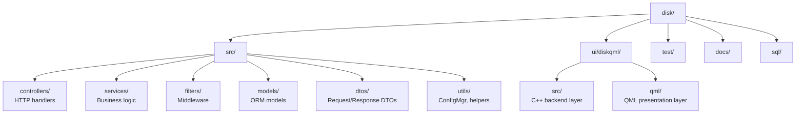
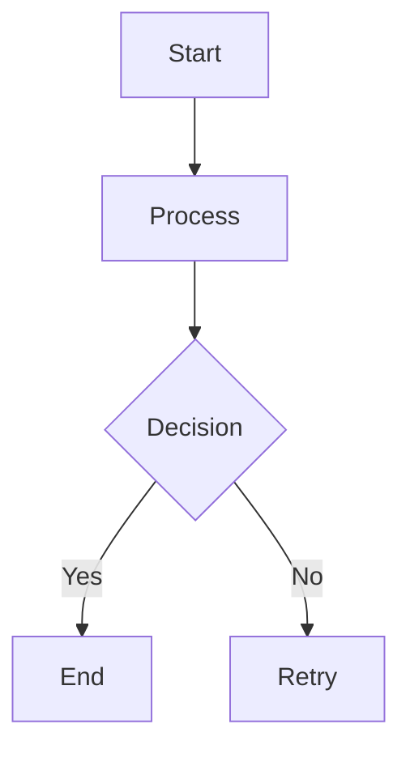

# PROJECT KNOWLEDGE BASE

**Generated:** 2026-02-17
**Stack:** C++23/Drogon + Qt 6.8/QML

## OVERVIEW

Multi-project monorepo: C++ backend (高性能网盘) + Qt/QML desktop client. JWT auth, file management, sharing, trash.

## STRUCTURE



## WHERE TO LOOK

| Task | Location |
|------|----------|
| Add API endpoint | `src/controllers/*.cpp` + `src/services/*.cpp` |
| Auth flow (JWT, tokens) | `src/services/AuthService.cpp`, `src/services/TokenService.cpp` |
| Request validation | `src/dtos/*.hpp` - `FromRequest()` static methods |
| JWT middleware | `src/filters/JwtAuthFilter.cpp` |
| File operations | `src/services/FileService.cpp`, `src/services/FolderService.cpp` |
| Redis operations | `src/services/RedisService.cpp` |
| QML views | `ui/diskqml/qml/views/` |
| QML components | `ui/diskqml/qml/components/` |
| QML viewmodels | `ui/diskqml/src/viewmodels/` |
| QML services | `ui/diskqml/src/services/` |
| QML API client | `ui/diskqml/src/api/` |
| Config | `config.json` (backend) |
| Tests | `test/` mirrors `src/` structure |

## CONVENTIONS

### C++ (Drogon Backend)

**Naming:**
- Classes/Structs: `PascalCase` → `AuthController`, `RegisterRequest`
- Functions/Methods: `PascalCase` → `Register()`, `ValidateUsername()`
- Private members: `m_snake_case` → `m_auth_service`
- Constants: `UPPER_SNAKE_CASE` → `DEFAULT_STORAGE_QUOTA`

**Signatures:**
```cpp
// Always trailing return type
auto Register(RegisterRequest request) -> drogon::Task<Result<RegisterResponse>>;
auto ValidateUsername() const -> bool;
auto GetValue() const noexcept -> const std::string&;
```

**Async:**
- All service methods return `drogon::Task<Result<T>>`
- Use `co_await` for async operations
- `drogon::async_func()` wraps coroutine lambdas for `std::function`

**DTO Pattern:**
```cpp
struct RegisterRequest {
    static auto FromRequest(const HttpRequestPtr& req) -> Result<RegisterRequest>;
private:
    auto Validate() const -> bool;
};
```

**Controller Pattern:**
```cpp
class AuthController : public drogon::HttpController<AuthController> {
    METHOD_LIST_BEGIN
        ADD_METHOD_TO(AuthController::Register, "/api/auth/register", drogon::Post);
    METHOD_LIST_END
public:
    METHOD_ADD(Register, "/register", drogon::Post);
};
```

### QML (Qt/QML Desktop Client)

**Tech Stack:**
- Qt 6.8+
- C++20
- Qt MVVM pattern (QObject + Q_PROPERTY + Q_INVOKABLE)
- QSettings for local storage

**Architecture:**
- C++ layer handles ALL business logic: API client, services, viewmodels, models, storage
- QML layer handles ONLY UI presentation: views, components, dialogs
- QML/JavaScript MUST NOT contain business logic

**Naming:** (Follow C++ backend conventions)
- Classes/Structs: `PascalCase` -> `AuthService`, `FileViewModel`
- Functions/Methods: `camelCase` (QML) / `PascalCase` (C++)
- Private members: `m_snake_case` -> `m_auth_service`
- QML properties: `camelCase` -> `userName`, `isLoggedIn`
- Signals: `camelCase` + `Changed` -> `userNameChanged`

**ViewModel Pattern:**
```cpp
class FileViewModel : public QObject {
    Q_OBJECT
    Q_PROPERTY(QString fileName READ fileName NOTIFY fileNameChanged)
public:
    Q_INVOKABLE void loadFile(const QString& fileId);
signals:
    void fileNameChanged();
};
```

**Key Principle:**
QML/JavaScript ONLY handles UI rendering. All business logic, API calls, and data processing MUST be in C++.

### Documentation

All documentation diagrams MUST use Mermaid syntax. Do NOT use ASCII box-drawing characters for diagrams.

**Diagram Types and Their Mermaid Syntax**:
- **Architecture diagrams**: Use `flowchart` or `graph` with TD/TB/LR direction
- **ER diagrams**: Use `erDiagram`
- **Flow diagrams**: Use `flowchart` with decision nodes
- **Structure diagrams**: Use `flowchart` or class structure representation

**Plain Data Tables Exception**:
Plain data tables (with `|---|` markdown table syntax) MUST remain as Markdown tables. Do NOT convert them to Mermaid.

**Example Mermaid Block**:


This ensures consistent, maintainable, and renderable documentation across all markdown files.

## ANTI-PATTERNS

- **NO** `as any`, `@ts-ignore` equivalents - no type suppression
- **NO** raw passwords in logs - always hash/redact
- **NO** blocking calls in hot paths - use `co_await`
- **NO** SQL string concatenation - use ORM or parameterized queries
- **JWT_SECRET** must come from env, never hardcoded

## COMMANDS

```bash
# Build (Linux Debug)
cmake --preset linux-debug-clang && cmake --build --preset linux-debug-clang

# Build (Linux Release)
cmake --preset linux-release-clang && cmake --build --preset linux-release-clang

# Run tests
ctest --preset linux-debug-clang -V

# Run specific test
./build/linux-debug-clang/test/disk-test --gtest_filter="PasswdHash.*"

# Format code
find src test -name '*.cpp' -o -name '*.hpp' | xargs clang-format -i

# Run backend
./build/linux-debug-clang/disk


# Build QML (Linux)
cd ui/diskqml && cmake -B build -S . && cmake --build build

# Build QML (Windows - Qt Creator)
# Open ui/diskqml/CMakeLists.txt in Qt Creator and build
# Note: After Clean/Build, ensure BuildTargets (or blank/all) = appdiskqml.
#       Verify: "Linking CXX executable appdiskqml.exe" in output.
#       CLI: cmake --build <build-dir> --target appdiskqml

# Run QML (Linux)
./ui/diskqml/build/appdiskqml

# Run QML (Windows)
./ui/diskqml/build/Desktop_Qt_6_11_0_llvm_mingw_64_bit-Debug/appdiskqml.exe
```

## ENVIRONMENT

| Variable | Purpose |
|----------|---------|
| `JWT_SECRET` | JWT signing key (REQUIRED in production, min 32 chars) |
| `MYSQL_PASSWORD` | MySQL database password (REQUIRED in production) |
| `REDIS_PASSWORD` | Redis authentication password (REQUIRED in production) |
| `DISK_SECURE_MODE` | Set to `true` or `1` to enforce production security checks |
| `VCPKG_ROOT` | vcpkg installation path |

## NOTES

- libsodium must be initialized: `sodium_init()` in main()
- Refresh tokens: single-use, stored in Redis, 7d expiry
- Access tokens: 2h expiry
- Cleanup runs hourly (expired trash)
- Argon2id for password hashing
- Account lockout: 5 failures → 15 min lock
