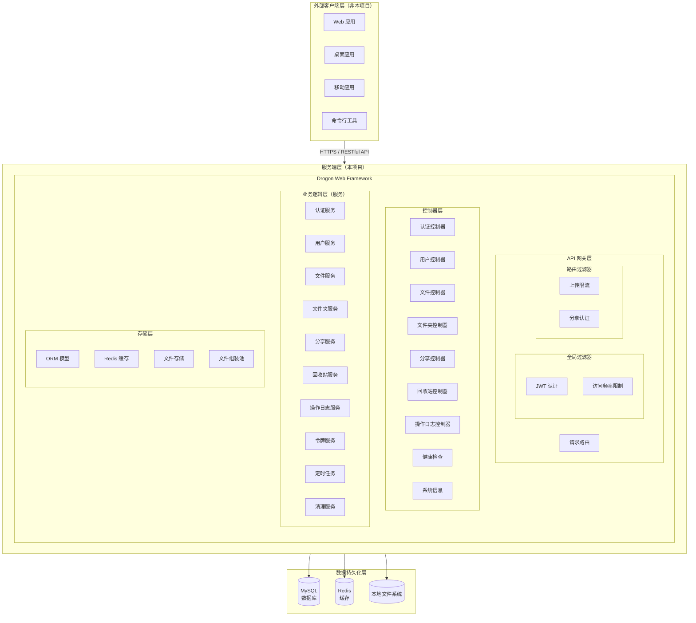
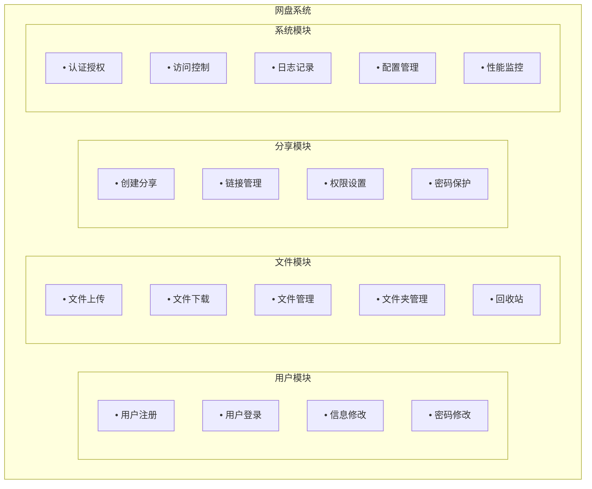
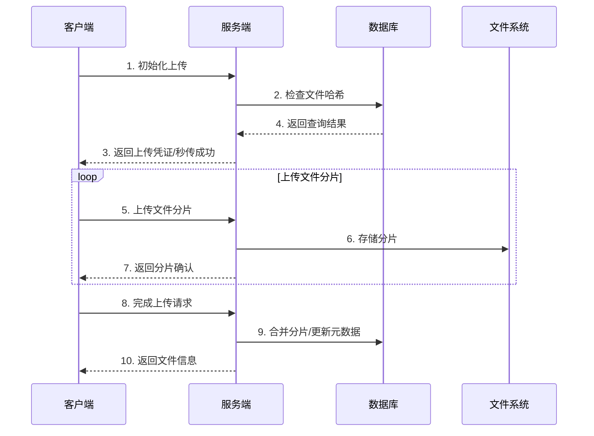
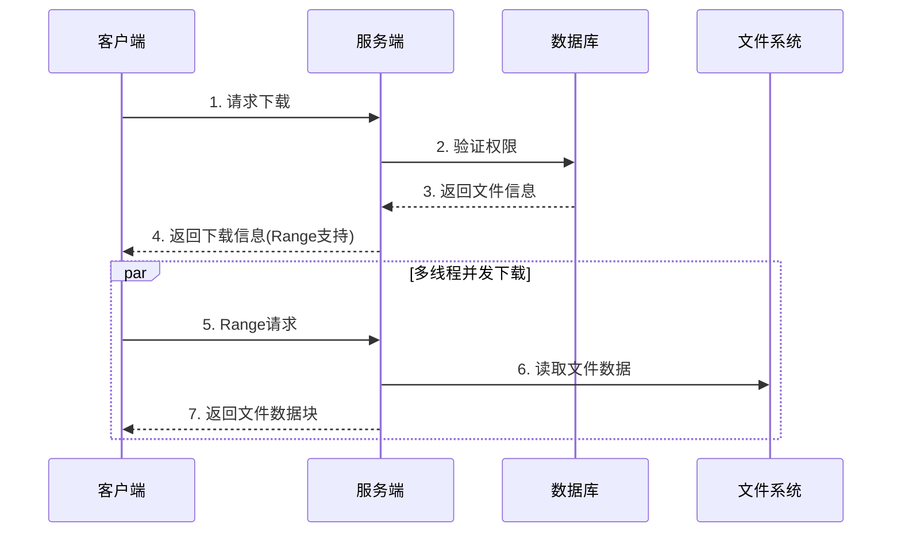
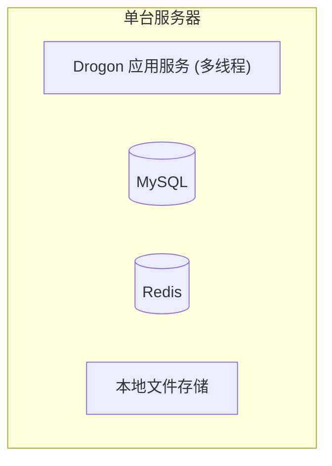

# 网盘系统 - 系统概述

## 1. 项目简介

### 1.1 项目背景

随着云计算和移动互联网的快速发展，个人和企业对于文件存储、同步和分享的需求日益增长。本项目旨在开发一个高性能、高可用的网络存储系统（网盘），为用户提供安全、便捷的文件管理服务。

### 1.2 项目目标

- **高并发支持**：单服务器支持千级用户同时在线
- **高传输效率**：上传下载速度达到网络带宽上限
- **低延迟响应**：API 接口响应时间低于 100ms（非 IO 操作）
- **数据安全**：采用加密传输和存储机制，确保用户数据安全
- **RESTful API**：提供标准化的 RESTful API，支持任意客户端（Web、桌面、移动）集成

### 1.3 适用范围

本系统适用于：
- 个人用户的私有云存储
- 小型团队的文件协作与分享
- 企业内部的文件管理平台

---

## 2. 系统架构

### 2.1 总体架构

本系统是一个基于 Drogon 框架的高性能后端服务，提供标准化的 RESTful API 供外部客户端调用：

### 2.2 架构特点

| 特性 | 说明 |
|------|------|
| RESTful API | 提供标准化的 RESTful API 接口，支持任意客户端（Web、桌面、移动）集成 |
| 异步非阻塞 | 利用 Drogon 框架的异步 IO 特性，提高并发处理能力 |
| 多层缓存 | Redis 缓存热点数据，减少数据库访问压力 |
| 水平扩展 | 无状态设计（除 Redis 存储的刷新令牌外），支持多实例部署和负载均衡 |
| 分层架构 | 控制器 → 服务 → 存储 → 数据访问的清晰分层 |
| 全局和路由过滤器 | JWT 认证、限流、分享认证等通过过滤器链实现 |

---

## 3. 技术栈

### 3.1 后端技术

| 组件 | 技术选型 | 版本 | 说明 |
|------|----------|------|------|
| Web框架 | Drogon | >= 1.9.11 | 高性能 C++ Web 框架，支持异步非阻塞 IO |
| 编程语言 | C++ | C++23 | 现代 C++ 标准，提供高性能和类型安全 |
| 数据库 | MySQL | >= 8.0 | 关系型数据库，存储用户和文件元数据 |
| 缓存 | Redis | >= 6.0 | 内存数据库，用于会话管理和热点数据缓存 |
| ORM | Drogon ORM | - | 内置 ORM 支持，简化数据库操作 |
| 包管理 | vcpkg | - | C++ 跨平台包管理器 |
| 构建工具 | CMake | >= 3.20 | 跨平台构建系统 |

### 3.2 客户端集成（非本项目）

本项目仅实现后端服务，不包含任何客户端代码。外部客户端需通过以下方式集成：

| 组件 | 推荐技术 | 说明 |
|------|----------|------|
| 通信协议 | HTTPS | 全站使用 HTTPS（TLS 1.3）进行安全通信 |
| API 认证 | JWT (Bearer Token) | Access Token（有效期 2 小时） + Refresh Token（有效期 7 天） |
| HTTP 客户端 | 任意支持 HTTPS 的库 | 如 curl、requests、axios、Qt Network 等 |
| 分片上传 | 支持 | 客户端需实现分片上传逻辑（默认 5MB 分片） |
| 断点续传 | 支持 | 客户端需保存上传状态，支持从断点继续 |
| 下载限速 | Range 请求 | 客户端通过 HTTP Range 请求实现断点续传和多线程下载 |

**注**：客户端开发由调用方自行负责，本文档仅描述后端 API 接口。

### 3.3 安全技术

| 组件 | 技术选型 | 说明 |
|------|----------|------|
| 身份认证 | JWT (JSON Web Token) | 无状态令牌认证 |
| 传输加密 | HTTPS (TLS 1.3) | 传输层加密 |
| 密码存储 | Argon2id | 抗暴力破解的密码哈希算法 |
| 令牌存储 | Redis | 刷新令牌存储和黑名单管理 |
| 访问控制 | RBAC | 基于角色的访问控制 |
---

## 4. 系统模块

### 4.1 模块划分

系统分为以下核心功能模块：

### 4.2 模块职责

#### 4.2.1 用户模块 (User Module)
- 处理用户注册、登录、登出
- 管理用户个人信息
- 密码加密存储与验证
- 用户配额管理

#### 4.2.2 文件模块 (File Module)
- 文件上传（分片上传、断点续传、秒传）
- 文件下载（多线程下载、限速控制）
- 文件操作（复制、移动、重命名、删除）
- 文件夹管理（创建、删除、目录树）
- 回收站管理（恢复、彻底删除）
- 文件去重（基于内容哈希）

#### 4.2.3 分享模块 (Share Module)
- 创建分享链接
- 设置分享有效期
- 设置访问密码
- 分享权限控制（查看/下载）
- 分享统计（访问次数、下载次数）

#### 4.2.4 系统模块 (System Module)
- JWT 令牌认证与刷新（访问令牌 2h + 刷新令牌 7d）
- 刷新令牌单次使用（刷新后旧令牌失效）
- API 访问频率限制（登录、上传等接口）
- 操作日志记录
- 系统配置管理
- 健康检查与监控
---

## 5. 数据流设计

### 5.1 文件上传流程

### 5.2 文件下载流程

---

## 6. 性能指标

### 6.1 目标指标

| 指标类型 | 指标项 | 目标值 |
|----------|--------|--------|
| 并发能力 | 同时在线用户数 | >= 1000 |
| 并发能力 | 同时传输任务数 | >= 500 |
| 响应时间 | API 平均响应时间 | < 50ms |
| 响应时间 | API P99 响应时间 | < 200ms |
| 吞吐量 | 单机 QPS | >= 5000 |
| 传输速度 | 上传速度 | 网络带宽上限 |
| 传输速度 | 下载速度 | 网络带宽上限 |
| 可用性 | 系统可用率 | >= 99.9% |

### 6.2 优化策略

1. **异步非阻塞 IO**
   - 使用 Drogon 的协程和异步 API
   - 避免阻塞操作影响整体吞吐量

2. **连接池技术**
   - 数据库连接池复用
   - Redis 连接池复用

3. **缓存优化**
   - Redis 缓存用户会话和热点数据
   - 本地缓存配置信息

4. **数据库优化**
   - 合理设计索引
   - 查询语句优化
   - 读写分离（可选）

5. **文件传输优化**
   - 分片并行上传
   - 多线程并行下载
   - 零拷贝传输（sendfile）

---

## 7. 安全设计

### 7.1 认证机制

- **JWT 令牌认证**：用户登录后颁发 JWT 令牌，后续请求携带令牌进行身份验证
- **令牌刷新**：Access Token 短期有效，Refresh Token 用于刷新
- **登出处理**：令牌加入黑名单（Redis 存储）

### 7.2 数据安全

- **传输加密**：全站 HTTPS，使用 TLS 1.3 协议
- **密码存储**：使用 Argon2 算法加盐哈希存储
- **敏感信息**：配置文件加密存储，环境变量隔离

### 7.3 访问控制

- **访问频率限制**：基于 IP 和用户的请求频率限制，防止暴力攻击
- **文件类型检测**：上传文件类型白名单校验
- **权限验证**：文件操作前验证用户权限

### 7.4 安全防护

- **SQL 注入防护**：使用 ORM 参数化查询
- **XSS 防护**：输入输出过滤
- **CSRF 防护**：请求来源验证

---

## 8. 部署架构

### 8.1 单机部署

适用于小规模部署场景：

### 8.2 推荐配置

| 组件 | 最低配置 | 推荐配置 |
|------|----------|----------|
| CPU | 4 核 | 8 核 |
| 内存 | 8 GB | 16 GB |
| 磁盘 | 100 GB SSD | 500 GB+ SSD |
| 网络 | 100 Mbps | 1 Gbps |
| 操作系统 | Ubuntu 22.04 / Windows Server 2022 | - |

---

## 9. 版本规划

| 版本 | 功能范围 | 预计时间 |
|------|----------|----------|
| v0.1 | 基础框架搭建、用户认证 | - |
| v0.2 | 文件上传下载基础功能 | - |
| v0.3 | 文件夹管理、回收站 | - |
| v0.4 | 文件分享功能 | - |
| v0.5 | 性能优化、安全加固 | - |
| v1.0 | 完整功能、全面测试 | - |

---

## 10. 术语表

| 术语 | 英文 | 说明 |
|------|------|------|
| 分片上传 | Chunked Upload | 将大文件分割成小块逐个上传 |
| 断点续传 | Resume Upload | 中断后从上次位置继续上传 |
| 秒传 | Instant Upload | 通过文件哈希匹配已存在的文件，跳过上传 |
| 文件去重 | Deduplication | 相同内容的文件只存储一份 |
| JWT | JSON Web Token | 一种用于身份验证的令牌格式 |
| ORM | Object-Relational Mapping | 对象关系映射，简化数据库操作 |
| RESTful | Representational State Transfer | 一种 API 设计风格 |
| QPS | Queries Per Second | 每秒查询数，衡量系统吞吐量 |
| Argon2id | 密码哈希算法 | 抗 GPU/ASIC 攻击的内存硬化算法 |
