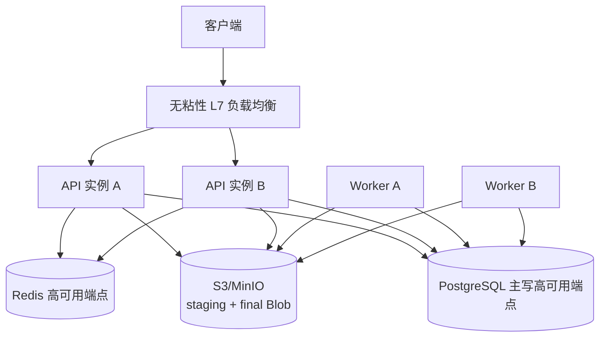
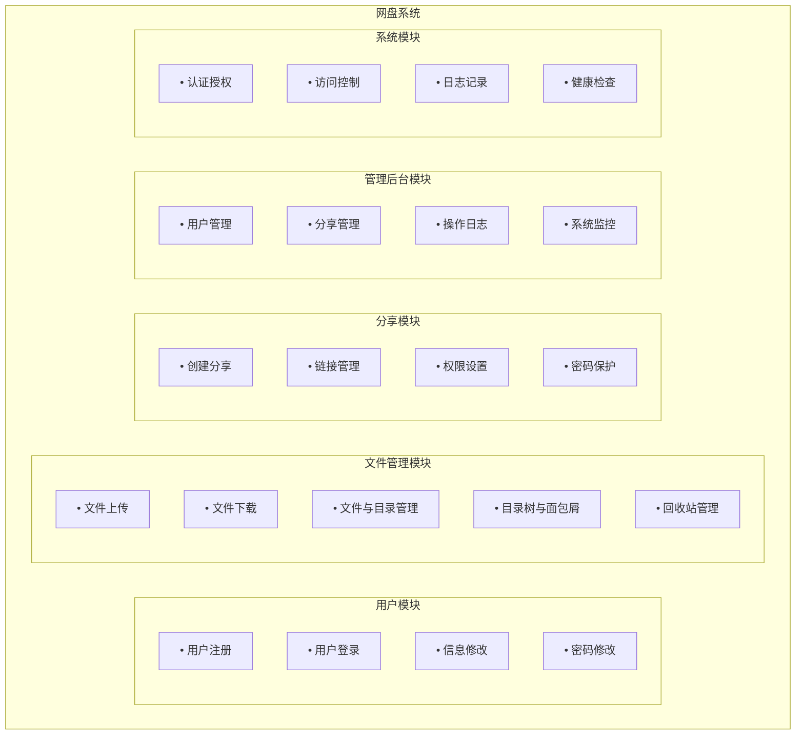
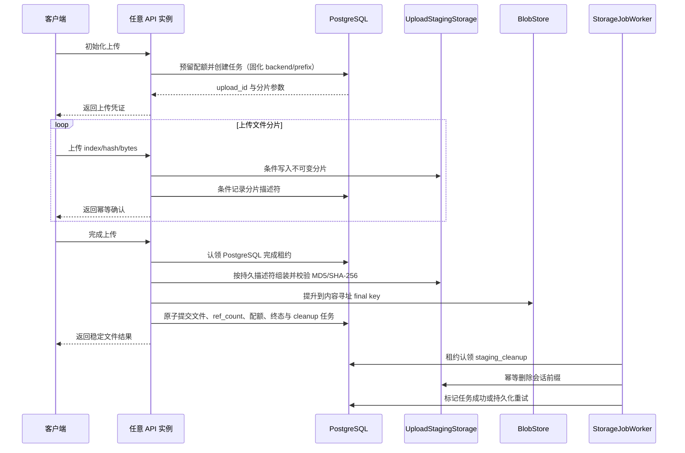
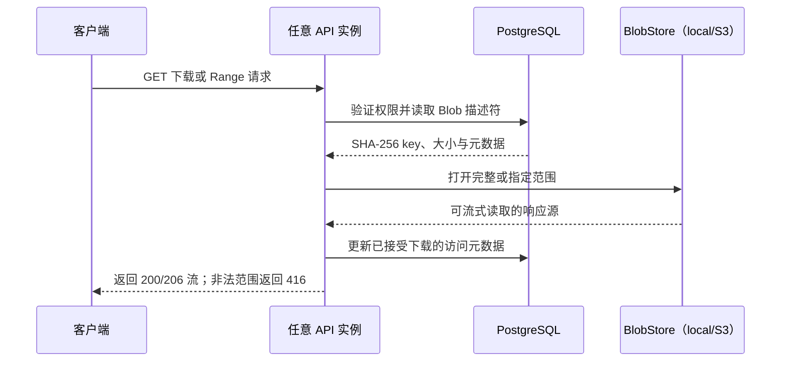
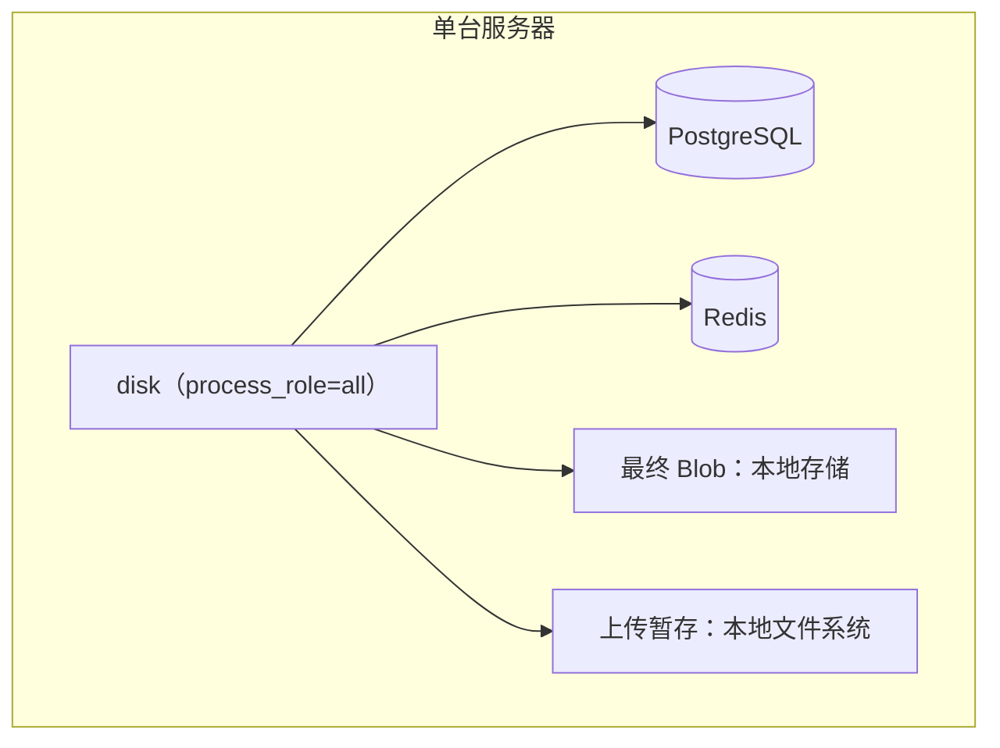

# 网盘系统 - 系统概述

## 1. 项目简介

### 1.1 项目背景

随着云计算和移动互联网的快速发展，个人和企业对于文件存储、同步和分享的需求日益增长。本项目旨在开发一个高性能、高可用的网络存储系统（网盘），为用户提供安全、便捷的文件管理服务。

### 1.2 项目目标

- **高并发支持**：单服务器支持千级用户同时在线
- **高传输效率**：上传下载速度达到网络带宽上限
- **低延迟响应**：API 接口响应时间低于 100ms（非 IO 操作）
- **数据安全**：采用加密传输和存储机制，确保用户数据安全
- **RESTful API**：提供标准化的 RESTful API，支持任意客户端（Web、桌面、移动）集成

### 1.3 适用范围

本系统适用于：
- 个人用户的私有云存储
- 小型团队的文件协作与分享
- 企业内部的文件管理平台

---

## 2. 系统架构

### 2.1 总体架构

后端使用同一个 `disk` 制品按 `api`、`worker` 或本地开发用 `all` 角色启动。API 负责同步请求与上传完成租约内的组装/提升，Worker 负责认领持久存储任务和播种周期任务：

```mermaid
flowchart TB
    subgraph Clients["客户端层"]
        WebApp["Web 应用"]
        Desktop["桌面应用"]
        Mobile["移动应用"]
        CLI["命令行工具"]
    end

    LB["无粘性 L7 负载均衡"]

    subgraph Artifact["同一 disk 制品"]
        subgraph ApiRole["API 角色（可水平扩容）"]
            HttpApi["Drogon HTTP API"]
            Filters["JWT / 分享鉴权 / 限流"]
            Controllers["控制器与 DTO"]
            Services["认证、文件、分享、回收站、管理服务"]
            StagingPort["UploadStagingStorage"]
            BlobPort["BlobStore"]
            AssemblyLimiter["AssemblyConcurrencyLimiter<br/>仅本机容量保护"]

            HttpApi --> Filters --> Controllers --> Services
            Services --> StagingPort
            Services --> BlobPort
            StagingPort --> AssemblyLimiter
        end

        subgraph WorkerRole["Worker 角色（可水平扩容）"]
            JobSeeder["ScheduledTasks<br/>仅播种持久周期任务"]
            JobWorker["StorageJobWorker<br/>租约认领 / 重试 / 接管"]
            WorkerStaging["UploadStagingStorage"]
            WorkerBlob["BlobStore"]

            JobWorker --> WorkerStaging
            JobWorker --> WorkerBlob
        end
    end

    subgraph SharedData["持久化与共享基础设施"]
        PostgreSQL[("PostgreSQL<br/>业务状态 / 租约 / 持久任务")]
        Redis[("Redis<br/>令牌状态 / 缓存 / 限流")]
        StorageBackend[("存储实现<br/>local（单机）或 S3/MinIO（分布式）")]
    end

    WebApp --> LB
    Desktop --> LB
    Mobile --> LB
    CLI --> LB
    LB -->|"HTTPS / RESTful API"| HttpApi
    Services --> PostgreSQL
    Services --> Redis
    StagingPort --> StorageBackend
    BlobPort --> StorageBackend
    JobSeeder --> PostgreSQL
    JobWorker --> PostgreSQL
    WorkerStaging --> StorageBackend
    WorkerBlob --> StorageBackend
```



默认开发配置的 `process_role=all` 会在一个进程中组合 API 与 Worker 职责，并可使用 local/local 存储。生产分布式配置必须拆分显式角色，所有 API/Worker 共享 PostgreSQL 与 S3/MinIO；API 不播种集群级周期任务，`AssemblyConcurrencyLimiter` 也不承担跨实例或同一上传的互斥。

### 2.2 架构特点

| 特性 | 说明 |
|------|------|
| RESTful API | 提供标准化的 RESTful API 接口，支持任意客户端（Web、桌面、移动）集成 |
| 异步非阻塞 | 利用 Drogon 框架的异步 IO 特性，提高并发处理能力 |
| 多层缓存 | Redis 缓存热点数据，减少数据库访问压力 |
| 水平扩展 | PostgreSQL 完成租约、S3 上传暂存和独立 Worker 已落地；进程内组装限流不保存任务标识。生产级无粘性多实例仍以目标环境灰度、故障接管和一致性验收为准 |
| 分层架构 | 控制器 → 服务 → 存储 → 数据访问的清晰分层 |
| 全局和路由过滤器 | JWT 认证、限流、分享认证等通过过滤器链实现 |

### 2.3 分布式参考架构

分布式重构采用“可横向扩容的模块化单体”，不立即拆分微服务。API 与 Worker 使用同一制品、不同运行角色；代码与仓库级验收已具备该拓扑，生产启用仍受 ADR-002 的目标环境灰度、恢复和一致性门禁约束：



核心边界如下：

- PostgreSQL 保存上传状态机、完成租约、配额、内容引用和持久任务，是业务状态的唯一事实来源。
- Redis 保存可重建缓存、刷新/撤销状态和限流数据，不作为上传任务所有权来源。
- S3/MinIO 同时保存上传分片暂存和最终 Blob，同一上传的请求可以到达任意 API 实例。
- Worker 使用数据库任务认领和到期接管执行清理、Blob GC、过期上传及一致性对账。
- 当前能力与目标能力的决策、迁移和验收合同见 `ADR-002-分布式后端与上传状态机.md`。

---

## 3. 技术栈

### 3.1 后端技术

| 组件 | 技术选型 | 版本 | 说明 |
|------|----------|------|------|
| Web框架 | Drogon | >= 1.9.11 | 高性能 C++ Web 框架，支持异步非阻塞 IO |
| 编程语言 | C++ | C++23 | 现代 C++ 标准，提供高性能和类型安全 |
| 数据库 | PostgreSQL | >= 14 | 关系型数据库，存储用户和文件元数据 |
| 缓存 | Redis | >= 6.0 | 内存数据库，用于会话管理和热点数据缓存 |
| ORM | Drogon ORM | - | 内置 ORM 支持，兼容 PostgreSQL，简化数据库操作 |
| 包管理 | vcpkg | - | C++ 跨平台包管理器 |
| 构建工具 | CMake | >= 3.20 | 跨平台构建系统 |

### 3.2 客户端集成

本项目后端通过 RESTful API 对外提供服务，仓库中同时包含基于 Qt/QML 的桌面客户端。其他客户端也可按同一接口规范接入：

| 组件 | 推荐技术 | 说明 |
|------|----------|------|
| 通信协议 | HTTPS | 全站使用 HTTPS（TLS 1.3）进行安全通信 |
| API 认证 | JWT (Bearer Token) | Access Token（有效期 2 小时） + Refresh Token（有效期 7 天） |
| HTTP 客户端 | 任意支持 HTTPS 的库 | 如 curl、requests、axios、Qt Network 等 |
| 分片上传 | 支持 | 客户端需实现分片上传逻辑（默认 5MB 分片） |
| 断点续传 | 支持 | 客户端需保存上传状态，支持从断点继续 |
| 下载限速 | Range 请求 | 客户端通过 HTTP Range 请求实现断点续传和多线程下载 |

**注**：本节描述后端 API 对客户端的集成要求，桌面客户端的界面结构和交互细节见 `docs/desktop/`。

### 3.3 安全技术

| 组件 | 技术选型 | 说明 |
|------|----------|------|
| 身份认证 | JWT (JSON Web Token) | JWT 携带身份声明；撤销与刷新状态由共享 Redis 校验 |
| 传输加密 | HTTPS (TLS 1.3) | 传输层加密 |
| 密码存储 | Argon2id | 抗暴力破解的密码哈希算法 |
| 令牌存储 | Redis | 刷新令牌存储和黑名单管理 |
| 访问控制 | RBAC | 基于角色的访问控制 |
---

## 4. 系统模块

### 4.1 模块划分

系统分为以下核心功能模块：



### 4.2 模块职责

#### 4.2.1 用户模块 (User Module)
- 处理用户注册、登录、登出
- 管理用户个人信息
- 密码加密存储与验证
- 用户配额管理

#### 4.2.2 文件管理模块 (File Module)
- 文件上传（分片上传、断点续传、秒传）
- 文件下载（Range 断点下载、流式传输）
- 文件操作（复制、移动、重命名、搜索、删除）
- 文件夹管理（创建、重命名、目录树、面包屑路径）
- 回收站管理（软删除、恢复、彻底删除、清空、过期清理）
- 文件去重（基于内容哈希）

#### 4.2.3 分享模块 (Share Module)
- 创建分享链接
- 设置分享有效期
- 设置访问密码
- 分享权限控制（查看/下载）
- 分享统计（访问次数、下载次数）

#### 4.2.4 管理后台模块 (Admin Module)
- 用户列表、用户详情、状态变更、角色变更和软删除
- 全平台分享列表、分享详情和强制取消分享
- 当前账号操作日志查询和详情查看
- 存储统计、概览统计和系统运行状态监控

#### 4.2.5 系统模块 (System Module)
- JWT 令牌认证与刷新（访问令牌 2h + 刷新令牌 7d）
- 刷新令牌单次使用（刷新后旧令牌失效）
- API 访问频率限制（登录、上传等接口）
- 操作日志记录
- 健康检查与系统信息查询
---

## 5. 数据流设计

### 5.1 文件上传流程

下图描述非秒传上传；初始化、分片和完成请求均可由任意 API 实例处理，任务所有权只由 PostgreSQL 完成租约决定：



### 5.2 文件下载流程



---

## 6. 性能指标

### 6.1 目标指标

| 指标类型 | 指标项 | 目标值 |
|----------|--------|--------|
| 并发能力 | 同时在线用户数 | >= 1000 |
| 并发能力 | 同时传输任务数 | >= 500 |
| 响应时间 | API 平均响应时间 | < 50ms |
| 响应时间 | API P99 响应时间 | < 200ms |
| 吞吐量 | 单机 QPS | >= 5000 |
| 传输速度 | 上传速度 | 网络带宽上限 |
| 传输速度 | 下载速度 | 网络带宽上限 |
| 可用性 | 系统可用率 | >= 99.9% |

### 6.2 优化策略

1. **异步非阻塞 IO**
   - 使用 Drogon 的协程和异步 API
   - 避免阻塞操作影响整体吞吐量

2. **连接池技术**
   - 数据库连接池复用
   - Redis 连接池复用

3. **缓存优化**
   - Redis 缓存用户会话和热点数据
   - 本地缓存配置信息

4. **数据库优化**
   - 合理设计索引
   - 查询语句优化
   - 读写分离（可选）

5. **文件传输优化**
   - 分片并行上传
   - 多线程并行下载
   - 零拷贝传输（sendfile）

---

## 7. 安全设计

### 7.1 认证机制

- **JWT 令牌认证**：用户登录后颁发 JWT 令牌，后续请求携带令牌进行身份验证
- **令牌刷新**：Access Token 短期有效，Refresh Token 用于刷新
- **登出处理**：令牌加入黑名单（Redis 存储）

### 7.2 数据安全

- **传输加密**：全站 HTTPS，使用 TLS 1.3 协议
- **密码存储**：使用 Argon2 算法加盐哈希存储
- **敏感信息**：配置文件加密存储，环境变量隔离

### 7.3 访问控制

- **访问频率限制**：基于 IP 和用户的请求频率限制，防止暴力攻击
- **文件类型检测**：上传文件类型白名单校验
- **权限验证**：文件操作前验证用户权限
- **角色控制（RBAC）**：用户表 role 字段区分两级角色（0=普通用户，1=管理员）。管理员调用 `/api/admin/*` 接口需通过 `AdminAuthFilter` 二次鉴权

### 7.4 安全防护

- **SQL 注入防护**：使用 ORM 参数化查询
- **XSS 防护**：输入输出过滤
- **CSRF 防护**：请求来源验证

---

## 8. 部署架构

### 8.1 单机部署

适用于小规模部署场景：



### 8.2 分布式参考部署

生产级多实例部署以 ADR-002 为准：至少两个无粘性 API 实例、两个可接管 Worker、PostgreSQL 单写高可用端点、Redis 高可用端点和跨节点共享的 S3/MinIO。API 实例不执行集群级周期任务，本地目录不保存生产上传状态；拓扑见 2.3 节，部署夹具和安全边界见 `05-部署运维指南.md`。

S3 原生暂存、数据库完成租约和持久 Worker 已在代码及仓库级测试中落地，但这不等于生产验收。只有目标环境灰度、故障接管、备份恢复和全量一致性门禁均有证据后，才能把该部署标记为生产级分布式；单纯启动多个二进制不构成验收。

### 8.3 单实例推荐配置

| 组件 | 最低配置 | 推荐配置 |
|------|----------|----------|
| CPU | 4 核 | 8 核 |
| 内存 | 8 GB | 16 GB |
| 磁盘 | 100 GB SSD | 500 GB+ SSD |
| 网络 | 100 Mbps | 1 Gbps |
| 操作系统 | Ubuntu 22.04 / Windows Server 2022 | - |

---

## 9. 版本规划

| 版本 | 功能范围 | 预计时间 |
|------|----------|----------|
| v0.1 | 基础框架搭建、用户认证 | - |
| v0.2 | 文件上传下载基础功能 | - |
| v0.3 | 文件夹管理、文件生命周期与回收站 | - |
| v0.4 | 文件分享功能 | - |
| v0.5 | 性能优化、安全加固 | - |
| v1.0 | 完整功能、全面测试 | - |

---

## 10. 术语表

| 术语 | 英文 | 说明 |
|------|------|------|
| 分片上传 | Chunked Upload | 将大文件分割成小块逐个上传 |
| 断点续传 | Resume Upload | 中断后从上次位置继续上传 |
| 秒传 | Instant Upload | 通过文件哈希匹配已存在的文件，跳过上传 |
| 文件去重 | Deduplication | 相同内容的文件只存储一份 |
| JWT | JSON Web Token | 一种用于身份验证的令牌格式 |
| ORM | Object-Relational Mapping | 对象关系映射，简化数据库操作 |
| RESTful | Representational State Transfer | 一种 API 设计风格 |
| QPS | Queries Per Second | 每秒查询数，衡量系统吞吐量 |
| Argon2id | 密码哈希算法 | 抗 GPU/ASIC 攻击的内存硬化算法 |

---

## 11. 管理员模块

### 11.1 模块概述

管理员模块提供系统级管理功能，仅限 `role=1` 的管理员用户访问。模块入口为 `AdminController`，业务逻辑由 `AdminService` 处理，`AdminAuthFilter` 负责权限校验。

### 11.2 组件说明

| 组件 | 类型 | 说明 |
|------|------|------|
| `AdminController` | 控制器 | 处理 `/api/admin/*` 路由，接收 HTTP 请求并转发至 AdminService |
| `AdminService` | 服务层 | 实现管理员业务逻辑（用户管理、分享管理、存储统计、系统概览等），返回 `drogon::Task<Result<T>>` |
| `AdminAuthFilter` | 路由过滤器 | 验证请求用户 `role=1`，否则返回 403 Forbidden |

### 11.3 鉴权流程

管理员接口的鉴权采用两级过滤器链：

```
JwtAuthFilter（身份认证）→ AdminAuthFilter（角色授权）→ AdminController
```

1. **JwtAuthFilter**：验证 JWT Bearer Token，确认请求来自已登录用户
2. **AdminAuthFilter**：检查已认证用户的 `role` 字段，仅允许 `role=1` 的管理员通过
3. **AdminController**：接收通过两级认证的请求，调用 AdminService 完成业务处理

### 11.4 数据模型

用户角色通过 `users` 表的 `role` 字段区分：

| role 值 | 含义 | 访问范围 |
|---------|------|----------|
| 0 | 普通用户 | 常规用户接口（文件、目录、分享、回收站等） |
| 1 | 管理员 | `/api/admin/*` 管理接口；桌面端进入独立 AdminShell |

初始化脚本 `sql/init.sql` 中包含管理员种子用户，默认管理员账号 `admin` / 初始密码由配置文件指定。

### 11.5 设计原则

- 控制器仅负责请求解析和响应构造，不含业务逻辑
- DTO 基类只暴露实际 `FromRequest`/`ToJson` 合同使用的共享解析与序列化 helper，不为单元测试或未来假设保留无生产调用的重载
- 服务层返回 `Result<T>`，错误通过 `std::unexpected` 传递，不使用异常
- 共享服务头文件不保留无任何构造、抛出或捕获路径的业务异常类型；文件变更等业务失败必须继续使用 `ErrorInfo`/`Result<T>` 显式回传
- 过滤器通过 `request->attributes()` 获取当前用户信息（`user_id`、`username`、`role`）
- `JwtAuthFilter` 由唯一的全局 `GlobalFilters` 插件实例执行，`AdminController` 路由仅追加 `AdminAuthFilter` 与管理员限流过滤器，匹配路径 `/api/admin/*`
