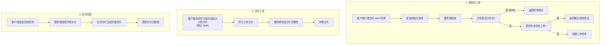
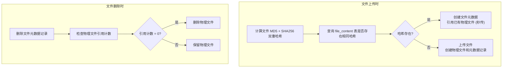

# 网盘系统 - 功能需求规格

## 1. 文档说明

### 1.1 文档目的

本文档详细描述网盘系统的功能需求规格，作为系统设计和开发的依据。

### 1.2 需求优先级说明

| 优先级 | 标识 | 说明 |
|--------|------|------|
| 高 | P0 | 核心功能，必须实现 |
| 中 | P1 | 重要功能，应该实现 |
| 低 | P2 | 增强功能，可选实现 |

---

## 2. 用户管理模块

### 2.1 用户注册 [P0]

#### 2.1.1 功能描述

新用户可以通过提供用户名、邮箱和密码创建账户。

#### 2.1.2 功能流程

```
开始 -> 输入注册信息 -> 参数校验 -> 检查用户名/邮箱唯一性
     -> 密码加密存储 -> 创建用户记录 -> 分配默认存储空间 -> 结束
```

#### 2.1.3 输入参数

| 参数名 | 类型 | 必填 | 校验规则 | 说明 |
|--------|------|------|----------|------|
| username | string | 是 | 4-32字符，字母数字下划线 | 用户名 |
| email | string | 是 | 有效邮箱格式 | 电子邮箱 |
| password | string | 是 | 8-64字符，含大小写字母和数字 | 密码 |

#### 2.1.4 业务规则

1. 用户名全局唯一，不区分大小写
2. 邮箱全局唯一
3. 密码使用 Argon2id 算法加盐哈希存储（cost factor >= 12）
4. 新用户默认分配存储空间配额（默认 10 GB）
5. 注册成功后自动创建用户根目录

**当前状态**: ✅ 已实现
#### 2.1.5 异常处理

| 错误场景 | 错误码 | 错误信息 |
|----------|--------|----------|
| 用户名已存在 | 40001 | 用户名已被注册 |
| 邮箱已存在 | 40002 | 邮箱已被注册 |
| 参数校验失败 | 10002 | 参数验证失败 |
| 系统错误 | 10006 | 注册失败，请稍后重试 |

---

### 2.2 用户登录 [P0]

#### 2.2.1 功能描述

已注册用户通过用户名/邮箱和密码进行身份验证，获取访问令牌。

#### 2.2.2 功能流程

```
开始 -> 输入登录信息 -> 查询用户 -> 验证密码
     -> 生成JWT令牌 -> 记录登录日志 -> 返回令牌 -> 结束
```

#### 2.2.3 输入参数

| 参数名 | 类型 | 必填 | 说明 |
|--------|------|------|------|
| account | string | 是 | 用户名或邮箱 |
| password | string | 是 | 密码 |

#### 2.2.4 输出结果

| 参数名 | 类型 | 说明 |
|--------|------|------|
| access_token | string | 访问令牌（有效期 2 小时） |
| refresh_token | string | 刷新令牌（有效期 7 天） |
| expires_in | integer | 访问令牌过期时间（秒） |
| user | object | 用户基本信息 |

#### 2.2.5 业务规则

1. 支持用户名或邮箱登录
2. 密码错误次数限制：5分钟内错误5次锁定账户15分钟
3. 登录成功后生成 JWT 令牌对（Access Token + Refresh Token）
4. 记录登录时间、IP 地址、设备信息

**当前状态**: ✅ 已实现
#### 2.2.6 异常处理

| 错误场景 | 错误码 | 错误信息 |
|----------|--------|----------|
| 用户不存在 | 40100 | 用户不存在 |
| 密码错误 | 40101 | 用户名或密码错误 |
| 账户被锁定 | 40102 | 账户已锁定，请稍后重试 |
| 账户被禁用 | 40103 | 账户已被禁用 |

---

### 2.3 令牌刷新 [P0]

#### 2.3.1 功能描述

使用 Refresh Token 获取新的 Access Token，实现无感刷新。

#### 2.3.2 输入参数

| 参数名 | 类型 | 必填 | 说明 |
|--------|------|------|------|
| refresh_token | string | 是 | 刷新令牌 |

#### 2.3.3 业务规则

1. Refresh Token 有效时返回新的 Access Token
2. Refresh Token 即将过期（剩余时间 < 1 天）时同时返回新的 Refresh Token
3. Refresh Token 无效或过期时需重新登录

#### 2.3.4 实现说明

**技术实现**:
- 使用 Refresh Token 的 JTI（JWT ID）作为唯一标识
- 验证 Refresh Token 时检查 Redis 黑名单
- 生成新的 Access Token，Refresh Token 可选择性更新

**Redis Key 设计**:
```
Key: token:blacklist:{jti}
Type: String
TTL: 令牌剩余有效期
Value: "revoked"
```

**实现优先级**: P0（核心功能）
**当前状态**: ✅ 已实现

---

### 2.4 用户登出 [P0]

#### 2.4.1 功能描述

用户主动登出，使当前令牌失效。

#### 2.4.2 业务规则

1. 将当前 Access Token 和 Refresh Token 加入黑名单
2. 黑名单存储在 Redis 中，过期时间为令牌剩余有效期
3. 可选：清除用户的会话缓存
4. 可选：清除所有设备的登录会话

#### 2.4.3 实现说明

**Redis 黑名单实现流程**:

```cpp
// 1. 从 Access Token 提取 JTI（JWT ID）
const auto jti_access = ExtractJTI(access_token);

// 2. 计算 Access Token 剩余有效期
const auto ttl_access = GetTokenRemainingTime(access_token);

// 3. 将 Access Token 加入黑名单
co_await redis_client->setex("token:blacklist:" + jti_access, ttl_access, "revoked");

// 4. 对 Refresh Token 重复上述步骤
const auto jti_refresh = ExtractJTI(refresh_token);
const auto ttl_refresh = GetTokenRemainingTime(refresh_token);
co_await redis_client->setex("token:blacklist:" + jti_refresh, ttl_refresh, "revoked");
```

**JwtAuthFilter 修改**:

在 JWT 验证签名后，增加黑名单检查：

```cpp
// 1. 验证 JWT 签名
auto verify_result = m_token_service->VerifyAccessToken(token);
if (!verify_result) {
    co_return Response::Error(verify_result.error());
}

// 2. 提取 JTI（JWT ID）
const auto jti = ExtractJTI(token);

// 3. 检查 Redis 黑名单
if (co_await m_token_service->IsBlacklisted(jti)) {
    co_return Response::Error(ErrorInfo(ErrorCode::TokenRevoked));
}

// 4. 验证通过，继续处理
auto [user_id, username] = verify_result.value();
```

**实现优先级**: P0（核心功能）
**当前状态**: ✅ 已实现

---

### 2.5 个人信息管理 [P1]

#### 2.5.1 查看个人信息

返回当前用户的详细信息。

| 字段 | 类型 | 说明 |
|------|------|------|
| id | integer | 用户 ID |
| username | string | 用户名 |
| email | string | 邮箱 |
| nickname | string | 昵称 |
| avatar | string | 头像 URL |
| storage_used | integer | 已用存储空间（字节） |
| storage_quota | integer | 存储空间配额（字节） |
| created_at | datetime | 注册时间 |

#### 2.5.2 修改个人信息

**接口方法**：PATCH /api/user/profile（局部更新语义）

可修改字段：

| 字段 | 类型 | 校验规则 |
|------|------|----------|
| nickname | string | 2-32 字符 |
| avatar | string | 头像 URL（当前阶段仅支持 URL） |

**说明**：仅允许更新 nickname 和 avatar 字段，用户名、邮箱等核心字段不可修改。

**当前状态**: ✅ 已实现

---

### 2.6 修改密码 [P1]

#### 2.6.1 功能描述

用户修改登录密码。

#### 2.6.2 输入参数

| 参数名 | 类型 | 必填 | 说明 |
|--------|------|------|------|
| old_password | string | 是 | 当前密码 |
| new_password | string | 是 | 新密码，8-64字符 |

#### 2.6.3 业务规则

1. 必须验证当前密码正确
2. 新密码不能与当前密码相同
3. 密码修改成功后使该用户所有令牌失效（可选）

**当前状态**: ✅ 已实现

---

### 2.7 频率限制 [P0]

#### 2.7.1 登录频率限制

**目的**: 防止暴力破解攻击，保护账户安全。

**Redis Key 设计**:
```
Key: rate:login:{ip_address}
Type: String (计数器)
TTL: 300 秒（5 分钟）
Value: 失败尝试次数
```

**业务规则**:

1. **失败计数**: 每次登录失败时，增加对应 IP 的计数器
2. **阈值触发**: 5 分钟内失败 5 次后，返回 TooManyRequests 错误
3. **成功重置**: 登录成功后，清除该 IP 的失败计数器
4. **独立计数**: 不同 IP 地址独立计数，互不影响

**Redis 实现示例**:

```cpp
// 在 AuthService::Login() 开始时检查
auto redis_client = drogon::app().getRedisClient();

// 使用 Redis 原子操作：INCR + EXPIRE
const auto ip = request->getPeerAddr().toIpPort();
const auto rate_key = "rate:login:" + ip;

// 原子递增计数器
const auto count = co_await redis_client->incr(rate_key);

// 首次递增时设置过期时间（原子操作）
if (count == 1) {
    co_await redis_client->expire(rate_key, 300);  // 5 分钟
}

// 检查是否超过阈值
if (count > 5) {
    LOG_WARN << "IP 登录频率超限: " << ip;
    co_return std::unexpected(ErrorInfo(ErrorCode::TooManyRequests,
        "登录尝试过于频繁，请 5 分钟后重试"));
}

// 如果登录成功，清除计数器
// (在登录成功逻辑中执行)
co_await redis_client->del(rate_key);
```

**实现优先级**: P0（安全功能）
**当前状态**: ✅ 已实现

#### 2.7.2 API 频率限制

**限制规则**:

| 接口类型 | 限制规则 | 计数粒度 | TTL |
|---------|---------|---------|-----|
| 认证接口 | 10 次/分钟/IP | IP 地址 | 60 秒 |
| 普通接口 | 100 次/分钟/用户 | 用户 ID | 60 秒 |
| 上传接口 | 60 次/分钟/用户 | 用户 ID | 60 秒 |
| 下载接口 | 无限制 | - | - |

**Redis Key 设计**:
```
Key: rate:api:{user_id}
Type: String (计数器)
TTL: 60 秒（1 分钟）
Value: API 请求次数
```

**实现策略**:

1. **中间件拦截**: 创建 RateLimitFilter，在所有受保护的 API 端点执行
2. **令牌桶算法**: 使用 Redis 的 INCR 和 EXPIRE 实现简单的令牌桶
3. **响应头**: 返回 `X-RateLimit-Limit`、`X-RateLimit-Remaining`、`X-RateLimit-Reset` 头

**实现优先级**: P1（性能和安全功能）
**当前状态**: ✅ 已实现（登录频率限制、上传频率限制）


## 3. 文件管理模块

### 3.1 文件上传 [P0]

#### 3.1.1 功能概述

支持大文件分片上传、断点续传和秒传功能。

**当前状态**: ✅ 已实现
#### 3.1.2 上传流程



#### 3.1.3 初始化上传

**请求参数：**

| 参数名 | 类型 | 必填 | 说明 |
|--------|------|------|------|
| filename | string | 是 | 文件名 |
| file_size | integer | 是 | 文件大小（字节） |
| file_hash | string | 是 | 文件 MD5 哈希 |
| parent_id | integer | 否 | 父文件夹 ID，默认为根目录 |

**响应结果：**

| 参数名 | 类型 | 说明 |
|--------|------|------|
| upload_id | string | 上传任务 ID（非秒传时返回） |
| chunk_size | integer | 分片大小（字节） |
| uploaded_chunks | array | 已上传的分片索引列表（断点续传时返回） |
| instant_upload | boolean | 是否秒传成功 |
| file | object | 文件信息（秒传成功时返回） |

**业务规则：**

1. 检查用户存储空间是否足够
2. 检查文件哈希是否已存在（秒传检测）
3. 如果文件哈希存在且用户有权限，直接创建文件引用（秒传）
4. 如果存在未完成的同名上传任务，返回已上传分片列表（断点续传）
5. 分片大小默认 5MB，可根据文件大小动态调整

#### 3.1.4 上传分片

**请求参数：**

| 参数名 | 类型 | 必填 | 说明 |
|--------|------|------|------|
| upload_id | string | 是 | 上传任务 ID |
| chunk_index | integer | 是 | 分片索引（从 0 开始） |
| chunk_hash | string | 是 | 分片 MD5 哈希 |
| chunk_data | binary | 是 | 分片二进制数据 |

**业务规则：**

1. 验证分片哈希完整性
2. 支持并行上传，无需按顺序
3. 重复上传同一分片会覆盖（幂等性）
4. 分片临时存储，上传完成前定期清理超时任务

#### 3.1.5 完成上传

**请求参数：**

| 参数名 | 类型 | 必填 | 说明 |
|--------|------|------|------|
| upload_id | string | 是 | 上传任务 ID |

**业务规则：**

1. 验证所有分片已上传
2. 合并分片生成完整文件
3. 验证合并后文件的哈希与初始化时一致
4. 创建文件元数据记录
5. 清理临时分片文件

---

### 3.2 文件下载 [P0]

#### 3.2.1 功能概述

支持通过 HTTP Range 请求实现断点续传。

**当前状态**: ✅ 已实现
#### 3.2.2 下载流程


#### 3.2.3 获取下载信息

**请求参数：**

| 参数名 | 类型 | 必填 | 说明 |
|--------|------|------|------|
| file_id | integer | 是 | 文件 ID |

**响应结果：**

| 参数名 | 类型 | 说明 |
|--------|------|------|
| file_id | integer | 文件 ID |
| filename | string | 文件名 |
| file_size | integer | 文件大小（字节） |
| file_hash | string | 文件 MD5 哈希 |
| download_url | string | 下载地址（可选） |

#### 3.2.4 下载文件数据

**请求头：**

| 头名称 | 说明 |
|--------|------|
| Range | 请求的字节范围，如 `bytes=0-1048575` |

**响应头：**

| 头名称 | 说明 |
|--------|------|
| Content-Range | 返回的字节范围，如 `bytes 0-1048575/10485760` |
| Content-Length | 本次返回的数据长度 |
| Accept-Ranges | 值为 `bytes`，表示支持范围请求 |

**业务规则：**

1. 支持 HTTP Range 请求，实现断点续传
2. 下载记录更新访问时间

---

### 3.3 文件操作 [P0]

#### 3.3.1 获取文件列表

获取指定目录下的文件和文件夹列表。

**请求参数：**

| 参数名 | 类型 | 必填 | 说明 |
|--------|------|------|------|
| parent_id | integer | 否 | 父文件夹 ID，默认 0（根目录） |
| page | integer | 否 | 页码，默认 1 |
| page_size | integer | 否 | 每页数量，默认 20，最大 100 |
| sort_by | string | 否 | 排序字段：name/size/created_at/updated_at |
| sort_order | string | 否 | 排序方向：asc/desc |
| type | string | 否 | 筛选类型：all/file/folder |

**响应结果：**

```json
{
  "items": [
    {
      "id": 1,
      "name": "文档.docx",
      "type": "file",
      "size": 102400,
      "mime_type": "application/vnd.openxmlformats-officedocument.wordprocessingml.document",
      "created_at": "2026-01-10T10:00:00Z",
      "updated_at": "2026-01-10T10:00:00Z"
    },
    {
      "id": 2,
      "name": "图片",
      "type": "folder",
      "item_count": 15,
      "created_at": "2026-01-08T08:30:00Z",
      "updated_at": "2026-01-09T14:20:00Z"
    }
  ],
  "total": 50,
  "page": 1,
  "page_size": 20
}
```

#### 3.3.2 获取文件详情

**响应字段：**

| 字段 | 类型 | 说明 |
|------|------|------|
| id | integer | 文件 ID |
| name | string | 文件名 |
| size | integer | 文件大小（字节） |
| hash | string | 文件哈希 |
| mime_type | string | MIME 类型 |
| path | string | 文件完整路径 |
| parent_id | integer | 父文件夹 ID |
| created_at | datetime | 创建时间 |
| updated_at | datetime | 更新时间 |

#### 3.3.3 重命名文件

**请求参数：**

| 参数名 | 类型 | 必填 | 说明 |
|--------|------|------|------|
| file_id | integer | 是 | 文件 ID |
| new_name | string | 是 | 新文件名 |

**业务规则：**

1. 文件名不能包含特殊字符：`\ / : * ? " < > |`
2. 同一目录下文件名不能重复
3. 保留原有扩展名（可选）

#### 3.3.4 移动文件

**请求参数：**

| 参数名 | 类型 | 必填 | 说明 |
|--------|------|------|------|
| file_ids | array | 是 | 文件 ID 列表 |
| target_folder_id | integer | 是 | 目标文件夹 ID |

**业务规则：**

1. 不能移动到自身或自身的子文件夹中
2. 目标文件夹中不能有同名文件
3. 支持批量移动

#### 3.3.5 复制文件

**请求参数：**

| 参数名 | 类型 | 必填 | 说明 |
|--------|------|------|------|
| file_ids | array | 是 | 文件 ID 列表 |
| target_folder_id | integer | 是 | 目标文件夹 ID |

**业务规则：**

1. 复制文件创建新的元数据记录，但引用相同的物理文件（写时复制）
2. 如有同名文件，自动添加后缀如 `文件(1).txt`
3. 占用用户存储配额

#### 3.3.6 删除文件

**请求参数：**

| 参数名 | 类型 | 必填 | 说明 |
|--------|------|------|------|
| file_ids | array | 是 | 文件 ID 列表 |

**业务规则：**

1. 删除操作将文件移入回收站
2. 回收站保留 30 天，超过后自动彻底删除
3. 支持批量删除

---

### 3.4 文件去重 [P1]

#### 3.4.1 功能描述

基于文件内容哈希实现文件去重，减少存储空间占用。

#### 3.4.2 实现方案



#### 3.4.3 数据模型

- **file_content**：存储物理文件信息和哈希
- **files**：存储文件元数据，通过 content_id 引用物理文件
- **reference_count**：物理文件的引用计数

---

### 3.5 回收站管理 [P0]

#### 3.5.1 查看回收站

**接口说明：**

回收站是文件管理模块中的文件生命周期能力。删除文件或文件夹后，系统先将项目移入回收站，用户可在保留期内恢复，也可主动彻底删除以释放存储空间。

**请求参数：**

| 参数名 | 类型 | 必填 | 说明 |
|--------|------|------|------|
| page | integer | 否 | 页码 |
| page_size | integer | 否 | 每页数量 |

**响应字段：**

| 字段 | 类型 | 说明 |
|------|------|------|
| id | integer | 回收站记录 ID |
| original_id | integer | 原文件/文件夹 ID |
| name | string | 名称 |
| type | string | 类型：file/folder |
| size | integer | 大小 |
| deleted_at | datetime | 删除时间 |
| expires_at | datetime | 过期时间（彻底删除时间） |
| original_path | string | 原始路径 |

**业务规则：**

1. 支持分页查询，默认按删除时间倒序排列
2. 当回收站为空时，返回空 `items` 数组，`pagination.total` 为 0
3. 客户端应根据 `pagination.total === 0` 显示"回收站为空"的空状态页面，不应重复请求

**当前状态**: ✅ 已实现
---

#### 3.5.2 恢复文件

**请求参数：**

| 参数名 | 类型 | 必填 | 说明 |
|--------|------|------|------|
| trash_ids | array | 是 | 回收站记录 ID 列表 |

**业务规则：**

1. 恢复到原始位置
2. 如原始位置不存在，恢复到根目录
3. 如存在同名文件，自动重命名为 `name (n).ext` 格式（n 从 1 开始递增）
   - 示例：`文档.pdf` → `文档 (1).pdf` → `文档 (2).pdf`
   - 文件夹同理：`工作` → `工作 (1)` → `工作 (2)`
4. **V1 限制**：当前版本不支持递归恢复文件夹子树，文件夹类型项目恢复时仅恢复文件夹本身
5. 批量操作返回每项的详细结果（成功/失败），包含 `summary` 和 `results` 数组

**响应示例：**

```json
{
  "data": {
    "summary": {
      "total": 3,
      "success_count": 2,
      "failure_count": 1
    },
    "results": [
      {"trash_id": 1, "status": "success", "file_id": 123, "path": "/文档/文件.pdf"},
      {"trash_id": 2, "status": "success", "file_id": 124, "path": "/文件 (1).pdf"},
      {"trash_id": 3, "status": "failed", "error": {"code": 10003, "message": "资源不存在"}}
    ]
  }
}
```

---

#### 3.5.3 彻底删除

**请求参数：**

| 参数名 | 类型 | 必填 | 说明 |
|--------|------|------|------|
| trash_ids | array | 是 | 回收站记录 ID 列表 |

**业务规则：**

1. 彻底删除后无法恢复
2. 减少物理文件引用计数
3. 引用计数为 0 时删除物理文件
4. 释放用户存储空间配额（仅在彻底删除时释放）
5. 批量操作返回每项的详细结果（成功/失败），包含 `summary` 和 `results` 数组

**响应示例：**

```json
{
  "data": {
    "summary": {
      "total": 3,
      "success_count": 2,
      "failure_count": 1
    },
    "results": [
      {"trash_id": 1, "status": "success", "freed_space": 102400},
      {"trash_id": 2, "status": "success", "freed_space": 102400},
      {"trash_id": 3, "status": "failed", "error": {"code": 10003, "message": "资源不存在"}}
    ]
  }
}
```

---

#### 3.5.4 清空回收站

**业务规则：**

1. 彻底删除回收站中所有内容
2. 需要二次确认

---

#### 3.5.5 自动清理

**业务规则：**

1. 后台定时任务（每日凌晨执行）
2. 删除超过 30 天的回收站内容
3. 可配置保留天数

---

## 4. 文件夹管理模块

### 4.1 创建文件夹 [P0]

**请求参数：**

| 参数名 | 类型 | 必填 | 说明 |
|--------|------|------|------|
| name | string | 是 | 文件夹名称 |
| parent_id | integer | 否 | 父文件夹 ID，默认为根目录 |

**业务规则：**

1. 文件夹名不能包含特殊字符
2. 同一目录下不能有同名文件夹
3. 文件夹层级限制（最大 20 层）

**当前状态**: ✅ 已实现
---

### 4.2 删除文件夹 [P0]

**请求参数：**

| 参数名 | 类型 | 必填 | 说明 |
|--------|------|------|------|
| folder_id | integer | 是 | 文件夹 ID |

**业务规则：**

1. 递归删除文件夹及其所有子内容
2. 所有内容移入回收站
3. 根目录不可删除

---

### 4.3 重命名文件夹 [P0]

**请求参数：**

| 参数名 | 类型 | 必填 | 说明 |
|--------|------|------|------|
| folder_id | integer | 是 | 文件夹 ID |
| new_name | string | 是 | 新名称 |

---

### 4.4 移动文件夹 [P0]

**请求参数：**

| 参数名 | 类型 | 必填 | 说明 |
|--------|------|------|------|
| folder_id | integer | 是 | 文件夹 ID |
| target_folder_id | integer | 是 | 目标文件夹 ID |

**业务规则：**

1. 不能移动到自身或其子文件夹中
2. 更新所有子内容的路径

---

### 4.5 目录树展示 [P1]

#### 4.5.1 获取目录树

**请求参数：**

| 参数名 | 类型 | 必填 | 说明 |
|--------|------|------|------|
| parent_id | integer | 否 | 起始文件夹 ID，默认 0 |
| depth | integer | 否 | 展开深度，默认 1 |

**响应结构：**

```json
{
  "id": 0,
  "name": "根目录",
  "children": [
    {
      "id": 1,
      "name": "文档",
      "children": [
        {"id": 3, "name": "工作"},
        {"id": 4, "name": "学习"}
      ]
    },
    {
      "id": 2,
      "name": "图片",
      "children": []
    }
  ]
}
```

#### 4.5.2 获取路径面包屑

**请求参数：**

| 参数名 | 类型 | 必填 | 说明 |
|--------|------|------|------|
| folder_id | integer | 是 | 当前文件夹 ID |

**响应结果：**

```json
{
  "path": [
    {"id": 0, "name": "根目录"},
    {"id": 1, "name": "文档"},
    {"id": 3, "name": "工作"}
  ]
}
```

---

## 5. 文件分享模块

### 5.1 创建分享 [P0]

**请求参数：**

| 参数名 | 类型 | 必填 | 说明 |
|--------|------|------|------|
| file_ids | array | 是 | 文件/文件夹 ID 列表 |
| expire_days | integer | 否 | 有效天数，0 表示永久 |
| password | string | 否 | 访问密码（4-8字符） |
| permission | string | 否 | 权限：view/download，默认 download |

**响应结果：**

| 字段 | 类型 | 说明 |
|------|------|------|
| share_id | string | 分享 ID |
| share_link | string | 分享链接 |
| password | string | 访问密码（如有） |
| expires_at | datetime | 过期时间 |

**业务规则：**

1. 生成唯一的分享短链接
2. 密码可选，如设置则访问时需验证（使用 Argon2id 加密存储）
3. 有效期可选：1天/7天/30天/永久
4. 分享文件夹时，整个目录结构可访问

**当前状态**: ✅ 已实现
---

### 5.2 获取分享列表 [P0]

获取当前用户创建的所有分享。

**响应字段：**

| 字段 | 类型 | 说明 |
|------|------|------|
| share_id | string | 分享 ID |
| file_name | string | 文件/文件夹名称 |
| share_link | string | 分享链接 |
| has_password | boolean | 是否有密码 |
| view_count | integer | 访问次数 |
| download_count | integer | 下载次数 |
| created_at | datetime | 创建时间 |
| expires_at | datetime | 过期时间 |
| status | string | 状态：active/expired/cancelled |

---

### 5.3 访问分享 [P0]

#### 5.3.1 验证分享

**请求参数：**

| 参数名 | 类型 | 必填 | 说明 |
|--------|------|------|------|
| share_id | string | 是 | 分享 ID |
| password | string | 否 | 访问密码（如需要） |

**响应结果：**

| 字段 | 类型 | 说明 |
|------|------|------|
| share_token | string | 分享访问令牌 |
| file_info | object | 文件/文件夹信息 |
| permission | string | 可用权限 |
| expires_at | datetime | 令牌过期时间 |

#### 5.3.2 浏览分享内容

使用分享令牌浏览文件夹内容（如分享的是文件夹）。

#### 5.3.3 下载分享文件

使用分享令牌下载文件。

**业务规则：**

1. 验证分享有效性和权限
2. 更新访问/下载统计
3. 单文件直接下载，多文件/文件夹打包下载

---

### 5.4 取消分享 [P0]

**请求参数：**

| 参数名 | 类型 | 必填 | 说明 |
|--------|------|------|------|
| share_ids | array | 是 | 分享 ID 列表 |

**业务规则：**

1. 取消后分享链接失效
2. 已获取分享令牌的用户无法继续访问

---

### 5.5 修改分享设置 [P1]

**可修改参数：**

| 参数名 | 类型 | 说明 |
|--------|------|------|
| expire_days | integer | 更新有效期 |
| password | string | 更新或移除密码 |
| permission | string | 更新权限 |

---

## 6. 系统功能

### 6.1 存储空间管理 [P0]

**当前状态**: ✅ 已实现

#### 6.1.1 获取存储使用情况

**响应结果：**

| 字段 | 类型 | 说明 |
|------|------|------|
| used | integer | 已使用空间（字节） |
| quota | integer | 总配额（字节） |
| percentage | float | 使用百分比 |
| file_count | integer | 文件数量 |
| folder_count | integer | 文件夹数量 |

#### 6.1.2 存储空间统计（按类型）

**响应结果：**

```json
{
  "categories": [
    {"type": "document", "size": 1073741824, "count": 150},
    {"type": "image", "size": 2147483648, "count": 500},
    {"type": "video", "size": 5368709120, "count": 20},
    {"type": "audio", "size": 536870912, "count": 100},
    {"type": "other", "size": 268435456, "count": 50}
  ]
}
```

---

### 6.2 文件搜索 [P1]

**当前状态**: ✅ 已实现

**请求参数：**

| 参数名 | 类型 | 必填 | 说明 |
|--------|------|------|------|
| keyword | string | 是 | 搜索关键词 |
| type | string | 否 | 文件类型筛选 |
| folder_id | integer | 否 | 限定搜索范围 |
| page | integer | 否 | 页码 |
| page_size | integer | 否 | 每页数量 |

**业务规则：**

1. 支持文件名模糊搜索
2. 支持按文件类型筛选
3. 支持限定搜索范围

---

### 6.3 操作日志 [P2]

**记录内容：**

| 字段 | 说明 |
|------|------|
| user_id | 操作用户 |
| action | 操作类型（upload/download/delete/share 等） |
| target_type | 目标类型（file/folder） |
| target_id | 目标 ID |
| target_name | 目标名称 |
| ip_address | 操作 IP |
| user_agent | 客户端信息 |
| created_at | 操作时间 |

**当前状态**: ✅ 已实现

---

## 7. 非功能需求

### 7.1 性能需求

| 需求项 | 指标 |
|--------|------|
| API 响应时间 | 普通接口 < 50ms，文件列表 < 100ms |
| 并发用户数 | >= 1000 |
| 文件上传速度 | 达到网络带宽上限 |
| 文件下载速度 | 达到网络带宽上限 |
| 系统可用性 | >= 99.9% |

### 7.2 安全需求

| 需求项 | 说明 |
|--------|------|
| 传输加密 | 所有 API 使用 HTTPS |
| 密码存储 | Argon2id 加盐哈希 |
| 身份认证 | JWT 令牌机制（访问令牌 2h + 刷新令牌 7d） |
| 访问控制 | 权限校验，防止越权访问 |
| 频率限制 | 防止暴力攻击和滥用（登录频率限制已实现） |
### 7.3 可靠性需求

| 需求项 | 说明 |
|--------|------|
| 数据备份 | 定期备份数据库和文件 |
| 错误处理 | 优雅的错误处理和恢复 |
| 日志记录 | 完整的操作和错误日志 |

### 7.4 可维护性需求

| 需求项 | 说明 |
|--------|------|
| 代码规范 | 遵循 C++ 编码规范 |
| 文档完善 | API 文档、设计文档完整 |
| 模块化 | 低耦合、高内聚的模块设计 |

---

## 8. 管理员模块

### 8.1 用户管理 [P0]

#### 8.1.1 功能描述

管理员可查看平台所有用户信息，支持分页、筛选和条件搜索，并对用户状态和角色进行管理。

#### 8.1.2 输入参数

| 参数名 | 类型 | 必填 | 说明 |
|--------|------|------|------|
| page | integer | 否 | 页码，默认 1 |
| page_size | integer | 否 | 每页数量，默认 20，最大 100 |
| keyword | string | 否 | 搜索关键词（用户名或邮箱模糊匹配） |
| status | integer | 否 | 状态筛选：0-禁用，1-正常，2-锁定 |
| role | integer | 否 | 角色筛选：0（普通用户）/1（管理员） |
| sort_by | string | 否 | 排序字段：created_at/username，默认 created_at |
| sort_order | string | 否 | 排序方向：asc/desc，默认 desc |

#### 8.1.3 响应结果

| 字段 | 类型 | 说明 |
|------|------|------|
| items | array | 用户列表 |
| total | integer | 总数 |
| page | integer | 当前页码 |
| page_size | integer | 每页数量 |

**items 字段结构：**

| 字段 | 类型 | 说明 |
|------|------|------|
| id | integer | 用户 ID |
| username | string | 用户名 |
| email | string | 邮箱 |
| nickname | string | 昵称 |
| role | integer | 角色：0-普通用户，1-管理员 |
| status | integer | 状态：0-禁用，1-正常，2-锁定 |
| storage_used | integer | 已用存储（字节） |
| storage_quota | integer | 存储配额（字节） |
| created_at | datetime | 注册时间 |
| last_login_at | datetime | 最后登录时间 |

#### 8.1.4 业务规则

1. 仅管理员可访问此接口
2. 支持按用户名、邮箱关键词模糊搜索
3. 支持按状态、角色多条件筛选
4. 默认按注册时间倒序排列
5. 操作日志记录：action 前缀为 `admin.user.*`

#### 8.1.5 约束条件

- 分页最大 page_size 为 100
- 搜索结果按索引依赖，可能受 MySQL 全文索引影响

---

### 8.2 修改用户状态 [P0]

#### 8.2.1 功能描述

管理员可禁用、启用或锁定指定用户账户。

#### 8.2.2 输入参数

| 参数名 | 类型 | 必填 | 说明 |
|--------|------|------|------|
| user_id | integer | 是 | 目标用户 ID |
| status | integer | 是 | 目标状态：0（禁用）/1（正常）/2（锁定） |

#### 8.2.3 业务规则

1. **禁用用户（status=0）**：设置 status = 0，用户无法登录
2. **启用用户（status=1）**：设置 status = 1，恢复用户登录能力
3. **锁定用户（status=2）**：设置 status = 2，临时锁定账户
4. 禁用不等于删除，属于软删除语义
5. **自我保护规则（AdminCannotModifySelf）**：不能修改自身状态，否则返回 80003 错误
6. **最后管理员保护（AdminCannotDemoteLast）**：不能禁用或锁定最后一个管理员账户，否则返回 80004 错误
7. 操作日志记录：action 前缀为 `admin.user.status`

#### 8.2.4 约束条件

- 管理员不能操作自身账户
- 至少保留一个正常状态的管理员账户
- 不能对不存在的用户ID进行操作

#### 8.2.5 异常处理

| 错误场景 | 错误码 | 错误信息 |
|----------|--------|----------|
| 禁止修改自身 | 80003 | 不能修改自己的状态或角色 |
| 禁止操作最后管理员 | 80004 | 不能降级最后一个管理员 |
| 用户不存在 | 80002 | 目标用户不存在 |
| 无效的状态值 | 80006 | 无效的用户状态 |

---

### 8.3 修改用户角色 [P0]

#### 8.3.1 功能描述

管理员可将普通用户提升为管理员，或将管理员降级为普通用户。

#### 8.3.2 输入参数

| 参数名 | 类型 | 必填 | 说明 |
|--------|------|------|------|
| user_id | integer | 是 | 目标用户 ID |
| role | integer | 是 | 目标角色：0（普通用户）/1（管理员） |

#### 8.3.3 业务规则

1. **提升为管理员（role=1）**：将用户 role 设为 1
2. **降级为普通用户（role=0）**：将用户 role 设为 0
3. **自我保护规则（AdminCannotModifySelf）**：不能修改自身角色，否则返回 80003 错误
4. **最后管理员保护（AdminCannotDemoteLast）**：不能将最后一个管理员降级，否则返回 80004 错误
5. 操作日志记录：action 前缀为 `admin.user.role`

#### 8.3.4 约束条件

- 管理员不能操作自身角色
- 至少保留一个管理员账户
- 不能对不存在的用户ID进行操作

#### 8.3.5 异常处理

| 错误场景 | 错误码 | 错误信息 |
|----------|--------|----------|
| 禁止修改自身 | 80003 | 不能修改自己的状态或角色 |
| 禁止操作最后管理员 | 80004 | 不能降级最后一个管理员 |
| 用户不存在 | 80002 | 目标用户不存在 |
| 无效的角色值 | 80007 | 无效的角色 |

---

### 8.4 全局存储统计 [P1]

#### 8.4.1 功能描述

管理员可查看平台整体存储使用情况，包括用户数量、文件数量、目录数量、已用空间和配额汇总。该能力只展示统计数据，不提供进入普通用户文件列表、下载文件或修改文件内容的入口。

#### 8.4.2 响应结果

| 字段 | 类型 | 说明 |
|------|------|------|
| total_users | integer | 用户总数 |
| total_files | integer | 文件总数 |
| total_folders | integer | 文件夹总数 |
| total_storage_used | integer | 已用总存储（字节） |
| total_storage_quota | integer | 总配额（字节） |
| usage_percentage | float | 总体使用百分比 |

#### 8.4.3 业务规则

1. 仅管理员可访问此接口
2. 数据来自用户、文件和目录元数据的聚合统计
3. 管理后台不包含普通用户文件浏览、上传、下载、回收站等文件管理操作

#### 8.4.4 约束条件

- 只返回统计指标，不返回具体文件内容
- 不改变任何用户的文件或目录状态


### 8.5 分享管理 [P1]

#### 8.5.1 功能描述

管理员可查看平台所有分享记录，并可强制取消任意分享。

#### 8.5.2 查看所有分享

**请求参数：**

| 参数名 | 类型 | 必填 | 说明 |
|--------|------|------|------|
| page | integer | 否 | 页码，默认 1 |
| page_size | integer | 否 | 每页数量，默认 20 |
| status | integer | 否 | 状态筛选：0-已取消，1-有效，2-已过期 |
| keyword | string | 否 | 搜索关键词（文件名或分享码） |

**响应结果：**

| 字段 | 类型 | 说明 |
|------|------|------|
| items | array | 分享列表 |
| total | integer | 总数 |
| page | integer | 当前页码 |
| page_size | integer | 每页数量 |

**items 字段结构：**

| 字段 | 类型 | 说明 |
|------|------|------|
| share_id | integer | 分享 ID |
| share_code | string | 分享码 |
| owner_username | string | 分享者用户名 |
| file_name | string | 文件/文件夹名称 |
| has_password | boolean | 是否有密码 |
| permission | string | 权限：view/download |
| status | integer | 状态：0-已取消，1-有效，2-已过期 |
| view_count | integer | 访问次数 |
| download_count | integer | 下载次数 |
| created_at | datetime | 创建时间 |
| expires_at | datetime | 过期时间 |

#### 8.5.3 强制取消分享

**请求参数：**

| 参数名 | 类型 | 必填 | 说明 |
|--------|------|------|------|
| share_id | integer | 是 | 分享 ID |

**业务规则：**

1. 管理员可取消任意用户的分享，无需分享者授权
2. 取消后分享链接立即失效
3. 操作日志记录：action 前缀为 `admin.share.cancel`

#### 8.5.4 查看分享文件

**请求参数：**

| 参数名 | 类型 | 必填 | 说明 |
|--------|------|------|------|
| share_id | integer | 是 | 分享 ID |

**响应结果：**

| 字段 | 类型 | 说明 |
|------|------|------|
| share_id | integer | 分享 ID |
| share_code | string | 分享码 |
| permission | string | 权限 |
| items | array | 分享的文件/文件夹列表 |

#### 8.5.5 约束条件

- 管理员不能直接修改分享设置，只能查看和取消

---

### 8.6 系统统计 [P1]

#### 8.6.1 功能描述

管理员可获取平台整体运行状态的统计数据。

#### 8.6.2 系统状态面板

**响应结果：**

| 字段 | 类型 | 说明 |
|------|------|------|
| users | object | 用户统计 |
| files | object | 文件统计 |
| storage | object | 存储统计 |
| shares | object | 分享统计 |
| health | object | 健康状态 |

**users 字段结构：**

| 字段 | 类型 | 说明 |
|------|------|------|
| total | integer | 用户总数 |
| active | integer | 正常状态用户数 |
| disabled | integer | 禁用用户数 |
| locked | integer | 锁定用户数 |
| admins | integer | 管理员数量 |

**files 字段结构：**

| 字段 | 类型 | 说明 |
|------|------|------|
| total | integer | 文件总数 |
| folders | integer | 文件夹总数 |

**storage 字段结构：**

| 字段 | 类型 | 说明 |
|------|------|------|
| used | integer | 已用存储（字节） |
| quota | integer | 总配额（字节） |
| percentage | float | 使用百分比 |

**shares 字段结构：**

| 字段 | 类型 | 说明 |
|------|------|------|
| total | integer | 分享总数 |
| active | integer | 有效分享数 |
| expired | integer | 已过期分享数 |
| cancelled | integer | 已取消分享数 |

**health 字段结构：**

| 字段 | 类型 | 说明 |
|------|------|------|
| database | string | 数据库连接状态：ok/error |
| redis | string | Redis 连接状态：ok/error |
| uptime | integer | 服务运行时间（秒） |

#### 8.6.3 业务规则

1. 仅管理员可访问此接口
2. 健康检查需要实际检测数据库和 Redis 连通性
3. 操作日志记录：action 前缀为 `admin.system.*`

#### 8.6.4 约束条件

- 健康状态检测有超时限制（3 秒），超时应返回 error

---

### 8.7 操作日志 [P1]

#### 8.7.1 功能描述

管理员可查看所有管理操作的日志记录。

#### 8.7.2 查看操作日志

**请求参数：**

| 参数名 | 类型 | 必填 | 说明 |
|--------|------|------|------|
| page | integer | 否 | 页码，默认 1 |
| page_size | integer | 否 | 每页数量，默认 20 |
| action | string | 否 | 操作类型筛选（如 admin.user.status） |
| user_id | integer | 否 | 操作用户 ID |
| start_date | datetime | 否 | 开始时间 |
| end_date | datetime | 否 | 结束时间 |

**响应结果：**

| 字段 | 类型 | 说明 |
|------|------|------|
| items | array | 日志列表 |
| total | integer | 总数 |
| page | integer | 当前页码 |
| page_size | integer | 每页数量 |

#### 8.7.3 业务规则

1. 管理员操作日志统一以 `admin.*` 为 action 前缀
2. 记录内容包含：操作者、目标、详情、IP、时间
3. 日志永久保留，不自动清理

---

### 8.8 管理员错误码

| 错误码 | 枚举名称 | 说明 |
|--------|----------|------|
| 80001 | AdminRequired | 需要管理员权限 |
| 80002 | AdminUserNotFound | 目标用户不存在 |
| 80003 | AdminCannotModifySelf | 不能修改自己的状态或角色 |
| 80004 | AdminCannotDemoteLast | 不能降级最后一个管理员 |
| 80005 | AdminShareNotFound | 目标分享不存在 |
| 80006 | AdminInvalidStatus | 无效的用户状态值 |
| 80007 | AdminInvalidRole | 无效的角色值 |

 > 完整错误码定义见 `src/utils/ErrorCode.hpp` 和 API 接口设计文档第 10.1 节。
