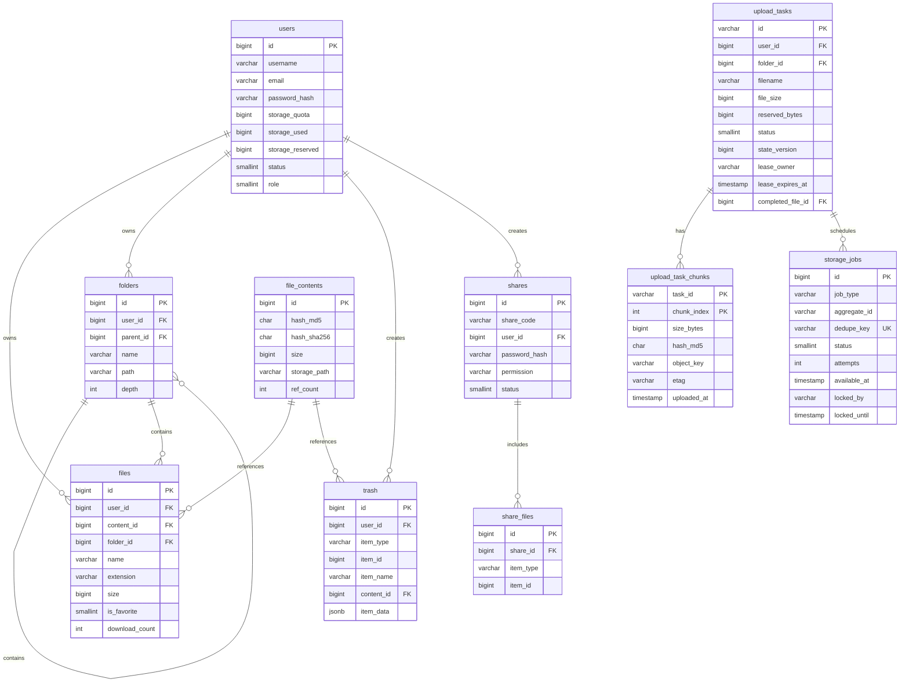
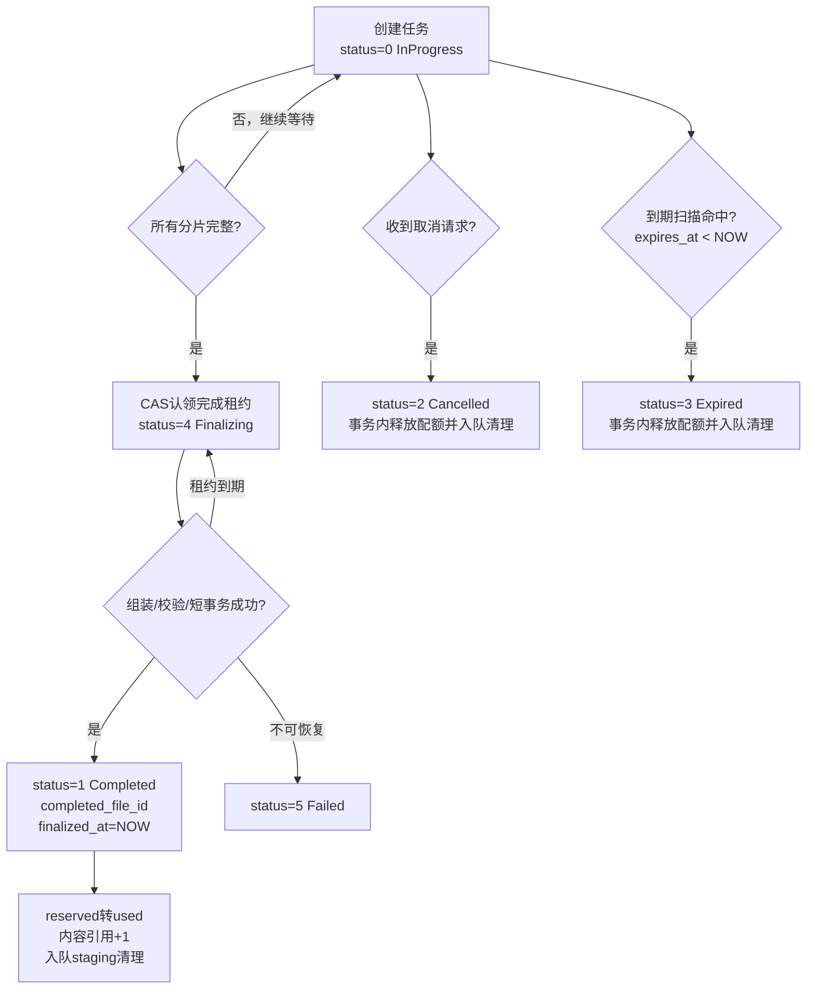

# 网盘系统 - 数据库设计

## 1. 设计概述

### 1.1 数据库选型

- **主数据库**：PostgreSQL 14+
- **缓存数据库**：Redis 6.0+
- **字符集**：ENCODING UTF8
- **排序规则**：LC_COLLATE = 'en_US.utf8', LC_CTYPE = 'en_US.utf8'

### 1.2 设计原则

1. **规范化设计**：遵循第三范式，减少数据冗余
2. **合理冗余**：对于频繁查询的数据适当冗余，提高查询效率
3. **索引优化**：根据查询场景设计合适的索引
4. **软删除**：重要数据采用软删除机制
5. **审计追踪**：记录数据创建和更新时间

### 1.3 命名规范

| 类型 | 规范 | 示例 |
|------|------|------|
| 表名 | 小写，下划线分隔，复数形式 | `users`, `file_contents` |
| 字段名 | 小写，下划线分隔 | `user_id`, `created_at` |
| 主键 | `id` | - |
| 外键 | `关联表名单数_id` | `user_id`, `folder_id` |
| 索引 | `idx_表名_字段名` | `idx_files_user_id` |
| 唯一索引 | `uk_表名_字段名` | `uk_users_username` |

---

## 2. 数据库 ER 图



`storage_jobs.aggregate_id` 是按 `job_type` 解释的通用聚合标识，不对 `upload_tasks` 建立物理外键；上传任务与持久任务在 ER 图中的连线表示业务关联，而非数据库 FK。这样 Blob GC、周期扫描和全局对账也可以复用同一任务表。

---

## 3. 表结构设计

### 3.0 Schema 迁移账本 (schema_migrations)

V003 起，线上增量迁移由 `scripts/migrate-db.sh` 独占执行，并在同一事务内记录脚本 SHA-256。应用启动只校验所需 schema，不自动执行 DDL。V001/V002 是引入账本前的历史手工迁移，不回写或修改既有脚本。

```sql
CREATE TABLE schema_migrations (
    version VARCHAR(128) PRIMARY KEY,
    checksum CHAR(64) NOT NULL,
    applied_at TIMESTAMPTZ NOT NULL DEFAULT CURRENT_TIMESTAMP
);
```

同一版本 checksum 不一致时执行器必须失败，禁止静默接受已修改的历史迁移。全新安装由 `sql/init.sql` 创建最新 schema 并写入当前版本；随后执行迁移器应全部跳过。

### 3.1 用户表 (users)

存储用户账户信息。

```sql
CREATE TABLE users (
    id BIGINT GENERATED ALWAYS AS IDENTITY PRIMARY KEY,
    username VARCHAR(32) NOT NULL,
    email VARCHAR(128) NOT NULL,
    password_hash VARCHAR(255) NOT NULL,
    nickname VARCHAR(64) DEFAULT NULL,
    avatar VARCHAR(512) DEFAULT NULL,
    storage_quota BIGINT NOT NULL DEFAULT 10737418240,
    storage_used BIGINT NOT NULL DEFAULT 0,
    storage_reserved BIGINT NOT NULL DEFAULT 0,
    status SMALLINT NOT NULL DEFAULT 1,
    role SMALLINT NOT NULL DEFAULT 0,
    login_attempts INTEGER NOT NULL DEFAULT 0,
    locked_until TIMESTAMP DEFAULT NULL,
    last_login_at TIMESTAMP DEFAULT NULL,
    last_login_ip VARCHAR(45) DEFAULT NULL,
    created_at TIMESTAMP NOT NULL DEFAULT CURRENT_TIMESTAMP,
    updated_at TIMESTAMP NOT NULL DEFAULT CURRENT_TIMESTAMP
);

CREATE UNIQUE INDEX uk_users_username ON users (username);
CREATE UNIQUE INDEX uk_users_email ON users (email);
CREATE INDEX idx_users_status ON users (status);
CREATE INDEX idx_users_role ON users (role);
CREATE INDEX idx_users_created_at ON users (created_at);

COMMENT ON TABLE users IS '用户表';
COMMENT ON COLUMN users.id IS '用户ID';
COMMENT ON COLUMN users.username IS '用户名';
COMMENT ON COLUMN users.email IS '邮箱';
COMMENT ON COLUMN users.password_hash IS '密码哈希';
COMMENT ON COLUMN users.nickname IS '昵称';
COMMENT ON COLUMN users.avatar IS '头像URL';
COMMENT ON COLUMN users.storage_quota IS '存储配额(字节)，默认10GB';
COMMENT ON COLUMN users.storage_used IS '已用存储(字节)';
COMMENT ON COLUMN users.storage_reserved IS '上传预占用存储(字节)';
COMMENT ON COLUMN users.status IS '状态: 0-禁用, 1-正常, 2-锁定';
COMMENT ON COLUMN users.role IS '角色: 0-普通用户, 1-管理员';
COMMENT ON COLUMN users.login_attempts IS '登录失败次数';
COMMENT ON COLUMN users.locked_until IS '锁定截止时间';
COMMENT ON COLUMN users.last_login_at IS '最后登录时间';
COMMENT ON COLUMN users.last_login_ip IS '最后登录IP';
COMMENT ON COLUMN users.created_at IS '创建时间';
COMMENT ON COLUMN users.updated_at IS '更新时间';
```

**字段说明：**

| 字段 | 类型 | 说明 |
|------|------|------|
| id | BIGINT | 用户唯一标识 |
| username | VARCHAR(32) | 用户名，唯一 |
| email | VARCHAR(128) | 邮箱，唯一 |
| password_hash | VARCHAR(255) | Argon2id 加密后的密码 |
| nickname | VARCHAR(64) | 显示昵称 |
| avatar | VARCHAR(512) | 头像 URL |
| storage_quota | BIGINT | 存储空间配额，单位字节 |
| storage_used | BIGINT | 已使用存储空间 |
| storage_reserved | BIGINT | 上传中已预占用的存储空间 |
| status | SMALLINT | 账户状态：0-禁用, 1-正常, 2-锁定 |
| role | SMALLINT | 角色：0-普通用户, 1-管理员 |
| login_attempts | INTEGER | 连续登录失败次数 |
| locked_until | TIMESTAMP | 账户锁定截止时间 |
| last_login_at | TIMESTAMP | 最后登录时间 |
| last_login_ip | VARCHAR(45) | 最后登录 IP |
| created_at | TIMESTAMP | 创建时间 |
| updated_at | TIMESTAMP | 更新时间 |

**角色说明：**

- `role = 0`：普通用户，拥有基本的文件管理权限
- `role = 1`：管理员，拥有系统管理权限

**状态与角色的关系：**

- `status` 字段控制账户的启用/禁用状态
- `role` 字段控制用户的权限级别
- 管理员账户的 `role` 应设置为 1

---

### 3.2 文件内容表 (file_contents)

存储文件的物理存储信息，用于文件去重。

```sql
CREATE TABLE file_contents (
    id BIGINT GENERATED ALWAYS AS IDENTITY PRIMARY KEY,
    hash_md5 CHAR(32) NOT NULL,
    hash_sha256 CHAR(64) NOT NULL,
    size BIGINT NOT NULL,
    storage_path VARCHAR(512) NOT NULL,
    mime_type VARCHAR(128) DEFAULT NULL,
    ref_count INTEGER NOT NULL DEFAULT 1,
    created_at TIMESTAMP NOT NULL DEFAULT CURRENT_TIMESTAMP
);

CREATE UNIQUE INDEX uk_file_contents_hash ON file_contents (hash_md5, hash_sha256);
CREATE INDEX idx_file_contents_md5 ON file_contents (hash_md5);
CREATE INDEX idx_file_contents_ref_count ON file_contents (ref_count);

COMMENT ON TABLE file_contents IS '文件内容表';
COMMENT ON COLUMN file_contents.id IS '内容ID';
COMMENT ON COLUMN file_contents.hash_md5 IS 'MD5哈希';
COMMENT ON COLUMN file_contents.hash_sha256 IS 'SHA256哈希';
COMMENT ON COLUMN file_contents.size IS '文件大小(字节)';
COMMENT ON COLUMN file_contents.storage_path IS '存储路径';
COMMENT ON COLUMN file_contents.mime_type IS 'MIME类型';
COMMENT ON COLUMN file_contents.ref_count IS '引用计数';
COMMENT ON COLUMN file_contents.created_at IS '创建时间';
```

**字段说明：**

| 字段 | 类型 | 说明 |
|------|------|------|
| id | BIGINT | 内容唯一标识 |
| hash_md5 | CHAR(32) | 文件 MD5 哈希值 |
| hash_sha256 | CHAR(64) | 文件 SHA256 哈希值 |
| size | BIGINT | 文件大小 |
| storage_path | VARCHAR(512) | 最终 Blob 的权威定位符；local 为文件路径，S3 为完整对象 key |
| mime_type | VARCHAR(128) | 文件 MIME 类型 |
| ref_count | INTEGER | 引用计数，用于去重管理 |

`storage_path` 是下载、HEAD、Range、删除和对账的唯一定位权威。服务不得根据 `hash_md5`、
`hash_sha256` 或当前存储配置重建既有路径。新内容使用 SHA-256 布局；历史 MD5 布局保持原值，
由独立迁移工具在对象校验成功后原子更新该字段。

完成上传获取内容引用时，先按 `(hash_md5, hash_sha256)` 锁定已有内容行并执行 Blob GC
门禁，再使用 `INSERT ... ON CONFLICT (hash_md5, hash_sha256) DO UPDATE SET ref_count =
file_contents.ref_count + 1 ... RETURNING`。冲突分支必须保留已有行的 `storage_path`、MIME 和
创建时间，仅在已有 `size` 与候选值一致时增加引用；条件不匹配且没有 `RETURNING` 行时按
完整性错误回滚整个完成事务。“先查再插”只能用于避免不必要的对象提升，不能作为并发去重的
正确性边界。若事务外预查决定复用已有 Blob，最终事务还必须携带预查得到的 content_id；锁定
结果不存在或 ID 已变化时返回可重试的 `ResourceConflict`，不得新建一行指向已经被 GC 删除的
对象。

`files` 的 `(user_id, folder_id, name)` 唯一约束是文件名冲突的最终裁决。插入使用
`ON CONFLICT (user_id, folder_id, name) DO NOTHING RETURNING`；无返回行稳定映射为
`FileAlreadyExists`，并由同一事务回滚已经发生的内容引用、配额和目录计数变化。

---

### 3.3 文件夹表 (folders)

存储文件夹结构信息。

```sql
CREATE TABLE folders (
    id BIGINT GENERATED ALWAYS AS IDENTITY PRIMARY KEY,
    user_id BIGINT NOT NULL,
    parent_id BIGINT NOT NULL DEFAULT 0,
    name VARCHAR(255) NOT NULL,
    path VARCHAR(4096) NOT NULL DEFAULT '/',
    depth INTEGER NOT NULL DEFAULT 0,
    item_count INTEGER NOT NULL DEFAULT 0,
    created_at TIMESTAMP NOT NULL DEFAULT CURRENT_TIMESTAMP,
    updated_at TIMESTAMP NOT NULL DEFAULT CURRENT_TIMESTAMP
);

CREATE INDEX idx_folders_user_id ON folders (user_id);
CREATE INDEX idx_folders_parent_id ON folders (parent_id);
CREATE INDEX idx_folders_user_parent ON folders (user_id, parent_id);
CREATE UNIQUE INDEX uk_folders_user_parent_name ON folders (user_id, parent_id, name);

ALTER TABLE folders
    ADD CONSTRAINT fk_folders_user_id FOREIGN KEY (user_id) REFERENCES users (id) ON DELETE CASCADE;

COMMENT ON TABLE folders IS '文件夹表';
COMMENT ON COLUMN folders.id IS '文件夹ID';
COMMENT ON COLUMN folders.user_id IS '所属用户ID';
COMMENT ON COLUMN folders.parent_id IS '父文件夹ID，0表示根目录';
COMMENT ON COLUMN folders.name IS '文件夹名称';
COMMENT ON COLUMN folders.path IS '完整路径';
COMMENT ON COLUMN folders.depth IS '目录深度';
COMMENT ON COLUMN folders.item_count IS '子项数量(文件+文件夹)';
COMMENT ON COLUMN folders.created_at IS '创建时间';
COMMENT ON COLUMN folders.updated_at IS '更新时间';
```

**字段说明：**

| 字段 | 类型 | 说明 |
|------|------|------|
| id | BIGINT | 文件夹唯一标识 |
| user_id | BIGINT | 所属用户 |
| parent_id | BIGINT | 父文件夹 ID，0 为根目录 |
| name | VARCHAR(255) | 文件夹名称 |
| path | VARCHAR(4096) | 从根目录的完整路径 |
| depth | INTEGER | 目录层级深度 |
| item_count | INTEGER | 直接子项数量 |

---

### 3.4 文件表 (files)

存储文件元数据信息。

```sql
CREATE TABLE files (
    id BIGINT GENERATED ALWAYS AS IDENTITY PRIMARY KEY,
    user_id BIGINT NOT NULL,
    content_id BIGINT NOT NULL,
    folder_id BIGINT NOT NULL DEFAULT 0,
    name VARCHAR(255) NOT NULL,
    extension VARCHAR(32) DEFAULT NULL,
    size BIGINT NOT NULL,
    mime_type VARCHAR(128) DEFAULT NULL,
    path VARCHAR(4096) NOT NULL DEFAULT '/',
    is_favorite SMALLINT NOT NULL DEFAULT 0,
    download_count INTEGER NOT NULL DEFAULT 0,
    last_accessed_at TIMESTAMP DEFAULT NULL,
    created_at TIMESTAMP NOT NULL DEFAULT CURRENT_TIMESTAMP,
    updated_at TIMESTAMP NOT NULL DEFAULT CURRENT_TIMESTAMP
);

CREATE INDEX idx_files_user_id ON files (user_id);
CREATE INDEX idx_files_folder_id ON files (folder_id);
CREATE INDEX idx_files_content_id ON files (content_id);
CREATE INDEX idx_files_user_folder ON files (user_id, folder_id);
CREATE INDEX idx_files_extension ON files (extension);
CREATE INDEX idx_files_created_at ON files (created_at);
CREATE UNIQUE INDEX uk_files_user_folder_name ON files (user_id, folder_id, name);

ALTER TABLE files
    ADD CONSTRAINT fk_files_user_id FOREIGN KEY (user_id) REFERENCES users (id) ON DELETE CASCADE,
    ADD CONSTRAINT fk_files_content_id FOREIGN KEY (content_id) REFERENCES file_contents (id);

COMMENT ON TABLE files IS '文件表';
COMMENT ON COLUMN files.id IS '文件ID';
COMMENT ON COLUMN files.user_id IS '所属用户ID';
COMMENT ON COLUMN files.content_id IS '文件内容ID';
COMMENT ON COLUMN files.folder_id IS '所属文件夹ID，0表示根目录';
COMMENT ON COLUMN files.name IS '文件名';
COMMENT ON COLUMN files.extension IS '文件扩展名';
COMMENT ON COLUMN files.size IS '文件大小(字节)';
COMMENT ON COLUMN files.mime_type IS 'MIME类型';
COMMENT ON COLUMN files.path IS '完整路径';
COMMENT ON COLUMN files.is_favorite IS '是否收藏: 0-否, 1-是';
COMMENT ON COLUMN files.download_count IS '下载次数';
COMMENT ON COLUMN files.last_accessed_at IS '最后访问时间';
COMMENT ON COLUMN files.created_at IS '创建时间';
COMMENT ON COLUMN files.updated_at IS '更新时间';
```

**字段说明：**

| 字段 | 类型 | 说明 |
|------|------|------|
| id | BIGINT | 文件唯一标识 |
| user_id | BIGINT | 所属用户 |
| content_id | BIGINT | 关联的文件内容 ID |
| folder_id | BIGINT | 所属文件夹 ID |
| name | VARCHAR(255) | 文件名 |
| extension | VARCHAR(32) | 文件扩展名（小写） |
| size | BIGINT | 文件大小 |
| mime_type | VARCHAR(128) | MIME 类型 |
| path | VARCHAR(4096) | 完整路径 |
| is_favorite | SMALLINT | 是否收藏 |
| download_count | INTEGER | 下载次数 |

---

### 3.5 上传任务表 (upload_tasks)

存储分片上传任务信息。

```sql
CREATE TABLE upload_tasks (
    id VARCHAR(64) NOT NULL PRIMARY KEY,
    user_id BIGINT NOT NULL,
    folder_id BIGINT NOT NULL DEFAULT 0,
    filename VARCHAR(255) NOT NULL,
    file_size BIGINT NOT NULL,
    file_hash CHAR(32) NOT NULL,
    chunk_size INTEGER NOT NULL,
    total_chunks INTEGER NOT NULL,
    reserved_bytes BIGINT NOT NULL DEFAULT 0,
    temp_path VARCHAR(512) NOT NULL,
    staging_backend VARCHAR(16) NOT NULL DEFAULT 'local',
    staging_prefix VARCHAR(1024) DEFAULT NULL,
    status SMALLINT NOT NULL DEFAULT 0,
    state_version BIGINT NOT NULL DEFAULT 0,
    lease_owner VARCHAR(128) DEFAULT NULL,
    lease_expires_at TIMESTAMP DEFAULT NULL,
    finalize_attempts INTEGER NOT NULL DEFAULT 0,
    last_error_code INTEGER DEFAULT NULL,
    last_error_at TIMESTAMP DEFAULT NULL,
    completed_file_id BIGINT DEFAULT NULL,
    expires_at TIMESTAMP NOT NULL,
    finalized_at TIMESTAMP DEFAULT NULL,
    fail_reason VARCHAR(512) DEFAULT NULL,
    created_at TIMESTAMP NOT NULL DEFAULT CURRENT_TIMESTAMP,
    updated_at TIMESTAMP NOT NULL DEFAULT CURRENT_TIMESTAMP,
    CONSTRAINT ck_upload_tasks_status CHECK (status BETWEEN 0 AND 5),
    CONSTRAINT ck_upload_tasks_staging_backend CHECK (staging_backend IN ('local', 's3')),
    CONSTRAINT ck_upload_tasks_nonnegative CHECK (
        reserved_bytes >= 0 AND state_version >= 0 AND finalize_attempts >= 0
    ),
    CONSTRAINT ck_upload_tasks_staging_prefix CHECK (
        staging_backend <> 's3' OR staging_prefix IS NOT NULL
    ),
    CONSTRAINT ck_upload_tasks_finalizing_lease CHECK (
        (status = 4 AND lease_owner IS NOT NULL AND lease_expires_at IS NOT NULL)
        OR (status <> 4 AND lease_owner IS NULL AND lease_expires_at IS NULL)
    ),
    CONSTRAINT ck_upload_tasks_completed_file CHECK (
        completed_file_id IS NULL OR status = 1
    )
);

CREATE INDEX idx_upload_tasks_user_id ON upload_tasks (user_id);
CREATE INDEX idx_upload_tasks_status ON upload_tasks (status);
CREATE INDEX idx_upload_tasks_expires_at ON upload_tasks (expires_at);
CREATE INDEX idx_upload_tasks_user_hash ON upload_tasks (user_id, file_hash);
CREATE INDEX idx_upload_tasks_status_expires ON upload_tasks (status, expires_at);
CREATE INDEX idx_upload_tasks_user_status ON upload_tasks (user_id, status);
CREATE INDEX idx_upload_tasks_finalizing_lease ON upload_tasks (lease_expires_at)
    WHERE status = 4;
CREATE INDEX idx_upload_tasks_staging_backend ON upload_tasks (staging_backend, status);

ALTER TABLE upload_tasks
    ADD CONSTRAINT fk_upload_tasks_user_id FOREIGN KEY (user_id) REFERENCES users (id) ON DELETE CASCADE;
ALTER TABLE upload_tasks
    ADD CONSTRAINT fk_upload_tasks_completed_file_id FOREIGN KEY (completed_file_id) REFERENCES files (id) ON DELETE SET NULL;

COMMENT ON TABLE upload_tasks IS '上传任务表';
COMMENT ON COLUMN upload_tasks.id IS '上传任务ID';
COMMENT ON COLUMN upload_tasks.user_id IS '用户ID';
COMMENT ON COLUMN upload_tasks.folder_id IS '目标文件夹ID';
COMMENT ON COLUMN upload_tasks.filename IS '文件名';
COMMENT ON COLUMN upload_tasks.file_size IS '文件大小';
COMMENT ON COLUMN upload_tasks.file_hash IS '文件MD5哈希';
COMMENT ON COLUMN upload_tasks.chunk_size IS '分片大小';
COMMENT ON COLUMN upload_tasks.total_chunks IS '总分片数';
COMMENT ON COLUMN upload_tasks.reserved_bytes IS '预占用字节数';
COMMENT ON COLUMN upload_tasks.temp_path IS '兼容local暂存的临时路径';
COMMENT ON COLUMN upload_tasks.staging_backend IS '暂存后端: local或s3，按任务固化';
COMMENT ON COLUMN upload_tasks.staging_prefix IS '按任务固化的暂存定位符，不含凭据';
COMMENT ON COLUMN upload_tasks.status IS '状态: 0-进行中, 1-已完成, 2-已取消, 3-已过期, 4-完成中, 5-失败';
COMMENT ON COLUMN upload_tasks.state_version IS '状态版本，用于租约CAS和诊断';
COMMENT ON COLUMN upload_tasks.lease_owner IS '当前完成租约所有者实例ID';
COMMENT ON COLUMN upload_tasks.lease_expires_at IS '当前完成租约到期时间';
COMMENT ON COLUMN upload_tasks.finalize_attempts IS '完成流程认领和接管次数';
COMMENT ON COLUMN upload_tasks.last_error_code IS '最后一次完成错误码';
COMMENT ON COLUMN upload_tasks.last_error_at IS '最后一次完成错误时间';
COMMENT ON COLUMN upload_tasks.completed_file_id IS '完成后创建的文件ID，用于幂等返回';
COMMENT ON COLUMN upload_tasks.expires_at IS '过期时间';
COMMENT ON COLUMN upload_tasks.finalized_at IS '完成/失败时间';
COMMENT ON COLUMN upload_tasks.fail_reason IS '失败原因';
COMMENT ON COLUMN upload_tasks.created_at IS '创建时间';
COMMENT ON COLUMN upload_tasks.updated_at IS '更新时间';
```

**字段说明：**

| 字段 | 类型 | 说明 |
|------|------|------|
| id | VARCHAR(64) | 上传任务唯一标识 |
| user_id | BIGINT | 所属用户 |
| folder_id | BIGINT | 目标文件夹 |
| filename | VARCHAR(255) | 上传的文件名 |
| file_size | BIGINT | 文件总大小 |
| file_hash | CHAR(32) | 文件 MD5 哈希 |
| chunk_size | INTEGER | 分片大小 |
| total_chunks | INTEGER | 总分片数量 |
| reserved_bytes | BIGINT | 预占用的字节数（用于 storage_reserved 计算） |
| temp_path | VARCHAR(512) | 兼容旧 local 任务的分片临时路径 |
| staging_backend | VARCHAR(16) | 任务创建时固化的暂存后端：local / s3 |
| staging_prefix | VARCHAR(1024) | 按任务固化的暂存定位符，不含凭据 |
| status | SMALLINT | 0 进行中、1 完成、2 取消、3 过期、4 完成中、5 失败 |
| state_version | BIGINT | 每次状态认领/迁移递增的 CAS 版本 |
| lease_owner | VARCHAR(128) | 当前完成租约 owner |
| lease_expires_at | TIMESTAMP | 租约到期时间，以 PostgreSQL `NOW()` 判断 |
| finalize_attempts | INTEGER | 完成认领与接管次数 |
| last_error_code | INTEGER | 最后一次完成错误码 |
| last_error_at | TIMESTAMP | 最后一次完成错误时间 |
| completed_file_id | BIGINT | 完成后的文件 ID，用于重复 complete 返回原结果 |
| expires_at | TIMESTAMP | 任务过期时间 |
| finalized_at | TIMESTAMP | 任务完成或失败时间 |
| fail_reason | VARCHAR(512) | 失败原因说明 |

`staging_backend` 与 `staging_prefix` 是上传会话的不可变定位信息。新建任务必须在同一条 `INSERT` 中显式写入两个字段，不得依赖数据库默认值，也不得在配置切换后改写已存在任务。S3 任务的定位符为经规范化的 `<staging_prefix>/<upload_id>`；local 任务保留不含凭据的逻辑定位符，实际旧目录仍以 `temp_path` 为兼容读取权威。实例处理分片、完成、取消或清理前，必须根据该持久化定位信息选择暂存后端，不能只读当前进程配置。

#### 上传完成 CAS 原语

完成租约的权威判断只允许由 `UploadTaskRepository` 的条件 SQL 执行：

1. 首次认领使用单条 `UPDATE ... WHERE` 同时校验 `id + user_id + status=InProgress + expires_at >= NOW()` 和 `upload_task_chunks` 完整覆盖；成功后写入 `Finalizing`、`lease_owner`、`NOW() + lease duration`，并递增 `state_version` 与 `finalize_attempts`。
2. 接管只允许命中 `status=Finalizing AND lease_expires_at <= NOW()` 的同一条件更新；不得使用 API 实例本地时钟判断过期。
3. 续租必须同时匹配 `status=Finalizing + lease_owner + state_version + lease_expires_at > NOW()`，并返回递增后的版本。调用方后续只能使用最新返回版本；已过期 owner 不能复活租约，只能重新竞争接管。
4. 最终提交必须在短事务中匹配同一组 `lease_owner + state_version + lease_expires_at > NOW()`，写入 `Completed + completed_file_id`、清空租约并递增版本。旧 owner、旧 generation 或过期租约的更新影响行数必须为 0。
5. CAS 未命中后可用新的数据库语句读取当前状态，以区分分片不完整、有效租约冲突、完成重放和稳定终态；该读取结果不能替代成功 CAS 或授予完成权限。

租约时长必须是正整数秒并有配置上限。任何对象读取、组装、哈希或复制都在认领事务提交后执行，不能持有任务行锁等待外部 I/O。

---

### 3.5.1 上传任务分片表 (upload_task_chunks)

存储上传任务的已上传分片信息，用于支持并发分片上传。

```sql
CREATE TABLE upload_task_chunks (
    task_id VARCHAR(64) NOT NULL,
    chunk_index INTEGER NOT NULL,
    size_bytes BIGINT DEFAULT NULL,
    hash_md5 CHAR(32) DEFAULT NULL,
    object_key VARCHAR(1024) DEFAULT NULL,
    etag VARCHAR(256) DEFAULT NULL,
    uploaded_at TIMESTAMP NOT NULL DEFAULT CURRENT_TIMESTAMP,
    PRIMARY KEY (task_id, chunk_index),
    CONSTRAINT ck_upload_task_chunks_index CHECK (chunk_index >= 0),
    CONSTRAINT ck_upload_task_chunks_size CHECK (size_bytes IS NULL OR size_bytes > 0),
    CONSTRAINT ck_upload_task_chunks_hash CHECK (
        hash_md5 IS NULL OR hash_md5 ~ '^[0-9a-f]{32}$'
    )
);

CREATE INDEX idx_upload_task_chunks_task_id ON upload_task_chunks (task_id);

ALTER TABLE upload_task_chunks
    ADD CONSTRAINT fk_upload_task_chunks_task_id FOREIGN KEY (task_id) REFERENCES upload_tasks (id) ON DELETE CASCADE;

COMMENT ON TABLE upload_task_chunks IS '上传任务分片表';
COMMENT ON COLUMN upload_task_chunks.task_id IS '上传任务ID';
COMMENT ON COLUMN upload_task_chunks.chunk_index IS '分片索引(从0开始)';
COMMENT ON COLUMN upload_task_chunks.size_bytes IS '已验证分片对象大小，旧local任务可为空';
COMMENT ON COLUMN upload_task_chunks.hash_md5 IS '已验证分片MD5，旧local任务可为空';
COMMENT ON COLUMN upload_task_chunks.object_key IS 'S3 staging对象key，旧local任务可为空';
COMMENT ON COLUMN upload_task_chunks.etag IS '对象存储ETag，仅用于对象版本诊断';
COMMENT ON COLUMN upload_task_chunks.uploaded_at IS '上传时间';
```

**字段说明：**

| 字段 | 类型 | 说明 |
|------|------|------|
| task_id | VARCHAR(64) | 关联的上传任务 ID |
| chunk_index | INTEGER | 分片索引，从 0 开始 |
| size_bytes | BIGINT | 已验证的对象字节数；迁移期旧 local 任务可为空 |
| hash_md5 | CHAR(32) | 已验证分片 MD5；不能由 ETag 替代 |
| object_key | VARCHAR(1024) | S3 staging 对象 key，不含 endpoint 或凭据 |
| etag | VARCHAR(256) | 对象版本/诊断字段，不代表整文件 MD5 |
| uploaded_at | TIMESTAMP | 分片上传完成时间 |

**并发安全说明：**

- 使用 `PRIMARY KEY(task_id, chunk_index)` 确保同一任务的同一分片只有一个权威记录。
- S3 分片 key 同时包含索引和已验证 MD5；重复内容写入幂等，冲突记录必须验证大小/hash/object key 一致。
- 分片记录通过 `INSERT ... SELECT` 或同一事务内的条件原语写入，只在父任务仍为 `status=0` 时成功。
- 对象已写但记录条件未命中属于 staging 孤儿；不得修改终态，由持久清理/对账任务回收。
- 进度查询：`SELECT COUNT(*) FROM upload_task_chunks WHERE task_id = $1`。
- 组装查询：按 `chunk_index` 返回大小、MD5、object key 和 ETag；完成前逐对象复核。

### 3.5.2 持久存储任务表 (storage_jobs)

保存可重试的对象存储副作用与周期扫描任务。API/Worker 崩溃不能丢失任务；Worker 使用 `FOR UPDATE SKIP LOCKED` 和有期限租约认领。

```sql
CREATE TABLE storage_jobs (
    id BIGINT GENERATED ALWAYS AS IDENTITY PRIMARY KEY,
    job_type VARCHAR(64) NOT NULL,
    aggregate_id VARCHAR(128) NOT NULL,
    dedupe_key VARCHAR(255) NOT NULL,
    payload JSONB NOT NULL DEFAULT '{}'::jsonb,
    status SMALLINT NOT NULL DEFAULT 0,
    attempts INTEGER NOT NULL DEFAULT 0,
    max_attempts INTEGER NOT NULL DEFAULT 8,
    available_at TIMESTAMP NOT NULL DEFAULT CURRENT_TIMESTAMP,
    locked_by VARCHAR(128) DEFAULT NULL,
    locked_until TIMESTAMP DEFAULT NULL,
    last_error VARCHAR(2048) DEFAULT NULL,
    created_at TIMESTAMP NOT NULL DEFAULT CURRENT_TIMESTAMP,
    updated_at TIMESTAMP NOT NULL DEFAULT CURRENT_TIMESTAMP,
    completed_at TIMESTAMP DEFAULT NULL,
    CONSTRAINT uk_storage_jobs_dedupe_key UNIQUE (dedupe_key),
    CONSTRAINT ck_storage_jobs_status CHECK (status BETWEEN 0 AND 4),
    CONSTRAINT ck_storage_jobs_attempts CHECK (attempts >= 0 AND max_attempts > 0),
    CONSTRAINT ck_storage_jobs_running_lease CHECK (
        (status = 1 AND locked_by IS NOT NULL AND locked_until IS NOT NULL)
        OR (status <> 1 AND locked_by IS NULL AND locked_until IS NULL)
    )
);

CREATE INDEX idx_storage_jobs_ready
    ON storage_jobs (available_at, id)
    WHERE status IN (0, 2);
CREATE INDEX idx_storage_jobs_expired_lease
    ON storage_jobs (locked_until, id)
    WHERE status = 1;
CREATE INDEX idx_storage_jobs_type_status
    ON storage_jobs (job_type, status);
```

状态值：`0 Pending`、`1 Running`、`2 Retry`、`3 Succeeded`、`4 DeadLetter`。`payload` 只保存任务参数，不保存密钥、令牌或文件正文。相同逻辑副作用使用稳定 `dedupe_key`，例如 `staging-cleanup:{upload_id}` 或 `blob-gc:{content_id}`。

入队使用 `INSERT ... ON CONFLICT (dedupe_key) DO NOTHING RETURNING id`，并与产生副作用的业务状态放在同一个事务。Worker 每次先将已耗尽尝试次数且租约已过期的任务收敛为 `DeadLetter`，再以 `FOR UPDATE SKIP LOCKED` 选取已到 `available_at` 的 `Pending/Retry` 或租约已过期的 `Running` 任务。认领在一条 CTE `UPDATE ... RETURNING` 中写入 `Running`、`attempts + 1`、`locked_by` 和 `locked_until`。

续租、成功和失败回写都必须同时匹配 `id + Running + locked_by`；续租还要求旧租约未过期。临时失败在 `attempts < max_attempts` 时转为 `Retry`并写入下次执行时间，否则转为 `DeadLetter`。所有离开 `Running` 的转移必须清空租约字段，以满足 `ck_storage_jobs_running_lease`。人工重放只允许 `DeadLetter -> Pending`，并重置尝试次数和错误信息。

`staging_cleanup` 固定使用 `aggregate_id = upload_id`和 `dedupe_key = staging-cleanup:{upload_id}`，`payload` 仅含 `upload_id`、`backend` 与持久化的 `prefix`。完成、取消或过期赢家在同一事务内依次写终态/配额、入队和删除分片元数据。请求线程不再直接删除 staging 对象；因此事务提交即证明清理事实可恢复，对象删除失败不影响已提交的业务终态。

`blob_gc` 固定使用 `aggregate_id = content_id`、`dedupe_key = blob-gc:{content_id}`，`payload`
仅含 `content_id` 与权威 `storage_path`。引用计数在同一事务中降到零时入队；若同一去重键的旧任务
已经 `Succeeded`，入队原语将其重置为 `Pending`、清空结果并更新 payload。`Pending/Retry/Running`
任务保持原状，`DeadLetter` 必须经运维确认后重放，不能由业务流静默清除。

引用增长与 GC 共享以下数据库门禁：增长事务先锁定内容行；`Pending/Running/Retry/DeadLetter`
任一状态都返回可重试的 `ResourceConflict`，只有不存在 GC 任务或任务已 `Succeeded` 才能递增。
不能取消 Retry/DeadLetter 后直接恢复引用，因为一次返回失败的对象删除仍可能已经在存储端生效。
Worker 只有将任务认领为 `Running` 后才能删除，并在持有内容行 `FOR UPDATE` 锁期间再次检查 `ref_count`、执行幂等
对象删除，并在同一 PostgreSQL 事务中删除零引用内容行和写入任务成功状态。对象存储调用通常不得跨数据库事务；Blob GC 是为了保证“检查零引用
与删除对象”互斥而允许的例外，且单 Worker 当前串行执行。若复核发现引用已恢复，Worker 不删除
对象并将任务成功收敛；未来再次归零会重置同一任务。

`multipart_abort` 在 S3 `CreateMultipartUpload` 返回后、上传任何 part 前同步登记。聚合标识是
`SHA-256(object_key + "\n" + upload_id)` 的 64 位小写十六进制摘要，去重键固定为
`multipart-abort:{aggregate_id}`；`payload` 仅含 `backend="s3"`、`key` 和 `upload_id`。原始
upload ID 只进入 JSONB，不进入受长度限制的去重键，也不得出现在普通日志中。

登记时任务直接写为 `Running`，`locked_by` 使用当前请求派生的唯一 multipart owner，
`locked_until` 使用上传完成租约。请求在每次 part/copy-part 和 complete 前续租；续租失败即停止
写入并尝试 Abort。Complete 成功或即时 Abort 成功后，只有当前 owner 可以把任务收敛为
`Succeeded`。即时 Abort 失败时，请求 owner 将任务改为可立即认领的 `Retry`，清空租约并保存
脱敏错误；进程直接退出时不执行回写，租约过期的 `Running` 由普通 Worker 接管。Worker 严格
复核摘要、去重键、backend/key/upload_id 后调用幂等 Abort，成功按 owner 条件收敛，临时错误
退避重试，非法 payload 进入 DeadLetter。对象存储端未找到 upload ID 按成功处理。

S3 返回 upload ID 到 PostgreSQL 登记之间仍存在不可消除的极短崩溃窗口，因此生产 bucket 必须
配置未完成 multipart 生命周期过期规则。该规则是持久任务之外的最后保护，不能替代应用任务，
也不能覆盖 final 前缀。

`expire_uploads` 使用 `aggregate_id = scan_id`、去重键
`periodic:expire-uploads:{scan_id}:{page}`，payload 仅含 UTC 窗口标识、从 0 开始的页号和
`1..500` 的批量上限。每页按 `expires_at/id` 稳定顺序只查询一个有界候选批次；候选数达到批量
上限时当前 handler 入队下一页。续页不得依赖实际过期成功数，因为并发状态迁移可能使 CAS
失败但不代表候选集合已经耗尽。

`expire_trash` 使用 `aggregate_id = scan_id`、去重键
`periodic:expire-trash:{scan_id}:{after_id}`，payload 仅含 `scan_id`、单调 `after_id` 和
`1..500` 的批量上限。每页按 `trash.id ASC` 查询一个批次；分块中任一删除失败时
任务以原游标重试，只有整页成功且候选数达到上限时才以最大 ID 入队下一页。

`storage_reconcile` 使用 `aggregate_id = scan_id`，去重键
`periodic:storage-reconcile:{scan_id}:{scope}:{cursor_digest}`。payload 的 scope 只能是
`contents/users/staging/final`；数据库 scope 使用 `after_id`，对象清单 scope 使用不透明
`continuation_token`。`cursor_digest` 固定为
`SHA-256(scope + "\n" + decimal(after_id) + "\n" + continuation_token)` 的 64 位小写十六进制。
每页最多检查 500 个数据库聚合或 1000 个对象，并在完成当前页后入队下一页；返回 `has_more`
时下一游标必须前进，否则任务作为永久合同错误进入 dead-letter，不继续生成同游标任务。

### 3.5.3 存储一致性发现表 (storage_reconciliation_findings)

保存可查询、可告警和可审计的当前/历史不一致发现。巡检不得只打印日志，也不得把一次对象清单
观察当作删除授权。

```sql
CREATE TABLE storage_reconciliation_findings (
    id BIGINT GENERATED ALWAYS AS IDENTITY PRIMARY KEY,
    finding_type VARCHAR(64) NOT NULL,
    resource_id VARCHAR(128) NOT NULL,
    resource_locator VARCHAR(1024) DEFAULT NULL,
    severity SMALLINT NOT NULL,
    resolution_strategy VARCHAR(32) NOT NULL,
    details JSONB NOT NULL DEFAULT '{}'::jsonb,
    occurrences INTEGER NOT NULL DEFAULT 1,
    first_seen_at TIMESTAMP NOT NULL DEFAULT CURRENT_TIMESTAMP,
    last_seen_at TIMESTAMP NOT NULL DEFAULT CURRENT_TIMESTAMP,
    resolved_at TIMESTAMP DEFAULT NULL,
    CONSTRAINT uk_storage_reconciliation_finding
        UNIQUE (finding_type, resource_id),
    CONSTRAINT ck_storage_reconciliation_severity
        CHECK (severity BETWEEN 0 AND 2),
    CONSTRAINT ck_storage_reconciliation_strategy
        CHECK (resolution_strategy IN ('auto_gc', 'alert', 'manual')),
    CONSTRAINT ck_storage_reconciliation_occurrences
        CHECK (occurrences > 0)
);

CREATE INDEX idx_storage_reconciliation_unresolved
    ON storage_reconciliation_findings (severity DESC, last_seen_at, id)
    WHERE resolved_at IS NULL;
```

`resource_id` 是稳定且有界的标识：数据库聚合使用十进制 ID，对象使用 object key 的 SHA-256；
完整 key/path 只放在 `resource_locator`，不得包含凭据或签名 URL。重复发现执行 upsert，增加
`occurrences`、刷新详情并清空 `resolved_at`；复核健康后只设置 `resolved_at`，不删除历史行。

| finding_type | 检查 | 策略 |
|--------------|------|------|
| `zero_reference_content` | 内容实际引用为 0 | `auto_gc`：只入队 `blob_gc`，由 GC 再次加锁复核 |
| `content_ref_count_mismatch` | `ref_count` 与 files + trash 不同 | `alert`：不自动改计数 |
| `missing_final_blob` / `final_blob_size_mismatch` | DB 内容对应对象缺失或大小不同 | `manual`：停止相关读/复用并人工恢复 |
| `quota_used_mismatch` / `quota_reserved_mismatch` | 用户计数与业务记录汇总不同 | `alert`：连续观察后人工核对，不在巡检中改配额 |
| `orphan_staging_object` | staging 对象无活动任务/权威分片或组装记录 | `alert`：由 cleanup/lifecycle 回收，不直接删除 |
| `orphan_final_blob` | final 对象没有 `file_contents.storage_path` | `manual`：确认无并发提交和恢复窗口后处理 |

---

### 3.6 回收站表 (trash)

存储已删除文件/文件夹信息。

```sql
CREATE TABLE trash (
    id BIGINT GENERATED ALWAYS AS IDENTITY PRIMARY KEY,
    user_id BIGINT NOT NULL,
    item_type VARCHAR(10) NOT NULL CHECK (item_type IN ('file', 'folder')),
    item_id BIGINT NOT NULL,
    item_name VARCHAR(255) NOT NULL,
    item_size BIGINT NOT NULL DEFAULT 0,
    content_id BIGINT DEFAULT NULL,
    original_folder_id BIGINT NOT NULL DEFAULT 0,
    original_path VARCHAR(4096) NOT NULL,
    item_data JSONB,
    deleted_at TIMESTAMP NOT NULL DEFAULT CURRENT_TIMESTAMP,
    expires_at TIMESTAMP NOT NULL
);

CREATE INDEX idx_trash_user_id ON trash (user_id);
CREATE INDEX idx_trash_item_type ON trash (item_type);
CREATE INDEX idx_trash_deleted_at ON trash (deleted_at);
CREATE INDEX idx_trash_expires_at ON trash (expires_at);
CREATE INDEX idx_trash_content_id ON trash (content_id);

ALTER TABLE trash
    ADD CONSTRAINT fk_trash_user_id FOREIGN KEY (user_id) REFERENCES users (id) ON DELETE CASCADE,
    ADD CONSTRAINT fk_trash_content_id FOREIGN KEY (content_id) REFERENCES file_contents (id) ON DELETE SET NULL;

COMMENT ON TABLE trash IS '回收站表';
COMMENT ON COLUMN trash.id IS '回收站记录ID';
COMMENT ON COLUMN trash.user_id IS '用户ID';
COMMENT ON COLUMN trash.item_type IS '项目类型';
COMMENT ON COLUMN trash.item_id IS '原项目ID';
COMMENT ON COLUMN trash.item_name IS '项目名称';
COMMENT ON COLUMN trash.item_size IS '项目大小';
COMMENT ON COLUMN trash.content_id IS '关联的文件内容ID(结构化引用)';
COMMENT ON COLUMN trash.original_folder_id IS '原所属文件夹ID';
COMMENT ON COLUMN trash.original_path IS '原完整路径';
COMMENT ON COLUMN trash.item_data IS '项目完整数据备份';
COMMENT ON COLUMN trash.deleted_at IS '删除时间';
COMMENT ON COLUMN trash.expires_at IS '过期时间(彻底删除时间)';
```

**字段说明：**

| 字段 | 类型 | 说明 |
|------|------|------|
| id | BIGINT | 回收站记录 ID |
| user_id | BIGINT | 所属用户 |
| item_type | VARCHAR(10) | 项目类型：file/folder |
| item_id | BIGINT | 原项目 ID |
| item_name | VARCHAR(255) | 项目名称 |
| item_size | BIGINT | 项目大小 |
| content_id | BIGINT | 关联的文件内容 ID（仅 file 类型有效，用于 ref_count 追踪） |
| original_folder_id | BIGINT | 原所属文件夹 |
| original_path | VARCHAR(4096) | 原完整路径 |
| item_data | JSONB | 项目完整数据备份 |
| deleted_at | TIMESTAMP | 删除时间 |
| expires_at | TIMESTAMP | 自动清理时间 |

---

### 3.7 分享表 (shares)

存储文件分享信息。

```sql
CREATE TABLE shares (
    id BIGINT GENERATED ALWAYS AS IDENTITY PRIMARY KEY,
    share_code VARCHAR(32) NOT NULL,
    user_id BIGINT NOT NULL,
    password_hash VARCHAR(255) DEFAULT NULL,
    permission VARCHAR(10) NOT NULL DEFAULT 'download' CHECK (permission IN ('view', 'download')),
    view_count INTEGER NOT NULL DEFAULT 0,
    download_count INTEGER NOT NULL DEFAULT 0,
    status SMALLINT NOT NULL DEFAULT 1,
    expires_at TIMESTAMP DEFAULT NULL,
    created_at TIMESTAMP NOT NULL DEFAULT CURRENT_TIMESTAMP,
    updated_at TIMESTAMP NOT NULL DEFAULT CURRENT_TIMESTAMP
);

CREATE UNIQUE INDEX uk_shares_code ON shares (share_code);
CREATE INDEX idx_shares_user_id ON shares (user_id);
CREATE INDEX idx_shares_status ON shares (status);
CREATE INDEX idx_shares_expires_at ON shares (expires_at);

ALTER TABLE shares
    ADD CONSTRAINT fk_shares_user_id FOREIGN KEY (user_id) REFERENCES users (id) ON DELETE CASCADE;

COMMENT ON TABLE shares IS '分享表';
COMMENT ON COLUMN shares.id IS '分享ID';
COMMENT ON COLUMN shares.share_code IS '分享短码';
COMMENT ON COLUMN shares.user_id IS '分享者用户ID';
COMMENT ON COLUMN shares.password_hash IS '访问密码哈希';
COMMENT ON COLUMN shares.permission IS '权限';
COMMENT ON COLUMN shares.view_count IS '访问次数';
COMMENT ON COLUMN shares.download_count IS '下载次数';
COMMENT ON COLUMN shares.status IS '状态: 0-已取消, 1-有效, 2-已过期';
COMMENT ON COLUMN shares.expires_at IS '过期时间，NULL表示永久';
COMMENT ON COLUMN shares.created_at IS '创建时间';
COMMENT ON COLUMN shares.updated_at IS '更新时间';
```

**字段说明：**

| 字段 | 类型 | 说明 |
|------|------|------|
| id | BIGINT | 分享 ID |
| share_code | VARCHAR(32) | 分享短码，用于 URL |
| user_id | BIGINT | 分享创建者 |
| password_hash | VARCHAR(255) | 访问密码哈希 |
| permission | VARCHAR(10) | 权限：view/download |
| view_count | INTEGER | 访问次数统计 |
| download_count | INTEGER | 下载次数统计 |
| status | SMALLINT | 分享状态 |
| expires_at | TIMESTAMP | 过期时间 |

---

### 3.8 分享文件关联表 (share_files)

存储分享与文件的多对多关系。

```sql
CREATE TABLE share_files (
    id BIGINT GENERATED ALWAYS AS IDENTITY PRIMARY KEY,
    share_id BIGINT NOT NULL,
    item_type VARCHAR(10) NOT NULL CHECK (item_type IN ('file', 'folder')),
    item_id BIGINT NOT NULL,
    created_at TIMESTAMP NOT NULL DEFAULT CURRENT_TIMESTAMP
);

CREATE UNIQUE INDEX uk_share_files_share_item ON share_files (share_id, item_type, item_id);
CREATE INDEX idx_share_files_share_id ON share_files (share_id);

ALTER TABLE share_files
    ADD CONSTRAINT fk_share_files_share_id FOREIGN KEY (share_id) REFERENCES shares (id) ON DELETE CASCADE;

COMMENT ON TABLE share_files IS '分享文件关联表';
COMMENT ON COLUMN share_files.id IS '记录ID';
COMMENT ON COLUMN share_files.share_id IS '分享ID';
COMMENT ON COLUMN share_files.item_type IS '项目类型';
COMMENT ON COLUMN share_files.item_id IS '文件/文件夹ID';
COMMENT ON COLUMN share_files.created_at IS '创建时间';
```

---

### 3.9 操作日志表 (operation_logs)

存储用户操作日志。

```sql
CREATE TABLE operation_logs (
    id BIGINT GENERATED ALWAYS AS IDENTITY PRIMARY KEY,
    user_id BIGINT DEFAULT NULL,
    action VARCHAR(32) NOT NULL,
    target_type VARCHAR(32) DEFAULT NULL,
    target_id BIGINT DEFAULT NULL,
    target_name VARCHAR(255) DEFAULT NULL,
    details JSONB DEFAULT NULL,
    ip_address VARCHAR(45) NOT NULL,
    user_agent VARCHAR(512) DEFAULT NULL,
    created_at TIMESTAMP NOT NULL DEFAULT CURRENT_TIMESTAMP,
    CONSTRAINT fk_operation_logs_user_id FOREIGN KEY (user_id) REFERENCES users (id) ON DELETE SET NULL
);

CREATE INDEX idx_operation_logs_user_id ON operation_logs (user_id);
CREATE INDEX idx_operation_logs_action ON operation_logs (action);
CREATE INDEX idx_operation_logs_created_at ON operation_logs (created_at);
CREATE INDEX idx_operation_logs_target ON operation_logs (target_type, target_id);

COMMENT ON TABLE operation_logs IS '操作日志表';
COMMENT ON COLUMN operation_logs.id IS '日志ID';
COMMENT ON COLUMN operation_logs.user_id IS '操作者用户ID，公开访客或已删除用户为NULL';
COMMENT ON COLUMN operation_logs.action IS '操作类型';
COMMENT ON COLUMN operation_logs.target_type IS '目标类型';
COMMENT ON COLUMN operation_logs.target_id IS '目标ID';
COMMENT ON COLUMN operation_logs.target_name IS '目标名称';
COMMENT ON COLUMN operation_logs.details IS '操作详情';
COMMENT ON COLUMN operation_logs.ip_address IS 'IP地址';
COMMENT ON COLUMN operation_logs.user_agent IS '客户端信息';
COMMENT ON COLUMN operation_logs.created_at IS '创建时间';
```

**操作类型枚举：**

| action | 说明 |
|--------|------|
| login | 登录 |
| logout | 登出 |
| upload | 上传文件 |
| download | 下载文件 |
| delete | 删除 |
| restore | 恢复 |
| rename | 重命名 |
| move | 移动 |
| copy | 复制 |
| share_create | 创建分享 |
| share_access | 访问分享（成功与拒绝） |
| share_pwd_fail | 公开分享验证失败 |
| share_download | 下载分享文件 |
| share_cancel | 取消分享 |

分享访问、公开验证失败和下载没有经过认证的所有者身份，因此 `user_id` 必须保持 `NULL`。所有者创建和取消事件记录真实操作者 ID。外键使用 `ON DELETE SET NULL`，使用户删除后日志按保留策略继续存在，而不是级联删除或错误归属给其他用户。管理员查询把该字段作为可空值返回；现有按用户查询使用 `WHERE user_id = ?`，自然排除访客事件。

生成式 `OperationLogs` ORM 继续服务于要求认证用户的既有写入路径。分享访客事件由 `ShareAuditService` 的参数化 SQL 边界写入 `NULL`，不向生成式 ORM 头文件加入自定义业务逻辑。初始化 schema 与存量数据库分别由 `sql/init.sql` 和 `sql/migrations/V002_share_audit_forward.sql` 保持一致。

`details` 只允许保存 9.4.4 的事件字段。不得保存访问密码、密码哈希、原始 Share Token 或认证请求头。`ip_address`、`user_agent` 和 `share_code` 属于审计追踪数据，统一随操作日志保留 90 天，并由 7.3 节的分批清理语句删除；不得另建无期限副本。

---

## 4. 索引设计

### 4.1 索引策略

| 表名 | 索引类型 | 索引字段 | 用途 |
|------|----------|----------|------|
| users | 唯一索引 | username | 用户名唯一校验 |
| users | 唯一索引 | email | 邮箱唯一校验 |
| files | 联合索引 | user_id, folder_id | 文件列表查询 |
| files | 联合索引 | user_id, folder_id, name | 同目录文件名唯一 |
| files | 普通索引 | extension | 按类型筛选 |
| folders | 联合索引 | user_id, parent_id | 目录结构查询 |
| file_contents | 联合索引 | hash_md5, hash_sha256 | 秒传检测 |
| upload_tasks | 联合索引 | status, expires_at | 定时清理过期任务 |
| upload_tasks | 联合索引 | user_id, status | 用户任务列表查询 |
| upload_tasks | 部分索引 | lease_expires_at WHERE status=4 | 完成租约到期接管 |
| upload_tasks | 联合索引 | staging_backend, status | 迁移期暂存后端盘点 |
| upload_task_chunks | 联合索引 | task_id, chunk_index | 分片进度查询 |
| storage_jobs | 部分索引 | available_at, id WHERE status IN (0,2) | 待执行/重试任务认领 |
| storage_jobs | 部分索引 | locked_until, id WHERE status=1 | 崩溃 Worker 租约接管 |
| trash | 普通索引 | expires_at | 定时清理 |
| trash | 普通索引 | content_id | ref_count 追踪 |
| shares | 唯一索引 | share_code | 分享链接访问 |
| operation_logs | GIN 索引 | details | JSONB 操作详情查询 |
| files | GIN 索引 | name | 文件名全文搜索 |
| folders | GIN 索引 | name | 文件夹名全文搜索 |

### 4.2 查询优化建议

1. **文件列表查询**：使用 `(user_id, folder_id)` 联合索引
2. **秒传检测**：先查 MD5，再验证 SHA256
3. **回收站清理**：按 `expires_at` 索引批量删除
4. **大表分页**：使用游标分页而非 OFFSET
5. **全文搜索**：使用 GIN 索引加速文件名和文件夹名搜索
   ```sql
   CREATE INDEX idx_files_name_gin ON files USING GIN (name gin_trgm_ops);
   CREATE INDEX idx_folders_name_gin ON folders USING GIN (name gin_trgm_ops);
   ```
6. **JSONB 查询**：使用 GIN 索引加速操作日志详情检索
   ```sql
   CREATE INDEX idx_operation_logs_details_gin ON operation_logs USING GIN (details);
   ```

### 4.3 语义说明

#### 4.3.1 存储空间语义

- **storage_used**（已用存储）：
  ```sql
  storage_used = SUM(files.size) + SUM(trash.item_size)
  ```
  包括当前文件和回收站项目的大小。

- **storage_reserved**（预占用存储）：
  ```sql
  storage_reserved = 进行中的上传任务预留 + 正在执行的复制候选字节预留
  ```
  上传预留可由 `upload_tasks.status IN (0, 4)` 的 `reserved_bytes` 对账；复制预留是应用事务外层的短生命周期预留，没有独立持久任务行，因此正常请求结束后必须全部提交到 `storage_used` 或释放。对账结果中超出进行中/完成中上传任务总额的部分，应视为正在执行的复制预留或需要告警的孤儿预留。

- **有效可用配额**（Effective Available Quota）：
  ```
  有效可用配额 = storage_quota - storage_used - storage_reserved
  ```
  创建上传任务时，必须确保 `storage_reserved + file_size <= storage_quota - storage_used`。

- **严格转换不变量**：
  - 释放预留和“预留转已用”都必须满足 `storage_reserved >= bytes`。
  - `CommitReservedToUsed` 不得用 `GREATEST(storage_reserved - bytes, 0)` 掩盖欠预留；条件更新未命中时必须返回内部错误并回滚同一事务内的文件行和引用计数变更。
  - 成功复制/上传提交后，`storage_reserved` 减少量必须等于 `storage_used` 增加量；失败或跳过只释放预留，不增加 `storage_used`。

#### 4.3.2 引用计数语义

- **file_contents.ref_count**（内容引用计数）：
  ```sql
  ref_count = COUNT(files WHERE content_id=X) +
              COUNT(trash WHERE content_id=X AND item_type='file')
  ```
  包含活跃文件和回收站文件对内容的引用。

- **引用计数递增**：创建新文件（包括秒传）时，对对应 content_id 的 ref_count +1
- **引用计数递减**：
  - 删除文件并移入回收站时，ref_count 不变（trash.content_id 保持引用）
  - 彻底删除回收站文件时，ref_count -1
  - 恢复回收站文件时，无需调整 ref_count（从 trash 转回 files）

- **并行处理语义**：批量彻底删除在事务内原子递减 `ref_count` 并为每个零引用内容写入或重置
  `blob-gc:{content_id}`。请求线程不得直接删除 Blob。引用增长先锁定内容行；任一未成功 GC 状态
  都使引用增长返回 `ResourceConflict`。Worker 持有同一内容行锁
  完成零引用复核、幂等对象删除和元数据删除；本地开发存储和 S3/MinIO 使用相同约束。

#### 4.3.3 上传任务生命周期



**状态转换说明：**

- **0 → 4（进行中 → 完成中）**：分片覆盖完整后通过条件更新写入 owner、租约截止和递增后的 `state_version`；只有更新成功的实例执行外部完成步骤。
- **4 → 4（完成中接管）**：仅当 `lease_expires_at < NOW()` 时，新 owner 可递增版本和尝试次数接管；旧 owner 的续租和提交必须失败。
- **4 → 1（完成中 → 已完成）**：短事务原子提交文件、内容引用、配额转换、`completed_file_id` 与清理任务。重复 complete 根据该文件 ID 返回原结果。
- **0 → 2（进行中 → 已取消）**：状态条件更新、释放 `storage_reserved`、删除分片元数据和写入清理任务位于同一事务；只有状态迁移赢家释放配额。
- **0 → 3（进行中 → 已过期）**：超过 `expires_at` 后使用同样的事务边界，事务提交后由 Worker 幂等删除 staging 对象。
- **4 → 5（完成中 → 失败）**：仅用于明确不可恢复的数据损坏或超过已配置恢复上限；短暂错误保持完成中并由租约接管。
- `Finalizing` 不接受新分片或取消。所有租约时间以 PostgreSQL `NOW()` 为准，外部 S3 I/O 不持有数据库长事务。

---

## 5. Redis 缓存设计

### 5.1 缓存 Key 设计

| Key 格式 | 类型 | TTL | 说明 |
|----------|------|-----|------|
| `user:{user_id}` | Hash | 1h | 用户信息缓存 |
| `user:session:{user_id}` | String | 7d | 用户会话信息 |
| `token:blacklist:{jti}` | String | token剩余时间 | JWT 黑名单 |
| `share:{share_code}` | Hash | 1h | 分享信息缓存 |
| `share:token:{share_token}` | Hash | 1h | 分享访问令牌 |
| `rate:login:{ip}` | String | 5m | 登录频率限制 |
| `rate:api:{user_id}` | String | 1m | API 频率限制 |
| `lock:user:{user_id}` | String | 15m | 用户锁定状态 |
| `file:hot:{file_id}` | Hash | 10m | 热点文件缓存 |

### 5.2 缓存结构示例

**用户信息缓存：**
```
Key: user:1
Type: Hash
Fields:
  - id: 1
  - username: john_doe
  - email: john@example.com
  - nickname: John
  - storage_quota: 10737418240
  - storage_used: 1073741824
```

上传任务状态、分片进度、完成租约和持久任务不保存在 Redis；PostgreSQL 是这些数据的唯一事实来源。API 可在进程内短暂缓存不可变上传几何信息，但所有状态写入仍必须使用数据库条件原语。

**频率限制：**
```
Key: rate:login:192.168.1.1
Type: String
Value: 3 (尝试次数)
TTL: 300 (5分钟)
```

### 5.3 缓存策略

| 场景 | 策略 | 说明 |
|------|------|------|
| 用户信息 | Cache-Aside | 查询时缓存，更新时删除 |
| 分享信息 | Cache-Aside | 访问时缓存，更新时删除 |
| 令牌黑名单 | Write-Through | 登出时写入，自动过期 |
| 频率限制 | 原子递增 | INCR + EXPIRE |
| 上传不可变几何信息 | 进程内短 TTL 提示缓存 | 只减少读取；不得决定写操作是否合法 |

### 5.4 Redis 实现计划

#### 5.4.1 RedisService 设计

**目的**: 封装 Drogon RedisClient API，提供统一的缓存接口，简化 Redis 操作。

**类设计**:

```cpp
/**
 * @file RedisService.hpp
 * @brief Redis 缓存服务
 */

#pragma once

#include <string>
#include <optional>
#include <unordered_map>

#include <drogon/nosql/RedisClient.h>
#include "utils/ErrorCode.hpp"

namespace disk::cache {

    /**
     * @brief Redis 缓存服务
     *
     * 封装 Drogon RedisClient，提供类型安全的缓存操作接口。
     */
    class RedisService {
    public:
        /**
         * @brief 构造函数
         * @param redis_client Redis 客户端指针
         */
        explicit RedisService(drogon::nosql::RedisClientPtr redis_client);

        ~RedisService() = default;
        RedisService(const RedisService&) = delete;
        auto operator=(const RedisService&) -> RedisService& = delete;
        RedisService(RedisService&&) = default;
        auto operator=(RedisService&&) -> RedisService& = default;

        // ==================== 基础操作 ====================

        /**
         * @brief 获取字符串值
         * @param key Redis 键
         * @return Result<string> 成功返回值，失败返回错误或 nullopt（不存在）
         */
        [[nodiscard]]
        auto Get(const std::string& key) const -> drogon::Task<Result<std::optional<std::string>>>;

        /**
         * @brief 设置字符串值
         * @param key Redis 键
         * @param value Redis 值
         * @param ttl 过期时间（秒），0 表示不设置过期
         * @return Result<bool> 成功返回 true，失败返回错误
         */
        [[nodiscard]]
        auto Set(const std::string& key, const std::string& value, int ttl = 0) const
            -> drogon::Task<Result<bool>>;

        /**
         * @brief 删除键
         * @param key Redis 键
         * @return Result<bool> 成功返回 true，失败返回错误
         */
        [[nodiscard]]
        auto Del(const std::string& key) const -> drogon::Task<Result<bool>>;

        /**
         * @brief 检查键是否存在
         * @param key Redis 键
         * @return Result<bool> 存在返回 true，不存在返回 false，失败返回错误
         */
        [[nodiscard]]
        auto Exists(const std::string& key) const -> drogon::Task<Result<bool>>;

        /**
         * @brief 设置键的过期时间
         * @param key Redis 键
         * @param ttl 过期时间（秒）
         * @return Result<bool> 成功返回 true，失败返回错误
         */
        [[nodiscard]]
        auto Expire(const std::string& key, int ttl) const -> drogon::Task<Result<bool>>;

        // ==================== Hash 操作 ====================

        /**
         * @brief 获取 Hash 字段值
         * @param key Redis Hash 键
         * @param field Hash 字段
         * @return Result<string> 成功返回值，失败返回错误或 nullopt（字段不存在）
         */
        [[nodiscard]]
        auto HGet(const std::string& key, const std::string& field) const
            -> drogon::Task<Result<std::optional<std::string>>>;

        /**
         * @brief 设置 Hash 字段值
         * @param key Redis Hash 键
         * @param field Hash 字段
         * @param value Hash 值
         * @param ttl 过期时间（秒），0 表示不设置过期
         * @return Result<bool> 成功返回 true，失败返回错误
         */
        [[nodiscard]]
        auto HSet(const std::string& key, const std::string& field,
                  const std::string& value, int ttl = 0) const
            -> drogon::Task<Result<bool>>;

        /**
         * @brief 获取 Hash 所有字段值
         * @param key Redis Hash 键
         * @return Result<unordered_map> 成功返回字段集合，失败返回错误
         */
        [[nodiscard]]
        auto HGetAll(const std::string& key) const
            -> drogon::Task<Result<std::unordered_map<std::string, std::string>>>;

        /**
         * @brief 删除 Hash 字段
         * @param key Redis Hash 键
         * @param fields Hash 字段列表
         * @return Result<bool> 成功返回 true，失败返回错误
         */
        [[nodiscard]]
        auto HDel(const std::string& key, const std::vector<std::string>& fields) const
            -> drogon::Task<Result<bool>>;

        // ==================== 原子操作 ====================

        /**
         * @brief 原子递增计数器
         * @param key Redis 键
         * @return Result<long long> 递增后的值，失败返回错误
         */
        [[nodiscard]]
        auto Incr(const std::string& key) const -> drogon::Task<Result<long long>>;

        /**
         * @brief 原子递增指定值
         * @param key Redis 键
         * @param increment 递增值（可以是负数）
         * @return Result<long long> 递增后的值，失败返回错误
         */
        [[nodiscard]]
        auto IncrBy(const std::string& key, long long increment) const
            -> drogon::Task<Result<long long>>;

    private:
        drogon::nosql::RedisClientPtr m_redis_client;  ///< Redis 客户端
    };

} // namespace disk::cache
```

**使用示例**:

```cpp
// 在 AuthService 中使用 Redis
auto redis_client = drogon::app().getRedisClient();
disk::cache::RedisService redis_service(redis_client);

// 用户信息缓存
auto user_key = "user:" + std::to_string(user_id);
auto cached_user = co_await redis_service.HGetAll(user_key);
if (cached_user.has_value()) {
    // 缓存命中
    return UserFromCache(cached_user.value());
}

// 缓存未命中，从数据库查询
auto user = co_await FindUserFromDB(user_id);

// 写入缓存，TTL 1 小时
co_await redis_service.HSet(user_key, "id", std::to_string(user.id), 3600);
co_await redis_service.HSet(user_key, "username", user.username, 3600);
// ... 其他字段

// 频率限制
auto ip_key = "rate:login:" + ip_address;
auto count = co_await redis_service.Incr(ip_key);
if (count.value() == 1) {
    co_await redis_service.Expire(ip_key, 300);  // 5 分钟
}
```

**实现优先级**: P0（基础设施）
**当前状态**: ✅ 已实现

#### 5.4.2 Token 黑名单实现

**TokenService 扩展**:

在 `src/services/TokenService.{hpp,cpp}` 中添加以下方法：

```cpp
/**
 * @file TokenService.hpp
 * @brief JWT 令牌服务
 */

namespace disk::services {

    class TokenService {
    public:
        // ... 现有方法 ...

        // ==================== Token 黑名单 ====================

        /**
         * @brief 将令牌加入黑名单
         * @param jti JWT ID（唯一标识）
         * @param ttl_seconds 过期时间（秒）
         * @return Result<void> 成功返回，失败返回错误
         */
        [[nodiscard]]
        auto AddToBlacklist(const std::string& jti, int ttl_seconds) const
            -> drogon::Task<Result<void>>;

        /**
         * @brief 检查令牌是否在黑名单中
         * @param jti JWT ID（唯一标识）
         * @return Result<bool> 在黑名单中返回 true，否则返回 false，失败返回错误
         */
        [[nodiscard]]
        auto IsBlacklisted(const std::string& jti) const
            -> drogon::Task<Result<bool>>;

        // ==================== Refresh Token 验证 ====================

        /**
         * @brief 验证刷新令牌
         * @param token 刷新令牌字符串
         * @return Result<pair<user_id, username>> 验证成功返回用户信息，失败返回错误
         */
        [[nodiscard]]
        auto VerifyRefreshToken(const std::string& token) const
            -> Result<std::pair<uint64_t, std::string>>;

        /**
         * @brief 从 JWT Token 提取 JTI
         * @param token JWT 令牌字符串
         * @return string JWT ID
         */
        [[nodiscard]]
        static auto ExtractJTI(const std::string& token) -> std::string;
    };
}
```

**JwtAuthFilter 修改**:

修改 `src/filters/JwtAuthFilter.{hpp,cpp}` 中的 `doFilter()` 方法：

```cpp
auto JwtAuthFilter::doFilter(const drogon::HttpRequestPtr& request)
    -> drogon::Task<drogon::HttpResponsePtr> {

    const auto& auth_header = request->getHeader("Authorization");

    if (auth_header.empty()) {
        co_return disk::Response::Error(disk::error::Code::TokenMissing);
    }

    if (!auth_header.starts_with("Bearer ")) {
        co_return disk::Response::Error(disk::error::Code::TokenMalformed);
    }

    const auto token = auth_header.substr(7);

    // 1. 验证 JWT 签名和有效期
    auto verify_result = m_token_service->VerifyAccessToken(token);
    if (!verify_result) {
        co_return disk::Response::Error(verify_result.error());
    }

    // 2. 提取 JTI（JWT ID）
    const auto jti = TokenService::ExtractJTI(token);

    // 3. 检查 Redis 黑名单
    auto blacklist_check = co_await m_token_service->IsBlacklisted(jti);
    if (!blacklist_check) {
        LOG_ERROR << "黑名单检查失败: " << blacklist_check.error().message;
        co_return disk::Response::Error(ErrorInfo(ErrorCode::InternalError));
    }

    if (blacklist_check.value()) {
        LOG_WARN << "Token 在黑名单中: " << jti;
        co_return disk::Response::Error(ErrorInfo(ErrorCode::TokenRevoked));
    }

    // 4. 验证通过，注入用户信息
    auto [user_id, username] = verify_result.value();

    request->attributes()->insert("user_id", user_id);
    request->attributes()->insert("username", username);

    LOG_DEBUG << "JWT 认证成功: user_id=" << user_id << ", username=" << username;

    co_return nullptr;  // 继续过滤器链
}
```

**实现优先级**: P0（核心安全功能）
**当前状态**: ✅ 已实现

#### 5.4.3 集成流程

**Phase 1: 基础设施（预计 2-3 天）**

1. **添加 Redis 头文件**
   - 文件: `src/utils/Pch.hpp`
   - 操作: 在文件末尾添加 `#include <drogon/nosql/RedisClient.h>`

2. **创建 RedisService**
   - 文件: `src/services/RedisService.{hpp,cpp}`
   - 功能: 实现 RedisService 类的所有方法
   - 测试: 编写单元测试覆盖所有方法

3. **验证 Redis 连接**
   - 文件: `src/main.cpp`
   - 操作: 在应用启动时验证 Redis 连接
   - 示例:
     ```cpp
     try {
         auto redis = drogon::app().getRedisClient();
         auto pong = co_await redis->execCommand<std::string>({"PING"});
         if (pong != "PONG") {
             LOG_ERROR << "Redis 连接失败: " << pong;
             throw std::runtime_error("Redis 连接失败");
         }
         LOG_INFO << "Redis 连接成功";
     } catch (const std::exception& e) {
         LOG_ERROR << "Redis 初始化错误: " << e.what();
         throw;
     }
     ```

**Phase 2: 认证功能（预计 3-4 天）**

1. **扩展 TokenService**
   - 文件: `src/services/TokenService.{hpp,cpp}`
   - 操作: 实现 `AddToBlacklist()`、`IsBlacklisted()`、`VerifyRefreshToken()`、`ExtractJTI()`
   - 依赖: RedisService

2. **扩展 AuthService**
   - 文件: `src/services/AuthService.{hpp,cpp}`
   - 操作: 实现 `Logout()` 方法
   - 功能:
     - 解析 Access Token 和 Refresh Token
     - 调用 TokenService 将令牌加入黑名单
     - 可选：清除用户会话缓存

3. **修改 JwtAuthFilter**
   - 文件: `src/filters/JwtAuthFilter.{hpp,cpp}`
   - 操作: 在 `doFilter()` 中添加黑名单检查
   - 功能: 在 JWT 验证后检查 Redis 黑名单

4. **添加 Logout 端点**
   - 文件: `src/controllers/AuthController.{hpp,cpp}`
   - 操作: 实现 `Logout()` 方法，添加 `/api/auth/logout` 路由
   - 测试: 编写单元测试验证 logout 功能

5. **添加 Refresh Token 端点**
   - 文件: `src/controllers/AuthController.{hpp,cpp}`
   - 操作: 实现 `Refresh()` 方法，添加 `/api/auth/refresh` 路由
   - 测试: 编写单元测试验证 refresh 功能

**Phase 3: 性能优化（预计 2-3 天）**

1. **用户信息缓存**
   - 文件: `src/services/AuthService.cpp`
   - 操作: 修改 `FindUser()` 实现 Cache-Aside 策略
   - 流程:
     ```
     1. 尝试从 Redis 获取用户信息 (user:{user_id})
     2. 缓存命中 → 直接返回
     3. 缓存未命中 → 从数据库查询
     4. 将数据库结果写入 Redis，TTL 1 小时
     5. 返回用户信息
     ```

2. **登录频率限制**
   - 文件: `src/services/AuthService.cpp`
   - 操作: 在 `Login()` 开始时检查 Redis 计数器
   - 流程:
     ```
     1. 获取客户端 IP
     2. 检查 Redis 计数器 (rate:login:{ip})
     3. 如果计数 >= 5，返回 TooManyRequests 错误
     4. 如果登录失败，增加计数器
     5. 如果登录成功，删除计数器
     ```

3. **API 频率限制**
   - 文件: `src/filters/RateLimitFilter.{hpp,cpp}`
   - 操作: 创建新的频率限制过滤器
   - 功能:
     - 检查 Redis 计数器 (rate:api:{user_id})
     - 超过阈值时返回 429 Too Many Requests
     - 设置响应头 X-RateLimit-*, X-Retry-After

**实现优先级总结**:

| 阶段 | 功能 | 优先级 | 预计工作量 |
|------|------|--------|----------|
| Phase 1 | RedisService、Redis 连接验证 | 🔴 P0 | 2-3 天 |
| Phase 2 | Token 黑名单、Logout、Refresh | 🔴 P0 | 3-4 天 |
| Phase 3 | 用户缓存、频率限制 | 🟡 P1 | 2-3 天 |

**当前状态**: ✅ 所有功能已实现
**预计总工作量**: 7-10 天


## 6. 数据库脚本

### 6.1 初始化脚本

```sql
-- 创建数据库
CREATE DATABASE disk
    ENCODING = 'UTF8'
    LC_COLLATE = 'en_US.utf8'
    LC_CTYPE = 'en_US.utf8';

\c disk;

-- 创建自动更新时间触发器函数
CREATE OR REPLACE FUNCTION update_updated_at_column()
RETURNS TRIGGER AS $$
BEGIN
    NEW.updated_at = CURRENT_TIMESTAMP;
    RETURN NEW;
END;
$$ LANGUAGE plpgsql;

-- 执行表创建语句（上述各表）
-- ...

-- 为需要自动更新 updated_at 的表创建触发器
CREATE TRIGGER trg_users_updated_at
    BEFORE UPDATE ON users
    FOR EACH ROW EXECUTE FUNCTION update_updated_at_column();

CREATE TRIGGER trg_folders_updated_at
    BEFORE UPDATE ON folders
    FOR EACH ROW EXECUTE FUNCTION update_updated_at_column();

CREATE TRIGGER trg_files_updated_at
    BEFORE UPDATE ON files
    FOR EACH ROW EXECUTE FUNCTION update_updated_at_column();

CREATE TRIGGER trg_upload_tasks_updated_at
    BEFORE UPDATE ON upload_tasks
    FOR EACH ROW EXECUTE FUNCTION update_updated_at_column();

CREATE TRIGGER trg_shares_updated_at
    BEFORE UPDATE ON shares
    FOR EACH ROW EXECUTE FUNCTION update_updated_at_column();

-- 创建默认管理员用户（role=1 为管理员，role=0 为普通用户）
INSERT INTO users (username, email, password_hash, nickname, storage_quota, role)
VALUES ('admin', 'admin@example.com', '$argon2id$v=19$m=65536,t=2,p=1$...', '管理员', 107374182400, 1);
```

### 6.2 常用查询

**获取用户文件列表：**
```sql
SELECT f.*, fc.hash_md5 as hash
FROM files f
JOIN file_contents fc ON f.content_id = fc.id
WHERE f.user_id = ? AND f.folder_id = ?
ORDER BY f.name ASC
LIMIT ? OFFSET ?;
```

**秒传检测：**
```sql
SELECT id, storage_path
FROM file_contents
WHERE hash_md5 = ? AND hash_sha256 = ?
LIMIT 1;
```

**目录树查询：**
```sql
WITH RECURSIVE folder_tree AS (
    SELECT id, name, parent_id, path, 0 as level
    FROM folders
    WHERE user_id = ? AND parent_id = 0

    UNION ALL

    SELECT f.id, f.name, f.parent_id, f.path, ft.level + 1
    FROM folders f
    INNER JOIN folder_tree ft ON f.parent_id = ft.id
    WHERE f.user_id = ? AND ft.level < ?
)
SELECT * FROM folder_tree ORDER BY path;
```

**回收站过期清理：**
```sql
DELETE FROM trash
WHERE expires_at < NOW()
LIMIT 1000;
```

**存储空间统计：**
```sql
SELECT
    CASE
        WHEN extension IN ('doc', 'docx', 'pdf', 'txt', 'xls', 'xlsx', 'ppt', 'pptx') THEN 'document'
        WHEN extension IN ('jpg', 'jpeg', 'png', 'gif', 'bmp', 'webp', 'svg') THEN 'image'
        WHEN extension IN ('mp4', 'avi', 'mkv', 'mov', 'wmv', 'flv') THEN 'video'
        WHEN extension IN ('mp3', 'wav', 'flac', 'aac', 'ogg') THEN 'audio'
        ELSE 'other'
    END as type,
    SUM(size) as total_size,
    COUNT(*) as file_count
FROM files
WHERE user_id = ?
GROUP BY type;
```

---

## 7. 数据迁移与备份

### 7.1 备份策略

| 备份类型 | 频率 | 保留时间 | 说明 |
|----------|------|----------|------|
| 全量备份 | 每日 | 30天 | pg_dump 全库逻辑备份 |
| 增量备份 | 每小时 | 7天 | WAL 归档增量备份 |
| 文件备份 | 每日 | 30天 | 文件存储目录备份 |

### 7.2 备份命令示例

```bash
# 全量备份
pg_dump -U postgres -Fc disk > disk_backup_$(date +%Y%m%d).dump

# 压缩备份
pg_dump -U postgres -Fc disk | gzip > disk_backup_$(date +%Y%m%d).dump.gz

# 恢复备份
pg_restore -U postgres -d disk disk_backup_20260113.dump

# 使用 psql 恢复纯文本备份
psql -U postgres -d disk < disk_backup_20260113.sql
```

### 7.3 数据清理

进行中上传过期、staging 删除和零引用 Blob GC 必须由 Worker 通过状态条件、配额事务和持久任务执行。运维人员不得直接删除 `status IN (0, 4)` 的上传任务或 `ref_count=0` 的内容行；否则会绕过配额释放、对象删除确认和审计。以下 SQL 只清理已经收敛的终态元数据与独立日志：

```sql
-- 清理已完成/已取消/已过期/失败的旧任务。
-- 执行前必须确认关联 staging cleanup 已 Succeeded。
WITH to_delete AS (
    SELECT id FROM upload_tasks
    WHERE status IN (1, 2, 3, 5)
    AND finalized_at < NOW() - INTERVAL '7 days'
    AND NOT EXISTS (
        SELECT 1 FROM storage_jobs
        WHERE aggregate_id = upload_tasks.id
          AND job_type IN ('staging_cleanup', 'multipart_abort')
          AND status IN (0, 1, 2, 4)
    )
    LIMIT 1000
)
DELETE FROM upload_tasks
WHERE id IN (SELECT id FROM to_delete);

-- 清理过期操作日志（保留90天）
WITH to_delete AS (
    SELECT id FROM operation_logs
    WHERE created_at < NOW() - INTERVAL '90 days'
    LIMIT 10000
)
DELETE FROM operation_logs
WHERE id IN (SELECT id FROM to_delete);
```
