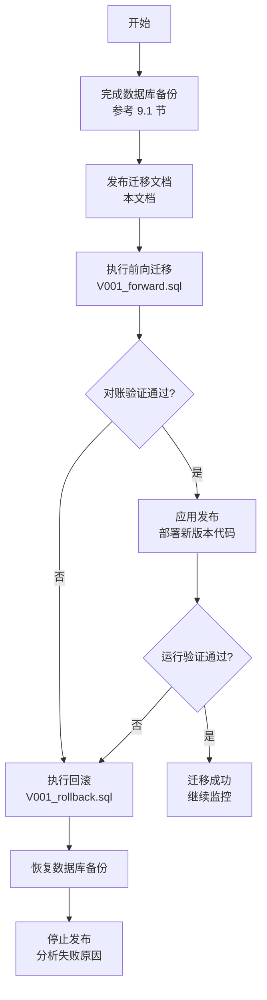
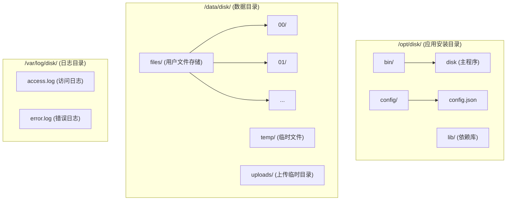

# 网盘系统 - 部署运维指南

## 1. 环境要求

### 1.0 安全配置

**所有环境必须设置以下环境变量：**

| 变量名 | 说明 | 要求 | 适用环境 |
|--------|------|------|----------|
| `JWT_SECRET` | JWT签名密钥 | 最少32字符，建议64字符随机字符串 | **所有环境必须** |
| `DB_PASSWORD` | PostgreSQL数据库密码 | 强密码，避免使用默认值 | 仅安全模式 |
| `REDIS_PASSWORD` | Redis认证密码 | 强密码，与redis.conf中requirepass一致 | 仅安全模式 |
| `DISK_SECURE_MODE` | 安全模式开关 | 设置为`true`或`1`启用严格验证 | 生产环境必须 |

**启动验证行为：**
- `JWT_SECRET` 在所有环境中都会强制验证（最少32字符），缺失或过短时应用拒绝启动
- 当 `DISK_SECURE_MODE=true` 时，应用启动时还会额外验证 `DB_PASSWORD` 和 `REDIS_PASSWORD`
- 如果任何必需变量缺失，应用将拒绝启动并输出错误信息

**设置环境变量示例：**

```bash
# 生产环境 - /etc/disk/env
JWT_SECRET="your-very-long-and-secure-jwt-secret-key-at-least-32-characters"
DB_PASSWORD="your_strong_db_password"
REDIS_PASSWORD="your_strong_redis_password"
DISK_SECURE_MODE=true
```

**生成安全密钥：**

```bash
# 生成JWT密钥（推荐64字符）
openssl rand -base64 48

# 生成数据库密码
openssl rand -base64 24
```

> **重要**: 永远不要在 `config.json` 中存储生产环境密码。所有敏感配置必须通过环境变量注入。

### 1.1 硬件要求

#### 最低配置

| 组件 | 要求 |
|------|------|
| CPU | 4 核 |
| 内存 | 8 GB |
| 磁盘 | 100 GB SSD |
| 网络 | 100 Mbps |

#### 推荐配置

| 组件 | 要求 |
|------|------|
| CPU | 8 核+ |
| 内存 | 16 GB+ |
| 系统盘 | 100 GB SSD |
| 数据盘 | 500 GB+ SSD/HDD |
| 网络 | 1 Gbps |

### 1.2 软件要求

#### 操作系统

| 系统 | 版本 | 支持状态 |
|------|------|----------|
| Ubuntu | 22.04 LTS | 推荐 |
| Ubuntu | 20.04 LTS | 支持 |
| CentOS | 8 Stream | 支持 |
| Windows Server | 2022 | 支持 |
| Windows Server | 2019 | 支持 |

#### 依赖组件

| 组件 | 最低版本 | 推荐版本 |
|------|----------|----------|
| PostgreSQL | 14 | 16 |
| Redis | 6.0 | 7.2 |
| S3/MinIO | S3 API 兼容 | MinIO 最新稳定版或 AWS S3（仅 `storage_backend=s3`） |
| CMake | 3.20 | 3.28 |
| GCC / Clang | GCC 13 / Clang 16 | 最新稳定版 |
| vcpkg | - | 最新版 |

### 1.3 网络要求

| 端口 | 用途 | 是否必须 |
|------|------|----------|
| 8080 | HTTP API 服务 | 是 |
| 443 | HTTPS（生产环境） | 是 |
| 5432 | PostgreSQL 数据库 | 是 |
| 6379 | Redis 缓存 | 是 |
| 9000 | MinIO S3 API（示例） | 仅 MinIO 部署 |

---

## 2. 编译部署

### 2.1 获取源码

```bash
# 克隆项目
git clone https://github.com/your-org/disk.git
cd disk

# 初始化子模块（如有）
git submodule update --init --recursive
```

### 2.2 安装依赖

#### Ubuntu 22.04

```bash
# 更新系统
sudo apt update && sudo apt upgrade -y

# 安装编译工具
sudo apt install -y build-essential cmake ninja-build git curl zip unzip tar pkg-config

# 安装 vcpkg
git clone https://github.com/Microsoft/vcpkg.git ~/vcpkg
cd ~/vcpkg
./bootstrap-vcpkg.sh
echo 'export VCPKG_ROOT=~/vcpkg' >> ~/.bashrc
echo 'export PATH=$VCPKG_ROOT:$PATH' >> ~/.bashrc
source ~/.bashrc

# 安装 PostgreSQL 客户端库
sudo apt install -y libpq-dev

# 安装 Redis
sudo apt install -y redis-server
sudo systemctl enable redis-server
sudo systemctl start redis-server
```

#### Windows

```powershell
# 使用 winget 安装工具
winget install Kitware.CMake
winget install Git.Git
winget install Microsoft.VisualStudio.2022.BuildTools

# 安装 vcpkg
git clone https://github.com/Microsoft/vcpkg.git C:\vcpkg
cd C:\vcpkg
.\bootstrap-vcpkg.bat
[Environment]::SetEnvironmentVariable("VCPKG_ROOT", "C:\vcpkg", "User")
[Environment]::SetEnvironmentVariable("PATH", $env:PATH + ";C:\vcpkg", "User")
```

### 2.3 编译项目

#### 使用 CMake Presets（推荐）

```bash
# 查看可用的预设
cmake --list-presets

# 配置（Linux Release）
cmake --preset linux-release-clang

# 编译
cmake --build --preset linux-release-clang

# 或一步完成
cmake --workflow --preset linux-release-clang
```

#### 手动编译

```bash
# 创建构建目录
mkdir -p build && cd build

# 配置（使用 vcpkg 工具链）
cmake .. \
  -DCMAKE_BUILD_TYPE=Release \
  -DCMAKE_TOOLCHAIN_FILE=$VCPKG_ROOT/scripts/buildsystems/vcpkg.cmake

# 编译
cmake --build . --config Release -j$(nproc)

# 安装（可选）
sudo cmake --install . --prefix /opt/disk
```

#### Windows 编译

```powershell
# 使用 CMake Presets
cmake --preset windows-release-clang-cl
cmake --build --preset windows-release-clang-cl
```

### 2.4 编译选项

| 选项 | 默认值 | 说明 |
|------|--------|------|
| CMAKE_BUILD_TYPE | Debug | 构建类型：Debug/Release/RelWithDebInfo |
| BUILD_TESTING | ON | 是否编译测试 |
| ENABLE_HTTPS | ON | 是否启用 HTTPS |
| ENABLE_REDIS | ON | 是否启用 Redis 缓存 |

```bash
# 自定义编译选项
cmake .. \
  -DCMAKE_BUILD_TYPE=Release \
  -DBUILD_TESTING=OFF \
  -DENABLE_HTTPS=ON
```

---

## 3. 数据库配置

### 3.1 PostgreSQL 安装与配置

#### Ubuntu 安装

```bash
# 安装 PostgreSQL
sudo apt install -y postgresql

# 启动服务
sudo systemctl enable postgresql
sudo systemctl start postgresql

# 初始化数据库集群（如未自动初始化）
sudo postgresql-setup initdb
```

#### 创建数据库和用户

```sql
-- 以 postgres 用户登录 psql
sudo -u postgres psql

-- 创建数据库
CREATE DATABASE disk ENCODING 'UTF8' LC_COLLATE 'en_US.utf8' LC_CTYPE 'en_US.utf8';

-- 创建用户
CREATE USER disk_user WITH PASSWORD 'your_secure_password';

-- 授权
GRANT ALL PRIVILEGES ON DATABASE disk TO disk_user;
\c disk
GRANT ALL ON SCHEMA public TO disk_user;
```

#### 初始化表结构

```bash
# 执行数据库初始化脚本
psql -U disk_user -h localhost -d disk -f scripts/init_database.sql
```

### 3.2 PostgreSQL 性能优化

编辑 `/etc/postgresql/16/main/postgresql.conf`（版本号根据实际安装调整）：

```ini
# 基础配置
max_connections = 500

# 内存配置
shared_buffers = 4GB                    # 约为可用内存的 25%
effective_cache_size = 12GB             # 约为可用内存的 75%
work_mem = 16MB                         # 每个查询操作的工作内存
maintenance_work_mem = 512MB            # 维护操作（VACUUM、CREATE INDEX）内存

# WAL 配置
wal_buffers = 16MB
max_wal_size = 2GB
min_wal_size = 512MB

# 查询规划
random_page_cost = 1.1                  # SSD 建议值
effective_io_concurrency = 200          # SSD 建议值

# 日志配置
log_min_duration_statement = 1000       # 记录执行时间超过 1 秒的慢查询
log_directory = '/var/log/postgresql'
log_filename = 'postgresql-%Y-%m-%d_%H%M%S.log'
```

### 3.3 Redis 配置

编辑 `/etc/redis/redis.conf`：

```conf
# 绑定地址
bind 127.0.0.1

# 端口
port 6379

# 密码（生产环境必须设置）
requirepass your_redis_password

# 内存限制
maxmemory 2gb
maxmemory-policy allkeys-lru

# 持久化
appendonly yes
appendfsync everysec

# 连接限制
maxclients 10000
```

### 3.4 数据库增量迁移

> **重要**: 本章节描述如何安全地执行数据库增量迁移。所有迁移操作均为增量变更（ADD COLUMN/ADD TABLE/ADD INDEX），不包含破坏性操作（DROP COLUMN/DROP TABLE），可安全回滚。

#### 3.4.1 迁移概述

本次数据库迁移 V001 新增以下数据库对象：

**新增字段：**

| 表名 | 字段名 | 类型 | 说明 | 默认值 |
|------|--------|------|------|--------|
| `users` | `storage_reserved` | BIGINT UNSIGNED | 上传预占用存储空间（字节） | 0 |
| `upload_tasks` | `reserved_bytes` | BIGINT UNSIGNED | 预占用字节数 | 0 |
| `upload_tasks` | `finalized_at` | DATETIME | 完成/失败时间 | NULL |
| `upload_tasks` | `fail_reason` | VARCHAR(512) | 失败原因 | NULL |
| `trash` | `content_id` | BIGINT UNSIGNED | 关联的文件内容ID（用于文件恢复） | NULL |

**新增表：**

| 表名 | 用途 | 备注 |
|------|------|------|
| `upload_task_chunks` | 存储分片上传任务已上传的分片信息 | 新表，无需数据回填 |

**新增索引：**

| 表名 | 索引类型 | 索引字段 | 用途 |
|------|----------|----------|------|
| `upload_tasks` | 联合索引 | `(user_id, status)` | 查询用户上传任务状态 |
| `upload_tasks` | 联合索引 | `(status, expires_at)` | 批量清理过期任务 |

#### 3.4.2 发布流程

数据库迁移遵循"文档先行、SQL 迁移、验证对账、应用发布、条件回滚"的安全发布流程：



#### 3.4.3 迁移执行顺序

**步骤 1：执行前向迁移脚本**

```bash
# 确保已完成数据库备份
/opt/disk/scripts/backup_db.sh

# 执行迁移脚本
psql -U disk_user -h localhost -d disk -f sql/migrations/V001_forward.sql
```

**V001_forward.sql 执行顺序（按依赖关系）：**

1. 新增 `users.storage_reserved` 字段
2. 新增 `upload_task_chunks` 表
3. 新增 `upload_tasks.reserved_bytes`, `finalized_at`, `fail_reason` 字段
4. 新增 `upload_tasks` 联合索引
5. 新增 `trash.content_id` 字段
6. 回填 `trash.content_id` 数据（从 `item_data` JSON 中提取）

#### 3.4.4 对账 SQL

**上线前验证（迁移前执行）：**

```sql
-- 验证 1: users 表应没有 storage_reserved 字段
-- 预期结果: ERROR: column "storage_reserved" does not exist
SELECT storage_reserved FROM users LIMIT 1;

-- 验证 2: upload_task_chunks 表不存在
-- 预期结果: ERROR: relation "upload_task_chunks" does not exist
SELECT COUNT(*) FROM upload_task_chunks;

-- 验证 3: upload_tasks 表应没有 reserved_bytes, finalized_at, fail_reason 字段
-- 预期结果: ERROR: column "reserved_bytes" does not exist
SELECT reserved_bytes FROM upload_tasks LIMIT 1;

-- 验证 4: trash 表应没有 content_id 字段
-- 预期结果: ERROR: column "content_id" does not exist
SELECT content_id FROM trash LIMIT 1;
```

**上线后验证（迁移后执行）：**

```sql
-- 验证 1: users.storage_reserved 字段已存在且默认值为 0
SELECT id, username, storage_reserved
FROM users
WHERE storage_reserved != 0;
-- 预期结果: 0 rows（所有用户 storage_reserved 应为 0）

-- 验证 2: upload_task_chunks 表已存在且为空
SELECT COUNT(*) as chunk_count
FROM upload_task_chunks;
-- 预期结果: chunk_count = 0（新表，暂无数据）

-- 验证 3: upload_tasks 新字段已存在
\d upload_tasks
-- 预期结果: 列定义中包含 reserved_bytes、finalized_at、fail_reason

-- 验证 4: trash.content_id 字段已存在
\d trash
-- 预期结果: 列定义中包含 content_id

-- 验证 5: trash.content_id 已回填
SELECT COUNT(*) as backfill_target
FROM trash
WHERE item_type = 'file' AND content_id IS NULL;
-- 预期结果: backfill_target = 0（所有文件记录的 content_id 已回填）

-- 验证 6: file_contents.ref_count 与实际引用数一致
SELECT
    fc.id,
    fc.ref_count as stored_ref_count,
    COUNT(DISTINCT f.id) as files_count,
    COUNT(DISTINCT t.id) as trash_count,
    (COUNT(DISTINCT f.id) + COUNT(DISTINCT t.id)) as actual_ref_count
FROM file_contents fc
LEFT JOIN files f ON f.content_id = fc.id
LEFT JOIN trash t ON t.content_id = fc.id AND t.item_type = 'file'
GROUP BY fc.id
HAVING stored_ref_count != actual_ref_count;
-- 预期结果: 0 rows（ref_count 与实际引用数一致）

-- 验证 7: upload_tasks 新索引已创建
SELECT indexname, indexdef
FROM pg_indexes
WHERE tablename = 'upload_tasks'
AND indexname IN ('idx_upload_tasks_user_status', 'idx_upload_tasks_status_expires');
-- 预期结果: 2 行结果（两个新索引已创建）
```

#### 3.4.5 回滚步骤

如果迁移执行失败或对账验证失败，执行以下回滚步骤：

**步骤 1：执行回滚脚本**

```bash
# 执行回滚脚本
psql -U disk_user -h localhost -d disk -f sql/migrations/V001_rollback.sql
```

**V001_rollback.sql 执行顺序（按依赖关系逆序）：**

1. 删除 `trash.content_id` 字段
2. 删除 `upload_tasks` 新索引
3. 删除 `upload_tasks.reserved_bytes`, `finalized_at`, `fail_reason` 字段
4. 删除 `upload_task_chunks` 表
5. 删除 `users.storage_reserved` 字段

**步骤 2：验证回滚成功**

```sql
-- 验证 1: users.storage_reserved 已删除
-- 预期结果: ERROR: column "storage_reserved" does not exist
SELECT storage_reserved FROM users LIMIT 1;

-- 验证 2: upload_task_chunks 表已删除
-- 预期结果: ERROR: relation "upload_task_chunks" does not exist
SELECT COUNT(*) FROM upload_task_chunks;

-- 验证 3: upload_tasks 新字段已删除
-- 预期结果: ERROR: column "reserved_bytes" does not exist
SELECT reserved_bytes FROM upload_tasks LIMIT 1;

-- 验证 4: trash.content_id 已删除
-- 预期结果: ERROR: column "content_id" does not exist
SELECT content_id FROM trash LIMIT 1;
```

**步骤 3：如果回滚失败，恢复数据库备份**

```bash
# 从最新备份恢复
gunzip < /data/backups/postgresql/disk_$(date +%Y%m%d_%H%M%S).sql.gz | psql -U disk_user -h localhost -d disk
```

#### 3.4.6 风险提示与停止条件

**停止条件（触发回滚）：**

1. **对账验证失败**：
   - `users.storage_reserved` 存在非零值（预期应为 0）
   - `upload_task_chunks` 表包含数据（预期应为空表）
   - `file_contents.ref_count` 与实际引用数不一致
   - `trash.content_id` 回填不完整（存在 `item_type='file' AND content_id IS NULL` 的记录）

2. **迁移脚本执行失败**：
   - SQL 执行过程中出现任何错误
   - 表结构变更失败
   - 数据回填失败

3. **应用启动失败**：
   - 新版本代码无法连接数据库
   - 新字段/表访问异常
   - 功能测试失败

**风险提示：**

| 风险项 | 风险等级 | 缓解措施 |
|--------|----------|----------|
| `trash.content_id` 回填不完整 | 🟡 中 | 迁移脚本包含数据回填逻辑，执行后必须验证所有文件记录的 content_id 已填充 |
| `file_contents.ref_count` 不一致 | 🟡 中 | 对账 SQL 必须执行，如发现不一致需立即回滚并分析原因 |
| 迁移执行时间过长 | 🟢 低 | 所有操作为增量变更，预计执行时间 < 5 分钟（数据量 < 100 万） |
| 回滚失败 | 🟢 低 | 所有变更可逆，提供完整回滚脚本和备份恢复方案 |
| 应用兼容性问题 | 🟢 低 | 新版本代码兼容迁移后的数据库结构，旧版本代码不依赖新字段 |

**数据安全保证：**

- ✅ 所有变更均为增量操作（ADD COLUMN/ADD TABLE/ADD INDEX）
- ✅ 不包含任何破坏性操作（DROP COLUMN/DROP TABLE/DROP DATABASE）
- ✅ 迁移前强制备份（参考 9.1 节）
- ✅ 提供完整回滚脚本（`V001_rollback.sql`）
- ✅ 对账 SQL 覆盖所有变更点
- ✅ 明确的停止条件和回滚触发条件

#### 3.4.7 V002 分享审计操作者可空迁移

V002 使 `operation_logs.user_id` 可空，并把用户外键从 `ON DELETE CASCADE` 改为 `ON DELETE SET NULL`。新建数据库已经在 `sql/init.sql` 使用相同定义；存量 PostgreSQL 数据库必须先执行迁移，再发布包含分享访客审计的应用版本。

```bash
# 前向迁移；脚本在单个事务中重建外键，可重复执行
psql -v ON_ERROR_STOP=1 -U disk_user -h localhost -d disk \
  -f sql/migrations/V002_share_audit_forward.sql

# 对账：is_nullable 应为 YES，delete_rule 应为 SET NULL
psql -U disk_user -h localhost -d disk -c "
SELECT c.is_nullable, rc.delete_rule
FROM information_schema.columns c
JOIN information_schema.referential_constraints rc
  ON rc.constraint_name = 'fk_operation_logs_user_id'
WHERE c.table_schema = 'public'
  AND c.table_name = 'operation_logs'
  AND c.column_name = 'user_id';"
```

发布后验证至少包含：所有者 `share_create`/`share_cancel` 的 `user_id` 为真实操作者；访客 `share_access`/`share_pwd_fail`/`share_download` 的 `user_id IS NULL`；`details` 不含密码、密码哈希、原始 Share Token 或认证请求头；90 天分批清理语句同时覆盖两类日志。

V002 审计写入失败是 fail-open 且不自动重试。运维应对 `Failed to record share audit event` 错误日志告警，修复数据库后通过业务事件和日志时间窗口对账，不得把访客事件补记到分享所有者名下。

回滚脚本会在存在 `user_id IS NULL` 的日志时主动失败，避免静默删除或伪造操作者。需要回滚时应先备份并按隐私/保留规则归档或删除这些访客日志，再执行：

```bash
psql -v ON_ERROR_STOP=1 -U disk_user -h localhost -d disk \
  -f sql/migrations/V002_share_audit_rollback.sql
```

回滚后 `user_id` 恢复 `NOT NULL`、外键恢复 `ON DELETE CASCADE`，旧应用可继续运行；包含访客审计的新应用不得在回滚后的 schema 上发布。

#### 3.4.8 V003 分布式上传 expand 迁移

ADR-002 的数据库升级依次使用 `sql/migrations/V003_distributed_upload_forward.sql` 和
`V004_storage_reconciliation_forward.sql`，并由独立迁移任务调用 `scripts/migrate-db.sh` 执行。
V003 建立上传租约和持久任务队列，V004 建立可查询的对账发现表。执行器使用
`schema_migrations` 保存脚本 SHA-256，并在同一 PostgreSQL 事务内获取 advisory lock、执行 DDL 和
记录版本。API 和 Worker 启动流程只校验 schema 版本，不执行 DDL，避免多副本并发迁移。

V003 采用 expand/data/contract 三阶段：

1. **Expand**：为 `upload_tasks` 增加暂存后端、状态版本、完成租约、诊断和完成结果字段；为 `upload_task_chunks` 增加大小、MD5、对象 key 和 ETag；新增 `storage_jobs`、约束和认领索引。新增列必须允许旧应用继续读写现有任务。
2. **Data**：把存量进行中任务标记为 `staging_backend=local` 并生成稳定 `staging_prefix`；上线前统计进行中任务和本地暂存目录，迁移期由旧实例完成或取消这些任务。新任务逐步切换到 `s3`。
3. **Contract**：只在所有旧实例退出、没有 local 暂存任务且对账通过后，删除临时兼容默认值或废弃路径。本轮不在 expand 脚本中执行破坏性 contract DDL。

推荐发布顺序：

```text
备份与 schema 对账
  -> 单实例迁移 Job 执行 V003 expand
  -> 发布兼容新旧暂存的 Worker
  -> 发布兼容新旧暂存的 API
  -> 开启 s3 新任务开关
  -> 排空 local 任务并完成对象对账
  -> 后续独立版本执行 contract
```

迁移 Job 通过标准 `PGHOST`、`PGPORT`、`PGDATABASE`、`PGUSER`、`PGPASSWORD` 注入连接信息，然后执行：

```bash
scripts/migrate-db.sh
```

执行器固定使用 `psql -X -v ON_ERROR_STOP=1 --single-transaction`，并允许在已完成迁移的 schema 上重复执行而不产生第二张表、重复索引或重复约束。若账本中同版本 checksum 与仓库脚本不同，发布立即停止。V004 回滚只允许在对账发现表为空且所有使用该表的 Worker 已退出时手工执行 `V004_storage_reconciliation_rollback.sql`。V003 回滚只允许在新字段仍未承载业务状态、`storage_jobs` 无记录且应用已回退时执行；否则保留 expand schema，回退应用配置并修复数据，不删除恢复所需记录。

发布候选版必须先通过 `FullSchemaUpgradeIntegration`：该用例只创建唯一临时数据库，从 V002 兼容基线按 manifest 顺序执行 V003/V004，并逐值比较代表性用户、文件、上传和配额快照。生产执行前仍需对目标库做备份，并在同版本的脱敏恢复副本上先跑完整迁移与业务对账。

发布候选版还必须通过 `ExpandMixedVersionIntegration`。该用例固定以
`6ed0afefb9ae6614ac5cc735b237dead28d10ecb` 作为 V002 旧二进制：先让旧进程在 V002 schema 上创建并写入 local 上传，保持进程在线执行真实 V003/V004 迁移，受控回收隔离数据库中的旧连接并确认同一进程自动重连，再验证旧进程迁移后仍可读写、当前进程可使用旧路径接管完成、两边签发的访问令牌兼容，并精确对账文件、内容引用和配额。测试默认从 Git 历史构建该旧版本并复用当前构建树的 vcpkg 依赖；浅克隆或源代码归档环境必须通过 `DISK_LEGACY_V002_BINARY` 提供已经验证的可执行文件，不能把缺少旧制品记为通过。

混跑期间必须满足以下发布门禁：`upload_staging_backend=local`，所有实例共享 PostgreSQL 与 Redis；只有允许处理某个旧任务的进程才挂载其原 `storage_base_path`/`temp_upload_path`，负载均衡按 `upload_id` 把上传生命周期请求固定到该原卷。允许把旧格式任务单向交给挂载原卷的当前版本接管；当前版本写入带 `object_key` 的新格式分片后不得再路由给 V002 完成。V002 的 Blob 读取接口忽略 `file_contents.storage_path` 并按 MD5 旧布局重建路径，因此当前版本开始完成 SHA-256 Blob 后，`/api/file/download/*` 与 `/api/share/download/*` 的内容下载必须全部路由到当前版本；当前版本负责同时读取历史 MD5 和新 SHA-256 路径。测试中共享目录模拟的是同一原卷，不授权把 local 暂存作为最终共享文件系统。旧实例完全退出前不得开启 S3 新任务或无粘性上传路由。旧实例退出、local 非终态任务归零并完成 staging 对账后，才可继续 ADR-002 的随机路由阶段。

V002 的上传任务创建语句含 `RETURNING *`。V003 为 `upload_tasks` 增列后，迁移前已在连接中缓存的计划会以 PostgreSQL `cached plan must not change result type` 拒绝再次执行。发布编排必须先把目标旧实例从上传流量摘除，执行迁移，然后逐实例回收数据库连接池或滚动重启，并通过 profile 与一次 local 上传探针确认重连后再恢复流量。生产环境优先滚动重启；只有能够按实例精确识别连接 PID 时才使用 `pg_terminate_backend`，禁止对业务库执行未限定目标的批量终止。该步骤是连接计划刷新，不是 schema rollback，且不允许跳过。

local 暂存排空必须按以下顺序执行：

1. 停止创建新的 local 任务，并从数据库导出 `status IN (0,4) AND staging_backend='local'` 的 upload ID、状态、过期时间和预留字节；逐台旧节点只读扫描 `<temp_upload_path>/<upload_id>/` 与 `<temp_upload_path>/<upload_id>.tmp`，形成带节点/卷标识的归属清单。数据库不保存 local 节点 owner，禁止根据 `staging_prefix` 猜测主机。
2. 缺少目录、重复出现在多节点或没有 DB 行的对象先冻结并进入对账；一致任务保持 upload 路由亲和。可以在原节点停掉 V002 后，以相同卷路径启动兼容当前 API，分别让任务完成、用户/维护窗口取消或自然过期。
3. local 任务存在期间只启动一个挂载原卷的迁移 Worker；其他 Worker 保持停止认领。该 Worker 负责 `expire_uploads` 和所有 local `staging_cleanup`，直到相关 job 为 `Succeeded`。当前 payload 没有节点 owner，错误 Worker 对不存在目录的幂等成功会掩盖原卷孤儿，因此不能用通用 Worker 抢占代替路由门禁。
4. 以下查询返回零且原卷扫描无遗留后，才删除亲和规则并扩大 Worker/API 副本：

```sql
SELECT COUNT(*) AS local_nonterminal
FROM upload_tasks
WHERE staging_backend = 'local' AND status IN (0, 4);

SELECT COUNT(*) AS local_cleanup_incomplete
FROM storage_jobs
WHERE job_type = 'staging_cleanup'
  AND payload->>'backend' = 'local'
  AND status <> 3;
```

发布候选版必须通过 `LocalStagingMigrationIntegration`：固定 V002 在原卷创建三个进行中任务，迁移后由挂载同一卷的 current API/唯一 Worker 分别收敛到 Completed、Cancelled、Expired，并验证配额、清理任务、原卷目录和未挂载目录边界。该用例只验证可执行策略；上线前仍必须用实际节点和实际任务生成归属清单。

#### 3.4.1 存量 local final Blob 迁移

只有现网 final backend 为 local 时执行本节。当前 `file_contents` 没有逐内容 backend，不能在服务在线时
把部分行切到 S3；维护窗口开始后必须停止负载入口、全部 API、Worker、定时任务和 Blob GC，并确认没有
进行中的完成事务。先完成 PostgreSQL 与 local Blob 备份，再设置数据库和 S3 连接环境变量。凭据只通过
环境或工作负载身份注入，不放入命令行、manifest 或 checkpoint。

```bash
export DISK_DATABASE_URL='postgresql://disk_user@postgres/disk'
export DISK_S3_ENDPOINT='https://s3.example.internal'
export DISK_S3_REGION='us-east-1'
export DISK_S3_ACCESS_KEY='...'
export DISK_S3_SECRET_KEY='...'

# 1. 从停写后的 DB 快照生成只读清单；path-base 是旧进程解析相对 storage_path 的工作目录。
scripts/migrate-final-blobs.py manifest \
  --manifest /var/lib/disk-migration/final-blobs.jsonl \
  --local-root /var/lib/disk/blobs \
  --path-base /var/lib/disk \
  --bucket disk \
  --object-prefix objects

# 2. 先 dry-run；确认报告后执行复制。checkpoint 必须与 manifest 一同备份。
scripts/migrate-final-blobs.py copy \
  --manifest /var/lib/disk-migration/final-blobs.jsonl \
  --checkpoint /var/lib/disk-migration/final-blobs.sqlite3 \
  --rate-limit-mib-per-second 50
scripts/migrate-final-blobs.py copy \
  --manifest /var/lib/disk-migration/final-blobs.jsonl \
  --checkpoint /var/lib/disk-migration/final-blobs.sqlite3 \
  --rate-limit-mib-per-second 50 --execute

# 3. 先验证 cutover；确认 DB 仍与清单一致后执行一次事务切换。
scripts/migrate-final-blobs.py cutover \
  --manifest /var/lib/disk-migration/final-blobs.jsonl \
  --checkpoint /var/lib/disk-migration/final-blobs.sqlite3
scripts/migrate-final-blobs.py cutover \
  --manifest /var/lib/disk-migration/final-blobs.jsonl \
  --checkpoint /var/lib/disk-migration/final-blobs.sqlite3 --execute

# 仅当 DB 已提交、S3 应用尚未恢复且 local 源仍完整时回滚；同样先 dry-run。
scripts/migrate-final-blobs.py rollback \
  --manifest /var/lib/disk-migration/final-blobs.jsonl
scripts/migrate-final-blobs.py rollback \
  --manifest /var/lib/disk-migration/final-blobs.jsonl --execute
```

manifest 是 JSONL：首行为版本、生成时间、规范化 local 根目录、bucket、object prefix 和对象总数，后续
按 content ID 排序记录原 locator、根目录相对源文件、大小、MD5、SHA-256 与目标 key。生成阶段拒绝
根目录逃逸、缺失/非普通文件、重复 SHA-256、非法哈希和超过 `storage_path VARCHAR(512)` 的目标 key。
copy 每次都重新读取源并计算 MD5/SHA-256；目标存在时完整 GET 并校验，不覆盖冲突对象。上传成功只有在
完整 GET 得到相同大小和双哈希后才提交 SQLite checkpoint。进程在任意对象中途退出时，已提交对象可重验
复用，当前对象由 S3 单对象原子可见性或 multipart abort/lifecycle 收敛，下一次执行重新处理。

cutover 会再次完整读取所有目标并校验 checkpoint，然后以 `ACCESS EXCLUSIVE NOWAIT` 锁验证数据库完整
集合。任何新增、删除、哈希/大小/路径漂移或混合源/目标状态都会终止且不修改 DB。成功提交后，在恢复任何
进程前把所有 API/Worker 同时配置为相同 bucket、`storage_backend=s3` 和 manifest 中的 object prefix，
执行下载/Range 探针与全量对账后再开放流量。旧 local Blob、manifest 和 checkpoint 至少保留到备份恢复
演练及配额、`ref_count`、DB/对象对账全部通过；不得因 checkpoint 显示完成就删除源文件。

### 3.5 Redis 连接验证

#### 3.5.1 验证 Redis 服务运行

**检查 Redis 进程状态**:

```bash
# 使用 systemd（推荐）
sudo systemctl status redis
# 或
sudo systemctl status redis-server

# 预期输出: ● redis-server.service - Advanced key-value store
#             Active: active (running) since ...
```

**测试 Redis 连通性**:

```bash
# 测试本地 Redis（无密码）
redis-cli ping
# 预期输出: PONG

# 测试远程 Redis（有密码）
redis-cli -h 127.0.0.1 -p 6379 -a your_redis_password ping
# 预期输出: PONG

# 查看连接信息
redis-cli -a your_redis_password INFO server | grep redis_version
```

#### 3.5.2 验证应用配置

**检查 config.json 中的 Redis 配置**:

```bash
# 查看完整配置
cat config.json | jq '.redis_clients'

# 预期输出:
[
  {
    "name": "default",
    "host": "127.0.0.1",
    "port": 6379,
    "passwd": "${REDIS_PASSWORD}",
    "db": 0,
    "is_fast": false,
    "number_of_connections": 10,
    "timeout": -1.0
  }
]
```

**配置说明**:

| 字段 | 说明 | 推荐值 |
|------|------|--------|
| name | 连接名称 | "default" |
| host | Redis 服务器地址 | 生产环境使用内网 IP |
| port | Redis 端口 | 默认 6379 |
| passwd | Redis 密码 | 使用环境变量 `${REDIS_PASSWORD}` |
| db | Redis 数据库编号 | 0（默认） |
| number_of_connections | 连接池大小 | 10（低并发）、50（高并发） |
| timeout | 连接超时（秒） | -1.0（永不超时） |

#### 3.5.3 验证连接池

**查看 Redis 连接列表**:

```bash
# 启动应用前
redis-cli -a your_redis_password CLIENT LIST | wc -l
# 预期: 少量连接（1-2 个）

# 启动应用后
redis-cli -a your_redis_password CLIENT LIST | wc -l
# 预期: 连接数 ≈ number_of_connections (10)
```

**监控连接池状态**:

```bash
# 查看 Redis 连接详细信息
redis-cli -a your_redis_password INFO clients

# 关注字段:
# connected_clients: 当前连接数
# blocked_clients: 阻塞连接数
# maxclients: 最大允许连接数
```

#### 3.5.4 性能调优

**生产环境建议**:

1. **连接池大小**:
   - 低并发（<100 用户）: 10 个连接
   - 中并发（100-500 用户）: 50 个连接
   - 高并发（>500 用户）: 100 个连接

2. **内存配置**:
   ```ini
   # /etc/redis/redis.conf
   maxmemory 2gb
   maxmemory-policy allkeys-lru
   ```

3. **持久化配置**:
   ```ini
   # 数据持久化到磁盘
   appendonly yes
   appendfsync everysec  # 每秒同步一次
   ```

4. **网络配置**:
   ```ini
   # 仅绑定内网 IP
   bind 127.0.0.1 10.0.0.1
   ```

#### 3.5.5 常见问题排查

**问题 1: 连接超时**

```bash
# 检查防火墙
sudo ufw status
sudo ufw allow 6379/tcp

# 检查 Redis 监听地址
sudo netstat -tlnp | grep 6379
# 应显示: 0.0.0.0:6379 或 127.0.0.1:6379
```

**问题 2: 认证失败**

```bash
# 测试密码
redis-cli -h 127.0.0.1 -p 6379 -a wrong_password ping
# 预期: (error) NOAUTH Authentication required.

# 检查配置
cat /etc/redis/redis.conf | grep requirepass
# 确认密码与 config.json 一致
```

**问题 3: 连接池耗尽**

```bash
# 查看 Redis 最大连接数
redis-cli -a your_redis_password CONFIG GET maxclients

# 增加最大连接数
redis-cli -a your_redis_password CONFIG SET maxclients 10000
```

**注意事项**:

1. **生产环境安全**:
   - ✅ 必须设置 Redis 密码
   - ✅ 使用环境变量 `${REDIS_PASSWORD}`
   - ❌ 不要在配置文件中硬编码密码
   - ❌ 不要将 Redis 暴露到公网

2. **网络安全**:
   - 使用内网 IP，不要使用公网 IP
   - 配置防火墙，只允许应用服务器访问
   - 使用 Redis 6.0+ 的 ACL（访问控制列表）

3. **监控告警**:
   - 监控 Redis 连接数、内存使用、命令延迟
   - 设置告警阈值：连接数 > 80%、内存使用 > 90%

4. **连接池配置**:
   - 根据并发需求调整 `number_of_connections`
   - 高并发场景可增加到 100+ 个连接
   - 监控连接池使用情况，避免连接泄漏

---

## 4. 应用配置

### 4.1 配置文件说明

应用配置文件 `config.json`：

> **安全提示**: 敏感信息（密码）不应存储在配置文件中。以下配置中的 `passwd` 字段留空，实际值通过环境变量提供。

下例包含 ADR-002 的完整运行时字段。滚动发布必须在 V003 expand migration 完成后再启用 Worker 角色。

```json
{
  "listeners": [
    {
      "address": "0.0.0.0",
      "port": 8080,
      "https": false
    },
    {
      "address": "0.0.0.0",
      "port": 443,
      "https": true,
      "cert": "/etc/ssl/certs/disk.crt",
      "key": "/etc/ssl/private/disk.key"
    }
  ],
  "app": {
    "threads_num": 4,
    "upload_path": "/data/disk/uploads",
    "document_root": "",
    "client_max_body_size": "20M",
    "enable_server_header": false,
    "enable_date_header": false
  },
  "db_clients": [
    {
      "name": "postgresql",
      "rdbms": "postgresql",
      "host": "127.0.0.1",
      "port": 5432,
      "dbname": "disk",
      "user": "disk_user",
      "passwd": "",
      "connection_number": 8,
      "timeout": 30
    }
  ],
  "redis_clients": [
    {
      "name": "redis",
      "host": "127.0.0.1",
      "port": 6379,
      "passwd": "",
      "db": 0,
      "number_of_connections": 4
    }
  ],
  "plugins": [
    {
      "name": "drogon::plugin::AccessLogger",
      "config": {
        "log_path": "/var/log/disk/",
        "log_file": "access",
        "log_size_limit": 10485760,
        "max_files": 10,
        "use_spdlog": true,
        "log_format": "[$request_date] [$thread] ($remote_addr - $local_addr) \"$request\" $status $body_bytes_sent $processing_time"
      }
    }
  ],
  "custom_config": {
    "disk": {
      "process_role": "all",
      "instance_id": "disk-dev-1",
      "storage_backend": "local",
      "upload_staging_backend": "local",
      "storage_base_path": "/data/disk/files",
      "temp_upload_path": "/data/disk/temp",
      "file_io_threads": 4,
      "auth_cpu_pool_threads": 4,
      "upload_finalize_lease_seconds": 120,
      "worker_poll_interval_ms": 1000,
      "worker_claim_batch_size": 20,
      "worker_concurrency": 1,
      "worker_lease_duration_seconds": 120,
      "worker_drain_timeout_seconds": 30,
      "share_access_rate_limit_per_minute": 30,
      "share_access_rate_limit_window_seconds": 60,
      "share_browse_rate_limit_per_minute": 60,
      "share_browse_rate_limit_window_seconds": 60,
      "share_download_rate_limit_per_minute": 10,
      "share_download_rate_limit_window_seconds": 60,
      "s3": {
        "bucket": "disk",
        "region": "us-east-1",
        "endpoint": "http://127.0.0.1:9000",
        "use_ssl": false,
        "force_path_style": true,
        "verify_ssl": false,
        "object_prefix": "objects",
        "staging_prefix": "staging",
        "max_connections": 16,
        "io_threads": 4,
        "connect_timeout_ms": 3000,
        "request_timeout_ms": 300000,
        "max_retries": 3,
        "retry_base_delay_ms": 100
      }
    }
  }
}
```

`client_max_body_size` 是 Drogon `app` 节点字段，必须保持在 `app` 对象内。将它放在配置根级会被 Drogon 忽略并回退到默认 1 MiB，使标准 5 MiB 上传分片在进入控制器前被 HTTP 413 拒绝。

#### 4.1.1 配置字段说明

`custom_config.disk` 配置节点中的存储字段：

| 字段 | 类型 | 默认值 | 取值范围 | 说明 |
|------|------|--------|----------|------|
| `process_role` | string | all | api / worker / all | 进程角色；`DISK_PROCESS_ROLE` 环境变量优先于 JSON |
| `instance_id` | string | `disk-<UUID>`（进程启动时生成） | 1-128 个 `[A-Za-z0-9._:-]` 字符，集群内唯一 | 租约 owner 和诊断标签；`DISK_INSTANCE_ID` 环境变量优先于 JSON；不得包含凭据 |
| `storage_backend` | string | local | local / s3 | 最终 blob 后端 |
| `upload_staging_backend` | string | local | local / s3 | 新上传任务暂存后端；生产多实例目标为 s3 |
| `storage_base_path` | string | build/uploaded | 有效路径 | local 后端的内容寻址 blob 根目录 |
| `temp_upload_path` | string | build/temp_uploads | 有效路径 | local 暂存兼容路径；多实例生产不得作为新任务暂存 |
| `file_io_threads` | integer | 自动 | >0 | 本地暂存/Blob I/O 线程池大小 |
| `auth_cpu_pool_threads` | integer | 4 | 1-64 | API 认证/JWT/密码哈希 CPU 线程池；Worker 不初始化该池 |
| `upload_finalize_lease_seconds` | integer | 120 | 30-3600 | 完成上传租约时长；续租与接管使用数据库时间 |
| `worker_poll_interval_ms` | integer | 1000 | 100-60000 | Worker 无任务时的轮询间隔 |
| `worker_claim_batch_size` | integer | 20 | 1-1000 | 单次认领配置上限；有效值为与 `worker_concurrency` 的较小值，当前为 1 |
| `worker_concurrency` | integer | 1 | 当前只允许 1 | 按 ADR-002 保持整个 Worker 和每类 handler 串行；后续只能根据指标显式放宽 |
| `worker_lease_duration_seconds` | integer | 120 | 30-3600 | 持久任务认领租约时长；执行期间按其三分之一续租 |
| `worker_drain_timeout_seconds` | integer | 30 | 1-300 | SIGTERM/SIGINT 后停止认领并等待在途任务的最长时间 |
| `s3.bucket` | string | disk | 非空 | S3/MinIO bucket |
| `s3.region` | string | us-east-1 | 非空 | S3 region |
| `s3.endpoint` | string | 空 | URL | 自定义 S3/MinIO endpoint；AWS S3 可留空 |
| `s3.use_ssl` | boolean | true | - | endpoint 是否使用 HTTPS |
| `s3.force_path_style` | boolean | false | - | MinIO 通常设置为 true |
| `s3.verify_ssl` | boolean | true | - | 是否校验证书 |
| `s3.object_prefix` | string | objects | 相对 key 前缀 | 最终 blob 对象 key 前缀 |
| `s3.staging_prefix` | string | staging | 相对 key 前缀 | 上传分片、组装结果和临时对象 key 前缀 |
| `s3.max_connections` | integer | 16 | 1-256 | 每进程 AWS SDK HTTP 连接池上限 |
| `s3.io_threads` | integer | 4 | 1-64 | 每进程执行阻塞 S3 SDK 调用的专用线程上限 |
| `s3.connect_timeout_ms` | integer | 3000 | 100-60000 | 单次 S3 连接超时，毫秒 |
| `s3.request_timeout_ms` | integer | 300000 | 1000-3600000 | 单次 S3 请求超时，毫秒；不含请求级重试次数 |
| `s3.max_retries` | integer | 3 | 0-10 | 首次请求之外的最大重试次数；0 表示禁用请求内重试 |
| `s3.retry_base_delay_ms` | integer | 100 | 1-60000 | 可重试错误的指数退避基数，毫秒 |

S3 前缀会移除首尾 `/`；每个 `/` 分隔段只允许 ASCII 字母、数字、`.`、`_`、`-`，
且不允许空段、`.`、`..` 或反斜杠。空配置分别回退为 `objects` 和 `staging`，非法前缀
会使进程启动失败，不会在运行时拼接未经验证的对象 key。两类前缀不得相同或互为父子
前缀，以保证 staging 生命周期规则和清理操作永远不能覆盖 final Blob。

`s3.io_threads` 不得大于 `s3.max_connections`；不满足时进程在启动阶段失败。连接池是网络资源
上限，I/O 线程是应用同时发起同步 SDK 调用的上限；两者均按进程计算，不是集群共享配额。

S3 请求仅对 HTTP 408、429、5xx 和连接/网络类错误执行有界重试。认证、签名、bucket、参数及
其他普通 4xx 错误立即失败；即使 SDK 将其标记为 retryable，永久错误分类仍优先。每次业务调用
最多执行 `1 + s3.max_retries` 次请求，达到预算后把最后一次错误返回调用方，由上传租约或持久
Worker 决定是否进行更高层重试，禁止在任一层无限重试。

`process_role` 在非安全模式下默认为 `all`，仅供本地单进程开发和测试。`DISK_SECURE_MODE=true`
时必须通过 `DISK_PROCESS_ROLE` 或 `custom_config.disk.process_role` 显式选择 `api`/`worker`，
且禁止 `all`；这使生产误用单进程兼容模式时在启动阶段失败。

`instance_id` 在同一进程内跨 `LoadConfig()` 保持稳定。未配置时，每次进程启动生成新的 UUID；容器编排环境应通过 Downward API 或等价机制注入唯一的 `DISK_INSTANCE_ID`。任一显式 JSON 值或环境变量值超出表中约束时，应用必须启动失败，不能静默回退。

> **迁移范围**：旧版本中 `storage_backend=s3` 仅表示最终 Blob 使用对象存储，上传仍在本地暂存。ADR-002 实现后，`upload_staging_backend=s3` 才表示新任务使用 S3-native staging；每个任务把实际后端写入 PostgreSQL，因此滚动发布期间 local 与 s3 任务可并存。生产多实例在迁移完成后必须同时使用 `storage_backend=s3` 和 `upload_staging_backend=s3`。

同一集群的所有 API/Worker 必须使用相同的 `s3.staging_prefix`。运行时只接受精确等于
`{configured_staging_prefix}/{upload_id}` 的 S3 会话描述符；若要变更该前缀，必须先停止创建
新上传并排空或显式迁移所有 `staging_backend='s3'` 的非终态任务，不能在滚动发布中直接切换。

`upload_staging_backend=s3` 要求 `storage_backend=s3`，不支持把 S3 暂存提升到 local final。
迁移期间允许 `storage_backend=s3 + upload_staging_backend=local`，用于继续处理旧的本地暂存任务。

新建 final Blob 的 S3 key 固定为
`{s3.object_prefix}/sha256/{sha256[0:2]}/{sha256}.bin`；local 开发后端使用对应的
`{storage_base_path}/sha256/{sha256[0:2]}/{sha256}.bin`。历史 MD5 布局不会随配置加载自动迁移，
API 和 Worker 始终按 `file_contents.storage_path` 读取或删除已有对象。变更 `s3.object_prefix` 前
必须排空写流量并迁移数据库中的路径，不能只修改配置后滚动发布。

S3 原生完成先在 staging 前缀生成 assembled 对象，再使用 server-side multipart copy 提升到
final 前缀。每个 multipart upload ID 在首个 part 前登记到 `storage_jobs`，失败路径会即时 Abort；
Abort 失败或进程退出后由 Worker 按租约接管，assembled 会保留供完成租约接管或对账。bucket 生命周期
规则只能覆盖 staging 前缀和未完成 multipart，禁止覆盖 final 前缀。应用 cleanup Worker 上线前，
生命周期过期时间必须大于上传最大有效期、最长租约接管窗口和允许的人工恢复窗口之和。

生产发布必须同时启用 bucket 级 `AbortIncompleteMultipartUpload` 规则，覆盖 S3 返回 upload ID 到
PostgreSQL 任务登记之间的极短崩溃窗口。该规则的天数必须大于应用最大上传有效期；发布校验需要
分别确认“未完成 multipart 规则存在”和“final 前缀没有 Expiration”。仅依赖生命周期规则会延迟
资源回收且无法提供任务级审计，因此不能关闭 `multipart_abort` Worker。

仓库的 `deploy/minio/lifecycle.json` 是默认前缀的可执行基线：`staging/` 对象和所有未完成
multipart 均保留 7 天，`objects/` 不设置 Expiration。`docker-compose.s3.yml` 在建桶后执行：

```bash
mc ilm rule import local/disk /config/lifecycle.json
mc ilm rule export local/disk
```

生产 AWS S3 使用同一 JSON 执行
`aws s3api put-bucket-lifecycle-configuration --bucket <bucket> --lifecycle-configuration file://deploy/minio/lifecycle.json`，
随后用 `get-bucket-lifecycle-configuration` 复核。若 `s3.staging_prefix` 或 `s3.object_prefix` 不使用
默认值，发布前必须同步生成并校验对应规则；禁止直接复用前缀不匹配的样例。

> **构建依赖决策**：当前单一后端二进制始终编译并链接 AWS SDK for C++ 的 S3 组件，即使运行时选择 local。这样可避免两套制品和条件注册分支；若要支持不安装 AWS SDK 的 local-only 构建，需要另行设计可选编译特性。

#### 4.1.2 分享操作限流配置

分享访问、浏览和下载使用三组相互独立的正整数配置。字段缺失、为零、为负数或不能作为正整数使用时，应用使用下表代码默认值：

| 字段 | 默认值 | Redis 身份 | 覆盖范围 |
|------|--------|------------|----------|
| `share_access_rate_limit_per_minute` | 30 | 规范化客户端 IP | `/api/share/access/{share_id}` |
| `share_access_rate_limit_window_seconds` | 60 | 同上 | access 固定窗口秒数 |
| `share_browse_rate_limit_per_minute` | 60 | 已验证 Share Token JTI | `/api/share/browse/{share_id}` |
| `share_browse_rate_limit_window_seconds` | 60 | 同上 | browse 固定窗口秒数 |
| `share_download_rate_limit_per_minute` | 10 | 已验证 Share Token JTI | 下载元数据、内容和保存到网盘共享 |
| `share_download_rate_limit_window_seconds` | 60 | 同上 | download 固定窗口秒数 |

字段名中的 `per_minute` 为现有配置命名约定；实际窗口由对应 `*_window_seconds` 决定。调整窗口时 limit 表示“每个配置窗口的请求数”，不得按名称再次换算。

**破坏性配置迁移**：`share_public_rate_limit_per_minute` 和 `share_public_rate_limit_window_seconds` 已从新合同删除。新版本不读取旧键，也不把旧值复制到三组新键；发布前必须显式配置六个新键。保留旧键只会造成运维误判，不会改变运行时默认值。

**Redis 键与窗口**：

```text
rate:share_access:{normalized_ip}:{window}
rate:share_browse:{jti}:{window}
rate:share_download:{jti}:{window}
```

`window` 是按配置秒数取整的 Unix 固定窗口起点。第一次 `INCR` 原子设置 TTL，后续递增不刷新；因此不需要单独清理正常过期键。升级前遗留的 `rate:share_public:*` 不再读取，可等待原 TTL 自然过期。禁止使用原始 Share Token、`X-Share-Token`、Authorization、密码或密码哈希构造键、日志或审计字段。

达到边界后返回 HTTP 429 / `10005 TooManyRequests` / `Too many requests`，并包含 `X-RateLimit-Limit`、`X-RateLimit-Remaining`、`X-RateLimit-Reset` 和 `Retry-After`。Redis 计数失败采用 fail open：记录操作类型和不含凭据的诊断信息后继续底层请求。生产监控应对该错误日志告警，因为 fail open 期间接口可用但滥用防护暂时降级。

可使用不回显 value 的 `SCAN` 检查键族分布：

```bash
redis-cli --scan --pattern 'rate:share_access:*'
redis-cli --scan --pattern 'rate:share_browse:*'
redis-cli --scan --pattern 'rate:share_download:*'
```

不要把扫描结果连同请求头或 token 保存到工单、日志或测试 evidence。JTI 不是可重放 token，但仍只应在短 TTL 限流键和请求内属性中使用。

文件列表缓存不使用 `SCAN` 删除。每个用户保持永久的 `file_list_version:{user_id}` 计数器，数据库写入成功后用 `INCR` 切换列表命名空间；`file_list:{user_id}:{version}:...` 结果键保留 30 秒 TTL 后自动回收。不得手工删除版本键作为常规清缓存操作；版本键缺失时应用从 `0` 开始，Redis 读取异常时列表查询降级到 PostgreSQL 且不回填。

### 4.2 环境变量

进程先读取 `DISK_CONFIG_FILE` 指定的 JSON（未设置时为工作目录下的 `config.json`），再以环境变量覆盖运行时连接、监听和对象存储字段。覆盖值必须完整通过类型和范围校验；变量存在但为空、布尔值不是 `true/false/1/0`、端口或连接池越界时，进程直接启动失败。最终生效配置只传给 Drogon，不写回文件，也不得完整打印到日志。PostgreSQL 连接池大小必须使用 Drogon 支持的 `db_clients[0].connection_number`；`DATABASE_POOL_SIZE` 只覆盖该字段，旧拼写 `num_connection_number` 不属于兼容配置，不能用于容量规划或指标口径。

支持的覆盖变量如下：

| 范围 | 环境变量 | JSON 目标 |
|------|----------|-----------|
| 配置文件 | `DISK_CONFIG_FILE` | 运行时配置文件路径 |
| HTTP | `DISK_LISTEN_ADDRESS`、`DISK_LISTEN_PORT` | `listeners[0].address/port` |
| PostgreSQL | `DATABASE_HOST`、`DATABASE_PORT`、`DATABASE_NAME`、`DATABASE_USER`、`DATABASE_PASSWORD`、`DATABASE_POOL_SIZE` | `db_clients[0]` |
| Redis | `REDIS_HOST`、`REDIS_PORT`、`REDIS_DB`、`REDIS_PASSWORD`、`REDIS_POOL_SIZE` | `redis_clients[0]` |
| 进程 | `DISK_PROCESS_ROLE`、`DISK_INSTANCE_ID` | `custom_config.disk.process_role/instance_id`；环境变量继续由 `ConfigMgr` 冻结 |
| 存储 | `DISK_STORAGE_BACKEND`、`DISK_UPLOAD_STAGING_BACKEND` | `custom_config.disk.storage_backend/upload_staging_backend` |
| S3 | `DISK_S3_BUCKET`、`DISK_S3_REGION`、`DISK_S3_ENDPOINT`、`DISK_S3_USE_SSL`、`DISK_S3_FORCE_PATH_STYLE`、`DISK_S3_VERIFY_SSL`、`DISK_S3_OBJECT_PREFIX`、`DISK_S3_STAGING_PREFIX`、`DISK_S3_MAX_CONNECTIONS`、`DISK_S3_IO_THREADS`、`DISK_S3_CONNECT_TIMEOUT_MS`、`DISK_S3_REQUEST_TIMEOUT_MS`、`DISK_S3_MAX_RETRIES`、`DISK_S3_RETRY_BASE_DELAY_MS` | `custom_config.disk.s3.*` |
| S3 凭据 | `DISK_S3_ACCESS_KEY`、`DISK_S3_SECRET_KEY`、`DISK_S3_SESSION_TOKEN` | 仅传给 AWS SDK 凭据提供链，不进入 JSON |

`DATABASE_PASSWORD` 和 `REDIS_PASSWORD` 会覆盖 Drogon 客户端的 `passwd` 字段。分布式配置模板中的两个字段必须为空，生产密码通过环境、容器 Secret 或密钥注入器提供。`DISK_S3_ACCESS_KEY` 与 `DISK_S3_SECRET_KEY` 必须同时存在；未设置时允许 AWS SDK 使用实例角色等默认凭据链。

创建 `/etc/disk/env` 文件：

```bash
# JWT密钥（至少 32 字符随机字符串）
JWT_SECRET=your_very_long_and_secure_jwt_secret_key_here

# 数据库连接（密码不得写入 config.json）
DATABASE_HOST=postgres-primary.internal
DATABASE_PORT=5432
DATABASE_NAME=disk
DATABASE_USER=disk
DATABASE_PASSWORD=your_db_password
DATABASE_POOL_SIZE=16

# Redis 连接（密码不得写入 config.json）
REDIS_HOST=redis.internal
REDIS_PORT=6379
REDIS_DB=0
REDIS_PASSWORD=your_redis_password
REDIS_POOL_SIZE=8

# 每个副本显式设置角色和唯一实例 ID
DISK_PROCESS_ROLE=api
DISK_INSTANCE_ID=disk-api-a

# 多实例生产必须使用共享对象存储
DISK_STORAGE_BACKEND=s3
DISK_UPLOAD_STAGING_BACKEND=s3
DISK_S3_BUCKET=disk-production
DISK_S3_REGION=us-east-1
DISK_S3_ENDPOINT=https://s3.internal.example
DISK_S3_USE_SSL=true
DISK_S3_VERIFY_SSL=true
DISK_S3_FORCE_PATH_STYLE=true
DISK_S3_MAX_CONNECTIONS=16
DISK_S3_IO_THREADS=4

# storage_backend=s3 时需要；不要写入 config.json
DISK_S3_ACCESS_KEY=your_s3_access_key
DISK_S3_SECRET_KEY=your_s3_secret_key
# 临时凭据可额外设置 DISK_S3_SESSION_TOKEN

# 安全模式（生产环境必须设置）
DISK_SECURE_MODE=true
```

> **重要**: 确保此文件权限为 `600`，仅 root 和应用用户可读取。

`DISK_SECURE_MODE=true` 除验证 JWT、数据库和 Redis 密码外，还要求显式 `api`/`worker` 角色；当 final 或 staging 选择 S3 时，必须同时启用 `s3.use_ssl` 与 `s3.verify_ssl`。`upload_staging_backend=s3` 仍要求 `storage_backend=s3`，空 bucket、重叠前缀和非法 endpoint 会在监听端口开放前失败。仓库的本地 Compose 明确运行在非安全模式并使用隔离开发网络上的 HTTP MinIO，不能照搬为生产配置。

`DISK_TEST_FAULT_INJECTION`、`DISK_TEST_PAUSE_AFTER_FINALIZE_CLAIM_UPLOAD_ID`、`DISK_TEST_PAUSE_AFTER_ASSEMBLY_UPLOAD_ID`、`DISK_TEST_PAUSE_AFTER_FINALIZE_COMMIT_UPLOAD_ID` 与 `DISK_TEST_PAUSE_AFTER_BLOB_DELETE_JOB_ID` 只属于受控集成测试，不是可部署的运行配置；生产环境不得设置。后端只在非安全模式、总开关精确为 `1` 且对应阶段变量精确匹配当前 upload ID 或十进制 `storage_jobs.id` 时，才会在 Finalizing 认领提交后、assembled 成功创建后、最终事务成功提交后或 Blob 删除成功但任务事务尚未写回时进入测试停顿；安全模式必须无条件忽略全部停顿点。

### 4.3 目录结构



创建目录：

```bash
# 创建目录结构
sudo mkdir -p /opt/disk/{bin,config,lib}
sudo mkdir -p /data/disk/{files,temp,uploads}
sudo mkdir -p /var/log/disk

# 创建文件分片存储目录（00-FF）
for i in $(seq -w 0 255 | xargs printf '%02X\n'); do
  sudo mkdir -p /data/disk/files/$i
done

# 设置权限
sudo chown -R disk:disk /data/disk
sudo chown -R disk:disk /var/log/disk
sudo chmod 750 /data/disk
sudo chmod 750 /var/log/disk
```

### 4.4 MinIO 开发验证

仓库提供 `docker-compose.s3.yml` 创建 MinIO 和 `disk` bucket：

```bash
docker compose -f docker-compose.s3.yml up -d

export DISK_S3_ENDPOINT=http://127.0.0.1:9000
export DISK_S3_BUCKET=disk
export DISK_S3_ACCESS_KEY=disk
export DISK_S3_SECRET_KEY=disk-password
export DISK_S3_REGION=us-east-1
```

将测试用配置中的 `storage_backend` 设为 `s3`、`endpoint` 设为上述地址、`force_path_style` 设为 `true`、`use_ssl`/`verify_ssl` 设为 `false`。环境门控验证命令见 `docs/design/04-系统测试计划.md`；生产环境必须使用专用凭据、TLS 和私有网络访问策略。

### 4.5 本地多实例验收

分布式验收使用仓库的 `docker-compose.distributed.yml` 启动 PostgreSQL、Redis、MinIO、两个 `process_role=api` 实例、两个 `process_role=worker` 实例和无粘性 Nginx 负载均衡器。四个应用进程来自同一个 `disk-distributed` 镜像，仅由 `DISK_PROCESS_ROLE` 与 `DISK_INSTANCE_ID` 区分；两个 API 分别映射到 `18081/18082` 供交叉断言，负载均衡入口为 `18080`。所有实例共享同一数据库、Redis 和 bucket，并使用 S3 final/staging。

先从占位模板创建仅供本机使用的环境文件，并替换所有 `replace-*` 值：

```bash
cp deploy/distributed.env.example .env.distributed
docker compose --env-file .env.distributed -f docker-compose.distributed.yml up -d --build
docker compose --env-file .env.distributed -f docker-compose.distributed.yml ps

DISK_DISTRIBUTED_INTEGRATION=1 \
  DISK_DISTRIBUTED_ENV_FILE=.env.distributed \
  uv run test/integration/test_distributed_flow.py

docker compose --env-file .env.distributed -f docker-compose.distributed.yml down
```

`.env.distributed` 已加入忽略列表，不得提交。Compose 在 PostgreSQL 启动时载入当前 `sql/init.sql`，在 MinIO 启动后创建 bucket 并导入 `deploy/minio/lifecycle.json`。PostgreSQL 使用显式 `statement_timeout`、`lock_timeout` 和 `idle_in_transaction_session_timeout`；Redis 开启 AOF 与密码认证。该拓扑用于本地语义和故障注入，不代表 PostgreSQL、Redis 或单节点 MinIO 已具备生产高可用。

当开发机没有 Docker 时，可使用本地进程入口运行同一套断言。主机必须已安装 PostgreSQL server/client 和 Redis 或 Valkey server，`DISK_MINIO_BIN` 必须指向可执行的 MinIO server；运行器使用随机端口和临时数据目录，不会修改主机现有的 PostgreSQL/Redis 实例。

```bash
DISK_DISTRIBUTED_LOCAL_INTEGRATION=1 \
  DISK_MINIO_BIN=/path/to/minio \
  ctest --test-dir build/linux-debug-clang \
    -R '^DistributedLocalFlowIntegration$' -V
```

本地进程入口是无 Docker 环境下的测试备用方式，不替代 `docker-compose.distributed.yml` 的部署契约。未设置环境门控而跳过时不得记录为分布式验收通过。

#### 4.5.1 容量起步配置与扩容边界

仓库分布式样例固定以下保守起步值。它们来自 2026-07-20 的 API 扩展、文件负载、S3
组装、故障施压和 Worker 积压基线；是部署初值，不是未经生产依赖验证的容量上限。

| 资源 | 每实例建议值 | 适用范围与边界 |
|------|-------------:|----------------|
| API 副本 | 2 | 高可用最小建议；先横向扩容，超过本机已测 4 API 矩阵前重新压测业务路径 |
| Worker 副本 | 2 | 高可用常态；积压恢复可临时扩到已测的 4 个，超过 4 个必须重新压测 |
| Drogon HTTP 线程 | 4 | `app.threads_num`，所有应用进程固定；不得使用按宿主机核数自动展开的 `0` |
| 认证 CPU 线程 | 4 | `auth_cpu_pool_threads`，只由 API 创建；不得按每个 API 重复使用全部宿主机逻辑 CPU |
| PostgreSQL 连接 | 8 | 每个 API/Worker 的 `connection_number` |
| Redis 连接 | 4 | 每个 API/Worker 的 `number_of_connections` |
| S3 HTTP / I/O 线程 | 16 / 4 | 每进程；`io_threads <= max_connections` |
| 上传组装并发 | 2 | 每 API 的 `assembly_max_concurrent`；真实 MinIO/云 S3 上调前重测吞吐、内存和临时对象增长 |
| Worker 并发 | 1 | `worker_concurrency=1`；`worker_claim_batch_size=20` 的当前有效认领量仍为 1 |
| local 文件 I/O 线程 | 4 | 仅 local 后端；S3 分布式配置不创建该线程池 |

令 `A`、`W` 分别为 API 和 Worker 副本数。默认 PostgreSQL 预算必须满足
`8 * (A + W) + 8 <= max_connections`，末尾 8 条专供迁移、诊断和对账。Compose 的
`max_connections=100` 最多容纳 11 个当前池大小的应用进程；默认 2 API + 2 Worker
使用 32 条应用连接并保留 60 条余量，临时 2 API + 4 Worker 使用 48 条并保留 44 条。
Redis、S3 HTTP 和 S3 阻塞调用预算分别为 `4 * (A + W)`、`16 * (A + W)` 和
`4 * (A + W)`，并必须小于对应托管服务或网关上限。生产端点上限不足时先降低每实例池，
或评估 PgBouncer；事务池模式启用前必须重新验证 Drogon 事务、prepared statement 和
advisory lock，当前样例不宣称兼容事务池模式。

8 物理核参考机上，4 API x 2 HTTP 线程已消耗 7.830 CPU 核；因此默认 2 API x 4 HTTP
线程已经覆盖相同的 8 线程预算。增加线程数前先确认 CPU 配额和 API P99，而不是把
`threads_num` 恢复为自动。Worker 积压基线中 1/2/4 副本分别达到 186.342、259.515、
491.639 jobs/s；只能用 `预计排空秒数 = 当前积压 / 对应实测 jobs/s` 估算相同类型的本机
`staging_cleanup` 负载。真实 S3、不同任务混合或不同对象大小必须重新测量，不能线性外推。

组装基线使用 Moto 且单 API 串行完成，只证明 16 条 S3 连接、4 个 I/O 线程和有界流式
内存在当前代码路径可用；它不证明真实 MinIO/云 S3 的吞吐。生产上线前应在目标 endpoint
复跑 S3 环境门控和组装容量测试，并根据连接拒绝、请求延迟、临时对象增长与队列深度决定
是否保持或降低上述值。

Nginx upstream 不配置 cookie、`ip_hash` 或其他粘性策略；它传递 `X-Real-IP`、`X-Forwarded-For`、`X-Forwarded-Proto` 和 `X-Request-Id`，关闭请求缓冲以支持分片流式转发，并且不启用 `proxy_next_upstream non_idempotent`，因此不会自动重放已发送的 POST/PUT/PATCH 请求。

验收时必须证明：相邻分片可被不同 API 接收；完成请求可由未接收任何分片的 API 处理；一个 API 或 Worker 被强制退出后任务可通过租约接管恢复；负载均衡配置不含 sticky/cookie/ip-hash。具体命令和断言由 `docs/design/04-系统测试计划.md` 管理。

---

## 5. 服务管理

### 5.1 Systemd 服务配置

创建 `/etc/systemd/system/disk.service`：

```ini
[Unit]
Description=Disk Network Storage Service
After=network.target postgresql.service redis.service

[Service]
Type=simple
User=disk
Group=disk
WorkingDirectory=/opt/disk
EnvironmentFile=/etc/disk/env
ExecStart=/opt/disk/bin/disk -c /var/lib/disk/.config/disk/server/config.json
ExecReload=/bin/kill -HUP $MAINPID
Restart=always
RestartSec=5
LimitNOFILE=65535
LimitNPROC=65535

# 安全设置
NoNewPrivileges=true
PrivateTmp=true
ProtectSystem=strict
ProtectHome=true
ReadWritePaths=/data/disk /var/log/disk

[Install]
WantedBy=multi-user.target
```

> **Note**: For the `disk` service user, the home directory is assumed to be `/var/lib/disk`. The configuration path follows the XDG Base Directory specification (`$HOME/.config/disk/server/config.json`).

### 5.2 服务操作

```bash
# 重新加载 systemd 配置
sudo systemctl daemon-reload

# 启动服务
sudo systemctl start disk

# 停止服务
sudo systemctl stop disk

# 重启服务
sudo systemctl restart disk

# 设置开机自启
sudo systemctl enable disk

# 查看服务状态
sudo systemctl status disk

# 查看服务日志
sudo journalctl -u disk -f
```

### 5.3 Windows 服务配置

使用 NSSM（Non-Sucking Service Manager）：

```powershell
# 下载 NSSM
# https://nssm.cc/download

# 安装服务
nssm install Disk "C:\disk\bin\disk.exe" "-c %USERPROFILE%\.config\disk\server\config.json"

# 配置服务
nssm set Disk AppDirectory "C:\disk"
nssm set Disk DisplayName "Disk Network Storage Service"
nssm set Disk Start SERVICE_AUTO_START

# 启动服务
nssm start Disk
```

> **Note**: The Windows service should run under the target user account (not SYSTEM) so that `%USERPROFILE%` resolves correctly to the user's home directory.

### 5.4 API 与 Worker 角色

生产环境分别运行 API 与 Worker。同一制品通过 `DISK_PROCESS_ROLE`
（优先）或 `custom_config.disk.process_role` 选择角色：

| 角色 | 启动 HTTP 路由 | 认领 `storage_jobs` | 运行集群级定时扫描 | 用途 |
|------|---------------|--------------------|----------------------|------|
| `api` | 是 | 否 | 否 | 无状态请求处理，可水平扩容 |
| `worker` | 仅探针/指标 | 是 | 是 | 持久存储任务、清理和对账 |
| `all` | 是 | 是 | 是 | 单机开发和兼容部署，不用于多副本生产 |

`worker` 进程仍启动 HTTP 监听以提供内部探针和指标，但 pre-routing 角色门禁只放行
`/api/health`、`/api/health/live`、`/api/health/ready` 和 `/metrics`；其监听地址必须只在集群内网可达，
且不得被业务 Service/Ingress 选中。

API 收到终止信号后先从 readiness 摘除并由入口门禁拒绝新业务请求；Worker 先停止认领新任务，再在 `worker_drain_timeout_seconds` 内等待在途任务。超时后进程退出并停止续租，未完成任务在租约到期后由其他 Worker 接管。每个副本的 `instance_id` 必须唯一并保持到进程退出，滚动重启产生新 ID。

Worker 启动后立即播种当前周期任务，之后每分钟重试。`expire_uploads` 和
`expire_trash` 的 `scan_id` 为 UTC 小时（`YYYYMMDDTHHZ`）；`storage_reconcile`
的四个 scope 共享 UTC 日 `scan_id`（`YYYYMMDD`）。多个 Worker 的播种请求可重复，
`storage_jobs.dedupe_key` 唯一约束保证每个窗口只有一组逻辑扫描；不使用任意单机时区。

---

## 6. HTTPS 配置

### 6.1 获取 SSL 证书

#### 使用 Let's Encrypt（推荐）

```bash
# 安装 certbot
sudo apt install -y certbot

# 获取证书（需要域名解析到服务器）
sudo certbot certonly --standalone -d your-domain.com

# 证书位置
# /etc/letsencrypt/live/your-domain.com/fullchain.pem
# /etc/letsencrypt/live/your-domain.com/privkey.pem

# 配置自动续期
sudo systemctl enable certbot.timer
```

#### 自签名证书（测试用）

```bash
# 生成私钥
openssl genrsa -out disk.key 2048

# 生成证书签名请求
openssl req -new -key disk.key -out disk.csr

# 生成自签名证书
openssl x509 -req -days 365 -in disk.csr -signkey disk.key -out disk.crt

# 移动到指定位置
sudo mv disk.crt /etc/ssl/certs/
sudo mv disk.key /etc/ssl/private/
sudo chmod 600 /etc/ssl/private/disk.key
```

### 6.2 更新配置

更新 `config.json` 中的 HTTPS 监听器：

```json
{
  "listeners": [
    {
      "address": "0.0.0.0",
      "port": 443,
      "https": true,
      "cert": "/etc/letsencrypt/live/your-domain.com/fullchain.pem",
      "key": "/etc/letsencrypt/live/your-domain.com/privkey.pem"
    }
  ]
}
```

---

## 7. 反向代理配置

### 7.1 Nginx 配置

安装 Nginx：

```bash
sudo apt install -y nginx
```

创建 `/etc/nginx/sites-available/disk`：

```nginx
upstream disk_backend {
    least_conn;
    server 10.0.1.11:8080 max_fails=3 fail_timeout=10s;
    server 10.0.1.12:8080 max_fails=3 fail_timeout=10s;
    keepalive 64;
}

server {
    listen 80;
    server_name your-domain.com;

    # 重定向到 HTTPS
    return 301 https://$server_name$request_uri;
}

server {
    listen 443 ssl http2;
    server_name your-domain.com;

    # SSL 证书
    ssl_certificate /etc/letsencrypt/live/your-domain.com/fullchain.pem;
    ssl_certificate_key /etc/letsencrypt/live/your-domain.com/privkey.pem;

    # SSL 配置
    ssl_protocols TLSv1.2 TLSv1.3;
    ssl_ciphers ECDHE-ECDSA-AES128-GCM-SHA256:ECDHE-RSA-AES128-GCM-SHA256;
    ssl_prefer_server_ciphers on;
    ssl_session_cache shared:SSL:10m;
    ssl_session_timeout 10m;

    # 客户端最大请求体大小：系统使用分片上传，此值只需大于 chunk_size
    # 例如 chunk_size=5MiB 时设置 20M 即可；调大 chunk_size 时需同步调大该值
    client_max_body_size 20M;

    # 代理超时设置
    proxy_connect_timeout 60s;
    proxy_send_timeout 300s;
    proxy_read_timeout 300s;

    # 代理缓冲
    proxy_buffering off;
    proxy_request_buffering off;

    location / {
        proxy_pass http://disk_backend;
        proxy_http_version 1.1;
        proxy_set_header Host $host;
        proxy_set_header X-Real-IP $remote_addr;
        proxy_set_header X-Forwarded-For $proxy_add_x_forwarded_for;
        proxy_set_header X-Forwarded-Proto $scheme;
        proxy_set_header Connection "";
    }

    # 文件下载路径优化（可选）
    location /api/file/download/ {
        proxy_pass http://disk_backend;
        proxy_buffering on;
        proxy_buffer_size 128k;
        proxy_buffers 4 256k;
        proxy_busy_buffers_size 256k;
    }
}
```

启用配置：

```bash
sudo ln -s /etc/nginx/sites-available/disk /etc/nginx/sites-enabled/
sudo nginx -t
sudo systemctl restart nginx
```

---

## 8. 监控与日志

### 8.1 日志管理

#### 日志轮转配置

创建 `/etc/logrotate.d/disk`：

```
/var/log/disk/*.log {
    daily
    missingok
    rotate 30
    compress
    delaycompress
    notifempty
    create 0640 disk disk
    sharedscripts
    postrotate
        systemctl reload disk > /dev/null 2>&1 || true
    endscript
}
```

#### 日志级别配置

在 `config.json` 中配置日志级别：

```json
{
  "app": {
    "log": {
      "log_path": "/var/log/disk/",
      "log_level": "INFO",
      "log_max_size": 104857600,
      "log_max_num": 30
    }
  }
}
```

### 8.2 系统监控

#### 基础监控脚本

创建 `/opt/disk/scripts/monitor.sh`：

```bash
#!/bin/bash

# 检查服务状态
check_service() {
    if systemctl is-active --quiet disk; then
        echo "Service: Running"
    else
        echo "Service: Stopped"
        exit 1
    fi
}

# 检查端口
check_port() {
    if netstat -tuln | grep -q ":8080 "; then
        echo "Port 8080: Open"
    else
        echo "Port 8080: Closed"
        exit 1
    fi
}

# 检查磁盘空间
check_disk() {
    usage=$(df /data/disk | tail -1 | awk '{print $5}' | tr -d '%')
    echo "Disk Usage: ${usage}%"
    if [ "$usage" -gt 90 ]; then
        echo "Warning: Disk usage above 90%"
    fi
}

# 检查数据库连接
check_postgresql() {
    if pg_isready -h localhost -U disk_user &>/dev/null; then
        echo "PostgreSQL: Connected"
    else
        echo "PostgreSQL: Disconnected"
        exit 1
    fi
}

# 检查 Redis 连接
check_redis() {
    if redis-cli -a "$REDIS_PASSWORD" ping &>/dev/null; then
        echo "Redis: Connected"
    else
        echo "Redis: Disconnected"
        exit 1
    fi
}

# 执行检查
source /etc/disk/env
check_service
check_port
check_disk
check_postgresql
check_redis
```

#### 健康检查 API

```bash
# liveness：仅证明进程事件循环可响应，不探测外部依赖
curl -fsS http://localhost:8080/api/health/live | jq .

# readiness：按角色验证当前副本是否可以承载新工作
curl -fsS http://localhost:8080/api/health/ready | jq .
```

`api` readiness 必须验证初始化状态、PostgreSQL、Redis PING，以及 staging/final 前缀各最多一项的有界只读 inventory；`worker` readiness 不依赖 Redis，但必须额外验证 `storage_jobs` 可读且任务运行时仍接受认领；`all` 检查两者并集。对象写权限由启动前配置校验和部署验收证明，禁止健康探针持续创建对象。依赖异常时 readiness 返回非 2xx，使负载均衡器停止分配新工作；liveness 不因短暂外部依赖异常失败，避免故障期间形成重启风暴。旧 `/api/health` 保持为 readiness 的精确兼容别名。响应包含 `role`、`instance_id` 和各依赖的有限状态，不回显地址、用户名、bucket、对象 key、凭据或底层异常文本。

部署验收必须分别短暂停止 PostgreSQL、Redis 和 S3/MinIO，且一次只注入一个故障。每次都要记录 API 容器与进程身份，确认故障期间 liveness 为 200、readiness 为 503，恢复后不重启应用即可重新 ready。恢复证明必须包含真实业务访问：PostgreSQL 和 Redis 恢复后读取认证用户资料，S3/MinIO 恢复后下载故障前已存在的最终对象并逐字节校验。测试清理前必须恢复所有依赖；探针和失败响应不得包含密码、令牌、endpoint 或对象 key。

### 8.3 指标、告警与死信操作

`/metrics` 只允许监控网络访问。Compose 的 Nginx 对公网入口精确返回 404，Prometheus 应直接抓取 API/Worker 的 8080 端口。抓取间隔建议 15 秒，超时 5 秒；指标不得经过面向用户的负载均衡器暴露。

项目直接实现 Prometheus text exposition，不需要也不得在同一路径额外启用 Drogon Prometheus
插件。请求量和错误率使用 `disk_http_requests_total`，请求延迟使用
`disk_http_request_duration_seconds`；上传吞吐使用 `rate(disk_upload_chunks_total[5m])` 和
`rate(disk_upload_chunk_bytes_total[5m])`。`disk_upload_tasks_active` 是数据库集群级快照，多个抓取
目标之间使用 `max(disk_upload_tasks_active)`；分片 counter 按实例求和。完成阶段 P99 示例：

```promql
histogram_quantile(
  0.99,
  sum by (stage, le) (rate(disk_upload_complete_stage_duration_seconds_bucket[10m]))
)
```

完成阶段标签固定为 `claim_lease`、`load_metadata`、`assemble`、`dedup_lookup`、`promote` 和
`commit`。命中内容去重时没有 `promote` 样本；阶段开始后失败仍计时，可结合
`disk_http_requests_total{operation="upload_complete",status_class=~"4xx|5xx"}` 判断影响。

依赖调用使用 `disk_dependency_calls_total{dependency,outcome}` 和
`disk_dependency_call_duration_seconds{dependency}`。`dependency` 固定为 `postgresql/redis/s3`，
错误结果固定归入 `timeout/connection/conflict/not_found/retryable/permanent/protocol/other`，成功归入
`success`；不得加入 SQL、key、bucket、endpoint 或异常正文标签。连接容量面板同时展示
`disk_dependency_pool_capacity`、`disk_dependency_pool_demand` 和
`disk_dependency_pool_utilization_ratio`。其中 demand 是应用观察到的在途调用加 PostgreSQL
事务租约，ratio 按配置容量封顶计算，只用于判断实例容量压力，不代表 Drogon/AWS SDK 未公开的
精确 busy 连接数。`disk_thread_queue_depth{queue}` 是尚未开始执行的任务数，必须与
`disk_thread_queue_workers{queue}` 一起观察；`queue` 只允许
`local_file/local_assembly/local_blob/s3`。

依赖 P99 示例：

```promql
histogram_quantile(
  0.99,
  sum by (dependency, le) (rate(disk_dependency_call_duration_seconds_bucket[10m]))
)
```

最低告警规则：

仓库可直接加载 `deploy/prometheus/disk-alerts.yml`；其中的 `disk-api`/`disk-worker`
job 名是监控系统的稳定合同，实例 ID 只作为 target 标签，不写入规则表达式。
readiness 探针周期必须不超过 30 秒，使每个 1 分钟告警观测窗口至少包含一次请求。API
错误率使用真实 5xx/全部业务请求比例，并以 5 分钟至少 20 次请求作为样本门槛；无流量或低于门槛时不告警。

| 告警 | 建议条件 | 处置入口 |
|---|---|---|
| 进程可用性 | API/Worker `up == 0` 持续 2 分钟 | 抓取目标、进程和编排平台事件 |
| readiness | 每个 1 分钟窗口均有 health 5xx，持续 2 分钟 | 健康响应组件、对应 `instance` 的依赖日志 |
| API 错误率 | 5 分钟业务请求不少于 20 且 5xx 真实比例 > 1%，持续 5 分钟 | 请求日志的 `request_id/instance_id` 与 `operation` |
| API 延迟 | 10 分钟 P99 > 1 秒，持续 10 分钟 | `operation` 低基数标签和依赖日志 |
| 任务积压 | 最老 Pending/Retry 年龄 > 300 秒，持续 5 分钟 | `GET /api/admin/storage-jobs` |
| 租约过期 | Running 任务的过期租约数 > 0，持续 1 分钟 | Worker 实例日志、任务详情与底层依赖延迟 |
| 死信 | dead-letter 数量 > 0 持续 1 分钟 | 任务详情、修复依赖、dry-run 后重放 |
| 反复接管 | 10 分钟租约接管增量 > 3 | Worker 实例日志、租约时长和依赖延迟 |
| S3 临时错误 | 5 分钟 `timeout/connection/retryable` 总数 >= 5，持续 2 分钟 | S3 端点健康、网络、限流与 Worker 重试 |
| S3 永久错误 | 5 分钟 `permanent/protocol/other` 总数 > 0，持续 1 分钟 | 凭据/权限、bucket 配置、请求协议与对象存储日志 |
| 对账差异 | 任一固定 `finding_type` 的未解决 finding 数量 > 0 | 对账 finding 与关联任务；未知类型从 `unknown` 标签排查版本兼容性 |
| 指标快照失败 | `disk_metrics_snapshot_success == 0` 持续 2 个抓取周期 | PostgreSQL 连通性和查询超时 |

S3 的 `not_found` 和 `conflict` 用于 HEAD、幂等删除和条件写竞争等正常控制流，不纳入上述两类 S3 错误告警。

告警发布前必须同时通过两层验收：`uv run test/integration/test_alert_fault_injection.py`
向真实 Disk 进程注入任务与受控 S3 故障，验证应用产出超阈值指标；在
`deploy/prometheus/` 目录执行 `promtool test rules disk-alerts.test.yml` 验证 PromQL、边界值和
`for` 持续时间。发布环境必须提供 `promtool`；CTest 在未安装时将该项明确标记为环境跳过，不得将跳过视为发布通过。

死信处理固定流程：

1. 使用列表接口按 `dead_letter` 和 `job_type` 定位任务，再用详情接口核对聚合 ID、payload、尝试次数和最后错误；禁止直接更新数据库。
2. 修复底层依赖或确认永久输入问题已经消除。
3. 先调用重放接口的默认 dry-run，确认 `eligible=true`。
4. 使用精确路径 ID、相同 `confirm_job_id`、`dry_run=false` 和非空原因执行一次重放。
5. 从任务列表确认状态进入 Pending/Running/Succeeded，并使用任务详情中的 `dedupe_key` 调用 `GET /api/admin/logs?action=admin.storage_job.replay&target_type=storage_job&target_name=<URL 编码后的 dedupe_key>`，再核对精确 `target_id`、操作者、原状态和原因；不得直接查询或修改数据库。

重放不改变 `dedupe_key`，也不跳过 Worker 的 payload 校验、Blob 引用复核或租约门禁。冲突、已被其他管理员重放或不再是 DeadLetter 均不得强制覆盖。本组接口不提供任意 SQL、任意 payload 或直接对象删除能力。

上传故障的只读诊断流程：

1. 从失败请求保留业务资源 ID（完成上传请求中的 `upload_id`）以及响应的 `X-Request-Id`、`X-Disk-Instance-Id`。网关传入的 `X-Request-Id` 必须为 1-128 个 `[A-Za-z0-9._:-]` 字符；应用会保留合法值，缺失或非法时生成新的 UUID 并在响应中返回。
2. 以 `request_id=<响应值>` 精确检索应用日志，确认同一条完成日志中的 `instance_id` 与响应一致、`operation=upload_complete` 且 `status` 为实际失败状态。不得用模糊文件名或对象 key 搜索代替请求关联。
3. 使用 `GET /api/admin/uploads/{upload_id}/diagnostics?chunk_page=1&chunk_page_size=20` 读取 PostgreSQL 任务状态、当前租约、分片描述符和对象 HEAD。
4. 对照 `state_version`、`lease.expired`、`finalize_attempts`、`last_error_code` 与分片 `object_head.status/matches_record`；分片超过一页时逐页查询，不一次 HEAD 全部大上传。
5. 从 `related_jobs.items` 进入现有任务详情；只有确认底层依赖已恢复后，才按上述 dry-run 流程重放 dead-letter。
6. 诊断端点不改写上传、租约、分片、对象或任务；需要解除租约/重建任务时使用独立的受审计命令，禁止直接更新数据库。

示例：

```bash
curl -fsS \
  -H "Authorization: Bearer ${ADMIN_ACCESS_TOKEN}" \
  "http://localhost:8080/api/admin/uploads/${UPLOAD_ID}/diagnostics?chunk_page=1&chunk_page_size=20" \
  | jq '{task: .data.task, chunks: .data.chunks, jobs: .data.related_jobs}'
```

受审计恢复流程：

1. owner 对应实例已经退出且不应等待原租约自然到期时，先对 `/api/admin/uploads/${UPLOAD_ID}/lease/release` 执行 dry-run，记录诊断返回的 owner/version；实际请求同时确认 upload ID、owner、版本和原因。成功后确认版本递增、数据库租约已过期，再由客户端重试 complete 接管。该命令不会回退状态或直接完成上传。
2. 终态上传仍残留 staging 时，先诊断关联任务。清理任务缺失或已 Succeeded 才调用 `/api/admin/uploads/${UPLOAD_ID}/cleanup/rebuild`；活跃任务等待 Worker，DeadLetter 修复依赖后使用任务 replay。接口只从上传行重建精确 payload，不接受人工前缀。
3. 事故后对账使用新的、可追踪的 scan ID，例如 `ops-20260720-staging-01`，分别对需要的 scope 调用 `/api/admin/storage-reconciliation/${SCAN_ID}/enqueue`。每次先 dry-run；同一 ID/scope 已存在时查原任务，不覆盖历史。
4. 对所有实际恢复操作，调用 `/api/admin/logs` 并同时传精确 `action`、`target_type` 和 `target_name`（upload ID 或 scan ID），核对操作者、原因和 CAS 前后信息。例如租约解除使用 `?action=admin.upload.lease_release&target_type=upload&target_name=${UPLOAD_ID}`。审计缺失即视为操作未提交，禁止直接查询数据库或用 SQL 补写状态。

常见恢复闭环不得依赖数据库写权限：先使用诊断 API 定位状态、对象和关联任务；确认底层依赖或缺失对象已经由其权威系统恢复后，执行恢复命令 dry-run；使用返回的精确 ID、owner 和版本二次确认；通过管理日志 API 核对审计；最后让原业务请求重试并再次诊断终态。数据库访问只属于受控测试夹具和数据库维护流程，不属于日常运维步骤。

### 8.4 Kubernetes 参考部署与滚动发布

参考生产部署使用一个 API Deployment、一个 Worker Deployment 和一个一次性 migration Job。Service 只选择 API Pod，且不配置会话亲和；Worker 不进入业务流量 Service。API 的 readiness/liveness 分别指向上述探针，Worker 使用同一端点但按角色判断依赖。

滚动发布顺序固定为：运行并验证 expand migration Job，发布 Worker，再发布 API，最后开启新暂存开关。`maxUnavailable=0` 只保证 HTTP 容量，不替代 schema 兼容；新旧 API 并存期间，数据库字段和任务格式必须双向兼容。回滚时先关闭新任务开关，再回滚 API/Worker；只要新 schema 已承载任务就保留 expand 结构，禁止自动运行破坏性 rollback。

PostgreSQL、Redis 和 S3/MinIO 必须使用具备高可用能力的外部服务或独立集群：PostgreSQL 提供单一可写主端点和自动故障转移，Redis 使用托管服务或 Sentinel 代理稳定写端点，S3 由服务端保证对象冗余。应用不自行选主，也不把数据库、Redis 或对象存储暴露到公网。

Redis Cluster 仍不在第一阶段支持范围内；虽然文件列表已不依赖前缀扫描，上线 Cluster 前仍必须验证 refresh token CAS/Lua、限流原子命令的 hash slot 与 Drogon 客户端 MOVED/ASK 处理。

### 8.5 性能监控

Prometheus 直接抓取项目自有的 `http://<api-or-worker>:8080/metrics`。Grafana 面板使用本节给出的
低基数指标与聚合规则；不得通过动态路径、上传 ID、文件名或对象 key 拆分时间序列。

---

## 9. 备份与恢复

### 9.1 一致恢复集

一次可用备份必须是一个不可拆分的恢复集，至少包含 PostgreSQL custom-format dump、final Blob 快照和恢复集 manifest。manifest 记录唯一 `recovery_set_id`、UTC 时间、数据库 dump 的 SHA-256、`schema_migrations` 快照、local 根目录或 S3 bucket/prefix，以及对象快照 ID/版本。Redis 缓存、限流和租约状态不属于权威备份，恢复后由应用重建。

创建恢复集前先停止新写入，让 Worker 排空已认领任务后停止 API/Worker；在维护窗口结束前不得运行上传完成、回收站过期或 Blob GC。final Blob 虽然按内容寻址且不可变，但 GC 会删除对象，因此数据库与对象快照仍必须在同一停写窗口内完成。分别在凌晨 2 点备份数据库、凌晨 3 点复制文件不是一致恢复点，不得作为生产恢复集。

数据库备份使用 custom format，并让命令失败时立即终止：

```bash
set -euo pipefail
RECOVERY_SET_ID="$(date -u +%Y%m%dT%H%M%SZ)"
BACKUP_DIR="/data/backups/${RECOVERY_SET_ID}"
mkdir -p "${BACKUP_DIR}"

PGPASSWORD="${DB_PASSWORD}" pg_dump \
    --host "${DB_HOST}" --username disk_user --dbname disk \
    --format custom --no-owner --no-privileges \
    --file "${BACKUP_DIR}/disk.dump"
sha256sum "${BACKUP_DIR}/disk.dump" > "${BACKUP_DIR}/disk.dump.sha256"
```

local 后端在同一停写窗口内对 `storage_base_path` 创建只读文件系统快照；没有快照能力时才使用保留权限、时间和稀疏属性的受控复制。S3/MinIO 使用版本化 bucket 的不可变快照或复制任务，并把对象版本/清单写入 manifest。备份目录不得位于 `storage_base_path` 内，否则 final inventory 会把备份文件识别为孤儿对象。恢复集上传异地存储前应加密，并定期校验 dump 哈希、对象清单和实际可读性。

### 9.2 隔离恢复

恢复必须落到空数据库和不承载业务流量的对象根/prefix。local `file_contents.storage_path` 是权威定位符；若其中保存绝对路径，恢复环境必须挂载到相同路径。S3 恢复必须保留完整对象 key。任何路径改写都属于独立、可恢复的 locator 迁移，不能在 restore 命令中临时替换字符串。

```bash
set -euo pipefail
sha256sum --check "/data/backups/${RECOVERY_SET_ID}/disk.dump.sha256"
PGPASSWORD="${PG_ADMIN_PASSWORD}" createdb \
    --host "${DB_HOST}" --username postgres --owner disk_user disk_restore
PGPASSWORD="${DB_PASSWORD}" pg_restore \
    --host "${DB_HOST}" --username disk_user --dbname disk_restore \
    --exit-on-error --no-owner --no-privileges \
    "/data/backups/${RECOVERY_SET_ID}/disk.dump"

# local 示例：恢复到与持久 locator 一致、当前不对外服务的挂载点。
rsync -aHAX --numeric-ids \
    "/data/backups/${RECOVERY_SET_ID}/final/" "/data/disk/files/"
```

恢复后先核对 `schema_migrations` 与 manifest，再启动一个指向恢复数据库和恢复对象根的 Worker。API 保持在维护模式；如果通过管理 API 入队，只启动不接入负载均衡的维护 API。为本次恢复生成唯一 `scan_id`，通过 `POST /api/admin/storage-reconciliation/{scan_id}/enqueue` 分别入队 `contents`、`users`、`final`，等待三个范围的所有分页任务（含 continuation）全部进入 `succeeded`。不得只观察首个任务。

### 9.3 恢复验收与切流门禁

恢复集只有同时满足下列条件才可切流：

1. 三个扫描范围没有 pending/running/retry/dead-letter 任务，且 `storage_reconciliation_findings` 没有未解决项。
2. 每个 `file_contents.ref_count` 等于 `files` 与 file 类型 `trash` 的结构化引用数；不存在意外零引用内容。
3. 每个用户的 `storage_used` 等于活动文件与回收站条目字节和，`storage_reserved` 等于 `status IN (0, 4)` 上传的 `reserved_bytes` 之和。
4. 每个有引用的 `file_contents.storage_path` 对象存在且大小匹配，final inventory 中不存在数据库未引用对象。
5. 对代表性文件执行完整下载与哈希校验，并确认 schema 账本、用户/文件/上传行数与恢复集 manifest 一致。

任一条件失败都必须保持流量关闭，保留原恢复集和隔离现场，修复权威数据后使用新的 `scan_id` 重跑全部三个范围。finding 不得靠直接更新 `resolved_at` 绕过；只能在不变量恢复后由下一轮对账消解。验收结果需保存恢复集 ID、扫描 ID、任务终态、finding 快照和下载探针证据。生产恢复演练至少每季度执行一次，并验证从空库恢复、全量分页对账、失败阻断与重新验收。

### 9.4 仓库级恢复演练记录（2026-07-20）

在干净提交 `91db3c9` 上执行 `ctest --preset linux-debug-clang -R '^BackupRestoreReconciliationIntegration$' -V`，`BackupRestoreReconciliationIntegration` 于 3.98 s 内通过（1/1）。用例在独立源数据库中写入代表性用户、文件、回收站、上传预留和 3 个 final Blob，真实执行 custom-format `pg_dump`，同时生成 final 快照及 dump/对象 SHA-256 manifest；随后将数据库和对象恢复到空的隔离环境，并验证业务快照、配额、`ref_count`、MD5/SHA-256 及 DB/final inventory 一致。

恢复后由真实 Worker 分页完成 `contents`、`users` 和 `final` 三范围干净对账；用例再注入 `ref_count`、已用/预留配额、缺失 Blob、大小错误和孤儿对象共 6 类 finding，确认切流应被阻断；修复权威数据并换用新 `scan_id` 后，所有 finding 由对账流程正常消解。源库、恢复库、Worker 和临时恢复集在用例结束时自动清理。

该记录验证了仓库内恢复流程和切流门禁，不代替目标环境的上线前操作：每个环境仍必须在停写窗口创建并留存自己的数据库/对象恢复集，记录实际 RPO/RTO，并在隔离资源上通过同样验收后才能切流。

---

## 10. 故障排查

### 10.1 常见问题

#### 服务无法启动

1. **检查日志**
   ```bash
   sudo journalctl -u disk -n 100
   ```

2. **检查配置文件**
   ```bash
   # 验证 JSON 格式
   jq . /var/lib/disk/.config/disk/server/config.json
   ```

3. **检查端口占用**
   ```bash
   sudo netstat -tuln | grep 8080
   ```

4. **检查权限**
   ```bash
   ls -la /data/disk/
   ls -la /var/log/disk/
   ```

#### 数据库连接失败

1. **检查 PostgreSQL 服务**
   ```bash
   sudo systemctl status postgresql
   ```

2. **检查连接**
   ```bash
   psql -U disk_user -h localhost -d disk
   ```

3. **检查用户权限**
   ```sql
   \du disk_user
   ```

#### Redis 连接失败

1. **检查 Redis 服务**
   ```bash
   sudo systemctl status redis
   redis-cli ping
   ```

2. **检查密码配置**
   ```bash
   redis-cli -a your_password ping
   ```

#### 上传失败

1. **检查磁盘空间**
   ```bash
   df -h /data/disk
   ```

2. **检查目录权限**
   ```bash
   ls -la /data/disk/uploads/
   ls -la /data/disk/temp/
   ```

3. **检查上传限制与临时空间**
   - 逻辑文件大小由 `custom_config.disk.max_file_size` 控制。
   - Drogon/Nginx 的请求体限制只需大于 `custom_config.disk.chunk_size`，不是最大文件大小。
   - 上传限流吞吐约为 `chunk_size * upload_rate_limit_per_minute / 60`；默认 5MiB、240 次/分钟约为 20MiB/s。
   - 完成上传时临时目录会同时保留分片和组装文件，至少预留约 2 倍文件大小；跨文件系统复制兜底时可能接近 3 倍。
   - Nginx 的 `client_max_body_size`、`proxy_send_timeout`、`proxy_read_timeout` 需要覆盖单个分片和完成组装耗时。

#### S3 最终 blob 删除失败

1. S3 删除在存储工作线程内最多尝试 3 次，不在 Drogon 事件循环中阻塞等待；每次失败日志都包含 `bucket`、`key`、`attempt`、错误码和错误消息。
2. 三次均失败时，调用方收到最后一次错误并保留可诊断日志；确认 endpoint、凭据、bucket 权限和网络状态后可安全重试清理。
3. 对不存在 key 的删除按成功处理，因此补偿删除、永久删除和维护任务可以重复执行而不会把已删除对象视为故障。

### 10.2 性能问题排查

#### CPU 使用率高

```bash
# 查看进程 CPU 使用
top -p $(pgrep disk)

# 查看线程状态
ps -T -p $(pgrep disk)
```

#### 内存使用率高

```bash
# 查看内存使用
free -h

# 查看进程内存
ps aux | grep disk
```

#### 磁盘 IO 问题

```bash
# 查看磁盘 IO
iostat -x 1

# 查看文件系统使用
df -h
```

### 10.3 日志分析

```bash
# 查看最近错误
grep -i error /var/log/disk/*.log | tail -50

# 查看慢请求
grep "processing_time" /var/log/disk/access.log | awk -F'processing_time=' '{if($2>1000) print}'

# 统计请求状态码
awk '{print $NF}' /var/log/disk/access.log | sort | uniq -c | sort -rn
```

---

## 11. 安全加固

### 11.1 系统安全

```bash
# 创建专用用户
sudo useradd -r -s /bin/false disk

# 设置文件权限
sudo chown -R disk:disk /opt/disk
sudo chown -R disk:disk /data/disk
sudo chmod 750 /opt/disk
sudo chmod 750 /data/disk

# 配置防火墙
sudo ufw allow 80/tcp
sudo ufw allow 443/tcp
sudo ufw enable
```

### 11.2 数据库安全

```bash
# 限制 PostgreSQL 只监听本地
# 编辑 /etc/postgresql/16/main/postgresql.conf
listen_addresses = '127.0.0.1'

# 限制 Redis 只监听本地
# 编辑 /etc/redis/redis.conf
bind 127.0.0.1
```

### 11.3 定期更新

```bash
# 更新系统
sudo apt update && sudo apt upgrade -y

# 更新应用（按照部署流程重新编译）
cd /path/to/disk
git pull
cmake --build --preset linux-release-clang
sudo systemctl restart disk
```

---

## 12. 升级指南

### 12.1 升级前检查

1. **备份数据**
   ```bash
   /opt/disk/scripts/backup_db.sh
   /opt/disk/scripts/backup_files.sh
   ```

2. **检查变更日志**
   - 阅读新版本的 CHANGELOG
   - 检查数据库迁移脚本

3. **测试环境验证**
   - 在测试环境先验证升级流程

4. **分享限流配置迁移**（升级到独立操作限流版本时）
   - 在待部署配置中删除两个 `share_public_rate_limit_*` 键。
   - 同时加入六个 `share_access_*`、`share_browse_*`、`share_download_*` 键并校验为正整数。
   - 运行 `jq` 和预发布 `test_share_rate_limit.py`，确认三桶边界、429 响应和 Redis fail-open 证据。
   - 旧二进制与新配置、或新二进制与旧配置都不是受支持的长期组合；二进制和配置必须作为同一发布单元切换。

### 12.2 升级步骤

```bash
# 1. 停止服务
sudo systemctl stop disk

# 2. 备份当前版本和对应配置
sudo cp -r /opt/disk /opt/disk.bak
sudo cp -a /var/lib/disk/.config/disk/server/config.json \
  /var/lib/disk/.config/disk/server/config.json.bak

# 3. 更新代码
cd /path/to/disk/source
git fetch origin
git checkout v1.x.x  # 切换到新版本

# 4. 重新编译
cmake --build --preset linux-release-clang

# 5. 部署新版本
sudo cp build/bin/disk /opt/disk/bin/

# 6. 同步与该二进制匹配的配置
sudo install -m 640 config.json /var/lib/disk/.config/disk/server/config.json

# 7. 执行数据库迁移（如需要）
psql -U disk_user -h localhost -d disk -f migrations/v1.x.x.sql

# 8. 启动服务
sudo systemctl start disk

# 9. 验证服务
curl http://localhost:8080/api/health
```

### 12.3 回滚步骤

```bash
# 1. 停止服务
sudo systemctl stop disk

# 2. 恢复备份
sudo rm -rf /opt/disk
sudo mv /opt/disk.bak /opt/disk

# 旧版本回滚时同时恢复与旧二进制匹配的配置；旧版本需要两个
# share_public_rate_limit_* 键，新版本需要六个操作专用键
sudo cp -a /var/lib/disk/.config/disk/server/config.json.bak \
  /var/lib/disk/.config/disk/server/config.json

# 3. 恢复数据库（如需要）
psql -U disk_user -h localhost -d disk -f /data/backups/postgresql/disk_backup.sql

# 4. 启动服务
sudo systemctl start disk
```
