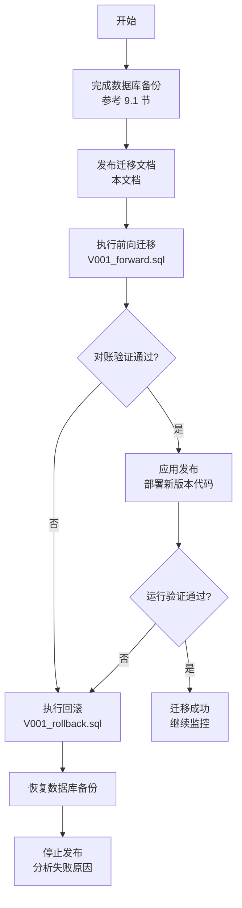
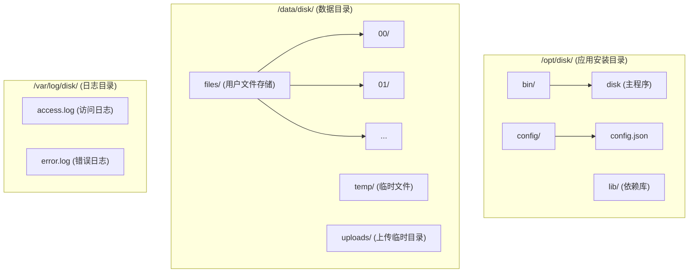

# 网盘系统 - 部署运维指南

## 1. 环境要求

### 1.0 安全配置

**所有环境必须设置以下环境变量：**

| 变量名 | 说明 | 要求 | 适用环境 |
|--------|------|------|----------|
| `JWT_SECRET` | JWT签名密钥 | 最少32字符，建议64字符随机字符串 | **所有环境必须** |
| `DB_PASSWORD` | PostgreSQL数据库密码 | 强密码，避免使用默认值 | 仅安全模式 |
| `REDIS_PASSWORD` | Redis认证密码 | 强密码，与redis.conf中requirepass一致 | 仅安全模式 |
| `DISK_SECURE_MODE` | 安全模式开关 | 设置为`true`或`1`启用严格验证 | 生产环境必须 |

**启动验证行为：**
- `JWT_SECRET` 在所有环境中都会强制验证（最少32字符），缺失或过短时应用拒绝启动
- 当 `DISK_SECURE_MODE=true` 时，应用启动时还会额外验证 `DB_PASSWORD` 和 `REDIS_PASSWORD`
- 如果任何必需变量缺失，应用将拒绝启动并输出错误信息

**设置环境变量示例：**

```bash
# 生产环境 - /etc/disk/env
JWT_SECRET="your-very-long-and-secure-jwt-secret-key-at-least-32-characters"
DB_PASSWORD="your_strong_db_password"
REDIS_PASSWORD="your_strong_redis_password"
DISK_SECURE_MODE=true
```

**生成安全密钥：**

```bash
# 生成JWT密钥（推荐64字符）
openssl rand -base64 48

# 生成数据库密码
openssl rand -base64 24
```

> **重要**: 永远不要在 `config.json` 中存储生产环境密码。所有敏感配置必须通过环境变量注入。

### 1.1 硬件要求

#### 最低配置

| 组件 | 要求 |
|------|------|
| CPU | 4 核 |
| 内存 | 8 GB |
| 磁盘 | 100 GB SSD |
| 网络 | 100 Mbps |

#### 推荐配置

| 组件 | 要求 |
|------|------|
| CPU | 8 核+ |
| 内存 | 16 GB+ |
| 系统盘 | 100 GB SSD |
| 数据盘 | 500 GB+ SSD/HDD |
| 网络 | 1 Gbps |

### 1.2 软件要求

#### 操作系统

| 系统 | 版本 | 支持状态 |
|------|------|----------|
| Ubuntu | 22.04 LTS | 推荐 |
| Ubuntu | 20.04 LTS | 支持 |
| CentOS | 8 Stream | 支持 |
| Windows Server | 2022 | 支持 |
| Windows Server | 2019 | 支持 |

#### 依赖组件

| 组件 | 最低版本 | 推荐版本 |
|------|----------|----------|
| PostgreSQL | 14 | 16 |
| Redis | 6.0 | 7.2 |
| S3/MinIO | S3 API 兼容 | MinIO 最新稳定版或 AWS S3（仅 `storage_backend=s3`） |
| CMake | 3.20 | 3.28 |
| GCC / Clang | GCC 13 / Clang 16 | 最新稳定版 |
| vcpkg | - | 最新版 |

### 1.3 网络要求

| 端口 | 用途 | 是否必须 |
|------|------|----------|
| 8080 | HTTP API 服务 | 是 |
| 443 | HTTPS（生产环境） | 是 |
| 5432 | PostgreSQL 数据库 | 是 |
| 6379 | Redis 缓存 | 是 |
| 9000 | MinIO S3 API（示例） | 仅 MinIO 部署 |

---

## 2. 编译部署

### 2.1 获取源码

```bash
# 克隆项目
git clone https://github.com/your-org/disk.git
cd disk

# 初始化子模块（如有）
git submodule update --init --recursive
```

### 2.2 安装依赖

#### Ubuntu 22.04

```bash
# 更新系统
sudo apt update && sudo apt upgrade -y

# 安装编译工具
sudo apt install -y build-essential cmake ninja-build git curl zip unzip tar pkg-config

# 安装 vcpkg
git clone https://github.com/Microsoft/vcpkg.git ~/vcpkg
cd ~/vcpkg
./bootstrap-vcpkg.sh
echo 'export VCPKG_ROOT=~/vcpkg' >> ~/.bashrc
echo 'export PATH=$VCPKG_ROOT:$PATH' >> ~/.bashrc
source ~/.bashrc

# 安装 PostgreSQL 客户端库
sudo apt install -y libpq-dev

# 安装 Redis
sudo apt install -y redis-server
sudo systemctl enable redis-server
sudo systemctl start redis-server
```

#### Windows

```powershell
# 使用 winget 安装工具
winget install Kitware.CMake
winget install Git.Git
winget install Microsoft.VisualStudio.2022.BuildTools

# 安装 vcpkg
git clone https://github.com/Microsoft/vcpkg.git C:\vcpkg
cd C:\vcpkg
.\bootstrap-vcpkg.bat
[Environment]::SetEnvironmentVariable("VCPKG_ROOT", "C:\vcpkg", "User")
[Environment]::SetEnvironmentVariable("PATH", $env:PATH + ";C:\vcpkg", "User")
```

### 2.3 编译项目

#### 使用 CMake Presets（推荐）

```bash
# 查看可用的预设
cmake --list-presets

# 配置（Linux Release）
cmake --preset linux-release-clang

# 编译
cmake --build --preset linux-release-clang

# 或一步完成
cmake --workflow --preset linux-release-clang
```

#### 手动编译

```bash
# 创建构建目录
mkdir -p build && cd build

# 配置（使用 vcpkg 工具链）
cmake .. \
  -DCMAKE_BUILD_TYPE=Release \
  -DCMAKE_TOOLCHAIN_FILE=$VCPKG_ROOT/scripts/buildsystems/vcpkg.cmake

# 编译
cmake --build . --config Release -j$(nproc)

# 安装（可选）
sudo cmake --install . --prefix /opt/disk
```

#### Windows 编译

```powershell
# 使用 CMake Presets
cmake --preset windows-release-clang-cl
cmake --build --preset windows-release-clang-cl
```

### 2.4 编译选项

| 选项 | 默认值 | 说明 |
|------|--------|------|
| CMAKE_BUILD_TYPE | Debug | 构建类型：Debug/Release/RelWithDebInfo |
| BUILD_TESTING | ON | 是否编译测试 |
| ENABLE_HTTPS | ON | 是否启用 HTTPS |
| ENABLE_REDIS | ON | 是否启用 Redis 缓存 |

```bash
# 自定义编译选项
cmake .. \
  -DCMAKE_BUILD_TYPE=Release \
  -DBUILD_TESTING=OFF \
  -DENABLE_HTTPS=ON
```

---

## 3. 数据库配置

### 3.1 PostgreSQL 安装与配置

#### Ubuntu 安装

```bash
# 安装 PostgreSQL
sudo apt install -y postgresql

# 启动服务
sudo systemctl enable postgresql
sudo systemctl start postgresql

# 初始化数据库集群（如未自动初始化）
sudo postgresql-setup initdb
```

#### 创建数据库和用户

```sql
-- 以 postgres 用户登录 psql
sudo -u postgres psql

-- 创建数据库
CREATE DATABASE disk ENCODING 'UTF8' LC_COLLATE 'en_US.utf8' LC_CTYPE 'en_US.utf8';

-- 创建用户
CREATE USER disk_user WITH PASSWORD 'your_secure_password';

-- 授权
GRANT ALL PRIVILEGES ON DATABASE disk TO disk_user;
\c disk
GRANT ALL ON SCHEMA public TO disk_user;
```

#### 初始化表结构

```bash
# 执行数据库初始化脚本
psql -U disk_user -h localhost -d disk -f scripts/init_database.sql
```

### 3.2 PostgreSQL 性能优化

编辑 `/etc/postgresql/16/main/postgresql.conf`（版本号根据实际安装调整）：

```ini
# 基础配置
max_connections = 500

# 内存配置
shared_buffers = 4GB                    # 约为可用内存的 25%
effective_cache_size = 12GB             # 约为可用内存的 75%
work_mem = 16MB                         # 每个查询操作的工作内存
maintenance_work_mem = 512MB            # 维护操作（VACUUM、CREATE INDEX）内存

# WAL 配置
wal_buffers = 16MB
max_wal_size = 2GB
min_wal_size = 512MB

# 查询规划
random_page_cost = 1.1                  # SSD 建议值
effective_io_concurrency = 200          # SSD 建议值

# 日志配置
log_min_duration_statement = 1000       # 记录执行时间超过 1 秒的慢查询
log_directory = '/var/log/postgresql'
log_filename = 'postgresql-%Y-%m-%d_%H%M%S.log'
```

### 3.3 Redis 配置

编辑 `/etc/redis/redis.conf`：

```conf
# 绑定地址
bind 127.0.0.1

# 端口
port 6379

# 密码（生产环境必须设置）
requirepass your_redis_password

# 内存限制
maxmemory 2gb
maxmemory-policy allkeys-lru

# 持久化
appendonly yes
appendfsync everysec

# 连接限制
maxclients 10000
```

### 3.4 数据库增量迁移

> **重要**: 本章节描述如何安全地执行数据库增量迁移。所有迁移操作均为增量变更（ADD COLUMN/ADD TABLE/ADD INDEX），不包含破坏性操作（DROP COLUMN/DROP TABLE），可安全回滚。

#### 3.4.1 迁移概述

本次数据库迁移 V001 新增以下数据库对象：

**新增字段：**

| 表名 | 字段名 | 类型 | 说明 | 默认值 |
|------|--------|------|------|--------|
| `users` | `storage_reserved` | BIGINT UNSIGNED | 上传预占用存储空间（字节） | 0 |
| `upload_tasks` | `reserved_bytes` | BIGINT UNSIGNED | 预占用字节数 | 0 |
| `upload_tasks` | `finalized_at` | DATETIME | 完成/失败时间 | NULL |
| `upload_tasks` | `fail_reason` | VARCHAR(512) | 失败原因 | NULL |
| `trash` | `content_id` | BIGINT UNSIGNED | 关联的文件内容ID（用于文件恢复） | NULL |

**新增表：**

| 表名 | 用途 | 备注 |
|------|------|------|
| `upload_task_chunks` | 存储分片上传任务已上传的分片信息 | 新表，无需数据回填 |

**新增索引：**

| 表名 | 索引类型 | 索引字段 | 用途 |
|------|----------|----------|------|
| `upload_tasks` | 联合索引 | `(user_id, status)` | 查询用户上传任务状态 |
| `upload_tasks` | 联合索引 | `(status, expires_at)` | 批量清理过期任务 |

#### 3.4.2 发布流程

数据库迁移遵循"文档先行、SQL 迁移、验证对账、应用发布、条件回滚"的安全发布流程：



#### 3.4.3 迁移执行顺序

**步骤 1：执行前向迁移脚本**

```bash
# 确保已完成数据库备份
/opt/disk/scripts/backup_db.sh

# 执行迁移脚本
psql -U disk_user -h localhost -d disk -f sql/migrations/V001_forward.sql
```

**V001_forward.sql 执行顺序（按依赖关系）：**

1. 新增 `users.storage_reserved` 字段
2. 新增 `upload_task_chunks` 表
3. 新增 `upload_tasks.reserved_bytes`, `finalized_at`, `fail_reason` 字段
4. 新增 `upload_tasks` 联合索引
5. 新增 `trash.content_id` 字段
6. 回填 `trash.content_id` 数据（从 `item_data` JSON 中提取）

#### 3.4.4 对账 SQL

**上线前验证（迁移前执行）：**

```sql
-- 验证 1: users 表应没有 storage_reserved 字段
-- 预期结果: ERROR: column "storage_reserved" does not exist
SELECT storage_reserved FROM users LIMIT 1;

-- 验证 2: upload_task_chunks 表不存在
-- 预期结果: ERROR: relation "upload_task_chunks" does not exist
SELECT COUNT(*) FROM upload_task_chunks;

-- 验证 3: upload_tasks 表应没有 reserved_bytes, finalized_at, fail_reason 字段
-- 预期结果: ERROR: column "reserved_bytes" does not exist
SELECT reserved_bytes FROM upload_tasks LIMIT 1;

-- 验证 4: trash 表应没有 content_id 字段
-- 预期结果: ERROR: column "content_id" does not exist
SELECT content_id FROM trash LIMIT 1;
```

**上线后验证（迁移后执行）：**

```sql
-- 验证 1: users.storage_reserved 字段已存在且默认值为 0
SELECT id, username, storage_reserved
FROM users
WHERE storage_reserved != 0;
-- 预期结果: 0 rows（所有用户 storage_reserved 应为 0）

-- 验证 2: upload_task_chunks 表已存在且为空
SELECT COUNT(*) as chunk_count
FROM upload_task_chunks;
-- 预期结果: chunk_count = 0（新表，暂无数据）

-- 验证 3: upload_tasks 新字段已存在
\d upload_tasks
-- 预期结果: 列定义中包含 reserved_bytes、finalized_at、fail_reason

-- 验证 4: trash.content_id 字段已存在
\d trash
-- 预期结果: 列定义中包含 content_id

-- 验证 5: trash.content_id 已回填
SELECT COUNT(*) as backfill_target
FROM trash
WHERE item_type = 'file' AND content_id IS NULL;
-- 预期结果: backfill_target = 0（所有文件记录的 content_id 已回填）

-- 验证 6: file_contents.ref_count 与实际引用数一致
SELECT
    fc.id,
    fc.ref_count as stored_ref_count,
    COUNT(DISTINCT f.id) as files_count,
    COUNT(DISTINCT t.id) as trash_count,
    (COUNT(DISTINCT f.id) + COUNT(DISTINCT t.id)) as actual_ref_count
FROM file_contents fc
LEFT JOIN files f ON f.content_id = fc.id
LEFT JOIN trash t ON t.content_id = fc.id AND t.item_type = 'file'
GROUP BY fc.id
HAVING stored_ref_count != actual_ref_count;
-- 预期结果: 0 rows（ref_count 与实际引用数一致）

-- 验证 7: upload_tasks 新索引已创建
SELECT indexname, indexdef
FROM pg_indexes
WHERE tablename = 'upload_tasks'
AND indexname IN ('idx_upload_tasks_user_status', 'idx_upload_tasks_status_expires');
-- 预期结果: 2 行结果（两个新索引已创建）
```

#### 3.4.5 回滚步骤

如果迁移执行失败或对账验证失败，执行以下回滚步骤：

**步骤 1：执行回滚脚本**

```bash
# 执行回滚脚本
psql -U disk_user -h localhost -d disk -f sql/migrations/V001_rollback.sql
```

**V001_rollback.sql 执行顺序（按依赖关系逆序）：**

1. 删除 `trash.content_id` 字段
2. 删除 `upload_tasks` 新索引
3. 删除 `upload_tasks.reserved_bytes`, `finalized_at`, `fail_reason` 字段
4. 删除 `upload_task_chunks` 表
5. 删除 `users.storage_reserved` 字段

**步骤 2：验证回滚成功**

```sql
-- 验证 1: users.storage_reserved 已删除
-- 预期结果: ERROR: column "storage_reserved" does not exist
SELECT storage_reserved FROM users LIMIT 1;

-- 验证 2: upload_task_chunks 表已删除
-- 预期结果: ERROR: relation "upload_task_chunks" does not exist
SELECT COUNT(*) FROM upload_task_chunks;

-- 验证 3: upload_tasks 新字段已删除
-- 预期结果: ERROR: column "reserved_bytes" does not exist
SELECT reserved_bytes FROM upload_tasks LIMIT 1;

-- 验证 4: trash.content_id 已删除
-- 预期结果: ERROR: column "content_id" does not exist
SELECT content_id FROM trash LIMIT 1;
```

**步骤 3：如果回滚失败，恢复数据库备份**

```bash
# 从最新备份恢复
gunzip < /data/backups/postgresql/disk_$(date +%Y%m%d_%H%M%S).sql.gz | psql -U disk_user -h localhost -d disk
```

#### 3.4.6 风险提示与停止条件

**停止条件（触发回滚）：**

1. **对账验证失败**：
   - `users.storage_reserved` 存在非零值（预期应为 0）
   - `upload_task_chunks` 表包含数据（预期应为空表）
   - `file_contents.ref_count` 与实际引用数不一致
   - `trash.content_id` 回填不完整（存在 `item_type='file' AND content_id IS NULL` 的记录）

2. **迁移脚本执行失败**：
   - SQL 执行过程中出现任何错误
   - 表结构变更失败
   - 数据回填失败

3. **应用启动失败**：
   - 新版本代码无法连接数据库
   - 新字段/表访问异常
   - 功能测试失败

**风险提示：**

| 风险项 | 风险等级 | 缓解措施 |
|--------|----------|----------|
| `trash.content_id` 回填不完整 | 🟡 中 | 迁移脚本包含数据回填逻辑，执行后必须验证所有文件记录的 content_id 已填充 |
| `file_contents.ref_count` 不一致 | 🟡 中 | 对账 SQL 必须执行，如发现不一致需立即回滚并分析原因 |
| 迁移执行时间过长 | 🟢 低 | 所有操作为增量变更，预计执行时间 < 5 分钟（数据量 < 100 万） |
| 回滚失败 | 🟢 低 | 所有变更可逆，提供完整回滚脚本和备份恢复方案 |
| 应用兼容性问题 | 🟢 低 | 新版本代码兼容迁移后的数据库结构，旧版本代码不依赖新字段 |

**数据安全保证：**

- ✅ 所有变更均为增量操作（ADD COLUMN/ADD TABLE/ADD INDEX）
- ✅ 不包含任何破坏性操作（DROP COLUMN/DROP TABLE/DROP DATABASE）
- ✅ 迁移前强制备份（参考 9.1 节）
- ✅ 提供完整回滚脚本（`V001_rollback.sql`）
- ✅ 对账 SQL 覆盖所有变更点
- ✅ 明确的停止条件和回滚触发条件

### 3.5 Redis 连接验证

#### 3.5.1 验证 Redis 服务运行

**检查 Redis 进程状态**:

```bash
# 使用 systemd（推荐）
sudo systemctl status redis
# 或
sudo systemctl status redis-server

# 预期输出: ● redis-server.service - Advanced key-value store
#             Active: active (running) since ...
```

**测试 Redis 连通性**:

```bash
# 测试本地 Redis（无密码）
redis-cli ping
# 预期输出: PONG

# 测试远程 Redis（有密码）
redis-cli -h 127.0.0.1 -p 6379 -a your_redis_password ping
# 预期输出: PONG

# 查看连接信息
redis-cli -a your_redis_password INFO server | grep redis_version
```

#### 3.5.2 验证应用配置

**检查 config.json 中的 Redis 配置**:

```bash
# 查看完整配置
cat config.json | jq '.redis_clients'

# 预期输出:
[
  {
    "name": "default",
    "host": "127.0.0.1",
    "port": 6379,
    "passwd": "${REDIS_PASSWORD}",
    "db": 0,
    "is_fast": false,
    "number_of_connections": 10,
    "timeout": -1.0
  }
]
```

**配置说明**:

| 字段 | 说明 | 推荐值 |
|------|------|--------|
| name | 连接名称 | "default" |
| host | Redis 服务器地址 | 生产环境使用内网 IP |
| port | Redis 端口 | 默认 6379 |
| passwd | Redis 密码 | 使用环境变量 `${REDIS_PASSWORD}` |
| db | Redis 数据库编号 | 0（默认） |
| number_of_connections | 连接池大小 | 10（低并发）、50（高并发） |
| timeout | 连接超时（秒） | -1.0（永不超时） |

#### 3.5.3 验证连接池

**查看 Redis 连接列表**:

```bash
# 启动应用前
redis-cli -a your_redis_password CLIENT LIST | wc -l
# 预期: 少量连接（1-2 个）

# 启动应用后
redis-cli -a your_redis_password CLIENT LIST | wc -l
# 预期: 连接数 ≈ number_of_connections (10)
```

**监控连接池状态**:

```bash
# 查看 Redis 连接详细信息
redis-cli -a your_redis_password INFO clients

# 关注字段:
# connected_clients: 当前连接数
# blocked_clients: 阻塞连接数
# maxclients: 最大允许连接数
```

#### 3.5.4 性能调优

**生产环境建议**:

1. **连接池大小**:
   - 低并发（<100 用户）: 10 个连接
   - 中并发（100-500 用户）: 50 个连接
   - 高并发（>500 用户）: 100 个连接

2. **内存配置**:
   ```ini
   # /etc/redis/redis.conf
   maxmemory 2gb
   maxmemory-policy allkeys-lru
   ```

3. **持久化配置**:
   ```ini
   # 数据持久化到磁盘
   appendonly yes
   appendfsync everysec  # 每秒同步一次
   ```

4. **网络配置**:
   ```ini
   # 仅绑定内网 IP
   bind 127.0.0.1 10.0.0.1
   ```

#### 3.5.5 常见问题排查

**问题 1: 连接超时**

```bash
# 检查防火墙
sudo ufw status
sudo ufw allow 6379/tcp

# 检查 Redis 监听地址
sudo netstat -tlnp | grep 6379
# 应显示: 0.0.0.0:6379 或 127.0.0.1:6379
```

**问题 2: 认证失败**

```bash
# 测试密码
redis-cli -h 127.0.0.1 -p 6379 -a wrong_password ping
# 预期: (error) NOAUTH Authentication required.

# 检查配置
cat /etc/redis/redis.conf | grep requirepass
# 确认密码与 config.json 一致
```

**问题 3: 连接池耗尽**

```bash
# 查看 Redis 最大连接数
redis-cli -a your_redis_password CONFIG GET maxclients

# 增加最大连接数
redis-cli -a your_redis_password CONFIG SET maxclients 10000
```

**注意事项**:

1. **生产环境安全**:
   - ✅ 必须设置 Redis 密码
   - ✅ 使用环境变量 `${REDIS_PASSWORD}`
   - ❌ 不要在配置文件中硬编码密码
   - ❌ 不要将 Redis 暴露到公网

2. **网络安全**:
   - 使用内网 IP，不要使用公网 IP
   - 配置防火墙，只允许应用服务器访问
   - 使用 Redis 6.0+ 的 ACL（访问控制列表）

3. **监控告警**:
   - 监控 Redis 连接数、内存使用、命令延迟
   - 设置告警阈值：连接数 > 80%、内存使用 > 90%

4. **连接池配置**:
   - 根据并发需求调整 `number_of_connections`
   - 高并发场景可增加到 100+ 个连接
   - 监控连接池使用情况，避免连接泄漏

---

## 4. 应用配置

### 4.1 配置文件说明

应用配置文件 `config.json`：

> **安全提示**: 敏感信息（密码）不应存储在配置文件中。以下配置中的 `passwd` 字段留空，实际值通过环境变量提供。

```json
{
  "listeners": [
    {
      "address": "0.0.0.0",
      "port": 8080,
      "https": false
    },
    {
      "address": "0.0.0.0",
      "port": 443,
      "https": true,
      "cert": "/etc/ssl/certs/disk.crt",
      "key": "/etc/ssl/private/disk.key"
    }
  ],
  "app": {
    "threads_num": 0,
    "upload_path": "/data/disk/uploads",
    "document_root": "",
    "client_max_body_size": "20M",
    "enable_server_header": false,
    "enable_date_header": false
  },
  "db_clients": [
    {
      "name": "postgresql",
      "rdbms": "postgresql",
      "host": "127.0.0.1",
      "port": 5432,
      "dbname": "disk",
      "user": "disk_user",
      "passwd": "",
      "connection_number": 20,
      "timeout": 30
    }
  ],
  "redis_clients": [
    {
      "name": "redis",
      "host": "127.0.0.1",
      "port": 6379,
      "passwd": "",
      "db": 0,
      "connection_number": 10
    }
  ],
  "plugins": [
    {
      "name": "drogon::plugin::AccessLogger",
      "config": {
        "log_path": "/var/log/disk/",
        "log_file": "access",
        "log_size_limit": 10485760,
        "max_files": 10,
        "use_spdlog": true,
        "log_format": "[$request_date] [$thread] ($remote_addr - $local_addr) \"$request\" $status $body_bytes_sent $processing_time"
      }
    }
  ],
  "custom_config": {
    "disk": {
      "storage_backend": "local",
      "storage_base_path": "/data/disk/files",
      "temp_upload_path": "/data/disk/temp",
      "file_io_threads": 4,
      "s3": {
        "bucket": "disk",
        "region": "us-east-1",
        "endpoint": "http://127.0.0.1:9000",
        "use_ssl": false,
        "force_path_style": true,
        "verify_ssl": false,
        "object_prefix": "objects",
        "connect_timeout_ms": 3000,
        "request_timeout_ms": 300000
      }
    }
  }
}
```

#### 4.1.1 配置字段说明

`custom_config.disk` 配置节点中的存储字段：

| 字段 | 类型 | 默认值 | 取值范围 | 说明 |
|------|------|--------|----------|------|
| `storage_backend` | string | local | local / s3 | 最终 blob 后端 |
| `storage_base_path` | string | build/uploaded | 有效路径 | local 后端的内容寻址 blob 根目录 |
| `temp_upload_path` | string | build/temp_uploads | 有效路径 | 上传分片和组装文件目录；当前 local 与 s3 后端都使用本地暂存 |
| `file_io_threads` | integer | 自动 | >0 | 本地暂存/Blob I/O 线程池大小 |
| `s3.bucket` | string | disk | 非空 | S3/MinIO bucket |
| `s3.region` | string | us-east-1 | 非空 | S3 region |
| `s3.endpoint` | string | 空 | URL | 自定义 S3/MinIO endpoint；AWS S3 可留空 |
| `s3.use_ssl` | boolean | true | - | endpoint 是否使用 HTTPS |
| `s3.force_path_style` | boolean | false | - | MinIO 通常设置为 true |
| `s3.verify_ssl` | boolean | true | - | 是否校验证书 |
| `s3.object_prefix` | string | objects | 相对 key 前缀 | 最终 blob 对象 key 前缀 |

> **当前范围**：`storage_backend=s3` 只把最终内容 blob 放到对象存储；分片写入、组装、取消和过期清理仍使用本地 `temp_upload_path`。S3-native upload staging 不是已完成 Phase 6 的遗留项，如后续需要必须单独立项。

> **构建依赖决策**：当前单一后端二进制始终编译并链接 AWS SDK for C++ 的 S3 组件，即使运行时选择 local。这样可避免两套制品和条件注册分支；若要支持不安装 AWS SDK 的 local-only 构建，需要另行设计可选编译特性。

### 4.2 环境变量

创建 `/etc/disk/env` 文件：

```bash
# JWT密钥（至少 32 字符随机字符串）
JWT_SECRET=your_very_long_and_secure_jwt_secret_key_here

# 数据库密码
DB_PASSWORD=your_db_password

# Redis 密码
REDIS_PASSWORD=your_redis_password

# storage_backend=s3 时需要；不要写入 config.json
DISK_S3_ACCESS_KEY=your_s3_access_key
DISK_S3_SECRET_KEY=your_s3_secret_key
# 临时凭据可额外设置 DISK_S3_SESSION_TOKEN

# 安全模式（生产环境必须设置）
DISK_SECURE_MODE=true
```

> **重要**: 确保此文件权限为 `600`，仅 root 和应用用户可读取。

### 4.3 目录结构



创建目录：

```bash
# 创建目录结构
sudo mkdir -p /opt/disk/{bin,config,lib}
sudo mkdir -p /data/disk/{files,temp,uploads}
sudo mkdir -p /var/log/disk

# 创建文件分片存储目录（00-FF）
for i in $(seq -w 0 255 | xargs printf '%02X\n'); do
  sudo mkdir -p /data/disk/files/$i
done

# 设置权限
sudo chown -R disk:disk /data/disk
sudo chown -R disk:disk /var/log/disk
sudo chmod 750 /data/disk
sudo chmod 750 /var/log/disk
```

### 4.4 MinIO 开发验证

仓库提供 `docker-compose.s3.yml` 创建 MinIO 和 `disk` bucket：

```bash
docker compose -f docker-compose.s3.yml up -d

export DISK_S3_ENDPOINT=http://127.0.0.1:9000
export DISK_S3_BUCKET=disk
export DISK_S3_ACCESS_KEY=disk
export DISK_S3_SECRET_KEY=disk-password
export DISK_S3_REGION=us-east-1
```

将测试用配置中的 `storage_backend` 设为 `s3`、`endpoint` 设为上述地址、`force_path_style` 设为 `true`、`use_ssl`/`verify_ssl` 设为 `false`。环境门控验证命令见 `docs/design/04-系统测试计划.md`；生产环境必须使用专用凭据、TLS 和私有网络访问策略。

---

## 5. 服务管理

### 5.1 Systemd 服务配置

创建 `/etc/systemd/system/disk.service`：

```ini
[Unit]
Description=Disk Network Storage Service
After=network.target postgresql.service redis.service

[Service]
Type=simple
User=disk
Group=disk
WorkingDirectory=/opt/disk
EnvironmentFile=/etc/disk/env
ExecStart=/opt/disk/bin/disk -c /var/lib/disk/.config/disk/server/config.json
ExecReload=/bin/kill -HUP $MAINPID
Restart=always
RestartSec=5
LimitNOFILE=65535
LimitNPROC=65535

# 安全设置
NoNewPrivileges=true
PrivateTmp=true
ProtectSystem=strict
ProtectHome=true
ReadWritePaths=/data/disk /var/log/disk

[Install]
WantedBy=multi-user.target
```

> **Note**: For the `disk` service user, the home directory is assumed to be `/var/lib/disk`. The configuration path follows the XDG Base Directory specification (`$HOME/.config/disk/server/config.json`).

### 5.2 服务操作

```bash
# 重新加载 systemd 配置
sudo systemctl daemon-reload

# 启动服务
sudo systemctl start disk

# 停止服务
sudo systemctl stop disk

# 重启服务
sudo systemctl restart disk

# 设置开机自启
sudo systemctl enable disk

# 查看服务状态
sudo systemctl status disk

# 查看服务日志
sudo journalctl -u disk -f
```

### 5.3 Windows 服务配置

使用 NSSM（Non-Sucking Service Manager）：

```powershell
# 下载 NSSM
# https://nssm.cc/download

# 安装服务
nssm install Disk "C:\disk\bin\disk.exe" "-c %USERPROFILE%\.config\disk\server\config.json"

# 配置服务
nssm set Disk AppDirectory "C:\disk"
nssm set Disk DisplayName "Disk Network Storage Service"
nssm set Disk Start SERVICE_AUTO_START

# 启动服务
nssm start Disk
```

> **Note**: The Windows service should run under the target user account (not SYSTEM) so that `%USERPROFILE%` resolves correctly to the user's home directory.

---

## 6. HTTPS 配置

### 6.1 获取 SSL 证书

#### 使用 Let's Encrypt（推荐）

```bash
# 安装 certbot
sudo apt install -y certbot

# 获取证书（需要域名解析到服务器）
sudo certbot certonly --standalone -d your-domain.com

# 证书位置
# /etc/letsencrypt/live/your-domain.com/fullchain.pem
# /etc/letsencrypt/live/your-domain.com/privkey.pem

# 配置自动续期
sudo systemctl enable certbot.timer
```

#### 自签名证书（测试用）

```bash
# 生成私钥
openssl genrsa -out disk.key 2048

# 生成证书签名请求
openssl req -new -key disk.key -out disk.csr

# 生成自签名证书
openssl x509 -req -days 365 -in disk.csr -signkey disk.key -out disk.crt

# 移动到指定位置
sudo mv disk.crt /etc/ssl/certs/
sudo mv disk.key /etc/ssl/private/
sudo chmod 600 /etc/ssl/private/disk.key
```

### 6.2 更新配置

更新 `config.json` 中的 HTTPS 监听器：

```json
{
  "listeners": [
    {
      "address": "0.0.0.0",
      "port": 443,
      "https": true,
      "cert": "/etc/letsencrypt/live/your-domain.com/fullchain.pem",
      "key": "/etc/letsencrypt/live/your-domain.com/privkey.pem"
    }
  ]
}
```

---

## 7. 反向代理配置

### 7.1 Nginx 配置

安装 Nginx：

```bash
sudo apt install -y nginx
```

创建 `/etc/nginx/sites-available/disk`：

```nginx
upstream disk_backend {
    server 127.0.0.1:8080;
    keepalive 64;
}

server {
    listen 80;
    server_name your-domain.com;

    # 重定向到 HTTPS
    return 301 https://$server_name$request_uri;
}

server {
    listen 443 ssl http2;
    server_name your-domain.com;

    # SSL 证书
    ssl_certificate /etc/letsencrypt/live/your-domain.com/fullchain.pem;
    ssl_certificate_key /etc/letsencrypt/live/your-domain.com/privkey.pem;

    # SSL 配置
    ssl_protocols TLSv1.2 TLSv1.3;
    ssl_ciphers ECDHE-ECDSA-AES128-GCM-SHA256:ECDHE-RSA-AES128-GCM-SHA256;
    ssl_prefer_server_ciphers on;
    ssl_session_cache shared:SSL:10m;
    ssl_session_timeout 10m;

    # 客户端最大请求体大小：系统使用分片上传，此值只需大于 chunk_size
    # 例如 chunk_size=5MiB 时设置 20M 即可；调大 chunk_size 时需同步调大该值
    client_max_body_size 20M;

    # 代理超时设置
    proxy_connect_timeout 60s;
    proxy_send_timeout 300s;
    proxy_read_timeout 300s;

    # 代理缓冲
    proxy_buffering off;
    proxy_request_buffering off;

    location / {
        proxy_pass http://disk_backend;
        proxy_http_version 1.1;
        proxy_set_header Host $host;
        proxy_set_header X-Real-IP $remote_addr;
        proxy_set_header X-Forwarded-For $proxy_add_x_forwarded_for;
        proxy_set_header X-Forwarded-Proto $scheme;
        proxy_set_header Connection "";
    }

    # 文件下载路径优化（可选）
    location /api/file/download/ {
        proxy_pass http://disk_backend;
        proxy_buffering on;
        proxy_buffer_size 128k;
        proxy_buffers 4 256k;
        proxy_busy_buffers_size 256k;
    }
}
```

启用配置：

```bash
sudo ln -s /etc/nginx/sites-available/disk /etc/nginx/sites-enabled/
sudo nginx -t
sudo systemctl restart nginx
```

---

## 8. 监控与日志

### 8.1 日志管理

#### 日志轮转配置

创建 `/etc/logrotate.d/disk`：

```
/var/log/disk/*.log {
    daily
    missingok
    rotate 30
    compress
    delaycompress
    notifempty
    create 0640 disk disk
    sharedscripts
    postrotate
        systemctl reload disk > /dev/null 2>&1 || true
    endscript
}
```

#### 日志级别配置

在 `config.json` 中配置日志级别：

```json
{
  "app": {
    "log": {
      "log_path": "/var/log/disk/",
      "log_level": "INFO",
      "log_max_size": 104857600,
      "log_max_num": 30
    }
  }
}
```

### 8.2 系统监控

#### 基础监控脚本

创建 `/opt/disk/scripts/monitor.sh`：

```bash
#!/bin/bash

# 检查服务状态
check_service() {
    if systemctl is-active --quiet disk; then
        echo "Service: Running"
    else
        echo "Service: Stopped"
        exit 1
    fi
}

# 检查端口
check_port() {
    if netstat -tuln | grep -q ":8080 "; then
        echo "Port 8080: Open"
    else
        echo "Port 8080: Closed"
        exit 1
    fi
}

# 检查磁盘空间
check_disk() {
    usage=$(df /data/disk | tail -1 | awk '{print $5}' | tr -d '%')
    echo "Disk Usage: ${usage}%"
    if [ "$usage" -gt 90 ]; then
        echo "Warning: Disk usage above 90%"
    fi
}

# 检查数据库连接
check_postgresql() {
    if pg_isready -h localhost -U disk_user &>/dev/null; then
        echo "PostgreSQL: Connected"
    else
        echo "PostgreSQL: Disconnected"
        exit 1
    fi
}

# 检查 Redis 连接
check_redis() {
    if redis-cli -a "$REDIS_PASSWORD" ping &>/dev/null; then
        echo "Redis: Connected"
    else
        echo "Redis: Disconnected"
        exit 1
    fi
}

# 执行检查
source /etc/disk/env
check_service
check_port
check_disk
check_postgresql
check_redis
```

#### 健康检查 API

```bash
# 检查应用健康状态
curl -s http://localhost:8080/api/health | jq .
```

### 8.3 性能监控

#### 使用 Prometheus + Grafana

Drogon 支持 Prometheus 指标暴露，可配置监控面板。

在 `config.json` 中启用：

```json
{
  "plugins": [
    {
      "name": "drogon::plugin::Prometheus",
      "config": {
        "path": "/metrics"
      }
    }
  ]
}
```

访问 `http://localhost:8080/metrics` 获取指标。

---

## 9. 备份与恢复

### 9.1 数据备份

#### 数据库备份脚本

创建 `/opt/disk/scripts/backup_db.sh`：

```bash
#!/bin/bash

# 配置
BACKUP_DIR="/data/backups/postgresql"
DB_USER="disk_user"
DB_PASS="${DB_PASSWORD}"
DATABASE="disk"
RETENTION_DAYS=30

# 创建备份目录
mkdir -p "$BACKUP_DIR"

# 备份文件名
BACKUP_FILE="$BACKUP_DIR/${DATABASE}_$(date +%Y%m%d_%H%M%S).sql.gz"

# 执行备份
PGPASSWORD="$DB_PASS" pg_dump -h localhost -U "$DB_USER" \
    --clean \
    --create \
    --verbose \
    "$DATABASE" | gzip > "$BACKUP_FILE"

# 检查备份结果
if [ $? -eq 0 ]; then
    echo "Backup successful: $BACKUP_FILE"
else
    echo "Backup failed!"
    exit 1
fi

# 清理旧备份
find "$BACKUP_DIR" -name "*.sql.gz" -mtime +$RETENTION_DAYS -delete
echo "Old backups cleaned up"
```

#### 文件备份脚本

创建 `/opt/disk/scripts/backup_files.sh`：

```bash
#!/bin/bash

# 配置
SOURCE_DIR="/data/disk/files"
BACKUP_DIR="/data/backups/files"
RETENTION_DAYS=7

# 创建备份目录
mkdir -p "$BACKUP_DIR"

# 使用 rsync 增量备份
rsync -av --delete "$SOURCE_DIR/" "$BACKUP_DIR/current/"

# 创建带时间戳的快照（硬链接，节省空间）
SNAPSHOT_DIR="$BACKUP_DIR/$(date +%Y%m%d)"
cp -al "$BACKUP_DIR/current" "$SNAPSHOT_DIR"

# 清理旧快照
find "$BACKUP_DIR" -maxdepth 1 -type d -mtime +$RETENTION_DAYS -exec rm -rf {} \;

echo "File backup completed"
```

#### 定时备份任务

```bash
# 编辑 crontab
sudo crontab -e

# 添加以下任务
# 每天凌晨 2 点备份数据库
0 2 * * * /opt/disk/scripts/backup_db.sh >> /var/log/disk/backup.log 2>&1

# 每天凌晨 3 点备份文件
0 3 * * * /opt/disk/scripts/backup_files.sh >> /var/log/disk/backup.log 2>&1
```

### 9.2 数据恢复

#### 恢复数据库

```bash
# 解压备份文件
gunzip disk_20260113_020000.sql.gz

# 恢复数据库（先创建数据库，再导入数据）
psql -U postgres -h localhost -c "CREATE DATABASE disk;"
psql -U disk_user -h localhost -d disk -f disk_20260113_020000.sql
```

#### 恢复文件

```bash
# 从备份恢复文件
rsync -av /data/backups/files/20260113/ /data/disk/files/
```

---

## 10. 故障排查

### 10.1 常见问题

#### 服务无法启动

1. **检查日志**
   ```bash
   sudo journalctl -u disk -n 100
   ```

2. **检查配置文件**
   ```bash
   # 验证 JSON 格式
   jq . /var/lib/disk/.config/disk/server/config.json
   ```

3. **检查端口占用**
   ```bash
   sudo netstat -tuln | grep 8080
   ```

4. **检查权限**
   ```bash
   ls -la /data/disk/
   ls -la /var/log/disk/
   ```

#### 数据库连接失败

1. **检查 PostgreSQL 服务**
   ```bash
   sudo systemctl status postgresql
   ```

2. **检查连接**
   ```bash
   psql -U disk_user -h localhost -d disk
   ```

3. **检查用户权限**
   ```sql
   \du disk_user
   ```

#### Redis 连接失败

1. **检查 Redis 服务**
   ```bash
   sudo systemctl status redis
   redis-cli ping
   ```

2. **检查密码配置**
   ```bash
   redis-cli -a your_password ping
   ```

#### 上传失败

1. **检查磁盘空间**
   ```bash
   df -h /data/disk
   ```

2. **检查目录权限**
   ```bash
   ls -la /data/disk/uploads/
   ls -la /data/disk/temp/
   ```

3. **检查上传限制与临时空间**
   - 逻辑文件大小由 `custom_config.disk.max_file_size` 控制。
   - Drogon/Nginx 的请求体限制只需大于 `custom_config.disk.chunk_size`，不是最大文件大小。
   - 上传限流吞吐约为 `chunk_size * upload_rate_limit_per_minute / 60`；默认 5MiB、240 次/分钟约为 20MiB/s。
   - 完成上传时临时目录会同时保留分片和组装文件，至少预留约 2 倍文件大小；跨文件系统复制兜底时可能接近 3 倍。
   - Nginx 的 `client_max_body_size`、`proxy_send_timeout`、`proxy_read_timeout` 需要覆盖单个分片和完成组装耗时。

#### S3 最终 blob 删除失败

1. S3 删除在存储工作线程内最多尝试 3 次，不在 Drogon 事件循环中阻塞等待；每次失败日志都包含 `bucket`、`key`、`attempt`、错误码和错误消息。
2. 三次均失败时，调用方收到最后一次错误并保留可诊断日志；确认 endpoint、凭据、bucket 权限和网络状态后可安全重试清理。
3. 对不存在 key 的删除按成功处理，因此补偿删除、永久删除和维护任务可以重复执行而不会把已删除对象视为故障。

### 10.2 性能问题排查

#### CPU 使用率高

```bash
# 查看进程 CPU 使用
top -p $(pgrep disk)

# 查看线程状态
ps -T -p $(pgrep disk)
```

#### 内存使用率高

```bash
# 查看内存使用
free -h

# 查看进程内存
ps aux | grep disk
```

#### 磁盘 IO 问题

```bash
# 查看磁盘 IO
iostat -x 1

# 查看文件系统使用
df -h
```

### 10.3 日志分析

```bash
# 查看最近错误
grep -i error /var/log/disk/*.log | tail -50

# 查看慢请求
grep "processing_time" /var/log/disk/access.log | awk -F'processing_time=' '{if($2>1000) print}'

# 统计请求状态码
awk '{print $NF}' /var/log/disk/access.log | sort | uniq -c | sort -rn
```

---

## 11. 安全加固

### 11.1 系统安全

```bash
# 创建专用用户
sudo useradd -r -s /bin/false disk

# 设置文件权限
sudo chown -R disk:disk /opt/disk
sudo chown -R disk:disk /data/disk
sudo chmod 750 /opt/disk
sudo chmod 750 /data/disk

# 配置防火墙
sudo ufw allow 80/tcp
sudo ufw allow 443/tcp
sudo ufw enable
```

### 11.2 数据库安全

```bash
# 限制 PostgreSQL 只监听本地
# 编辑 /etc/postgresql/16/main/postgresql.conf
listen_addresses = '127.0.0.1'

# 限制 Redis 只监听本地
# 编辑 /etc/redis/redis.conf
bind 127.0.0.1
```

### 11.3 定期更新

```bash
# 更新系统
sudo apt update && sudo apt upgrade -y

# 更新应用（按照部署流程重新编译）
cd /path/to/disk
git pull
cmake --build --preset linux-release-clang
sudo systemctl restart disk
```

---

## 12. 升级指南

### 12.1 升级前检查

1. **备份数据**
   ```bash
   /opt/disk/scripts/backup_db.sh
   /opt/disk/scripts/backup_files.sh
   ```

2. **检查变更日志**
   - 阅读新版本的 CHANGELOG
   - 检查数据库迁移脚本

3. **测试环境验证**
   - 在测试环境先验证升级流程

### 12.2 升级步骤

```bash
# 1. 停止服务
sudo systemctl stop disk

# 2. 备份当前版本
sudo cp -r /opt/disk /opt/disk.bak

# 3. 更新代码
cd /path/to/disk/source
git fetch origin
git checkout v1.x.x  # 切换到新版本

# 4. 重新编译
cmake --build --preset linux-release-clang

# 5. 部署新版本
sudo cp build/bin/disk /opt/disk/bin/

# 6. 执行数据库迁移（如需要）
psql -U disk_user -h localhost -d disk -f migrations/v1.x.x.sql

# 7. 启动服务
sudo systemctl start disk

# 8. 验证服务
curl http://localhost:8080/api/health
```

### 12.3 回滚步骤

```bash
# 1. 停止服务
sudo systemctl stop disk

# 2. 恢复备份
sudo rm -rf /opt/disk
sudo mv /opt/disk.bak /opt/disk

# 3. 恢复数据库（如需要）
psql -U disk_user -h localhost -d disk -f /data/backups/postgresql/disk_backup.sql

# 4. 启动服务
sudo systemctl start disk
```
