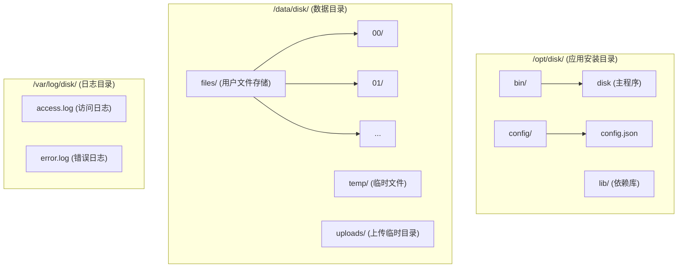

# 网盘系统 - 部署运维指南

## 1. 环境要求

### 1.1 硬件要求

#### 最低配置

| 组件 | 要求 |
|------|------|
| CPU | 4 核 |
| 内存 | 8 GB |
| 磁盘 | 100 GB SSD |
| 网络 | 100 Mbps |

#### 推荐配置

| 组件 | 要求 |
|------|------|
| CPU | 8 核+ |
| 内存 | 16 GB+ |
| 系统盘 | 100 GB SSD |
| 数据盘 | 500 GB+ SSD/HDD |
| 网络 | 1 Gbps |

### 1.2 软件要求

#### 操作系统

| 系统 | 版本 | 支持状态 |
|------|------|----------|
| Ubuntu | 22.04 LTS | 推荐 |
| Ubuntu | 20.04 LTS | 支持 |
| CentOS | 8 Stream | 支持 |
| Windows Server | 2022 | 支持 |
| Windows Server | 2019 | 支持 |

#### 依赖组件

| 组件 | 最低版本 | 推荐版本 |
|------|----------|----------|
| MySQL | 8.0 | 8.0.35 |
| Redis | 6.0 | 7.2 |
| CMake | 3.20 | 3.28 |
| GCC / Clang | GCC 13 / Clang 16 | 最新稳定版 |
| vcpkg | - | 最新版 |

### 1.3 网络要求

| 端口 | 用途 | 是否必须 |
|------|------|----------|
| 8080 | HTTP API 服务 | 是 |
| 443 | HTTPS（生产环境） | 是 |
| 3306 | MySQL 数据库 | 是 |
| 6379 | Redis 缓存 | 是 |

---

## 2. 编译部署

### 2.1 获取源码

```bash
# 克隆项目
git clone https://github.com/your-org/disk.git
cd disk

# 初始化子模块（如有）
git submodule update --init --recursive
```

### 2.2 安装依赖

#### Ubuntu 22.04

```bash
# 更新系统
sudo apt update && sudo apt upgrade -y

# 安装编译工具
sudo apt install -y build-essential cmake ninja-build git curl zip unzip tar pkg-config

# 安装 vcpkg
git clone https://github.com/Microsoft/vcpkg.git ~/vcpkg
cd ~/vcpkg
./bootstrap-vcpkg.sh
echo 'export VCPKG_ROOT=~/vcpkg' >> ~/.bashrc
echo 'export PATH=$VCPKG_ROOT:$PATH' >> ~/.bashrc
source ~/.bashrc

# 安装 MySQL 客户端库
sudo apt install -y libmysqlclient-dev

# 安装 Redis
sudo apt install -y redis-server
sudo systemctl enable redis-server
sudo systemctl start redis-server
```

#### Windows

```powershell
# 使用 winget 安装工具
winget install Kitware.CMake
winget install Git.Git
winget install Microsoft.VisualStudio.2022.BuildTools

# 安装 vcpkg
git clone https://github.com/Microsoft/vcpkg.git C:\vcpkg
cd C:\vcpkg
.\bootstrap-vcpkg.bat
[Environment]::SetEnvironmentVariable("VCPKG_ROOT", "C:\vcpkg", "User")
[Environment]::SetEnvironmentVariable("PATH", $env:PATH + ";C:\vcpkg", "User")
```

### 2.3 编译项目

#### 使用 CMake Presets（推荐）

```bash
# 查看可用的预设
cmake --list-presets

# 配置（Linux Release）
cmake --preset linux-release

# 编译
cmake --build --preset linux-release

# 或一步完成
cmake --workflow --preset linux-release
```

#### 手动编译

```bash
# 创建构建目录
mkdir -p build && cd build

# 配置（使用 vcpkg 工具链）
cmake .. \
  -DCMAKE_BUILD_TYPE=Release \
  -DCMAKE_TOOLCHAIN_FILE=$VCPKG_ROOT/scripts/buildsystems/vcpkg.cmake

# 编译
cmake --build . --config Release -j$(nproc)

# 安装（可选）
sudo cmake --install . --prefix /opt/disk
```

#### Windows 编译

```powershell
# 使用 CMake Presets
cmake --preset windows-release
cmake --build --preset windows-release
```

### 2.4 编译选项

| 选项 | 默认值 | 说明 |
|------|--------|------|
| CMAKE_BUILD_TYPE | Debug | 构建类型：Debug/Release/RelWithDebInfo |
| BUILD_TESTING | ON | 是否编译测试 |
| ENABLE_HTTPS | ON | 是否启用 HTTPS |
| ENABLE_REDIS | ON | 是否启用 Redis 缓存 |

```bash
# 自定义编译选项
cmake .. \
  -DCMAKE_BUILD_TYPE=Release \
  -DBUILD_TESTING=OFF \
  -DENABLE_HTTPS=ON
```

---

## 3. 数据库配置

### 3.1 MySQL 安装与配置

#### Ubuntu 安装

```bash
# 安装 MySQL 8.0
sudo apt install -y mysql-server

# 启动服务
sudo systemctl enable mysql
sudo systemctl start mysql

# 安全配置
sudo mysql_secure_installation
```

#### 创建数据库和用户

```sql
-- 以 root 登录 MySQL
sudo mysql -u root -p

-- 创建数据库
CREATE DATABASE disk CHARACTER SET utf8mb4 COLLATE utf8mb4_unicode_ci;

-- 创建用户
CREATE USER 'disk_user'@'localhost' IDENTIFIED BY 'your_secure_password';

-- 授权
GRANT ALL PRIVILEGES ON disk.* TO 'disk_user'@'localhost';
FLUSH PRIVILEGES;
```

#### 初始化表结构

```bash
# 执行数据库初始化脚本
mysql -u disk_user -p disk < scripts/init_database.sql
```

### 3.2 MySQL 性能优化

编辑 `/etc/mysql/mysql.conf.d/mysqld.cnf`：

```ini
[mysqld]
# 基础配置
max_connections = 500
max_connect_errors = 100

# InnoDB 配置
innodb_buffer_pool_size = 4G        # 约为可用内存的 50-70%
innodb_log_file_size = 256M
innodb_flush_log_at_trx_commit = 2  # 性能优先
innodb_flush_method = O_DIRECT

# 查询缓存（MySQL 8.0 已移除）
# 使用 Redis 替代

# 日志配置
slow_query_log = 1
slow_query_log_file = /var/log/mysql/slow.log
long_query_time = 1
```

### 3.3 Redis 配置

编辑 `/etc/redis/redis.conf`：

```conf
# 绑定地址
bind 127.0.0.1

# 端口
port 6379

# 密码（生产环境必须设置）
requirepass your_redis_password

# 内存限制
maxmemory 2gb
maxmemory-policy allkeys-lru

# 持久化
appendonly yes
appendfsync everysec

# 连接限制
maxclients 10000
```

### 3.4 Redis 连接验证

#### 3.4.1 验证 Redis 服务运行

**检查 Redis 进程状态**:

```bash
# 使用 systemd（推荐）
sudo systemctl status redis
# 或
sudo systemctl status redis-server

# 预期输出: ● redis-server.service - Advanced key-value store
#             Active: active (running) since ...
```

**测试 Redis 连通性**:

```bash
# 测试本地 Redis（无密码）
redis-cli ping
# 预期输出: PONG

# 测试远程 Redis（有密码）
redis-cli -h 127.0.0.1 -p 6379 -a your_redis_password ping
# 预期输出: PONG

# 查看连接信息
redis-cli -a your_redis_password INFO server | grep redis_version
```

#### 3.4.2 验证应用配置

**检查 config.json 中的 Redis 配置**:

```bash
# 查看完整配置
cat config.json | jq '.redis_clients'

# 预期输出:
[
  {
    "name": "default",
    "host": "127.0.0.1",
    "port": 6379,
    "passwd": "${REDIS_PASSWORD}",
    "db": 0,
    "is_fast": false,
    "number_of_connections": 10,
    "timeout": -1.0
  }
]
```

**配置说明**:

| 字段 | 说明 | 推荐值 |
|------|------|--------|
| name | 连接名称 | "default" |
| host | Redis 服务器地址 | 生产环境使用内网 IP |
| port | Redis 端口 | 默认 6379 |
| passwd | Redis 密码 | 使用环境变量 `${REDIS_PASSWORD}` |
| db | Redis 数据库编号 | 0（默认） |
| number_of_connections | 连接池大小 | 10（低并发）、50（高并发） |
| timeout | 连接超时（秒） | -1.0（永不超时） |

#### 3.4.3 验证连接池

**查看 Redis 连接列表**:

```bash
# 启动应用前
redis-cli -a your_redis_password CLIENT LIST | wc -l
# 预期: 少量连接（1-2 个）

# 启动应用后
redis-cli -a your_redis_password CLIENT LIST | wc -l
# 预期: 连接数 ≈ number_of_connections (10)
```

**监控连接池状态**:

```bash
# 查看 Redis 连接详细信息
redis-cli -a your_redis_password INFO clients

# 关注字段:
# connected_clients: 当前连接数
# blocked_clients: 阻塞连接数
# maxclients: 最大允许连接数
```

#### 3.4.4 性能调优

**生产环境建议**:

1. **连接池大小**:
   - 低并发（<100 用户）: 10 个连接
   - 中并发（100-500 用户）: 50 个连接
   - 高并发（>500 用户）: 100 个连接

2. **内存配置**:
   ```ini
   # /etc/redis/redis.conf
   maxmemory 2gb
   maxmemory-policy allkeys-lru
   ```

3. **持久化配置**:
   ```ini
   # 数据持久化到磁盘
   appendonly yes
   appendfsync everysec  # 每秒同步一次
   ```

4. **网络配置**:
   ```ini
   # 仅绑定内网 IP
   bind 127.0.0.1 10.0.0.1
   ```

#### 3.4.5 常见问题排查

**问题 1: 连接超时**

```bash
# 检查防火墙
sudo ufw status
sudo ufw allow 6379/tcp

# 检查 Redis 监听地址
sudo netstat -tlnp | grep 6379
# 应显示: 0.0.0.0:6379 或 127.0.0.1:6379
```

**问题 2: 认证失败**

```bash
# 测试密码
redis-cli -h 127.0.0.1 -p 6379 -a wrong_password ping
# 预期: (error) NOAUTH Authentication required.

# 检查配置
cat /etc/redis/redis.conf | grep requirepass
# 确认密码与 config.json 一致
```

**问题 3: 连接池耗尽**

```bash
# 查看 Redis 最大连接数
redis-cli -a your_redis_password CONFIG GET maxclients

# 增加最大连接数
redis-cli -a your_redis_password CONFIG SET maxclients 10000
```

**注意事项**:

1. **生产环境安全**:
   - ✅ 必须设置 Redis 密码
   - ✅ 使用环境变量 `${REDIS_PASSWORD}`
   - ❌ 不要在配置文件中硬编码密码
   - ❌ 不要将 Redis 暴露到公网

2. **网络安全**:
   - 使用内网 IP，不要使用公网 IP
   - 配置防火墙，只允许应用服务器访问
   - 使用 Redis 6.0+ 的 ACL（访问控制列表）

3. **监控告警**:
   - 监控 Redis 连接数、内存使用、命令延迟
   - 设置告警阈值：连接数 > 80%、内存使用 > 90%

4. **连接池配置**:
   - 根据并发需求调整 `number_of_connections`
   - 高并发场景可增加到 100+ 个连接
   - 监控连接池使用情况，避免连接泄漏

---

## 4. 应用配置

### 4.1 配置文件说明

应用配置文件 `config.json`：

```json
{
  "listeners": [
    {
      "address": "0.0.0.0",
      "port": 8080,
      "https": false
    },
    {
      "address": "0.0.0.0",
      "port": 443,
      "https": true,
      "cert": "/etc/ssl/certs/disk.crt",
      "key": "/etc/ssl/private/disk.key"
    }
  ],
  "app": {
    "threads_num": 0,
    "upload_path": "/data/disk/uploads",
    "document_root": "",
    "max_body_size": "10G",
    "enable_server_header": false,
    "enable_date_header": false
  },
  "db_clients": [
    {
      "name": "mysql",
      "rdbms": "mysql",
      "host": "127.0.0.1",
      "port": 3306,
      "dbname": "disk",
      "user": "disk_user",
      "passwd": "${MYSQL_PASSWORD}",
      "connection_number": 20,
      "timeout": 30
    }
  ],
  "redis_clients": [
    {
      "name": "redis",
      "host": "127.0.0.1",
      "port": 6379,
      "passwd": "${REDIS_PASSWORD}",
      "db": 0,
      "connection_number": 10
    }
  ],
  "plugins": [
    {
      "name": "drogon::plugin::AccessLogger",
      "config": {
        "log_path": "/var/log/disk/",
        "log_file": "access",
        "log_size_limit": 10485760,
        "max_files": 10,
        "use_spdlog": true,
        "log_format": "[$request_date] [$thread] ($remote_addr - $local_addr) \"$request\" $status $body_bytes_sent $processing_time"
      }
    }
  ],
  "custom": {
    "jwt": {
      "secret": "${JWT_SECRET}",
      "access_token_expire": 7200,
      "refresh_token_expire": 604800
    },
    "storage": {
      "path": "/data/disk/files",
      "temp_path": "/data/disk/temp",
      "default_quota": 10737418240
    },
    "rate_limit": {
      "login": {
        "requests": 10,
        "period": 60
      },
      "api": {
        "requests": 100,
        "period": 60
      }
    }
  }
}
```

### 4.2 环境变量

创建 `/etc/disk/env` 文件：

```bash
# 数据库密码
MYSQL_PASSWORD=your_mysql_password

# Redis 密码
REDIS_PASSWORD=your_redis_password

# JWT 密钥（至少 32 字符随机字符串）
JWT_SECRET=your_very_long_and_secure_jwt_secret_key_here
```

### 4.3 目录结构



创建目录：

```bash
# 创建目录结构
sudo mkdir -p /opt/disk/{bin,config,lib}
sudo mkdir -p /data/disk/{files,temp,uploads}
sudo mkdir -p /var/log/disk

# 创建文件分片存储目录（00-FF）
for i in $(seq -w 0 255 | xargs printf '%02X\n'); do
  sudo mkdir -p /data/disk/files/$i
done

# 设置权限
sudo chown -R disk:disk /data/disk
sudo chown -R disk:disk /var/log/disk
sudo chmod 750 /data/disk
sudo chmod 750 /var/log/disk
```

---

## 5. 服务管理

### 5.1 Systemd 服务配置

创建 `/etc/systemd/system/disk.service`：

```ini
[Unit]
Description=Disk Network Storage Service
After=network.target mysql.service redis.service

[Service]
Type=simple
User=disk
Group=disk
WorkingDirectory=/opt/disk
EnvironmentFile=/etc/disk/env
ExecStart=/opt/disk/bin/disk -c /var/lib/disk/.config/disk/server/config.json
ExecReload=/bin/kill -HUP $MAINPID
Restart=always
RestartSec=5
LimitNOFILE=65535
LimitNPROC=65535

# 安全设置
NoNewPrivileges=true
PrivateTmp=true
ProtectSystem=strict
ProtectHome=true
ReadWritePaths=/data/disk /var/log/disk

[Install]
WantedBy=multi-user.target
```

> **Note**: For the `disk` service user, the home directory is assumed to be `/var/lib/disk`. The configuration path follows the XDG Base Directory specification (`$HOME/.config/disk/server/config.json`).

### 5.2 服务操作

```bash
# 重新加载 systemd 配置
sudo systemctl daemon-reload

# 启动服务
sudo systemctl start disk

# 停止服务
sudo systemctl stop disk

# 重启服务
sudo systemctl restart disk

# 设置开机自启
sudo systemctl enable disk

# 查看服务状态
sudo systemctl status disk

# 查看服务日志
sudo journalctl -u disk -f
```

### 5.3 Windows 服务配置

使用 NSSM（Non-Sucking Service Manager）：

```powershell
# 下载 NSSM
# https://nssm.cc/download

# 安装服务
nssm install Disk "C:\disk\bin\disk.exe" "-c %USERPROFILE%\.config\disk\server\config.json"

# 配置服务
nssm set Disk AppDirectory "C:\disk"
nssm set Disk DisplayName "Disk Network Storage Service"
nssm set Disk Start SERVICE_AUTO_START

# 启动服务
nssm start Disk
```

> **Note**: The Windows service should run under the target user account (not SYSTEM) so that `%USERPROFILE%` resolves correctly to the user's home directory.

---

## 6. HTTPS 配置

### 6.1 获取 SSL 证书

#### 使用 Let's Encrypt（推荐）

```bash
# 安装 certbot
sudo apt install -y certbot

# 获取证书（需要域名解析到服务器）
sudo certbot certonly --standalone -d your-domain.com

# 证书位置
# /etc/letsencrypt/live/your-domain.com/fullchain.pem
# /etc/letsencrypt/live/your-domain.com/privkey.pem

# 配置自动续期
sudo systemctl enable certbot.timer
```

#### 自签名证书（测试用）

```bash
# 生成私钥
openssl genrsa -out disk.key 2048

# 生成证书签名请求
openssl req -new -key disk.key -out disk.csr

# 生成自签名证书
openssl x509 -req -days 365 -in disk.csr -signkey disk.key -out disk.crt

# 移动到指定位置
sudo mv disk.crt /etc/ssl/certs/
sudo mv disk.key /etc/ssl/private/
sudo chmod 600 /etc/ssl/private/disk.key
```

### 6.2 更新配置

更新 `config.json` 中的 HTTPS 监听器：

```json
{
  "listeners": [
    {
      "address": "0.0.0.0",
      "port": 443,
      "https": true,
      "cert": "/etc/letsencrypt/live/your-domain.com/fullchain.pem",
      "key": "/etc/letsencrypt/live/your-domain.com/privkey.pem"
    }
  ]
}
```

---

## 7. 反向代理配置

### 7.1 Nginx 配置

安装 Nginx：

```bash
sudo apt install -y nginx
```

创建 `/etc/nginx/sites-available/disk`：

```nginx
upstream disk_backend {
    server 127.0.0.1:8080;
    keepalive 64;
}

server {
    listen 80;
    server_name your-domain.com;
    
    # 重定向到 HTTPS
    return 301 https://$server_name$request_uri;
}

server {
    listen 443 ssl http2;
    server_name your-domain.com;
    
    # SSL 证书
    ssl_certificate /etc/letsencrypt/live/your-domain.com/fullchain.pem;
    ssl_certificate_key /etc/letsencrypt/live/your-domain.com/privkey.pem;
    
    # SSL 配置
    ssl_protocols TLSv1.2 TLSv1.3;
    ssl_ciphers ECDHE-ECDSA-AES128-GCM-SHA256:ECDHE-RSA-AES128-GCM-SHA256;
    ssl_prefer_server_ciphers on;
    ssl_session_cache shared:SSL:10m;
    ssl_session_timeout 10m;
    
    # 客户端最大请求体大小（支持大文件上传）
    client_max_body_size 10G;
    
    # 代理超时设置
    proxy_connect_timeout 60s;
    proxy_send_timeout 300s;
    proxy_read_timeout 300s;
    
    # 代理缓冲
    proxy_buffering off;
    proxy_request_buffering off;
    
    location / {
        proxy_pass http://disk_backend;
        proxy_http_version 1.1;
        proxy_set_header Host $host;
        proxy_set_header X-Real-IP $remote_addr;
        proxy_set_header X-Forwarded-For $proxy_add_x_forwarded_for;
        proxy_set_header X-Forwarded-Proto $scheme;
        proxy_set_header Connection "";
    }
    
    # 文件下载路径优化（可选）
    location /api/file/download/ {
        proxy_pass http://disk_backend;
        proxy_buffering on;
        proxy_buffer_size 128k;
        proxy_buffers 4 256k;
        proxy_busy_buffers_size 256k;
    }
}
```

启用配置：

```bash
sudo ln -s /etc/nginx/sites-available/disk /etc/nginx/sites-enabled/
sudo nginx -t
sudo systemctl restart nginx
```

---

## 8. 监控与日志

### 8.1 日志管理

#### 日志轮转配置

创建 `/etc/logrotate.d/disk`：

```
/var/log/disk/*.log {
    daily
    missingok
    rotate 30
    compress
    delaycompress
    notifempty
    create 0640 disk disk
    sharedscripts
    postrotate
        systemctl reload disk > /dev/null 2>&1 || true
    endscript
}
```

#### 日志级别配置

在 `config.json` 中配置日志级别：

```json
{
  "app": {
    "log": {
      "log_path": "/var/log/disk/",
      "log_level": "INFO",
      "log_max_size": 104857600,
      "log_max_num": 30
    }
  }
}
```

### 8.2 系统监控

#### 基础监控脚本

创建 `/opt/disk/scripts/monitor.sh`：

```bash
#!/bin/bash

# 检查服务状态
check_service() {
    if systemctl is-active --quiet disk; then
        echo "Service: Running"
    else
        echo "Service: Stopped"
        exit 1
    fi
}

# 检查端口
check_port() {
    if netstat -tuln | grep -q ":8080 "; then
        echo "Port 8080: Open"
    else
        echo "Port 8080: Closed"
        exit 1
    fi
}

# 检查磁盘空间
check_disk() {
    usage=$(df /data/disk | tail -1 | awk '{print $5}' | tr -d '%')
    echo "Disk Usage: ${usage}%"
    if [ "$usage" -gt 90 ]; then
        echo "Warning: Disk usage above 90%"
    fi
}

# 检查数据库连接
check_mysql() {
    if mysqladmin ping -h localhost -u disk_user -p"$MYSQL_PASSWORD" &>/dev/null; then
        echo "MySQL: Connected"
    else
        echo "MySQL: Disconnected"
        exit 1
    fi
}

# 检查 Redis 连接
check_redis() {
    if redis-cli -a "$REDIS_PASSWORD" ping &>/dev/null; then
        echo "Redis: Connected"
    else
        echo "Redis: Disconnected"
        exit 1
    fi
}

# 执行检查
source /etc/disk/env
check_service
check_port
check_disk
check_mysql
check_redis
```

#### 健康检查 API

```bash
# 检查应用健康状态
curl -s http://localhost:8080/api/health | jq .
```

### 8.3 性能监控

#### 使用 Prometheus + Grafana

Drogon 支持 Prometheus 指标暴露，可配置监控面板。

在 `config.json` 中启用：

```json
{
  "plugins": [
    {
      "name": "drogon::plugin::Prometheus",
      "config": {
        "path": "/metrics"
      }
    }
  ]
}
```

访问 `http://localhost:8080/metrics` 获取指标。

---

## 9. 备份与恢复

### 9.1 数据备份

#### 数据库备份脚本

创建 `/opt/disk/scripts/backup_db.sh`：

```bash
#!/bin/bash

# 配置
BACKUP_DIR="/data/backups/mysql"
MYSQL_USER="disk_user"
MYSQL_PASS="${MYSQL_PASSWORD}"
DATABASE="disk"
RETENTION_DAYS=30

# 创建备份目录
mkdir -p "$BACKUP_DIR"

# 备份文件名
BACKUP_FILE="$BACKUP_DIR/${DATABASE}_$(date +%Y%m%d_%H%M%S).sql.gz"

# 执行备份
mysqldump -u "$MYSQL_USER" -p"$MYSQL_PASS" \
    --single-transaction \
    --routines \
    --triggers \
    "$DATABASE" | gzip > "$BACKUP_FILE"

# 检查备份结果
if [ $? -eq 0 ]; then
    echo "Backup successful: $BACKUP_FILE"
else
    echo "Backup failed!"
    exit 1
fi

# 清理旧备份
find "$BACKUP_DIR" -name "*.sql.gz" -mtime +$RETENTION_DAYS -delete
echo "Old backups cleaned up"
```

#### 文件备份脚本

创建 `/opt/disk/scripts/backup_files.sh`：

```bash
#!/bin/bash

# 配置
SOURCE_DIR="/data/disk/files"
BACKUP_DIR="/data/backups/files"
RETENTION_DAYS=7

# 创建备份目录
mkdir -p "$BACKUP_DIR"

# 使用 rsync 增量备份
rsync -av --delete "$SOURCE_DIR/" "$BACKUP_DIR/current/"

# 创建带时间戳的快照（硬链接，节省空间）
SNAPSHOT_DIR="$BACKUP_DIR/$(date +%Y%m%d)"
cp -al "$BACKUP_DIR/current" "$SNAPSHOT_DIR"

# 清理旧快照
find "$BACKUP_DIR" -maxdepth 1 -type d -mtime +$RETENTION_DAYS -exec rm -rf {} \;

echo "File backup completed"
```

#### 定时备份任务

```bash
# 编辑 crontab
sudo crontab -e

# 添加以下任务
# 每天凌晨 2 点备份数据库
0 2 * * * /opt/disk/scripts/backup_db.sh >> /var/log/disk/backup.log 2>&1

# 每天凌晨 3 点备份文件
0 3 * * * /opt/disk/scripts/backup_files.sh >> /var/log/disk/backup.log 2>&1
```

### 9.2 数据恢复

#### 恢复数据库

```bash
# 解压备份文件
gunzip disk_20260113_020000.sql.gz

# 恢复数据库
mysql -u disk_user -p disk < disk_20260113_020000.sql
```

#### 恢复文件

```bash
# 从备份恢复文件
rsync -av /data/backups/files/20260113/ /data/disk/files/
```

---

## 10. 故障排查

### 10.1 常见问题

#### 服务无法启动

1. **检查日志**
   ```bash
   sudo journalctl -u disk -n 100
   ```

2. **检查配置文件**
   ```bash
   # 验证 JSON 格式
   jq . /var/lib/disk/.config/disk/server/config.json
   ```

3. **检查端口占用**
   ```bash
   sudo netstat -tuln | grep 8080
   ```

4. **检查权限**
   ```bash
   ls -la /data/disk/
   ls -la /var/log/disk/
   ```

#### 数据库连接失败

1. **检查 MySQL 服务**
   ```bash
   sudo systemctl status mysql
   ```

2. **检查连接**
   ```bash
   mysql -u disk_user -p -h localhost disk
   ```

3. **检查用户权限**
   ```sql
   SHOW GRANTS FOR 'disk_user'@'localhost';
   ```

#### Redis 连接失败

1. **检查 Redis 服务**
   ```bash
   sudo systemctl status redis
   redis-cli ping
   ```

2. **检查密码配置**
   ```bash
   redis-cli -a your_password ping
   ```

#### 上传失败

1. **检查磁盘空间**
   ```bash
   df -h /data/disk
   ```

2. **检查目录权限**
   ```bash
   ls -la /data/disk/uploads/
   ls -la /data/disk/temp/
   ```

3. **检查文件大小限制**
   - 配置文件中的 `max_body_size`
   - Nginx 的 `client_max_body_size`

### 10.2 性能问题排查

#### CPU 使用率高

```bash
# 查看进程 CPU 使用
top -p $(pgrep disk)

# 查看线程状态
ps -T -p $(pgrep disk)
```

#### 内存使用率高

```bash
# 查看内存使用
free -h

# 查看进程内存
ps aux | grep disk
```

#### 磁盘 IO 问题

```bash
# 查看磁盘 IO
iostat -x 1

# 查看文件系统使用
df -h
```

### 10.3 日志分析

```bash
# 查看最近错误
grep -i error /var/log/disk/*.log | tail -50

# 查看慢请求
grep "processing_time" /var/log/disk/access.log | awk -F'processing_time=' '{if($2>1000) print}'

# 统计请求状态码
awk '{print $NF}' /var/log/disk/access.log | sort | uniq -c | sort -rn
```

---

## 11. 安全加固

### 11.1 系统安全

```bash
# 创建专用用户
sudo useradd -r -s /bin/false disk

# 设置文件权限
sudo chown -R disk:disk /opt/disk
sudo chown -R disk:disk /data/disk
sudo chmod 750 /opt/disk
sudo chmod 750 /data/disk

# 配置防火墙
sudo ufw allow 80/tcp
sudo ufw allow 443/tcp
sudo ufw enable
```

### 11.2 数据库安全

```bash
# 限制 MySQL 只监听本地
# 编辑 /etc/mysql/mysql.conf.d/mysqld.cnf
bind-address = 127.0.0.1

# 限制 Redis 只监听本地
# 编辑 /etc/redis/redis.conf
bind 127.0.0.1
```

### 11.3 定期更新

```bash
# 更新系统
sudo apt update && sudo apt upgrade -y

# 更新应用（按照部署流程重新编译）
cd /path/to/disk
git pull
cmake --build --preset linux-release
sudo systemctl restart disk
```

---

## 12. 升级指南

### 12.1 升级前检查

1. **备份数据**
   ```bash
   /opt/disk/scripts/backup_db.sh
   /opt/disk/scripts/backup_files.sh
   ```

2. **检查变更日志**
   - 阅读新版本的 CHANGELOG
   - 检查数据库迁移脚本

3. **测试环境验证**
   - 在测试环境先验证升级流程

### 12.2 升级步骤

```bash
# 1. 停止服务
sudo systemctl stop disk

# 2. 备份当前版本
sudo cp -r /opt/disk /opt/disk.bak

# 3. 更新代码
cd /path/to/disk/source
git fetch origin
git checkout v1.x.x  # 切换到新版本

# 4. 重新编译
cmake --build --preset linux-release

# 5. 部署新版本
sudo cp build/bin/disk /opt/disk/bin/

# 6. 执行数据库迁移（如需要）
mysql -u disk_user -p disk < migrations/v1.x.x.sql

# 7. 启动服务
sudo systemctl start disk

# 8. 验证服务
curl http://localhost:8080/api/health
```

### 12.3 回滚步骤

```bash
# 1. 停止服务
sudo systemctl stop disk

# 2. 恢复备份
sudo rm -rf /opt/disk
sudo mv /opt/disk.bak /opt/disk

# 3. 恢复数据库（如需要）
mysql -u disk_user -p disk < /data/backups/mysql/disk_backup.sql

# 4. 启动服务
sudo systemctl start disk
```
