# 后端单元测试用例

## 测试概述

本文档覆盖后端核心功能的单元测试，包括：
- **PasswdHash** - 密码哈希和验证功能（Argon2id）
- **AuthDto** - 认证请求参数验证（注册、登录）
- **UserDto** - 用户请求参数验证
- **FileDto** - 文件请求参数验证
- **FolderDto** - 文件夹请求参数验证
- **NameValidation** - 文件/文件夹名称 UTF-8 合法性、控制字符和跨平台保留字符验证
- **ShareDto** - 分享请求参数验证
- **TrashDto** - 回收站请求参数验证
- **RedisService** - Redis 服务功能测试
- **TokenService** - 令牌服务测试（包括撤销）
- **LoginRateLimit** - 登录频率限制测试
- **ShareService** - 分享服务测试
- **ShareAuditService** - 分享审计事件字段、匿名操作者和敏感字段排除测试
- **TrashService** - 回收站服务测试
- **ShareAuthFilter** - 分享认证过滤器测试
- **ShareRateLimitFilter** - 分享访问与认证后操作限流测试
- **FilterOwnership** - 全局/路由过滤器唯一归属与顺序测试
- **JwtAuthFilter** - JWT 认证过滤器测试
- **FileService** - 文件服务测试（批量操作、搜索、原子性、上传一致性）
- **CompleteUploadSingleflight** - 上传完成并发控制测试
- **AssemblyWorkerPool** - 文件组装线程池测试
- **OperationLogService** - 操作日志服务测试
- **OperationLogJsonDetails** - 操作日志 JSON 详情测试
- **CleanupService** - 清理服务测试
- **SystemService** - 系统信息服务测试
- **HashUtil** - 哈希工具测试
- **ConfigMgr** - 配置管理器测试
- **Response** - 响应工具测试
- **FileHashUtil** - 文件哈希工具测试
- **RedisKeyPrefix** - Redis Key 前缀测试
- **UploadStateMachine** - 分布式上传状态迁移、租约与幂等测试
- **UploadRepositoryDb** - PostgreSQL 条件写、事务竞态与接管测试
- **StorageJobRepository** - 持久任务去重、认领、续租和重试测试
- **StorageWorker** - Worker 调度、退避、退出和死信测试
- **S3UploadStaging** - S3 分片、组装、校验与孤儿清理测试
- **S3ClientRetryPolicy** - S3 错误分类、配置边界和有界重试测试
- **DownloadIntegrity** - 下载前大小校验、统一错误映射和流式短读记录测试
- **TokenRevocationCluster** - 跨实例撤销和 Redis 故障 fail-closed 测试

## 测试统计

| 测试类别 | 测试文件 | 状态 |
|---------|---------|------|
| PasswdHash | test/utils/PasswdHash_test.cpp | ✅ 已实现 |
| AuthDto | test/dtos/AuthDto_test.cpp | ✅ 已实现 |
| UserDto | test/dtos/UserDto_test.cpp | ✅ 已实现 |
| FileDto | test/dtos/FileDto_test.cpp | ✅ 已实现 |
| FolderDto | test/dtos/FolderDto_test.cpp | ✅ 已实现 |
| ShareDto | test/dtos/ShareDto_test.cpp | ✅ 已实现 |
| TrashDto | test/dtos/TrashDto_test.cpp | ✅ 已实现 |
| RedisService | test/services/RedisService_test.cpp | ✅ 已实现 |
| TokenService | test/services/TokenService_test.cpp | ✅ 已实现 |
| TokenServiceRevocation | test/services/TokenServiceRevocation_test.cpp | ✅ 已实现 |
| LoginRateLimit | test/services/LoginRateLimit_test.cpp | ✅ 已实现 |
| UserService | test/services/UserService_test.cpp | ✅ 已实现 |
| ShareService | test/services/ShareService_test.cpp | ✅ 已实现 |
| ShareServiceBatch | test/services/ShareServiceBatch_test.cpp | ✅ 已实现 |
| ShareServiceQuery | test/services/ShareServiceQuery_test.cpp | ✅ 已实现 |
| ShareAuditService | test/services/ShareAuditService_test.cpp | ✅ 已实现 |
| TrashService | test/services/TrashService_test.cpp | ✅ 已实现 |
| TrashServiceBatch | test/services/TrashServiceBatch_test.cpp | ✅ 已实现 |
| FileServiceBatch | test/services/FileServiceBatch_test.cpp | ✅ 已实现 |
| FileServiceSearch | test/services/FileServiceSearch_test.cpp | ✅ 已实现 |
| FileServiceAtomicity | test/services/FileServiceAtomicity_test.cpp | ✅ 已实现 |
| FileUploadConsistency | test/services/FileUploadConsistency_test.cpp | ✅ 已实现 |
| CompleteUploadSingleflight | test/services/CompleteUploadSingleflight_test.cpp | ✅ 已实现 |
| OperationLogService | test/services/OperationLogService_test.cpp | ✅ 已实现 |
| OperationLogJsonDetails | test/services/OperationLogJsonDetails_test.cpp | ✅ 已实现 |
| CleanupService | test/services/CleanupService_test.cpp | ✅ 已实现 |
| SystemService | test/services/SystemService_test.cpp | ✅ 已实现 |
| HashUtil | test/services/HashUtil_test.cpp | ✅ 已实现 |
| ShareAuthFilter | test/filters/ShareAuthFilter_test.cpp | ✅ 已实现（含 JTI 属性时序） |
| ShareRateLimitFilter | test/filters/ShareRateLimitFilter_test.cpp | ✅ 已实现（访问、浏览、下载、响应与 fail-open） |
| FilterOwnership | test/filters/FilterOwnership_test.cpp | ✅ 已实现（三桶归属和认证顺序） |
| JwtAuthFilter | test/filters/JwtAuthFilter_test.cpp | ✅ 已实现 |
| AssemblyWorkerPool | test/storage/AssemblyWorkerPool_test.cpp | ✅ 已实现 |
| Response | test/utils/Response_test.cpp | ✅ 已实现 |
| ConfigMgr | test/utils/ConfigMgr_test.cpp | ✅ 已实现（含分享限流与 S3 连接/并发边界） |
| RuntimeConfig | test/utils/RuntimeConfig_test.cpp | ✅ 已实现（含环境覆盖类型/范围与 PostgreSQL `connection_number` 精确映射） |
| FileHashUtil | test/utils/FileHashUtil_test.cpp | ✅ 已实现 |
| RedisKeyPrefix | test/utils/RedisKeyPrefix_test.cpp | ✅ 已实现（含三类分享固定窗口键） |
| UploadStateMachine | test/services/UploadStateMachine_test.cpp | ⏳ ADR-002 待实现 |
| UploadRepositoryDb | test/integration/test_upload_state_machine.py | ⏳ ADR-002 待实现 |
| StorageJobRepository | test/services/StorageJobRepository_test.cpp | ⏳ ADR-002 待实现 |
| StorageWorker | test/services/StorageJobWorker_test.cpp | ✅ 已实现（含周期扫描生命周期日志和不透明游标脱敏） |
| ProcessRuntime | test/services/ProcessRuntime_test.cpp | ✅ 已实现 |
| HealthService | test/services/HealthService_test.cpp | ✅ 已实现 |
| S3UploadStaging | test/storage/S3UploadStaging_test.cpp | ⏳ ADR-002 待实现 |
| S3ClientRetryPolicy | test/storage/S3Client_test.cpp | ✅ 已实现 |
| DownloadIntegrity | test/controllers/DownloadResponder_test.cpp + test/integration/test_download_flow.py | ✅ 已实现 |
| TokenRevocationCluster | test/integration/test_token_revocation_cluster.py | ⏳ ADR-002 待实现 |

分享审计另由 `test/integration/test_share_audit.py` 提供数据库写入、逐项取消和 fail-open 故障注入覆盖。

### 分享敏感操作限流测试合同

以下覆盖在 `separate-share-operation-rate-limits` 实现完成前保持“待实现”，不得因已有通用限流测试而标记为通过：

| 测试区域 | 必须证明的行为 |
|----------|----------------|
| `ShareAuthFilter_test.cpp` | `share_token_jti` 只在验签、撤销检查和操作 scope 全部通过后写入；缺失、错误、撤销和 scope 拒绝路径不写入 |
| `ShareRateLimitFilter_test.cpp` | access 使用规范化 IP；browse/download 只使用 JTI；元数据、内容、Range/重试和 save 共享 download 桶；边界返回标准 429 和四个头 |
| `ShareRateLimitFilter_test.cpp` | 注入 Redis 计数错误时返回 `nullptr` 继续底层处理，并只记录不含 token/header/password 的诊断信息 |
| `FilterOwnership_test.cpp` | 旧全局过滤器不存在；access 限流器只附着一次；四个认证操作均按 `ShareAuthFilter` 后接操作限流器；save 仍由全局 owner JWT 保护 |
| `ConfigMgr_test.cpp` | 六项配置的默认、有效、缺失、零和负数行为；两个旧键不作为别名 |
| `RedisKeyPrefix_test.cpp` | IPv4/IPv6/端口规范化、窗口隔离、JTI 隔离、操作隔离，以及 builder 不接受原始 Share Token |
| `RedisService_test.cpp` | `IncrWithExpire` 只在第一次递增设置 TTL，后续递增不刷新，且并发递增保持原子性 |

跨路由/JTI 的 HTTP 边界、真实 Redis 键、审计与 evidence 凭据排除由串行 `test/integration/test_share_rate_limit.py` 证明；单元测试不能替代该集成证据。

### ADR-002 分布式上传测试合同

以下用例是分布式重构的 P0 验收项。在对应实现和可执行测试落地前必须保持“待实现”，不得以现有 `AssemblyWorkerPool` 单进程互斥测试替代。

| 测试区域 | 必须证明的行为 | 测试边界 |
|----------|----------------|----------|
| `UploadStateMachine_test.cpp` | 集中定义的允许/拒绝迁移；`Completed` 重放原结果；`Cancelled/Expired/Failed` 结果稳定；旧 owner 不能续租 | 无数据库的领域单测 |
| `test_upload_state_machine.py` | `InProgress -> Finalizing` CAS 只有一个赢家；有效租约拒绝第二个完成；过期租约按 PostgreSQL 时间接管并递增版本/尝试次数 | 真实 PostgreSQL，至少两个并发连接 |
| `test_upload_state_machine.py` | 100 个并发 complete 最多产生一个文件、一次配额结算和一个引用增量；complete/cancel/expire 只能收敛到一个合法终态 | 真实 HTTP + PostgreSQL 对账 |
| `FileUploadConsistency_test.cpp` | 分片条件写要求任务仍为 `InProgress`；相同索引/相同内容幂等；相同索引/不同内容冲突；迟到写不改变终态 | 仓储接口单测，数据库语义另测 |
| `StorageJobRepository_test.cpp` | 去重键防止重复逻辑任务；`SKIP LOCKED` 不重复认领；租约续租与过期接管；Retry/DeadLetter 的 `smallint` 类型回写；指数退避；超过上限进入 dead letter | 仓储单测 + 真实 PostgreSQL 集成 |
| `StorageJobAdminDto_test.cpp` | 状态/类型/分页筛选；正整数 ID；dry-run 默认值；精确确认 ID；重放原因长度与空白处理 | 无数据库 DTO 单测 |
| `StorageJobAdminService_test.cpp` | 列表/详情响应脱敏；仅 DeadLetter 可重放；并发冲突；任务重置与操作日志事务原子性 | 服务单测 + 真实 PostgreSQL 集成 |
| `UploadDiagnosticDto_test.cpp` | upload ID 字符集/长度、分片与任务分页边界、lease/object HEAD/related jobs 序列化 | 无数据库 DTO 单测 |
| `FileUploadConsistency_test.cpp` / `S3ObjectStorage_test.cpp` | local/S3 只读分片 HEAD 的 present/missing/大小/ETag，损坏或越界描述符在访问存储前拒绝 | 文件系统 + 内存 S3 client 单测 |
| `test_storage_job_operations.py` | 管理员诊断返回上传状态/租约、分片 DB 元数据与真实 local HEAD、关联任务；删除对象后报 missing 且全程不写库 | 真实 HTTP + PostgreSQL + local staging |
| `MetricsService_test.cpp` | HTTP operation/status 标签归一化；分片成功数量/字节 counter；活动上传 gauge；完成六阶段名称与累计直方图桶；依赖固定 outcome、延迟、在途/容量压力与线程队列 gauge；finding 类型固定映射与未知类型归并；Prometheus 转义；数据库失败标记；禁止高基数标签 | 无网络单测 + 可注入快照 |
| `ObservedDbClient_test.cpp` | 原始 SQL 参数格式和回调转发；成功/异常分类；事务内 SQL 计时；事务连接租约随 wrapper 生命周期增减；重复包装幂等 | fake DbClient/Transaction 单测 |
| `test_safety_upload_invariants.py` | 删除 DB 已记录的 local 分片对象后完成失败；任务保持可恢复、配额不变，并持久化 `upload_staging_mismatch` 与唯一 staging 对账任务 | 真实 HTTP + PostgreSQL + local staging |
| `TransactionRunner_test.cpp` | callback 错误与异常映射；rollback/commit callback；持久额外 owner 拒绝提交；真实 SQL awaiter owner 由上传集成路径回归 | fake transaction 单测 + PostgreSQL 集成 |
| `StorageWorker_test.cpp` | 角色门控、认领量不超过并发容量、积压时连续领取到空、优雅退出停止认领、对象不存在视为清理成功、临时错误重试、永久错误死信 | 可注入时钟和存储适配器 |
| `S3UploadStaging_test.cpp` | key 规范化；不可变 Put；Head 元数据一致性；按索引流式组装；全文件大小/MD5/SHA-256 校验；范围读取不落本地文件 | MinIO 环境门控集成测试 |
| `S3Client_test.cpp` | 408/429/5xx/连接类错误可重试；认证/签名/参数/普通 4xx 永久失败；永久分类覆盖 SDK retryable 标记；重试次数不超过配置预算 | 无网络的纯策略单测 |
| `DownloadResponder_test.cpp` / `test_download_flow.py` | 无效 Range 不访问存储；对象缺失、大小不符和打开失败返回 500/50011；短读仅记录一次预期/已传输字节；所有者/分享路由写入稳定 finding | 响应器单测 + 真实 HTTP/PostgreSQL 集成 |
| `TokenServiceRevocation_test.cpp` | 只缓存“已撤销”；未撤销每次查询共享 Redis；撤销写后同进程立即拒绝；安全检查 Redis 失败时拒绝请求 | 可注入 Redis 失败 |
| `test_token_revocation_cluster.py` | Token 在实例 A 撤销后实例 B 的下一次受保护请求失败；Redis 不可用期间不能因本地负缓存放行 | 双 API + 真实 Redis |

数据库测试必须断言受影响行数、最终记录和约束结果，不能只匹配 SQL 源码字符串。MinIO 测试必须验证 bucket 中实际对象及 metadata；所有故障测试都要在结束时清理唯一测试前缀，并且日志/evidence 不包含 JWT、S3 密钥或认证头。

## PasswdHash 测试用例

| 测试用例 | 描述 | 预期结果 | 状态 |
|---------|------|----------|------|
| `Hash_ValidPassword` | 哈希有效密码 "SecurePass123" | 返回 Argon2id 哈希字符串 | ✅ PASS |
| `Hash_SamePasswordDifferentHash` | 两次哈希相同密码 | 产生不同的哈希值（不同盐值） | ✅ PASS |
| `EmptyPassword` | 哈希空字符串 | 返回 InternalError 错误 | ✅ PASS |
| `Hash_MinLengthPassword` | 哈希最小长度密码 (8字符) | 正常哈希 | ✅ PASS |
| `Hash_MaxLengthPassword` | 哈希最大长度密码 (64字符) | 正常哈希 | ✅ PASS |
| `Verify_CorrectPassword` | 验证正确密码 | 返回 true | ✅ PASS |
| `Verify_WrongPassword` | 验证错误密码 | 返回 false | ✅ PASS |
| `Verify_InvalidHash` | 验证无效哈希格式 | 返回 false | ✅ PASS |
| `HashAndVerify_RoundTrip` | 哈希后验证往返测试 | 密码验证成功 | ✅ PASS |

### 测试覆盖点

- ✅ Argon2id 哈希算法正确性
- ✅ 盐值机制（相同密码不同哈希）
- ✅ 空密码错误处理
- ✅ 边界值测试（最小/最大长度）
- ✅ 密码验证功能
- ✅ 无效哈希格式处理

## RegisterRequest 测试用例

### 用户名验证测试

| 测试用例 | 输入 | 预期结果 | 状态 |
|---------|------|----------|------|
| `ValidParameters` | username="test_user", email="test@example.com", password="TestPass123" | 返回成功 Result | ✅ PASS |
| `UsernameTooShort` | username="abc" | 返回 ValidationFailed | ✅ PASS |
| `UsernameValid4Chars` | username="abcd" | 返回成功 Result | ✅ PASS |
| `UsernameValid32Chars` | username=32字符 | 返回成功 Result | ✅ PASS |
| `UsernameTooLong` | username=33字符 | 返回 ValidationFailed | ✅ PASS |
| `UsernameInvalidSpecialChars` | username="user@name" | 返回 ValidationFailed | ✅ PASS |
| `UsernameInvalidSpaces` | username="user name" | 返回 ValidationFailed | ✅ PASS |
| `UsernameInvalidHyphen` | username="user-name" | 返回 ValidationFailed | ✅ PASS |

**用户名验证规则：**
- 长度：4-32 字符
- 字符：仅允许字母、数字、下划线
- 正则表达式：`^[a-zA-Z0-9_]+$`

### 邮箱验证测试

| 测试用例 | 输入 | 预期结果 | 状态 |
|---------|------|----------|------|
| `EmailValidFormat` | email="test@example.com" | 返回成功 Result | ✅ PASS |
| `EmailInvalidNoAtSymbol` | email="testexample.com" | 返回 ValidationFailed | ✅ PASS |
| `EmailInvalidNoDomain` | email="test@" | 返回 ValidationFailed | ✅ PASS |
| `EmailInvalidNoUsername` | email="@example.com" | 返回 ValidationFailed | ✅ PASS |

**邮箱验证规则：**
- 有效邮箱格式
- 正则表达式：`^[a-zA-Z0-9._%+-]+@[a-zA-Z0-9.-]+\.[a-zA-Z]{2,}$`

### 密码验证测试

| 测试用例 | 输入 | 预期结果 | 状态 |
|---------|------|----------|------|
| `PasswordTooShort` | password="Pass123" | 返回 ValidationFailed | ✅ PASS |
| `PasswordValid8Chars` | password="Test1234" | 返回成功 Result | ✅ PASS |
| `PasswordValid64Chars` | password=64字符 | 返回成功 Result | ✅ PASS |
| `PasswordTooLong` | password=65字符 | 返回 ValidationFailed | ✅ PASS |
| `PasswordWithoutUppercase` | password="password123" | 返回 ValidationFailed | ✅ PASS |
| `PasswordWithoutLowercase` | password="PASSWORD123" | 返回 ValidationFailed | ✅ PASS |
| `PasswordWithoutDigit` | password="PasswordOnly" | 返回 ValidationFailed | ✅ PASS |
| `PasswordValidComplex` | password="SecurePass456" | 返回成功 Result | ✅ PASS |

**密码验证规则：**
- 长度：8-64 字符
- 必须包含：至少1个小写字母、1个大写字母、1个数字
- 正则表达式：`^(?=.*[a-z])(?=.*[A-Z])(?=.*\d)[a-zA-Z\d]{8,64}$`

### 必填参数测试

| 测试用例 | 缺失参数 | 预期结果 | 状态 |
|---------|----------|----------|------|
| `MissingUsername` | username | 返回 ValidationFailed | ✅ PASS |
| `MissingEmail` | email | 返回 ValidationFailed | ✅ PASS |
| `MissingPassword` | password | 返回 ValidationFailed | ✅ PASS |
| `InvalidJSON` | 无效 JSON | 返回 ValidationFailed | ✅ PASS |

## 边界值测试总结

| 参数 | 最小有效值 | 最大有效值 | 无效边界 |
|------|------------|------------|----------|
| username | 4 字符 | 32 字符 | 3 字符, 33 字符 |
| password | 8 字符 | 64 字符 | 7 字符, 65 字符 |
| email | 标准格式 | - | 缺少@、缺少域名 |

## 测试覆盖功能

### 已实现功能

- ✅ Argon2id 密码哈希算法
- ✅ 密码验证功能
- ✅ 用户名格式和长度验证
- ✅ 邮箱格式验证
- ✅ 密码强度和长度验证
- ✅ 必填参数检查
- ✅ JSON 解析错误处理

### 测试覆盖的代码文件

- `src/utils/PasswdHash.hpp` - 密码哈希工具
- `src/requests/AuthRequest.hpp` - 认证请求结构

## 运行测试

### 使用 CMake/CTest

```bash
# 构建测试
cmake --build --preset linux-debug-clang

# 运行所有测试
ctest --preset linux-debug-clang

# 运行特定测试套件
ctest --preset linux-debug-clang -R PasswdHash -V
ctest --preset linux-debug-clang -R AuthDto -V
ctest --preset linux-debug-clang -R 'ShareAuthFilter|ShareRateLimit|FilterOwnership|ConfigMgr|RedisKeyPrefix|RedisService' -V

# 运行并显示详细输出
ctest --preset linux-debug-clang -V
```

### 使用 GTest 可执行文件

```bash
# 运行所有测试
./build/linux-debug-clang/test/disk-test

# 运行特定测试用例
./build/linux-debug-clang/test/disk-test --gtest_filter="PasswdHash.Hash_ValidPassword"
./build/linux-debug-clang/test/disk-test --gtest_filter="AuthDto.UsernameTooShort"
./build/linux-debug-clang/test/disk-test --gtest_filter='ShareAuthFilterTest.*:ShareAuthFilterRuntimeTest.*:ShareRateLimitFilterTest.*:FilterOwnershipTest.*:ConfigMgrJwtTest.*:RedisKeyPrefix.*:RedisServiceRuntimeTest.IncrWithExpire*'

# 列出所有测试
./build/linux-debug-clang/test/disk-test --gtest_list_tests
```

### 集成测试

```bash
# 运行所有集成测试（通过 CTest）
ctest --preset linux-debug-clang

# 手动运行集成测试脚本
cd /path/to/disk
uv run test/integration/test_auth_flow.py
uv run test/integration/test_upload_flow.py
uv run test/integration/test_download_flow.py
# ... 其他集成测试脚本

# 分享敏感操作限流（实现后同时通过 CTest 串行注册）
uv run test/integration/test_share_rate_limit.py
```

## Redis 功能测试计划

### 测试覆盖范围

| 功能模块 | 测试场景 | 测试用例数 | 优先级 |
|---------|---------|-----------|--------|
| Token 黑名单 | 添加、查询、自动过期、并发 | 8 | P0 |
| Logout 功能 | 登出后 token 失效、重复登出 | 6 | P0 |
| 频率限制 | 登录/API 频率；分享 access/browse/download 边界、隔离、认证和 fail-open | 现有 + 待新增 | P0 |
| 用户缓存 | 缓存命中、失效、更新 | 6 | P1 |
| Refresh Token | 验证、刷新、过期、黑名单 | 8 | P0 |
| RedisService 基础 | Get/Set/Del/Exists/HGet/HSet/Incr | 12 | P0 |

### 测试文件结构

```mermaid
flowchart TD
    test["test/"]
    
    test --> dtos["dtos/"]
    dtos --> auth_dto["AuthDto_test.cpp (认证 DTO 测试)"]
    dtos --> user_dto["UserDto_test.cpp (用户 DTO 测试)"]
    dtos --> file_dto["FileDto_test.cpp (文件 DTO 测试)"]
    dtos --> folder_dto["FolderDto_test.cpp (文件夹 DTO 测试)"]
    dtos --> share_dto["ShareDto_test.cpp (分享 DTO 测试)"]
    dtos --> trash_dto["TrashDto_test.cpp (回收站 DTO 测试)"]
    
    test --> services["services/"]
    services --> redis_svc["RedisService_test.cpp (Redis 服务测试)"]
    services --> token_svc["TokenService_test.cpp (Token 服务测试)"]
    services --> rate_limit["LoginRateLimit_test.cpp (登录频率限制测试)"]
    services --> share_svc["ShareService_test.cpp (分享服务测试)"]
    services --> share_audit["ShareAuditService_test.cpp (分享审计契约测试)"]
    services --> trash_svc["TrashService_test.cpp (回收站服务测试)"]
    services --> hash_util["HashUtil_test.cpp (哈希工具测试)"]
    services --> op_log["OperationLogJsonDetails_test.cpp (操作日志 JSON 详情测试)"]
    
    test --> filters["filters/"]
    filters --> share_auth["ShareAuthFilter_test.cpp (分享认证过滤器测试)"]
    filters --> share_rate["ShareRateLimitFilter_test.cpp (分享操作限流测试，待新增)"]
    filters --> ownership["FilterOwnership_test.cpp (过滤器归属与顺序测试)"]
    
    test --> utils["utils/"]
    utils --> passwd["PasswdHash_test.cpp (密码哈希测试)"]
    utils --> file_hash["FileHashUtil_test.cpp (文件哈希工具测试)"]
    utils --> redis_prefix["RedisKeyPrefix_test.cpp (Redis Key 前缀测试)"]
    utils --> config_mgr["ConfigMgr_test.cpp (分享限流配置测试)"]
    utils --> response["Response_test.cpp (响应工具测试)"]
    
    test --> main["main.cpp (测试入口)"]
```


### Mock 策略

**RedisMock 设计**:

使用 FakeRedis 模拟 Redis 命令行为，避免依赖真实 Redis 实例：

```cpp
// test/cache/RedisMock.hpp
class RedisMock {
public:
    std::unordered_map<std::string, std::string> store;
    std::unordered_map<std::string, int> ttls;

    // 模拟 GET
    auto get(const std::string& key) -> std::optional<std::string> {
        auto it = store.find(key);
        return it != store.end() ? std::make_optional(it->second) : std::nullopt;
    }

    // 模拟 SETEX
    auto setex(const std::string& key, int ttl, const std::string& value) -> bool {
        store[key] = value;
        ttls[key] = ttl;
        return true;
    }

    // 模拟 INCR
    auto incr(const std::string& key) -> long long {
        auto count = store.count(key) ? std::stoll(store[key]) : 0LL;
        count++;
        store[key] = std::to_string(count);
        return count;
    }

    // 模拟 EXPIRE
    auto expire(const std::string& key, int ttl) -> bool {
        if (store.count(key)) {
            ttls[key] = ttl;
            return true;
        }
        return false;
    }
};
```

### 集成测试环境

**docker-compose.yml**:

```yaml
version: '3.8'
services:
  redis:
    image: redis:7-alpine
    ports:
      - "6379:6379"
    command: redis-server --requirepass test_password
    volumes:
      - ./redis-data:/data

  postgres:
    image: postgres:15
    environment:
      POSTGRES_PASSWORD: test_password
      POSTGRES_DB: disk
    ports:
      - "5432:5432"
    volumes:
      - ./sql:/docker-entrypoint-initdb.d

  disk-test:
    build: .
    depends_on:
      - redis
      - postgres
    environment:
      REDIS_HOST: redis
      REDIS_PORT: 6379
      REDIS_PASSWORD: test_password
      DB_HOST: postgres
      DB_PORT: 5432
      DB_PASSWORD: test_password
    command: ./build/linux-debug-clang/test/disk-test
```

### 测试用例示例

**TokenBlacklist_test.cpp**:

```cpp
#include <gtest/gtest.h>
#include "services/TokenService.hpp"
#include "cache/RedisMock.hpp"

class TokenBlacklistTest : public ::testing::Test {
protected:
    void SetUp() override {
        redis_mock = std::make_unique<RedisMock>();
        token_service = std::make_unique<TokenService>("test_secret");
    }

    std::unique_ptr<RedisMock> redis_mock;
    std::unique_ptr<TokenService> token_service;
};

TEST_F(TokenBlacklistTest, AddToBlacklist_Success) {
    // Arrange
    const std::string jti = "test-jti-123";
    const int ttl = 3600;

    // Act
    auto result = co_await token_service->AddToBlacklist(jti, ttl);

    // Assert
    EXPECT_TRUE(result.has_value());
    EXPECT_TRUE(redis_mock->get("token:blacklist:" + jti).has_value());
}

TEST_F(TokenBlacklistTest, IsBlacklisted_Exists) {
    // Arrange
    const std::string jti = "test-jti-456";
    redis_mock->setex("token:blacklist:" + jti, 3600, "revoked");

    // Act
    auto result = co_await token_service->IsBlacklisted(jti);

    // Assert
    EXPECT_TRUE(result.has_value());
    EXPECT_TRUE(result.value());
}

TEST_F(TokenBlacklistTest, IsBlacklisted_NotExists) {
    // Arrange
    const std::string jti = "test-jti-789";

    // Act
    auto result = co_await token_service->IsBlacklisted(jti);

    // Assert
    EXPECT_TRUE(result.has_value());
    EXPECT_FALSE(result.value());
}

TEST_F(TokenBlacklistTest, AutoExpire) {
    // Arrange
    const std::string jti = "test-jti-expire";
    redis_mock->setex("token:blacklist:" + jti, 1, "revoked");  // 1 秒后过期

    // Act
    std::this_thread::sleep_for(std::chrono::milliseconds(1500));
    auto result = co_await token_service->IsBlacklisted(jti);

    // Assert
    EXPECT_TRUE(result.has_value());
    EXPECT_FALSE(result.value());  // 过期后不在黑名单
}
```

**RateLimit_test.cpp**:

```cpp
#include <gtest/gtest.h>
#include "services/AuthService.hpp"
#include "cache/RedisMock.hpp"

class RateLimitTest : public ::testing::Test {
protected:
    void SetUp() override {
        redis_mock = std::make_unique<RedisMock>();
        // 清空计数器
        redis_mock->store.clear();
    }

    std::unique_ptr<RedisMock> redis_mock;
};

TEST_F(RateLimitTest, LoginRateLimit_BelowThreshold) {
    // Arrange
    const std::string ip = "192.168.1.100";

    // Act - 模拟 3 次失败登录
    for (int i = 0; i < 3; ++i) {
        auto count = redis_mock->incr("rate:login:" + ip);
        if (count == 1) {
            redis_mock->expire("rate:login:" + ip, 300);
        }
    }

    // Assert
    auto final_count = std::stoll(redis_mock->get("rate:login:" + ip).value());
    EXPECT_EQ(final_count, 3);
    EXPECT_FALSE(final_count > 5);  // 未超过阈值
}

TEST_F(RateLimitTest, LoginRateLimit_AboveThreshold) {
    // Arrange
    const std::string ip = "192.168.1.200";

    // Act - 模拟 6 次失败登录
    for (int i = 0; i < 6; ++i) {
        redis_mock->incr("rate:login:" + ip);
    }

    // Assert
    auto final_count = std::stoll(redis_mock->get("rate:login:" + ip).value());
    EXPECT_EQ(final_count, 6);
    EXPECT_TRUE(final_count > 5);  // 超过阈值
}

TEST_F(RateLimitTest, LoginRateLimit_ResetOnSuccess) {
    // Arrange
    const std::string ip = "192.168.1.50";
    redis_mock->setex("rate:login:" + ip, 300, "3");

    // Act - 模拟登录成功，清除计数器
    redis_mock->del("rate:login:" + ip);

    // Assert
    EXPECT_FALSE(redis_mock->get("rate:login:" + ip).has_value());
}
```

### 运行 Redis 测试

```bash
# 运行所有 Redis 相关测试
ctest --preset linux-debug-clang -R ".*Redis.*" -V

# 运行特定测试
ctest --preset linux-debug-clang -R TokenBlacklist -V
ctest --preset linux-debug-clang -R RateLimit -V

# 使用 docker-compose 启动集成测试环境
docker-compose up --abort-on-container-exit disk-test
```

### 测试覆盖率目标

| 模块 | 语句覆盖率 | 分支覆盖率 | 函数覆盖率 |
|------|-----------|-----------|-----------|
| RedisService | >= 90% | >= 85% | 100% |
| Token 黑名单 | >= 95% | >= 90% | 100% |
| 频率限制 | >= 90% | >= 85% | 100% |
| Logout 功能 | >= 95% | >= 90% | 100% |

**当前状态**: ✅ Redis 功能已实现（Token 黑名单、刷新令牌存储、频率限制）


*更新时间：2026-03-13*
*测试版本：v1.0*
