# 后端单元测试用例

## 测试概述

本文档覆盖后端核心功能的单元测试，包括：
- **PasswdHash** - 密码哈希和验证功能（Argon2id）
- **AuthDto** - 认证请求参数验证（注册、登录）
- **UserDto** - 用户请求参数验证
- **FileDto** - 文件请求参数验证
- **FolderDto** - 文件夹请求参数验证
- **NameValidation** - 文件/文件夹名称 UTF-8 合法性、控制字符和跨平台保留字符验证
- **ShareDto** - 分享请求参数验证
- **TrashDto** - 回收站请求参数验证
- **RedisService** - Redis 服务功能测试
- **TokenService** - 令牌服务测试（包括撤销）
- **LoginRateLimit** - 登录频率限制测试
- **ShareService** - 分享服务测试
- **ShareAuditService** - 分享审计事件字段、匿名操作者和敏感字段排除测试
- **TrashService** - 回收站服务测试
- **ShareAuthFilter** - 分享认证过滤器测试
- **ShareRateLimitFilter** - 分享访问与认证后操作限流测试
- **RegisterRateLimitFilter** - 注册 IP 限流与日志关联测试
- **UploadRateLimitFilter** - 上传路由用户限流与日志关联测试
- **DownloadRateLimitFilter** - 所有者下载路由用户限流与日志关联测试
- **FolderRateLimitFilter** - 文件夹查询/变更路由用户限流与日志关联测试
- **AdminRateLimitFilter** - 管理员/过期清理路由用户限流与日志关联测试
- **RateLimitFilter** - 回收站路由通用用户限流与日志关联测试
- **FilterOwnership** - 全局/路由过滤器唯一归属与顺序测试
- **JwtAuthFilter** - JWT 认证过滤器测试
- **FileService** - 文件服务测试（批量操作、搜索、原子性、上传一致性）
- **AssemblyConcurrencyLimiter** - 本机文件组装并发限流测试
- **OperationLogService** - 操作日志服务测试
- **OperationLogJsonDetails** - 操作日志 JSON 详情测试
- **CleanupService** - 清理服务测试
- **SystemService** - 系统信息服务测试
- **HashUtil** - 哈希工具测试
- **ConfigMgr** - 配置管理器测试
- **Response** - 响应工具测试
- **FileHashUtil** - 文件哈希工具测试
- **RedisKeyPrefix** - Redis Key 前缀测试
- **UploadStateMachine** - 分布式上传状态迁移、租约与幂等测试
- **UploadRepositoryDb** - PostgreSQL 条件写、事务竞态与接管测试
- **StorageJobRepository** - 持久任务去重、认领、续租和重试测试
- **StorageWorker** - Worker 调度、退避、退出和死信测试
- **S3UploadStaging** - S3 分片、组装、校验与孤儿清理测试
- **S3ClientRetryPolicy** - S3 错误分类、配置边界和有界重试测试
- **DownloadIntegrity** - 下载前大小校验、统一错误映射和流式短读记录测试
- **TokenRevocationCluster** - 跨实例撤销和 Redis 故障 fail-closed 测试

## 测试统计

| 测试类别 | 测试文件 | 状态 |
|---------|---------|------|
| PasswdHash | test/utils/PasswdHash_test.cpp | ✅ 已实现 |
| AuthDto | test/dtos/AuthDto_test.cpp | ✅ 已实现 |
| UserDto | test/dtos/UserDto_test.cpp | ✅ 已实现 |
| FileDto | test/dtos/FileDto_test.cpp | ✅ 已实现 |
| FolderDto | test/dtos/FolderDto_test.cpp | ✅ 已实现 |
| ShareDto | test/dtos/ShareDto_test.cpp | ✅ 已实现 |
| TrashDto | test/dtos/TrashDto_test.cpp | ✅ 已实现 |
| RedisService | test/services/RedisService_test.cpp | ✅ 已实现 |
| RedisServiceLogContext | test/services/RedisServiceLogContext_test.cpp | ✅ 已实现 |
| QuotaService | test/services/QuotaService_test.cpp | ✅ 已实现（含显式日志上下文合同） |
| FolderRepository | test/services/FolderRepository_test.cpp | ✅ 已实现（含无状态事务原语与共享持久化日志合同） |
| FileRepository | test/services/FileRepository_test.cpp | ✅ 已实现（含无状态事务原语与死入口回归合同） |
| ContentService | test/services/ContentService_test.cpp | ✅ 已实现（含内容生命周期日志上下文合同） |
| TokenService | test/services/TokenService_test.cpp | ✅ 已实现 |
| TokenServiceLogContext | test/services/TokenServiceLogContext_test.cpp | ✅ 已实现 |
| TokenServiceRevocation | test/services/TokenServiceRevocation_test.cpp | ✅ 已实现 |
| LoginRateLimit | test/services/LoginRateLimit_test.cpp | ✅ 已实现 |
| UserService | test/services/UserService_test.cpp | ✅ 已实现 |
| ShareService | test/services/ShareService_test.cpp | ✅ 已实现 |
| ShareServiceBatch | test/services/ShareServiceBatch_test.cpp | ✅ 已实现 |
| ShareServiceQuery | test/services/ShareServiceQuery_test.cpp | ✅ 已实现 |
| ShareAuditService | test/services/ShareAuditService_test.cpp | ✅ 已实现 |
| TrashService | test/services/TrashService_test.cpp | ✅ 已实现 |
| TrashServiceBatch | test/services/TrashServiceBatch_test.cpp | ✅ 已实现 |
| FileServiceBatch | test/services/FileServiceBatch_test.cpp | ✅ 已实现 |
| FileServiceSearch | test/services/FileServiceSearch_test.cpp | ✅ 已实现 |
| FileServiceAtomicity | test/services/FileServiceAtomicity_test.cpp | ✅ 已实现 |
| FileUploadConsistency | test/services/FileUploadConsistency_test.cpp | ✅ 已实现 |
| OperationLogService | test/services/OperationLogService_test.cpp | ✅ 已实现（含只读查询与死写入子图回归合同） |
| OperationLogJsonDetails | test/services/OperationLogJsonDetails_test.cpp | ✅ 已实现 |
| CleanupService | test/services/CleanupService_test.cpp | ✅ 已实现 |
| SystemService | test/services/SystemService_test.cpp | ✅ 已实现 |
| HashUtil | test/services/HashUtil_test.cpp | ✅ 已实现 |
| ShareAuthFilter | test/filters/ShareAuthFilter_test.cpp | ✅ 已实现（含 JTI 属性时序） |
| ShareRateLimitFilter | test/filters/ShareRateLimitFilter_test.cpp | ✅ 已实现（访问、浏览、下载、响应与 fail-open） |
| FilterOwnership | test/filters/FilterOwnership_test.cpp | ✅ 已实现（三桶归属和认证顺序） |
| JwtAuthFilter | test/filters/JwtAuthFilter_test.cpp | ✅ 已实现 |
| AssemblyConcurrencyLimiter | test/storage/AssemblyConcurrencyLimiter_test.cpp | ✅ 已实现（无任务标识，仅覆盖槽位、RAII 和并发上限） |
| Response | test/utils/Response_test.cpp | ✅ 已实现 |
| ConfigMgr | test/utils/ConfigMgr_test.cpp | ✅ 已实现（含分享限流与 S3 连接/并发边界） |
| RuntimeConfig | test/utils/RuntimeConfig_test.cpp | ✅ 已实现（含环境覆盖类型/范围、PostgreSQL `connection_number` 精确映射与唯一 `default` 主库客户端门禁） |
| FileHashUtil | test/utils/FileHashUtil_test.cpp | ✅ 已实现 |
| RedisKeyPrefix | test/utils/RedisKeyPrefix_test.cpp | ✅ 已实现（含三类分享固定窗口键） |
| UploadStateMachine | test/services/UploadStateMachine_test.cpp | ✅ 已实现（迁移、重放与 owner/version 租约保护） |
| UploadRepositoryDb | test/integration/test_upload_state_machine.py | ✅ 已实现（真实 PostgreSQL CAS、续租、接管与事务竞态） |
| StorageJobRepository | test/services/StorageJobRepository_test.cpp + test/integration/test_storage_job_queue.py | ✅ 已实现（任务去重、认领、续租、接管、重试与死信；不暴露绕过审计事务的独立重放入口） |
| StorageWorker | test/services/StorageJobWorker_test.cpp | ✅ 已实现（含周期扫描生命周期日志和不透明游标脱敏） |
| ProcessRuntime | test/services/ProcessRuntime_test.cpp | ✅ 已实现 |
| HealthService | test/services/HealthService_test.cpp | ✅ 已实现 |
| S3UploadStaging | test/storage/S3ObjectStorage_test.cpp + test/integration/test_s3_app_flow.py | ✅ 仓库合同已实现；目标 S3/MinIO 环境门控 |
| S3ClientRetryPolicy | test/storage/S3Client_test.cpp | ✅ 已实现 |
| DownloadIntegrity | test/controllers/DownloadResponder_test.cpp + test/integration/test_download_flow.py | ✅ 已实现 |
| TokenRevocationCluster | test/services/TokenServiceRevocation_test.cpp + test/integration/test_distributed_flow.py | ✅ 仓库合同已实现；目标双 API 环境门控 |

分享审计另由 `test/integration/test_share_audit.py` 提供数据库写入、逐项取消和 fail-open 故障注入覆盖。

### 注册 IP 限流测试合同

| 测试区域 | 必须证明的行为 |
|----------|----------------|
| `RegisterRateLimit_test.cpp` | 只有精确 `/api/auth/register` 受限流；默认 5 次/300 秒、配置回退和 429 错误映射保持不变 |
| `RegisterRateLimitLogContext_test.cpp` | 可注入计数器覆盖 Redis 失败、成功检查和超限拒绝三条直接事件，验证 request/instance/`auth`、四个空所有权字段、缺 request 属性时 JSON `null` 及注册密码排除；默认计数器仍使用真实 Redis 固定窗口 helper |

`test/integration/test_safety_upload_invariants.py` 使用带 TTL 的当前本机 IP 注册窗口键触发真实 429，对账响应与受管 API stdout NDJSON 关联，并在测试边界清理该限流族。

### 上传路由限流测试合同

| 测试区域 | 必须证明的行为 |
|----------|----------------|
| `UploadRateLimitLogContext_test.cpp` | 可注入计数器覆盖 Redis 失败、成功检查和超限拒绝，验证 init/chunk/complete/cancel 四种 operation、request/instance、四个空所有权字段、缺 request 属性时 JSON `null` 及 Authorization/正文排除；默认计数器仍使用真实 Redis 固定窗口 helper |
| `FilterOwnership_test.cpp` | init/chunk/complete/cancel 只各声明一次路由级上传限流器，Redis 失败按带上下文日志后的既有顺序 fail open |

`test/integration/test_upload_rate_limit.py` 使用脚本独占的受管 API 日志，在真实最终 429 请求上对账响应与 warning 的 request/instance/`upload_init`，并继续验证 `10005` 与标准限流头以及凭据/正文排除。

### 所有者下载路由限流测试合同

| 测试区域 | 必须证明的行为 |
|----------|----------------|
| `DownloadRateLimit_test.cpp` | 只有 `/api/file/download/` 前缀进入过滤器，非下载路径和缺 user 属性继续放行，默认常量保持 60 次/60 秒 |
| `DownloadRateLimitLogContext_test.cpp` | 可注入计数器覆盖 Redis 失败、成功检查和 429 超限拒绝，验证下载信息与内容路径均使用 request/instance/`download`、四个空所有权字段、缺 request 属性时 JSON `null` 及 Authorization/Range/正文排除；默认计数器仍使用真实 Redis 固定窗口 helper |
| `FilterOwnership_test.cpp` | 所有者下载信息与内容路由各声明一次下载限流器，Redis 失败按带上下文日志后的既有顺序 fail open |

`test/integration/test_download_flow.py` 以 TTL 将当前用户的下载固定窗口键预置到活动配置阈值，使用唯一 request ID 触发真实内容下载 429，对账响应与 warning 的 request/instance/`download`、`10005`、标准限流头和文件下载统计无副作用，并在测试边界删除该用户限流键。

### 文件夹路由限流测试合同

| 测试区域 | 必须证明的行为 |
|----------|----------------|
| `FolderRateLimit_test.cpp` | 只有 `/api/folder/` 前缀进入过滤器，非文件夹路径和缺 user 属性继续放行，默认常量保持 100 次/60 秒 |
| `FolderRateLimitLogContext_test.cpp` | 可注入计数器覆盖 Redis 失败、成功检查和 429 超限拒绝，验证 tree/breadcrumb 使用 `folder_query`、create/rename 使用 `folder_mutation`，并锁定 request/instance、四个空所有权字段、缺 request 属性时 JSON `null` 及 Authorization/正文/目录名排除；默认计数器仍使用真实 Redis 固定窗口 helper |
| `FilterOwnership_test.cpp` | create/tree/breadcrumb/rename 各声明一次文件夹限流器，Redis 失败按带上下文日志后的既有顺序 fail open |

`test/integration/test_folder_lifecycle.py` 从本机签发 JWT 的 `sub` 取得测试用户 ID，以 TTL 将其文件夹固定窗口键预置到活动配置阈值，使用唯一 request ID 和目录名触发真实 create 429，对账响应与 warning 的 request/instance/`folder_mutation`、`10005`、标准限流头和目录未创建，并在测试边界删除该用户限流键。

### 管理员路由限流测试合同

| 测试区域 | 必须证明的行为 |
|----------|----------------|
| `AdminRateLimit_test.cpp` | 只有 `/api/admin/` 前缀进入过滤器，非管理员路径和缺 user 属性继续放行，默认常量保持 30 次/60 秒 |
| `AdminRateLimitLogContext_test.cpp` | 可注入计数器覆盖 Redis 失败、成功检查和 429 超限拒绝，验证普通管理、上传诊断、存储任务和恢复路径使用 `admin`、精确过期清理使用 `cleanup`，并锁定 request/instance、四个空所有权字段、缺 request 属性时 JSON `null` 及 Authorization/正文/恢复原因排除；默认计数器仍使用真实 Redis 固定窗口 helper |
| `FilterOwnership_test.cpp` | 当前 21 条管理员路由均在 AdminAuthFilter 之后声明一次管理员限流器，Redis 失败按带上下文日志后的既有顺序 fail open |

`test/integration/test_storage_job_operations.py` 从本机签发 JWT 的 `sub` 取得管理员用户 ID，以 TTL 将其管理员固定窗口键预置到活动配置阈值，使用唯一 request ID 触发真实存储任务列表 429，对账响应与 warning 的 request/instance/`admin`、`10005`、标准限流头和数据库存储任务/审计行数无副作用，并在测试边界删除该用户限流键。

### 回收站通用用户限流测试合同

| 测试区域 | 必须证明的行为 |
|----------|----------------|
| `RateLimitLogContext_test.cpp` | 可注入计数器覆盖 Redis 失败、成功检查/耗时和 429 超限拒绝/失败耗时，验证 5 条回收站路由均使用 `trash`，并锁定 request/instance、四个空所有权字段、缺 request 属性时 JSON `null`、默认真实 Redis helper/初始化及 Authorization/正文/trash ID 排除 |
| `FilterOwnership_test.cpp` | `RateLimitFilter` 不在全局过滤器清单中，只由 `TrashController` 的 5 条路由各声明一次；Redis 失败按带上下文日志后的既有顺序 fail open |

`test/integration/test_trash_lifecycle.py` 创建并软删除唯一探针文件，以 TTL 将 JWT subject 对应 `rate:api` 用户固定窗口键预置到固定阈值 100，使用唯一 request ID 触发真实 delete-all 429，对账 warning/失败耗时与响应的 request/instance/`trash`、`10005`、三项 `X-RateLimit-*` 头和 `Retry-After` 缺失，并在清理限流键后证明探针仍在回收站，再由原有 delete-all 流程回收探针。

### 分享敏感操作限流测试合同

以下覆盖已经随 `separate-share-operation-rate-limits` 落地，后续变更必须持续满足这些合同；不得以通用限流测试替代分享 access/browse/download 的独立边界：

| 测试区域 | 必须证明的行为 |
|----------|----------------|
| `ShareAuthFilter_test.cpp` | `share_token_jti` 只在验签、撤销检查和操作 scope 全部通过后写入；缺失、错误、撤销和 scope 拒绝路径不写入 |
| `ShareRateLimitFilter_test.cpp` | access 使用规范化 IP；browse/download 只使用 JTI；元数据、内容、Range/重试和 save 共享 download 桶；边界返回标准 429 和四个头 |
| `ShareRateLimitFilter_test.cpp` | 注入 Redis 计数错误时返回 `nullptr` 继续底层处理，并只记录不含 token/header/password 的诊断信息 |
| `ShareRateLimitLogContext_test.cpp` | 源码合同锁定两个入口构造器和全部 6 条直接事件；内存 NDJSON 同时覆盖 access 计数失败/拒绝、browse JTI 缺失/空值、download 计数失败和 save 拒绝，验证 request/instance/有界 operation、四个空所有权字段、缺 request 属性时 JSON `null` 以及 token/JTI 排除；save 的内部 download 桶不改写 `operation=share` |
| `FilterOwnership_test.cpp` | 旧全局过滤器不存在；access 限流器只附着一次；四个认证操作均按 `ShareAuthFilter` 后接操作限流器；save 仍由全局 owner JWT 保护 |
| `ConfigMgr_test.cpp` | 六项配置的默认、有效、缺失、零和负数行为；两个旧键不作为别名 |
| `RedisKeyPrefix_test.cpp` | IPv4/IPv6/端口规范化、窗口隔离、JTI 隔离、操作隔离，以及 builder 不接受原始 Share Token |
| `RedisService_test.cpp` | `IncrWithExpire` 只在第一次递增设置 TTL，后续递增不刷新，且并发递增保持原子性 |

跨路由/JTI 的 HTTP 边界、真实 Redis 键、审计与 evidence 凭据排除由串行 `test/integration/test_share_rate_limit.py` 证明；单元测试不能替代该集成证据。

### 操作日志查询关联测试合同

`MetricsService_test.cpp`、`OperationLogService_test.cpp` 与 `test_safety_upload_invariants.py` 共同锁定当前用户操作日志边界：只有精确 `/api/logs` 归一为 `operation_log`，尾斜杠、额外段和其他 logs 路径保持 `other`；Controller 在读取认证/分页前创建上下文并传给 OperationLogService，服务只保留按值接收可选上下文的分页查询入口和一条固定查询错误事件，构造事件保持空请求/任务关联。源码合同拒绝无生产调用的 `Log`、`OperationLogEntry`、`ActionType`、`TargetType`、`NormalizeIpAddress` 和两个枚举转换 helper 回归，并正向锁定 Auth/Share/Admin/StorageJobAdmin/StorageRecoveryAdmin 真实审计写入。真实分页查询核对响应、Controller 入口和 HTTP 完成的 request/instance/operation 与 upload/job/lease/version 空值。日志不得包含 peer IP、用户/分页值、Authorization、审计 details/user-agent、SQL、连接信息、错误详情或异常正文；查询、存储、分页、`Result` 和响应不变。

### 上传诊断关联测试合同

`StorageJobAdminLogContext_test.cpp` 与 `test_storage_job_operations.py` 共同锁定上传诊断边界：Controller 在 DTO 前建立 `admin` 上下文并只在校验成功后写 upload ID；Service 仅用匹配的 PostgreSQL 行补 state version/lease owner，逐个 staging HEAD 与 related-jobs helper 都接收同一显式上下文且 job ID 保持空。直接空调用不得从 upload/prefix/object/job/message 推断字段。真实只读诊断核对响应、固定完成事件和 HTTP 完成的 request/instance/admin/upload/lease/version，消息不含 upload/lease 原值、路径/分页、用户/文件元数据、hash、对象 key/prefix、ETag、任务 payload/error、SQL、异常、JWT 或存储凭据，数据库、对象与响应合同不变。

### ADR-002 分布式上传测试合同

以下用例是分布式重构的 P0 验收项。仓库内实现与可执行合同已落地；标注目标环境门控的用例仍须在真实 MinIO/云 S3 和多实例拓扑中执行，不得以 `AssemblyConcurrencyLimiter` 的本机容量测试替代 PostgreSQL 租约与多实例测试。

| 测试区域 | 必须证明的行为 | 测试边界 |
|----------|----------------|----------|
| `UploadStateMachine_test.cpp` | 集中定义的允许/拒绝迁移；`Completed` 重放原结果；`Cancelled/Expired/Failed` 结果稳定；旧 owner 不能续租 | 无数据库的领域单测 |
| `test_upload_state_machine.py` | `InProgress -> Finalizing` CAS 只有一个赢家；有效租约拒绝第二个完成；过期租约按 PostgreSQL 时间接管并递增版本/尝试次数 | 真实 PostgreSQL，至少两个并发连接 |
| `test_full_schema_upgrade.py` | 从 V002 兼容基线按 manifest 完整执行 V003/V004；用户、文件/内容/目录、上传/分片业务字段、配额和 ref_count 快照不变；新字段精确回填；第二次执行无变化 | 唯一临时 PostgreSQL 数据库，真实 `migrate-db.sh` |
| `test_expand_mixed_version.py` | 固定 V002 旧进程保持在线执行 V003/V004；回收旧 DB 连接并证明 PID 不变/连接池重连；迁移前后继续处理 local 上传；当前进程读取旧分片并接管、下载 MD5/SHA-256 两种 Blob；共享 JWT、文件、内容引用与 reserved-to-used 配额保持一致 | 两个真实版本二进制 + 唯一临时 PostgreSQL + Redis + 共享 local storage；混跑阶段上传保持会话亲和、下载统一路由当前版本 |
| `test_local_staging_migration.py` | V002 在原卷创建三项 local 进行中任务；原卷/错误卷 current API 对同一分片只读诊断为 present/missing 且 DB 快照不变；随后同卷 current API/唯一 Worker 分别完成、取消、自然过期；验证三种终态、配额转换/释放、cleanup job 成功、原卷工件清零与错误卷为空 | 固定旧/当前二进制 + 唯一临时 PostgreSQL + Redis + 原卷/错误卷隔离；显式证明任意节点不能恢复 local 暂存 |
| `test_contract_readiness_cycle.py` | S3-only 探针按数据库 `expires_at` 自然跨过 3 秒 TTL 后才准入 Worker；真实首次周期播种、Expired、cleanup、reserved/分片/prefix 收敛；回收后新 S3 上传完成并下载，四 scope 全分页对账成功且所有 contract 阻断计数为零 | 当前真实 API/Worker + 唯一临时 PostgreSQL + Redis + Moto S3；压缩时间但不改到期字段，不执行 V005 DDL，不替代生产 TTL + 下一小时扫描 |
| `test_final_blob_migration.py` | manifest 在默认只读 DB 会话和无 S3 凭据下输出完整字段，DB/源 Blob/S3/checkpoint 零副作用且 `0600` 原子不覆盖发布；copy dry-run 不写入，单对象执行批次按上传加完整 GET 字节预算验证聚合限速；损坏源/目标拒绝，`SIGKILL` 后 checkpoint 仅含已验对象，恢复和重放不重复 PUT；cutover/rollback 保持完整迁移回归 | 真实唯一临时 PostgreSQL + local 源目录 + 可计数受控 S3 HTTP；外部 bucket 无访问，两份分阶段证据去敏 |
| `test_secure_local_staging_cutoff.py` | 真实安全模式 API 使用 local final/staging 时返回退出码 1、输出稳定门禁错误，且随机空闲监听端口在进程生命周期内从未开放 | 当前真实后端二进制；不连接 PostgreSQL、Redis 或对象存储 |
| `test_api_pool_rollout.py` | 基础 Compose 与双池片段精确包含 A/B，回退覆盖在同一容器目标替换为仅 A；切换命令在两种模式下都先校验再重建入口，只有仅 A 模式加载覆盖，非法模式不调用 Docker | 静态 YAML/Nginx 合同 + 临时 fake Docker；真实容器 readiness、实例响应头和摘除后流量由目标环境执行 |
| `ScheduledTasks_test.cpp` / `test_scheduler_role_cutover.py` | 源码合同锁定播种器五条类型化事件、固定失败消息及敏感详情排除；API A 在共享认领开关为 true 时仍不播种，可认领 Worker 唯一产生并完成当前 UTC 窗口的 6 个首页周期任务，真实启动与完成 NDJSON 使用实际 instance、规定 operation 和五个空关联字段；API B 加入与摘除前后任务行不变 | C++ 源码合同 + 三个真实后端进程 + 唯一临时 PostgreSQL + 隔离 local storage；验证日志关联、角色切换和 API 扩缩容不改变集群调度所有权，失败注入不依赖生产测试钩子 |
| `test_capacity_budget.py` | 从分布式 JSON 精确提取单进程 PostgreSQL/Redis/S3/线程/并发值；`2+2`、`2+4`、`4+2`、`4+4` 聚合及一个替换进程预留通过；PostgreSQL、Redis、S3 HTTP、S3 I/O 分别不足、角色超过 4、重复或非法拓扑均失败并输出未通过证据 | 无外部服务的 CLI/JSON 合同测试；验证发布容量门禁和确定性、去敏证据，不替代真实性能压测 |
| `test_staging_rollout_plan.py` | 四个档位不可跳过 25%，每档显式固定上一档、观测窗口/样本、全量量化停止条件、四类值班责任人、预演/执行/回退命令和全部数据查询；工具只将结构化参数传给绝对路径发布适配器，未批准、跳档、占位责任人和非只读 SQL 均在调用前拒绝；子进程不继承 DB/Redis/S3/JWT 凭据 | 无外部服务的 JSON/CLI/SQL 合同测试 + 临时 fake 发布适配器；确定性 `0600` 证据，不代替目标网关执行 |
| `ConfigMgr_test.cpp` | 安全模式 `api + local staging` 在启动校验中被拒绝；显式安全模式 `worker + local` 仍可处理遗留清理；非安全模式 `api + local` 保持开发兼容；安全模式 API 的 S3/TLS 正常组合继续通过 | 配置管理单测；与 local 排空证据共同构成归零后的生产创建门禁 |
| `RuntimeConfig_test.cpp` / `ConfigMgr_test.cpp` / `Response_test.cpp` / `test_staging_rollout_expansion.py` | 新任务创建开关默认开启、严格接受 JSON/环境布尔值且启动期冻结；关闭时稳定返回 503/50012；真实回滚截止拒绝全新任务且不改任务数/预留配额，同时允许秒传、resume 和既有 local/S3 生命周期继续由兼容版本按持久描述符收敛 | 配置与响应单测 + 唯一临时 PostgreSQL/Redis/Moto + 真实兼容 API 重启；不把旧版本识别新开关作为测试前提 |
| `ProcessRuntime_test.cpp` / `HealthService_test.cpp` / `Response_test.cpp` / `test_api_pool_rollout.py` / `test_upload_rollback_gate.py` | readiness 暴露新任务截止值与在途业务数；受评审 Nginx freeze 片段拦截全部上传生命周期并返回 503/50013；回滚门禁以只读重复读快照区分 drain/freeze，保存活动描述符 SHA-256，失败时非零退出且不改任务行 | C++ 纯状态/响应单测 + Compose/Nginx/假 Docker 合同 + 唯一临时 PostgreSQL 与隔离 HTTP 探针 |
| `test_schema_reversal_guard.py` / `test_v003_migration.py` / `test_v004_reconciliation_migration.py` | 破坏性 migration rollback 需要预激活上下文、显式批准、变更单与 readiness SHA-256；无授权、紧急应用回滚上下文和非法输入在 DDL 前失败并保持 schema/账本快照；受控入口白名单化版本，授权后仍执行原有数据门禁和事务撤销 | 唯一临时 PostgreSQL + fake psql 命令合同；不连接或修改常用 `disk` 数据库 |
| `ConfigMgr_test.cpp` / `ProcessRuntime_test.cpp` / `StorageWorkerRuntime_test.cpp` / `test_secure_local_staging_cutoff.py` / `test_worker_drain_takeover.py` / `test_distributed_topology.py` | 实例注册前 bootstrap 与 ConfigMgr 分别使用固定 operation、空 instance/所有权与有界失败摘要；配置消息不泄露路径、endpoint、凭据或 secret；编译期合同拒绝无调用 `StorageWorkerRuntime::IsStarted` 公开探针回归，内部原子启动门禁和幂等 `Start` 保留；drain 幂等停止后续 poll，关停继续读取 `IsDrained`；进程与 Worker 运行时事件使用实际 instance 与空请求/任务所有权；真实安全模式 API/local staging 在监听前以退出码 1 拒绝并输出合规 bootstrap/config 摘要；真实 Worker A 收到 SIGTERM 后退出 readiness、不认领新哨兵，超时退出后保留租约并由 B 自然接管；随后 B/C 独占竞争 | 编译期/源码合同 + 内存 NDJSON/运行时单测 + 真实启动拒绝 + 唯一临时 PostgreSQL/三个真实 Worker 进程（任一竞争阶段同时两个）+ Compose 静态合同；不直接更新任务状态或租约 |
| `RuntimeConfig_test.cpp` / `ConfigMgr_test.cpp` / `TokenService_test.cpp` / `TokenServiceRevocation_test.cpp` / `test_auth_cluster_consistency.py` / `test_redis_session_persistence.py` | 源码合同拒绝无调用 `ConfigMgr::GetDatabasePassword`/`GetRedisPassword` 凭据 getter，以及无加载路径的 access/refresh TTL getter 与成员回归；启动环境覆盖仍把数据库/Redis 密码写入 Drogon 客户端配置，安全模式继续 fail closed；`TokenService` 继续唯一所有 access 7200 秒/refresh 604800 秒的签发、响应与撤销缓存合同，真实 PostgreSQL/Redis 连接与跨实例会话保持不变 | 源码合同 + 配置/Token 单测 + 真实 PostgreSQL/Redis 集成回归 |
| `StorageFactory_test.cpp` / `test_worker_observation_mode.py` | 源码合同锁定工厂与 local/S3 适配器五条 `storage_runtime` 初始化事件、公共空所有权上下文和部署细节排除；真实 local 观察模式 Worker 启动逐行核对工厂、文件、Blob 三条事件各一次、实际 instance 与五个空字段，同时保持 readiness/metrics 正常且既有 Ready 任务、租约和周期任务行不变 | C++ 源码合同 + 真实后端二进制 + 唯一临时 PostgreSQL + 隔离 local storage + 受管 stdout NDJSON；S3 脱敏由源码合同覆盖，目标 MinIO/云 S3 启动仍属环境门禁 |
| `StorageFactory_test.cpp` / `ProcessRuntime_test.cpp` / `FileServiceAtomicity_test.cpp` / `LocalBlobStore_test.cpp` / `S3ObjectStorage_test.cpp` / `DownloadResponder_test.cpp` | 工厂 bundle 与 `StorageMgr` 直接使用 `UploadStagingStorage`，ApplicationContext/上传服务只接收暂存和 Blob 能力；仓库不存在空 `IFileStorage`、`GetStorage()`、无用透传成员、三个 manager 静态初始化探针、`LocalFileStorage::DeletePath`、`IBlobStore::Exists(path)`、`GetFileSize(path)`、`OpenForRead(path)`、`OpenBlobForRead`、公开 `FileStorageReadStream` 或 `GetFinalStoragePath(hash)`；原子性模拟器通过 `DiscardAssembly` 清理组装物，local/S3 最终对象存在性和实际大小通过 `BlobExists(BlobDescriptor)`/`GetBlobSize(BlobDescriptor)` 检查，流式下载通过 `OpenBlobRangeForRead(BlobDescriptor, start, length)`，提升结果直接验证实际 SHA-256 locator；`ProcessRuntimeState` 实例初始化状态、本地大文件快速路径与描述符兼容路由保留 | C++ 源码合同 + 工厂类型断言 + local/S3 存储、提升、下载与对账行为回归；不删除 readiness、持久 Blob GC 或描述符兼容路由 |
| `ProcessRuntime_test.cpp` / `test_worker_observation_mode.py` / `test_blob_gc_process_death.py` | 源码合同锁定 main 注册后的五个 process runtime 调用点、三个 storage runtime 调用点、固定失败摘要、无旧式 logger、无路径/容量摘要和无手工 instance；真实观察 Worker 精确核对四条 local storage 与三条 process startup NDJSON 的实际 instance/空所有权，Blob GC 接管继续等待固定初始化完成事件 | C++ 源码合同 + 两个真实 Worker 集成 + 唯一临时 PostgreSQL + 隔离 local storage；验证日志归属和脱敏，不改变启动顺序、观察模式或租约接管 |
| `test_safety_upload_invariants.py` | 启动共享 PostgreSQL、Redis 与 local staging 的第二个 API 进程；100 个 complete 请求均匀并发打到 A/B，冲突重放后全部返回同一文件，并精确对账文件唯一性、reserved/used 配额、内容行/ref_count、分片清理和 staging cleanup 去重 | 两个真实后端进程 + HTTP + PostgreSQL + Redis + local storage |
| `test_safety_upload_invariants.py` | PostgreSQL trigger 定向拒绝分片元数据 INSERT，证明对象已写/DB 未记时同内容重试复用不可变 chunk 并完成；不重试夹具通过取消事务释放 reserved，唯一 cleanup 任务删除 session 内未登记对象，且不创建文件、内容行或 final Blob | 真实 HTTP + PostgreSQL 故障注入 + local staging + 持久 Worker |
| `test_safety_upload_invariants.py` | API A 在对指定 upload 提交 Finalizing 认领后、组装前停顿；夹具核对 owner/版本及零 assembled/final/DB 副作用后强制杀死 A，验证 B 在有效租约内冲突、自然到期后接管，并以两次 finalize attempt 收敛为唯一文件/内容引用/配额转换/清理任务 | 两个真实后端进程 + HTTP + PostgreSQL 时间 + local staging + `SIGKILL` |
| `test_safety_upload_invariants.py` | API A 成功写完指定 upload 的 assembled 文件后、续租/查重/final 提升/最终事务前停顿；夹具验证完整 assembled 字节与零 final/DB 副作用后杀死 A，验证有效租约冲突、自然到期后 B 按新状态版本安全重建，并以两次 finalize attempt 收敛且删除 assembled | 两个真实后端进程 + HTTP + PostgreSQL 时间 + local staging + `SIGKILL` |
| `test_safety_upload_invariants.py` | API B 对指定 upload 提交最终事务后、返回生命周期结果及失效共享列表缓存前停顿；夹具验证已完成任务和所有持久副作用唯一、预热缓存仍旧后杀死 B，再由 A 重放得到相同文件、推进缓存代际并刷新出目标文件 | 两个真实后端进程 + HTTP 断连 + PostgreSQL + Redis 列表缓存 + local storage + `SIGKILL` |
| `test_complete_response_loss.py` | S3 final 提升和最终事务提交后、响应前杀死 API A；API B 以同一 upload_id 立即重放相同 completed_file_id，任务版本/尝试、文件、内容引用、配额和 cleanup 去重均不变；版本化 bucket 的 final 版本 ID 保持唯一且无 Delete Marker，Worker 仅清理 staging | 唯一临时 PostgreSQL + 开启版本控制的 Moto + 两个真实 API + 一个真实 Worker + HTTP 断连 + `SIGKILL`；不直接更新业务表或删除对象 |
| `UploadTaskRepository_test.cpp` / `test_safety_upload_invariants.py` | 最终事务在文件、内容引用和配额写入前用事务连接续租并锁定 owner/version，末尾仍执行完成 CAS；TCP 代理只分区 API A 的 PostgreSQL 流量，确认续租请求被阻塞并等待租约自然到期，API B 接管完成后恢复 A，A 返回稳定冲突且不改变 B 的完成结果或任何持久副作用 | 源码顺序合同 + 两个真实后端进程 + HTTP + PostgreSQL 时间 + 可控 TCP 网络分区 + local storage |
| `test_blob_gc_process_death.py` | Worker A 对指定 Blob GC 任务删除真实 local Blob 后、删除内容行和成功写回前停顿；夹具确认数据库事务未提交后 `SIGKILL` A，验证 Worker B 在有效租约内不接管、按 PostgreSQL 时间自然到期后以第二次 attempt 重复删除并原子收敛内容行、finding 与任务状态 | 临时 PostgreSQL 数据库 + 两个真实 Worker 进程 + local storage + `SIGKILL` |
| `test_auth_cluster_consistency.py` | A 登录后从 B 校验 owner token；同一 refresh token 并发到 A/B 只允许一个 CAS 赢家；A 取消分享/登出后 B 立即拒绝旧 token，重启 B 清空本地缓存后仍拒绝；切断两实例到 Redis 的连接时 owner/share 校验与 refresh 均返回 `70002`，恢复原进程后 refresh 再只成功一次且既有撤销保持 | 唯一临时 PostgreSQL + 两个真实 API + 共享 Redis 前的可切断 TCP 代理 + API B 真实重启；非 Docker/MinIO 环境门控测试，不停止共享 Redis 服务 |
| `test_redis_session_persistence.py` | 真实登录/登出写入 refresh 当前哈希与 access 撤销，确认测试专属 AOF 无待处理 fsync 后 `SIGKILL` Redis/Valkey；同目录重启保持键值和递减 TTL，原 API 自动恢复，冷 API 拒绝撤销 token，双 API 并发 refresh 仍只有一个赢家且旧 token 不可重放 | 唯一临时 PostgreSQL + 测试专属 `appendfsync always` Redis/Valkey 持久目录 + 两个真实 API；不接触共享 Redis，不替代跨节点复制和目标高可用端点 RPO 演练 |
| `test_redis_failover_semantics.py` | 双 API 只连接稳定 TCP 端点；副本追平真实 refresh/撤销和 TTL 扫描键后暂停转发，断言命令按配置超时且认证 fail closed，再 `SIGKILL` 旧主、提升副本并切换端点；原 API 重连后撤销、Lua/CAS 单赢家、递减 TTL 和从游标 0 重启 SCAN 均保持 | 唯一临时 PostgreSQL + 两个独立持久目录的真实 Redis/Valkey 主从 + 可暂停/切换目标的测试专属 TCP 代理 + 两个真实 API；不接触共享 Redis，不替代目标 Sentinel/托管 HA、认证/TLS 和故障域演练 |
| `test_postgres_failover_semantics.py` | 双 API 只连接稳定数据库 TCP 端点；确认真实业务写入已在物理热备可见后暂停转发，断言 SQL 按配置超时、readiness 精确失败，且带唯一 request ID 的 `/metrics` 仍返回 200、快照失败 gauge 与同 request/instance/`metrics` 的固定脱敏事件；再 `SIGKILL` 旧主、提升热备并切换端点；原 API 重连后切换前数据无损，提升后的资料更新可跨实例立即读取 | 两个独立数据目录的真实 PostgreSQL 主/热备 + 测试专属 Redis + 可暂停/切换目标的稳定 TCP 代理 + 两个真实 API stdout NDJSON；不接触共享数据库/Redis，不替代目标自动控制面、TLS、故障域、PITR 和 RTO/RPO 演练 |
| `test_postgres_pitr_recovery.py` | 对真实 PostgreSQL 创建带 SHA-256 manifest 的物理基础备份并验证损坏副本失败；连续归档目标前后 WAL，从未修改的备份副本恢复到显式 LSN，证明目标前业务行存在、目标后行不存在、system identifier 不变且 timeline 前进 | 两个独立数据目录的测试专属 PostgreSQL 源库/隔离恢复库 + 独立 WAL archive 和备份目录；不接触共享数据库，不替代目标托管/pgBackRest/WAL-G、加密异地保留、final Blob 时间点快照和经批准的 RPO/RTO 演练 |
| `test_pgbouncer_transaction_pool.py` / `test_distributed_topology.py` | PgBouncer 事务池把两个真实 API 的 8 条 Drogon 客户端连接复用到最多 2 条后端连接；跨实例 ORM 创建/读取和 `TransactionRunner` 子树 rename 成功，协议级 prepared parse/bind 计数非零，`pg_advisory_xact_lock` 在提交前互斥且提交后释放；静态扫描拒绝会话锁、SQL prepared statement、LISTEN 和持久临时表 | PgBouncer 1.25.2+ 环境门控 + 唯一临时 PostgreSQL/Redis + 两个真实 API；只证明文档固定的事务池子集，不支持会话状态特性，也不替代生产 TLS、认证、HA 和容量验证 |
| `test_distributed_flow.py` / `test_distributed_local.py` | 同一持久客户端携带固定 cookie，只经负载均衡执行唯一上传的 init、同分片有界重试、complete 和 download；响应头在 complete 前覆盖 A/B，并对账唯一任务结果、文件、内容引用、配额、final 对象和下载内容 | Compose Nginx 或本地随机洗牌代理 + 两个真实 API + PostgreSQL + Redis + 共享 S3；必须启用对应环境门控，直连实例断言不替代本用例 |
| `test_safety_upload_invariants.py` / `test_distributed_flow.py` | 未过期任务并发 complete/cancel/过期扫描、已过期任务并发 complete/cancel/expire；按唯一终态对账文件、内容引用、reserved/used 配额、分片元数据和 staging cleanup 去重任务 | 真实 HTTP + PostgreSQL；双实例部分要求 Compose + MinIO 环境门控 |
| `test_safety_upload_invariants.py` | API B 在精确目标的 local 分片对象写入后、PostgreSQL 元数据条件写前暂停，API A 分别提交 complete/cancel/expire；释放 B 后核对迟到分片冲突、终态/版本、配额、文件/内容引用、分片元数据和唯一 cleanup | 两个真实 API + 共享 PostgreSQL/local staging + 持久 Worker；停顿点仅在非安全测试进程按精确 upload ID 启用 |
| `test_safety_upload_invariants.py` | 已 Expired 上传在 cleanup 成功后再次执行确定性过期扫描，核对任务版本/时间/原因、配额、分片、唯一 cleanup 任务及文件/内容/final Blob 快照均不变 | 真实 HTTP + PostgreSQL + local staging + 持久 Worker；不直接重写任务状态或配额 |
| `test_distributed_flow.py` / `test_alert_fault_injection.py` | 依次停止并恢复 PostgreSQL、Redis、MinIO；故障期间 liveness 成功、readiness 精确失败且响应脱敏，应用进程不重启；MinIO 停止前创建唯一未完成 multipart，停止后入队生产格式 abort 任务并由真实 Worker 持久化 Retry/释放租约，恢复后同一任务 Succeeded，provider multipart 与 staging inventory 精确归零；profile/令牌校验/最终 Blob 下载由原进程成功恢复；受控 S3 503 还须在同一测试进程切回 healthy 后恢复 readiness | 双 API + 双 Worker + Compose 依赖停启环境门控；真实 API + 受控 S3 非门控安全网；不得直接改任务状态或绕过 Worker 清理对象 |
| `FileUploadConsistency_test.cpp` | 分片条件写要求任务仍为 `InProgress`；相同索引/相同内容幂等；相同索引/不同内容冲突；迟到写不改变终态 | 仓储接口单测，数据库语义另测 |
| `AdminDto_test.cpp` | 管理日志 action/target type/target name 精确筛选的字符与长度边界；有效日历日期和顺序；响应保留可空 target name | 无数据库 DTO 单测 |
| `StorageJobRepository_test.cpp` | 去重键防止重复逻辑任务；`SKIP LOCKED` 不重复认领；租约续租与过期接管；Retry/DeadLetter 的 `smallint` 类型回写；指数退避；超过上限进入 dead letter；公开面不包含可绕过管理审计事务的 `ReplayDeadLetter` | 仓储单测 + 真实 PostgreSQL 集成 |
| `StorageJobAdminDto_test.cpp` | 状态/类型/分页筛选；正整数 ID；dry-run 默认值；精确确认 ID；重放原因长度与空白处理 | 无数据库 DTO 单测 |
| `StorageJobAdminService_test.cpp` | 列表/详情响应脱敏；仅 DeadLetter 可重放；并发冲突；任务重置与操作日志事务原子性 | 服务单测 + 真实 PostgreSQL 集成 |
| `UploadDiagnosticDto_test.cpp` | upload ID 字符集/长度、分片与任务分页边界、lease/object HEAD/related jobs 序列化 | 无数据库 DTO 单测 |
| `StorageRecoveryAdminDto_test.cpp` | 三类命令默认 dry-run、未知字段拒绝、精确路径 ID/owner/version/scan scope/原因校验及响应序列化 | 无数据库 DTO 单测 |
| `RequestTraceFilter_test.cpp` | 合法上游 `X-Request-Id` 原样采用；缺失、空值、超长、控制字符和非法字符回退为服务端 UUID；已有请求属性不被覆盖 | 无网络过滤器单测 |
| `LogHelper_test.cpp` | 应用/框架日志均为单行 schema v1 JSON，固定字段与 `null` 语义、字符转义、实例注册和六个类型化关联值精确；`INFO` 阈值丢弃高频请求明细/成功摘要并保留失败，`DEBUG` 恢复成功明细 | 内存日志 sink 单测；不写文件、不启动 HTTP 服务 |
| `FileUploadConsistency_test.cpp` / `S3ObjectStorage_test.cpp` | local/S3 只读分片 HEAD 的 present/missing/大小/ETag，损坏或越界描述符在访问存储前拒绝 | 文件系统 + 内存 S3 client 单测 |
| `FileUploadConsistency_test.cpp` | 本地 staging 组装成功与缺片失败的准入、开始、完成/失败和耗时事件在阻塞队列前后保留调用方六个类型化字段与实际 instance；不从 session、路径、状态参数或 message 推断 | 真实临时文件 + 阻塞文件系统队列 + 内存结构化日志 sink |
| `UploadTaskRepository_test.cpp` / `test_safety_upload_invariants.py` | 取消条件更新原子递增并返回 `state_version`；事务顺序仍为状态迁移、配额释放、cleanup 入队、分片删除；Controller/Service/Lifecycle 源码均使用调用方上下文，真实首次取消和重放的 `INFO` 终态汇总保留 request/instance/upload 关联，重放版本不变且 job/owner 为空 | 源码仓储合同 + 真实 HTTP/PostgreSQL/local staging/受管进程 NDJSON |
| `UploadTaskRepository_test.cpp` / `test_safety_upload_invariants.py` | 过期条件更新原子递增并返回 `state_version`，唯一逐任务原语负责状态迁移、配额释放、cleanup 入队和分片删除；真实手动 cleanup 的批次事件保持空版本，逐上传 `INFO` 终态汇总使用响应同一 request/instance、真实 upload ID 与数据库提交版本，job/owner 为空 | 源码仓储合同 + 真实 HTTP/PostgreSQL/local staging/受管进程 NDJSON |
| `UploadTaskRepository_test.cpp` | 查找、租约、取消/过期、分片和事务内清理合同继续受保护；仓储头文件与实现不得重新出现无生产调用的 `FindById`、`MarkFailedIfLeaseOwned`、`DeleteInProgressById`、`MarkCompleted`、`MarkCompletedIfInProgress`、`GetChunkCoverage` 和非事务 `DeleteChunks` 重载 | 源码合同 + 公开面扫描 |
| `FileRepository_test.cpp` / `test_safety_move_copy_path.py` | 文件仓储保留按 ID/用户归属读取、批量读取、重命名、位置与逐文件路径更新原语；编译期合同要求仓储可默认构造且为空类型，源码合同拒绝无读取 `m_db_client`/注入构造、无调用 `UpdateDescendantFilePathsForFolderMove` 及专属路径前缀 SQL 回归，并要求全部生产方法继续显式接收 standalone client 或当前 transaction；`FolderService` 重命名与 `FileMutationService` 移动继续在事务中逐文件调用 `UpdateFilePath`，真实嵌套移动对账根/后代文件夹和后代文件路径 | 编译期/源码合同 GoogleTest + 真实 HTTP/PostgreSQL 安全网；不改变移动事务、路径结果或 item count |
| `MetricsService_test.cpp` / `FileListCache_test.cpp` / `test_safety_upload_invariants.py` | 列表、数字详情和搜索精确归一为低基数 `file_query`，且不吸收 upload/download/变更路由；Controller 与 FileQueryService 显式按值传播上下文；三个真实请求核对响应、HTTP 完成和生产级应用事件的 request/instance/operation 与 upload/job/lease/version 空值 | 纯函数/源码合同 GoogleTest + 真实 HTTP/PostgreSQL/受管进程 NDJSON |
| `MetricsService_test.cpp` / `FileMutationServiceMove_test.cpp` / `test_safety_upload_invariants.py` | 数字 rename、move、copy 和两条 soft-delete 路由精确归一为低基数 `file_mutation`，且不吸收 query/upload/download/非数字 rename；Controller、FileMutationService 及 delete 的 MoveToTrash 子流程显式按值传播上下文；四个真实失败请求核对响应、HTTP 完成和生产级应用事件的 request/instance/operation 与 upload/job/lease/version 空值 | 纯函数/源码合同 GoogleTest + 真实 HTTP/PostgreSQL/受管进程 NDJSON |
| `MetricsService_test.cpp` / `FolderLogContext_test.cpp` / `test_safety_upload_invariants.py` | tree 与数字 breadcrumb 精确归一为 `folder_query`，create 与数字 rename 精确归一为 `folder_mutation`，且不吸收非数字 ID、额外后缀或未知 folder 路由；Controller、Folder DTO 直接日志和 FolderService 请求级协程显式按值传播上下文；四个真实失败请求核对 request/instance/operation 与 upload/job/lease/version 空值 | 纯函数/源码合同 GoogleTest + 真实 HTTP/PostgreSQL/受管进程 NDJSON |
| `MetricsService_test.cpp` / `TrashLogContext_test.cpp` / `test_safety_upload_invariants.py` | 列表、恢复、两条永久删除兼容入口和清空的四个精确 path 统一归一为 `trash`，且不吸收额外后缀或未知 trash 路由；Controller、Trash DTO 直接日志、TrashService 及恢复/永久删除辅助协程显式按值传播上下文；三个真实非破坏/缺失项 2xx 请求核对业务事件，一个非法恢复 DTO 在默认 `INFO` 下核对 `WARN` HTTP 完成事件，全部验证 request/instance/operation 与 upload/job/lease/version 空值；破坏性的 DeleteAll 由源码合同覆盖 | 纯函数/源码合同 GoogleTest + 真实 HTTP/PostgreSQL/受管进程 NDJSON |
| `MetricsService_test.cpp` / `SystemLogContext_test.cpp` / `test_safety_upload_invariants.py` | 只有精确 `/api/system/info` 归一为 `system_info`，额外后缀和未知 system 路由保持 `other`；Controller 在认证属性检查前创建上下文，SystemService 按值传入 StageTimer 与存储统计错误；内存 sink 核对 StageTimer 保留六个类型化字段，真实成功/未认证请求分别核对生产 `INFO` 阶段事件和 `WARN` HTTP 完成事件的 request/instance/operation 与 upload/job/lease/version 空值 | 纯函数/源码/内存 sink GoogleTest + 真实 HTTP/PostgreSQL/受管进程 NDJSON |
| `MetricsService_test.cpp` / `UserLogContext_test.cpp` / `test_safety_upload_invariants.py` | 只有精确 profile/password/storage path 归一为 `user`，GET/PATCH profile 共享同一分类且不吸收额外后缀或未知 user 路由；Controller、User DTO 直接事件与 UserService 四个请求协程显式按值传播上下文；真实资料读取、非法资料更新、非法密码修改和存储统计读取分别核对生产 `INFO`/`WARN` 事件的 request/instance/operation 与 upload/job/lease/version 空值，共享 DtoBase 不推断关联字段 | 纯函数/源码合同 GoogleTest + 真实 HTTP/PostgreSQL/受管进程 NDJSON |
| `MetricsService_test.cpp` / `AuthLogContext_test.cpp` / `test_safety_upload_invariants.py` | 只有精确 register/login/refresh/logout path 归一为 `auth`，且不吸收 collection root、尾斜杠、额外后缀或未知 auth 路由；Controller、Auth DTO 直接事件、AuthService 四个请求协程及用户查询/登录计数/登录信息辅助协程显式按值传播上下文；真实重复注册、成功登录、成功刷新和成功登出核对生产 `WARN`/`INFO` 事件的 request/instance/operation 与 upload/job/lease/version 空值，并确认日志不含密码、密码哈希、Authorization 值或原始 token；共享 DtoBase/Redis/过滤器不推断关联字段 | 纯函数/源码合同 GoogleTest + 真实 HTTP/PostgreSQL/Redis/受管进程 NDJSON |
| `TokenServiceLogContext_test.cpp` / `AuthLogContext_test.cpp` / `AuthFilterLogContext_test.cpp` / `ShareLogContext_test.cpp` / `test_safety_upload_invariants.py` | access/refresh/share token 生成、验证、refresh CAS、撤销解析和撤销拒绝事件显式按值接收上下文；AuthService、JWT/Share 过滤器和 ShareService 调用点均传入既有上下文，CPU pool 捕获值副本；内存 sink 覆盖 auth/share 成功、畸形 token、撤销解析失败与默认空调用，进程日志保持空请求关联且运行时 operation 见下一项；真实 refresh 验证计时及带畸形 owner/visitor token 的拒绝日志对账 request/instance/operation 与四个空所有权字段，并扫描原始令牌、头值、密钥和密码排除；claim/签名/TTL/Redis/CAS/撤销/错误响应不变，未使用 TTL helper/Redis client 字段不存在 | 源码合同 + 内存结构化日志 sink GoogleTest + 真实 HTTP/Redis/受管进程 NDJSON |
| `TokenServiceLogContext_test.cpp` / `test_auth_cluster_consistency.py` | TokenService 的单例构造、Auth CPU pool 创建、cache maintenance、metrics timer、周期 pool 指标和 cache eviction 六条进程日志固定使用 `auth_runtime`，实际 instance 只由日志器注册值提供且五个所有权字段为空；源码合同锁定 3 条 debug/3 条 info、固定消息和无旧式 Logger，拒绝无调用 `detail::StartAuthCpuPoolMetricsTimer`/`GetAuthCpuPoolActiveTaskCount` 包装器回归并正向保留工作循环、启动维护、timer 和周期指标调用链；真实 API A 以 1 秒周期核对 pool 初始化、timer 启动及周期 submitted/completed/active/peak 指标；消息不含手工 instance、token/JTI/hash/key、凭据、secret、endpoint 或异常正文，请求事件数量及 token/pool/timer/cache/指标重置/日志级别行为不变 | 源码合同 GoogleTest + 真实双 API/PostgreSQL/Redis/受管进程 NDJSON |
| `LogHelper_test.cpp` / `ProcessRuntime_test.cpp` / 各领域日志源码合同 | 共享 `ServiceRuntimeLogContext` 固定返回 `service_runtime`；Admin/Auth/Cleanup/Content/FileMutation/FileQuery/Folder/OperationLog/Quota/Redis/Share/System/Trash/UploadLifecycle/Upload/User 共 16 个构造或单例初始化调用点全部显式使用该上下文，实际 instance 取日志器注册值且 request/upload/job/lease/version 为空；DEBUG 消息只含固定 service 标签，不含消息内 instance、请求/领域值、数据库 client、endpoint、路径、凭据、secret、token、存储指针或异常正文；16 个初始化调用点不再使用无参 Logger，构造顺序、单例 guard、依赖注入和初始化行为不变，上传缓存维护 timer 作为独立边界后续处理 | 内存结构化日志 sink + 跨文件源码合同 GoogleTest |
| `ProcessRuntime_test.cpp` / `UploadService.cpp` | 上传任务缓存维护 timer 注册成功事件固定使用 `upload_runtime`，实际 instance 只由日志器注册值提供且 request/upload/job/lease/version 为空；唯一 DEBUG 消息只含 60 秒有界周期，不含 cache key、upload/user ID、请求上下文、endpoint、路径、凭据、secret、token、存储指针或异常正文；后端 `src/` 无无参 Logger，event loop 判定、callback 注册、锁、过期淘汰与周期不变 | 源码合同 GoogleTest |
| `LogHelper_test.cpp` / `LogHelper.hpp` | C++23 concept 同时覆盖 Trace/Debug/Info/Warn/Error/Fatal、高频 detail/success/failure 九个入口和直接 `LogStream` 构造：任一 Logger 无参调用及仅传 level 的流构造均在编译期不可用，九个显式 `LogContext` 调用均返回 `LogStream`，level + context 可正常构造；头文件不存在 `LogContext context = {}`，有意空关联的早期启动和高频测试显式传入 `LogContext{}`；日志级别、采样、信封字段、instance 和 JSON `null` 语义不变 | 编译期 concept + 源码合同 + 内存结构化 sink GoogleTest |
| `LogHelper_test.cpp` / `S3Client_test.cpp` / `S3ObjectStorage_test.cpp` / `StorageJobWorker_test.cpp` / `test_s3_app_flow.py` | 单元层锁定 Drogon trace/debug/info/warn/error/fatal 到自定义 spdlog 的级别同步、上下文按值跨 S3 阻塞队列和已认领 cleanup；环境门控应用流固定测试 instance，通过 `app.log.log_level=DEBUG` 分别注入 init/chunk/complete/full/range request ID，并逐行对账响应、API/S3 SDK NDJSON、PostgreSQL task/chunk/content/job 行与唯一 S3 staging/final key。cleanup 的 job/upload/owner 来自持久认领行，完成事件 owner 为空；解析只使用 schema-v1 顶层字段，Moto 不冒充生产 MinIO/云 S3，生产 INFO 采样不变 | 内存 client/结构化 sink GoogleTest + 真实 HTTP/PostgreSQL/Worker/Moto S3 环境门控集成 |
| `RedisServiceLogContext_test.cpp` / `TokenServiceLogContext_test.cpp` / 七类 `*RateLimitLogContext_test.cpp` / `HealthService_test.cpp` / `test_safety_upload_invariants.py` | 10 个有生产调用的 Redis 命令 API 按值接收可选上下文，18 条命令日志全部使用调用方上下文，初始化保持空关联；源码合同拒绝无调用 `MSet`/`MGet`/`MDelete`、专属 `KeyValue` 和两个构造器回归，并覆盖 TokenService、Auth/Share、FileListCache/FileQuery、七类限流、管理员状态与 readiness 调用点；内存 sink + 真实 Redis 覆盖 EXISTS/EXPIRE/INCR/INCRBY/CAS/固定窗口成功、命令失败和默认空调用；日志不含 key/value/Lua/异常文本/token hash/JTI/分享码/IP/文件列表内容/endpoint/凭据，不从输入推断所有权；真实登录以非整数限流值触发 Redis fail-open，核对 error 与响应关联且登录成功；活跃命令/TTL/Lua/CAS/指标/Result/故障策略不变 | 源码合同 + 内存结构化日志 sink + 真实 Redis GoogleTest + 真实 HTTP/Redis/受管进程 NDJSON |
| `QuotaService_test.cpp` / `test_safety_upload_invariants.py` | 13 个 standalone/transaction-client 配额入口按值接收默认空上下文，18 条操作事件全部使用调用方上下文且构造事件保持空请求/任务关联；源码合同覆盖内部 overload 与 UploadLifecycle/FileMutation/Trash 生产调用，删除四个无调用私有转发 helper；真实 upload init 在 quota=used+reserved 时保持 HTTP 400/`50004`、零新任务/预留，helper 与上层固定拒绝事件核对 request/instance/`upload_init` 及四个空所有权字段；日志不含 user/bytes/delta、SQL、连接、domain error、数据库异常、JWT/凭据，不从参数、行数或错误推断字段；SQL、条件更新、事务和错误语义不变 | 源码合同 GoogleTest + 真实 HTTP/PostgreSQL/受管进程 NDJSON |
| `FolderRepository_test.cpp` / `test_safety_content_quota.py` | FolderRepository 全部 13 个操作显式接收 standalone client 或当前 transaction，编译期合同要求仓储可默认构造且为空类型，源码合同拒绝无读取 `m_db_client`/注入构造回归并锁定 7 个生产构造点；FolderRepository 定位与 FileServiceUtils 定位转发/trash 插入/file delete/folder delete 共 5 个共享入口按值接收默认空上下文，TrashService 转发和 UploadLifecycle/FileMutation/Trash 调用点保留原上下文；4 条数据库失败事件固定、无 ID/name/path/SQL/异常正文或字段推断；三个真实 PostgreSQL trigger 失败分别核对 request/instance/`file_mutation` 与四个空所有权字段、无空 request 重复，并排除 4 条直接 application message 中的异常正文，同时保持 HTTP 500/`10006`、事务回滚、active/trash/share/ref_count/quota/Blob 不变量；SQL、affected-row、返回值和公开响应不变 | 编译期/源码合同 GoogleTest + 真实 HTTP/PostgreSQL/受管进程 NDJSON |
| `ContentService_test.cpp` / `test_safety_content_quota.py` | 7 个公开查找/引用获取/单条递增/checked 批量递增/批量递减与 Blob GC 入队入口按值接收默认空上下文，内部 reference gate 及 UploadLifecycle/FileMutation/Share/Trash 全部保留原上下文；源码合同拒绝无生产调用、把 checked 失败降级为空集合的 `IncrementRefCounts` 包装器和独占 warning 回归，并锁定两个复制事务直接调用 `IncrementRefCountsChecked` 后传播错误；9 条活跃操作失败事件固定，无 content/file/user ID、hash、size/delta、path/MIME、batch/affected rows、GC payload、SQL、domain error/异常正文或字段推断；真实 `file_contents` UPDATE trigger 使秒传引用递增失败，核对 HTTP 500/`10006`、request/instance/`upload_init`、四个空所有权字段，并保持无目标文件/任务、ref_count、quota、内容行和 Blob 不变 | 源码合同 GoogleTest + 真实 HTTP/PostgreSQL/受管进程 NDJSON；SQL、行锁、reference gate、GC 入队和错误传播不变 |
| `MetricsService_test.cpp` / `ShareLogContext_test.cpp` / `ShareAuditService_test.cpp` / `test_safety_upload_invariants.py` | 非下载分享 collection、单段详情、cancel/access/browse/save 注册形状归一为 `share`，分享下载信息/内容精确形状继续为 `download`，且不吸收尾斜杠、额外段或未知形状；Controller、全部 Share DTO 直接事件、ShareService 请求级/辅助协程和分享审计显式按值传播上下文，审计 details 保存 request/operation；代表性真实创建/列表校验失败、缺失详情/取消/公开访问核对生产 `WARN`/`INFO` 事件与四个空所有权字段，并确认日志不含 Share Token、认证头、分享密码或密码哈希；共享 DtoBase/ContentService/Redis/缓存/事务/过滤器不推断关联字段 | 纯函数/源码/审计 details GoogleTest + 真实 HTTP/PostgreSQL/Redis/受管进程 NDJSON |
| `ShareLogContext_test.cpp` / `test_share_management.py` / `test_share_browse.py` / `test_download_flow.py` | 源码合同拒绝无调用 `ShareService::UpdateTimestamp` 私有 helper 回归；分享配置更新和批量取消继续由各自写路径维护 `updated_at`，访问/下载继续只更新 view/download count 与文件下载元数据 | 源码合同 GoogleTest + 真实 HTTP/PostgreSQL 分享管理、访问和下载回归 |
| `AdminLogContext_test.cpp` / `test_safety_upload_invariants.py` | `AdminController` 的 13 个核心非 cleanup 请求在路径/DTO/认证属性处理前建立 `admin` 上下文，6 个 Admin DTO 直接事件、AdminService 的 13 个请求协程及审计 fail-open 日志显式按值传播；审计详情由 JSON 写入器生成并保存 request/operation，三个读取审计使用真实管理员 ID，可用空间审计 action 固定为满足 `VARCHAR(32)` 的 `admin.user.available_space_set`；真实校验失败、自身变更拒绝、缺失分享和成功全局存储统计核对 request/instance/admin 与四个空所有权字段，成功审计核对管理员 ID 和关联二元组，日志/审计不含认证或存储凭据 | 源码/审计 details GoogleTest + 真实 HTTP/PostgreSQL/受管进程 NDJSON |
| `StorageJobAdminLogContext_test.cpp` / `test_storage_job_operations.py` | `StorageJobAdminController` 的列表、详情和重放在解析前建立 `admin` 上下文，详情/重放仅在正整数路径校验后补真实持久任务 ID，并按值传入 StorageJobAdminService 的三个请求协程与重放事务；确认重放审计 details 保存 request/operation；真实列表、详情、dry-run、确认重放和冲突核对 request/instance/admin，列表 job ID 为空而单任务事件等于数据库 ID，audit 只写一次且不含认证头、JWT、存储凭据或 payload；上传诊断的 related-jobs helper 只保留显式诊断上下文并保持 job ID 为空，不从 upload/staging/结果反推或覆盖字段 | 源码合同 GoogleTest + 真实 HTTP/PostgreSQL/受管进程 NDJSON |
| `StorageRecoveryAdminLogContext_test.cpp` / `test_storage_job_operations.py` | `StorageRecoveryAdminController` 的三条命令在解析前建立 `admin` 上下文，上传命令仅在 DTO 成功后补 upload ID；StorageRecoveryAdminService 三个协程只用数据库返回值补 state version/lease owner/job ID，expected/confirm/scan/scope/dedupe/cursor 不冒充类型化字段；三个事务审计保存 request/operation；真实租约、cleanup 和四 scope 对账的 dry-run/成功/冲突逐行核对 NDJSON 与 PostgreSQL 审计，并确认不记录 JWT、凭据、对象定位符或 payload | 源码合同 GoogleTest + 真实 HTTP/PostgreSQL/受管进程 NDJSON |
| `DtoBase_test.cpp` / `test_safety_upload_invariants.py` | 14 个共享解析 helper 只返回既有 `Result<T>`/`ErrorInfo`，无 `LogHelper` 依赖或日志调用；单一测试覆盖无效 JSON、缺失/错误类型标量、非法路径/查询整数、错误/空/超长 ID 数组的错误码与规范化消息并以内存 sink 验证零事件；真实空 `trash_ids` 恢复失败继续由显式上下文边界记录，且不存在同消息的空 request 重复事件 | 行为/源码/内存 sink GoogleTest + 真实 HTTP/受管进程 NDJSON |
| `test_storage_job_operations.py` | 管理员诊断返回上传状态/租约、分片 DB 元数据与真实 local HEAD、关联任务；租约释放、清理任务重建和对账入队遵守 dry-run/CAS/去重/事务审计；删除对象后报 missing 且诊断全程不写库 | 真实 HTTP + PostgreSQL + local staging |
| `MetricsService_test.cpp` / `test_postgres_failover_semantics.py` | HTTP operation/status 标签归一化；分片成功数量/字节 counter；活动上传 gauge；完成六阶段名称与累计直方图桶；依赖固定 outcome、延迟、在途/容量压力与线程队列 gauge；finding 类型固定映射与未知类型归并；Prometheus 转义；Controller 在查询前建立 `metrics` 上下文并传入 Service，失败只写固定 `WARN` 且默认调用保持空关联；真实 PostgreSQL 中断核对 200 降级快照、request/instance/operation、四个空所有权字段、无空 request 重复和敏感诊断排除 | 源码合同 + 无网络快照单测 + 真实 HTTP/PostgreSQL/受管进程 NDJSON |
| `ObservedDbClient_test.cpp` | 原始 SQL 参数格式和回调转发；成功/异常分类；事务内 SQL 计时；事务连接租约随 wrapper 生命周期增减；重复包装幂等 | fake DbClient/Transaction 单测 |
| `test_safety_upload_invariants.py` | 删除 DB 已记录的 local 分片对象后完成失败；响应/日志保留同一 request/instance 关联；只读诊断返回 Finalizing 数据库状态、missing 对象 HEAD 与唯一 staging 对账任务；恢复原对象后仅经 HTTP dry-run/解除租约、精确审计查询和 complete 重试收敛为 Completed | 真实 HTTP + PostgreSQL + local staging + 受管进程日志；恢复状态不直接写数据库 |
| `test_safety_upload_invariants.py` | 合法 request ID 触发超限 init 与分片尺寸失败，逐行解析受管进程 NDJSON；验证 Controller 产生的上下文跨 Service/Lifecycle 协程保持 request/instance/operation，init 创建任务前 upload ID 为 null，chunk 使用请求中的持久 upload ID | 真实 HTTP + PostgreSQL + local staging + 受管进程日志 |
| `test_safety_upload_invariants.py` | 缺失持久 staging 对象时 complete 取得数据库租约后失败；验证 Lifecycle 失败日志的 request/instance/upload、lease owner 与 state version 和失败后任务行一致，job ID 在仓储未返回持久 ID 时为 null | 真实 HTTP + PostgreSQL + local staging + 受管进程 NDJSON |
| `StorageJobWorker_test.cpp` / `test_worker_drain_takeover.py` | 固定任务类型到低基数 operation 的映射；正整数持久 job ID、认领 owner、合法 staging upload ID 与 unknown/null 语义；两个真实 Worker 的独立执行、自然接管开始/完成事件逐行匹配数据库任务与实际实例，结果回写后 owner 为 null | 纯函数 GoogleTest + 唯一临时 PostgreSQL + 两个受管 Worker NDJSON |
| `DownloadResponder_test.cpp` / `ShareAuditService_test.cpp` / `test_download_flow.py` | 下载上下文按值传入完整性预检、打开失败与延迟流中断；分享审计 details 保存 request/operation；所有者与访客以不同 request ID 下载缺失 final Blob，核对响应/NDJSON/finding/audit 的 request、instance、固定 operation 与 upload/job/lease/version 空值 | GoogleTest mock + 真实 HTTP + PostgreSQL + local BlobStore + 受管进程 NDJSON |
| `MetricsService_test.cpp` / `CleanupService_test.cpp` / `TrashQuery_test.cpp` / `test_safety_upload_invariants.py` | 手动 cleanup 精确路由从 admin 分类为低基数 `cleanup`；上下文按值传过 Controller、CleanupService、TrashService、ContentService 和 UploadLifecycleService；真实请求以指定 request ID 核对响应、HTTP 完成、回收站及上传批次 NDJSON 的 request/instance/operation 和四个类型化空值 | GoogleTest 合同 + 真实 HTTP + PostgreSQL + local staging + 受管进程 NDJSON |
| `test_alert_fault_injection.py` / `disk-alerts.test.yml` / `test_distributed_topology.py` | 向 API 角色真实进程写入超时 Pending 任务和过期 Running 租约；受控 S3 对 ListObjects 返回 503/403；真实 `/metrics` 越过积压、租约和 S3 告警阈值；官方 `promtool` 验证规则在 `for` 前不 firing、持续到期后 firing，并保持边界值与幂等错误排除 | 真实 HTTP + PostgreSQL + fake S3 + Prometheus 规则单测 + 静态合同 |
| `TransactionRunner_test.cpp` / `test_safety_upload_invariants.py` | callback 错误与异常映射、rollback/commit callback、持久额外 owner 拒绝提交；完整调用方上下文在数据库/普通异常、rollback 异常、提交失败和 owner 拒绝事件中原样保留；真实 files insert 异常的事务日志与响应/任务行核对 request/instance/upload/owner/version，且没有空 request 重复事件 | fake transaction + 内存结构化日志 sink + 真实 HTTP/PostgreSQL/受管进程 NDJSON |
| `FileDtoLogContext_test.cpp` / `FileDto_test.cpp` / `test_safety_upload_invariants.py` | init/complete/list/download-info/download/rename/move/copy/delete/search 十个直接日志入口显式接收上下文，Controller 在解析前传入既有低基数 operation；内存 sink 核对成功/失败事件原样保留六个调用方字段且默认调用保持 JSON 空值，源码合同禁止 DTO 从请求值推断所有权；真实 File DTO 校验失败的 DTO/Controller/HTTP 事件与响应使用同一 request/instance/operation，且没有空 request 重复事件；既有 DTO 解析与错误合同全量回归 | 源码合同 + 内存结构化日志 sink GoogleTest + 真实 HTTP/PostgreSQL/受管进程 NDJSON |
| `AuthFilterLogContext_test.cpp` / `JwtAuthFilter_test.cpp` / `ShareAuthFilter_test.cpp` / `AdminAuthFilter_test.cpp` / `test_safety_upload_invariants.py` | JWT、分享令牌和管理员授权过滤器在入口从 request 属性与现有 HTTP 分类器建立显式上下文；源码合同覆盖 15 条直接事件，内存 sink 覆盖缺 JWT、缺分享令牌、非管理员拒绝及无 request 属性兼容调用，验证 request/instance/operation 与四个空所有权字段；真实 HTTP 覆盖三种拒绝并核对响应/过滤器/HTTP 完成关联、敏感凭据禁记和既有错误响应 | 源码合同 + 内存结构化日志 sink GoogleTest + 真实 HTTP/受管进程 NDJSON |
| `StorageWorker_test.cpp` | 角色门控、认领量不超过并发容量、积压时连续领取到空、优雅退出停止认领、对象不存在视为清理成功、临时错误重试、永久错误死信 | 可注入时钟和存储适配器 |
| `S3ObjectStorage_test.cpp` / `test_s3_app_flow.py` | key 规范化；不可变 Put；Head 元数据一致性；按索引流式组装；全文件大小/MD5/SHA-256 校验；范围读取不落本地文件；分片、下载和 Worker 调用的六个类型化字段按值跨过 S3 工作队列 | 内存 S3 client 单测 + 目标 S3/MinIO 环境门控应用流 |
| `S3Client_test.cpp` | 408/429/5xx/连接类错误可重试；认证/签名/参数/普通 4xx 永久失败；永久分类覆盖 SDK retryable 标记；重试次数不超过配置预算；固定 SDK 操作/结果语汇、上下文字段、`DEBUG` 成功与 `WARN` 失败策略及敏感载荷排除 | 无网络的纯策略 + 内存日志 sink 单测 |
| `DownloadResponder_test.cpp` / `test_download_flow.py` | 无效 Range 不访问存储；对象缺失、大小不符和打开失败返回 500/50011；短读仅记录一次预期/已传输字节；所有者/分享路由写入稳定 finding | 响应器单测 + 真实 HTTP/PostgreSQL 集成 |
| `TokenServiceRevocation_test.cpp` | 只缓存“已撤销”；未撤销每次查询共享 Redis；撤销写后同进程立即拒绝；安全检查 Redis 失败时拒绝请求 | 可注入 Redis 失败 |
| `TokenServiceRevocation_test.cpp` / `test_distributed_flow.py` | 只缓存已撤销结果；Token 在实例 A 撤销后实例 B 的下一次受保护请求失败；Redis 不可用期间不能因本地负缓存放行 | 可注入 Redis 单测 + 目标环境门控双 API/真实 Redis |

数据库测试必须断言受影响行数、最终记录和约束结果，不能只匹配 SQL 源码字符串。MinIO 测试必须验证 bucket 中实际对象及 metadata；所有故障测试都要在结束时清理唯一测试前缀，并且日志/evidence 不包含 JWT、S3 密钥或认证头。

## PasswdHash 测试用例

| 测试用例 | 描述 | 预期结果 | 状态 |
|---------|------|----------|------|
| `Hash_ValidPassword` | 哈希有效密码 "SecurePass123" | 返回 Argon2id 哈希字符串 | ✅ PASS |
| `Hash_SamePasswordDifferentHash` | 两次哈希相同密码 | 产生不同的哈希值（不同盐值） | ✅ PASS |
| `EmptyPassword` | 哈希空字符串 | 返回 InternalError 错误 | ✅ PASS |
| `Hash_MinLengthPassword` | 哈希最小长度密码 (8字符) | 正常哈希 | ✅ PASS |
| `Hash_MaxLengthPassword` | 哈希最大长度密码 (64字符) | 正常哈希 | ✅ PASS |
| `Verify_CorrectPassword` | 验证正确密码 | 返回 true | ✅ PASS |
| `Verify_WrongPassword` | 验证错误密码 | 返回 false | ✅ PASS |
| `Verify_InvalidHash` | 验证无效哈希格式 | 返回 false | ✅ PASS |
| `HashAndVerify_RoundTrip` | 哈希后验证往返测试 | 密码验证成功 | ✅ PASS |

### 测试覆盖点

- ✅ Argon2id 哈希算法正确性
- ✅ 盐值机制（相同密码不同哈希）
- ✅ 空密码错误处理
- ✅ 边界值测试（最小/最大长度）
- ✅ 密码验证功能
- ✅ 无效哈希格式处理

## RegisterRequest 测试用例

### 用户名验证测试

| 测试用例 | 输入 | 预期结果 | 状态 |
|---------|------|----------|------|
| `ValidParameters` | username="test_user", email="test@example.com", password="TestPass123" | 返回成功 Result | ✅ PASS |
| `UsernameTooShort` | username="abc" | 返回 ValidationFailed | ✅ PASS |
| `UsernameValid4Chars` | username="abcd" | 返回成功 Result | ✅ PASS |
| `UsernameValid32Chars` | username=32字符 | 返回成功 Result | ✅ PASS |
| `UsernameTooLong` | username=33字符 | 返回 ValidationFailed | ✅ PASS |
| `UsernameInvalidSpecialChars` | username="user@name" | 返回 ValidationFailed | ✅ PASS |
| `UsernameInvalidSpaces` | username="user name" | 返回 ValidationFailed | ✅ PASS |
| `UsernameInvalidHyphen` | username="user-name" | 返回 ValidationFailed | ✅ PASS |

**用户名验证规则：**
- 长度：4-32 字符
- 字符：仅允许字母、数字、下划线
- 正则表达式：`^[a-zA-Z0-9_]+$`

### 邮箱验证测试

| 测试用例 | 输入 | 预期结果 | 状态 |
|---------|------|----------|------|
| `EmailValidFormat` | email="test@example.com" | 返回成功 Result | ✅ PASS |
| `EmailInvalidNoAtSymbol` | email="testexample.com" | 返回 ValidationFailed | ✅ PASS |
| `EmailInvalidNoDomain` | email="test@" | 返回 ValidationFailed | ✅ PASS |
| `EmailInvalidNoUsername` | email="@example.com" | 返回 ValidationFailed | ✅ PASS |

**邮箱验证规则：**
- 有效邮箱格式
- 正则表达式：`^[a-zA-Z0-9._%+-]+@[a-zA-Z0-9.-]+\.[a-zA-Z]{2,}$`

### 密码验证测试

| 测试用例 | 输入 | 预期结果 | 状态 |
|---------|------|----------|------|
| `PasswordTooShort` | password="Pass123" | 返回 ValidationFailed | ✅ PASS |
| `PasswordValid8Chars` | password="Test1234" | 返回成功 Result | ✅ PASS |
| `PasswordValid64Chars` | password=64字符 | 返回成功 Result | ✅ PASS |
| `PasswordTooLong` | password=65字符 | 返回 ValidationFailed | ✅ PASS |
| `PasswordWithoutUppercase` | password="password123" | 返回 ValidationFailed | ✅ PASS |
| `PasswordWithoutLowercase` | password="PASSWORD123" | 返回 ValidationFailed | ✅ PASS |
| `PasswordWithoutDigit` | password="PasswordOnly" | 返回 ValidationFailed | ✅ PASS |
| `PasswordValidComplex` | password="SecurePass456" | 返回成功 Result | ✅ PASS |

**密码验证规则：**
- 长度：8-64 字符
- 必须包含：至少1个小写字母、1个大写字母、1个数字
- 正则表达式：`^(?=.*[a-z])(?=.*[A-Z])(?=.*\d)[a-zA-Z\d]{8,64}$`

### 必填参数测试

| 测试用例 | 缺失参数 | 预期结果 | 状态 |
|---------|----------|----------|------|
| `MissingUsername` | username | 返回 ValidationFailed | ✅ PASS |
| `MissingEmail` | email | 返回 ValidationFailed | ✅ PASS |
| `MissingPassword` | password | 返回 ValidationFailed | ✅ PASS |
| `InvalidJSON` | 无效 JSON | 返回 ValidationFailed | ✅ PASS |

## 边界值测试总结

| 参数 | 最小有效值 | 最大有效值 | 无效边界 |
|------|------------|------------|----------|
| username | 4 字符 | 32 字符 | 3 字符, 33 字符 |
| password | 8 字符 | 64 字符 | 7 字符, 65 字符 |
| email | 标准格式 | - | 缺少@、缺少域名 |

## 测试覆盖功能

### 已实现功能

- ✅ Argon2id 密码哈希算法
- ✅ 密码验证功能
- ✅ 用户名格式和长度验证
- ✅ 邮箱格式验证
- ✅ 密码强度和长度验证
- ✅ 必填参数检查
- ✅ JSON 解析错误处理

### 测试覆盖的代码文件

- `src/utils/PasswdHash.hpp` - 密码哈希工具
- `src/requests/AuthRequest.hpp` - 认证请求结构

## 运行测试

### 使用 CMake/CTest

```bash
# 构建测试
cmake --build --preset linux-debug-clang

# 运行所有测试
ctest --preset linux-debug-clang

# 运行特定测试套件
ctest --preset linux-debug-clang -R PasswdHash -V
ctest --preset linux-debug-clang -R AuthDto -V
ctest --preset linux-debug-clang -R 'ShareAuthFilter|ShareRateLimit|FilterOwnership|ConfigMgr|RedisKeyPrefix|RedisService' -V

# 运行并显示详细输出
ctest --preset linux-debug-clang -V
```

### 使用 GTest 可执行文件

```bash
# 运行所有测试
./build/linux-debug-clang/test/disk-test

# 运行特定测试用例
./build/linux-debug-clang/test/disk-test --gtest_filter="PasswdHash.Hash_ValidPassword"
./build/linux-debug-clang/test/disk-test --gtest_filter="AuthDto.UsernameTooShort"
./build/linux-debug-clang/test/disk-test --gtest_filter='ShareAuthFilterTest.*:ShareAuthFilterRuntimeTest.*:ShareRateLimitFilterTest.*:FilterOwnershipTest.*:ConfigMgrJwtTest.*:RedisKeyPrefix.*:RedisServiceRuntimeTest.IncrWithExpire*'

# 列出所有测试
./build/linux-debug-clang/test/disk-test --gtest_list_tests
```

### 集成测试

```bash
# 运行所有集成测试（通过 CTest）
ctest --preset linux-debug-clang

# 手动运行集成测试脚本
cd /path/to/disk
uv run test/integration/test_auth_flow.py
uv run test/integration/test_upload_flow.py
uv run test/integration/test_download_flow.py
# ... 其他集成测试脚本

# 分享敏感操作限流（实现后同时通过 CTest 串行注册）
uv run test/integration/test_share_rate_limit.py
```

## Redis 功能测试计划

### 测试覆盖范围

| 功能模块 | 测试场景 | 可执行入口 | 优先级 |
|---------|---------|-----------|--------|
| Token 黑名单 | 添加、查询、自动过期、并发 | `TokenServiceRevocation_test.cpp`、`test_distributed_flow.py` | P0 |
| Logout 功能 | 登出后 token 失效、重复登出 | `TokenServiceRevocation_test.cpp`、`test_auth_flow.py` | P0 |
| 频率限制 | 登录/API 频率；注册 IP、上传、所有者下载、文件夹、管理员与回收站路由限流日志关联；分享 access/browse/download 边界、隔离、认证和 fail-open | `LoginRateLimit_test.cpp`、`RegisterRateLimit_test.cpp`、`RegisterRateLimitLogContext_test.cpp`、`UploadRateLimitLogContext_test.cpp`、`DownloadRateLimit_test.cpp`、`DownloadRateLimitLogContext_test.cpp`、`FolderRateLimit_test.cpp`、`FolderRateLimitLogContext_test.cpp`、`AdminRateLimit_test.cpp`、`AdminRateLimitLogContext_test.cpp`、`RateLimitLogContext_test.cpp`、`ShareRateLimitFilter_test.cpp`、`test_safety_upload_invariants.py`、`test_upload_rate_limit.py`、`test_download_flow.py`、`test_folder_lifecycle.py`、`test_storage_job_operations.py`、`test_trash_lifecycle.py`、`test_share_rate_limit.py` | P0 |
| 用户缓存 | 缓存命中、失效、更新 | `UserService_test.cpp`、`test_distributed_flow.py` | P1 |
| Refresh Token | 验证、刷新、过期、黑名单 | `TokenService_test.cpp`、`test_refresh_token.py` | P0 |
| RedisService 基础 | Get/Set/Del/Exists/HGet/HSet/Incr | `RedisService_test.cpp` | P0 |

### 测试文件结构

```mermaid
flowchart TD
    test["test/"]
    
    test --> dtos["dtos/"]
    dtos --> auth_dto["AuthDto_test.cpp (认证 DTO 测试)"]
    dtos --> user_dto["UserDto_test.cpp (用户 DTO 测试)"]
    dtos --> file_dto["FileDto_test.cpp (文件 DTO 测试)"]
    dtos --> folder_dto["FolderDto_test.cpp (文件夹 DTO 测试)"]
    dtos --> share_dto["ShareDto_test.cpp (分享 DTO 测试)"]
    dtos --> trash_dto["TrashDto_test.cpp (回收站 DTO 测试)"]
    
    test --> services["services/"]
    services --> redis_svc["RedisService_test.cpp (Redis 服务测试)"]
    services --> token_svc["TokenService_test.cpp (Token 服务测试)"]
    services --> rate_limit["LoginRateLimit_test.cpp (登录频率限制测试)"]
    services --> share_svc["ShareService_test.cpp (分享服务测试)"]
    services --> share_audit["ShareAuditService_test.cpp (分享审计契约测试)"]
    services --> trash_svc["TrashService_test.cpp (回收站服务测试)"]
    services --> hash_util["HashUtil_test.cpp (哈希工具测试)"]
    services --> op_log["OperationLogJsonDetails_test.cpp (操作日志 JSON 详情测试)"]
    
    test --> filters["filters/"]
    filters --> share_auth["ShareAuthFilter_test.cpp (分享认证过滤器测试)"]
    filters --> share_rate["ShareRateLimitFilter_test.cpp (分享操作限流测试)"]
    filters --> ownership["FilterOwnership_test.cpp (过滤器归属与顺序测试)"]
    
    test --> utils["utils/"]
    utils --> passwd["PasswdHash_test.cpp (密码哈希测试)"]
    utils --> file_hash["FileHashUtil_test.cpp (文件哈希工具测试)"]
    utils --> redis_prefix["RedisKeyPrefix_test.cpp (Redis Key 前缀测试)"]
    utils --> config_mgr["ConfigMgr_test.cpp (分享限流配置测试)"]
    utils --> response["Response_test.cpp (响应工具测试)"]
    
    test --> main["main.cpp (测试入口)"]
```


### Mock 策略

**RedisMock 设计**:

使用 FakeRedis 模拟 Redis 命令行为，避免依赖真实 Redis 实例：

```cpp
// test/cache/RedisMock.hpp
class RedisMock {
public:
    std::unordered_map<std::string, std::string> store;
    std::unordered_map<std::string, int> ttls;

    // 模拟 GET
    auto get(const std::string& key) -> std::optional<std::string> {
        auto it = store.find(key);
        return it != store.end() ? std::make_optional(it->second) : std::nullopt;
    }

    // 模拟 SETEX
    auto setex(const std::string& key, int ttl, const std::string& value) -> bool {
        store[key] = value;
        ttls[key] = ttl;
        return true;
    }

    // 模拟 INCR
    auto incr(const std::string& key) -> long long {
        auto count = store.count(key) ? std::stoll(store[key]) : 0LL;
        count++;
        store[key] = std::to_string(count);
        return count;
    }

    // 模拟 EXPIRE
    auto expire(const std::string& key, int ttl) -> bool {
        if (store.count(key)) {
            ttls[key] = ttl;
            return true;
        }
        return false;
    }
};
```

### 集成测试环境

**docker-compose.yml**:

```yaml
version: '3.8'
services:
  redis:
    image: redis:7-alpine
    ports:
      - "6379:6379"
    command: redis-server --requirepass test_password
    volumes:
      - ./redis-data:/data

  postgres:
    image: postgres:15
    environment:
      POSTGRES_PASSWORD: test_password
      POSTGRES_DB: disk
    ports:
      - "5432:5432"
    volumes:
      - ./sql:/docker-entrypoint-initdb.d

  disk-test:
    build: .
    depends_on:
      - redis
      - postgres
    environment:
      REDIS_HOST: redis
      REDIS_PORT: 6379
      REDIS_PASSWORD: test_password
      DB_HOST: postgres
      DB_PORT: 5432
      DB_PASSWORD: test_password
    command: ./build/linux-debug-clang/test/disk-test
```

### 测试用例示例

**TokenBlacklist_test.cpp**:

```cpp
#include <gtest/gtest.h>
#include "services/TokenService.hpp"
#include "cache/RedisMock.hpp"

class TokenBlacklistTest : public ::testing::Test {
protected:
    void SetUp() override {
        redis_mock = std::make_unique<RedisMock>();
        token_service = std::make_unique<TokenService>("test_secret");
    }

    std::unique_ptr<RedisMock> redis_mock;
    std::unique_ptr<TokenService> token_service;
};

TEST_F(TokenBlacklistTest, AddToBlacklist_Success) {
    // Arrange
    const std::string jti = "test-jti-123";
    const int ttl = 3600;

    // Act
    auto result = co_await token_service->AddToBlacklist(jti, ttl);

    // Assert
    EXPECT_TRUE(result.has_value());
    EXPECT_TRUE(redis_mock->get("token:blacklist:" + jti).has_value());
}

TEST_F(TokenBlacklistTest, IsBlacklisted_Exists) {
    // Arrange
    const std::string jti = "test-jti-456";
    redis_mock->setex("token:blacklist:" + jti, 3600, "revoked");

    // Act
    auto result = co_await token_service->IsBlacklisted(jti);

    // Assert
    EXPECT_TRUE(result.has_value());
    EXPECT_TRUE(result.value());
}

TEST_F(TokenBlacklistTest, IsBlacklisted_NotExists) {
    // Arrange
    const std::string jti = "test-jti-789";

    // Act
    auto result = co_await token_service->IsBlacklisted(jti);

    // Assert
    EXPECT_TRUE(result.has_value());
    EXPECT_FALSE(result.value());
}

TEST_F(TokenBlacklistTest, AutoExpire) {
    // Arrange
    const std::string jti = "test-jti-expire";
    redis_mock->setex("token:blacklist:" + jti, 1, "revoked");  // 1 秒后过期

    // Act
    std::this_thread::sleep_for(std::chrono::milliseconds(1500));
    auto result = co_await token_service->IsBlacklisted(jti);

    // Assert
    EXPECT_TRUE(result.has_value());
    EXPECT_FALSE(result.value());  // 过期后不在黑名单
}
```

**RateLimit_test.cpp**:

```cpp
#include <gtest/gtest.h>
#include "services/AuthService.hpp"
#include "cache/RedisMock.hpp"

class RateLimitTest : public ::testing::Test {
protected:
    void SetUp() override {
        redis_mock = std::make_unique<RedisMock>();
        // 清空计数器
        redis_mock->store.clear();
    }

    std::unique_ptr<RedisMock> redis_mock;
};

TEST_F(RateLimitTest, LoginRateLimit_BelowThreshold) {
    // Arrange
    const std::string ip = "192.168.1.100";

    // Act - 模拟 3 次失败登录
    for (int i = 0; i < 3; ++i) {
        auto count = redis_mock->incr("rate:login:" + ip);
        if (count == 1) {
            redis_mock->expire("rate:login:" + ip, 300);
        }
    }

    // Assert
    auto final_count = std::stoll(redis_mock->get("rate:login:" + ip).value());
    EXPECT_EQ(final_count, 3);
    EXPECT_FALSE(final_count > 5);  // 未超过阈值
}

TEST_F(RateLimitTest, LoginRateLimit_AboveThreshold) {
    // Arrange
    const std::string ip = "192.168.1.200";

    // Act - 模拟 6 次失败登录
    for (int i = 0; i < 6; ++i) {
        redis_mock->incr("rate:login:" + ip);
    }

    // Assert
    auto final_count = std::stoll(redis_mock->get("rate:login:" + ip).value());
    EXPECT_EQ(final_count, 6);
    EXPECT_TRUE(final_count > 5);  // 超过阈值
}

TEST_F(RateLimitTest, LoginRateLimit_ResetOnSuccess) {
    // Arrange
    const std::string ip = "192.168.1.50";
    redis_mock->setex("rate:login:" + ip, 300, "3");

    // Act - 模拟登录成功，清除计数器
    redis_mock->del("rate:login:" + ip);

    // Assert
    EXPECT_FALSE(redis_mock->get("rate:login:" + ip).has_value());
}
```

### 运行 Redis 测试

```bash
# 运行所有 Redis 相关测试
ctest --preset linux-debug-clang -R ".*Redis.*" -V

# 运行特定测试
ctest --preset linux-debug-clang -R TokenBlacklist -V
ctest --preset linux-debug-clang -R RateLimit -V

# 使用 docker-compose 启动集成测试环境
docker-compose up --abort-on-container-exit disk-test
```

### 测试覆盖率目标

| 模块 | 语句覆盖率 | 分支覆盖率 | 函数覆盖率 |
|------|-----------|-----------|-----------|
| RedisService | >= 90% | >= 85% | 100% |
| Token 黑名单 | >= 95% | >= 90% | 100% |
| 频率限制 | >= 90% | >= 85% | 100% |
| Logout 功能 | >= 95% | >= 90% | 100% |

**当前状态**: ✅ Redis 功能已实现（Token 黑名单、刷新令牌存储、频率限制）


*更新时间：2026-03-13*
*测试版本：v1.0*
