# 基于 Drogon 的网络磁盘系统的设计与实现

## 摘　要

近年来，随着互联网技术的持续发展和个人数字化生活方式的深刻变革，用户对在线文件存储、管理与共享的需求正在快速增长。无论是个人用户还是中小型团队，都面临着文件随时随地访问、多端同步以及安全私有存储等方面的实际诉求。然而，现有的主流公有云网盘产品往往存在数据隐私得不到保障、上传下载带宽受到限制、存储空间收费不透明、依赖第三方基础设施稳定性等问题，而自建网盘方案在性能和易用性方面又常常难以兼顾。因此，设计并实现一个高性能、易于私有化部署、可完全自主运维的网络磁盘系统，具有较为明显的现实应用价值与研究意义。

本文依照软件工程的基本流程开展系统设计与实现工作，整体采用前后端分离的架构方案。后端以 C++17 标准和 Drogon 高性能 Web 框架为核心技术，借助其基于 epoll 的非阻塞异步 I/O 能力承载文件传输与业务接口处理；前端以 HTML、CSS 和 JavaScript 构建用户交互页面，前后端之间通过 RESTful 接口进行数据通信；数据库选用 MySQL 完成用户信息、文件元数据、目录结构和分享记录等核心数据的持久化存储，文件实体则存储在服务器本地文件系统中，由后端统一负责路径映射与访问权限控制。系统面向普通用户与管理员两类角色展开设计：普通用户可完成账号注册与登录、个人存储空间查看与管理、文件与目录的增删改查、支持断点续传的大文件分块上传、文件下载、外链分享以及分享链接的访问控制等操作；管理员则可在后台完成用户账号管理、存储使用量统计、全局系统参数配置以及文件资源审核等管理功能。

系统目前已能够较好地满足私有化网络磁盘的核心业务需求，一方面让用户在线管理文件和进行文件共享变得更加便捷高效，另一方面也在性能层面充分发挥了 Drogon 框架在高并发 HTTP 处理和异步数据库访问方面的显著优势。本文的研究不仅完成了一个具有实际应用价值的私有化网盘系统，也为基于 C++ 技术栈构建高性能 Web 服务提供了具体的工程实践参考，同时为同类私有化存储平台的技术选型和系统设计积累了可复用的经验。

关键词：网络磁盘；文件管理；Drogon；C++；前后端分离

---

## ABSTRACT

In recent years, with the rapid development of internet technologies and the profound transformation of personal digital lifestyles, the demand for online file storage, management, and sharing has been growing at an accelerating pace. Both individual users and small-to-medium-sized teams face practical needs for accessing files anytime and anywhere, synchronizing across multiple devices, and securely storing data on private infrastructure. However, mainstream public cloud storage products often suffer from problems such as insufficient data privacy protection, restricted upload and download bandwidth, opaque storage billing models, and dependence on the stability of third-party infrastructure. Meanwhile, self-hosted network disk solutions frequently struggle to achieve a satisfactory balance between performance and ease of use. Accordingly, designing and implementing a high-performance, easily deployable, and fully self-manageable private network disk system carries considerable practical application value and research significance.

This thesis conducts system design and implementation work in accordance with the fundamental processes of software engineering, adopting a front-end and back-end separated architecture as a whole. The back end is built upon the C++17 standard and the Drogon high-performance web framework, leveraging its epoll-based non-blocking asynchronous I/O capabilities to efficiently handle file transfers and business interface processing. The front end is constructed with HTML, CSS, and JavaScript to provide an intuitive user interaction interface, communicating with the back end through RESTful APIs. MySQL is selected as the database to handle persistent storage of core data including user information, file metadata, directory structures, and sharing records, while file entities are stored on the server's local filesystem, with the back end uniformly managing path mapping and access control. The system is designed around two user roles. Regular users can perform account registration and login, personal storage space viewing and management, creation, deletion, modification, and retrieval of files and directories, large-file chunked upload with resumable support, file downloading, external link sharing, and access control for share links. Administrators can access a dedicated management panel to handle user account administration, storage usage statistics, global system parameter configuration, and file resource auditing.

The system currently satisfies the core functional requirements of a private network disk to a considerable degree. On one hand, it makes online file management and file sharing more convenient and efficient for users. On the other hand, it fully exploits the advantages of the Drogon framework in high-concurrency HTTP processing and asynchronous database access at the performance level. The research presented in this thesis not only completes the development of a private network disk system with practical application value, but also provides a concrete engineering practice reference for building high-performance web services based on the C++ technology stack, while accumulating reusable experience in technology selection and system design for similar private storage platforms.

KEYWORDS: Network Disk; File Management; Drogon; C++; Front-end And Back-end Separation

---

## 前　言

当前，数字化转型浪潮正深刻影响着人们的工作与生活方式，个人数据的体量也在持续膨胀。无论是日常学习产生的文档与笔记，工作中积累的代码与项目文件，还是大量的图片、视频和各类多媒体资料，都需要一个可靠、便捷、随时可访问的存储与管理入口。在这一背景下，网络磁盘（网盘）作为一种将文件存储与互联网访问能力融合在一起的服务形态，已经成为很多用户日常数据管理的重要工具。然而，市面上成熟的公有云盘产品普遍存在数据隐私风险、带宽限速、免费空间有限以及对平台依赖性过强等问题，这些局限使得私有化、自主可控的网盘方案具备了比较突出的应用价值。

从用户使用角度来看，网络磁盘的核心价值在于"随时上传、随时下载、随时分享"。用户希望能够通过统一的 Web 入口完成文件的上传与组织，并在需要时快速检索到目标文件；对于大文件，用户还期望系统支持断点续传，避免因网络抖动导致整个上传过程重来。与此同时，文件分享也是网盘系统中使用频率较高的功能场景——用户希望能够通过生成外链的方式，将文件快速分发给他人，同时也希望对分享链接的有效期和访问权限进行必要的管控，保证数据安全。这些需求如果依靠传统的文件传输工具或即时通信软件来满足，往往操作繁琐且缺乏统一的管理视图，而一个完整的网盘系统恰好可以把上述场景整合进一个统一的平台入口。

从系统运维管理角度来看，一个设计完善的网盘系统不应只是前台功能的集合，还需要提供配套的后台管理能力。管理员需要了解系统当前的存储使用情况，能够查询和管理各个用户账号，设置全局的存储配额与访问规则，并对系统异常状态做出及时响应。如果这些管理功能依赖人工干预或分散在不同工具中，不但会增加运维成本，也会让系统的整体可靠性和规范性大打折扣。因此，一个兼顾用户端使用体验与管理端运维效率的网盘系统，才算是真正具备了完整的实用价值。

在技术选型层面，本文选择以 C++17 作为后端开发语言，采用 Drogon 作为 HTTP 服务框架，正是出于对性能的优先考虑。Drogon 是一个基于 epoll（在 macOS/FreeBSD 下为 kqueue）实现非阻塞 I/O 的高并发 Web 框架，其异步请求处理模型非常适合文件传输这类 I/O 密集型场景。与基于 Python 或 Java 的同类框架相比，C++ 实现的后端在内存占用和请求吞吐量上都有明显优势，更适合运行在资源受限的私有服务器或嵌入式设备上。结合 MySQL 提供的关系型元数据存储和本地文件系统提供的实体文件存储，整个技术栈构成了一个低依赖、高性能、易于在单机环境快速部署的私有化网盘后端基础。

基于以上背景，本文围绕私有化网络磁盘系统的设计与实现展开研究，按照软件工程的基本思路，对系统需求分析、总体结构设计、数据库设计、详细设计、实现过程和测试结果进行了系统性的分析与说明。通过本课题的研究，一方面可以验证 Drogon、MySQL 等技术在中小型文件服务系统开发中的适用性，另一方面也能将需求分析、抽象设计、工程落地等各方面能力进行综合锻炼，希望本研究能为私有化存储平台的设计与实现提供一定参考，同时为基于 C++ 高性能框架构建 Web 服务的实践探索提供借鉴。

---

## 第1章 系统概述

### 1.1 研究背景

近年来，随着移动互联网的普及和个人数字内容的快速增长，用户对在线存储服务的需求持续上升。云存储技术的出现，使文件的存储与访问不再受限于特定设备或物理位置，极大地方便了个人和团队的日常数据管理工作。然而，现有的公有云网盘产品在带来便利的同时，也逐渐暴露出诸多不足：数据存储在第三方服务器上，用户的隐私和商业机密难以得到充分保护；免费套餐的存储容量和传输速度受到严格限制，高级功能往往需要持续付费订阅；一旦服务商调整政策、停止运营或发生安全事故，用户数据便面临不可控风险；此外，部分机构或企业出于合规需要，明确要求数据必须保存在自主可控的基础设施之上，根本无法使用公有云网盘服务。

在这样的背景下，私有化自建网盘方案的需求日益凸显。与公有云网盘相比，私有化网盘将文件实体和元数据全部保存在用户自己的服务器上，从根本上解决了数据主权和隐私保护的问题；同时，不受第三方平台政策约束，存储空间和访问带宽均可按需配置，更适合有特定要求的个人开发者、高校师生和中小型团队使用。然而，构建一个兼顾功能完整性、系统性能和部署便捷性的私有化网盘并非易事。如果使用基于脚本语言或解释型语言的传统 Web 框架，在高并发文件传输场景下往往会出现吞吐量不足和 CPU 利用率偏高的问题。基于此，本文提出采用 C++ 语言配合 Drogon 高性能 Web 框架，设计并实现一个适合私有化部署的网络磁盘系统，在保证功能完整性的前提下，充分发挥 C++ 在系统资源利用方面的天然优势，为私有化存储平台的技术探索提供一个切实可行的参考方案。

### 1.2 国内外研究现状

从云存储与网络磁盘相关技术的研究和实践情况来看，国内外已经积累了比较丰富的成果，但针对高性能 C++ 框架的私有化网盘实现，目前的研究和开源资料仍相对有限。

在国外，云存储领域的学术研究起步较早，分布式文件系统、对象存储架构和数据去重技术等方向已有大量成熟论文与工程案例。Google 文件系统（GFS）、Amazon S3 以及 OpenStack Swift 等系统在架构层面为大规模云存储提供了经典范式，但这些系统的设计目标是面向数据中心级别的水平扩展，对于资源受限的单机私有化部署而言过于复杂，部署和维护成本极高。在开源网盘领域，Nextcloud 和 ownCloud 是比较具有代表性的 PHP 实现，功能丰富但对服务器配置要求较高，性能也受限于 PHP 的运行模型。SeaweedFS 和 MinIO 则是基于 Go 语言实现的对象存储系统，在性能和部署便捷性上有明显进步，但 API 面向对象存储协议设计，并不直接提供网盘形态的用户交互界面。

在国内，随着百度网盘、阿里云盘等公有云网盘产品的快速发展，相关技术研究也日益增多，重点集中在文件秒传、内容去重、传输加速和版权保护等方向。自建私有网盘的研究与实践则主要集中在基于 Java Spring Boot、Python Django/Flask 框架的 Web 应用开发上，面向教学或毕业设计目的的实现案例中，大多采用关系型数据库配合本地文件系统的存储方式，功能覆盖基本够用，但在高并发性能和资源占用方面仍有提升空间。基于 C++ Web 框架（尤其是 Drogon）构建文件存储服务的研究与工程实践目前较为少见，与本课题相关的开源项目也处于起步阶段，尚未形成成熟的设计范式和参考实现。

总体来看，现有研究和实践已经在云存储架构设计和私有网盘开发技术路线上积累了一定基础，但针对 C++ 高性能框架在网盘场景下的具体工程实践，还有较大的探索空间。本文正是在这一背景下，结合 Drogon 框架的异步高并发特性和私有化部署的实际需求，尝试提供一个可参考的设计实现方案。

### 1.3 研究目的和意义

本课题的研究目的，是围绕私有化网络磁盘的实际业务场景，设计并实现一个具有完整功能的网盘服务系统，将用户文件管理、目录组织、大文件上传、文件分享以及管理员后台等核心业务统一纳入系统之中，在满足功能完整性的前提下，充分发挥 C++ 和 Drogon 框架在高性能 I/O 处理方面的优势，为私有化文件存储平台的工程落地提供一个可验证、可参考的技术方案。

从实践意义上来看，本系统能够为有私有化部署需求的个人开发者、高校师生和中小团队提供一套可自主运维的文件存储与管理服务，彻底规避将数据托管于第三方平台所带来的隐私风险和政策依赖。用户可以在统一的 Web 界面内完成文件的上传、整理、查找和分享，不需要在多个工具之间反复切换，系统也会自动对用户的存储配额进行跟踪和提示，使存储资源的使用更加清晰透明。对于管理员而言，后台提供的用户管理、存储统计和系统配置功能，也能有效降低日常运维工作的复杂度，使平台的整体运营更加规范高效。

从理论和学习层面来看，本课题将 C++ 系统编程、异步网络 I/O 模型、Web 框架使用、关系型数据库设计以及前后端分离架构等多个方向的知识有机结合在一起，完成了从需求分析、系统设计到功能实现和测试验证的完整工程开发过程。通过本课题的研究与实现，不仅加深了对 Drogon 框架工作机制、MySQL 数据库设计原则和 RESTful 接口规范的理解，也积累了在 C++ 工程项目中进行模块划分、接口设计和异常处理的实际经验，对于今后继续从事高性能服务端开发或系统架构设计工作，具有一定的正向促进作用。

### 1.4 研究内容

本文围绕私有化网络磁盘系统的设计与实现展开研究，结合当前私有化网盘在文件存储访问、大文件传输效率、目录树管理、分享链接控制以及后台运维管理等方面的实际业务需求，对系统需求分析、总体架构设计、数据库设计、各模块详细设计与实现，以及系统测试验证进行系统性说明。通过本课题的研究，拟构建一个同时面向普通用户和管理员两类角色、覆盖文件存储全生命周期核心业务的网络磁盘服务平台，并验证其在实际部署场景中的可行性与可用性。

在功能设计目标上，系统主要解决用户端文件操作与管理员端运维管理两个方面的核心需求。用户端重点实现账号注册与登录、个人存储空间的查看与配额管理、文件列表展示与检索、文件上传（含支持断点续传的分块上传机制）、文件下载、文件与目录的重命名及移动操作、目录树的创建与删除、文件外链分享的生成与访问控制，以及分享链接的有效期设置等功能，使用户能够在统一的平台入口内完成文件管理的主要操作；管理员端则重点实现用户账号的查询与禁用、存储空间使用情况的统计与展示、系统全局存储配额的配置，以及对异常文件或违规分享链接的处理等功能，从而保障平台正常、规范地运行。

在性能设计目标上，系统主要依托 Drogon 框架的异步非阻塞 I/O 能力，保证在文件上传和下载等 I/O 密集型场景下，后端请求处理吞吐量和响应延迟能够达到较好的水平。同时，通过对分块上传会话的持久化管理，实现断点续传机制，使大文件在弱网络环境下的上传可靠性得到有效保障，减少因网络抖动导致的重传损耗。

在安全性设计目标上，系统通过登录认证和 JWT 令牌鉴权机制保证不同角色的访问边界清晰，普通用户只能访问自己名下的文件和目录，无法越权访问他人数据；管理员接口受到独立的角色鉴权保护，非管理员账号不能调用后台管理接口。对于文件分享功能，系统通过令牌化的短链方式生成分享地址，并支持设置有效期，确保分享链接在失效后不再允许访问。

在可扩展性设计目标上，系统的模块划分遵循低耦合原则，认证、用户、文件、目录、分享、配额和统计等业务模块相互独立，后续可以在不大幅改动现有代码结构的前提下，扩展诸如文件秒传（哈希去重）、回收站、版本历史、WebDAV 接口支持等高级功能。

### 1.5 关键技术简介

本系统在实现过程中，主要用到了 Drogon、MySQL、JWT、CMake、HTML/CSS/JavaScript 等关键技术，各技术在系统中的定位和作用如下。

Drogon 是一个基于 C++17/20 的高性能 HTTP Web 应用框架，其底层网络库基于 epoll（在 macOS/FreeBSD 下为 kqueue）实现非阻塞 I/O，采用完全异步的请求处理模型，能够以较少的线程资源支撑高并发的 HTTP 请求处理，非常适合文件传输这类 I/O 密集型服务。Drogon 内置了对 MySQL、PostgreSQL 和 SQLite3 的异步访问支持，提供了 ORM 和原生 SQL 两种数据操作接口，还集成了请求路由、中间件过滤器（Filter）、控制器（Controller）和配置文件加载等功能，大幅降低了 C++ Web 服务开发的复杂度。本系统使用 Drogon 作为后端服务的核心框架，通过其提供的 HttpController 定义各业务接口，并利用过滤器机制统一完成 JWT 鉴权逻辑，从而让业务代码更加聚焦。

MySQL 是一种广泛使用的关系型数据库管理系统，具有稳定性高、社区资料丰富、查询性能良好等特点，适合作为中小规模业务系统的持久化数据存储后端。本系统通过 MySQL 保存用户账号信息、文件元数据、目录树结构、分享链接记录和分块上传会话等核心数据，并通过合理的表结构设计和索引策略，支撑文件列表查询、目录树遍历、配额统计等高频操作。

JWT（JSON Web Token）是一种基于 JSON 格式的开放标准（RFC 7519），用于在各方之间以紧凑、自包含的方式安全地传递身份认证信息。本系统在用户登录成功后签发 JWT 令牌，前端将令牌存储在本地并在后续请求的 Authorization 请求头中携带；后端通过 Drogon 的过滤器机制对每一个需要鉴权的接口进行令牌校验，从而实现无状态的登录态维护和接口级别的权限控制。

CMake 是一种跨平台的构建系统生成工具，被 Drogon 生态所推荐使用。本系统通过 CMakeLists.txt 管理后端项目的编译依赖和构建目标，简化了在不同 Linux 环境下的编译与部署流程。

前端部分采用原生 HTML、CSS 和 JavaScript 实现，结合 Fetch API 完成与后端 RESTful 接口的数据交互，使整个前端无需引入额外的 Node.js 构建工具链，部署和运行更加轻量，也更便于在资源受限的环境中快速启动。

---

## 第2章 系统需求分析

### 2.1 可行性分析

在私有化网络磁盘系统的建设过程中，对系统的可行性进行全面评估是开展设计与实现工作的必要前提。通过从技术可行性、经济可行性和操作可行性三个维度进行分析，可以判断本系统在当前条件下是否具备落地开发和实际应用的基础。结合本课题的实现目标以及所选技术栈的成熟度来看，系统整体具备较为良好的实施条件。

从技术可行性来看，本系统选用 Drogon 和 MySQL 作为核心技术基础，这两种技术均已在工业界和开源社区中得到广泛验证，相关资料和社区支持较为充分。Drogon 框架提供了完整的 HTTP 请求路由、过滤器、控制器、异步数据库访问和配置文件管理等功能，能够覆盖本系统后端开发的主要需求；MySQL 则在中小型业务系统的持久化存储场景下表现稳定，查询和写入性能均可满足本系统的需求。C++17 标准提供的 std::filesystem、std::optional 和结构化绑定等现代语言特性，也显著降低了文件路径操作和结果解包等编码复杂度。此外，JWT 鉴权方案在 Web 服务开发中已经相当成熟，相关 C++ 实现库（如 jwt-cpp）易于集成。综合来看，本课题所涉及的各项技术均处于可用、稳定的状态，技术可行性较好。

从经济可行性来看，本系统开发所依赖的所有软件工具和运行时环境均为开源免费软件，包括 Drogon 框架、MySQL 社区版、CMake 构建工具、GCC/Clang 编译器以及各类 Linux 系统工具，整体开发成本极低。系统部署对硬件要求不高，在普通个人计算机或低配云服务器上即可完成编译和运行。对于毕业设计课题而言，所需软硬件资源完全可以在个人环境中自行准备，不存在经济层面的障碍，经济可行性良好。

从操作可行性来看，系统面向普通用户和管理员两类角色设计，用户端页面布局围绕文件管理的主要操作展开，包括文件上传、下载、目录管理、分享等，交互流程清晰直观，普通用户无需具备专业技术背景即可上手使用；管理员后台采用分模块的布局方式，将用户管理、存储统计和系统配置等功能分类展示，降低了管理操作的复杂度。系统的后端接口遵循 RESTful 规范设计，接口结构清晰，参数和响应格式统一，也便于后续二次开发和功能扩展。综合来看，系统的操作可行性较好，符合面向个人开发者和小型团队部署使用的定位。

### 2.2 需求概述

私有化网络磁盘系统的需求主要来自两个方面：一方面是普通用户在线存储、管理和共享文件的使用需求，另一方面是管理员对平台用户、存储资源和系统参数进行统一管控的运维需求。结合实际业务场景，系统需求可以划分为功能需求和非功能需求两个部分进行描述。

#### 2.2.1 功能需求

系统的功能需求可以从用户端和管理员端两个维度分别进行描述。

在用户端功能方面，系统需要实现以下核心功能：第一，账号管理功能，包括用户注册和登录，系统通过账号密码校验完成身份认证，登录成功后签发 JWT 令牌用于后续接口鉴权，用户也可以在个人设置中修改密码或查看账号基本信息；第二，存储空间管理功能，系统需要向用户展示当前已用空间和剩余可用空间，存储配额由管理员统一配置，用户在上传文件时如果超出配额限制，系统应当给出明确的错误提示并拒绝写入；第三，文件管理功能，包括文件列表展示、文件上传（支持单文件直传和大文件分块断点续传）、文件下载、文件重命名、文件移动至其他目录，以及文件的逻辑删除操作；第四，目录管理功能，用户可以创建多级目录，对目录进行重命名、移动和删除，系统需要维护完整的目录树结构，并在文件列表页面支持按目录层级进行导航浏览；第五，文件分享功能，用户可以为指定文件生成外链分享地址，分享链接包含随机生成的访问令牌，支持设置链接有效期，有效期到达后链接自动失效，未登录的访问者也可以通过分享链接直接下载文件。

在管理员端功能方面，系统需要实现以下管理功能：用户账号管理，包括查看全部注册用户列表、按关键字筛选用户、查看单个用户的存储使用量，以及对违规或异常账号进行禁用或启用操作；存储统计功能，包括查看全平台的文件总数量、总存储使用量，以及各用户的存储占用排行；系统配置功能，包括设置全局默认存储配额大小、对特定用户单独设置存储配额，以及配置文件上传的单文件大小上限和分块大小等参数。

#### 2.2.2 非功能需求

在满足功能需求的基础上，系统还需要满足一定的非功能需求，以保证系统在实际运行中具备必要的性能、安全性、可维护性和可用性。

在性能方面，系统需要能够在单机部署环境下稳定运行，充分利用 Drogon 框架的异步 I/O 能力提升文件传输吞吐量。对于普通的元数据查询请求（如文件列表、目录导航、存储配额查询等），后端应能在较短时间内完成响应，避免用户在操作界面上感知到明显的延迟；对于文件上传和下载操作，系统应利用流式处理机制避免将大文件全量加载入内存，减少内存峰值占用，保证高并发场景下的系统稳定性。

在安全性方面，系统需要对不同用户的文件资源严格隔离，普通用户只能访问自己名下的文件和目录，不能通过接口越权访问或下载他人文件；管理员接口需要单独鉴权，普通用户令牌无法访问管理员功能。文件分享链接使用随机高熵令牌生成，难以被暴力枚举；有效期机制保证过期链接自动失效，避免数据持续暴露。用户密码在存储前需经过哈希处理，不以明文形式保存在数据库中。

在可维护性方面，系统后端代码需要按功能模块清晰划分，认证、用户、文件、目录、分享、配额和统计等模块相互独立，通过统一的接口规范进行交互，方便后续单独扩展或修改某一模块而不影响其他模块。Drogon 的控制器和过滤器机制提供了天然的分层结构，有助于保持代码组织的规范性；数据库表结构的设计也应做到字段含义清晰、约束合理，方便后期维护和 Schema 演进。

在可用性方面，系统 Web 页面需要提供清晰的操作引导，让用户能够快速找到上传入口、目录导航和分享功能；文件上传时应当提供进度提示，让用户了解当前传输状态；对于各类操作错误，系统应给出明确、可理解的提示信息，而不是暴露原始的技术错误信息。

#### 2.2.3 系统设计目标

结合课题特点和私有化网盘的实际应用场景，本系统的设计目标主要体现在以下几个方面。

(1) 高性能传输：充分利用 Drogon 的异步非阻塞 I/O 能力，保证文件上传和下载在高并发情况下具备较好的吞吐量表现。

(2) 功能完整性：覆盖网盘核心业务的完整闭环，包括文件生命周期管理、目录树组织、大文件断点续传以及文件分享等功能，满足实际使用需求。

(3) 安全可控：通过 JWT 鉴权和严格的权限边界控制，保证不同用户的数据相互隔离；文件分享链接的令牌化设计和有效期管理保证分享的可控性。

(4) 轻量易部署：系统依赖项尽量精简，在单机 Linux 环境下通过 CMake 编译即可完成部署，不需要复杂的运维基础设施。

(5) 易于扩展：模块化的代码结构为后续增加文件秒传、回收站、WebDAV 接口等高级功能预留了清晰的扩展路径。

### 2.3 系统用例图

从系统使用对象来看，本系统主要涉及普通用户和管理员两个参与者。普通用户通过用户端完成注册登录、文件上传与下载、目录管理、文件分享等操作；管理员则通过后台完成用户管理、存储统计查看和系统参数配置等操作。

普通用户的核心用例主要包括：账号注册、账号登录、查看存储空间、上传文件、下载文件、创建目录、删除目录、重命名文件或目录、移动文件或目录、生成分享链接、查看我的分享、通过分享链接访问文件，以及删除分享链接；管理员的核心用例则包括：管理员登录、查看全部用户列表、禁用或启用用户账号、查看各用户存储使用量、查看全平台存储统计、配置全局存储配额，以及配置上传参数。

图2-1 普通用户用例图

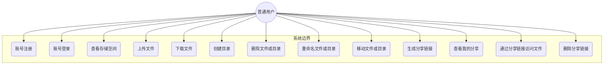

图2-2 管理员用例图

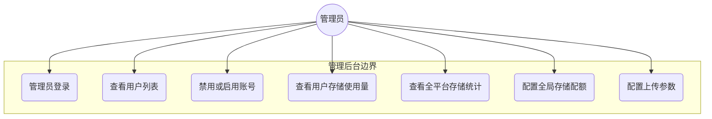

### 2.4 数据流图与数据字典

为了更清晰地说明系统中数据的流转过程和核心数据对象的结构，本节对数据流图和数据字典分别进行分析。数据流图主要反映用户、管理员与系统各层之间的信息交互关系，数据字典则用于说明主要数据对象的字段组成和含义。

#### 2.4.1 数据流图

在用户端的数据流中，普通用户首先提交账号和密码，后端认证模块完成身份校验后返回 JWT 令牌；此后，用户携带令牌发起文件上传请求，后端接收文件数据流并写入本地文件系统，同时将文件名、大小、MIME 类型、存储路径和所属目录等元数据写入 file_info 表，并更新用户的已用存储空间记录；当用户请求下载文件时，后端首先校验令牌和文件所有权，确认通过后从本地文件系统读取文件并以流式方式写入 HTTP 响应；当用户生成分享链接时，后端创建 share_link 表记录并返回包含随机令牌的访问地址；未登录访客通过分享链接访问时，后端仅校验令牌的有效性和过期状态，无需完整的用户鉴权。

在管理员端的数据流中，管理员登录后台后可以向后端发起用户查询、存储统计汇总和系统配置更新等请求。后端接收到管理员请求后，对角色权限进行二次校验，确认为管理员角色后才执行相应的数据库查询或配置更新操作，并将处理结果返回给后台页面。

从整体数据流的角度来看，系统已经形成了"用户或管理员提交请求、JWT 过滤器完成权限校验、后端业务控制器处理业务逻辑、数据库保存元数据、文件系统保存文件实体、前端展示最终结果"这样的完整数据流转链路，符合典型前后端分离 Web 系统的架构特征。

图2-3 系统整体数据流图

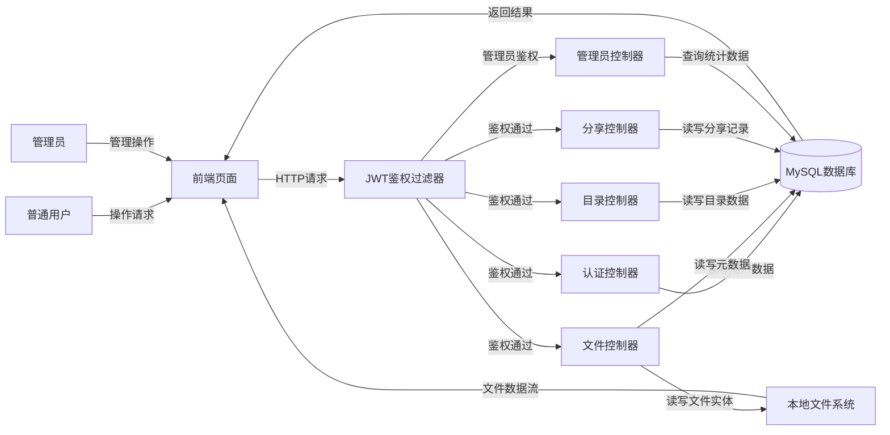

#### 2.4.2 数据字典

本系统涉及的核心数据对象主要包括用户信息、文件元数据、目录信息、文件分享记录和分块上传会话五类，以下分别对各数据对象的主要字段和含义进行说明。

用户信息（user）是整个系统的基础数据对象，主要用于保存用户的账号凭据和存储配额信息，是登录鉴权、文件归属判断和存储限额控制的核心依据。其主要字段包括用户主键 ID、登录用户名（唯一）、哈希后的密码、用户昵称（或显示名）、账号角色（普通用户或管理员）、账号状态（正常或已禁用）、已用存储空间（字节数）、存储配额上限（字节数），以及记录创建时间、更新时间和逻辑删除标记。

文件元数据（file_info）是文件管理功能的核心数据对象，用于保存每一个已上传文件的描述性信息，而不存储文件的实际二进制内容。其主要字段包括文件主键 ID、文件的显示名称、文件大小（字节数）、文件 MIME 类型、服务器端的实际存储路径（相对于根存储目录的相对路径）、所属目录 ID（外键关联目录表，根目录下的文件该字段为空）、文件所有者的用户 ID（外键关联用户表）、文件状态（正常或已删除），以及创建时间、更新时间和逻辑删除标记。

目录信息（folder）用于维护用户的目录树结构，是目录导航和文件路径组织的基础数据表。其主要字段包括目录主键 ID、目录名称、父目录 ID（外键关联自身，根目录的父目录 ID 为空）、所属用户 ID（外键关联用户表）、目录状态（正常或已删除），以及创建时间、更新时间和逻辑删除标记。通过父目录 ID 字段形成的递归引用关系，可以构建出任意层级深度的目录树结构。

文件分享记录（share_link）用于保存用户发起的文件分享操作的相关信息，是外链分享功能的数据基础。其主要字段包括分享记录主键 ID、被分享的文件 ID（外键关联文件元数据表）、分享发起者的用户 ID、随机生成的访问令牌（全局唯一，用于构成外链地址）、分享链接的过期时间（可为空，表示永久有效）、累计访问次数（用于统计分享使用情况）、分享状态（有效或已取消），以及创建时间、更新时间和逻辑删除标记。

分块上传会话（upload_chunk）用于支持大文件的断点续传机制，保存每个进行中或已完成的分块上传过程的状态信息。其主要字段包括会话主键 ID、上传任务的唯一标识符（由前端生成，用于关联同一次上传的所有分块）、目标文件名、文件总大小、总分块数、已成功上传的分块编号列表（以 JSON 或逗号分隔字符串保存）、所属用户 ID、目标目录 ID、会话状态（进行中、已完成或已过期），以及创建时间和最后更新时间。当所有分块均上传完成后，后端将各分块按顺序合并为完整文件，并在 file_info 表中创建正式的文件元数据记录，同时将 upload_chunk 记录标记为已完成。

将上述核心数据对象的字段结构和含义统一定义清楚，为后续数据库设计、接口定义和业务逻辑实现提供了明确的数据语义基础，也为系统后期的扩展维护提供了规范的数据说明参考。

---

## 第3章 系统概要设计

### 3.1 总体结构设计

本系统采用前后端分离的总体架构设计思路，将用户界面展示与业务逻辑处理分别交由前端和后端独立承担，两者通过标准化的 RESTful HTTP 接口进行通信。这种架构方式使前后端可以独立开发和部署，接口契约明确，便于后期维护和功能扩展。

从系统整体组成来看，主要分为前端页面层、后端服务层和数据存储层三个部分。前端页面层负责向用户提供可视化的操作界面，包括登录注册页面、文件浏览器主界面、文件上传组件、分享管理页面和管理员后台页面；后端服务层以 Drogon 框架为基础，划分为认证模块、文件管理模块、目录管理模块、文件分享模块、配额管理模块和管理员模块，各模块以 Drogon HttpController 为单元进行组织，通过 JWT 过滤器统一完成鉴权；数据存储层由 MySQL 数据库和服务器本地文件系统共同组成，MySQL 负责保存所有结构化的元数据，本地文件系统负责保存文件实体。

图3-1 系统总体架构图

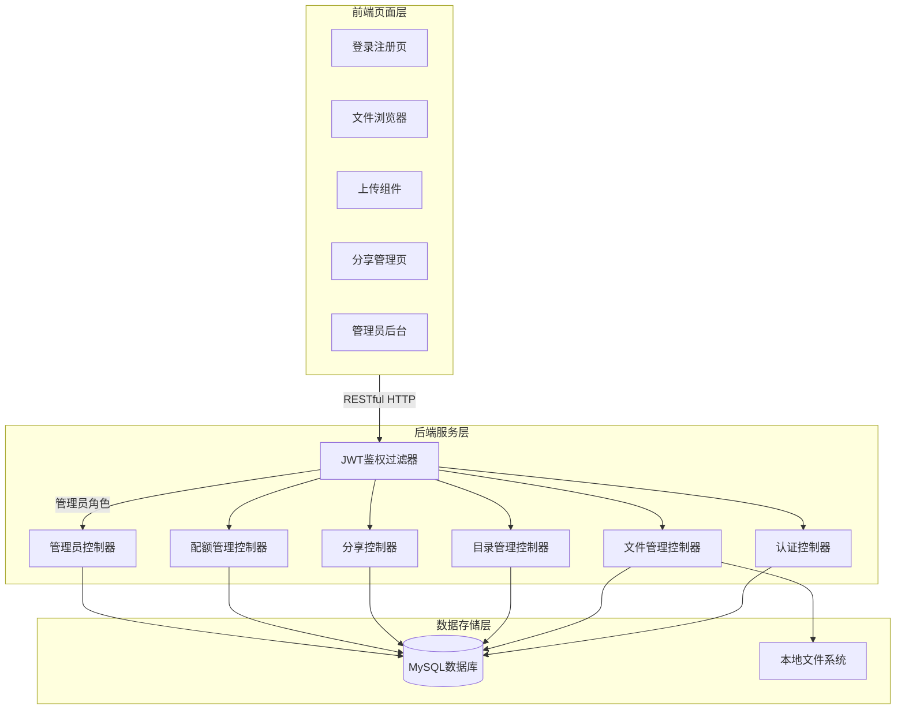

图3-2 用户端功能结构图

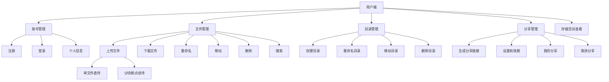

图3-3 管理员端功能结构图

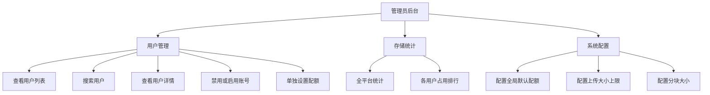

### 3.2 数据库设计

#### 3.2.1 数据库概念结构设计

根据系统需求分析阶段对各核心数据对象的梳理，系统主要涉及用户（User）、文件（FileInfo）、目录（Folder）、分享链接（ShareLink）和分块上传会话（UploadChunk）五类实体，以及实体之间的若干关联关系。

User 与 FileInfo 之间存在"拥有"关系，一个用户可以拥有多个文件（1 对多）；User 与 Folder 之间同样存在"拥有"关系，一个用户可以拥有多个目录（1 对多）；FileInfo 与 Folder 之间存在"归属"关系，一个文件归属于一个目录，一个目录下可以包含多个文件（多对一）；Folder 与 Folder 之间通过父目录外键形成"包含"的自引用递归关系（多对一），以表示目录树层级结构；FileInfo 与 ShareLink 之间存在"分享"关系，一个文件可以产生多条分享记录（1 对多）；User 与 UploadChunk 之间存在"发起"关系，一个用户可以同时进行多个上传会话（1 对多）。

图3-4 系统实体关系图（ER图）

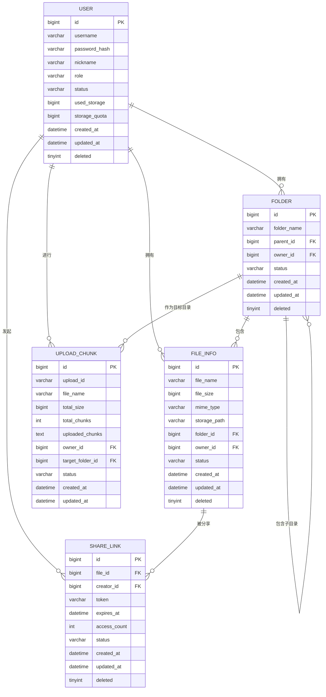

#### 3.2.2 数据库逻辑结构设计

在概念结构设计的基础上，将各实体及其关系转化为关系型数据库中的表结构。系统共设计五张核心数据表：用户表（user）、文件元数据表（file_info）、目录表（folder）、分享链接表（share_link）和分块上传会话表（upload_chunk），各表之间通过外键约束（逻辑外键）维护引用关系，采用逻辑删除机制（deleted 字段）代替物理删除以保留数据历史和支持后续数据恢复。

用户表（user）在逻辑上对应 User 实体，是系统登录认证和权限控制的基础表，所有业务表中的 owner_id、creator_id 等字段均关联到该表的主键 id。文件元数据表（file_info）对应 FileInfo 实体，通过 owner_id 关联用户、通过 folder_id 关联所在目录，文件实际存储在服务器文件系统中，数据库中只保存描述性元数据。目录表（folder）对应 Folder 实体，通过自引用的 parent_id 字段维护多级目录树，同一用户下目录名称在同一父目录内不得重复。分享链接表（share_link）对应 ShareLink 实体，通过 file_id 和 creator_id 分别关联被分享文件和发起分享的用户，token 字段添加唯一索引以保证分享令牌全局唯一。分块上传会话表（upload_chunk）作为辅助表，保存进行中的大文件上传任务的状态，在所有分块合并完成后，该记录被标记为已完成，不再参与常规查询。

#### 3.2.3 数据库物理结构设计

在逻辑结构设计的基础上，针对各表的字段数据类型、约束规则和索引策略进行具体设计，以保证数据完整性和常见查询场景下的访问效率。

1. 用户表（user）

表3-1 用户表

| 字段名 | 数据类型 | 主键/约束 | 字段说明 |
| --- | --- | --- | --- |
| id | BIGINT UNSIGNED | 主键，自增 | 用户主键ID |
| username | VARCHAR(64) | 唯一，非空 | 登录用户名 |
| password_hash | VARCHAR(255) | 非空 | 哈希后的密码 |
| nickname | VARCHAR(64) | 可空 | 用户昵称 |
| role | VARCHAR(20) | 非空，默认user | 角色类型（user/admin） |
| status | VARCHAR(20) | 非空，默认active | 账号状态（active/disabled） |
| used_storage | BIGINT UNSIGNED | 非空，默认0 | 已用存储空间（字节） |
| storage_quota | BIGINT UNSIGNED | 非空 | 存储配额上限（字节） |
| created_at | DATETIME | 非空 | 创建时间 |
| updated_at | DATETIME | 非空 | 更新时间 |
| deleted | TINYINT | 默认0 | 逻辑删除标记 |

2. 文件元数据表（file_info）

表3-2 文件元数据表

| 字段名 | 数据类型 | 主键/约束 | 字段说明 |
| --- | --- | --- | --- |
| id | BIGINT UNSIGNED | 主键，自增 | 文件主键ID |
| file_name | VARCHAR(255) | 非空 | 文件显示名称 |
| file_size | BIGINT UNSIGNED | 非空 | 文件大小（字节） |
| mime_type | VARCHAR(128) | 可空 | 文件MIME类型 |
| storage_path | VARCHAR(512) | 非空 | 服务器存储相对路径 |
| folder_id | BIGINT UNSIGNED | 可空，外键 | 所在目录ID（NULL表示根目录） |
| owner_id | BIGINT UNSIGNED | 非空，外键 | 文件所有者用户ID |
| status | VARCHAR(20) | 非空，默认normal | 文件状态（normal/deleted） |
| created_at | DATETIME | 非空 | 创建时间 |
| updated_at | DATETIME | 非空 | 更新时间 |
| deleted | TINYINT | 默认0 | 逻辑删除标记 |

索引说明：在（owner_id, folder_id）字段组合上建立联合索引，以加速文件列表查询；在 storage_path 字段上建立唯一索引，防止存储路径冲突。

3. 目录表（folder）

表3-3 目录表

| 字段名 | 数据类型 | 主键/约束 | 字段说明 |
| --- | --- | --- | --- |
| id | BIGINT UNSIGNED | 主键，自增 | 目录主键ID |
| folder_name | VARCHAR(255) | 非空 | 目录名称 |
| parent_id | BIGINT UNSIGNED | 可空，自引用外键 | 父目录ID（NULL表示根目录） |
| owner_id | BIGINT UNSIGNED | 非空，外键 | 目录所有者用户ID |
| status | VARCHAR(20) | 非空，默认normal | 目录状态 |
| created_at | DATETIME | 非空 | 创建时间 |
| updated_at | DATETIME | 非空 | 更新时间 |
| deleted | TINYINT | 默认0 | 逻辑删除标记 |

索引说明：在（owner_id, parent_id）字段组合上建立联合索引，以加速目录树遍历和子目录列表查询。

4. 分享链接表（share_link）

表3-4 分享链接表

| 字段名 | 数据类型 | 主键/约束 | 字段说明 |
| --- | --- | --- | --- |
| id | BIGINT UNSIGNED | 主键，自增 | 分享记录主键ID |
| file_id | BIGINT UNSIGNED | 非空，外键 | 被分享文件ID |
| creator_id | BIGINT UNSIGNED | 非空，外键 | 分享发起者用户ID |
| token | VARCHAR(64) | 唯一，非空 | 访问令牌（随机高熵字符串） |
| expires_at | DATETIME | 可空 | 过期时间（NULL表示永久有效） |
| access_count | INT UNSIGNED | 非空，默认0 | 累计访问次数 |
| status | VARCHAR(20) | 非空，默认active | 分享状态（active/revoked） |
| created_at | DATETIME | 非空 | 创建时间 |
| updated_at | DATETIME | 非空 | 更新时间 |
| deleted | TINYINT | 默认0 | 逻辑删除标记 |

索引说明：在 token 字段上建立唯一索引，以支持高效的令牌查找操作；在（creator_id, status）字段组合上建立索引，以加速"我的分享"列表查询。

5. 分块上传会话表（upload_chunk）

表3-5 分块上传会话表

| 字段名 | 数据类型 | 主键/约束 | 字段说明 |
| --- | --- | --- | --- |
| id | BIGINT UNSIGNED | 主键，自增 | 会话主键ID |
| upload_id | VARCHAR(64) | 唯一，非空 | 上传任务唯一标识符 |
| file_name | VARCHAR(255) | 非空 | 目标文件名 |
| total_size | BIGINT UNSIGNED | 非空 | 文件总大小（字节） |
| total_chunks | INT UNSIGNED | 非空 | 总分块数量 |
| uploaded_chunks | TEXT | 可空 | 已上传分块编号列表（JSON） |
| owner_id | BIGINT UNSIGNED | 非空，外键 | 上传发起者用户ID |
| target_folder_id | BIGINT UNSIGNED | 可空，外键 | 目标目录ID |
| status | VARCHAR(20) | 非空，默认uploading | 会话状态（uploading/completed/expired） |
| created_at | DATETIME | 非空 | 创建时间 |
| updated_at | DATETIME | 非空 | 最后更新时间 |

以上五张数据表从字段类型、约束规则和索引策略三个层面进行了合理的物理结构设计，在保证数据完整性和一致性的同时，也对文件列表查询、目录导航、令牌查找和存储统计等高频操作场景进行了针对性的索引优化，为系统各业务模块的稳定运行提供了坚实的数据存储基础。

---

## 第4章 系统详细设计

### 4.1 用户认证模块设计

用户认证模块是整个系统的安全基础，主要负责完成用户注册、登录和鉴权三个核心任务。该模块通过账号密码校验完成身份认证，并在登录成功后向前端签发 JWT 令牌；前端将令牌保存在浏览器本地存储中，在后续每次发送需要鉴权的接口请求时，将令牌附加在 Authorization 请求头中；后端 Drogon 框架的过滤器机制对进入业务控制器之前的每一个请求进行令牌有效性校验，校验通过后再将解析出的用户身份信息传递给业务控制器使用。

在用户注册流程中，前端提交用户名和密码，后端首先校验用户名是否已存在，若不存在则对密码进行哈希处理后，将新用户记录写入数据库，初始存储配额取系统全局配置的默认值。在用户登录流程中，后端接收用户名和密码，查询数据库中对应的账号记录，将提交的密码与数据库中保存的哈希值进行比对，校验通过后根据用户 ID、用户名、角色类型和令牌过期时间生成 JWT 令牌，连同用户基本信息一并返回给前端。

JWT 过滤器是认证模块与各业务控制器之间的桥梁，Drogon 的过滤器机制允许将鉴权逻辑从业务控制器中剥离出来，集中在过滤器类中统一处理，避免每个控制器重复编写鉴权代码。过滤器解析请求头中的令牌、验证签名有效性和过期时间，并将解析出的用户身份信息附加到请求上下文中，供后续业务控制器直接使用。对于管理员专属接口，过滤器在完成基础 JWT 校验后还会进一步检查用户角色，非管理员角色的请求会被直接拒绝并返回 403 状态码。

图4-1 用户登录流程图

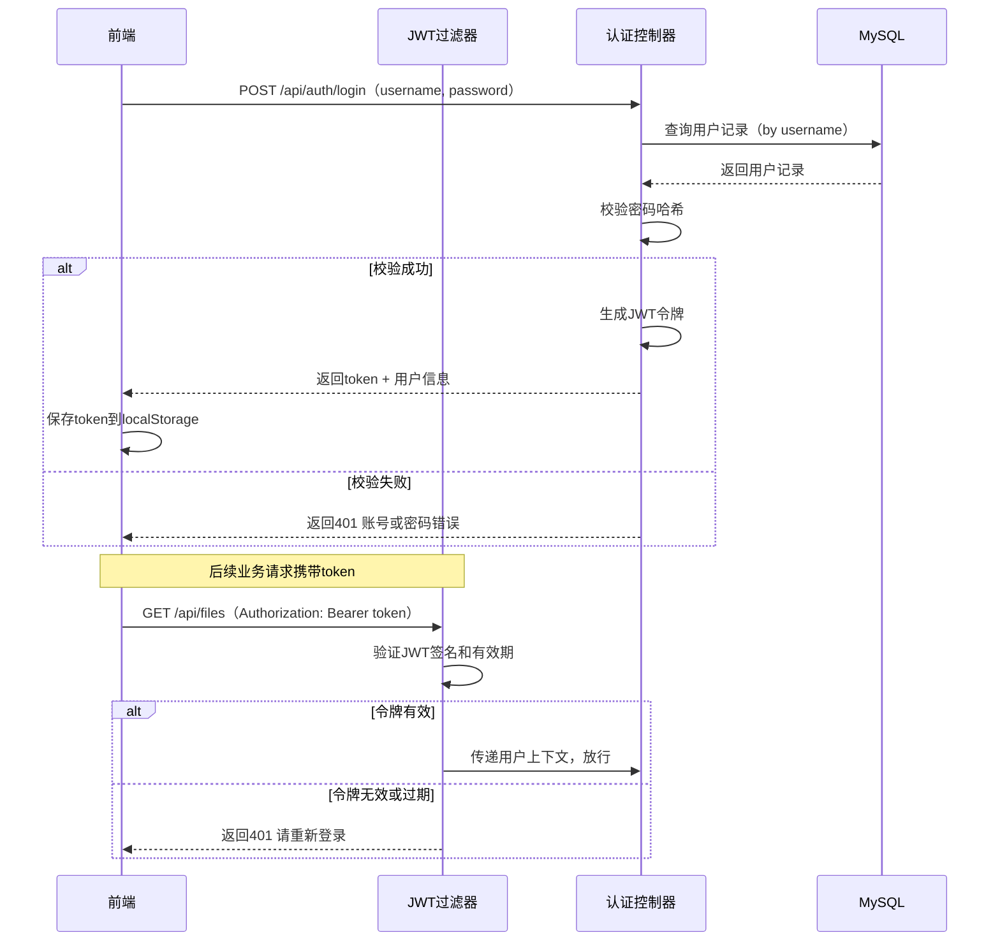

图4-2 用户注册流程图

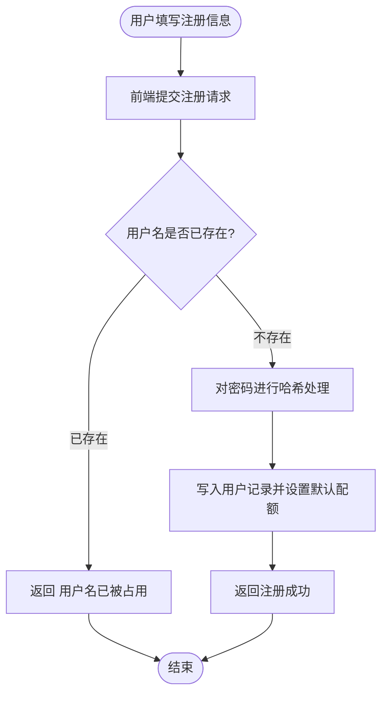

[图片描述功能：用户登录页面截图，包含用户名输入框、密码输入框和登录按钮，背景为简洁的白色卡片居中布局，顶部显示系统名称"网络磁盘"。]

[图片描述功能：用户注册页面截图，包含用户名、密码和确认密码三个输入框以及注册按钮，底部提供跳转登录页的链接。]

### 4.2 用户端模块设计

#### 4.2.1 文件管理模块

文件管理模块是用户端最核心的功能模块，围绕文件的上传、下载、重命名、移动和删除五项操作展开设计。该模块的设计目标是为用户提供一个类似于本地文件资源管理器的在线操作体验，使用户能够在 Web 界面中直观地管理自己的文件资源。

在文件列表展示方面，系统根据当前用户的 ID 和所在目录 ID，从数据库 file_info 表中查询出属于该用户且位于当前目录下的所有文件记录，按创建时间倒序排列后返回给前端；前端将文件列表渲染为卡片或行列表形式，展示文件名称、大小、类型图标和上传时间等信息；用户可以通过顶部的搜索框按文件名关键字进行过滤，搜索结果在前端实时筛选，无需额外发送接口请求。

在文件重命名和移动操作方面，后端提供独立的 PATCH 接口分别处理重命名和移动操作；重命名时后端校验新名称在同一目录下是否已存在同名文件，移动时后端校验目标目录是否属于当前用户且未被删除，校验通过后更新数据库记录并返回成功结果。

在文件删除方面，系统采用逻辑删除机制，删除操作将 file_info 表中对应记录的 deleted 字段置为 1、status 字段置为 deleted，同时将该文件所占用的存储空间从用户的 used_storage 字段中扣减，文件实体在服务器文件系统上暂时保留，不立即执行物理删除，以便在后续扩展回收站功能时可以恢复。

[图片描述功能：文件浏览器主界面截图，左侧为目录树导航面板，右侧为当前目录文件列表，顶部工具栏包含上传按钮、新建目录按钮和搜索框，文件列表以表格形式展示文件名、大小、修改时间和操作按钮。]

#### 4.2.2 目录管理模块

目录管理模块负责维护用户的多级目录树结构，使用户能够将文件按主题或用途分门别类地组织在不同目录下，方便后续浏览和检索。

在目录树展示方面，前端在左侧面板中以树形结构展示当前用户的所有目录，初次加载时递归拉取目录列表并构建前端的树形组件；用户点击某一目录节点后，主文件列表区域切换到该目录下的内容，同时顶部面包屑导航更新为当前路径。

在创建目录时，用户在当前目录下输入新目录名称并提交，后端校验同一父目录下同名目录是否已存在，不存在则在 folder 表中写入新记录，parent_id 设置为当前所在目录的 ID（根目录下创建时 parent_id 为空）。删除目录时，后端需要递归检查该目录及其所有子目录下是否存在文件，如果存在文件则先将所有文件标记为删除、扣减对应存储配额，再将目录本身标记为删除，以保证目录树的一致性。

图4-3 创建目录流程图

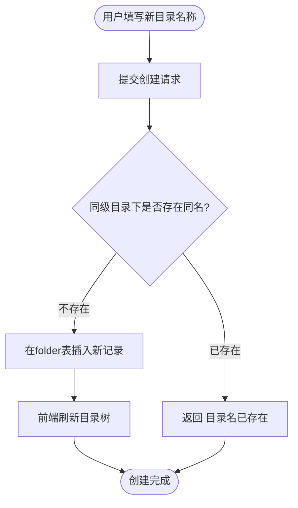

[图片描述功能：新建目录对话框截图，包含一个"目录名称"输入框和"确认"、"取消"两个按钮，对话框以模态弹层形式出现在文件浏览器主界面之上。]

#### 4.2.3 文件上传模块

文件上传模块是整个系统中技术实现复杂度最高的部分，需要同时支持小文件的单次直传和大文件的分块断点续传两种模式，以保证在不同网络环境和文件大小条件下都能提供稳定可靠的上传体验。

对于小文件，前端通过普通的 multipart/form-data 表单请求将文件内容直接上传，后端接收到完整文件后写入本地文件系统，并在 file_info 表中创建元数据记录，同时更新用户的已用存储空间。

对于大文件，系统实现了一套基于上传会话的分块断点续传机制。整个流程分为以下几个阶段：前端首先向后端发送初始化请求，携带文件名、文件大小和计划分块数，后端在 upload_chunk 表中创建会话记录并返回会话 ID；前端将文件按固定大小切分为若干分块，然后逐块发送上传请求，每个请求携带会话 ID、分块编号和分块数据，后端将分块临时写入本地文件系统的临时目录，并更新 upload_chunk 表中的已上传分块编号列表；当前端检测到所有分块均已成功上传后，向后端发送合并请求，后端将所有临时分块按编号顺序读取并合并为完整文件写入正式存储目录，完成后在 file_info 表中创建文件元数据记录，更新用户存储使用量，并将 upload_chunk 会话标记为已完成。断点续传的关键在于，如果上传过程中网络中断，前端下次恢复上传时，可以携带会话 ID 向后端查询已上传的分块列表，然后跳过已成功的分块，只重传缺失的部分，从而避免从头重传整个文件。

图4-4 文件上传模块整体流程图

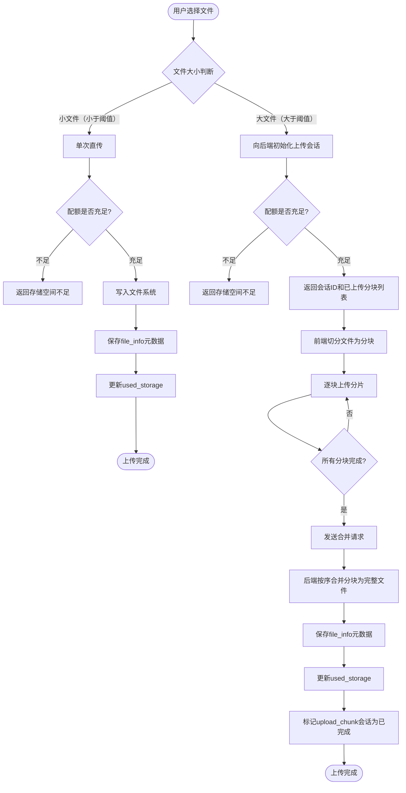

[图片描述功能：文件上传进度界面截图，展示了一个正在进行分块上传的大文件，进度条显示当前已上传的百分比，下方列出已完成分块数和总分块数，提供暂停和取消按钮。]

#### 4.2.4 文件分享模块

文件分享模块允许用户将自己的文件通过外链方式分享给他人，即使接收方没有注册该系统的账号，也可以通过分享链接直接下载文件。该模块的设计既要满足分享操作的便捷性，又要通过令牌机制和有效期控制保证分享的安全可控性。

在生成分享链接时，用户在文件列表中选择目标文件，点击分享按钮后选择链接有效期（如一天、七天、三十天或永久有效），前端提交分享请求，后端在 share_link 表中创建一条新记录，令牌字段存储一个随机生成的高熵字符串（如 UUID 或其他安全随机字符序列），过期时间根据用户选择计算，状态设置为 active；后端将完整的分享链接（格式为 /share/{token}）返回给前端展示，用户复制后即可分发给需要访问该文件的人。

在访问分享链接时，接收方（无需登录）在浏览器中打开分享链接，前端向后端发送带有令牌的访问请求，后端在 share_link 表中查找对应记录，校验令牌是否有效（记录存在、状态为 active、尚未过期），若校验通过则查询关联的文件元数据，返回文件名和可供下载的接口地址，接收方点击下载后后端从文件系统读取文件并以流式方式返回；每次成功访问时 access_count 字段自增以记录访问统计。

图4-5 文件分享访问流程图

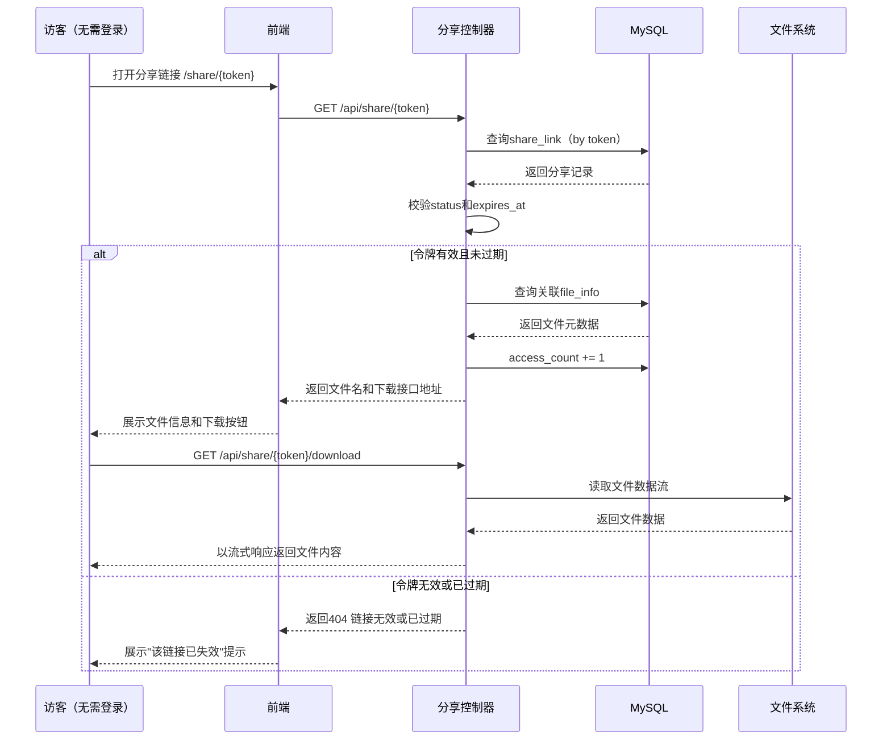

[图片描述功能：文件分享管理页面截图，展示当前用户的分享列表，每条记录包含文件名、分享链接、有效期、访问次数和取消分享按钮，顶部有"新建分享"按钮。]

[图片描述功能：分享链接访问页面截图，展示了分享文件的名称、文件大小和上传时间，以及一个醒目的"立即下载"按钮，整体风格简洁，无需登录即可看到。]

### 4.3 管理员后台模块设计

#### 4.3.1 用户管理模块

用户管理模块面向管理员提供对平台注册用户的查看和管理能力，是维护平台账号安全和规范管理的基础模块。管理员可以在该模块中查看全部注册用户的列表，列表展示内容包括用户 ID、用户名、昵称、账号角色、账号状态、已用存储空间、存储配额上限和注册时间等信息，并支持按用户名或昵称关键字进行筛选，以及按账号状态（正常或已禁用）进行过滤，方便管理员快速定位目标用户。

对于违规或异常的用户账号，管理员可以执行禁用操作，禁用后该账号的 JWT 令牌在有效期内仍然存在，但后端过滤器在校验令牌后会进一步查询用户当前状态，如果发现账号状态为 disabled 则拒绝请求并返回相应提示，实现了禁用即时生效的效果，而不需要等待令牌自然过期。管理员也可以对已禁用的账号执行重新启用操作，启用后该账号可以正常登录和使用系统。

此外，管理员可以对指定用户单独设置存储配额，这一功能用于处理需要特殊配额分配的用户场景（如给予特定用户更大的存储空间），单独设置的配额会覆盖系统全局默认配额。管理员也可以查看单个用户的存储使用详情，了解该用户已用空间和剩余可用空间的具体数值，以便在收到用户反馈时进行有针对性的配置调整。

[图片描述功能：用户管理后台页面截图，展示注册用户列表，每行包含用户名、角色、状态、已用空间、配额和操作按钮（禁用/启用、设置配额），顶部有搜索框和状态筛选下拉框。]

#### 4.3.2 存储统计模块

存储统计模块为管理员提供对全平台存储资源使用情况的整体视图，是管理员了解系统运行状态和制定存储策略的重要依据。该模块主要展示两类统计数据：一类是全平台汇总数据，包括当前注册用户总数、全平台文件总数量、全平台存储总使用量（字节数，同时换算为更易读的 MB/GB 单位显示）；另一类是用户维度的存储使用排行，列出存储使用量从大到小的前 N 名用户，展示其用户名、已用空间和配额上限，便于管理员及时发现存储使用异常偏高的账号。

在实现上，全平台汇总数据通过对 user 表的 used_storage 字段进行 SUM 聚合查询获得，文件总数通过对 file_info 表（状态为正常的记录）进行 COUNT 查询获得；用户存储排行通过对 user 表按 used_storage 字段降序排列并取 TOP N 获得，查询结果以 JSON 格式返回给前端页面渲染，前端以数字展示卡片和表格两种形式混合呈现统计内容。

[图片描述功能：存储统计后台页面截图，顶部以三个数字卡片分别展示用户总数、文件总数和全平台存储使用量，下方以表格展示存储使用量前10名用户的排行数据。]

#### 4.3.3 系统配置模块

系统配置模块允许管理员对平台的全局运行参数进行调整，以适应不同部署环境和使用场景下的需求。当前系统支持配置的主要参数包括以下几项：全局默认存储配额（新注册用户默认分配的存储空间上限，单位为 MB，默认值可在配置文件中预设）；单次上传文件大小上限（超过该限制的文件必须使用分块上传接口，默认值建议设置为 100MB 左右）；分块上传的每块大小（影响分块上传时每个 HTTP 请求传输的数据量，太小会增加请求次数，太大会影响慢速网络下的上传成功率，建议默认值为 4MB）。

这些参数既可以通过 Drogon 的配置文件（config.json）在启动时载入，也可以持久化保存在数据库的系统配置表中，支持在不重启服务的情况下通过管理员接口动态调整。系统配置的修改操作受到管理员角色权限保护，普通用户无法访问该接口，配置更新成功后系统将在后续的新请求中使用最新的参数值。

[图片描述功能：系统配置后台页面截图，展示全局默认配额（可编辑输入框）、单文件大小上限和分块大小三项配置字段，底部有"保存设置"按钮，并显示上次更新时间。]

---

## 第5章 系统测试

### 5.1 测试目的与方法

#### 5.1.1 测试目的

系统测试的主要目的，是验证网络磁盘系统各功能模块是否满足需求分析阶段提出的业务要求，同时检查系统在用户认证、文件上传与下载、目录管理、文件分享、存储配额控制以及管理员后台操作等关键业务场景下能否稳定运行，并根据测试结果发现潜在缺陷，为后续系统优化提供依据。

#### 5.1.2 测试方法

本系统测试主要采用黑盒测试方法，围绕接口输入、接口输出和业务流程进行功能性验证。测试过程中重点检查以下几个方面：页面操作和接口调用是否能够触发预期的业务行为；接口返回的 HTTP 状态码和响应体结构是否符合设计规范；数据库中相关记录的状态在操作完成后是否正确更新；不同角色的访问权限边界是否严格执行，越权操作是否被正确拦截。测试环境与开发环境保持一致，主要借助浏览器界面、curl 命令行工具和本地 MySQL 数据库进行功能验证。

### 5.2 系统测试

#### 5.2.1 登录注册功能测试

测试目的：验证用户注册和登录流程是否正常，检查密码错误提示、用户名重复提示、未登录访问拦截和管理员角色识别是否符合系统设计要求。

表5-1 登录注册模块测试表

| 编号 | 测试用例 | 预期结果 | 实际结果 |
| --- | --- | --- | --- |
| TC-01 | 新用户填写未被注册的用户名和密码完成注册 | 注册成功，账号写入数据库，分配默认配额 | 与预期一致 |
| TC-02 | 使用已注册的用户名再次注册 | 注册失败，提示用户名已被占用 | 与预期一致 |
| TC-03 | 普通用户输入正确用户名和密码登录 | 登录成功，返回JWT令牌，跳转文件浏览器页面 | 与预期一致 |
| TC-04 | 普通用户输入正确用户名和错误密码登录 | 登录失败，提示账号或密码错误 | 与预期一致 |
| TC-05 | 管理员输入正确账号密码登录 | 登录成功，进入管理员后台页面 | 与预期一致 |
| TC-06 | 未登录用户直接访问需鉴权的文件接口 | 请求被拦截，返回401，提示请先登录 | 与预期一致 |
| TC-07 | 普通用户使用有效令牌访问管理员专属接口 | 请求被拦截，返回403，提示权限不足 | 与预期一致 |

[图片描述功能：TC-04测试结果截图，登录页面上方出现红色错误提示框，显示"账号或密码错误，请重新输入"，输入框保持当前内容不变。]

#### 5.2.2 文件上传与下载功能测试

测试目的：验证小文件单次上传、大文件分块断点续传以及文件下载功能是否正常，检查存储配额限制和断点续传恢复机制是否有效。

表5-2 文件上传与下载模块测试表

| 编号 | 测试用例 | 预期结果 | 实际结果 |
| --- | --- | --- | --- |
| TC-08 | 用户上传一个小于单次上传阈值的文件 | 文件上传成功，文件列表中显示新文件，已用空间增加 | 与预期一致 |
| TC-09 | 用户上传一个大于单次上传阈值的大文件（分块上传） | 文件分块上传成功，合并后文件出现在列表中 | 与预期一致 |
| TC-10 | 大文件上传过程中模拟网络中断后重新上传（断点续传） | 系统识别已上传分块，跳过已完成分块，从中断处继续上传 | 与预期一致 |
| TC-11 | 用户上传文件导致总存储使用量超过配额上限 | 上传失败，提示存储空间不足，文件不写入系统 | 与预期一致 |
| TC-12 | 用户下载自己名下的文件 | 文件下载成功，浏览器保存文件内容与上传时一致 | 与预期一致 |
| TC-13 | 用户尝试下载不属于自己的其他用户文件（通过猜测文件ID） | 请求被拒绝，返回403或404，文件内容不返回 | 与预期一致 |

[图片描述功能：TC-11测试结果截图，上传操作触发后弹出错误提示对话框，显示"存储空间不足，无法上传。当前已用X GB，配额上限为Y GB"，对话框底部有"确认"按钮。]

#### 5.2.3 目录管理功能测试

测试目的：验证用户创建目录、删除目录和在目录间导航等功能是否正常，检查目录重名限制和递归删除行为是否符合预期。

表5-3 目录管理模块测试表

| 编号 | 测试用例 | 预期结果 | 实际结果 |
| --- | --- | --- | --- |
| TC-14 | 用户在当前目录下创建一个新目录 | 目录创建成功，目录树和文件列表中显示新目录 | 与预期一致 |
| TC-15 | 用户在同一父目录下创建与已有目录同名的目录 | 创建失败，提示该目录名已存在 | 与预期一致 |
| TC-16 | 用户通过点击目录导航进入子目录 | 文件列表切换为所选目录下的内容，面包屑导航同步更新 | 与预期一致 |
| TC-17 | 用户删除一个包含文件和子目录的目录 | 目录及其所有子目录和文件均被逻辑删除，存储使用量同步减少 | 与预期一致 |
| TC-18 | 用户对目录进行重命名 | 目录名称更新成功，目录树中显示新名称 | 与预期一致 |

[图片描述功能：TC-15测试结果截图，新建目录对话框中的错误提示区域显示"该目录名称在当前位置已存在，请使用其他名称"，输入框内容保留。]

#### 5.2.4 文件分享功能测试

测试目的：验证生成分享链接、通过分享链接访问文件和取消分享等流程是否正常，检查链接有效期和令牌唯一性机制是否有效。

表5-4 文件分享模块测试表

| 编号 | 测试用例 | 预期结果 | 实际结果 |
| --- | --- | --- | --- |
| TC-19 | 用户为指定文件生成一个七天有效期的分享链接 | 分享记录创建成功，返回包含随机令牌的分享链接 | 与预期一致 |
| TC-20 | 访客使用有效的分享链接访问文件信息页面 | 页面展示文件名和大小，提供下载按钮，无需登录 | 与预期一致 |
| TC-21 | 访客使用有效的分享链接下载文件 | 文件下载成功，内容与原文件一致，access_count递增 | 与预期一致 |
| TC-22 | 访客使用已过期的分享链接访问 | 返回"该链接已失效"提示，文件不提供下载 | 与预期一致 |
| TC-23 | 用户取消一个有效的分享链接 | 分享记录状态更新为revoked，该链接随即无法访问 | 与预期一致 |

[图片描述功能：TC-22测试结果截图，分享链接访问页面显示一个提示卡片，内容为"此分享链接已失效或已被取消，请联系分享者重新获取"，页面背景简洁，无下载按钮。]

#### 5.2.5 管理员后台功能测试

测试目的：验证管理员用户管理、存储统计查看、系统配置调整等功能是否正常，检查权限控制和数据准确性是否符合预期。

表5-5 管理员后台功能测试表

| 编号 | 测试用例 | 预期结果 | 实际结果 |
| --- | --- | --- | --- |
| TC-24 | 管理员查看全部注册用户列表 | 列表展示所有用户账号、状态和存储使用情况 | 与预期一致 |
| TC-25 | 管理员禁用指定普通用户账号 | 账号状态更新为disabled，该用户下次请求时被拒绝 | 与预期一致 |
| TC-26 | 管理员为指定用户单独设置存储配额 | 该用户的storage_quota字段更新为指定值 | 与预期一致 |
| TC-27 | 管理员查看全平台存储统计数据 | 正确展示用户总数、文件总数和存储总使用量 | 与预期一致 |
| TC-28 | 管理员修改全局默认存储配额参数 | 配置保存成功，之后新注册用户的默认配额使用新值 | 与预期一致 |
| TC-29 | 管理员修改单文件上传大小上限参数 | 配置保存成功，后端新的上传请求按新限制进行校验 | 与预期一致 |

[图片描述功能：TC-25测试结果截图，用户列表页面中目标用户所在行的状态列由绿色"正常"变为红色"已禁用"，操作按钮从"禁用"变为"启用"。]

### 5.3 测试结果分析

从整体测试结果来看，系统核心业务流程运行较为稳定，用户端和管理员端的主要功能均达到了设计目标。用户认证与鉴权、文件上传（包含分块断点续传机制）、文件下载、目录管理、文件分享的生成与访问控制，以及管理员的用户管理、存储统计和系统配置等功能，均通过了功能性验证，说明系统在可用性和功能完整性方面表现较好。

在安全性测试方面，非法越权访问（用户访问他人文件、普通用户访问管理员接口）和令牌过期场景均能被正确拦截和处理，说明 JWT 鉴权机制和角色权限控制的实现是符合设计意图的。存储配额限制在上传场景下也能有效生效，防止了无限制写入的问题。

从测试过程中也能看到系统目前存在的一些不足和改进空间。首先，当前测试主要在本地单机环境下进行，缺乏高并发压力测试，Drogon 框架在实际高并发文件传输场景下的性能表现尚未通过测试数据量化验证；其次，系统目前尚未实现文件哈希去重（秒传）功能，相同内容的文件会被重复存储，在存储效率上有优化空间；另外，部分前端交互细节（如上传进度的精细化展示、文件拖拽上传支持）和错误提示的用户友好性还有继续完善的余地。综合来说，系统已经能够满足毕业设计阶段的实现目标，主要功能流程具有可演示性和基础实用性，但如果要走向真正的生产环境部署，后续仍需在性能优化、存储效率和运维监控等方面进行进一步完善。

---

## 结　论

本文围绕私有化网络磁盘系统的设计与实现展开研究，结合私有化文件存储场景在用户文件管理、大文件传输可靠性、分享链接控制和管理员运维管理等方面的实际需求，按照软件工程的基本流程完成了系统需求分析、总体架构设计、数据库设计、各模块详细设计与实现，以及系统测试验证等工作。系统整体采用前后端分离的架构方案，后端以 C++17 标准和 Drogon 高性能 Web 框架为核心，前端以 HTML、CSS 和 JavaScript 实现用户交互界面，数据存储层由 MySQL 数据库和服务器本地文件系统共同构成，基本实现了面向普通用户和管理员两类角色的完整业务支撑能力。

在系统功能实现方面，重点完成了用户注册登录与 JWT 鉴权机制、个人存储空间管理与配额控制、多级目录树的创建与导航、文件的上传（含分块断点续传）与下载、文件重命名与移动、文件外链分享生成与访问控制等用户端核心功能，同时完成了管理员用户账号管理、存储使用统计和全局系统参数配置等后台管理功能。尤其是在文件上传方面，系统实现了基于上传会话的分块断点续传机制，通过对已上传分块的持久化记录，有效解决了大文件在弱网络环境下上传可靠性不足的问题，较好地体现了系统针对文件传输核心场景所做的针对性设计。

从系统测试结果来看，当前版本已基本达到毕业设计的预期目标。系统主要功能流程能够稳定运行，前后端之间的数据交互逻辑清晰，文件存储、目录管理、分享访问控制和权限边界等关键业务场景下的行为符合设计预期，验证了所采用的技术路线和系统架构的可行性，也证明了 Drogon 框架在文件服务类 Web 应用中的适用性。就毕业设计层面的研究而言，本系统具备较好的完整性、可演示性和基础实用价值。

当然，受开发周期、测试环境和课题范围等因素制约，系统目前仍存在一些不足之处。在功能层面，文件秒传（内容哈希去重）、回收站与文件恢复、文件版本历史以及 WebDAV 协议支持等高级功能尚未实现；在测试层面，高并发压力测试和安全渗透测试尚未开展，系统在并发文件传输场景下的吞吐量和稳定性有待进一步验证；在运维层面，系统目前缺乏完善的日志记录、监控告警和容灾恢复机制，与生产级部署的要求仍有差距。这些问题说明，当前系统还处于功能原型阶段，要达到真正的商业化或生产环境使用标准，后续还需要在多个维度持续深入完善。

总体来说，本文完成的私有化网络磁盘系统设计与实现工作，为基于 C++ Drogon 框架构建文件存储类 Web 服务提供了一个完整的工程实践参考，为私有化存储平台的技术选型和架构设计积累了可借鉴的经验，也为后续继续深入研究和扩展优化打下了较为坚实的基础。

---

## 谢　辞

本课题从选题、系统设计、功能实现到论文撰写的整个过程中，得到了多位老师的悉心指导与帮助。在此，谨向所有给予关心和支持的老师表示诚挚的谢意。

首先，衷心感谢指导教师在本课题完成过程中给予的持续关注、认真指导与宝贵意见。从最初的课题方向确定，到系统功能设计的反复打磨，再到论文撰写过程中的结构调整与内容完善，指导老师始终给予及时、到位的点拨，使本课题能够较为顺利地推进并最终完成。

其次，感谢企业指导教师在实际工程经验方面给予的指导与支持。对于技术选型的实用性分析和工程实现中遇到的具体问题，企业指导老师提出的意见使系统的设计方案更加贴近真实的工程实践需求，对课题的顺利推进起到了重要的促进作用。

此外，也感谢在课题研究和论文写作过程中给予帮助和鼓励的各位同学。在遇到技术难题时共同讨论、相互启发，在调试和测试过程中提供的支持与协助，使这段毕业设计经历更加充实和有意义。

通过本次毕业设计，不仅对 Drogon 框架、MySQL 数据库以及前后端分离架构有了更深入的理解，也对如何将所学的软件工程知识应用于一个有真实业务逻辑的完整系统开发有了更具体的体会。这段经历和积累，将对今后的学习和工作产生持续而积极的影响。

---

## 参考文献

[1] 赵维铨.基于C++的高性能Web服务器设计与实现[J].计算机技术与发展,2021,31(04):78-82.

[2] 刘彬,吴昊.私有云存储系统的设计与实现[J].计算机与数字工程,2022,50(08):1823-1827.

[3] 孙志成,李晓光.基于RESTful API的文件管理系统研究[J].软件工程,2020,23(11):12-15+50.

[4] 王思远.断点续传技术在大文件上传中的应用研究[J].电脑知识与技术,2021,17(16):5-7.

[5] 陈立明,张嘉文.JWT身份认证机制在Web服务中的应用[J].信息与电脑（理论版）,2022,(06):71-73.

[6] 李鹏,赵辰.基于前后端分离架构的Web系统设计[J].电子技术与软件工程,2020,(12):41-42.

[7] 吴晓东.MySQL数据库性能优化策略研究[J].计算机产品与流通,2021,(09):47-48.

[8] 周文静,刘凯.epoll事件驱动模型在高并发服务器中的应用[J].计算机工程与科学,2020,42(01):133-141.

[9] 杨芳.计算机网络应用技术[M].成都：电子科技大学出版社,2025:220.

[10] 王红刚,谢秉贤,王征风.软件工程理论与实践[M].西安：西北大学出版社,2024:262.

[11] 马占飞,吴井军,张玉然.Java编程技术与项目实战[M].北京：电子工业出版社,2025:248.

[12] Shafranovich Y. The application/json Media Type for JavaScript Object Notation. RFC 4627, IETF, 2006.

[13] Jones M, Bradley J, Sakimura N. JSON Web Token (JWT). RFC 7519, IETF, 2015.

[14] Ghemawat S, Gobioff H, Leung S T. The Google file system[C]. Proceedings of the nineteenth ACM symposium on Operating systems principles, New York, 2003: 29-43.

[15] Decandia G, Hastorun D, Jampani M, et al. Dynamo: Amazon's highly available key-value store[C]. ACM SIGOPS Operating Systems Review, 2007, 41(6): 205-220.

[16] Fielding R T. Architectural styles and the design of network-based software architectures[D]. University of California, Irvine, 2000.

[17] 刘海洋,张明.云存储中数据安全与访问控制技术综述[J].通信技术,2021,54(03):544-551.

[18] 金程,孙礼.基于Token机制的分布式系统认证方案[J].计算机应用与软件,2020,37(06):143-148+166.

[19] Drogon Framework. Drogon: A C++14/17/20 Based HTTP Web Application Framework. https://github.com/drogonframework/drogon, 2024-10.

[20] MySQL Documentation Team. MySQL 8.0 Reference Manual. https://dev.mysql.com/doc/refman/8.0/en/, 2024-10.
