# 基于Drogon的网络磁盘系统的设计与实现

## 摘　要

学习、办公和项目开发会产生大量文档、图片、代码包和临时资料，文件分散后查找、备份和跨设备访问都不方便。公有云网盘虽然易用，但数据托管、容量、带宽和平台规则都受第三方限制。针对个人服务器和小型团队的数据自主管理需求，本文设计并实现了一套基于Drogon的私有化网络磁盘系统。

系统将后端服务和桌面客户端分开来进行实现，后端利用C++23和Drogon处理接口、文件传输、认证鉴权和后台管理，Qt 6或QML客户端通过RESTful API与后端进行交互，用户信息、文件元数据、目录结构、上传任务、分享记录、回收站数据、操作日志都会被写入MySQL数据库，令牌、登录失败计数、分享访问状态和限流计数会被存入Redis，真实文件按照内容哈希值保存到本地目录中。账号认证、文件管理、分片上传、断点续传、秒传、Range下载、外链分享、回收站和后台管理等流程都已实现。

运行和测试结果显示，主要业务流程已经走通。普通用户能够整理文件、处理传输任务并创建分享，管理员能够查看用户、分享、日志和系统状态。注册登录、文件传输、目录管理、分享访问和权限控制等测试结果与设计要求基本一致。

关键词：网络磁盘；文件管理；Drogon；C++23；RESTful API

---

## ABSTRACT

Digital materials from study, work, and projects are often scattered across devices, making management and access inconvenient. Public cloud drives are easy to use, but data hosting, capacity, bandwidth, and service rules depend on third-party platforms. This thesis designs and implements a private network disk system based on Drogon for personal servers and small teams.

The system separates the backend service from the desktop client. The backend uses C++23 and Drogon for APIs, file transfer, authentication, and management, while the Qt 6/QML client accesses it through RESTful APIs. MySQL stores users, file metadata, directories, upload tasks, shares, trash records, and logs; Redis stores tokens, login failure counters, share states, and rate-limiting counters. File entities are stored locally by content hash. The system implements authentication, file management, chunked and resumable upload, instant deduplication, Range download, sharing, trash handling, and backend management.

Operation and test results show that the system has completed its main workflows. Regular users can manage files, transfers, and shares, while administrators can view users, shares, logs, and system status. Registration, file transfer, directory management, share access, and permission control meet the design requirements.

KEYWORDS: Network Disk; File Management; Drogon; C++23; RESTful API

---

## 前　言

学习、办公和日常生活中会不断产生课程文档、项目代码、图片、视频等资料，这些资料分散保存后查找和备份都不方便，网络磁盘比本地硬盘更有利于跨设备访问和共享，不过公有云网盘在数据托管、容量、带宽和平台规则上仍然受到第三方的限制，个人用户和小型团队仍然需要拥有私有化的网盘服务。

网盘的日常操作主要包括上传、下载、整理目录、搜索和分享，大文件传输在遇到网络波动时，重新开始会消耗时间，因此断点续传是基本要求，如果分享链接没有有效期、访问密码和权限控制，也会增加后续管理成本。

管理员日常维护也需要统一入口。账号数量、存储占用、数据库连接、Redis状态和磁盘空间如果分散查看，排查问题会比较费时。因此，本文在实现普通用户文件管理的同时，也加入后台管理、操作日志和系统状态查询。

后端采用C++23和Drogon，主要考虑上传、下载对磁盘和网络I/O依赖较重。Drogon底层通过epoll（macOS/FreeBSD下为kqueue）处理网络事件，并支持协程化请求，用于这类等待时间较长的接口较合适。系统用MySQL保存元数据，Redis保存令牌和限流等短时状态，文件实体放在本地内容寻址目录中。

本文按照需求分析、系统设计、数据库设计、功能实现和测试验证的顺序展开。课题面向中小型私有化文件服务场景，验证Drogon、MySQL和Redis组合完成网络磁盘业务流程的可行性。

---

## 第1章 绪论

### 1.1研究背景

近几年，个人数字内容增长较快，在线存储的使用频率也明显提高，云存储确实方便了资料整理和团队协作，但是公有云盘仍然绕不开几个限制：文件托管在第三方服务器上，隐私数据和商业资料的保护存在不确定性，平台规则会影响容量、速度和服务策略，拥有合规要求的团队把数据存放在自有基础设施里会更加稳妥。

所以，自建私有化网盘拥有清晰的使用场景，文件实体和元数据保存在自有服务器上，用户可以自行配置数据位置、访问策略、存储空间和带宽，但是，将上传下载、目录管理、分享、权限控制和后台维护都进行完整处理，并保持部署负担处于可控状态，这并不简单，本文使用C++和Drogon Web模式来实现该系统，主要为了验证该路线在文件服务场景上的可行性。

### 1.2研究意义

本课题面向私有化网络磁盘场景，设计并实现一个文件服务系统。系统把文件管理、目录组织、大文件上传、文件分享和管理员后台整合到同一套后端服务中，并使用C++与Drogon承担文件传输和接口处理任务，是一个可部署、可运行、可测试的工程样例。

系统主要面向个人开发者、高校师生和中小团队，并且可以提供相应服务，文件上传、目录整理、检索和分享功能都集中在同一个客户端界面上，配额和已用空间信息直接显示，用户不用在不同工具之间进行切换，管理员端拥有账号管理、存储统计和系统状态入口，该页面降低了日常维护中对数据库客户端、Redis命令行和磁盘工具的依赖。

本文在工程实践中将C++系统编程、异步网络I/O、Web框架、关系型数据库、缓存状态和RESTful接口集成在一个项目中进行验证，实现过程不仅要完成接口调用，还要处理认证、文件传输、目录结构、权限边界和桌面客户端交互之间的配合，特别是上传取消、文件删除、分享失效等场景下的数据状态一致性。

### 1.3国内外研究现状

云存储和网络磁盘已经有了很多研究、工程实践，但是，如果把范围限定在基于C++Web框架的私有化网络磁盘系统上，可以直接参考的完整案例并不多。

国外云存储起步较早，分布式文件系统、对象存储和数据去重已有较多成熟方案。GFS、Amazon S3和OpenStack Swift主要面向数据中心级水平扩展，直接用于单机私有化部署会显得较重。Nextcloud和ownCloud功能较完整，但对服务器配置和运行性能有一定要求；SeaweedFS、MinIO等项目更偏向对象存储基础设施。

国内公有云网盘发展较快，百度网盘、阿里云盘等产品让文件秒传、内容去重和传输加速逐渐成为用户熟悉的能力。教学和毕业设计项目中的自建网盘，多采用Spring Boot、Django或Flask配合数据库和本地文件系统实现，基本功能一般可以满足演示需求，但高并发传输和资源占用控制仍有改进空间。用C++ Web框架贯通网盘主要业务的公开案例并不多。

已有研究和系统实践可以为云存储架构和私有网盘开发提供参考，但在中小规模、私有化部署和C++后端这几个条件同时存在时，仍需要结合具体工程进行验证。本文不以替代成熟云存储系统为目标，而是尝试给出一种面向单机或小团队环境的网络磁盘实现路径。

### 1.4本文的组织结构

本文主要针对私有化网络磁盘系统进行研究，重点解决文件存储访问、大文件传输、目录树管理、分享控制、后台运维等问题，课题目标并不是要复刻大型云盘，而是要完成一个普通用户和管理员都可以使用的网盘平台，并且要验证其部署、演示和维护是否可以做到。

用户侧接口具有账号认证、个人资料、文件和目录管理、分片上传、断点续传、秒传、Range下载、外链分享和回收站处理的功能，管理员侧主要进行维护工作，包括用户管理、存储统计、分享管理、系统概览和状态查询。

文件上传和下载请求包括较多磁盘与网络等待，后端使用Drogon异步非阻塞I/O和C++协程模型进行处理，上传任务和分片状态被写入数据库，客户端断线后只需要补传缺失的分片，文件内容哈希和引用计数用来进行秒传和去重，防止相同内容重复落盘，本文将令牌、限流和登录失败次数等短时状态交由Redis进行保存，从而减轻高频状态变化给MySQL带来的压力。

系统安全设计主要围绕几个边界处理，普通用户只能访问自己名下的文件和目录，管理员接口除了校验登录状态外，也会检查用户角色，公开分享访问不会直接复用用户的JWT，而是依靠分享短码、可选密码、短期分享令牌和有效期来共同限制访问范围，用户密码通过Argon2id算法进行哈希存储，登录失败计数和短时锁定机制用来降低暴力破解造成的风险。

后端按照认证、用户、文件、目录、分享、回收站、运维统计和操作日志这些模块进行拆分，控制器对请求进行解析并对响应进行转换，主要业务判断放在服务层。存储层把上传暂存与最终Blob分开：分片和组装文件保留在本地临时目录，最终内容既可使用本地文件系统，也可选择S3/MinIO兼容对象存储；文件版本历史、WebDAV接口和缩略图预览仍可在现有模块上继续扩展。

---

## 第2章 相关技术分析

### 2.1 Drogon框架与C++23协程

Drogon是面向HTTP服务的C++ Web框架，底层基于epoll（macOS/FreeBSD下为kqueue）处理非阻塞I/O。文件上传和下载以磁盘读写、网络等待为主，阻塞模型容易长时间占用线程。本系统采用C++23，并结合HttpController、HttpCoroFilter和drogon::Task组织控制器、过滤器和服务层逻辑；业务返回值采用Result<T>表达成功或失败状态。

### 2.2 MySQL数据库

MySQL属于一种常用的关系型数据库，该数据库具有比较稳定的特点，并且积累了比较多的数据，适合用来保存中小规模业务系统当中的长期数据，本文将账号、内容哈希、文件元数据、目录树、上传任务、分片记录、回收站、分享和操作日志等长期数据写入MySQL，文件列表、目录树遍历、秒传查重、配额统计、分享访问这些操作的查询频率比较高，所以表结构中对应地设置了联合索引、全文索引和唯一约束。

### 2.3 Redis缓存与状态管理

Redis属于内存型键值数据库，比较适合用来存放生命周期短且访问频率高的状态，该系统将Refresh Token、Access Token黑名单、登录失败计数、分享访问令牌、密码尝试次数和接口限流计数都存入Redis，经过这样的处理，那些容易过期或者变化频繁的数据就不需要写入MySQL，鉴权、限流和安全控制逻辑也更容易进行区分。

### 2.4 JWT身份鉴权机制

JWT（JSON Web Token）用于在各方之间传递身份认证信息。本系统登录成功后签发Access Token与Refresh Token，普通业务请求通过Authorization请求头携带访问令牌，令牌刷新和登出依赖Redis中的刷新令牌与黑名单状态；公开分享访问使用独立分享令牌，并通过X-Share-Token请求头传递。

### 2.5 CMake构建工具与安全基础库

CMake是跨平台构建工具，也是Drogon项目中常用的构建方式。本系统使用CMakeLists.txt、CMakePresets.json和vcpkg manifest管理依赖、构建预设和第三方库，使Linux与Windows下的编译、测试和部署步骤保持一致。

### 2.6 Qt框架与QML

Qt是常用的跨平台C++应用程序开发框架。本系统桌面客户端基于Qt 6实现，使用Qt Network访问后端RESTful API，处理分片上传、断点下载和JSON解析。界面层采用QML和Qt Quick Controls 2编写文件列表、目录导航、传输进度、分享管理和后台页面；C++侧保存网络请求与业务状态，两者通过属性绑定和信号槽连接。

---

## 第3章 需求分析

### 3.1系统需求概述

在建设私有化网络磁盘系统之前，需要从技术条件、经济成本和使用流程三个方面分析系统建设的可行性。结合课题目标和已选技术栈来看，本系统具备落地实现的基础条件。

技术方面，C++23、Drogon、MySQL和Redis可以覆盖本课题主要需求。Drogon提供HTTP路由、过滤器、控制器、协程任务、异步数据库访问和配置管理；MySQL保存用户、文件、目录、分享和日志等结构化数据；Redis保存令牌、限流和登录失败计数等短期状态。JWT鉴权、Argon2id密码哈希以及CMake/vcpkg构建体系也都有成熟库可用。

经济可行性方面，本系统所用软件和运行环境都有开源免费版本。普通个人计算机或低配云服务器即可完成编译、部署和演示，课题成本主要集中在开发、调试和测试时间上。

在使用流程上，系统主要面向普通用户、管理员和受限访客这三类对象，后端接口包括账号认证、文件上传下载、目录管理、分享、回收站、日志和运维统计功能，桌面客户端通过RESTful API进行接入。

### 3.2系统功能需求分析

私有化网络磁盘系统的需求主要来自普通用户和管理员两个方面。普通用户关注文件是否能够稳定上传、是否便于整理、是否可以在需要时进行分享；管理员则更加关注账号、存储资源和系统运行状态是否可控。围绕这两类角色，系统需求可以分为功能需求和非功能需求两个部分。

#### 3.2.1账号与用户模块需求分析

账号和用户模块主要负责进行身份识别，并且对登录状态进行维护，普通用户可以进行注册、登录、刷新令牌和登出操作，也可以查询或者修改资料、密码和存储空间，在注册阶段，系统会对用户名和邮箱进行检查，以确认它们是否已经被占用，在登录阶段，系统会对密码、账号状态和失败次数进行校验，认证完成后，后端将发送令牌，后续业务接口能够利用该令牌完成鉴权并进行续期。

管理员侧账号功能主要服务平台维护。用户列表查询、关键字与状态筛选、详情查看、存储使用量查询、可用空间调整、账号禁用或启用、角色变更和软删除都放在这一部分。由于这些操作会直接改变账号状态和权限边界，所有管理员接口都先经过普通JWT鉴权，再进行管理员角色鉴权。

#### 3.2.2文件与目录模块需求分析

文件模块包括上传、访问、整理和删除这些主要部分，文件和目录应当进行混合分页展示，并且提供按照名称进行搜索、对详情进行查询、进行重命名、对文件进行批量移动、对文件进行批量复制、执行软删除等操作，除了普通完整下载，本文也加入了HTTP Range断点下载功能，客户端在网络环境不稳定的条件下可以接着已有进度继续传输数据。

上传功能在文件模块中发生的状态变化最多，上传过程包括初始化、分片传输、完成合并和取消四个阶段，进度通过上传任务和分片记录进行保存，用来对断点续传进行支持，如果服务器内部已经存在相同内容的文件，后端使用内容哈希生成逻辑文件记录，就可以实现秒传，不需要重复接收和保存物理文件，目录模块也提供多级目录创建、目录树查询和面包屑路径查询功能，并依靠约束来防止同一用户在同一父目录下建立同名目录。

#### 3.2.3分享、回收站与管理模块需求分析

分享模块让用户可以为文件或目录生成外链，并且能够设置有效期、访问密码、查看或者下载权限，未登录访客在打开分享功能时，后端会先对分享短码、状态、有效期、访问密码进行校验，校验通过之后再签发短期分享访问令牌，访客在浏览分享内容或下载文件的过程中，系统通过独立的分享令牌来进行鉴权操作，以此防止公开访问流程同登录用户的JWT发生混用。

回收站模块主要负责对误删除的文件进行恢复，用户在删除文件或目录时，系统不会立刻清除物理内容，而是先把项目放入回收站，同时保存原路径、原所属目录、项目类型、内容引用和恢复所需数据，用户可以查看回收站列表，并且支持批量恢复、彻底删除或清空回收站，管理员和运维模块拥有对全局存储进行统计、对分享记录进行查看、对违规分享进行强制取消、对系统概览、数据库状态、Redis状态和磁盘空间状态进行查询等功能。

#### 3.2.4系统用例分析

该系统主要包括普通用户和管理员这两种账号角色，并且也考虑未登录访客对分享的公开场景进行访问，普通用户在用户端完成注册和登录操作，进行文件上传和下载，对目录进行管理和分享文件，访客可以通过分享短码、访问密码和分享令牌来浏览或下载授权内容，管理员通过后台进行用户管理，查看存储统计，并且进行系统参数配置。

普通用户在使用过程中主要围绕账号认证、个人资料维护、存储空间查看、文件上传下载、目录管理、搜索、重命名、移动复制、回收站处理、分享创建与访问、将分享内容保存到个人网盘这些功能来进行，管理员主要维护入口，包括用户列表和详情查看、账号状态调整、角色调整、空间设置、软删除用户、全局存储统计、分享管理、操作日志、系统概览和系统状态查看。

图3-1普通用户用例图

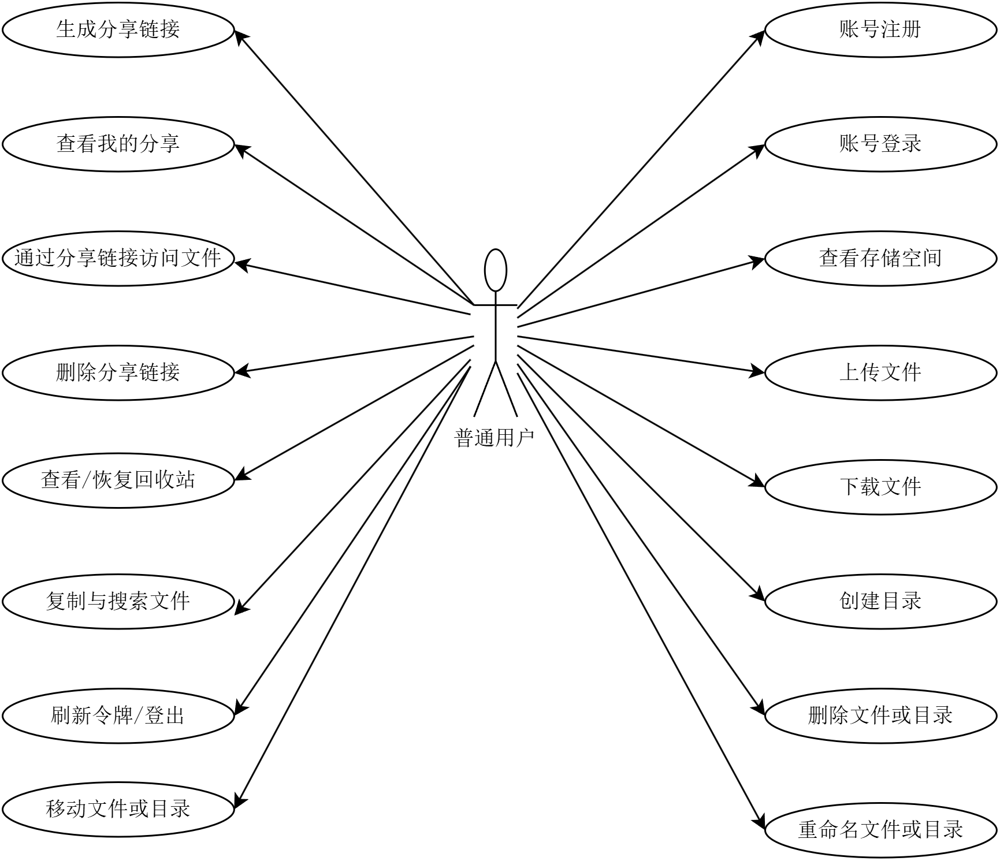

图3-2管理员用例图

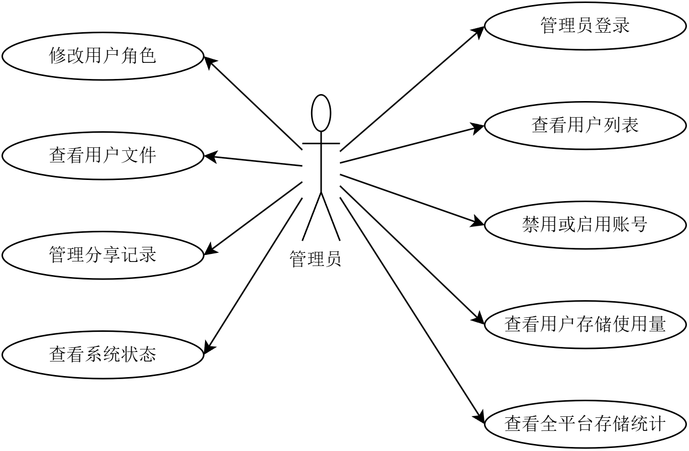

### 3.3系统非功能需求分析

#### 3.3.1系统性能需求分析

系统需适应单机私有化部署环境，并借助Drogon异步I/O处理文件传输。文件列表、目录导航和配额查询应尽快返回；上传和下载采用流式处理控制内存占用。上传任务和分片状态需要持久化，才能在中断后继续补传。

#### 3.3.2系统安全性与可维护性需求分析

系统需要对不同用户的文件资源严格隔离，普通用户只能访问自己名下的文件和目录，不能通过接口越权访问或下载他人文件；管理员接口需要单独鉴权，普通用户令牌无法访问管理员功能。文件分享链接需要使用随机短码、可选访问密码、有效期和短期分享访问令牌共同控制公开访问范围。用户密码必须经过安全哈希后存储，不得以明文形式保存在数据库中。

在可维护性方面，后端按照认证、用户、文件、目录、分享、回收站、管理员、日志和系统状态等模块进行划分，控制器对请求和响应进行处理，业务判断安排在服务层，数据库字段和约束需要保持清晰，以便于后续进行调整。

#### 3.3.3数据字典

该系统的主要业务数据实体包括用户信息、文件正文数据、文件元数据、目录结构信息、上传任务记录、上传分片数据、回收站条目、分享记录、分享文件关联关系和操作日志这十种类型。

用户信息（users）记录账号凭据、个人资料、登录安全状态和存储配额，是登录鉴权、文件归属判断和存储限额控制的依据。主要字段包括用户ID、用户名、邮箱、密码哈希、昵称、头像、存储配额、已用存储、预占用存储、账号状态、角色、失败登录次数、锁定时间、最后登录信息以及创建、更新时间。

文件内容记录物理文件索引，支持秒传去重和内容寻址，字段有内容ID、MD5、SHA256、大小、存储路径、MIME类型、引用计数和创建时间，多个用户文件能够指向同一个内容对象，这样可以防止数据出现重复存储。

文件元数据记录了用户视角下的文件描述，并且不会保存二进制内容，字段包括文件ID、用户ID、内容ID、文件类ID、文件名、大小、MIME类型、路径、收藏标记、下载次数和时间信息，系统会对文件列表、详情和权限进行判断，这些操作会读取该表。

目录信息（folders）维护用户目录树，支撑目录导航和路径组织。字段包括目录ID、用户ID、父目录ID、名称、路径、深度、子项数量和时间信息。父目录ID用于表示目录之间的父子关系。

上传任务（upload_tasks）用于分片上传和断点续传，记录任务状态、目标文件夹、文件名、大小、MD5、分片数量、预占用字节、临时路径和过期时间。上传分片（upload_task_chunks）以任务ID和分片索引作为联合主键，标记已上传分片。

回收站记录记录被软删除文件或目录的恢复信息，字段有记录ID、用户ID、项目类型、原项目ID、名称、大小、内容ID、原文件夹、原路径、数据备份、删除时间和过期时间，系统在对误删项目进行恢复时会读取这些数据，在进行彻底删除时会扣减引用计数，并且按照需要释放物理存储。

分享记录（shares）保存分享ID、短码、分享者、密码哈希、权限、访问和下载次数、状态及过期时间。分享文件关联（share_files）记录分享包含的文件或目录，使一个分享可关联多个项目。

操作日志operation_logs记录上传、下载、删除和分享等主要操作，字段包括用户、操作类型、目标对象、IP地址、客户端信息和创建时间，便于管理员对问题进行排查。

这些数据对象覆盖了系统主要业务信息。

---

## 第4章 系统设计

### 4.1系统架构设计

系统采用后端服务与桌面客户端分离的结构进行设计。后端通过RESTful HTTP接口提供认证、文件、目录、分享、回收站、日志和管理等能力，桌面端使用Qt/QML编写普通用户、访客和管理员界面，并通过统一网络层调用后端接口。该结构可以降低界面层和服务层之间的耦合程度，也便于后端接口脱离客户端进行单独测试。

后端内部划分为客户端接入层、过滤器层、控制器层、服务层、数据存储层，客户端发送HTTP请求，过滤器对JWT鉴权、管理员鉴权、分享令牌鉴权和接口限流进行处理，控制器会对请求进行解析，并且组织响应，服务层主要负责进行认证、用户、文件、目录、分享、回收站、管理员、日志、健康检查、系统信息等业务处理，数据存储层主要包括PostgreSQL、Redis、本地上传暂存和可配置的本地或S3/MinIO最终Blob存储，它们分别用来存放结构化业务数据、短生命周期状态、上传中间产物和内容对象。

### 4.2系统模块设计

系统模块按照用户角色和业务流程来进行划分，普通用户端拥有账号管理、用户中心、文件管理、目录管理、分享管理、回收站管理、存储空间查看等功能，管理员端包括用户管理、存储统计、分享管理、操作日志和系统状态，图4-1和图4-2分别给出了两种端口的功能结构。

图4-1用户端功能结构图

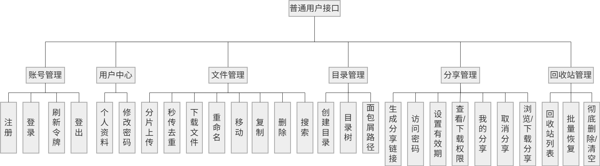

图4-2管理员端功能结构图

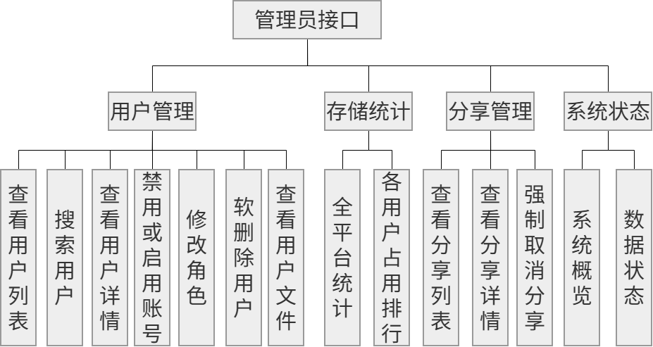

### 4.3系统功能设计

#### 4.3.1用户认证模块设计

用户认证模块对注册、登录、令牌刷新、登出和接口鉴权进行处理，注册过程中，后端会对用户名和邮箱的唯一性进行校验，并利用Argon2id生成密码哈希，同时也会把默认配额写入到数据库中，在用户登录时，服务层会检查账号的状态、锁定时间、密码哈希，认证通过后系统签发令牌并且把令牌写入Redis。

JWT过滤器位于认证模块和业务控制器之间，业务请求在携带访问令牌之后，过滤器会对签名、过期时间和黑名单状态进行验证，然后把用户ID、用户名和角色写入到请求上下文中，管理员接口也要通过管理员鉴权过滤器进行处理，Refresh Token被存储在Redis数据库中，系统在进行刷新时会进行轮换操作，用户在登出时会删除刷新令牌，系统也把当前访问令牌加入黑名单中。

图4-3用户登录与鉴权流程图

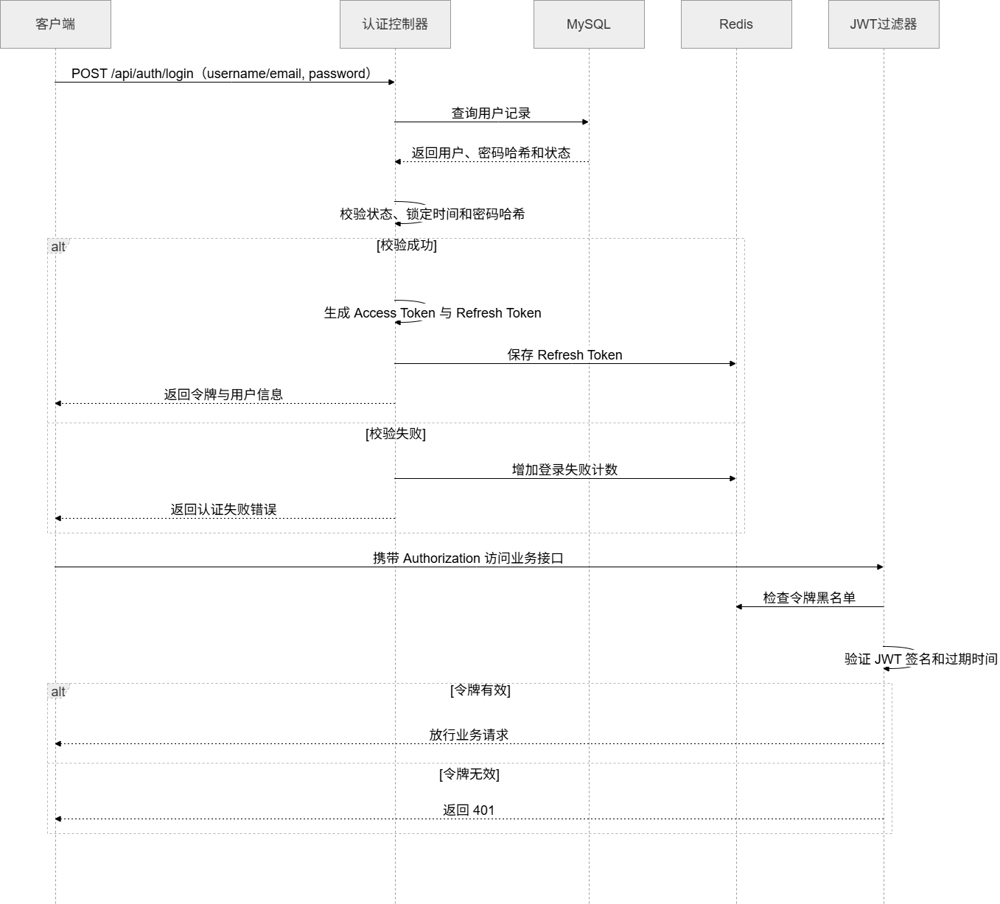

#### 4.3.2文件与目录模块设计

（1）文件管理模块

文件管理模块覆盖普通用户最常用的列表、搜索、上传、下载、重命名、移动、复制和删除等操作。后端由FileController暴露/api/file/* 系列接口，控制器处理请求解析和响应转换，具体业务判断交给FileService完成。

文件列表接口按照用户ID、目录ID、类型筛选、排序字段和分页参数对files与folders表进行查询，然后把当前目录下的文件和文件夹整理成统一列表并返回，搜索功能主要依靠文件名和目录名索引，可以按照关键词、类型和目录范围来进行检索，文件详情接口除了返回元数据，也返回面包屑路径，客户端根据该路径建立导航视图。

文件变更操作主要关注名称、路径和内容引用边界，重命名操作会检查名称长度、非法字符、保留名称和目录冲突，移动目录操作不可以将目标设为自身或子目录，复制文件会对file_contents内容对象进行复用，并且增加引用计数，普通删除只是把记录写入trash表，并且从正常列表里移除，系统在执行彻底删除操作时会减少引用计数并清理物理文件。

（2）目录管理模块

目录管理模块对用户的多级目录进行维护，folders表包括目录名称、父目录ID、完整路径、深度和子项数量，根目录使用parent_id=0表示，在创建目录时，后端先确认父目录归属，再利用唯一约束来防止同级目录出现重名。

目录树接口按照父子关系把目录层级返回，面包屑接口把根目录到指定目录的路径返回，服务层在建立目录树时限制深度以防止异常循环，并且在生成面包屑时检查重复节点，目录删除操作会统一进入回收站流程。

图4-4创建目录流程图

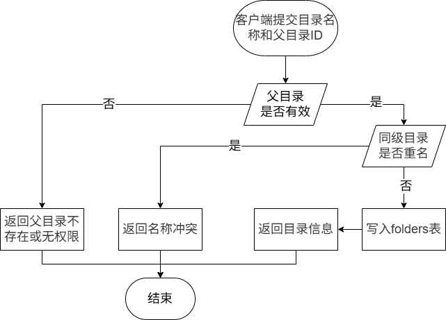

（3）文件上传模块

文件上传使用统一的分片流程，分片大小默认是5MB，包括初始化、分片传输、完成合并和取消这四个阶段，初始化请求会携带文件名、大小、目标目录和MD5信息，后端首先对配额进行检查，然后根据MD5值查询file_contents表，如果系统中已经存在相同内容的对象，服务端会直接建立files记录并把引用计数增加，上传操作在初始化阶段完成，也就是秒传。

若服务器没有对应内容，系统创建upload_tasks记录并预占用空间。客户端按索引上传分片，后端写入暂存后端，并在upload_task_chunks表记录进度。断点续传时，初始化接口返回已上传分片，客户端只补传缺失部分。全部分片完成后，PostgreSQL完成租约选出唯一完成者，AssemblyConcurrencyLimiter只控制该实例的合并并发；后端组装暂存分片、校验哈希，写入file_contents和files表，并释放预占用空间。

图4-5分片上传与秒传流程图

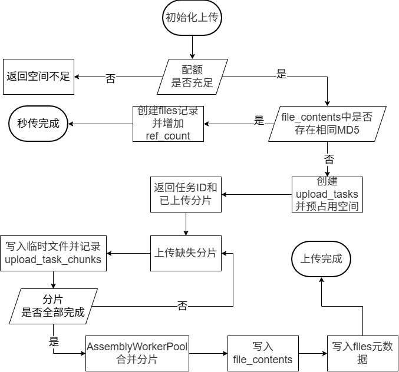

#### 4.3.3分享模块设计

文件分享模块会将用户自己拥有的文件或者目录生成成一个外链，供其他人进行访问，后端在创建分享时会在shares表中记录分享短码、分享者ID、可选访问密码哈希、权限类型、有效期和状态，并且在share_files表中保存被分享文件或目录的关联关系，分享权限包括查看和下载两种，分享状态有有效、取消和过期三种情况。

访客通过短码和可选密码对访问接口进行调用，在公开访问分享时，后端对状态、有效期和密码进行校验，校验成功后会签发短期分享令牌，当用户进行浏览或下载操作时，访客需要把令牌添加到X-Share-Token请求头里，并且由分享鉴权过滤器进行校验，浏览和下载次数会被记录，密码尝试次数则利用Redis进行限制。

图4-6文件分享访问流程图

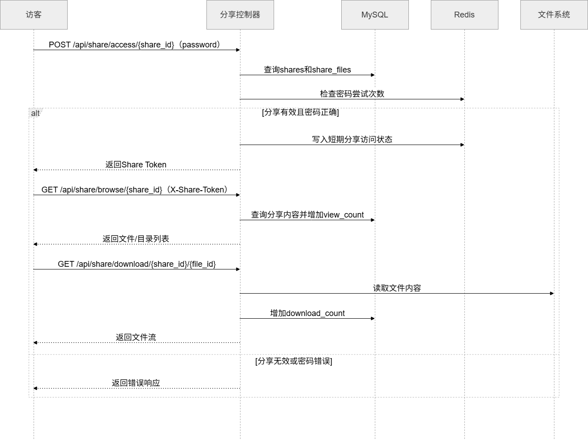

（1）回收站模块

回收站模块可以把误删除所造成的数据丢失风险给降低下来，普通删除不会马上进行物理删除，而是把项目类型、原项目ID、原路径、项目名称、内容ID和完整数据备份写入trash表，用户可以分页查看回收站里的项目，也可以对回收站进行批量恢复、彻底删除或者清空，系统在进行恢复操作时，若原目录不存在，系统将返回到根目录。服务层在名称冲突发生时会生成新的名称，以此来避免覆盖现有的文件，定时清理任务会删除过期的回收站记录和过期的上传任务，这使临时数据不会长时间堆积。

#### 4.3.4管理员与运维模块设计

（1）用户管理模块

管理员用户管理模块通过/api/admin/users系列接口维护账号。管理员可以查看和筛选用户、查看详情和存储使用情况，也可以修改状态、调整角色、设置空间或软删除用户。所有管理员接口都先经过JWT鉴权，再经过管理员角色鉴权。

（2）存储统计与分享管理模块

存储统计模块汇总users、files、file_contents、folders等表，计算全平台用户数、文件数、内容对象数、存储占用以及各用户使用情况。由于系统采用内容寻址和引用计数机制，用户视角下的逻辑文件大小与物理内容占用并不总是一致，统计时需要分开处理。

管理员通过使用分享管理模块来进行相关操作，该模块可以查看全平台分享列表和单个分享详情，并且可以强制取消违规分享，主要用来处理公开链接滥用、误分享和过期分享等情况。

（3）系统状态与日志模块

系统状态模块主要负责部署检查和日常维护工作，它展示了服务的运行时间、版本信息、数据库连接状态、Redis连接情况、磁盘空间使用状况等各项指标，操作日志按照分页方式进行保存，包括了上传、下载、删除、分享等各类操作，方便管理员对异常请求进行排查。

---

### 4.4数据库设计

#### 4.4.1数据库概念结构设计

根据需求分析，系统主要涉及用户、文件内容、文件元数据、目录、上传任务、上传分片、回收站、分享、分享文件关联和操作日志等实体及其关联关系。

Users与Files、Folders、UploadTasks、Trash、Shares和OperationLogs是一对多关系。Files通过content_id关联FileContents，实现内容去重和引用计数；通过folder_id归属于Folders，Folders再通过parent_id形成目录树。UploadTasks与UploadTaskChunks、Shares与ShareFiles也都是一对多关系。Trash保存软删除项目的恢复信息。

为避免字段和关系过于集中，本文把概念结构拆成实体图和系统ER图两部分：图4-7展示核心实体及属性，图4-8展示实体关联。

图4-7数据库实体图

用户实体USERS主要保存系统用户的基础账号信息，包括用户名、邮箱、密码哈希、昵称、头像、存储配额、已用空间、账号状态、角色、创建和更新时间等，这些数据构成了系统进行认证、权限判断和容量控制的主要基础。

图4-7(a)用户表ER图

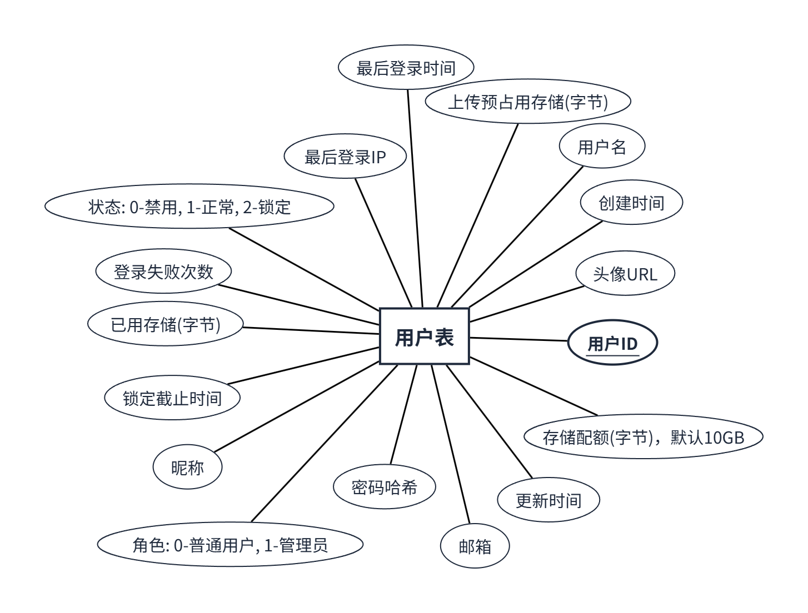

文件内容实体（FILE_CONTENTS）记录真实物理文件的内容索引，通过MD5、SHA256、文件大小和存储路径标识文件内容，再通过引用计数支持秒传、去重和物理文件释放。

图4-7(b)文件内容表ER图

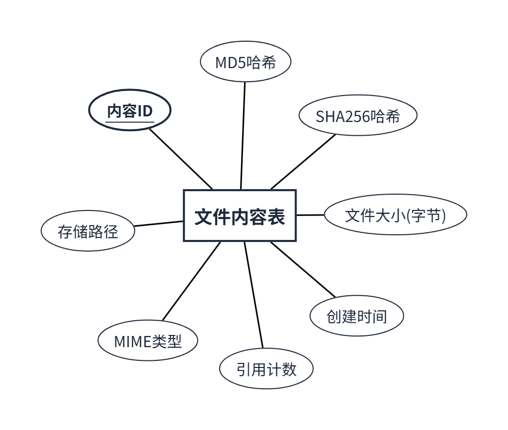

文件实体记录用户角度下的文件元数据，内容包括所属用户、所在文件夹、关联内容对象、文件名、大小、类型、路径、收藏状态和下载次数等信息。

图4-7(c)文件表ER图

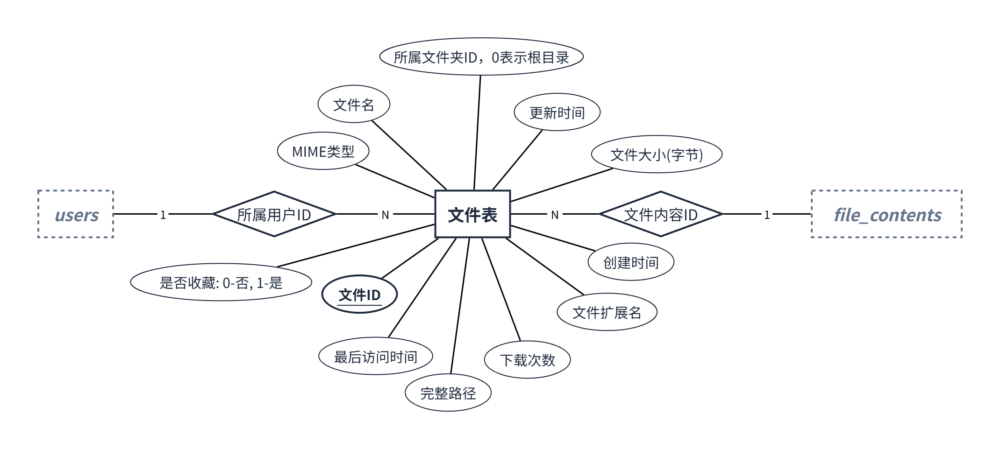

文件夹实体（FOLDERS）用于保存用户的目录结构信息，通过父目录字段形成多级目录树，并记录文件夹名称、完整路径、层级深度和子项数量等数据。

图4-7(d)文件夹表ER图

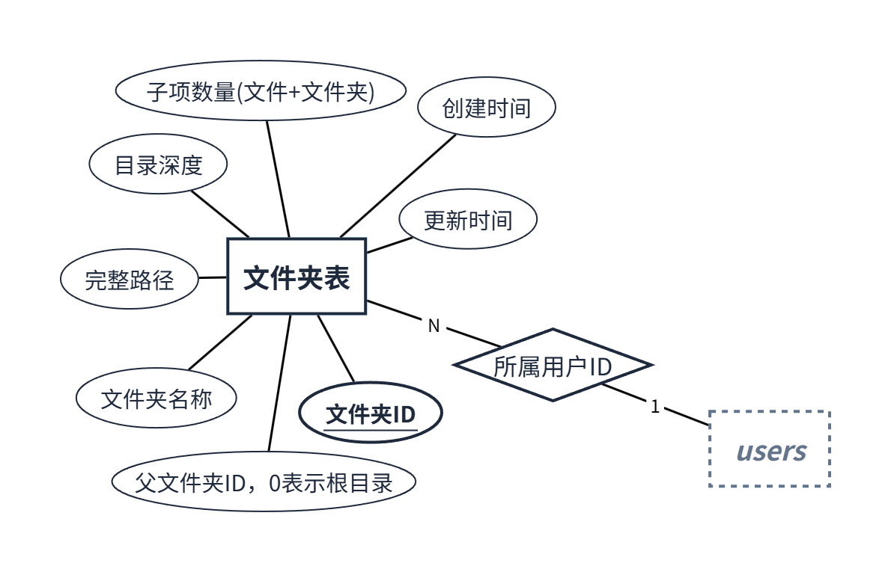

上传任务实体（UPLOAD_TASKS）记录分片上传任务的整体状态，包括上传用户、目标文件夹、文件名、文件大小、文件哈希、分片大小、总分片数、任务状态、过期时间等信息。

图4-7(e)上传任务表ER图

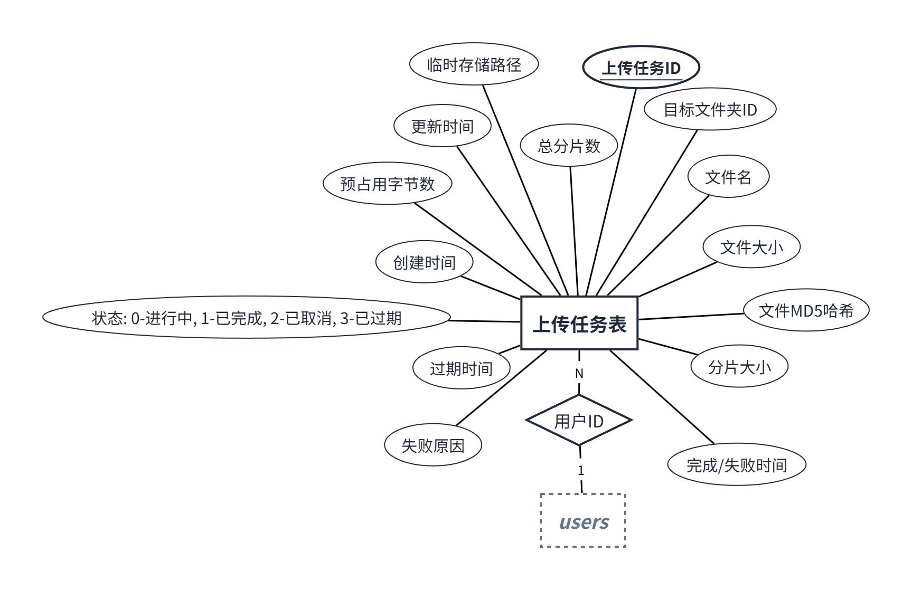

上传分片实体（UPLOAD_TASK_CHUNKS）记录上传任务中已经完成的分片，任务ID和分片编号共同确定唯一分片，为断点续传和进度恢复提供依据。

图4-7(f)上传任务分片表ER图

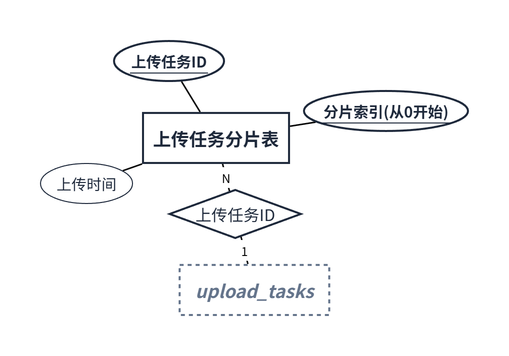

回收站实体（TRASH）记录被软删除的文件或文件夹信息，包括删除项目的类型、原始ID、名称、内容引用、原文件夹位置、删除时间、过期清理时间等。

图4-7(g)回收站表ER图

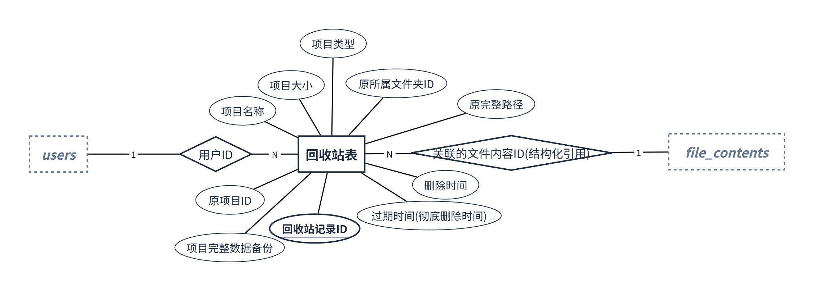

分享实体（SHARES）用于保存用户创建的分享链接信息，包括分享码、分享者、访问密码哈希、权限类型、浏览次数、下载次数、分享状态和有效期等。

图4-7(h)分享表ER图

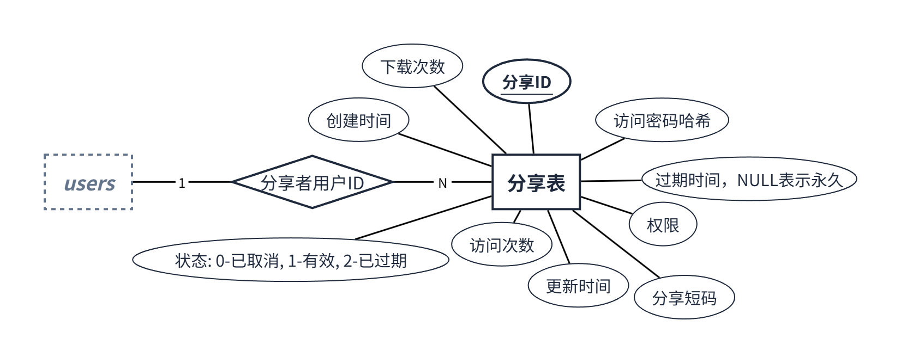

分享文件关联实体（SHARE_FILES）用于保存分享与文件或文件夹之间的关联关系，使一个分享可以包含一个或多个文件或目录。

图4-7(i)分享文件关联表ER图

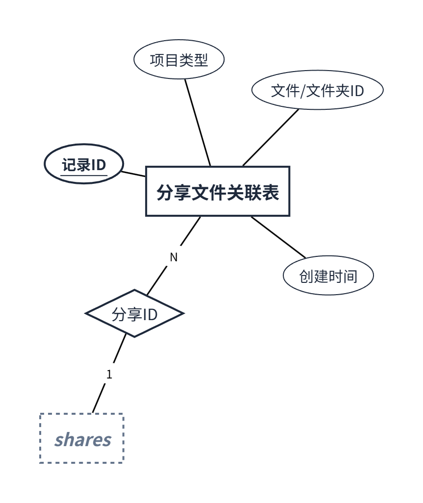

操作日志实体OPERATION_LOGS主要用来保存用户关键操作记录，其中包括操作用户、操作类型、目标对象、目标名称、详细信息、IP地址和操作时间，该实体可以用于进行审计、排查和统计工作。

图4-7(j)操作日志表ER图

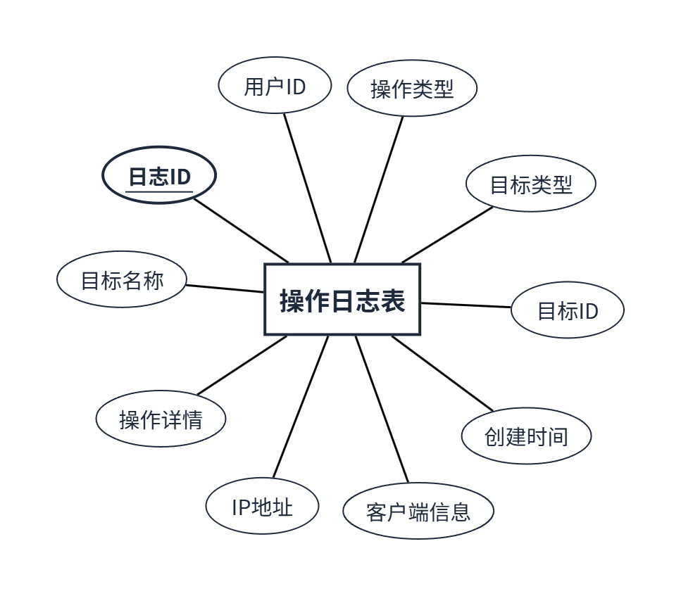

图4-8系统ER关系图

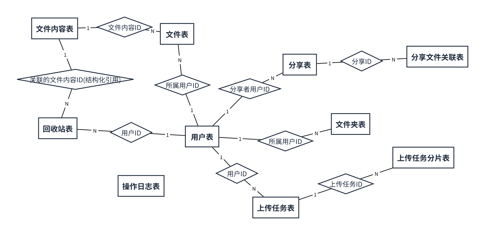

#### 4.4.2数据库逻辑结构设计

逻辑结构设计阶段需要将概念模型转换为关系模型。结合系统当前实现，核心数据关系如下。

1.用户表(用户ID, 登录用户名, 用户邮箱, 密码哈希, 用户昵称, 头像URL, 存储配额上限, 已用存储空间, 上传预占用空间, 账号状态, 用户角色, 登录失败次数, 锁定截止时间, 最后登录时间, 最后登录IP, 创建时间, 更新时间)
2.文件内容表(内容ID, MD5哈希, SHA256哈希, 文件大小, 内容寻址存储路径, MIME类型, 引用计数, 创建时间)
3.文件表(文件ID, 所属用户ID, 关联内容ID, 所属文件夹ID, 文件名, 文件扩展名, 文件大小, MIME类型, 完整路径, 是否收藏, 下载次数, 最后访问时间, 创建时间, 更新时间)
4.文件夹表(文件夹ID, 所属用户ID, 父文件夹ID, 文件夹名称, 完整路径, 目录深度, 子项数量, 创建时间, 更新时间)
5.上传任务表(上传任务ID, 上传用户ID, 目标文件夹ID, 目标文件名, 文件大小, 文件MD5, 分片大小, 总分片数, 预占用空间, 临时存储路径, 任务状态, 过期时间, 完成或失败时间, 失败原因, 创建时间, 更新时间)
6.上传任务分片表(上传任务ID, 分片索引, 上传时间)
7.回收站表(回收站记录ID, 用户ID, 项目类型, 原项目ID, 项目名称, 项目大小, 关联文件内容ID, 原所属文件夹ID, 原完整路径, 项目完整数据备份, 删除时间, 过期彻底删除时间)
8.分享表(分享ID, 分享短码, 分享者用户ID, 访问密码哈希, 分享权限, 浏览次数, 下载次数, 分享状态, 过期时间, 创建时间, 更新时间)
9.分享文件关联表(关联记录ID, 分享ID, 项目类型, 文件或文件夹ID, 创建时间)
10.操作日志表(日志ID, 用户ID, 操作类型, 目标类型, 目标ID, 目标名称, 操作详情, IP地址, 客户端信息, 创建时间)

系统各业务表通过主键和外键建立关联，用于保证数据组织的规范性，并支持后续业务查询、统计分析和状态维护。

#### 4.4.3数据库物理结构设计

在逻辑结构设计的基础上，针对各表的字段数据类型、约束规则和索引策略进行具体设计，以保证数据完整性和常见查询场景下的访问效率。

1.用户表（users）

表4-1用户表

| 字段名           | 数据类型        | 主键/约束      | 字段说明              |
| ---------------- | --------------- | -------------- | --------------------- |
| id               | BIGINT UNSIGNED | 主键，自增     | 用户主键ID            |
| username         | VARCHAR(32)     | 唯一，非空     | 登录用户名            |
| email            | VARCHAR(128)    | 唯一，非空     | 用户邮箱              |
| password_hash    | VARCHAR(255)    | 非空           | Argon2id哈希后的密码 |
| nickname         | VARCHAR(64)     | 可空           | 用户昵称              |
| avatar           | VARCHAR(512)    | 可空           | 头像URL              |
| storage_quota    | BIGINT UNSIGNED | 非空，默认10GB | 存储配额上限          |
| storage_used     | BIGINT UNSIGNED | 非空，默认0    | 已用存储空间          |
| storage_reserved | BIGINT UNSIGNED | 非空，默认0    | 上传预占用空间        |
| status           | TINYINT         | 非空，默认1    | 0禁用、1正常、2锁定   |
| role             | TINYINT         | 非空，默认0    | 0普通用户、1管理员    |
| login_attempts   | INT             | 非空，默认0    | 登录失败次数          |
| locked_until     | DATETIME        | 可空           | 锁定截止时间          |
| last_login_at    | DATETIME        | 可空           | 最后登录时间          |
| last_login_ip    | VARCHAR(45)     | 可空           | 最后登录IP           |
| created_at       | DATETIME        | 非空           | 创建时间              |
| updated_at       | DATETIME        | 非空           | 更新时间              |

2.文件内容表（file_contents）

表4-2文件内容表

| 字段名       | 数据类型        | 主键/约束      | 字段说明         |
| ------------ | --------------- | -------------- | ---------------- |
| id           | BIGINT UNSIGNED | 主键，自增     | 内容主键ID       |
| hash_md5     | CHAR(32)        | 联合唯一，非空 | MD5哈希         |
| hash_sha256  | CHAR(64)        | 联合唯一，非空 | SHA256哈希      |
| size         | BIGINT UNSIGNED | 非空           | 文件大小         |
| storage_path | VARCHAR(512)    | 非空           | 内容寻址存储路径 |
| mime_type    | VARCHAR(128)    | 可空           | MIME类型        |
| ref_count    | INT UNSIGNED    | 非空，默认1    | 引用计数         |
| created_at   | DATETIME        | 非空           | 创建时间         |

3.文件表（files）

表4-3文件表

| 字段名           | 数据类型        | 主键/约束   | 字段说明                  |
| ---------------- | --------------- | ----------- | ------------------------- |
| id               | BIGINT UNSIGNED | 主键，自增  | 文件主键ID                |
| user_id          | BIGINT UNSIGNED | 外键，非空  | 所属用户ID                |
| content_id       | BIGINT UNSIGNED | 外键，非空  | 关联文件内容ID            |
| folder_id        | BIGINT UNSIGNED | 非空，默认0 | 所属文件夹ID，0表示根目录 |
| name             | VARCHAR(255)    | 非空        | 文件名                    |
| extension        | VARCHAR(32)     | 可空        | 文件扩展名                |
| size             | BIGINT UNSIGNED | 非空        | 文件大小                  |
| mime_type        | VARCHAR(128)    | 可空        | MIME类型                 |
| path             | VARCHAR(4096)   | 非空        | 完整路径                  |
| is_favorite      | TINYINT         | 非空，默认0 | 是否收藏                  |
| download_count   | INT UNSIGNED    | 非空，默认0 | 下载次数                  |
| last_accessed_at | DATETIME        | 可空        | 最后访问时间              |
| created_at       | DATETIME        | 非空        | 创建时间                  |
| updated_at       | DATETIME        | 非空        | 更新时间                  |

索引说明：files表在(user_id, folder_id)及排序字段组合上建立联合索引，并在name字段建立全文索引，以支持分页列表、排序和搜索。

4.文件夹表（folders）

表4-4文件夹表

| 字段名     | 数据类型        | 主键/约束   | 字段说明                |
| ---------- | --------------- | ----------- | ----------------------- |
| id         | BIGINT UNSIGNED | 主键，自增  | 文件夹ID                |
| user_id    | BIGINT UNSIGNED | 外键，非空  | 所属用户ID              |
| parent_id  | BIGINT UNSIGNED | 非空，默认0 | 父文件夹ID，0表示根目录 |
| name       | VARCHAR(255)    | 非空        | 文件夹名称              |
| path       | VARCHAR(4096)   | 非空        | 完整路径                |
| depth      | INT UNSIGNED    | 非空，默认0 | 目录深度                |
| item_count | INT UNSIGNED    | 非空，默认0 | 子项数量                |
| created_at | DATETIME        | 非空        | 创建时间                |
| updated_at | DATETIME        | 非空        | 更新时间                |

索引说明：folders表通过(user_id, parent_id, name)唯一约束保证同一用户同一父目录下文件夹名称不重复，并通过父目录索引加速目录树查询。

5.上传任务表（upload_tasks）与上传任务分片表（upload_task_chunks）

表4-5上传任务表

| 字段名         | 数据类型        | 主键/约束   | 字段说明                     |
| -------------- | --------------- | ----------- | ---------------------------- |
| id             | VARCHAR(64)     | 主键        | 上传任务ID                   |
| user_id        | BIGINT UNSIGNED | 外键，非空  | 上传用户ID                   |
| folder_id      | BIGINT UNSIGNED | 非空，默认0 | 目标文件夹ID                 |
| filename       | VARCHAR(255)    | 非空        | 目标文件名                   |
| file_size      | BIGINT UNSIGNED | 非空        | 文件大小                     |
| file_hash      | CHAR(32)        | 非空        | 文件MD5                     |
| chunk_size     | INT UNSIGNED    | 非空        | 分片大小                     |
| total_chunks   | INT UNSIGNED    | 非空        | 总分片数                     |
| reserved_bytes | BIGINT UNSIGNED | 非空，默认0 | 预占用空间                   |
| temp_path      | VARCHAR(512)    | 非空        | 临时存储路径                 |
| status         | TINYINT         | 非空，默认0 | 0进行中、1完成、2取消、3过期 |
| expires_at     | DATETIME        | 非空        | 过期时间                     |
| finalized_at   | DATETIME        | 可空        | 完成或失败时间               |
| fail_reason    | VARCHAR(512)    | 可空        | 失败原因                     |
| created_at     | DATETIME        | 非空        | 创建时间                     |
| updated_at     | DATETIME        | 非空        | 更新时间                     |

表4-6上传任务分片表

| 字段名      | 数据类型     | 主键/约束      | 字段说明   |
| ----------- | ------------ | -------------- | ---------- |
| task_id     | VARCHAR(64)  | 联合主键，外键 | 上传任务ID |
| chunk_index | INT UNSIGNED | 联合主键       | 分片索引   |
| uploaded_at | DATETIME     | 非空           | 上传时间   |

6.回收站表（trash）

表4-7回收站表

| 字段名             | 数据类型              | 主键/约束   | 字段说明         |
| ------------------ | --------------------- | ----------- | ---------------- |
| id                 | BIGINT UNSIGNED       | 主键，自增  | 回收站记录ID     |
| user_id            | BIGINT UNSIGNED       | 外键，非空  | 用户ID           |
| item_type          | ENUM('file','folder') | 非空        | 项目类型         |
| item_id            | BIGINT UNSIGNED       | 非空        | 原项目ID         |
| item_name          | VARCHAR(255)          | 非空        | 项目名称         |
| item_size          | BIGINT UNSIGNED       | 非空，默认0 | 项目大小         |
| content_id         | BIGINT UNSIGNED       | 外键，可空  | 关联文件内容ID   |
| original_folder_id | BIGINT UNSIGNED       | 非空，默认0 | 原所属文件夹ID   |
| original_path      | VARCHAR(4096)         | 非空        | 原完整路径       |
| item_data          | JSON                  | 可空        | 项目完整数据备份 |
| deleted_at         | DATETIME              | 非空        | 删除时间         |
| expires_at         | DATETIME              | 非空        | 过期彻底删除时间 |

7.分享表（shares）与分享文件关联表（share_files）

表4-8分享表

| 字段名         | 数据类型                | 主键/约束          | 字段说明            |
| -------------- | ----------------------- | ------------------ | ------------------- |
| id             | BIGINT UNSIGNED         | 主键，自增         | 分享ID              |
| share_code     | VARCHAR(32)             | 唯一，非空         | 分享短码            |
| user_id        | BIGINT UNSIGNED         | 外键，非空         | 分享者用户ID        |
| password_hash  | VARCHAR(255)            | 可空               | 访问密码哈希        |
| permission     | ENUM('view','download') | 非空，默认download | 分享权限            |
| view_count     | INT UNSIGNED            | 非空，默认0        | 浏览次数            |
| download_count | INT UNSIGNED            | 非空，默认0        | 下载次数            |
| status         | TINYINT                 | 非空，默认1        | 0取消、1有效、2过期 |
| expires_at     | DATETIME                | 可空               | 过期时间            |
| created_at     | DATETIME                | 非空               | 创建时间            |
| updated_at     | DATETIME                | 非空               | 更新时间            |

表4-9分享文件关联表

| 字段名     | 数据类型              | 主键/约束  | 字段说明       |
| ---------- | --------------------- | ---------- | -------------- |
| id         | BIGINT UNSIGNED       | 主键，自增 | 关联记录ID     |
| share_id   | BIGINT UNSIGNED       | 外键，非空 | 分享ID         |
| item_type  | ENUM('file','folder') | 非空       | 项目类型       |
| item_id    | BIGINT UNSIGNED       | 非空       | 文件或文件夹ID |
| created_at | DATETIME              | 非空       | 创建时间       |

8.操作日志表（operation_logs）

表4-10操作日志表

| 字段名      | 数据类型        | 主键/约束  | 字段说明   |
| ----------- | --------------- | ---------- | ---------- |
| id          | BIGINT UNSIGNED | 主键，自增 | 日志ID     |
| user_id     | BIGINT UNSIGNED | 非空       | 用户ID     |
| action      | VARCHAR(32)     | 非空       | 操作类型   |
| target_type | VARCHAR(32)     | 可空       | 目标类型   |
| target_id   | BIGINT UNSIGNED | 可空       | 目标ID     |
| target_name | VARCHAR(255)    | 可空       | 目标名称   |
| details     | JSON            | 可空       | 操作详情   |
| ip_address  | VARCHAR(45)     | 非空       | IP地址    |
| user_agent  | VARCHAR(512)    | 可空       | 客户端信息 |
| created_at  | DATETIME        | 非空       | 创建时间   |

以上十张数据表构成系统主要业务数据的物理结构，包括字段类型、约束规则和索引设置。索引主要面向文件列表、目录导航、内容哈希查重、断点续传、回收站恢复、分享访问和操作审计等场景。

---

## 第5章 系统实现

本文结合实际项目代码，对系统的具体实现过程进行说明，后端使用分层架构模式，将功能划分为控制器、过滤器、服务层、数据模型和存储抽象这五个模块，控制器主要负责路由请求的分发和响应结果的格式转换，服务层则承担着业务规则校验、数据库事务管理和Redis状态维护的主要职能，桌面端搭建了AuthShell、OwnerShell、VisitorShell、AdminShell四类外壳组件，分别适配登录流程、普通用户操作、访客内容分享、管理员后台管理四类不同的应用场景。

### 5.1用户与认证模块功能实现

（1）注册与登录实现

账号注册和登录接口由AuthController提供，具体判断由AuthService进行完成，在注册过程中，DTO会对用户名、邮箱和密码格式进行检查，服务层确认该数据未被占用后，使用Argon2id算法生成密码哈希，并将默认资料、配额、状态和角色等信息写入数据库。

登录接口可以支持用户名或者邮箱，服务层在读取账号状态、锁定时间和密码哈希之后逐项进行判断，当账号处于禁用、锁定或密码错误的状态时，系统会返回相应的结果，认证成功后系统会重置失败计数，同时签发Access Token和Refresh Token，并且把用户信息返回给客户端，客户端在保存会话之后，按照角色切换到普通用户或者管理员界面。

图5-1 用户登录功能截图

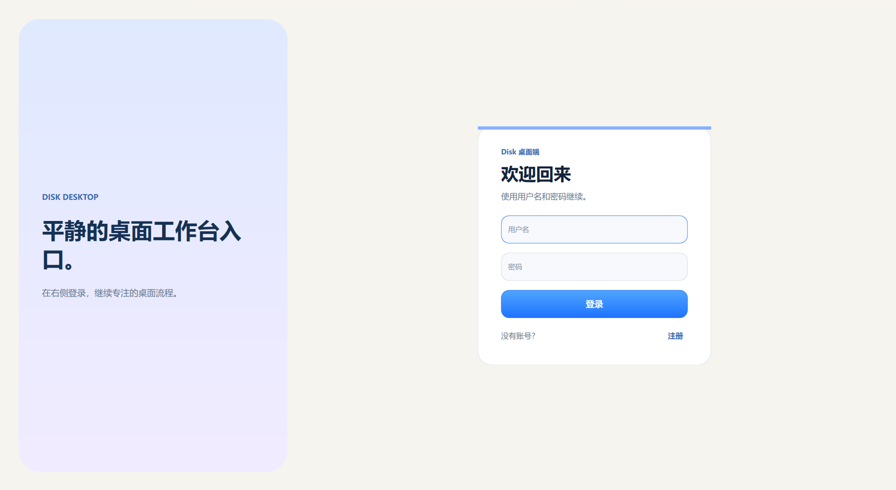

图5-1对应用户登录页面。用户提交账号和密码后，LoginRequest DTO检查JSON格式，AuthService查询users表并判断账号状态、锁定时间和密码哈希。认证通过后，后端签发令牌，客户端保存会话并按角色进入对应界面。

图5-2 用户注册功能截图

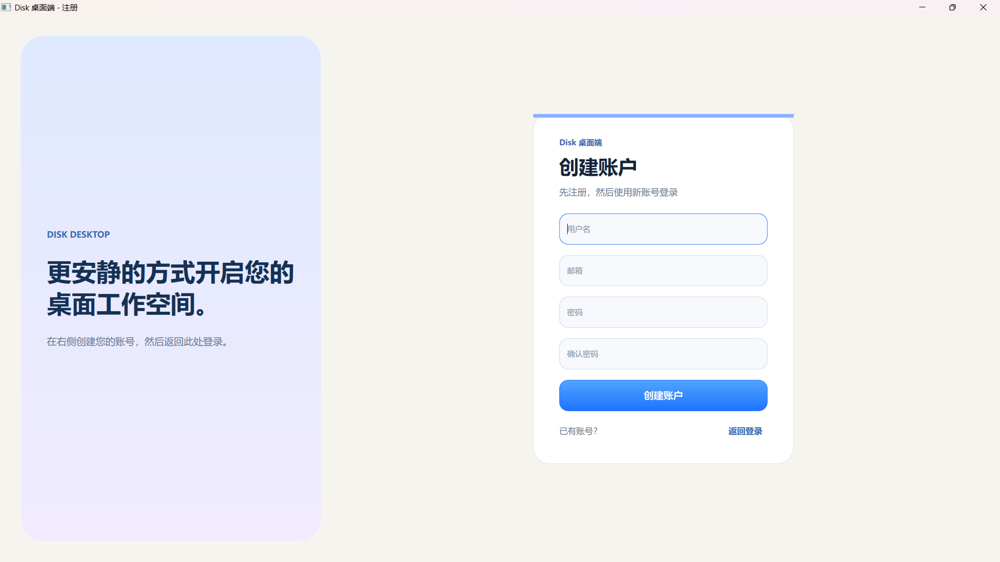

图5-2对应用户注册页面。用户提交用户名、邮箱和密码后，RegisterRequest DTO检查参数，AuthService确认用户名和邮箱是否已存在。校验通过后，服务层生成Argon2id密码哈希并写入默认配额。

（2）令牌生命周期与鉴权过滤

令牌逻辑集中在TokenService中。Access Token采用JWT格式，携带用户ID、用户名、角色和过期时间；普通业务接口通过JwtAuthFilter校验Authorization请求头。Refresh Token保存在Redis中，用于续期；用户登出时，系统删除刷新令牌并把访问令牌加入黑名单。

不同访问边界使用不同过滤器。管理员接口在JWT校验后还要经过AdminAuthFilter，只有管理员角色可以访问/api/admin/* 路由；公开分享的浏览和下载接口使用ShareAuthFilter校验X-Share-Token，避免访客流程与登录用户JWT混在一起。桌面端网络层由RequestFactory按请求类型附加用户令牌、分享令牌或两者组合，请求来源也更容易区分。

（3）个人资料、密码与存储空间实现

用户中心由UserController和UserService实现，包括资料查询、资料更新、密码修改和空间查看。资料更新接口只修改请求中传入的字段；密码修改接口要求提交当前密码，校验通过后重新生成Argon2id哈希并更新users.password_hash。

存储空间接口读取users表中的storage_quota、storage_used和storage_reserved字段，并结合文件数、目录数返回已用空间、预占用空间、剩余配额和资源数量。桌面端SettingsPage和ProfileManager负责加载这些数据；用户修改资料或密码后，页面根据接口结果给出提示。

图5-3 个人资料与存储空间功能截图

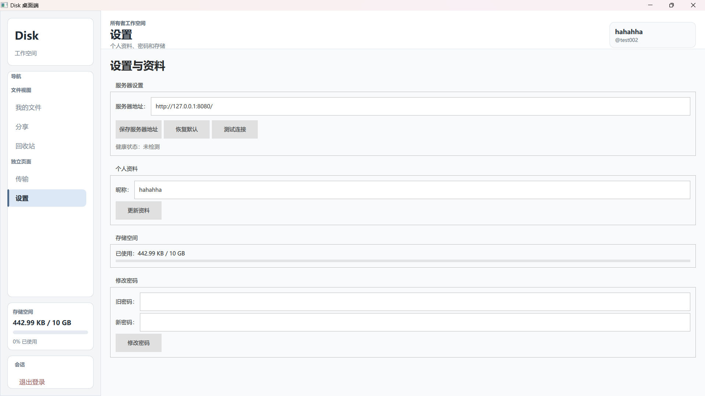

图5-3展示个人设置页面，其中包含资料修改、密码修改和空间查看。资料接口读取或更新users表中的昵称、头像等字段；空间区域展示配额、已用空间、预占用空间、文件数、目录数和剩余容量。

### 5.2文件传输模块功能实现

（1）分片上传初始化与秒传判断

文件上传由FileController提供初始化、上传分片、完成上传和取消上传接口，主要路径包括/api/file/upload/init、/api/file/upload/chunk和/api/file/upload/complete等。控制器绑定路由、HTTP方法和过滤器，上传接口接入JWT鉴权和限流过滤器，并用co_await等待服务层逻辑。

客户端选择文件后，TransferManager提交文件名、文件大小、目标目录和文件MD5。初始化阶段先检查用户配额，如果当前已用空间加上预占用空间已经超过配额上限，服务端直接返回空间不足，客户端不再继续上传分片。

初始化阶段也会依据文件哈希对file_contents表进行查询，当系统检测到相同内容对象时，服务层会直接生成files元数据并把引用计数增加，接着返回秒传结果，如果内容不存在，那么系统会创建upload_tasks记录，并且写入任务ID、目标目录、文件信息、分片信息、临时路径、预占用字节数、过期时间，同时系统会返回已经上传的分片列表。

（2）分片写入、断点续传与后台合并

分片上传接口按照任务ID和分片索引接收二进制内容。Drogon把请求体封装在HttpRequest对象中，控制器可以直接读取request->body()取得application/octet-stream数据，不需要再进行JSON封装。服务层随后检查任务归属和任务状态，确认无误后把分片写入临时目录，并在upload_task_chunks表中记录对应索引。

大文件被拆分成固定分片后，单次请求只处理部分数据，服务端内存峰值更容易得到控制，客户端在进行恢复上传时会再次调用初始化接口，获取到已上传的分片索引之后，仅对缺失分片进行补传，断点续传依靠上传任务表和分片记录表来共同进行支撑。

客户端在完成全部分片上传操作后会调用完成接口，后端先通过PostgreSQL条件更新和有期限租约取得唯一完成权，再使用不保存upload_id的AssemblyConcurrencyLimiter限制本机合并数量，并按照索引读取暂存分片，在生成完整文件后计算MD5和SHA256，并同初始化哈希进行比对。校验通过后，BlobStore把组装结果提升为内容寻址的S3/MinIO对象，服务层接着在同一数据库事务中写入file_contents和files表、把预占用空间转为已用空间；数据库提交失败时保留可供幂等重试或对账的候选Blob。当取消上传或任务过期时，系统由持久清理任务删除暂存分片，并且恢复任务状态和预占用空间。

（3）文件下载与Range断点下载

文件下载流程分为下载信息查询和文件流返回两个步骤。第一步向客户端返回文件名、大小和MIME类型等信息；第二步检查文件归属，确认当前用户具有访问权限后，由BlobStore按描述符打开本地文件或S3对象范围流，再交给DownloadResponder构造HTTP响应。

大文件下载时，不能把完整文件一次性加载到内存中。下载接口使用Drogon的HttpResponse::newStreamResponse实现流式返回，回调函数按固定块大小读取文件，再写入响应缓冲区。这样处理后，内存占用能够保持在相对稳定的范围内，服务端在发送文件的同时也可以继续处理其他连接。

请求头包含Range字段时，后端解析字节范围，只返回对应内容，并设置206 Partial Content、Content-Range、Accept-Ranges和Content-Length等响应头。范围超过文件大小时返回416。普通下载、断点续传和非法Range响应共用流式构造逻辑；桌面端由TransferManager和DownloadTaskModel管理下载进度、状态和失败原因。

（4）传输中心实现

TransferCenterPage实现了传输中心，它和文件列表页面是分开的，上传任务保存文件名、目标目录、已上传字节数、总字节数、状态和错误信息，下载任务会记录本地路径、进度、暂停状态、完成状态，处理完毕后，虽然上传或者下载所花费的时间比较长，用户仍然可以继续对文件进行浏览、对目录进行切换或者对其他操作进行处理，不需要一直停留在文件列表页面上等待任务完成。

图5-4 传输中心功能截图

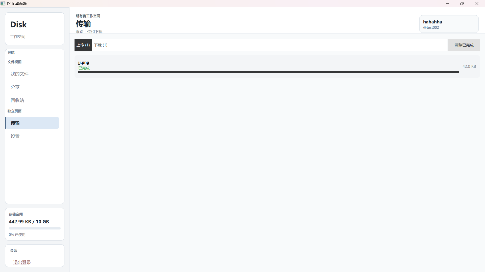

图5-4展示了传输中心的界面，TransferManager负责对上传和下载任务进行维护，并且会在页面中进行分栏显示，任务的进度、状态、失败原因会随接口结果进行更新，传输当中的任务可以被取消、暂停或者继续。

### 5.3文件与目录管理模块功能实现

（1）文件列表与资源管理器实现

普通用户的大部分文件操作从DriveBrowserPage进入。OwnerShell加载后，页面划分为“我的网盘”“分享”和“回收站”；“我的网盘”由DriveMyFilesView承载文件列表，工具栏和右键菜单提供刷新、上传、下载、新建文件夹、重命名、移动、复制、分享和删除等入口。后端由FileService查询files和folders，并整理成统一列表项返回。

DriveManager保存当前目录ID、列表模型、排序方式、选择状态和加载状态，根目录使用ID0来表示，用户在切换目录的过程中，页面不需要进行重建操作，系统只更新目录ID和列表数据，若请求出现失败或列表处于空状态，界面将显示出对应的提示信息，并且让用户可以进行重新加载，后端查询过程一直包括用户ID权限边界，普通用户虽然可以构造其他目录ID，但也不能越权读取他人文件。

图5-5 我的网盘文件列表功能截图

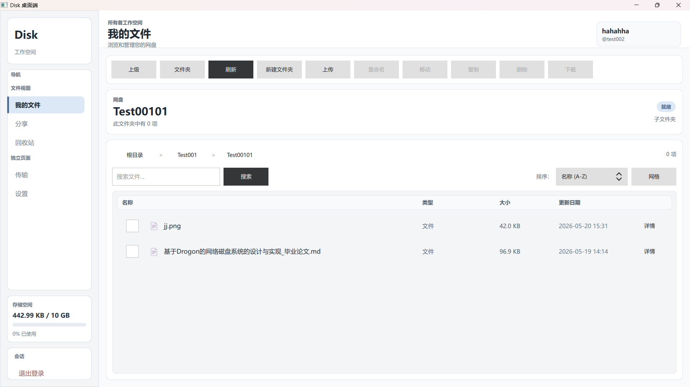

图5-5展示普通用户文件列表界面，中间区域显示当前目录里的内容，顶部工具栏和右键菜单包括上传、下载、新建文件夹、分享和删除等操作入口，DriveManager主要对当前目录进行维护，并且管理排序方式和选中项。

（2）目录树与面包屑导航实现

FolderController和FolderService负责实现目录相关接口，这些接口包括创建目录、目录树查询、面包屑查询和目录重命名功能，在创建目录的过程中，服务层会确认父目录所属的范围，并对同级重名情况进行检查，系统将数据写入folders表中，计算出路径和深度，同时更新父目录的子项数量。

目录树依据folders.parent_id进行组织，在建立过程中，服务层会对最大深度进行限制，并且对异常循环进行检测，面包屑路径会从当前目录逐级回溯至根目录来生成，桌面端左侧显示出目录树，顶部显示当前位置，用户点击节点后，文件列表会同步进行刷新。

图5-6 目录树与面包屑导航功能截图

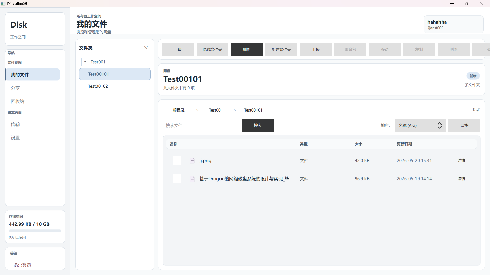

图5-6为目录树和面包屑导航界面。目录树来自folders表中的父子关系，面包屑来自当前目录的父级回溯结果。用户点击目录树节点或面包屑节点后，文件列表切换到新的目录。

（3）重命名、移动、复制和搜索实现

重命名操作分别对files或folders中的名称和路径进行更新，服务层在写入之前会对名称的长度、非法字符、保留名称、同级重名进行检查，移动接口可以支持批量文件和目录的移动，移动目录时要对目标目录进行额外判断，不可以将目录移到自身或其子目录下，否则会破坏目录树结构，复制文件时系统仅新增逻辑文件记录并增加file_contents.ref_count，物理内容不会进行重复复制。

搜索接口依据关键词、项目类型和目录范围来返回分页结果，桌面端对关键词和排序方式进行保存，用户在输入后，DriveManager会向后端请求数据并且刷新列表，当用户进行批量移动、复制、删除和分享操作时，客户端会提交多个项目ID，后端会依次对各个项目进行处理，然后返回结果，界面随后显示成功状态或失败原因。

图5-7 文件搜索与批量操作功能截图

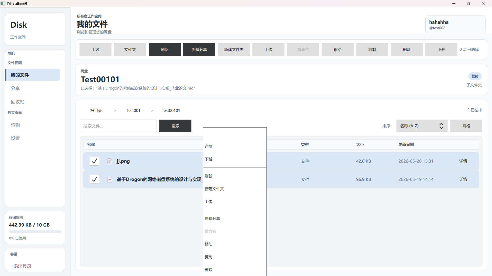

图5-7为文件搜索和批量操作界面。页面提供关键词输入、结果列表、多选状态和批量操作入口，后端按照搜索条件返回文件与目录分页结果，客户端再根据每个项目的处理结果更新提示信息。

### 5.4回收站模块功能实现

回收站功能依靠TrashController和TrashService这两个模块共同来进行实现，用户在进行常规删除操作时，系统并不会立刻释放对应的存储空间，而是先把待删除对象的类型、原始ID、名称、所属父目录、完整存储路径、占用空间、内容关联标识、必需的JSON备份数据写入trash数据表，然后把该对象从正常的文件、目录索引列表中移除。桌面端通过使用DriveTrashView组件来对trash表中的全部记录进行加载，用户能够勾选多个对象以进行恢复或永久删除操作，也能够选择一键清空当前账号下的全部回收站内容。

图5-8 回收站管理功能截图

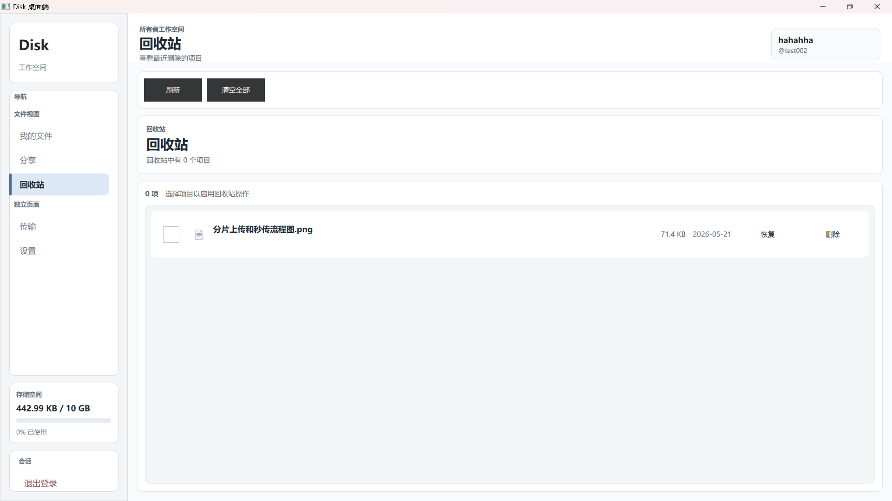

图5-8为回收站界面。列表中保留已删除项目的名称、路径、大小和删除时间，操作区提供恢复、彻底删除和清空入口。

系统在执行恢复操作时，服务层首先会对回收站记录进行确认，看其是否属于当前用户，如果原父目录仍然存在，项目会被优先恢复到原位置，如果原目录已经不存在，系统会把项目恢复到根目录，若目标目录内有同名项目，服务层会自动生成name(n).ext或name(n)形式的新名称，从而避免覆盖已有数据，该版本在恢复文件夹时使用了比较保守的方法，只对文件夹记录进行恢复，没有对子树进行递归恢复。

删除物理内容会影响到文件，对于文件项目，服务层会先对file_contents.ref_count进行扣减，在该值归零后，由iFileStorage对本地内容寻址文件进行删除，并对已用空间进行更新，在清空回收站时，系统会批量执行相同的过程，后台清理服务会定期对过期记录进行处理。

### 5.5分享模块功能实现

（1）分享创建与所有者管理

ShareController和ShareService共同实现了分享功能，所有者侧接口拥有创建分享、我的分享列表、详情查看、设置更新和取消分享等功能，用户在选择文件或目录之后，可以对有效期、访问密码和权限进行设置，服务层生成分享短码之后，会将其写入Shares表，并且把被分享项目写入share_files表。带有密码的分享只保存Argon2id哈希，系统在完成创建操作后，桌面端界面会显示出分享信息，方便用户进行复制操作。

图5-9 创建分享功能截图

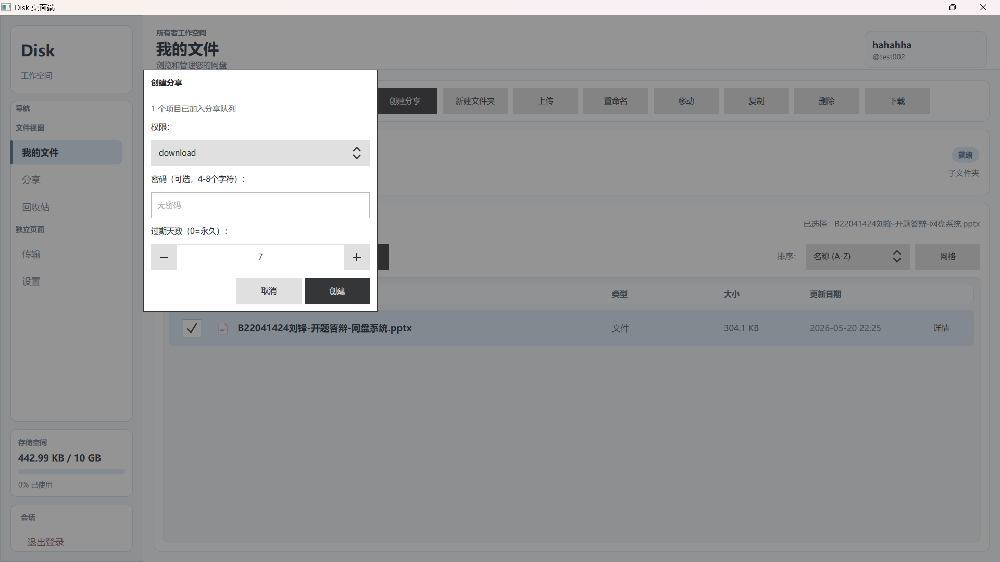

图5-9展示了创建分享对话框的操作过程，用户可以在该页面确认被分享的项目、有效期限、访问密码、权限类型，系统在后端生成分享短码后将其写入shares和share_files两张表中，含有密码的分享只会保存密码哈希。

DriveSharedView用来展示当前用户所创建的分享记录，列表中包括分享码、状态、有效期、浏览次数和下载次数等字段，用户可以查看详细内容、复制链接、修改权限或有效期，也可以对分享进行批量取消，服务层在执行取消操作时，会把分享状态变为取消，并且使对应的公开访问失去作用，访客在重新打开原链接时，系统会提示该链接已失效。

图5-10 我的分享管理功能截图

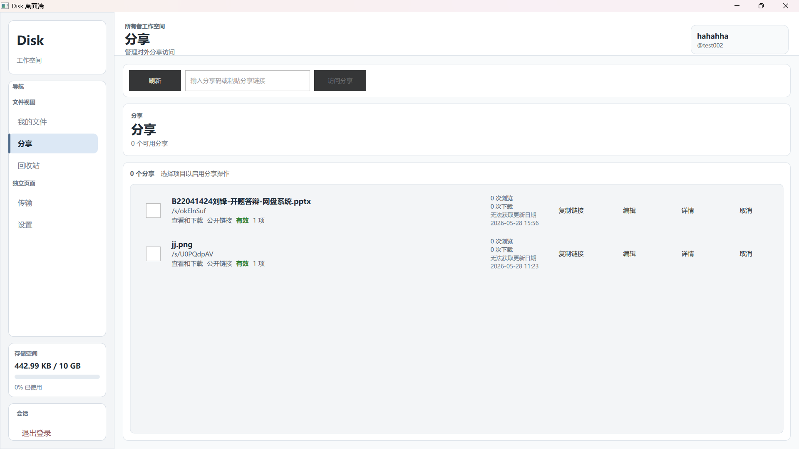

图5-10展示的是我的分享列表页面，用户能够于列表内查看分享状态、访问数据及过期时间，同时可以进入操作入口对权限进行调整、复制链接或者取消分享。

（2）访客访问、浏览与下载实现

访客通过分享短码进入VisitorShell，ShareVerifyPage显示校验界面。公开访问接口查询shares表，检查分享状态、有效期和密码；带密码的分享在Redis中记录尝试次数并限流。校验通过后，后端签发短期Share Token。

用户在浏览分享内容时，ShareAuthFilter会先对令牌进行校验，接口随后返回分享中的文件和目录列表，并且对浏览次数进行更新，下载接口需要再次检查分享状态和权限，只有在被允许下载的情况下，才会读取本地内容以寻找寻址文件，并返回文件流，同时也会更新下载次数，ShareBrowsePage在桌面端上显示出访客可以看见的内容。权限不足、链接过期或令牌失效时，页面会根据后端错误结果来提示用户。

图5-11 访客分享浏览功能截图

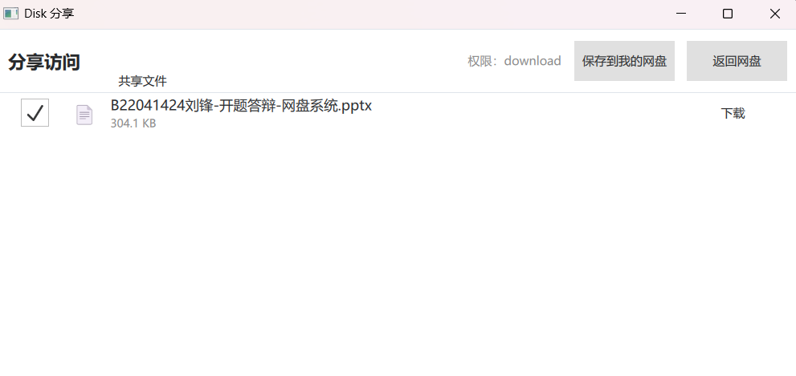

图5-11为访客浏览分享内容的界面。页面显示分享文件列表、权限提示、保存到我的网盘和下载入口，所有公开请求都依赖X-Share-Token区分访问身份。

（3）保存分享内容到个人网盘

保存分享内容使用/api/share/save/{share_id}接口，同时经过JwtAuthFilter和ShareAuthFilter。调用者需登录账号并通过分享访问校验。保存时，服务层按share_files关联关系为当前用户创建文件或目录记录；文件内容复用file_contents对象，只增加引用计数，不再写入新的物理文件。

### 5.6管理后台与运维模块功能实现

（1）管理员用户管理实现

管理员接口集中在AdminController和AdminService中。所有/api/admin/* 路由都需要先经过JWT鉴权，再由AdminAuthFilter确认管理员角色。管理员登录后进入AdminShell和AdminPage，用户、分享和系统状态被放在不同标签页中。用户管理接口支持分页、关键词、账号状态和角色筛选，返回用户ID、用户名、邮箱、昵称、存储使用量、账号状态和角色等信息。

管理员可以对普通用户执行禁用或启用操作，也可以对角色进行调整，对空间进行设置，或者对用户进行软删除，服务层会保护管理员本人和系统里最后一名管理员，避免误操作使系统禁用或降级，当状态和角色发生变化时，服务层会将操作日志进行写入，桌面端UserTab和AdminManager负责进行列表加载和提交操作，并且展示结果。

图5-12 管理员用户管理功能截图

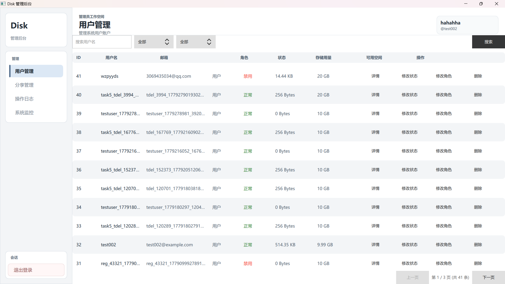

图5-12显示管理员用户管理界面，列表可以按照关键词、状态和角色进行筛选，操作入口用于对状态进行调整、对角色进行变更和对容量进行设置，后端在执行这些操作时会另外保护管理员本人和最后一个管理员账号。

（2）分享管理、存储统计与系统状态实现

图5-13 分享管理功能截图

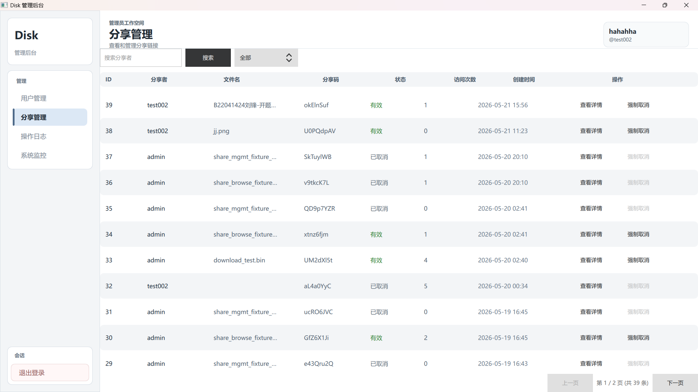

图5-13为管理员分享管理界面。管理员可以查看全平台分享列表和单个分享详情，也可以强制取消分享。详情包含分享码、分享者、被分享项目、有效期、访问次数和状态。存储统计接口聚合用户、文件、目录和内容对象数据，用于判断存储使用和去重效果。

系统状态接口会返回运行时间、版本、数据库连接、Redis连接和磁盘空间等指标，桌面端SystemTab把概览统计、全局存储统计和组件状态放在同一页面中，管理员可以先确认基础组件是否正常，再查看存储规模是否符合预期，在进行部署时，/api/health可以作为一个公开的存活检查接口来使用，已经登录的用户可以通过/api/system/info接口查看系统版本、Drogon版本、建立时间、连接统计和存储统计。

图5-14 系统状态与存储统计功能截图

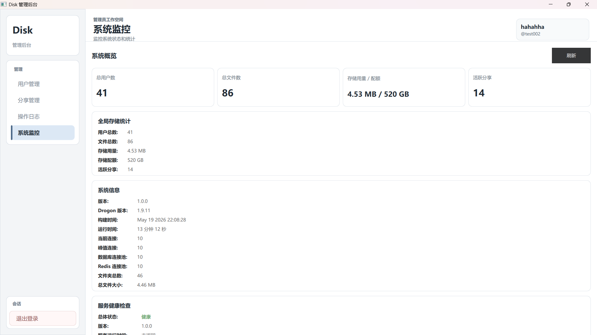

图5-14为系统状态页面，集中显示服务运行时间、版本、MySQL、Redis、磁盘空间和全局存储统计，可以作为管理员日常查看系统运行状态的入口。

（3）操作日志与后台清理实现

操作日志由OperationLogController和OperationLogService写入。登录、登出、上传、下载、删除、恢复、重命名、移动、复制、分享和管理员操作都会记录到operation_logs表。日志字段包括用户ID、操作类型、目标对象、JSON详情、IP地址、客户端信息和创建时间。桌面端管理界面分页展示这些记录。

图5-15 操作日志管理功能截图

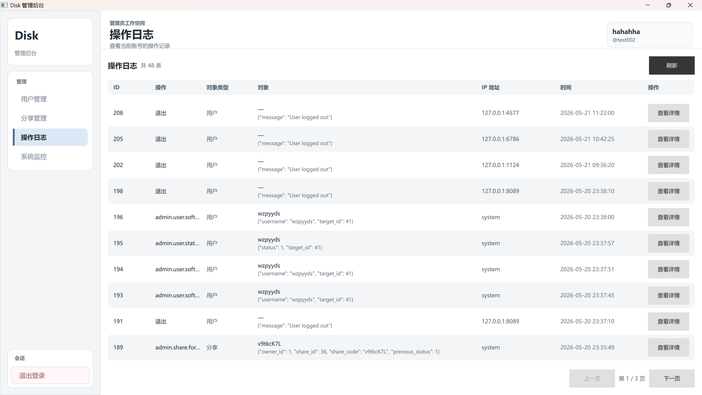

图5-15为操作日志页面。管理员可以按操作时间和类型筛选operation_logs记录，核对文件变更、异常访问或后台操作的时间与目标对象。

后台清理工作由CleanupService配合定时任务进行，主要负责处理过期上传任务和回收站记录，上传任务在过期后会释放预占用空间，删除临时分片并更新状态，回收站记录在到期后会减少引用计数，按照需要释放本地物理存储。

---

## 第6章 系统测试

### 6.1系统测试方法

（1）测试目的

测试目的是为了确认系统是否按照需求和设计进行运行，测试内容包括用户认证、令牌刷新、文件上传和下载、目录管理、分享、回收站、配额控制、管理员接口、桌面端交互、系统状态查询等流程，在测试过程中，本文同步检查了接口响应、客户端提示、PostgreSQL记录、Redis状态，以及本地或MinIO最终Blob的变化。

（2）测试方法

系统测试包括四个模块，分别是接口黑盒测试、服务层单元测试、全链路集成测试和桌面端页面测试，接口测试把HTTP状态码、返回错误码和响应报文结构当作主要的校验指标，服务层测试主要验证各个业务逻辑分支的覆盖情况、事务处理的一致性和权限管控规则的有效性，集成测试主要对PostgreSQL数据库交互、Redis缓存读写、本地暂存和本地/S3兼容BlobStore调用进行适配性测试。本文对桌面端页面测试进行关注，该测试主要考察列表渲染逻辑、数据传输状态反馈、异常场景下错误提示触发的表现。

### 6.2系统功能测试

#### 6.2.1账号模块功能测试

测试目的主要是为了确认用户注册、登录、令牌刷新、登出、密码错误提示、用户名或邮箱重复提示、未登录访问拦截和管理员角色识别这几种情况，是否满足了系统的设计要求。

表6-1登录注册模块测试表

| 编号  | 测试用例                                       | 预期结果                                              | 实际结果   |
| ----- | ---------------------------------------------- | ----------------------------------------------------- | ---------- |
| TC-01 | 新用户填写未被注册的用户名、邮箱和密码完成注册 | 注册成功，账号写入users表，分配默认配额             | 与预期一致 |
| TC-02 | 使用已注册的用户名或邮箱再次注册               | 注册失败，返回重复账号相关错误                        | 与预期一致 |
| TC-03 | 普通用户输入正确账号和密码登录                 | 登录成功，返回Access Token、Refresh Token和用户信息 | 与预期一致 |
| TC-04 | 普通用户连续输入错误密码                       | 登录失败并累计失败次数，达到阈值后短时锁定            | 与预期一致 |
| TC-05 | 使用Refresh Token刷新令牌                    | 返回新的令牌并轮换Redis中的刷新令牌状态             | 与预期一致 |
| TC-06 | 用户登出                                       | 访问令牌进入黑名单，刷新令牌失效                      | 与预期一致 |
| TC-07 | 普通用户使用有效令牌访问管理员专属接口         | 请求被拦截，返回403，提示权限不足                     | 与预期一致 |

#### 6.2.2文件模块功能测试

测试目的主要是为了检查分片上传、断点续传、秒传去重、取消上传、文件下载、Range断点下载这些功能是否正常，并且确认存储配额限制、上传任务状态管理是否有效。

表6-2文件上传与下载模块测试表

| 编号  | 测试用例                                 | 预期结果                                                | 实际结果   |
| ----- | ---------------------------------------- | ------------------------------------------------------- | ---------- |
| TC-08 | 用户初始化上传一个新文件                 | 创建upload_tasks记录并返回任务ID与已上传分片列表    | 与预期一致 |
| TC-09 | 用户上传所有分片并完成合并               | 分片合并成功，写入file_contents与files记录          | 与预期一致 |
| TC-10 | 大文件上传过程中模拟网络中断后重新初始化 | 系统识别已上传分片，客户端只需补传缺失分片              | 与预期一致 |
| TC-11 | 上传与已有内容MD5相同的文件            | 不重复上传物理文件，直接创建files记录并增加ref_count | 与预期一致 |
| TC-12 | 用户上传文件导致总存储使用量超过配额上限 | 上传初始化失败，返回存储空间不足，文件不写入系统        | 与预期一致 |
| TC-13 | 用户下载自己名下的文件                   | 文件流返回成功，内容与上传时一致                        | 与预期一致 |
| TC-14 | 用户使用Range请求下载文件片段          | 返回指定范围内容和正确的断点下载响应头                  | 与预期一致 |
| TC-15 | 用户尝试下载不属于自己的其他用户文件     | 请求被拒绝，返回403或404，文件内容不返回                | 与预期一致 |

#### 6.2.3目录模块功能测试

测试目的：用户在进行创建目录、查询目录树、查询面包屑、文件搜索、重命名、移动、复制和删除到回收站等操作时，系统需要对其是否正常运行进行检查，并且要确认目录重名限制和权限边界是否达到预期要求。

表6-3目录与文件管理模块测试表

| 编号  | 测试用例                                   | 预期结果                                     | 实际结果   |
| ----- | ------------------------------------------ | -------------------------------------------- | ---------- |
| TC-16 | 用户在当前目录下创建一个新目录             | 目录创建成功，folders表出现新记录           | 与预期一致 |
| TC-17 | 用户在同一父目录下创建与已有目录同名的目录 | 创建失败，返回名称冲突错误                   | 与预期一致 |
| TC-18 | 用户查询目录树和面包屑路径                 | 返回正确的层级结构和从根目录到目标目录的路径 | 与预期一致 |
| TC-19 | 用户按关键词搜索文件或目录                 | 返回匹配的文件和目录分页结果                 | 与预期一致 |
| TC-20 | 用户批量移动或复制文件                     | 目标目录下出现对应记录，复制文件复用内容对象 | 与预期一致 |
| TC-21 | 用户删除文件或目录                         | 项目进入trash表，正常列表中不再展示        | 与预期一致 |

#### 6.2.4分享模块功能测试

测试主要目的是验证创建分享、设置访问口令、调用分享访问接口以获取分享令牌、查看分享内容、下载分享资源、撤销分享全流程的运行通畅性，并且校验分享链接有效时长、访问权限管控逻辑和令牌生成校验方式的功能有效性。

表6-4文件分享模块测试表

| 编号  | 测试用例                               | 预期结果                                         | 实际结果   |
| ----- | -------------------------------------- | ------------------------------------------------ | ---------- |
| TC-22 | 用户为指定文件生成一个七天有效期的分享 | shares和share_files记录创建成功，返回分享信息 | 与预期一致 |
| TC-23 | 访客使用正确访问密码访问分享           | 校验通过，返回短期Share Token                   | 与预期一致 |
| TC-24 | 访客使用Share Token浏览分享内容      | 返回分享包含的文件或目录列表，view_count递增    | 与预期一致 |
| TC-25 | 访客使用Share Token下载文件          | 文件下载成功，download_count递增                | 与预期一致 |
| TC-26 | 访客使用已过期或已取消的分享访问       | 返回链接无效或已过期错误，文件不提供下载         | 与预期一致 |
| TC-27 | 用户批量取消分享                       | 分享状态更新为取消，原分享令牌随即失效           | 与预期一致 |

#### 6.2.5回收站与管理员功能测试

测试目的主要是为了检查回收站的恢复功能、彻底删除功能、清空操作是否正常，同时确认管理员对用户的管理功能、分享管理功能、存储统计功能、系统状态查看功能等均处于正常状态，另外还要确认权限控制功能与数据准确性能否达到预期要求。

表6-5回收站与管理员功能测试表

| 编号  | 测试用例                     | 预期结果                                       | 实际结果   |
| ----- | ---------------------------- | ---------------------------------------------- | ---------- |
| TC-28 | 用户查看回收站列表           | 返回当前用户已删除项目分页列表                 | 与预期一致 |
| TC-29 | 用户恢复回收站文件           | 文件恢复到原目录或根目录，命名冲突时自动改名   | 与预期一致 |
| TC-30 | 用户彻底删除回收站文件       | trash记录删除，file_contents引用计数正确减少 | 与预期一致 |
| TC-31 | 管理员查看全部注册用户列表   | 返回用户账号、状态、角色和存储使用情况         | 与预期一致 |
| TC-32 | 管理员禁用指定普通用户账号   | users.status更新，用户后续请求被拒绝          | 与预期一致 |
| TC-33 | 管理员修改用户角色           | users.role更新，权限边界同步变化              | 与预期一致 |
| TC-34 | 管理员查看全平台存储统计数据 | 正确返回用户数、文件数、内容对象数和存储使用量 | 与预期一致 |
| TC-35 | 管理员强制取消违规分享       | 分享状态更新为取消，公开访问立即失效           | 与预期一致 |
| TC-36 | 管理员查看系统状态           | 返回MySQL、Redis、磁盘空间和运行时间等状态    | 与预期一致 |

### 6.3系统性能测试

性能测试选取文件列表、目录导航、上传初始化和文件下载等接口，主要观察单机部署下的响应时间、吞吐量和错误率。后端使用Drogon异步I/O和协程服务层，本地文件按内容寻址保存。测试过程中没有出现明显超时或服务异常。

### 6.4系统安全性测试

安全性测试主要检查JWT鉴权、管理员角色校验、用户资源归属校验、分享访问令牌和密码错误限制等机制，未登录访问受保护接口、普通用户访问管理员接口、用户下载他人文件、访客使用错误或过期分享令牌等情况均分别进行测试，结果表明，这些请求可以被系统拦截或者返回对应的错误，登录之后的访问令牌也会因为黑名单状态而失效。

### 6.5测试总结

系统在完成功能测试之后，其主要业务基本可以保持稳定运行，普通用户、访客和管理员这三类角色的主要流程都通过了验证，这些流程包括认证鉴权、文件传输、目录管理、分享访问、回收站处理、管理员用户管理、分享管理、操作日志、存储统计和系统状态查询。

安全性测试包括用户访问他人文件、普通用户访问管理员接口、令牌过期、登录后继续请求、登录失败锁定、分享密码错误和分享令牌失效等场景，测试结果说明，系统会对这些请求进行拦截，或者按照预期返回错误。

当前测试仍然主要依靠毕业设计演示环境，并且大多是在本地单机环境下进行，还没有进行大规模的并发压力测试，操作日志和健康检查已经具备，但是监控告警、容量趋势分析和容灾恢复仍然比较基础，桌面端已经覆盖了主要页面，拖拽上传、缩略图预览和在线预览还没有完成，如果要进行实际部署，那么以后需要先进行性能压测、运维监控的补充。

---

## 总结与展望

本文完成了一套面向私有化部署的网络磁盘系统。论文说明了需求分析、总体架构、数据库结构、模块设计、功能实现和测试过程。系统后端采用C++23和Drogon，桌面端采用Qt 6和QML，数据层由MySQL、Redis和本地内容寻址文件系统组成。

在功能落地方面，该系统已经完成了用户注册登录、令牌生命周期管理、JWT权限校验、目录树展示、文件分片上传、断点续传、秒传、Range分段下载、文件分类整理、回收站、外链分享、操作日志留存、系统状态查询这些主要功能，桌面客户端实现了身份认证界面、网盘资源管理面板、传输任务中心、访客分享访问页、个人参数设置页和管理员管控后台这几个主要功能模块。文件上传和存储过程依靠upload_tasks、upload_task_chunks、file_contents这三张主要表，来分别进行分片上传状态的跟踪、秒传校验、文件资源去重的管理处理。

测试结果表明，系统基本达到毕业设计阶段的预期目标。注册登录、文件传输、目录管理、分享访问控制、回收站恢复、权限边界和管理员操作等流程都能够按照设计运行，RESTful接口的数据交互也较为清晰。通过本次系统实现可以看出，C++23、Drogon、MySQL、Redis和Qt/QML能够组合形成一套可运行的中小规模私有化网络磁盘系统。

该系统目前仍然存在一些不足，文件版本历史、WebDAV、在线预览、缩略图还没有完成，高并发压力测试和安全测试没有达到充分程度，在大规模文件传输时的吞吐量、延迟和稳定性也缺少更多数据，系统已经具备操作日志和状态接口，但是系统在监控告警、容量趋势分析、自动备份和容灾恢复方面比较基础，后续工作可以优先对客户端体验和压测数据进行补齐。

---

## 谢　辞

本课题从选题、系统设计到最终实现，都得到了老师和同学们的帮助与支持。首先，感谢指导教师在毕业设计过程中给予的细致指导。从选题方向的确定，到系统设计思路、论文结构安排和技术方案选择，指导老师都提出了具体建议，使本文研究和系统开发能够较为顺利地推进。

其次，感谢在项目开发过程中给予帮助的同学和朋友。在需求讨论、功能测试和问题排查过程中，大家提出了不少有用意见，也帮助我及时发现系统实现中的不足。最后，感谢学校和学院提供的学习与实践平台，使我有机会把课堂所学知识应用到实际项目中，并在这一过程中锻炼了工程实践能力。

---

## 参考文献

[1]赵维铨.基于C++的高性能Web服务器设计与实现[J].计算机技术与发展,2021,31(04):78-82.

[2]刘彬,吴昊.私有云存储系统的设计与实现[J].计算机与数字工程,2022,50(08):1823-1827.

[3]孙志成,李晓光.基于RESTful API的文件管理系统研究[J].软件工程,2020,23(11):12-15+50.

[4]王思远.断点续传技术在大文件上传中的应用研究[J].电脑知识与技术,2021,17(16):5-7.

[5]陈立明,张嘉文.JWT身份认证机制在Web服务中的应用[J].信息与电脑（理论版）,2022,(06):71-73.

[6]李鹏,赵辰.基于前后端分离架构的Web系统设计[J].电子技术与软件工程,2020,(12):41-42.

[7]吴晓东.MySQL数据库性能优化策略研究[J].计算机产品与流通,2021,(09):47-48.

[8]周文静,刘凯.epoll事件驱动模型在高并发服务器中的应用[J].计算机工程与科学,2020,42(01):133-141.

[9]杨芳.计算机网络应用技术[M].成都：电子科技大学出版社,2025:220.

[10]王红刚,谢秉贤,王征风.软件工程理论与实践[M].西安：西北大学出版社,2024:262.

[11]马占飞,吴井军,张玉然.Java编程技术与项目实战[M].北京：电子工业出版社,2025:248.

[12] Shafranovich Y. The application/json Media Type for JavaScript Object Notation. RFC 4627, IETF, 2006.

[13] Jones M, Bradley J, Sakimura N. JSON Web Token (JWT). RFC 7519, IETF, 2015.

[14] Ghemawat S, Gobioff H, Leung S T. The Google file system[C]. Proceedings of the nineteenth ACM symposium on Operating systems principles, New York, 2003: 29-43.

[15] Decandia G, Hastorun D, Jampani M, et al. Dynamo: Amazon's highly available key-value store[C]. ACM SIGOPS Operating Systems Review, 2007, 41(6): 205-220.

[16] Fielding R T. Architectural styles and the design of network-based software architectures[D]. University of California, Irvine, 2000.

[17]刘海洋,张明.云存储中数据安全与访问控制技术综述[J].通信技术,2021,54(03):544-551.

[18]金程,孙礼.基于Token机制的分布式系统认证方案[J].计算机应用与软件,2020,37(06):143-148+166.

[19] Drogon Framework. Drogon: A C++14/17/20 Based HTTP Web Application Framework. https://github.com/drogonframework/drogon, 2024-10.

[20] MySQL Documentation Team. MySQL 8.0 Reference Manual. https://dev.mysql.com/doc/refman/8.0/en/, 2024-10.
