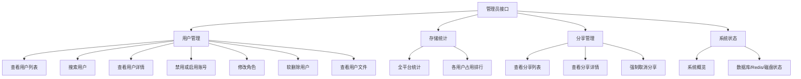
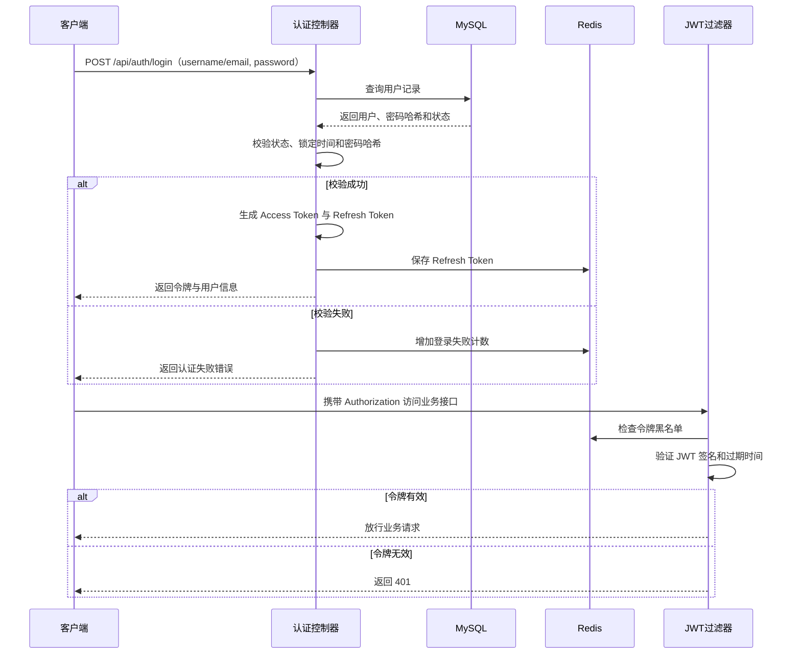
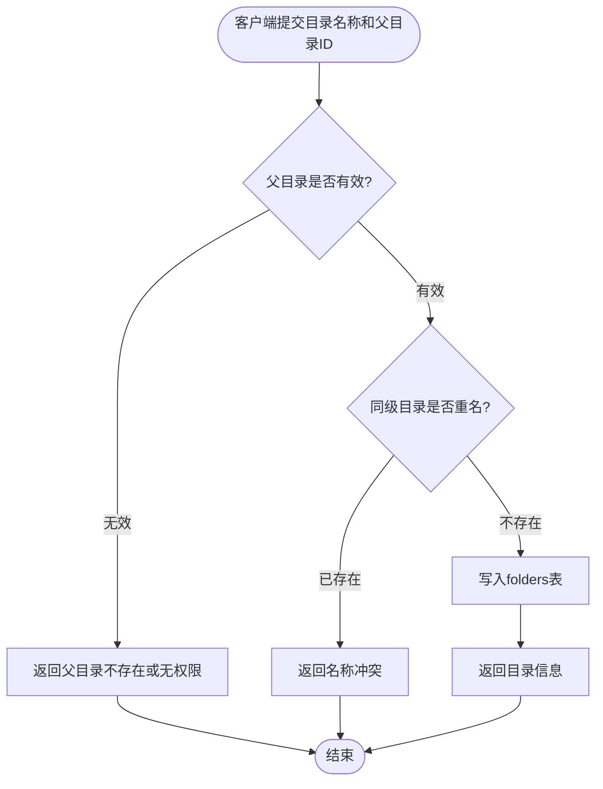
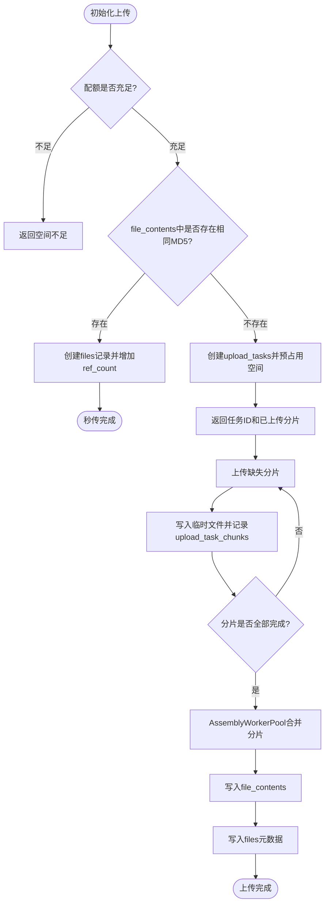
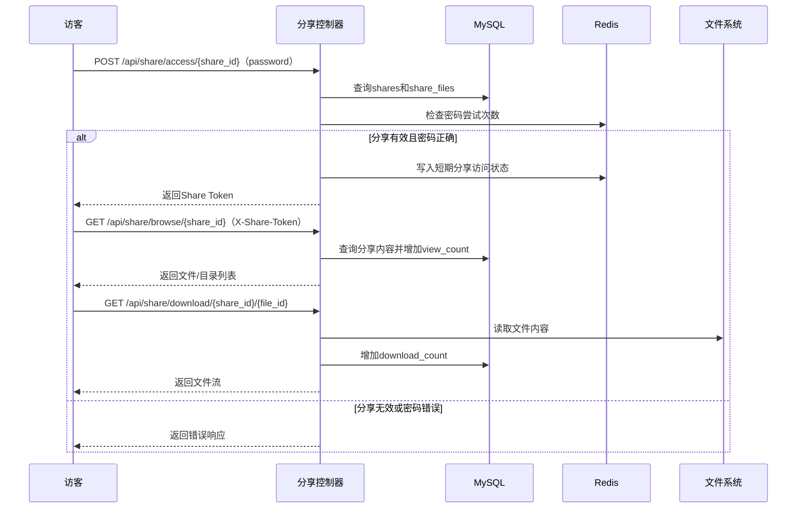

# 基于 Drogon 的网络磁盘系统的设计与实现

## 摘　要

近年来，随着互联网技术的持续发展和个人数字化生活方式的深刻变革，用户对在线文件存储、管理与共享的需求正在快速增长。无论是个人用户还是中小型团队，都面临着文件随时随地访问、多端同步以及安全私有存储等方面的实际诉求。然而，现有的主流公有云网盘产品往往存在数据隐私得不到保障、上传下载带宽受到限制、依赖第三方基础设施稳定性等问题，而自建网盘方案在性能和易用性方面又常常难以兼顾。因此，设计并实现一个高性能、易于私有化部署、可完全自主运维的网络磁盘系统，具有较为明显的现实应用价值与研究意义。

本文依照软件工程的基本流程开展系统设计与实现工作，系统定位为面向私有化部署场景的高性能网盘后端服务。后端以 C++23 标准和 Drogon 高性能 Web 框架为核心技术，借助其基于 epoll 的非阻塞异步 I/O 和 C++ 协程能力承载文件传输与业务接口处理；系统通过 RESTful API 对外提供能力，便于后续对接桌面端。数据层选用 MySQL 完成用户信息、文件元数据、内容索引、目录结构、上传任务、分享记录、回收站等核心数据的持久化存储，同时引入 Redis 管理刷新令牌、令牌黑名单、登录失败计数、分享访问状态和限流计数等短时状态；文件实体则采用内容寻址方式存储在服务器本地文件系统中，由后端统一负责路径映射、引用计数和访问权限控制。系统面向普通用户与管理员两类角色展开设计：普通用户可完成账号注册、登录、令牌刷新与登出，个人资料和存储空间查看，文件与目录的列表、搜索、重命名、移动、复制、软删除，支持断点续传和秒传的大文件分片上传，文件下载、外链分享、分享密码访问等操作；管理员则可通过管理接口完成用户账号状态与角色管理、用户文件查看、全局存储统计、分享审核与强制取消、等运维功能。

系统目前已能够较好地满足私有化网络磁盘的核心业务需求，一方面让用户在线管理文件和进行文件共享变得更加便捷高效，另一方面也在性能层面充分发挥了 Drogon 框架在高并发 HTTP 处理和异步数据库访问方面的显著优势。本文的研究不仅完成了一个具有实际应用价值的私有化网盘系统，也为基于 C++ 技术栈构建高性能 Web 服务提供了具体的工程实践参考。

关键词：网络磁盘；文件管理；Drogon；C++23；RESTful API

---

## ABSTRACT

In recent years, with the continuous development of internet technologies and the profound transformation of personal digital lifestyles, the demand for online file storage, management, and sharing has been growing rapidly. Both individual users and small-to-medium-sized teams face practical needs for accessing files anytime and anywhere, synchronizing across multiple devices, and securely storing data on private infrastructure. However, mainstream public cloud storage products often suffer from problems such as insufficient data privacy protection, restricted upload and download bandwidth, and dependence on the stability of third-party infrastructure, while self-hosted network disk solutions frequently struggle to achieve a satisfactory balance between performance and ease of use. Accordingly, designing and implementing a high-performance, easily deployable, and fully self-manageable private network disk system carries considerable practical application value and research significance.

This thesis conducts system design and implementation work in accordance with the fundamental processes of software engineering. The system is positioned as a high-performance backend service for private network disk deployment scenarios. The backend is built upon the C++23 standard and the Drogon high-performance web framework, leveraging its epoll-based non-blocking asynchronous I/O and C++ coroutine capabilities to handle file transfers and business API processing. The system exposes its capabilities through RESTful APIs, facilitating subsequent integration with desktop clients. MySQL is selected for persistent storage of core data such as user information, file metadata, content indexes, directory structures, upload tasks, share records, and trash records. Redis is introduced for managing short-lived states including refresh tokens, token blacklists, login failure counters, share access states, and rate-limiting counters. File entities are stored on the server's local filesystem using content-addressed storage, with the backend uniformly managing path mapping, reference counting, and access control. The system is designed around two user roles: regular users can perform account registration, login, token refreshing and logout, profile and storage querying, file and folder listing, searching, renaming, moving, copying, and soft deletion, resumable chunked upload with instant deduplication, file downloading, external sharing with optional passwords, and other operations; administrators can manage user account status and roles, inspect user files, view global storage statistics, review and forcefully cancel shares, and perform other administrative functions through protected management APIs.

The system currently satisfies the core business requirements of a private network disk to a considerable degree. On one hand, it makes online file management and file sharing more convenient and efficient for users. On the other hand, it fully exploits the advantages of the Drogon framework in high-concurrency HTTP processing and asynchronous database access at the performance level. The research presented in this thesis not only completes the development of a private network disk system with practical application value, but also provides a concrete engineering practice reference for building high-performance web services based on the C++ technology stack.

KEYWORDS: Network Disk; File Management; Drogon; C++23; RESTful API

---

## 前　言

当前，数字化转型浪潮正深刻影响着人们的工作与生活方式，个人数据的体量也在持续膨胀。无论是日常学习产生的文档与笔记，工作中积累的代码与项目文件，还是大量的图片、视频和各类多媒体资料，都需要一个可靠、便捷、随时可访问的存储与管理入口。在这一背景下，网络磁盘（网盘）作为一种将文件存储与互联网访问能力融合在一起的服务形态，已经成为很多用户日常数据管理的重要工具。然而，市面上成熟的公有云盘产品普遍存在数据隐私风险、带宽限速、免费空间有限以及对平台依赖性过强等问题，这些局限使得私有化、自主可控的网盘方案具备了比较突出的应用价值。

从用户使用角度来看，网络磁盘的核心价值在于"随时上传、随时下载、随时分享"。用户希望能够通过统一的 Web 入口完成文件的上传与组织，并在需要时快速检索到目标文件；对于大文件，用户还期望系统支持断点续传，避免因网络抖动导致整个上传过程重来。与此同时，文件分享也是网盘系统中使用频率较高的功能场景——用户希望能够通过生成外链的方式，将文件快速分发给他人，同时也希望对分享链接的有效期和访问权限进行必要的管控，保证数据安全。这些需求如果依靠传统的文件传输工具或即时通信软件来满足，往往操作繁琐且缺乏统一的管理视图，而一个完整的网盘系统恰好可以把上述场景整合进一个统一的平台入口。

从系统运维管理角度来看，一个设计完善的网盘系统不应只是前台功能的集合，还需要提供配套的后台管理能力。管理员需要了解系统当前的存储使用情况，能够查询和管理各个用户账号，设置全局的存储配额与访问规则，并对系统异常状态做出及时响应。如果这些管理功能依赖人工干预或分散在不同工具中，不但会增加运维成本，也会让系统的整体可靠性和规范性大打折扣。因此，一个兼顾用户端使用体验与管理端运维效率的网盘系统，才算是真正具备了完整的实用价值。

在技术选型层面，本文选择以 C++23 作为后端开发语言，采用 Drogon 作为 HTTP 服务框架，正是出于对性能和现代工程表达能力的综合考虑。Drogon 是一个基于 epoll（在 macOS/FreeBSD 下为 kqueue）实现非阻塞 I/O 的高并发 Web 框架，其协程化请求处理模型非常适合文件传输这类 I/O 密集型场景。与基于脚本语言或传统阻塞式 Web 框架的同类实现相比，C++ 实现的后端在内存占用、请求吞吐量和资源控制能力上都有明显优势，更适合运行在资源相对有限的私有服务器上。结合 MySQL 提供的关系型元数据存储、Redis 提供的短时状态和限流能力，以及本地文件系统提供的内容寻址实体文件存储，整个技术栈构成了一个低依赖、高性能、易于在单机环境快速部署的私有化网盘后端基础。

基于以上背景，本文围绕私有化网络磁盘系统的设计与实现展开研究，按照软件工程的基本思路，对系统需求分析、总体结构设计、数据库设计、详细设计、实现过程和测试结果进行了系统性的分析与说明。通过本课题的研究，一方面可以验证 Drogon、MySQL 等技术在中小型文件服务系统开发中的适用性，另一方面也能将需求分析、抽象设计、工程落地等各方面能力进行综合锻炼，希望本研究能为私有化存储平台的设计与实现提供一定参考，同时为基于 C++ 高性能框架构建 Web 服务的实践探索提供借鉴。

---

## 第1章 绪论

### 1.1 研究背景

近年来，随着移动互联网的普及和个人数字内容的快速增长，用户对在线存储服务的需求持续上升。云存储技术的出现，使文件的存储与访问不再受限于特定设备或物理位置，极大地方便了个人和团队的日常数据管理工作。然而，现有的公有云网盘产品在带来便利的同时，也逐渐暴露出诸多不足：数据存储在第三方服务器上，用户的隐私和商业机密难以得到充分保护；免费套餐的存储容量和传输速度受到严格限制，高级功能往往需要持续付费订阅；一旦服务商调整政策、停止运营或发生安全事故，用户数据便面临不可控风险；此外，部分机构或企业出于合规需要，明确要求数据必须保存在自主可控的基础设施之上，根本无法使用公有云网盘服务。

在这样的背景下，私有化自建网盘方案的需求日益凸显。与公有云网盘相比，私有化网盘将文件实体和元数据全部保存在用户自己的服务器上，从根本上解决了数据主权和隐私保护的问题；同时，不受第三方平台政策约束，存储空间和访问带宽均可按需配置，更适合有特定要求的个人开发者、高校师生和中小型团队使用。然而，构建一个兼顾功能完整性、系统性能和部署便捷性的私有化网盘并非易事。如果使用基于脚本语言或解释型语言的传统 Web 框架，在高并发文件传输场景下往往会出现吞吐量不足和 CPU 利用率偏高的问题。基于此，本文提出采用 C++ 语言配合 Drogon 高性能 Web 框架，设计并实现一个适合私有化部署的网络磁盘系统，在保证功能完整性的前提下，充分发挥 C++ 在系统资源利用方面的天然优势，为私有化存储平台的技术探索提供一个切实可行的参考方案。
### 1.2 研究意义

本课题的研究目的，是围绕私有化网络磁盘的实际业务场景，设计并实现一个具有完整功能的网盘服务系统，将用户文件管理、目录组织、大文件上传、文件分享以及管理员后台等核心业务统一纳入系统之中，在满足功能完整性的前提下，充分发挥 C++ 和 Drogon 框架在高性能 I/O 处理方面的优势，为私有化文件存储平台的工程落地提供一个可验证、可参考的技术方案。

从实践意义上来看，本系统能够为有私有化部署需求的个人开发者、高校师生和中小团队提供一套可自主运维的文件存储与管理服务，彻底规避将数据托管于第三方平台所带来的隐私风险和政策依赖。用户可以在统一的 Web 界面内完成文件的上传、整理、查找和分享，不需要在多个工具之间反复切换，系统也会自动对用户的存储配额进行跟踪和提示，使存储资源的使用更加清晰透明。对于管理员而言，后台提供的用户管理、存储统计和系统配置功能，也能有效降低日常运维工作的复杂度，使平台的整体运营更加规范高效。

从理论和学习层面来看，本课题将 C++ 系统编程、异步网络 I/O 模型、Web 框架使用、关系型数据库设计、缓存状态管理以及 RESTful API 架构等多个方向的知识有机结合在一起，完成了从需求分析、系统设计到功能实现和测试验证的完整工程开发过程。通过本课题的研究与实现，不仅加深了对 Drogon 框架工作机制、MySQL 数据库设计原则和 RESTful 接口规范的理解，也积累了在 C++ 工程项目中进行模块划分、接口设计和异常处理的实际经验，对于今后继续从事高性能服务端开发或系统架构设计工作，具有一定的正向促进作用。
### 1.3 国内外研究现状

从云存储与网络磁盘相关技术的研究和实践情况来看，国内外已经积累了比较丰富的成果，但针对高性能 C++ 框架的私有化网盘实现，目前的研究和开源资料仍相对有限。

在国外，云存储领域的学术研究起步较早，分布式文件系统、对象存储架构和数据去重技术等方向已有大量成熟论文与工程案例。Google 文件系统（GFS）、Amazon S3 以及 OpenStack Swift 等系统在架构层面为大规模云存储提供了经典范式，但这些系统的设计目标是面向数据中心级别的水平扩展，对于资源受限的单机私有化部署而言过于复杂，部署和维护成本极高。在开源网盘领域，Nextcloud 和 ownCloud 是比较具有代表性的 PHP 实现，功能丰富但对服务器配置要求较高，性能也受限于 PHP 的运行模型。SeaweedFS 和 MinIO 则是基于 Go 语言实现的对象存储系统，在性能和部署便捷性上有明显进步，但 API 面向对象存储协议设计，并不直接提供网盘形态的用户交互界面。

在国内，随着百度网盘、阿里云盘等公有云网盘产品的快速发展，相关技术研究也日益增多，重点集中在文件秒传、内容去重、传输加速和版权保护等方向。自建私有网盘的研究与实践则主要集中在基于 Java Spring Boot、Python Django/Flask 框架的 Web 应用开发上，面向教学或毕业设计目的的实现案例中，大多采用关系型数据库配合本地文件系统的存储方式，功能覆盖基本够用，但在高并发性能和资源占用方面仍有提升空间。基于 C++ Web 框架（尤其是 Drogon）构建文件存储服务的研究与工程实践目前较为少见，与本课题相关的开源项目也处于起步阶段，尚未形成成熟的设计范式和参考实现。

总体来看，现有研究和实践已经在云存储架构设计和私有网盘开发技术路线上积累了一定基础，但针对 C++ 高性能框架在网盘场景下的具体工程实践，还有较大的探索空间。本文正是在这一背景下，结合 Drogon 框架的异步高并发特性和私有化部署的实际需求，尝试提供一个可参考的设计实现方案。
### 1.4 本文的组织结构

本文围绕私有化网络磁盘系统的设计与实现展开研究，结合当前私有化网盘在文件存储访问、大文件传输效率、目录树管理、分享链接控制以及后台运维管理等方面的实际业务需求，对系统需求分析、总体架构设计、数据库设计、各模块详细设计与实现，以及系统测试验证进行系统性说明。通过本课题的研究，拟构建一个同时面向普通用户和管理员两类角色、覆盖文件存储全生命周期核心业务的网络磁盘服务平台，并验证其在实际部署场景中的可行性与可用性。

在功能设计目标上，系统主要解决普通用户文件管理与管理员运维管理两个方面的核心需求。用户侧后端接口重点实现账号注册、登录、令牌刷新与登出，个人资料与存储空间统计，文件和目录的分页列表、搜索、详情、重命名、移动、复制、软删除，目录树与面包屑路径查询，文件上传（含支持断点续传、秒传去重和后台合并的分片上传机制）、文件下载（含 Range 断点下载）、文件外链分享、分享密码校验、分享内容浏览与下载，以及回收站列表、批量恢复、彻底删除和清空等功能；管理员侧则重点实现用户账号查询、状态切换、角色变更、软删除、用户文件与存储查看、全局存储统计、分享列表与强制取消、系统概览和系统状态查询等功能，从而保障平台正常、规范地运行。

在性能设计目标上，系统主要依托 Drogon 框架的异步非阻塞 I/O 能力和 C++ 协程模型，保证在文件上传和下载等 I/O 密集型场景下，后端请求处理吞吐量和响应延迟能够达到较好的水平。同时，通过对上传任务和分片状态的持久化管理，实现断点续传机制；通过文件内容哈希和引用计数实现秒传与去重，减少相同内容文件的重复写入；通过 Redis 缓存短时状态、记录限流计数和登录失败次数，降低数据库热路径压力并提升安全控制效率。

在安全性设计目标上，系统通过登录认证、Access Token、Refresh Token 轮换和 JWT 令牌鉴权机制保证不同角色的访问边界清晰，普通用户只能访问自己名下的文件和目录，无法越权访问他人数据；管理员接口受到独立的角色鉴权保护，非管理员账号不能调用后台管理接口。用户密码使用 Argon2id 哈希后存储，登录失败计数与短时锁定机制用于降低暴力破解风险。对于文件分享功能，系统通过分享短码、可选访问密码、短期分享访问令牌和有效期控制共同约束公开访问范围，确保分享链接在失效或取消后不再允许访问。

在可扩展性设计目标上，系统的模块划分遵循低耦合原则，认证、用户、文件、目录、分享、回收站、运维统计和操作日志等业务模块相互独立，控制器只负责解析请求和转换响应，核心业务集中在服务层实现。存储层通过 `IFileStorage` 抽象隔离本地文件系统实现，后续可以在不大幅改动业务接口的前提下扩展对象存储、文件版本历史、WebDAV 接口、缩略图预览等高级功能。

---

## 第2章 相关技术分析

### 2.1 Drogon 框架与 C++23 协程

Drogon 是一个高性能 HTTP Web 应用框架，其底层网络库基于 epoll（在 macOS/FreeBSD 下为 kqueue）实现非阻塞 I/O，采用异步请求处理模型，能够以较少的线程资源支撑高并发的 HTTP 请求处理，非常适合文件传输这类 I/O 密集型服务。本系统在项目实现中采用 C++23 标准，结合 Drogon 的 `HttpController`、`HttpCoroFilter` 和 `drogon::Task` 协程接口组织控制器、过滤器和服务层逻辑，并使用 `std::expected` 风格的 `Result<T>` 统一表达业务成功或失败，减少异常控制流对业务代码的侵入。

### 2.2 MySQL 数据库

MySQL 是一种广泛使用的关系型数据库管理系统，具有稳定性高、社区资料丰富、查询性能良好等特点，适合作为中小规模业务系统的持久化数据存储后端。本系统通过 MySQL 保存用户账号信息、文件内容哈希、文件元数据、目录树结构、上传任务、上传分片、回收站记录、分享记录、分享文件关联和操作日志等核心数据，并通过联合索引、全文索引和唯一约束支撑文件列表查询、目录树遍历、秒传查重、配额统计和分享访问等高频操作。

### 2.3 Redis 缓存与状态管理

Redis 是一种高性能内存键值数据库，适合保存短生命周期状态和计数器。本系统使用 Redis 保存 Refresh Token、Access Token 黑名单、登录失败计数、分享访问令牌、密码尝试次数和接口限流计数等数据，从而将高频、短时、易过期的状态从 MySQL 中剥离出来，提高鉴权、限流和安全控制逻辑的执行效率。

### 2.4 JWT 身份鉴权机制

JWT（JSON Web Token）是一种基于 JSON 格式的开放标准（RFC 7519），用于在各方之间以紧凑、自包含的方式安全地传递身份认证信息。本系统在用户登录成功后签发 Access Token 与 Refresh Token，普通业务请求通过 `Authorization: Bearer <token>` 携带访问令牌，令牌刷新和登出依赖 Redis 中保存的刷新令牌与黑名单状态实现轮换和失效控制；公开分享访问则使用独立的分享令牌并通过 `X-Share-Token` 请求头传递，避免将用户 JWT 暴露给未登录访客。

### 2.5 CMake 构建工具与安全基础库

CMake 是一种跨平台的构建系统生成工具，被 Drogon 生态所推荐使用。本系统通过 CMakeLists.txt、CMakePresets.json 和 vcpkg manifest 管理后端项目的编译依赖、构建预设和第三方库，简化了 Linux 与 Windows 环境下的编译、测试和部署流程。密码哈希方面，系统使用 libsodium 提供的 Argon2id 算法保存用户密码，避免明文密码或弱哈希方案带来的安全风险。

### 2.6 Qt 框架与 QML

Qt 是一个跨平台的 C++ 应用程序开发框架，提供了丰富的 GUI 组件、网络通信、文件处理和国际化等功能模块，广泛用于桌面端、嵌入式和移动端应用开发。本系统的桌面客户端基于 Qt 6 构建，使用 Qt Network 模块实现与后端 RESTful API 的 HTTP 通信，支持文件分片上传、断点下载和 JSON 数据解析；界面层采用 QML（Qt Modeling Language）声明式语言编写，配合 Qt Quick Controls 2 提供现代风格的用户界面组件，实现了文件列表展示、目录导航、上传进度、分享管理和后台管理等功能页面。通过 QML 与 C++ 后端的属性绑定和信号槽机制，客户端能够在保持流畅交互体验的同时，与后端服务保持清晰的职责分离。

---

## 第3章 需求分析

### 3.1 系统需求概述

在私有化网络磁盘系统的建设过程中，对系统的可行性进行全面评估是开展设计与实现工作的必要前提。通过从技术可行性、经济可行性和操作可行性三个维度进行分析，可以判断本系统在当前条件下是否具备落地开发和实际应用的基础。结合本课题的实现目标以及所选技术栈的成熟度来看，系统整体具备较为良好的实施条件。

从技术可行性来看，本系统选用 C++23、Drogon、MySQL 和 Redis 作为核心技术基础，这些技术均已在工业界和开源社区中得到广泛验证，相关资料和社区支持较为充分。Drogon 框架提供了完整的 HTTP 请求路由、过滤器、控制器、协程任务、异步数据库访问和配置文件管理等功能，能够覆盖本系统后端开发的主要需求；MySQL 在中小型业务系统的持久化存储场景下表现稳定，适合保存用户、文件、目录、分享和日志等结构化数据；Redis 则适合处理令牌、限流、登录失败计数等短生命周期状态。C++23 标准提供的协程、`std::expected`、`std::filesystem` 等现代语言能力，也显著降低了异步流程、错误返回和文件路径操作的编码复杂度。此外，JWT 鉴权方案、Argon2id 密码哈希方案和 CMake/vcpkg 构建体系在 Web 服务开发中均较成熟，相关 C++ 库易于集成。综合来看，本课题所涉及的各项技术均处于可用、稳定的状态，技术可行性较好。

从经济可行性来看，本系统开发所依赖的所有软件工具和运行时环境均为开源免费软件，包括 Drogon 框架、MySQL 社区版、CMake 构建工具、GCC/Clang 编译器以及各类 Linux 系统工具，整体开发成本极低。系统部署对硬件要求不高，在普通个人计算机或低配云服务器上即可完成编译和运行。对于毕业设计课题而言，所需软硬件资源完全可以在个人环境中自行准备，不存在经济层面的障碍，经济可行性良好。

从操作可行性来看，系统面向普通用户和管理员两类角色设计，后端接口围绕文件管理的主要操作展开，包括账号认证、个人资料、文件上传下载、目录管理、分享、回收站、日志和运维统计等，接口路径清晰、参数和响应格式统一。普通客户端或前端页面可以基于 RESTful API 快速接入，管理员也可以通过受保护的管理接口完成用户、分享、存储和系统状态管理。由于系统将权限校验、错误响应和业务状态统一封装在后端，后续二次开发时只需按照接口规范调用即可，操作可行性较好，符合面向个人开发者和小型团队部署使用的定位。

### 3.2 系统功能需求分析

私有化网络磁盘系统的需求主要来自两个方面：一方面是普通用户在线存储、管理和共享文件的使用需求，另一方面是管理员对平台用户、存储资源和系统参数进行统一管控的运维需求。结合实际业务场景，系统需求可以划分为功能需求和非功能需求两个部分进行描述。

#### 3.2.1 账号与用户模块需求分析

账号与用户模块需要为普通用户提供注册、登录、令牌刷新、登出、个人资料查询与更新、密码修改和存储空间查看等基础能力。系统应在注册阶段校验用户名和邮箱唯一性，在登录阶段校验账号状态、密码正确性和失败次数，并在认证成功后签发 Access Token 与 Refresh Token，以支持后续业务接口鉴权和登录态续期。用户中心还需要展示已用空间、预占用空间、剩余配额、文件数和目录数，使用户能够清晰了解个人存储资源使用情况。

管理员侧需要在账号维度提供用户列表查询、关键字与状态筛选、用户详情查看、用户文件查看、用户存储使用量查询、账号禁用或启用、角色变更和软删除等功能。所有管理员操作均应建立在普通 JWT 鉴权和管理员角色鉴权之上，防止普通用户越权访问后台运维接口。

#### 3.2.2 文件与目录模块需求分析

文件模块需要覆盖文件从上传、访问、组织到删除的完整生命周期。系统应支持文件和目录的混合分页列表展示、按名称搜索、文件详情查询、文件重命名、批量移动、批量复制和软删除；对于文件下载，需要支持普通完整下载和 HTTP Range 断点下载，以便客户端在网络不稳定场景下恢复下载进度。

上传功能是文件模块的核心需求。系统需要支持初始化上传、上传分片、完成合并和取消上传四个阶段，并通过上传任务与分片状态记录实现断点续传；当服务器已经存在相同内容文件时，应能够基于内容哈希完成秒传，避免重复上传和重复存储。目录模块需要支持多级目录创建、目录树查询和面包屑路径查询，并保证同一用户同一父目录下的目录名称不重复。

#### 3.2.3 分享、回收站与管理模块需求分析

分享模块需要支持用户为文件或目录生成外链分享，并能够设置有效期、访问密码和查看或下载权限。未登录访客访问分享时，系统应先校验分享短码、分享状态、有效期和访问密码，校验成功后再签发短期分享访问令牌；访客浏览分享内容或下载分享文件时，需要通过独立的分享令牌完成鉴权，避免公开访问流程与登录用户 JWT 混用。

回收站模块需要支持误删除恢复场景。用户删除文件或目录时，系统应先将项目移动到回收站，保留原路径、原所属目录、项目类型、内容引用和恢复所需数据；用户可以查看回收站列表，执行批量恢复、彻底删除或清空回收站。管理员与运维模块则需要提供全局存储统计、分享记录查看、违规分享强制取消、系统概览、数据库状态、Redis 状态和磁盘空间状态查询等能力。

#### 3.2.4 系统用例分析

从系统使用对象来看，本系统主要涉及普通用户和管理员两个参与者。普通用户通过用户端完成注册登录、文件上传与下载、目录管理、文件分享等操作；管理员则通过后台完成用户管理、存储统计查看和系统参数配置等操作。

普通用户的核心用例主要包括：账号注册、账号登录、刷新令牌、登出、查看和更新个人资料、修改密码、查看存储空间、初始化上传、上传分片、完成上传、取消上传、下载文件、查看文件列表、搜索文件或目录、创建目录、查看目录树、查看面包屑路径、重命名文件或目录、移动或复制文件和目录、删除到回收站、查看回收站、恢复回收站项目、彻底删除回收站项目、生成分享链接、查看我的分享、更新或取消分享、通过分享密码访问分享、浏览分享内容以及下载分享文件；管理员的核心用例则包括：管理员登录、查看全部用户列表、查看用户详情、禁用或启用用户账号、修改用户角色、软删除用户、查看用户文件、查看用户存储使用量、查看全平台存储统计、查看分享列表、查看分享详情、强制取消分享、查看系统概览以及查看系统状态。

图3-1 普通用户用例图

图3-2 管理员用例图

### 3.3 系统非功能需求分析

#### 3.3.1 系统性能需求分析

系统需要能够在单机私有化部署环境下稳定运行，充分利用 Drogon 框架的异步 I/O 能力提升文件传输吞吐量。对于文件列表、目录导航、存储配额查询等元数据请求，后端应在较短时间内完成响应；对于文件上传和下载操作，系统应利用流式处理机制避免将大文件全量加载入内存，减少内存峰值占用。上传任务和分片状态需要具备持久化能力，以便在客户端网络中断后继续上传缺失分片。

#### 3.3.2 系统安全性与可维护性需求分析

系统需要对不同用户的文件资源严格隔离，普通用户只能访问自己名下的文件和目录，不能通过接口越权访问或下载他人文件；管理员接口需要单独鉴权，普通用户令牌无法访问管理员功能。文件分享链接需要使用随机短码、可选访问密码、有效期和短期分享访问令牌共同控制公开访问范围。用户密码必须经过安全哈希后存储，不得以明文形式保存在数据库中。

在可维护性方面，后端代码需要按认证、用户、文件、目录、分享、回收站、管理员、日志和系统状态等功能模块清晰划分。控制器只负责解析请求和转换响应，核心业务集中在服务层实现；数据库表结构应做到字段含义清晰、约束合理，方便后期维护和 Schema 演进。

#### 3.3.3 数据字典

本系统涉及的核心数据对象主要包括用户信息、文件内容、文件元数据、目录信息、上传任务、上传分片、回收站记录、分享记录、分享文件关联和操作日志等，以下分别对主要数据对象的字段组成和含义进行说明。

用户信息（users）是整个系统的基础数据对象，主要用于保存用户的账号凭据、个人资料、登录安全状态和存储配额信息，是登录鉴权、文件归属判断和存储限额控制的核心依据。其主要字段包括用户主键 ID、用户名、邮箱、哈希后的密码、昵称、头像、存储配额、已用存储、上传预占用存储、账号状态、角色类型、登录失败次数、锁定截止时间、最后登录时间、最后登录 IP、创建时间和更新时间。

文件内容（file_contents）用于保存物理文件内容的索引信息，是秒传去重和内容寻址存储的基础。其主要字段包括内容主键 ID、MD5 哈希、SHA256 哈希、文件大小、实际存储路径、MIME 类型、引用计数和创建时间。多个用户文件记录可以引用同一个内容对象，从而避免相同内容被重复存储。

文件元数据（files）是文件管理功能的核心数据对象，用于保存每一个用户可见文件的描述性信息，而不直接存储文件二进制内容。其主要字段包括文件主键 ID、所属用户 ID、关联的内容 ID、所属文件夹 ID、文件名、扩展名、文件大小、MIME 类型、完整路径、收藏标记、下载次数、最后访问时间、创建时间和更新时间。

目录信息（folders）用于维护用户的目录树结构，是目录导航和文件路径组织的基础数据表。其主要字段包括目录主键 ID、所属用户 ID、父目录 ID（根目录以 0 表示）、目录名称、完整路径、目录深度、子项数量、创建时间和更新时间。通过父目录 ID 字段形成的递归引用关系，可以构建出任意层级深度的目录树结构。

上传任务（upload_tasks）用于支持大文件分片上传和断点续传机制，保存每个进行中、已完成、已取消或已过期上传任务的总体状态。其主要字段包括上传任务 ID、用户 ID、目标文件夹 ID、文件名、文件大小、文件 MD5、分片大小、总分片数、预占用字节数、临时存储路径、任务状态、过期时间、完成时间、失败原因、创建时间和更新时间。上传分片（upload_task_chunks）则以任务 ID 和分片索引作为联合主键，记录每个分片是否已经上传成功。

回收站记录（trash）用于保存软删除文件或目录的恢复信息。其主要字段包括回收站记录 ID、用户 ID、项目类型、原项目 ID、项目名称、项目大小、关联内容 ID、原所属文件夹 ID、原完整路径、项目完整数据备份、删除时间和过期时间。通过回收站表，系统可以在彻底删除之前恢复误删项目，也可以在过期清理时减少内容引用计数并释放物理存储。

分享记录（shares）用于保存用户发起的分享操作的基础信息，是外链分享功能的数据基础。其主要字段包括分享 ID、分享短码、分享者用户 ID、访问密码哈希、权限类型、访问次数、下载次数、分享状态、过期时间、创建时间和更新时间。分享文件关联（share_files）用于描述某个分享包含的文件或目录，主要字段包括关联记录 ID、分享 ID、项目类型、项目 ID 和创建时间。该设计使一个分享可以关联一个或多个文件或目录，并支持后续扩展分享目录浏览能力。

操作日志（operation_logs）用于记录用户上传、下载、删除、分享等关键操作，主要字段包括日志 ID、用户 ID、操作类型、目标类型、目标 ID、目标名称、操作详情、IP 地址、客户端信息和创建时间。操作日志为问题排查、安全审计和运维统计提供基础数据。

将上述核心数据对象的字段结构和含义统一定义清楚，为后续数据库设计、接口定义和业务逻辑实现提供了明确的数据语义基础，也为系统后期的扩展维护提供了规范的数据说明参考。

---

## 第4章 系统设计

### 4.1 系统架构设计

本系统采用 RESTful 后端服务架构设计思路，将客户端展示与后端业务能力解耦。本文实现的部分主要聚焦于后端服务，所有业务能力通过标准化 HTTP 接口对外暴露，客户端可以是 Web 页面、桌面端、移动端或命令行工具。这种方式使后端接口契约明确，便于后期维护、测试和功能扩展。

从系统整体组成来看，主要分为客户端接入层、过滤器层、控制器层、服务层和数据存储层五个部分。客户端接入层通过 RESTful HTTP 请求调用系统能力；过滤器层以 Drogon 框架为基础，通过全局过滤器完成 JWT 鉴权、管理员鉴权、分享令牌鉴权和接口限流；控制器层通过控制器解析请求并返回统一响应；服务层划分为认证、用户、文件、目录、分享、回收站、管理员、日志、健康检查和系统信息等模块，集中承载业务逻辑；数据存储层由 MySQL、Redis 和本地文件系统共同组成，其中 MySQL 保存结构化业务数据，Redis 保存刷新令牌、黑名单、登录失败计数、分享访问状态和限流计数，本地文件系统按内容哈希保存物理文件对象。

### 4.2 系统模块设计

系统在功能层面按角色划分为普通用户端和管理员端两大模块。普通用户端涵盖账号管理、用户中心、文件管理、目录管理、分享管理、回收站管理和存储空间查看七个功能子模块。其中，账号管理包括注册、登录、刷新令牌和登出；文件管理支持分片上传（初始化、上传分片、完成合并、取消上传）、秒传去重、下载、重命名、移动、复制、删除和搜索；目录管理提供创建目录、目录树和面包屑路径查询；分享管理覆盖生成分享链接、访问密码、有效期、查看/下载权限、我的分享、取消分享以及浏览和下载分享文件；回收站管理包括回收站列表、批量恢复和彻底删除/清空。管理员端涵盖用户管理、存储统计、分享管理和系统状态四个功能子模块。其中，用户管理支持查看用户列表、搜索用户、查看用户详情、禁用或启用账号、修改角色、软删除用户和查看用户文件；存储统计提供全平台统计和各用户占用排行；分享管理支持查看分享列表、分享详情和强制取消分享；系统状态包括系统概览以及数据库、Redis 和磁盘的运行状态。图4-1 和图4-2 分别展示了普通用户端和管理员端的功能结构。

图4-1 用户端功能结构图

```mermaid
graph TD
    UserSide[普通用户接口]
    UserSide --> Auth[账号管理]
    UserSide --> UserProfile[用户中心]
    UserSide --> FileOps[文件管理]
    UserSide --> DirOps[目录管理]
    UserSide --> ShareOps[分享管理]
    UserSide --> TrashOps[回收站管理]
    UserSide --> QuotaView[存储空间查看]

    Auth --> Register[注册]
    Auth --> Login[登录]
    Auth --> Refresh[刷新令牌]
    Auth --> Logout[登出]
    UserProfile --> Profile[个人资料]
    UserProfile --> ChangePwd[修改密码]

    FileOps --> Upload[分片上传]
    FileOps --> Instant[秒传去重]
    FileOps --> Download[下载文件]
    FileOps --> Rename[重命名]
    FileOps --> Move[移动]
    FileOps --> Copy[复制]
    FileOps --> Delete[删除]
    FileOps --> Search[搜索]

    Upload --> InitUpload[初始化上传]
    Upload --> ChunkedUpload[上传分片]
    Upload --> CompleteUpload[完成合并]
    Upload --> CancelUpload[取消上传]

    DirOps --> CreateDir[创建目录]
    DirOps --> Tree[目录树]
    DirOps --> Breadcrumb[面包屑路径]

    ShareOps --> GenLink[生成分享链接]
    ShareOps --> Password[访问密码]
    ShareOps --> SetExpiry[设置有效期]
    ShareOps --> Permission[查看/下载权限]
    ShareOps --> MyShares[我的分享]
    ShareOps --> RevokeLink[取消分享]
    ShareOps --> BrowseShare[浏览/下载分享]
    TrashOps --> TrashList[回收站列表]
    TrashOps --> Restore[批量恢复]
    TrashOps --> Purge[彻底删除/清空]
```

图4-2 管理员端功能结构图

### 4.3 系统功能设计

#### 4.3.1 用户认证模块设计

用户认证模块是整个系统的安全基础，主要负责用户注册、登录、令牌刷新、登出和接口鉴权。用户注册时，后端校验用户名和邮箱唯一性，使用 libsodium 的 Argon2id 算法生成密码哈希，并在 `users` 表中写入默认存储配额。用户登录时，后端校验账号状态、锁定时间和密码哈希；登录成功后签发 Access Token 与 Refresh Token，并将刷新令牌写入 Redis。登录失败时系统会累计失败次数，达到阈值后短时锁定账号，从而降低暴力破解风险。

JWT 过滤器是认证模块与各业务控制器之间的桥梁。需要登录的接口统一通过 `Authorization: Bearer <access_token>` 携带访问令牌，过滤器负责验证签名、过期时间和黑名单状态，并将用户 ID、用户名和角色等上下文写入请求对象。管理员接口在 JWT 校验之后还会经过管理员鉴权过滤器，只有角色为管理员的账号才能继续访问。Refresh Token 采用 Redis 存储和轮换机制，登出时会使访问令牌进入黑名单并删除刷新令牌，实现较完整的登录态生命周期管理。

图4-3 用户登录与鉴权流程图

#### 4.3.2 文件与目录模块设计

**（1）文件管理模块**

文件管理模块是普通用户最核心的业务模块，围绕文件列表、搜索、上传、下载、重命名、移动、复制和删除等操作展开设计。后端通过 `FileController` 暴露 `/api/file/*` 系列接口，控制器仅负责解析请求和转换响应，具体业务由 `FileService` 完成。

在文件列表展示方面，系统根据当前用户 ID、目录 ID、类型筛选、排序字段和分页参数，从 `files` 与 `folders` 表中查询当前目录下的文件和文件夹，并以统一 DTO 返回给客户端。搜索功能通过文件名和目录名索引支持按关键词、类型和目录范围检索。文件详情接口会返回文件或目录元数据及面包屑路径，便于客户端构建导航视图。

在文件变更方面，重命名会校验名称长度、非法字符、保留名称以及同目录冲突；移动和复制支持批量操作，其中复制文件时不会重复写入物理文件，而是复用 `file_contents` 中的内容对象并增加引用计数。删除操作采用回收站机制：普通删除会将文件或目录的恢复信息写入 `trash` 表，并从正常文件或目录列表中移除；彻底删除时才会减少内容引用计数，引用计数归零后再清理物理文件。

**（2）目录管理模块**

目录管理模块负责维护用户的多级目录树结构。系统通过 `folders` 表保存目录名称、父目录 ID、完整路径、深度和子项数量，其中根目录以 `parent_id = 0` 表示。创建目录时，后端校验目标父目录是否属于当前用户，并通过 `(user_id, parent_id, name)` 唯一约束保证同级目录名称不重复。

目录树接口通过递归查询返回当前用户的目录层级结构，面包屑接口返回从根目录到指定目录的路径链路。为了避免异常数据导致无限递归，服务层会限制目录树深度并在面包屑构建过程中检测循环引用。目录删除不直接丢弃数据，而是进入回收站流程，保留恢复所需的原始路径和项目数据。

图4-4 创建目录流程图

**（3）文件上传模块**

文件上传模块是整个系统中技术实现复杂度最高的部分。当前系统采用统一的分片上传流程，默认分片大小为 5MB，并支持初始化上传、上传分片、完成合并和取消上传四个阶段。上传初始化请求会携带文件名、文件大小、目标目录、文件 MD5 等信息，后端首先进行配额预检查，并根据 MD5 查询 `file_contents` 表。如果相同内容已经存在，系统无需再次上传物理文件，只需要创建新的 `files` 记录并增加内容引用计数，即可完成秒传。

如果文件内容不存在，系统会创建 `upload_tasks` 记录并预占用用户存储空间。客户端随后按分片索引上传数据，后端将分片写入临时目录，并在 `upload_task_chunks` 表中记录已上传分片。断点续传的关键在于初始化接口会返回已上传分片列表，客户端恢复上传时只需补传缺失分片。所有分片完成后，后端通过 `AssemblyWorkerPool` 控制并发合并，将临时分片按顺序合并为完整文件，计算并校验内容哈希，随后写入 `file_contents` 和 `files` 表，释放预占用空间并将上传任务标记为完成。

图4-5 分片上传与秒传流程图

#### 4.3.3 分享模块设计

文件分享模块允许用户将自己的文件或目录通过外链方式分享给他人。创建分享时，后端在 `shares` 表中写入分享短码、分享者 ID、可选访问密码哈希、权限类型、有效期和状态，并在 `share_files` 表中写入被分享的文件或目录关联。分享权限支持查看和下载两类，分享状态支持有效、取消和过期。

公开访问分享时，访客首先通过分享短码和可选密码调用访问接口。后端校验分享是否存在、是否过期、是否取消以及密码是否正确；校验通过后签发短期分享访问令牌。后续浏览分享目录或下载分享文件时，访客需要在 `X-Share-Token` 请求头中携带该令牌，由分享鉴权过滤器完成校验。系统会分别记录浏览次数和下载次数，并使用 Redis 对分享密码尝试进行限流，避免暴力猜测分享密码。

图4-6 文件分享访问流程图

**（1）回收站模块**

回收站模块用于降低误删除风险。普通删除操作不会立即物理删除文件，而是将项目类型、原项目 ID、原路径、项目名称、内容 ID 和完整数据备份写入 `trash` 表。用户可以分页查看回收站项目，也可以批量恢复、彻底删除或清空回收站。恢复时，如果原目录不存在，系统会回退到根目录；如果名称发生冲突，系统会自动生成新的名称以避免覆盖现有文件。系统还通过定时清理任务删除过期回收站记录和过期上传任务，保证长期运行时临时数据不会无限累积。

#### 4.3.4 管理员与运维模块设计

**（1）用户管理模块**

管理员用户管理模块通过 `/api/admin/users` 系列接口提供平台账号维护能力。管理员可以查看用户列表、按条件筛选用户、查看用户详情、查看某个用户的文件列表和存储使用情况，也可以修改用户状态、修改角色或软删除用户。用户状态在数据库中以数值表示，包括禁用、正常和锁定；角色也以数值表示，包括普通用户和管理员。所有管理员接口都需要同时通过 JWT 鉴权和管理员角色鉴权。

**（2）存储统计与分享管理模块**

存储统计模块通过聚合 `users`、`files`、`file_contents`、`folders` 等表，统计全平台用户数、文件数、内容对象数、存储占用和各用户使用情况。由于系统采用内容寻址和引用计数，逻辑文件大小与物理内容占用并不总是完全一致，因此统计时需要区分用户视角的文件大小和物理内容对象的实际存储。

分享管理模块允许管理员查看全平台分享列表、查看单个分享详情并强制取消违规分享。该功能主要用于处理公开链接滥用、误分享和过期分享治理等场景，能够与分享状态、访问次数和下载次数统计结合，为平台安全运维提供依据。

**（3）系统状态与日志模块**

系统状态模块用于查看服务运行时间、版本信息、数据库连接状态、Redis 连接状态和磁盘空间等指标；健康检查接口可公开访问，用于部署环境中的存活检测。操作日志模块记录用户上传、下载、删除、分享等关键操作，并支持分页查询。通过系统状态和操作日志，管理员可以更及时地定位异常请求、追踪重要操作并评估系统运行情况。

---

### 4.4 数据库设计

#### 4.4.1 数据库概念结构设计

根据系统需求分析阶段对各核心数据对象的梳理，系统主要涉及用户（Users）、文件内容（FileContents）、文件元数据（Files）、目录（Folders）、上传任务（UploadTasks）、上传分片（UploadTaskChunks）、回收站（Trash）、分享（Shares）、分享文件关联（ShareFiles）和操作日志（OperationLogs）等实体，以及实体之间的若干关联关系。

Users 与 Files、Folders、UploadTasks、Trash、Shares 和 OperationLogs 之间存在一对多关系，一个用户可以拥有多个文件、目录、上传任务、回收站记录、分享记录和操作日志。Files 通过 content_id 关联 FileContents，多个 Files 可以引用同一个 FileContents，从而实现文件内容去重和引用计数管理；Files 通过 folder_id 归属于某个 Folders，Folders 又通过 parent_id 形成自引用目录树。UploadTasks 与 UploadTaskChunks 之间是一对多关系，一个上传任务包含多个已上传分片记录。Shares 与 ShareFiles 之间是一对多关系，一个分享可以包含一个或多个文件或目录。Trash 保存被软删除项目的恢复信息，并在文件类型项目中保留 content_id 以便彻底删除时维护引用计数。

为避免单张图同时承载字段结构和实体关系导致内容过于密集，本文将数据库概念结构拆分为实体图和系统 ER 图两部分表示。其中，图4-7 重点展示各核心实体及其主要属性，图4-8 重点展示实体之间的关联关系。

图4-7 数据库实体图

用户实体（USERS）用于保存系统用户的基础账号信息，包括用户名、邮箱、密码哈希、昵称、头像、存储配额、已用空间、账号状态、角色以及创建和更新时间等，是系统认证、权限判断和容量控制的基础。

图4-7(a) 用户表ER图

文件内容实体（FILE_CONTENTS）用于保存真实物理文件的内容索引信息，通过 MD5、SHA256、文件大小和存储路径标识文件内容，并通过引用计数支持秒传、去重和物理文件释放。

图4-7(b) 文件内容表ER图

文件实体（FILES）用于保存用户视角下的文件元数据，记录文件所属用户、所在文件夹、关联内容对象、文件名、大小、类型、路径、收藏状态和下载次数等信息。

图4-7(c) 文件表ER图

文件夹实体（FOLDERS）用于保存用户的目录结构信息，通过父目录字段形成多级目录树，并记录文件夹名称、完整路径、层级深度和子项数量等数据。

图4-7(d) 文件夹表ER图

上传任务实体（UPLOAD_TASKS）用于保存分片上传任务的整体状态，记录上传用户、目标文件夹、文件名、文件大小、文件哈希、分片大小、总分片数、任务状态和过期时间等信息。

图4-7(e) 上传任务表ER图

上传分片实体（UPLOAD_TASK_CHUNKS）用于记录上传任务中已经完成的分片，通过任务 ID 和分片编号共同确定唯一分片，为断点续传和上传进度恢复提供依据。

图4-7(f) 上传任务分片表ER图

回收站实体（TRASH）用于保存被软删除的文件或文件夹信息，记录删除项目的类型、原始 ID、名称、内容引用、原文件夹位置、删除时间和过期清理时间等。

图4-7(g) 回收站表ER图

分享实体（SHARES）用于保存用户创建的分享链接信息，包括分享码、分享者、访问密码哈希、权限类型、浏览次数、下载次数、分享状态和有效期等。

图4-7(h) 分享表ER图

分享文件关联实体（SHARE_FILES）用于保存分享与文件或文件夹之间的关联关系，使一个分享可以包含一个或多个文件或目录。

图4-7(i) 分享文件关联表ER图

操作日志实体（OPERATION_LOGS）用于保存用户关键操作记录，包括操作用户、操作类型、目标对象、目标名称、详细信息、IP 地址和操作时间，用于审计、排查和统计。

图4-7(j) 操作日志表ER图

图4-8 系统ER关系图

#### 4.4.2 数据库逻辑结构设计

到了逻辑结构设计阶段，就需要把前面的概念模型进一步转换成关系模型。结合系统当前的实现情况，核心数据关系主要如下。

1. 用户表 (用户ID, 登录用户名, 用户邮箱, 密码哈希, 用户昵称, 头像URL, 存储配额上限, 已用存储空间, 上传预占用空间, 账号状态, 用户角色, 登录失败次数, 锁定截止时间, 最后登录时间, 最后登录IP, 创建时间, 更新时间)
2. 文件内容表 (内容ID, MD5哈希, SHA256哈希, 文件大小, 内容寻址存储路径, MIME类型, 引用计数, 创建时间)
3. 文件表 (文件ID, 所属用户ID, 关联内容ID, 所属文件夹ID, 文件名, 文件扩展名, 文件大小, MIME类型, 完整路径, 是否收藏, 下载次数, 最后访问时间, 创建时间, 更新时间)
4. 文件夹表 (文件夹ID, 所属用户ID, 父文件夹ID, 文件夹名称, 完整路径, 目录深度, 子项数量, 创建时间, 更新时间)
5. 上传任务表 (上传任务ID, 上传用户ID, 目标文件夹ID, 目标文件名, 文件大小, 文件MD5, 分片大小, 总分片数, 预占用空间, 临时存储路径, 任务状态, 过期时间, 完成或失败时间, 失败原因, 创建时间, 更新时间)
6. 上传任务分片表 (上传任务ID, 分片索引, 上传时间)
7. 回收站表 (回收站记录ID, 用户ID, 项目类型, 原项目ID, 项目名称, 项目大小, 关联文件内容ID, 原所属文件夹ID, 原完整路径, 项目完整数据备份, 删除时间, 过期彻底删除时间)
8. 分享表 (分享ID, 分享短码, 分享者用户ID, 访问密码哈希, 分享权限, 浏览次数, 下载次数, 分享状态, 过期时间, 创建时间, 更新时间)
9. 分享文件关联表 (关联记录ID, 分享ID, 项目类型, 文件或文件夹ID, 创建时间)
10. 操作日志表 (日志ID, 用户ID, 操作类型, 目标类型, 目标ID, 目标名称, 操作详情, IP地址, 客户端信息, 创建时间)

从逻辑结构来看，系统各业务表之间通过主键和外键建立了比较清晰的关联关系，这样既能保证数据组织的规范性，也方便后续做业务查询、统计分析和状态维护。

#### 4.4.3 数据库物理结构设计

在逻辑结构设计的基础上，针对各表的字段数据类型、约束规则和索引策略进行具体设计，以保证数据完整性和常见查询场景下的访问效率。

1. 用户表（users）

表4-1 用户表

| 字段名           | 数据类型        | 主键/约束      | 字段说明              |
| ---------------- | --------------- | -------------- | --------------------- |
| id               | BIGINT UNSIGNED | 主键，自增     | 用户主键ID            |
| username         | VARCHAR(32)     | 唯一，非空     | 登录用户名            |
| email            | VARCHAR(128)    | 唯一，非空     | 用户邮箱              |
| password_hash    | VARCHAR(255)    | 非空           | Argon2id 哈希后的密码 |
| nickname         | VARCHAR(64)     | 可空           | 用户昵称              |
| avatar           | VARCHAR(512)    | 可空           | 头像 URL              |
| storage_quota    | BIGINT UNSIGNED | 非空，默认10GB | 存储配额上限          |
| storage_used     | BIGINT UNSIGNED | 非空，默认0    | 已用存储空间          |
| storage_reserved | BIGINT UNSIGNED | 非空，默认0    | 上传预占用空间        |
| status           | TINYINT         | 非空，默认1    | 0禁用、1正常、2锁定   |
| role             | TINYINT         | 非空，默认0    | 0普通用户、1管理员    |
| login_attempts   | INT             | 非空，默认0    | 登录失败次数          |
| locked_until     | DATETIME        | 可空           | 锁定截止时间          |
| last_login_at    | DATETIME        | 可空           | 最后登录时间          |
| last_login_ip    | VARCHAR(45)     | 可空           | 最后登录 IP           |
| created_at       | DATETIME        | 非空           | 创建时间              |
| updated_at       | DATETIME        | 非空           | 更新时间              |

2. 文件内容表（file_contents）

表4-2 文件内容表

| 字段名       | 数据类型        | 主键/约束      | 字段说明         |
| ------------ | --------------- | -------------- | ---------------- |
| id           | BIGINT UNSIGNED | 主键，自增     | 内容主键ID       |
| hash_md5     | CHAR(32)        | 联合唯一，非空 | MD5 哈希         |
| hash_sha256  | CHAR(64)        | 联合唯一，非空 | SHA256 哈希      |
| size         | BIGINT UNSIGNED | 非空           | 文件大小         |
| storage_path | VARCHAR(512)    | 非空           | 内容寻址存储路径 |
| mime_type    | VARCHAR(128)    | 可空           | MIME 类型        |
| ref_count    | INT UNSIGNED    | 非空，默认1    | 引用计数         |
| created_at   | DATETIME        | 非空           | 创建时间         |

3. 文件表（files）

表4-3 文件表

| 字段名           | 数据类型        | 主键/约束   | 字段说明                  |
| ---------------- | --------------- | ----------- | ------------------------- |
| id               | BIGINT UNSIGNED | 主键，自增  | 文件主键ID                |
| user_id          | BIGINT UNSIGNED | 外键，非空  | 所属用户ID                |
| content_id       | BIGINT UNSIGNED | 外键，非空  | 关联文件内容ID            |
| folder_id        | BIGINT UNSIGNED | 非空，默认0 | 所属文件夹ID，0表示根目录 |
| name             | VARCHAR(255)    | 非空        | 文件名                    |
| extension        | VARCHAR(32)     | 可空        | 文件扩展名                |
| size             | BIGINT UNSIGNED | 非空        | 文件大小                  |
| mime_type        | VARCHAR(128)    | 可空        | MIME 类型                 |
| path             | VARCHAR(4096)   | 非空        | 完整路径                  |
| is_favorite      | TINYINT         | 非空，默认0 | 是否收藏                  |
| download_count   | INT UNSIGNED    | 非空，默认0 | 下载次数                  |
| last_accessed_at | DATETIME        | 可空        | 最后访问时间              |
| created_at       | DATETIME        | 非空        | 创建时间                  |
| updated_at       | DATETIME        | 非空        | 更新时间                  |

索引说明：`files` 表在 `(user_id, folder_id)` 及排序字段组合上建立联合索引，并在 `name` 字段建立全文索引，以支持分页列表、排序和搜索。

4. 文件夹表（folders）

表4-4 文件夹表

| 字段名     | 数据类型        | 主键/约束   | 字段说明                |
| ---------- | --------------- | ----------- | ----------------------- |
| id         | BIGINT UNSIGNED | 主键，自增  | 文件夹ID                |
| user_id    | BIGINT UNSIGNED | 外键，非空  | 所属用户ID              |
| parent_id  | BIGINT UNSIGNED | 非空，默认0 | 父文件夹ID，0表示根目录 |
| name       | VARCHAR(255)    | 非空        | 文件夹名称              |
| path       | VARCHAR(4096)   | 非空        | 完整路径                |
| depth      | INT UNSIGNED    | 非空，默认0 | 目录深度                |
| item_count | INT UNSIGNED    | 非空，默认0 | 子项数量                |
| created_at | DATETIME        | 非空        | 创建时间                |
| updated_at | DATETIME        | 非空        | 更新时间                |

索引说明：`folders` 表通过 `(user_id, parent_id, name)` 唯一约束保证同一用户同一父目录下文件夹名称不重复，并通过父目录索引加速目录树查询。

5. 上传任务表（upload_tasks）与上传任务分片表（upload_task_chunks）

表4-5 上传任务表

| 字段名         | 数据类型        | 主键/约束   | 字段说明                     |
| -------------- | --------------- | ----------- | ---------------------------- |
| id             | VARCHAR(64)     | 主键        | 上传任务ID                   |
| user_id        | BIGINT UNSIGNED | 外键，非空  | 上传用户ID                   |
| folder_id      | BIGINT UNSIGNED | 非空，默认0 | 目标文件夹ID                 |
| filename       | VARCHAR(255)    | 非空        | 目标文件名                   |
| file_size      | BIGINT UNSIGNED | 非空        | 文件大小                     |
| file_hash      | CHAR(32)        | 非空        | 文件 MD5                     |
| chunk_size     | INT UNSIGNED    | 非空        | 分片大小                     |
| total_chunks   | INT UNSIGNED    | 非空        | 总分片数                     |
| reserved_bytes | BIGINT UNSIGNED | 非空，默认0 | 预占用空间                   |
| temp_path      | VARCHAR(512)    | 非空        | 临时存储路径                 |
| status         | TINYINT         | 非空，默认0 | 0进行中、1完成、2取消、3过期 |
| expires_at     | DATETIME        | 非空        | 过期时间                     |
| finalized_at   | DATETIME        | 可空        | 完成或失败时间               |
| fail_reason    | VARCHAR(512)    | 可空        | 失败原因                     |
| created_at     | DATETIME        | 非空        | 创建时间                     |
| updated_at     | DATETIME        | 非空        | 更新时间                     |

表4-6 上传任务分片表

| 字段名      | 数据类型     | 主键/约束      | 字段说明   |
| ----------- | ------------ | -------------- | ---------- |
| task_id     | VARCHAR(64)  | 联合主键，外键 | 上传任务ID |
| chunk_index | INT UNSIGNED | 联合主键       | 分片索引   |
| uploaded_at | DATETIME     | 非空           | 上传时间   |

6. 回收站表（trash）

表4-7 回收站表

| 字段名             | 数据类型              | 主键/约束   | 字段说明         |
| ------------------ | --------------------- | ----------- | ---------------- |
| id                 | BIGINT UNSIGNED       | 主键，自增  | 回收站记录ID     |
| user_id            | BIGINT UNSIGNED       | 外键，非空  | 用户ID           |
| item_type          | ENUM('file','folder') | 非空        | 项目类型         |
| item_id            | BIGINT UNSIGNED       | 非空        | 原项目ID         |
| item_name          | VARCHAR(255)          | 非空        | 项目名称         |
| item_size          | BIGINT UNSIGNED       | 非空，默认0 | 项目大小         |
| content_id         | BIGINT UNSIGNED       | 外键，可空  | 关联文件内容ID   |
| original_folder_id | BIGINT UNSIGNED       | 非空，默认0 | 原所属文件夹ID   |
| original_path      | VARCHAR(4096)         | 非空        | 原完整路径       |
| item_data          | JSON                  | 可空        | 项目完整数据备份 |
| deleted_at         | DATETIME              | 非空        | 删除时间         |
| expires_at         | DATETIME              | 非空        | 过期彻底删除时间 |

7. 分享表（shares）与分享文件关联表（share_files）

表4-8 分享表

| 字段名         | 数据类型                | 主键/约束          | 字段说明            |
| -------------- | ----------------------- | ------------------ | ------------------- |
| id             | BIGINT UNSIGNED         | 主键，自增         | 分享ID              |
| share_code     | VARCHAR(32)             | 唯一，非空         | 分享短码            |
| user_id        | BIGINT UNSIGNED         | 外键，非空         | 分享者用户ID        |
| password_hash  | VARCHAR(255)            | 可空               | 访问密码哈希        |
| permission     | ENUM('view','download') | 非空，默认download | 分享权限            |
| view_count     | INT UNSIGNED            | 非空，默认0        | 浏览次数            |
| download_count | INT UNSIGNED            | 非空，默认0        | 下载次数            |
| status         | TINYINT                 | 非空，默认1        | 0取消、1有效、2过期 |
| expires_at     | DATETIME                | 可空               | 过期时间            |
| created_at     | DATETIME                | 非空               | 创建时间            |
| updated_at     | DATETIME                | 非空               | 更新时间            |

表4-9 分享文件关联表

| 字段名     | 数据类型              | 主键/约束  | 字段说明       |
| ---------- | --------------------- | ---------- | -------------- |
| id         | BIGINT UNSIGNED       | 主键，自增 | 关联记录ID     |
| share_id   | BIGINT UNSIGNED       | 外键，非空 | 分享ID         |
| item_type  | ENUM('file','folder') | 非空       | 项目类型       |
| item_id    | BIGINT UNSIGNED       | 非空       | 文件或文件夹ID |
| created_at | DATETIME              | 非空       | 创建时间       |

8. 操作日志表（operation_logs）

表4-10 操作日志表

| 字段名      | 数据类型        | 主键/约束  | 字段说明   |
| ----------- | --------------- | ---------- | ---------- |
| id          | BIGINT UNSIGNED | 主键，自增 | 日志ID     |
| user_id     | BIGINT UNSIGNED | 非空       | 用户ID     |
| action      | VARCHAR(32)     | 非空       | 操作类型   |
| target_type | VARCHAR(32)     | 可空       | 目标类型   |
| target_id   | BIGINT UNSIGNED | 可空       | 目标ID     |
| target_name | VARCHAR(255)    | 可空       | 目标名称   |
| details     | JSON            | 可空       | 操作详情   |
| ip_address  | VARCHAR(45)     | 非空       | IP 地址    |
| user_agent  | VARCHAR(512)    | 可空       | 客户端信息 |
| created_at  | DATETIME        | 非空       | 创建时间   |

以上十张数据表从字段类型、约束规则和索引策略三个层面进行了合理的物理结构设计，在保证数据完整性和一致性的同时，也对文件列表查询、目录导航、内容哈希查重、上传断点续传、回收站恢复、分享访问和操作审计等高频场景进行了针对性的索引优化，为系统各业务模块的稳定运行提供了坚实的数据存储基础。

---

## 第5章 系统实现

### 5.1 账号模块功能实现

（1）注册账号

图5-1 用户注册功能截图

[程序功能的截图]

该截图展示了用户注册页面的实际运行效果，包括用户名、邮箱和密码输入表单，以及注册成功后的响应结果。注册接口在控制器层统一通过 `AuthController` 接收请求，JSON 请求体经 `RegisterRequest` DTO 完成参数校验后，由 `AuthService` 处理具体业务逻辑。服务层首先检查用户名和邮箱在 `users` 表中是否唯一，随后使用 libsodium 的 Argon2id 算法将用户密码转换为哈希值，并将默认存储配额、初始已用空间等字段一并写入数据库。注册成功后系统返回用户 ID 和基本信息，客户端据此完成注册状态的本地记录。

（2）登录账号

图5-2 用户登录功能截图

[程序功能的截图]

该截图展示了用户登录页面的实际运行效果，包括用户名/邮箱和密码登录表单，以及登录成功后返回的 Access Token、Refresh Token 和用户资料信息。登录流程由 `AuthService` 完成账号状态校验（正常账号、未被锁定）、密码哈希校验和登录失败计数累计。登录成功后系统签发 Access Token 与 Refresh Token，其中 Refresh Token 及其轮换状态存储于 Redis；登录失败时服务层累计失败次数，达到阈值后锁定账号并设置锁定截止时间。客户端在登录页面完成认证后，将令牌持久化到本地存储，后续业务请求通过 `Authorization: Bearer <token>` 携带访问令牌访问受保护接口。

（3）令牌刷新与退出登录

图5-3 令牌刷新与登出功能截图

[程序功能的截图]

该截图展示了令牌刷新和账号登出功能的实际运行效果。刷新令牌接口由 `AuthService` 校验 Redis 中存储的 Refresh Token 状态，确认未被使用、未过期且未被撤销后，生成新的 Access Token 和 Refresh Token 并完成 Redis 端的状态轮换。登出接口将当前 Access Token 加入 Redis 黑名单并删除 Refresh Token，使已签发的访问令牌立即失效，后续携带该令牌的请求将被 JWT 过滤器拦截并返回 401。客户端在执行登出操作后清除本地存储的令牌并跳转至登录页面。

（4）修改密码与用户资料

图5-4 密码修改与用户资料功能截图

[程序功能的截图]

该截图展示了密码修改和个人资料管理页面的实际运行效果。修改密码接口需要用户先提交当前密码进行校验，校验通过后再使用 Argon2id 算法生成新密码哈希并更新到 `users` 表。用户资料更新接口支持修改昵称和头像 URL，系统仅更新传入的非空字段并同步更新时间戳。存储空间查看接口聚合 `users` 表中的 `storage_quota`、`storage_used`、`storage_reserved` 等字段，并结合 `files` 表统计当前用户的文件数量和目录数量，以 JSON 形式返回给客户端。

### 5.2 文件传输模块功能实现

（1）文件分片上传初始化

图5-5 文件分片上传初始化截图

[程序功能的截图]

该截图展示了文件上传初始化接口的实际运行效果，包括上传任务创建、配额预检查和秒传识别结果。客户端在选择文件后首先调用初始化接口，提交文件名、文件大小、目标目录 ID 和文件 MD5。服务层 `FileService` 根据用户 ID 查询当前已用空间并与配额上限比较，若预占用空间加上文件大小超出配额则返回配额不足错误。若 `file_contents` 表中已存在相同 MD5 的内容记录，则直接创建 `files` 记录并增加内容引用计数，完成秒传流程，初始化接口此时返回 `upload_mode` 为 `instant`。否则系统创建 `upload_tasks` 记录，生成任务 ID 并写入总分片数、临时存储路径和过期时间，同时在 `upload_task_chunks` 表中查询已上传分片列表，一并返回给客户端供断点续传使用。

（2）分片上传与断点续传

图5-6 分片上传与断点续传截图

[程序功能的截图]

该截图展示了分片上传过程和断点续传恢复的实际运行效果。客户端根据初始化返回的总分片数和已上传分片列表，仅上传缺失的分片数据。每个分片请求携带任务 ID 和分片索引，服务层通过 `AssemblyWorkerPool` 控制同一上传任务的 single-flight 合并，并通过分段锁机制保证并发安全。分片数据写入临时目录后，`upload_task_chunks` 表记录该分片已完成。若用户在上传过程中主动取消任务，取消上传接口会将 `upload_tasks` 状态更新为取消，删除临时分片文件和分片记录，并释放初始化阶段预占用的存储空间；上传任务过期时间默认设为 24 小时，超时未完成的任务和对应分片记录也会由定时清理任务清除。

（3）秒传与内容去重

图5-7 秒传与内容去重截图

[程序功能的截图]

该截图展示了秒传功能在实际运行中的效果，当待上传文件内容与系统中已有文件内容相同时，系统直接创建文件元数据而不需要实际上传分片。秒传的核心在于内容寻址机制：服务端以文件内容 MD5 哈希作为 `file_contents` 表的联合唯一键，同一内容在物理存储中只保留一份文件实体，多个用户的不同文件记录可以引用同一个 `content_id`。分片合并完成后，系统计算合并后文件的 MD5 和 SHA256 哈希并与初始化阶段携带的哈希值进行校验，校验通过后写入 `file_contents` 表并创建 `files` 文件元数据记录，同时释放预占用空间并更新用户已用存储。

（4）文件下载与 Range 断点下载

图5-8 文件下载与 Range 断点下载截图

[程序功能的截图]

该截图展示了文件下载接口和 HTTP Range 断点下载功能的实际运行效果。客户端发起下载请求后，服务层首先校验文件归属和访问权限，随后通过 `IFileStorage` 接口从本地内容寻址存储路径读取文件内容，以流式方式写入 HTTP 响应体，避免将大文件全量加载至内存。当请求头包含 `Range` 字段时，服务层解析起始和结束字节位置，定位到文件对应的字节区间后返回部分内容（状态码 206），并在响应头中携带 `Content-Range` 和 `Content-Length` 字段。对于大文件下载场景，Range 下载允许客户端在网络中断后从断点位置继续获取剩余数据，显著减少重复下载开销。

### 5.3 文件管理模块功能实现

（1）文件与目录列表浏览

图5-9 文件与目录列表浏览截图

[程序功能的截图]

该截图展示了文件浏览页面的实际运行效果，包括文件和文件夹的混合分页列表、排序控制、类型筛选和文件详情面板。文件列表接口由 `FileService` 根据当前用户 ID、目录 ID、排序字段和分页参数从 `files` 和 `folders` 表中查询数据，统一返回文件名、类型、大小、修改时间和下载次数等字段。目录 ID 为 0 时表示根目录，列表结果按用户 ID 和目录 ID 过滤，保证用户只能看到自己名下的文件项。

（2）目录树与面包屑路径

图5-10 目录树与面包屑路径截图

[程序功能的截图]

该截图展示了目录树侧边栏和面包屑导航组件的实际运行效果。目录树接口通过递归查询 `folders` 表返回当前用户的多级目录层级结构，每个目录节点携带名称、ID 和父目录 ID，便于前端构建树形选择器。面包屑路径接口从指定目录向上回溯至根目录，返回从根目录到当前目录的完整路径链路，支持用户快速了解当前位置并在目录之间跳转。目录树和面包屑的实现均依赖 `folders` 表中 `parent_id` 字段形成的自引用关系。

（3）创建目录、重命名与移动

图5-11 创建目录、重命名与移动操作截图

[程序功能的截图]

该截图展示了目录创建、文件或目录重命名以及批量移动操作的界面效果。创建目录时，客户端提交父目录 ID 和目录名称，服务层校验目标父目录属于当前用户，并通过 `(user_id, parent_id, name)` 唯一约束避免同级重名，校验通过后写入 `folders` 表并返回新目录信息。重命名操作在服务层校验名称长度、非法字符和保留名称后，更新 `files` 或 `folders` 表中对应记录的名称和完整路径字段。移动操作支持批量选择文件或目录后指定目标文件夹，服务层批量更新这些记录的 `folder_id`，如果目标目录下存在同名项则返回冲突错误。

（4）文件复制、删除到回收站与搜索

图5-12 文件复制、删除到回收站与搜索截图

[程序功能的截图]

该截图展示了文件复制、软删除到回收站以及文件搜索功能的实际运行效果。复制操作在不重复写入物理文件的前提下，创建新的 `files` 记录并关联到同一个 `content_id`，同时增加 `file_contents` 表中的引用计数，实现内容去重。删除操作将文件或目录的恢复信息写入 `trash` 表，包括原项目 ID、类型、名称、路径、内容 ID、原文件夹 ID 和完整数据备份，随后从 `files` 或 `folders` 表中移除对应记录。搜索接口通过文件名和目录名索引，支持按关键词、类型过滤和目录范围检索，返回匹配结果的分页列表。

### 5.4 分享模块功能实现

（1）创建分享链接

图5-13 创建分享链接截图

[程序功能的截图]

该截图展示了文件或目录分享链接创建页面的实际运行效果。用户选择要分享的文件或目录后，提交分享有效期、访问密码和权限类型（查看或下载）等配置参数。服务层 `ShareService` 生成高随机性的分享短码（由 libsodium 随机字节转换而成），将分享信息写入 `shares` 表，被分享的项目写入 `share_files` 表。如果设置了访问密码，则使用 Argon2id 算法生成密码哈希后存储。创建成功后返回分享 ID、分享短码和有效期等信息，用户可将分享短码或完整 URL 提供给他人。

（2）分享密码校验与公开访问

图5-14 分享密码校验与公开访问截图

[程序功能的截图]

该截图展示了访客输入访问密码并通过分享访问接口获取 Share Token 的实际运行效果。访客访问分享时，首先通过分享短码调用访问接口，后端查询 `shares` 表校验分享是否存在、是否在有效期内、是否已被取消。若设置了访问密码，系统通过 Redis 对密码尝试次数进行限流，防止暴力猜测；密码校验成功后，系统生成短期分享访问令牌并写入 Redis，设置的过期时间与分享自身有效期保持一致。访客后续通过 `X-Share-Token` 请求头携带该令牌访问分享浏览和下载接口，分享过滤器负责验证令牌有效性和分享状态。

（3）浏览与下载分享内容

图5-15 浏览与下载分享内容截图

[程序功能的截图]

该截图展示了访客通过分享令牌浏览分享目录列表和下载分享文件的实际运行效果。浏览接口返回分享中包含的文件和目录列表，每一项携带名称、类型和大小，并记录浏览次数 `view_count` 递增。下载接口在收到文件 ID 和分享令牌后，查询分享状态和权限类型，若为下载权限则读取本地内容寻址文件并以流式方式返回，同时递增 `download_count`。分享下载不经过用户 JWT 鉴权路径，完全由分享令牌独立控制访问边界，保证未登录访客只能访问已分享的文件内容。

（4）我的分享列表与取消分享

图5-16 我的分享列表与取消分享截图

[程序功能的截图]

该截图展示了当前用户查看自己创建的分享列表、查看分享详情和批量取消分享的实际运行效果。分享列表接口返回当前用户创建的所有分享记录，分页展示分享码、有效期、访问次数、下载次数和状态等信息，支持按状态（有效、已取消、已过期）筛选。取消分享时，服务层将 `shares` 表中对应记录的 `status` 字段更新为取消（0），并将 Redis 中该分享关联的令牌状态一并标记为失效，使已分发的分享链接立即停止公开访问。

### 5.5 回收站与管理后台功能实现

（1）回收站列表与恢复操作

图5-17 回收站列表与恢复操作截图

[程序功能的截图]

该截图展示了回收站页面的实际运行效果，包括已删除文件和目录的分页列表、恢复操作入口和彻底删除操作入口。回收站列表接口返回当前用户 `trash` 表中的所有软删除记录，按删除时间倒序排列，每条记录携带项目名称、类型、大小、原路径和剩余过期时间。恢复操作将项目从 `trash` 表还原至 `files` 或 `folders` 表：若原父目录已不存在，则回退到根目录（`folder_id = 0`）；若目标位置存在同名冲突，系统自动生成新的名称以避免覆盖现有文件。恢复成功后，服务层从 `trash` 表中删除对应记录。

（2）彻底删除、清空回收站与存储释放

图5-18 彻底删除、清空回收站与存储释放截图

[程序功能的截图]

该截图展示了彻底删除单条记录、清空全部回收站内容以及存储空间释放的实际运行效果。彻底删除时，服务层首先根据项目类型从 `trash` 表中读取关联的 `content_id`，随后减少 `file_contents` 表中的引用计数 `ref_count`；只有当引用计数归零时，才通过 `IFileStorage` 接口删除物理文件并更新用户已用存储。清空回收站批量处理当前用户所有 `trash` 记录，逐项执行上述逻辑并汇总释放的存储空间总量，返回给客户端用于刷新配额显示。

（3）管理后台用户管理

图5-19 管理后台用户管理截图

[程序功能的截图]

该截图展示了管理后台用户管理页面的实际运行效果，包括用户分页列表、状态切换、角色变更和软删除操作入口。管理员接口在普通 JWT 鉴权之后增加了管理员角色校验过滤器（`AdminAuthFilter`），非管理员账号访问时返回 403。用户列表接口支持按用户名、邮箱关键字和账号状态筛选，返回用户的 ID、用户名、邮箱、昵称、存储使用量、账号状态和角色等信息。修改用户状态接口将 `users.status` 更新为指定值（0 禁用、1 正常、2 锁定）；修改角色接口将 `users.role` 更新为普通用户（0）或管理员（1）；软删除接口将用户状态标记为删除并禁止登录。

（4）管理后台分享管理与系统监控

图5-20 管理后台分享管理与系统监控截图

[程序功能的截图]

该截图展示了管理后台分享管理标签页和系统监控标签页的实际运行效果。分享管理接口展示全平台分享记录列表，管理员可查看任意分享的详情（包括分享码、被分享项目、有效期和访问统计），也可强制取消指定分享，将 `shares.status` 更新为取消后使公开访问立即失效。系统监控标签页聚合 MySQL 连接状态、Redis 连接状态、磁盘空间使用情况和服务运行时间等信息，通过 `/api/health` 和 `/api/admin/stats/system` 等接口返回，为运维人员提供系统健康度概览。操作日志模块记录用户上传、下载、删除、分享等关键操作，支持分页查询和时间范围筛选，用于问题排查、安全审计和运维统计。

---

## 第6章 系统测试

### 6.1 系统测试方法

**（1）测试目的**

系统测试的主要目的，是验证网络磁盘后端服务各功能模块是否满足需求分析阶段提出的业务要求，同时检查系统在用户认证、令牌刷新、文件上传与下载、目录管理、文件分享、回收站、存储配额控制、管理员接口和系统状态查询等关键业务场景下能否稳定运行，并根据测试结果发现潜在缺陷，为后续系统优化提供依据。

**（2）测试方法**

本系统测试主要采用接口级黑盒测试、服务层单元测试和集成测试相结合的方法。测试过程中重点检查以下几个方面：接口调用是否能够触发预期的业务行为；接口返回的 HTTP 状态码、错误码和响应体结构是否符合设计规范；MySQL 中相关记录的状态在操作完成后是否正确更新；Redis 中令牌、限流和登录失败计数等短时状态是否正确写入与过期；不同角色的访问权限边界是否严格执行，越权操作是否被正确拦截。测试环境与开发环境保持一致，主要借助 GoogleTest、CTest、curl 命令行工具、本地 MySQL 数据库和 Redis 服务进行验证。

### 6.2 系统功能测试

#### 6.2.1 账号模块功能测试

测试目的：验证用户注册、登录、令牌刷新、登出、密码错误提示、用户名或邮箱重复提示、未登录访问拦截和管理员角色识别是否符合系统设计要求。

表6-1 登录注册模块测试表

| 编号  | 测试用例                                       | 预期结果                                              | 实际结果   |
| ----- | ---------------------------------------------- | ----------------------------------------------------- | ---------- |
| TC-01 | 新用户填写未被注册的用户名、邮箱和密码完成注册 | 注册成功，账号写入 users 表，分配默认配额             | 与预期一致 |
| TC-02 | 使用已注册的用户名或邮箱再次注册               | 注册失败，返回重复账号相关错误                        | 与预期一致 |
| TC-03 | 普通用户输入正确账号和密码登录                 | 登录成功，返回 Access Token、Refresh Token 和用户信息 | 与预期一致 |
| TC-04 | 普通用户连续输入错误密码                       | 登录失败并累计失败次数，达到阈值后短时锁定            | 与预期一致 |
| TC-05 | 使用 Refresh Token 刷新令牌                    | 返回新的令牌并轮换 Redis 中的刷新令牌状态             | 与预期一致 |
| TC-06 | 用户登出                                       | 访问令牌进入黑名单，刷新令牌失效                      | 与预期一致 |
| TC-07 | 普通用户使用有效令牌访问管理员专属接口         | 请求被拦截，返回403，提示权限不足                     | 与预期一致 |

#### 6.2.2 文件模块功能测试

测试目的：验证分片上传、断点续传、秒传去重、取消上传、文件下载和 Range 断点下载功能是否正常，检查存储配额限制和上传任务状态管理是否有效。

表6-2 文件上传与下载模块测试表

| 编号  | 测试用例                                 | 预期结果                                                | 实际结果   |
| ----- | ---------------------------------------- | ------------------------------------------------------- | ---------- |
| TC-08 | 用户初始化上传一个新文件                 | 创建 upload_tasks 记录并返回任务 ID 与已上传分片列表    | 与预期一致 |
| TC-09 | 用户上传所有分片并完成合并               | 分片合并成功，写入 file_contents 与 files 记录          | 与预期一致 |
| TC-10 | 大文件上传过程中模拟网络中断后重新初始化 | 系统识别已上传分片，客户端只需补传缺失分片              | 与预期一致 |
| TC-11 | 上传与已有内容 MD5 相同的文件            | 不重复上传物理文件，直接创建 files 记录并增加 ref_count | 与预期一致 |
| TC-12 | 用户上传文件导致总存储使用量超过配额上限 | 上传初始化失败，返回存储空间不足，文件不写入系统        | 与预期一致 |
| TC-13 | 用户下载自己名下的文件                   | 文件流返回成功，内容与上传时一致                        | 与预期一致 |
| TC-14 | 用户使用 Range 请求下载文件片段          | 返回指定范围内容和正确的断点下载响应头                  | 与预期一致 |
| TC-15 | 用户尝试下载不属于自己的其他用户文件     | 请求被拒绝，返回403或404，文件内容不返回                | 与预期一致 |

#### 6.2.3 目录模块功能测试

测试目的：验证用户创建目录、查询目录树、查询面包屑、文件搜索、重命名、移动、复制和删除到回收站等功能是否正常，检查目录重名限制和权限边界是否符合预期。

表6-3 目录与文件管理模块测试表

| 编号  | 测试用例                                   | 预期结果                                     | 实际结果   |
| ----- | ------------------------------------------ | -------------------------------------------- | ---------- |
| TC-16 | 用户在当前目录下创建一个新目录             | 目录创建成功，folders 表出现新记录           | 与预期一致 |
| TC-17 | 用户在同一父目录下创建与已有目录同名的目录 | 创建失败，返回名称冲突错误                   | 与预期一致 |
| TC-18 | 用户查询目录树和面包屑路径                 | 返回正确的层级结构和从根目录到目标目录的路径 | 与预期一致 |
| TC-19 | 用户按关键词搜索文件或目录                 | 返回匹配的文件和目录分页结果                 | 与预期一致 |
| TC-20 | 用户批量移动或复制文件                     | 目标目录下出现对应记录，复制文件复用内容对象 | 与预期一致 |
| TC-21 | 用户删除文件或目录                         | 项目进入 trash 表，正常列表中不再展示        | 与预期一致 |

#### 6.2.4 分享模块功能测试

测试目的：验证创建分享、设置访问密码、通过分享访问接口获取分享令牌、浏览分享内容、下载分享文件和取消分享等流程是否正常，检查链接有效期、访问权限和令牌机制是否有效。

表6-4 文件分享模块测试表

| 编号  | 测试用例                               | 预期结果                                         | 实际结果   |
| ----- | -------------------------------------- | ------------------------------------------------ | ---------- |
| TC-22 | 用户为指定文件生成一个七天有效期的分享 | shares 和 share_files 记录创建成功，返回分享信息 | 与预期一致 |
| TC-23 | 访客使用正确访问密码访问分享           | 校验通过，返回短期 Share Token                   | 与预期一致 |
| TC-24 | 访客使用 Share Token 浏览分享内容      | 返回分享包含的文件或目录列表，view_count 递增    | 与预期一致 |
| TC-25 | 访客使用 Share Token 下载文件          | 文件下载成功，download_count 递增                | 与预期一致 |
| TC-26 | 访客使用已过期或已取消的分享访问       | 返回链接无效或已过期错误，文件不提供下载         | 与预期一致 |
| TC-27 | 用户批量取消分享                       | 分享状态更新为取消，原分享令牌随即失效           | 与预期一致 |

#### 6.2.5 回收站与管理员功能测试

测试目的：验证回收站恢复、彻底删除、清空，以及管理员用户管理、分享管理、存储统计和系统状态查看等功能是否正常，检查权限控制和数据准确性是否符合预期。

表6-5 回收站与管理员功能测试表

| 编号  | 测试用例                     | 预期结果                                       | 实际结果   |
| ----- | ---------------------------- | ---------------------------------------------- | ---------- |
| TC-28 | 用户查看回收站列表           | 返回当前用户已删除项目分页列表                 | 与预期一致 |
| TC-29 | 用户恢复回收站文件           | 文件恢复到原目录或根目录，命名冲突时自动改名   | 与预期一致 |
| TC-30 | 用户彻底删除回收站文件       | trash 记录删除，file_contents 引用计数正确减少 | 与预期一致 |
| TC-31 | 管理员查看全部注册用户列表   | 返回用户账号、状态、角色和存储使用情况         | 与预期一致 |
| TC-32 | 管理员禁用指定普通用户账号   | users.status 更新，用户后续请求被拒绝          | 与预期一致 |
| TC-33 | 管理员修改用户角色           | users.role 更新，权限边界同步变化              | 与预期一致 |
| TC-34 | 管理员查看全平台存储统计数据 | 正确返回用户数、文件数、内容对象数和存储使用量 | 与预期一致 |
| TC-35 | 管理员强制取消违规分享       | 分享状态更新为取消，公开访问立即失效           | 与预期一致 |
| TC-36 | 管理员查看系统状态           | 返回 MySQL、Redis、磁盘空间和运行时间等状态    | 与预期一致 |

### 6.3 系统性能测试

本系统的性能测试主要围绕文件列表查询、目录导航、上传初始化和文件下载等高频接口展开，重点观察单机部署条件下接口响应时间、请求吞吐量和错误率变化。由于系统采用 Drogon 异步 I/O、协程服务层和本地内容寻址存储，元数据查询与文件传输流程能够较好地避免阻塞式等待；同时，上传分片状态、令牌状态和限流计数分别由 MySQL 与 Redis 承担，降低了单一存储组件的压力。测试结果表明，在毕业设计演示和中小规模私有化部署场景下，系统能够保持稳定响应，未出现明显的接口超时或服务异常。

### 6.4 系统安全性测试

安全性测试重点验证 JWT 鉴权、管理员角色校验、用户资源归属校验、分享访问令牌和密码错误限制等机制。测试过程中，未登录访问受保护接口、普通用户访问管理员接口、用户尝试下载他人文件、访客使用错误或过期分享令牌等场景均被系统正确拦截；登出后的访问令牌也会因黑名单状态而失效。测试结果说明，系统在账号认证、文件访问隔离和公开分享控制方面能够满足第3章提出的安全性需求。

### 6.5 测试总结

从整体测试结果来看，系统核心业务流程运行较为稳定，普通用户和管理员相关接口均达到了设计目标。用户认证与鉴权、令牌刷新与登出、文件上传（包含分片断点续传和秒传去重机制）、文件下载、目录管理、文件分享的生成与访问控制、回收站恢复与彻底删除，以及管理员的用户管理、分享管理、存储统计和系统状态查询等功能，均通过了功能性验证，说明系统在可用性和功能完整性方面表现较好。

在安全性测试方面，非法越权访问（用户访问他人文件、普通用户访问管理员接口）、令牌过期、登出失效、登录失败锁定和分享密码错误场景均能被正确拦截和处理，说明 JWT 鉴权机制、Redis 状态管理和角色权限控制的实现符合设计意图。存储配额限制在上传初始化阶段即可生效，能够避免超额写入和无效分片上传。

从测试过程中也能看到系统目前存在的一些不足和改进空间。首先，当前测试主要在本地单机环境下进行，缺乏大规模高并发压力测试，Drogon 框架在实际高并发文件传输场景下的吞吐量和延迟表现尚未通过充分测试数据量化验证；其次，系统虽然已经实现操作日志和健康检查，但监控告警、容量趋势分析和容灾恢复能力仍较基础；另外，当前项目主要提供后端 RESTful API，前端交互界面、拖拽上传、缩略图预览和文件在线预览等客户端体验能力仍需由后续客户端实现补充。综合来说，系统已经能够满足毕业设计阶段的实现目标，主要功能流程具有可演示性和基础实用性，但如果要走向真正的生产环境部署，后续仍需在性能压测、监控运维和客户端体验等方面进一步完善。

---

## 总结与展望

本文围绕私有化网络磁盘系统的设计与实现展开研究，结合私有化文件存储场景在用户文件管理、大文件传输可靠性、分享链接控制、回收站恢复和管理员运维管理等方面的实际需求，按照软件工程的基本流程完成了系统需求分析、总体架构设计、数据库设计、各模块详细设计与实现，以及系统测试验证等工作。系统定位为高性能 RESTful 网盘后端服务，后端以 C++23 标准和 Drogon 高性能 Web 框架为核心，数据存储层由 MySQL、Redis 和本地内容寻址文件系统共同构成，基本实现了面向普通用户和管理员两类角色的完整后端业务支撑能力。

在系统功能实现方面，重点完成了用户注册登录、Access Token 与 Refresh Token 生命周期管理、JWT 鉴权和管理员角色鉴权、个人资料与存储空间统计、多级目录树与面包屑路径、文件分片上传、断点续传、秒传去重、后台分片合并、文件下载与 Range 断点下载、文件重命名、移动、复制、搜索、回收站软删除与恢复、文件外链分享、分享密码访问、分享浏览与下载、操作日志、健康检查和系统状态查询等功能。同时，系统完成了管理员用户管理、角色与状态变更、用户文件查看、全局存储统计、分享审核与强制取消等运维能力。尤其是在文件上传和存储方面，系统通过 `upload_tasks` 与 `upload_task_chunks` 持久化分片状态，通过 `file_contents` 内容哈希和引用计数实现秒传与去重，较好地体现了针对网盘核心场景的工程化设计。

从系统测试结果来看，当前版本已基本达到毕业设计的预期目标。系统主要功能流程能够稳定运行，RESTful 接口的数据交互逻辑清晰，文件存储、目录管理、分享访问控制、回收站恢复、权限边界和管理员操作等关键业务场景下的行为符合设计预期，验证了所采用的技术路线和系统架构的可行性，也证明了 Drogon 框架在文件服务类后端系统中的适用性。就毕业设计层面的研究而言，本系统具备较好的完整性、可演示性和基础实用价值。

当然，受开发周期、测试环境和课题范围等因素制约，系统目前仍存在一些不足之处。在功能层面，文件版本历史、WebDAV 协议支持、文件在线预览、缩略图生成和更完善的客户端交互界面尚未实现；在测试层面，高并发压力测试和安全渗透测试尚未充分开展，系统在大规模并发文件传输场景下的吞吐量和稳定性仍需通过更多测试数据量化验证；在运维层面，系统虽然已有操作日志、健康检查和系统状态接口，但监控告警、容量趋势分析、自动备份和容灾恢复机制仍有进一步完善空间。这些问题说明，当前系统已经完成了核心后端能力建设，但要达到长期生产环境使用标准，后续仍需要在客户端体验、性能压测和运维治理等多个维度持续深入完善。

总体来说，本文完成的私有化网络磁盘系统设计与实现工作，为基于 C++23 与 Drogon 框架构建文件存储类 RESTful 后端服务提供了一个完整的工程实践参考，为私有化存储平台的技术选型和架构设计积累了可借鉴的经验，也为后续继续深入研究和扩展优化打下了较为坚实的基础。

---

## 谢　辞

本课题从选题、系统设计、功能实现到论文撰写的整个过程中，得到了多位老师的悉心指导与帮助。在此，谨向所有给予关心和支持的老师表示诚挚的谢意。

首先，衷心感谢指导教师在本课题完成过程中给予的持续关注、认真指导与宝贵意见。从最初的课题方向确定，到系统功能设计的反复打磨，再到论文撰写过程中的结构调整与内容完善，指导老师始终给予及时、到位的点拨，使本课题能够较为顺利地推进并最终完成。

其次，感谢企业指导教师在实际工程经验方面给予的指导与支持。对于技术选型的实用性分析和工程实现中遇到的具体问题，企业指导老师提出的意见使系统的设计方案更加贴近真实的工程实践需求，对课题的顺利推进起到了重要的促进作用。

此外，也感谢在课题研究和论文写作过程中给予帮助和鼓励的各位同学。在遇到技术难题时共同讨论、相互启发，在调试和测试过程中提供的支持与协助，使这段毕业设计经历更加充实和有意义。

通过本次毕业设计，不仅对 Drogon 框架、MySQL 数据库、Redis 状态管理以及 RESTful 后端架构有了更深入的理解，也对如何将所学的软件工程知识应用于一个有真实业务逻辑的完整系统开发有了更具体的体会。这段经历和积累，将对今后的学习和工作产生持续而积极的影响。

---

## 参考文献

[1] 赵维铨.基于C++的高性能Web服务器设计与实现[J].计算机技术与发展,2021,31(04):78-82.

[2] 刘彬,吴昊.私有云存储系统的设计与实现[J].计算机与数字工程,2022,50(08):1823-1827.

[3] 孙志成,李晓光.基于RESTful API的文件管理系统研究[J].软件工程,2020,23(11):12-15+50.

[4] 王思远.断点续传技术在大文件上传中的应用研究[J].电脑知识与技术,2021,17(16):5-7.

[5] 陈立明,张嘉文.JWT身份认证机制在Web服务中的应用[J].信息与电脑（理论版）,2022,(06):71-73.

[6] 李鹏,赵辰.基于前后端分离架构的Web系统设计[J].电子技术与软件工程,2020,(12):41-42.

[7] 吴晓东.MySQL数据库性能优化策略研究[J].计算机产品与流通,2021,(09):47-48.

[8] 周文静,刘凯.epoll事件驱动模型在高并发服务器中的应用[J].计算机工程与科学,2020,42(01):133-141.

[9] 杨芳.计算机网络应用技术[M].成都：电子科技大学出版社,2025:220.

[10] 王红刚,谢秉贤,王征风.软件工程理论与实践[M].西安：西北大学出版社,2024:262.

[11] 马占飞,吴井军,张玉然.Java编程技术与项目实战[M].北京：电子工业出版社,2025:248.

[12] Shafranovich Y. The application/json Media Type for JavaScript Object Notation. RFC 4627, IETF, 2006.

[13] Jones M, Bradley J, Sakimura N. JSON Web Token (JWT). RFC 7519, IETF, 2015.

[14] Ghemawat S, Gobioff H, Leung S T. The Google file system[C]. Proceedings of the nineteenth ACM symposium on Operating systems principles, New York, 2003: 29-43.

[15] Decandia G, Hastorun D, Jampani M, et al. Dynamo: Amazon's highly available key-value store[C]. ACM SIGOPS Operating Systems Review, 2007, 41(6): 205-220.

[16] Fielding R T. Architectural styles and the design of network-based software architectures[D]. University of California, Irvine, 2000.

[17] 刘海洋,张明.云存储中数据安全与访问控制技术综述[J].通信技术,2021,54(03):544-551.

[18] 金程,孙礼.基于Token机制的分布式系统认证方案[J].计算机应用与软件,2020,37(06):143-148+166.

[19] Drogon Framework. Drogon: A C++14/17/20 Based HTTP Web Application Framework. https://github.com/drogonframework/drogon, 2024-10.

[20] MySQL Documentation Team. MySQL 8.0 Reference Manual. https://dev.mysql.com/doc/refman/8.0/en/, 2024-10.
