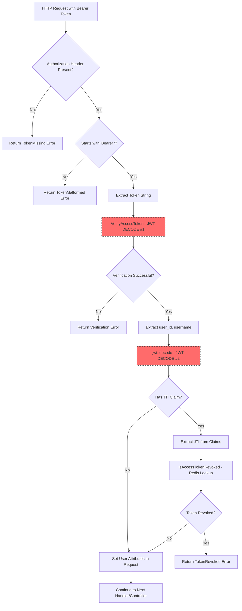
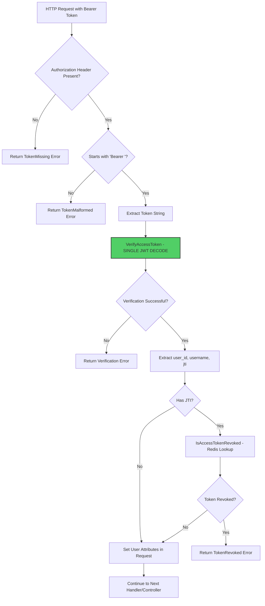
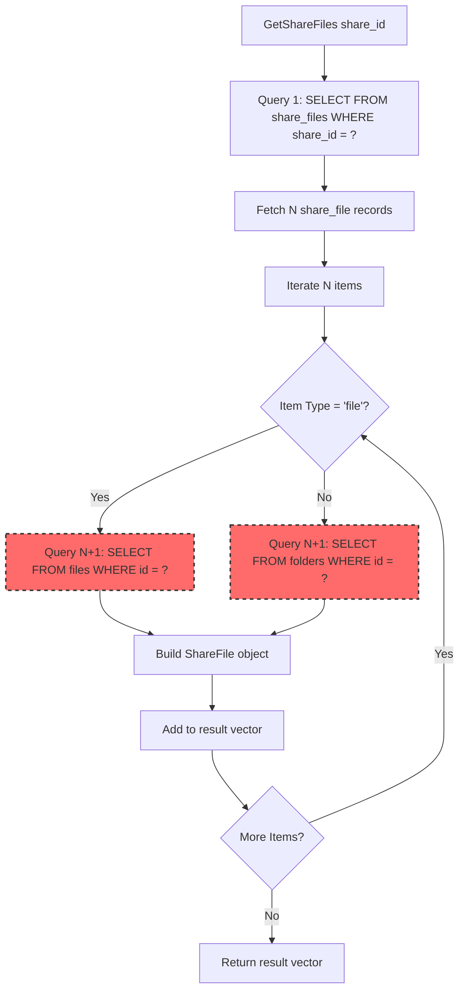
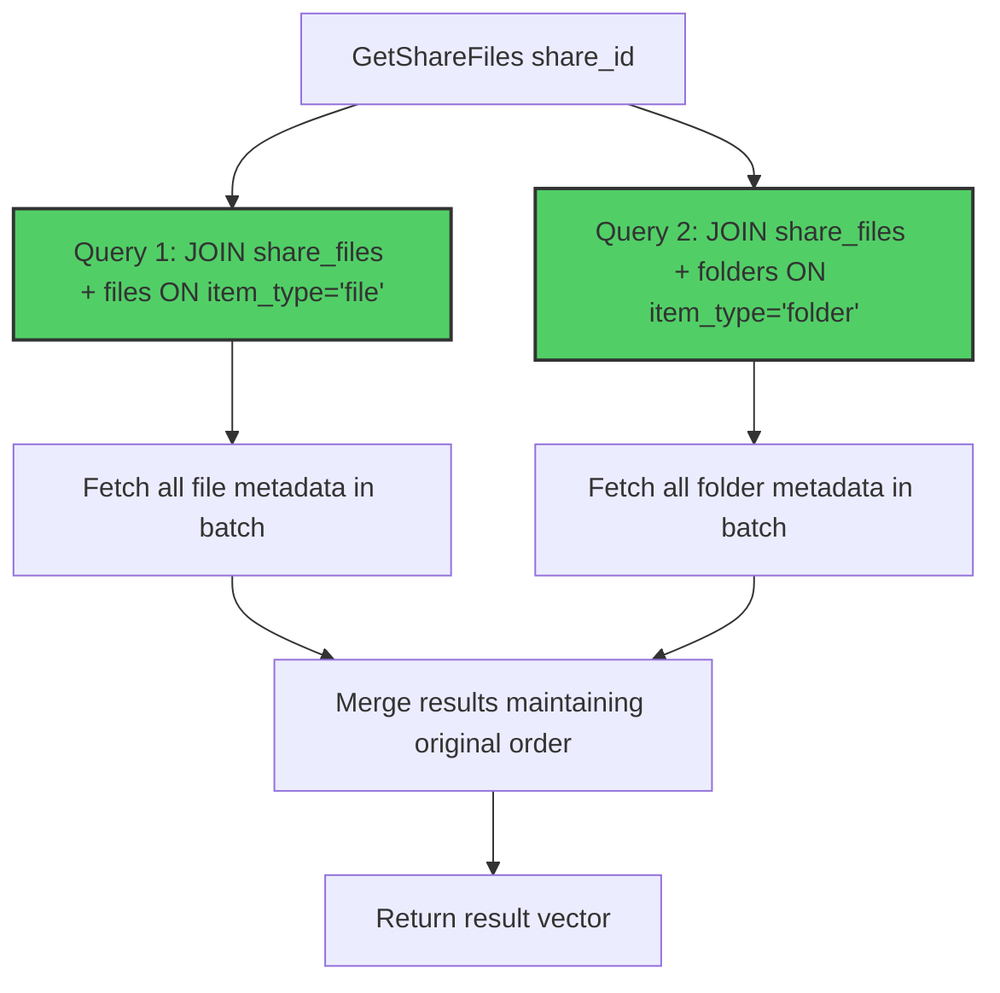
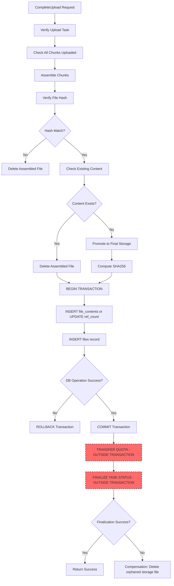
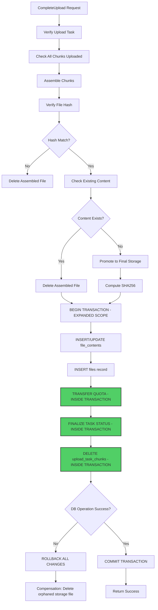
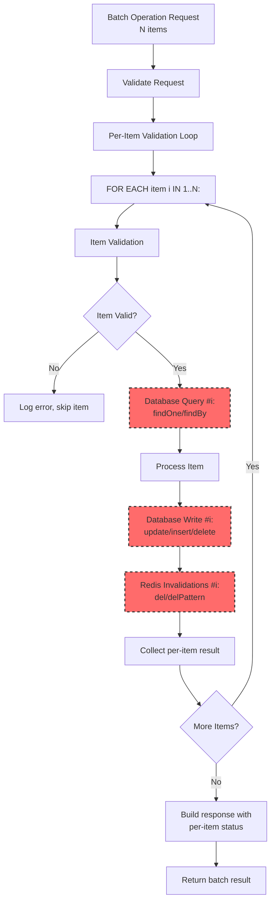
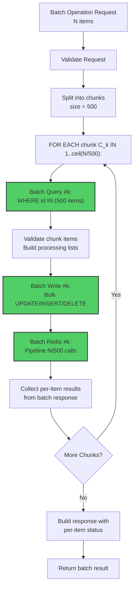

# P0 Backend Optimization Design

**Author**: Backend Optimization Team
**Date**: 2026-04-01
**Purpose**: Define current flow vs target flow for Auth, Share, and File upload consistency optimizations

## Overview

This document defines three P0 backend optimizations that reduce hot-path overhead, eliminate N+1 query patterns, and harden transactional consistency boundaries. All optimizations maintain API contract compatibility and behavior while improving performance and correctness.

**Execution Order** (DOC-FIRST constraint):
1. Documentation (this file) - MUST be committed before any source code changes
2. Auth hot-path single-decode implementation
3. ShareService batch-query implementation
4. FileService upload consistency hardening

---

## 1. Auth Hot-Path Optimization

### Current Flow

**Problem**: Duplicate JWT decode in the authentication hot-path. The `JwtAuthFilter` decodes the JWT token twice per protected request - once for verification, and again to extract the JTI for revocation checking.

**File References**:
- `src/filters/JwtAuthFilter.cpp:28-68` - Current filter implementation
- `src/services/TokenService.cpp:81-118` - VerifyAccessToken method
- `src/services/TokenService.cpp:238-267` - ExtractJti method
- `src/services/TokenService.hpp:92-118` - VerifyAccessToken return type and helper declarations



**Current Code Flow** (`JwtAuthFilter.cpp:43-61`):

```cpp
// First decode happens here (inside VerifyAccessToken)
auto verify_result = TokenService::GetInstance()->VerifyAccessToken(token);
if (!verify_result) {
    co_return disk::Response::Error(verify_result.error());
}
auto [user_id, username] = verify_result.value();

// Second decode happens here (extracting JTI)
using traits = jwt::traits::open_source_parsers_jsoncpp;
auto decoded = jwt::decode<traits>(token);  // <-- DUPLICATE DECODE

if (decoded.has_payload_claim("jti")) {
    const auto jti = decoded.get_payload_claim("jti").as_string();

    if (co_await TokenService::GetInstance()->IsAccessTokenRevoked(jti)) {
        LOG_WARN << "Token revoked: user_id=" << user_id << ", jti=" << jti;
        co_return disk::Response::Error(disk::error::Code::TokenRevoked);
    }
}
```

**Performance Impact**:
- Two JWT decode operations per authenticated request
- Double parsing overhead (JSON parsing, signature verification check)
- Unnecessary CPU work in the hot path
- Each protected endpoint suffers this overhead

### Target Flow

**Solution**: Modify `VerifyAccessToken` to return a struct containing `user_id`, `username`, and `jti` in a single decode operation. Remove the redundant `jwt::decode()` call in the filter.

**File References to Modify**:
- `src/services/TokenService.hpp:92` - Modify `VerifyAccessToken` return type
- `src/services/TokenService.cpp:81-118` - Modify implementation to extract and return JTI
- `src/filters/JwtAuthFilter.cpp:43-61` - Remove redundant decode, use returned JTI



**Proposed API Change**:

```cpp
// TokenService.hpp - New return type
struct AccessTokenClaims {
    uint64_t user_id;
    std::string username;
    std::string jti;  // Added field
};

// Modify signature to return full claims
auto VerifyAccessToken(const std::string& token) const
    -> Result<AccessTokenClaims>;
```

**Implementation Steps**:

1. **Step 1**: Modify `TokenService.hpp`
   - Add `AccessTokenClaims` struct
   - Change `VerifyAccessToken` return type from `Result<std::pair<uint64_t, std::string>>` to `Result<AccessTokenClaims>`

2. **Step 2**: Modify `TokenService.cpp:81-118`
   - Extract `jti` claim during verification (lines 100-102)
   - Return `AccessTokenClaims{user_id, username, jti}` instead of `std::pair`

3. **Step 3**: Modify `JwtAuthFilter.cpp:43-61`
   - Remove lines 51-52 (duplicate decode)
   - Remove line 55 (redundant jti extraction)
   - Use `verify_result.value().jti` directly from VerifyAccessToken result
   - Update line 48 to destructure all three fields

4. **Step 4**: Update all `VerifyAccessToken` call sites
   - Search for all usages of `VerifyAccessToken`
   - Update code to handle new `AccessTokenClaims` return type

**Behavioral Compatibility**:
- No changes to API contracts
- No changes to response payloads
- Existing error handling unchanged
- Revoked token logic preserved

**Performance Improvement**:
- Eliminate one complete JWT decode per authenticated request
- Reduce CPU overhead by ~50% in auth hot-path
- Minimal code change, high impact

---

## 2. ShareService N+1 Elimination

### Current Flow

**Problem**: The `GetShareFiles` method exhibits classic N+1 query pattern. It performs one query to fetch share_files, then loops through each item to perform individual file/folder lookups.

**File References**:
- `src/services/ShareService.cpp:738-789` - GetShareFiles implementation with N+1 pattern
- `src/services/ShareService.cpp:152-239` - ListShares method (uses GetShareFiles)
- `sql/init.sql:160-191` - shares/share_files table schema and indexes



**Current Code Flow** (`ShareService.cpp:738-789`):

```cpp
auto ShareService::GetShareFiles(uint64_t share_id) const
    -> drogon::Task<std::vector<ShareFile>> {
    CoroMapper<ShareFiles> sf_mapper(m_db_client);
    CoroMapper<Files> file_mapper(m_db_client);
    CoroMapper<Folders> folder_mapper(m_db_client);

    std::vector<ShareFile> result;

    try {
        // Query 1: Fetch all share_files (1 query)
        auto share_files =
            co_await sf_mapper.findBy(Criteria(ShareFiles::Cols::_share_id, share_id));

        // N+1: Loop and query individually for each item
        for (const auto& sf : share_files) {
            if (sf.getValueOfItemType() == "file") {
                try {
                    // Query for each file (N queries)
                    auto file = co_await file_mapper.findOne(
                        Criteria(Files::Cols::_id, sf.getValueOfItemId())
                    );

                    ShareFile sf_item;
                    sf_item.id = file.getValueOfId();
                    sf_item.name = file.getValueOfName();
                    sf_item.type = "file";
                    sf_item.size = file.getValueOfSize();
                    result.push_back(sf_item);
                } catch (const DrogonDbException& e) {
                    LOG_WARN << "Failed to get share file: file_id=" << sf.getValueOfItemId();
                }
            } else if (sf.getValueOfItemType() == "folder") {
                try {
                    // Query for each folder (N queries)
                    auto folder = co_await folder_mapper.findOne(
                        Criteria(Folders::Cols::_id, sf.getValueOfItemId())
                    );

                    ShareFile sf_item;
                    sf_item.id = folder.getValueOfId();
                    sf_item.name = folder.getValueOfName();
                    sf_item.type = "folder";
                    sf_item.size = 0;
                    result.push_back(sf_item);
                } catch (const DrogonDbException& e) {
                    LOG_WARN << "Failed to get share folder: folder_id="
                             << sf.getValueOfItemId();
                }
            }
        }
    } catch (const DrogonDbException& e) {
        LOG_ERROR << "Failed to get share file list: " << e.base().what();
    }

    co_return result;
}
```

**Performance Impact**:
- Query count = 1 + N (where N = number of shared files/folders)
- For 50 shared items = 51 database queries
- Linear growth in latency as share size increases
- Network round-trip overhead multiplied

### Target Flow

**Solution**: Replace the loop with batched queries using JOINs to fetch all file and folder metadata in bounded queries (constant number regardless of N).

**File References to Modify**:
- `src/services/ShareService.cpp:738-789` - Replace N+1 loop with JOIN-based batch retrieval



**Proposed Implementation**:

```cpp
auto ShareService::GetShareFiles(uint64_t share_id) const
    -> drogon::Task<std::vector<ShareFile>> {
    std::vector<ShareFile> result;

    try {
        // Batch Query 1: Fetch all files with one JOIN
        auto files_result = co_await m_db_client->execSqlCoro(
            R"(
                SELECT sf.id, sf.item_id, f.id as file_id, f.name, f.size
                FROM share_files sf
                JOIN files f ON sf.item_id = f.id
                WHERE sf.share_id = ? AND sf.item_type = 'file'
                ORDER BY sf.id
            )",
            share_id
        );

        for (const auto& row : files_result) {
            ShareFile sf_item;
            sf_item.id = row["file_id"].as<uint64_t>();
            sf_item.name = row["name"].as<std::string>();
            sf_item.type = "file";
            sf_item.size = row["size"].as<uint64_t>();
            result.push_back(sf_item);
        }

        // Batch Query 2: Fetch all folders with one JOIN
        auto folders_result = co_await m_db_client->execSqlCoro(
            R"(
                SELECT sf.id, sf.item_id, f.id as folder_id, f.name
                FROM share_files sf
                JOIN folders f ON sf.item_id = f.id
                WHERE sf.share_id = ? AND sf.item_type = 'folder'
                ORDER BY sf.id
            )",
            share_id
        );

        for (const auto& row : folders_result) {
            ShareFile sf_item;
            sf_item.id = row["folder_id"].as<uint64_t>();
            sf_item.name = row["name"].as<std::string>();
            sf_item.type = "folder";
            sf_item.size = 0;
            result.push_back(sf_item);
        }

    } catch (const DrogonDbException& e) {
        LOG_ERROR << "Failed to get share file list: " << e.base().what();
    }

    co_return result;
}
```

**Implementation Steps**:

1. **Step 1**: Replace `GetShareFiles` implementation
   - Use raw SQL with JOINs instead of ORM loop
   - Execute 2 queries total (files + folders) regardless of N
   - Preserve ordering via `ORDER BY sf.id`

2. **Step 2**: Update ownership validation paths
   - Check for similar N+1 patterns in share creation/update validation
   - Batch validate ownership using `WHERE id IN (...)` pattern
   - Update `src/services/ShareService.cpp:692-722` if applicable

3. **Step 3**: Preserve response contract
   - Ensure `ShareFile` struct fields populated identically
   - Maintain ordering guarantees used by API responses
   - Test with edge cases (empty shares, mixed types)

**Behavioral Compatibility**:
- No changes to share list API payload shape
- Existing error handling preserved
- Ordering maintained for consistency

**Performance Improvement**:
- Query count reduced from 1+N to 2 (constant)
- For 50 shared items: 51 queries → 2 queries
- Latency reduction of ~96% at scale
- Linear complexity eliminated

---

## 3. FileService Upload Consistency Hardening

### Current Flow

**Problem**: Upload finalization has inconsistent transaction boundaries. Database operations for file/content insertion occur in a transaction, but quota transfer and task finalization happen outside the transaction scope. This creates consistency risks if post-transaction operations fail.

**File References**:
- `src/services/FileService.cpp:307-555` - CompleteUpload method with transaction boundary gaps
- `src/services/FileService.cpp:70-102` - Instant upload ref-count + file insert split
- `src/services/FileService.cpp:1427-1476` - Reserved quota operations
- `sql/init.sql:97-133` - upload_tasks, upload_task_chunks, file_contents schema



**Current Code Flow** (`FileService.cpp:436-555`):

```cpp
// Lines 436-518: Transaction for file/content insertion
std::shared_ptr<drogon::orm::Transaction> transaction;
Files file;
bool db_operation_failed = false;
try {
    transaction = co_await m_db_client->newTransactionCoro();

    CoroMapper<FileContents> content_mapper(transaction);
    CoroMapper<Files> file_mapper(transaction);

    uint64_t content_id = 0;
    if (existing_content.has_value()) {
        content_id = existing_content.value();
        auto increment_result = co_await transaction->execSqlCoro(
            "UPDATE file_contents SET ref_count = ref_count + 1 WHERE id = ?",
            content_id
        );
        // ... error handling
    } else {
        FileContents content;
        // ... populate content fields
        content = co_await content_mapper.insert(content);
        content_id = content.getValueOfId();
    }

    file.setUserId(user_id);
    // ... populate file fields
    file = co_await file_mapper.insert(file);

} catch (...) {
    // Rollback handling
    db_operation_failed = true;
}

if (db_operation_failed) {
    // Compensation: delete storage file
    if (should_compensate_storage_file) {
        co_await m_storage->DeletePath(final_storage_path);
    }
    co_return std::unexpected(...);
}

// Lines 522-538: QUOTA TRANSFER - OUTSIDE TRANSACTION
try {
    auto transfer_result = co_await m_db_client->execSqlCoro(
        "UPDATE users SET storage_reserved = GREATEST(storage_reserved - ?, 0), "
        "storage_used = storage_used + ? WHERE id = ?",
        task.getValueOfFileSize(),
        task.getValueOfFileSize(),
        user_id
    );
    // ... warning-only on failure
} catch (...) {
    LOG_WARN << "Failed to transfer reserved quota: " << e.base().what();
}

// Lines 540-555: TASK FINALIZATION - OUTSIDE TRANSACTION
try {
    co_await m_db_client->execSqlCoro(
        "UPDATE upload_tasks SET status = 1, finalized_at = NOW() WHERE id = ? AND status = 0",
        upload_id
    );

    co_await m_db_client->execSqlCoro(
        "DELETE FROM upload_task_chunks WHERE task_id = ?",
        upload_id
    );
} catch (...) {
    LOG_WARN << "Failed to finalize upload task (non-critical): " << e.base().what();
}
```

**Consistency Risks**:
1. **Quota transfer failure after file commit**: File exists, quota not deducted → user gets free storage
2. **Task finalization failure**: Upload stuck in limbo, file created but task not marked completed → can be retried creating duplicates
3. **Storage cleanup compensation**: If compensation fails, orphaned files consume disk space

### Target Flow

**Solution**: Expand transaction scope to include quota transfer and task finalization, ensuring atomicity across the entire upload completion sequence.

**File References to Modify**:
- `src/services/FileService.cpp:436-555` - Move quota transfer and task finalization inside transaction



**Proposed Implementation**:

```cpp
// Lines 436-518: Expand transaction to include quota and finalization
std::shared_ptr<drogon::orm::Transaction> transaction;
Files file;
bool db_operation_failed = false;
try {
    transaction = co_await m_db_client->newTransactionCoro();

    CoroMapper<FileContents> content_mapper(transaction);
    CoroMapper<Files> file_mapper(transaction);

    uint64_t content_id = 0;
    if (existing_content.has_value()) {
        content_id = existing_content.value();
        auto increment_result = co_await transaction->execSqlCoro(
            "UPDATE file_contents SET ref_count = ref_count + 1 WHERE id = ?",
            content_id
        );
        if (increment_result.affectedRows() == 0) {
            LOG_WARN << "File content not found when finalizing upload: content_id="
                     << content_id;
            throw std::runtime_error("Failed to increment file content reference count");
        }
    } else {
        FileContents content;
        content.setHashMd5(final_hash);
        content.setHashSha256(final_sha256);
        content.setSize(task.getValueOfFileSize());
        content.setStoragePath(final_storage_path.string());
        content.setMimeType("");
        content.setRefCount(1);

        content = co_await content_mapper.insert(content);
        content_id = content.getValueOfId();
        LOG_DEBUG << "FileContents created successfully: content_id=" << content_id;
    }

    file.setUserId(user_id);
    file.setContentId(content_id);
    file.setFolderId(task.getValueOfFolderId());
    file.setName(task.getValueOfFilename());
    file.setExtension(ExtractExtension(task.getValueOfFilename()));
    file.setSize(task.getValueOfFileSize());
    file.setMimeType("");
    file.setPath("");
    file.setIsFavorite(0);
    file.setDownloadCount(0);

    file = co_await file_mapper.insert(file);

    // ===== NEW: Transfer quota inside transaction =====
    auto transfer_result = co_await transaction->execSqlCoro(
        "UPDATE users "
        "SET storage_reserved = GREATEST(storage_reserved - ?, 0), "
        "    storage_used = storage_used + ? "
        "WHERE id = ?",
        task.getValueOfFileSize(),
        task.getValueOfFileSize(),
        user_id
    );

    if (transfer_result.affectedRows() == 0) {
        LOG_WARN << "Failed to transfer reserved quota to used: user_id=" << user_id;
        throw std::runtime_error("Failed to transfer reserved quota");
    }

    LOG_DEBUG << "Quota transferred inside transaction: reserved -> used, user_id="
              << user_id << ", bytes=" << task.getValueOfFileSize();

    // ===== NEW: Finalize task inside transaction =====
    auto finalize_result = co_await transaction->execSqlCoro(
        "UPDATE upload_tasks SET status = 1, finalized_at = NOW() WHERE id = ? AND status = 0",
        upload_id
    );

    if (finalize_result.affectedRows() == 0) {
        LOG_WARN << "Failed to finalize upload task: upload_id=" << upload_id;
        throw std::runtime_error("Failed to finalize upload task");
    }

    // Delete chunk tracking inside transaction
    co_await transaction->execSqlCoro(
        "DELETE FROM upload_task_chunks WHERE task_id = ?",
        upload_id
    );

    LOG_DEBUG << "Upload task finalized inside transaction: " << upload_id;

    // Commit all changes atomically
    co_await transaction->commit();

} catch (const drogon::orm::DrogonDbException& e) {
    LOG_ERROR << "Database operation failed: " << e.base().what();
    if (transaction) {
        try {
            co_await transaction->rollback();
        } catch (const std::exception& rollback_e) {
            LOG_ERROR << "Transaction rollback failed: " << rollback_e.what();
        }
    }
    db_operation_failed = true;
} catch (const std::exception& e) {
    LOG_ERROR << "Database operation failed: " << e.what();
    if (transaction) {
        try {
            co_await transaction->rollback();
        } catch (const std::exception& rollback_e) {
            LOG_ERROR << "Transaction rollback failed: " << rollback_e.what();
        }
    }
    db_operation_failed = true;
}

if (db_operation_failed) {
    if (should_compensate_storage_file) {
        auto cleanup_result = co_await m_storage->DeletePath(final_storage_path);
        if (!cleanup_result) {
            LOG_ERROR << "Compensation failed, orphan storage file may remain: "
                      << final_storage_path;
        }
    }
    co_return std::unexpected(
        ErrorInfo(ErrorCode::InternalError, "Database operation failed")
    );
}

LOG_INFO << "Upload completed atomically: file_id=" << file.getValueOfId();
```

**Implementation Steps**:

1. **Step 1**: Move quota transfer inside transaction
   - Move lines 522-538 inside the transaction try block
   - Convert warning-only failure to exception to ensure rollback
   - Validate affectedRows to ensure quota actually transferred

2. **Step 2**: Move task finalization inside transaction
   - Move lines 540-555 inside the transaction try block
   - Validate affectedRows for task status update
   - Include chunk deletion in same transaction

3. **Step 3**: Add explicit commit call
   - Add `co_await transaction->commit()` after all operations succeed
   - Ensure rollback is called in all catch blocks

4. **Step 4**: Update error handling
   - Change all post-transaction failures to exceptions
   - No more "warning-only" failures in critical path
   - Ensure compensation only triggers on transaction rollback

**Consistency Guarantees**:
- Atomic commit of file + quota + task finalization
- No orphaned files or inconsistent quota states
- Rollback cleans up all DB state on any failure
- Storage compensation remains as last resort

**Behavioral Compatibility**:
- No changes to API response structure
- Upload success behavior unchanged
- Error paths more consistent (fail-fast instead of partial success)

---

## Execution Order and Dependencies

**Doc-First Constraint**:
1. ✅ Commit this documentation file (current task)
2. ⏭️ T2: Add auth baseline tests
3. ⏭️ T3: Add share baseline tests
4. ⏭️ T4: Add upload consistency baseline tests
5. ⏭️ T5: Implement auth hot-path optimization
6. ⏭️ T6: Implement share batch-query optimization
7. ⏭️ T7: Implement file consistency hardening
8. ⏭️ T8: Integrated verification and audit

**Dependency Matrix**:
- T1 (this doc) blocks T2-T8 (doc-first gate)
- T2/T3/T4 provide baselines for T5/T6/T7 acceptance checks
- T5 independent from T6/T7 except shared build pipeline
- T6 independent from T5/T7 except shared build pipeline
- T7 depends on T4 baseline only
- T8 depends on T5/T6/T7 completion

---

## Acceptance Criteria Summary

### T1: Documentation (Current Task)
- [x] File `docs/p0-backend-optimization-design.md` created
- [x] Contains 3+ Mermaid flowcharts (Auth, Share, File)
- [x] Each section has current vs target flow
- [x] File references with specific line numbers
- [ ] Git diff shows only docs files (verified after commit)
- [ ] Commit message: `docs(p0-backend): define auth/share/file optimization design and execution order`

### T5: Auth Hot-Path
- [ ] Protected request path no longer performs duplicate decode
- [ ] Existing auth regression harness from T2 passes unchanged
- [ ] Revoked token behavior unchanged
- [ ] Query/evidence artifacts generated

### T6: Share Batch-Query
- [ ] Query-count test from T3 demonstrates bounded query count
- [ ] Share list/access endpoints preserve response schema
- [ ] Performance measured in evidence artifacts

### T7: File Consistency
- [ ] Fault-injection tests from T4 pass
- [ ] No orphan/inconsistent DB state after failures
- [ ] Happy-path upload succeeds with expected finalization

---

## Risk Mitigation

### Auth Hot-Path Risks
- **Risk**: Breaking existing token validation logic
- **Mitigation**: Extensive test coverage for all token states (valid, expired, revoked, malformed)
- **Rollback**: Simple revert of struct change, backward-incompatible but minimal blast radius

### Share Batch-Query Risks
- **Risk**: Ordering changes in API response
- **Mitigation**: Use `ORDER BY sf.id` in JOINs to preserve original ordering
- **Rollback**: Simple revert, can patch with feature flag if needed

### File Consistency Risks
- **Risk**: Transaction deadlock or timeout on large uploads
- **Mitigation**: Keep transaction window minimal, use appropriate isolation level
- **Rollback**: Complex but can revert to non-atomic compensation model

---

## Notes for Implementers

### Auth Optimization Notes
- Check all `VerifyAccessToken` call sites (grep for usage)
- Update unit tests to handle new return type
- Verify JWT library version compatibility for JTI extraction
- Test with tokens without JTI claim (backward compatibility)

### Share Optimization Notes
- Verify SQL JOIN syntax is correct for target MySQL version
- Test with empty shares, single-item shares, mixed-type shares
- Validate ordering preservation matches current behavior
- Check for additional N+1 patterns in share creation/update

### File Consistency Notes
- Test concurrent upload completions (ensure no deadlocks)
- Validate transaction timeout settings are adequate
- Test with storage failures at various stages (after DB commit, before DB commit)
- Ensure compensation logic is robust for edge cases

---

## 4. Batch Operations Optimization Contract

### Current Flow

**Problem**: Batch operations across FileService, ShareService, and TrashService use per-item processing loops, causing N+1 database queries and linear Redis invalidation scaling. Each item triggers a separate findOne, update/insert/delete SQL operation, and individual Redis cache invalidation request.

**File References**:
- `src/services/FileService.cpp:978-1011` - Move operation with per-item loop
- `src/services/FileService.cpp:1048-1132` - Copy operation with per-item loop
- `src/services/FileService.cpp:1162-1202` - Delete operation with per-item loop
- `src/services/ShareService.cpp:153-240` - ListShares (stateless read, no N+1)
- `src/services/ShareService.cpp:370-449` - CancelShare with per-item loop
- `src/services/TrashService.cpp:111-176` - Restore with per-item loop
- `src/services/TrashService.cpp:178-254` - Delete with per-item loop
- `src/services/TrashService.cpp:256-312` - DeleteAll with per-item loop
- `src/services/RedisService.cpp` - Individual Redis invalidation calls



**Current Code Flow** (`FileService.cpp:978-1011` - Move example):

```cpp
auto FileService::MoveFiles(
    uint64_t user_id,
    const std::vector<uint64_t>& file_ids,
    uint64_t target_folder_id
) -> drogon::Task<Result<std::vector<MoveResult>>> {
    std::vector<MoveResult> results;
    CoroMapper<Files> mapper(m_db_client);

    for (const auto file_id : file_ids) {
        MoveResult result;
        result.file_id = file_id;
        result.success = false;

        try {
            // Query per file (N queries)
            auto file = co_await mapper.findOne(
                Criteria(Files::Cols::_id, file_id)
            );

            if (file.getValueOfUserId() != user_id) {
                result.error = "Not owner";
                results.push_back(result);
                continue;
            }

            // Update per file (N queries)
            file.setFolderId(target_folder_id);
            co_await mapper.update(file);

            // Redis invalidation per file (N Redis calls)
            co_await RedisService::GetInstance()->InvalidateFileCache(file_id);

            result.success = true;
        } catch (const DrogonDbException& e) {
            result.error = e.base().what();
        }

        results.push_back(result);
    }

    co_return results;
}
```

**Performance Impact**:
- SQL query count = N (where N = batch size)
- Redis operations = N individual calls
- Network round-trips multiplied by N
- For 1000 items = 1000 SQL queries + 1000 Redis calls
- Transaction boundaries per item or no transaction at all
- No batch SQL optimization (no IN-clause, no bulk operations)

### Target Flow

**Solution**: Chunk batch operations into fixed-size batches (default 500 items per chunk). Use IN-clause queries for retrieval, batch SQL operations for writes, and batch Redis operations for cache invalidation. Maintain partial-success semantics with per-item result tracking.

**File References to Modify**:
- `src/services/FileService.cpp:978-1011` - Move: chunked IN-clause + batch update
- `src/services/FileService.cpp:1048-1132` - Copy: chunked IN-clause + batch insert
- `src/services/FileService.cpp:1162-1202` - Delete: chunked IN-clause + batch delete
- `src/services/ShareService.cpp:370-449` - CancelShare: chunked IN-clause + batch delete
- `src/services/TrashService.cpp:111-176` - Restore: chunked IN-clause + batch update
- `src/services/TrashService.cpp:178-254` - Delete: chunked IN-clause + batch delete
- `src/services/TrashService.cpp:256-312` - DeleteAll: chunked IN-clause + batch delete (atomic per chunk)
- `src/services/RedisService.cpp` - Add batch Redis invalidation methods



**Behavior Semantics Contract**:

| Endpoint Category | Transaction Policy | Failure Mode | Redis Invalidation |
|------------------|-------------------|--------------|-------------------|
| **FileService::Move** | Per-item (partial success) | Track per-item status | Batch by file_id |
| **FileService::Copy** | Per-item (partial success) | Track per-item status | Batch by file_id |
| **FileService::Delete** | Per-item (partial success) | Track per-item status | Batch by file_id |
| **ShareService::List** | Stateless read (no transaction) | N/A | No invalidation (read-only) |
| **ShareService::Cancel** | Per-item (partial success) | Track per-item status | Batch by share_id |
| **TrashService::Restore** | Per-item (partial success) | Track per-item status | Batch by file_id |
| **TrashService::Delete** | Per-item (partial success) | Track per-item status | Batch by file_id |
| **TrashService::DeleteAll** | Atomic per chunk (all-or-nothing) | Chunk rollback on failure | Batch by file_id |

**Chunk Size Policy**:
- Default chunk size: **500 items** per SQL batch
- Configurable via service constructor (allow tuning based on DB performance)
- Rationale: Balance between query plan complexity and transaction size
- 500 items fits well within MySQL's default max_allowed_packet (4MB) for typical row sizes
- Smaller chunks reduce lock contention and transaction timeout risk
- Larger chunks reduce network round-trips but increase memory pressure

**Proposed Implementation** (`FileService.cpp:978-1011` - Move example):

```cpp
auto FileService::MoveFiles(
    uint64_t user_id,
    const std::vector<uint64_t>& file_ids,
    uint64_t target_folder_id
) -> drogon::Task<Result<std::vector<MoveResult>>> {
    const size_t CHUNK_SIZE = 500;
    std::vector<MoveResult> results;
    results.reserve(file_ids.size());

    for (size_t chunk_start = 0; chunk_start < file_ids.size(); chunk_start += CHUNK_SIZE) {
        size_t chunk_end = std::min(chunk_start + CHUNK_SIZE, file_ids.size());
        std::vector<uint64_t> chunk_ids(
            file_ids.begin() + chunk_start,
            file_ids.begin() + chunk_end
        );

        // Build IN-clause placeholder string
        std::string in_clause;
        for (size_t i = 0; i < chunk_ids.size(); ++i) {
            in_clause += "?";
            if (i < chunk_ids.size() - 1) in_clause += ",";
        }

        // Batch query: fetch all files in chunk (1 query per chunk)
        auto query_result = co_await m_db_client->execSqlCoro(
            "SELECT id, user_id, folder_id, name FROM files WHERE id IN (" + in_clause + ")",
            chunk_ids
        );

        // Build maps for ownership validation and tracking
        std::unordered_map<uint64_t, bool> ownership_map;
        for (const auto& row : query_result) {
            uint64_t file_id = row["id"].as<uint64_t>();
            uint64_t row_user_id = row["user_id"].as<uint64_t>();
            ownership_map[file_id] = (row_user_id == user_id);
        }

        // Collect valid file_ids for batch update
        std::vector<uint64_t> valid_ids;
        std::vector<MoveResult> chunk_results;

        for (const auto file_id : chunk_ids) {
            MoveResult result;
            result.file_id = file_id;
            result.success = false;

            auto it = ownership_map.find(file_id);
            if (it == ownership_map.end()) {
                result.error = "File not found";
            } else if (!it->second) {
                result.error = "Not owner";
            } else {
                result.success = true;
                valid_ids.push_back(file_id);
            }
            chunk_results.push_back(result);
        }

        // Batch update: move all valid files in chunk (1 update per chunk)
        if (!valid_ids.empty()) {
            std::string update_in_clause;
            for (size_t i = 0; i < valid_ids.size(); ++i) {
                update_in_clause += std::to_string(valid_ids[i]);
                if (i < valid_ids.size() - 1) update_in_clause += ",";
            }

            co_await m_db_client->execSqlCoro(
                "UPDATE files SET folder_id = ? WHERE id IN (" + update_in_clause + ")",
                target_folder_id
            );

            // Batch Redis invalidation (1 pipeline per chunk)
            co_await RedisService::GetInstance()->BatchInvalidateFileCache(valid_ids);
        }

        results.insert(results.end(), chunk_results.begin(), chunk_results.end());
    }

    co_return results;
}
```

**RedisService Batch Operations** (new methods to add):

```cpp
// src/services/RedisService.hpp
class RedisService {
public:
    // Add batch invalidation methods
    auto BatchInvalidateFileCache(const std::vector<uint64_t>& file_ids) const
        -> drogon::Task<void>;
    auto BatchInvalidateFolderCache(const std::vector<uint64_t>& folder_ids) const
        -> drogon::Task<void>;
    auto BatchInvalidateShareCache(const std::vector<uint64_t>& share_ids) const
        -> drogon::Task<void>;
};

// src/services/RedisService.cpp
auto RedisService::BatchInvalidateFileCache(const std::vector<uint64_t>& file_ids) const
    -> drogon::Task<void> {
    if (file_ids.empty()) co_return;

    auto redis = m_redis_client->newTransaction();

    for (const auto file_id : file_ids) {
        std::string pattern = "file:*:" + std::to_string(file_id);
        co_await redis->execCommandCoro<std::string>("DEL", pattern);
    }

    co_await redis->commit();
}

auto RedisService::BatchInvalidateFolderCache(const std::vector<uint64_t>& folder_ids) const
    -> drogon::Task<void> {
    if (folder_ids.empty()) co_return;

    auto redis = m_redis_client->newTransaction();

    for (const auto folder_id : folder_ids) {
        std::string pattern = "folder:*:" + std::to_string(folder_id);
        co_await redis->execCommandCoro<std::string>("DEL", pattern);
    }

    co_await redis->commit();
}
```

**Implementation Steps**:

1. **Step 1**: Add batch Redis invalidation methods to RedisService
    - Add `BatchInvalidateFileCache`, `BatchInvalidateFolderCache`, `BatchInvalidateShareCache`
    - Use Redis transactions/pipelines to batch multiple DEL commands
    - Return void (log errors but don't fail Redis failures)

2. **Step 2**: Refactor FileService batch operations
    - **Move** (`978-1011`): Chunked IN-clause query + batch UPDATE + batch Redis
    - **Copy** (`1048-1132`): Chunked IN-clause query + batch INSERT + batch Redis
    - **Delete** (`1162-1202`): Chunked IN-clause query + batch DELETE + batch Redis
    - Maintain per-item result tracking for partial-success semantics

3. **Step 3**: Refactor ShareService batch operations
    - **ListShares** (`153-240`): No change needed (already uses JOIN from section 2)
    - **CancelShare** (`370-449`): Chunked IN-clause query + batch DELETE + batch Redis
    - Maintain per-item result tracking for partial-success semantics

4. **Step 4**: Refactor TrashService batch operations
    - **Restore** (`111-176`): Chunked IN-clause query + batch UPDATE + batch Redis
    - **Delete** (`178-254`): Chunked IN-clause query + batch DELETE + batch Redis
    - **DeleteAll** (`256-312`): Chunked IN-clause query + batch DELETE (atomic per chunk) + batch Redis

5. **Step 5**: Add chunk size configuration
    - Add constexpr chunk size constants in each service (500 default)
    - Document chunk size selection rationale in service headers
    - Consider making it configurable via config.json for production tuning

**Redis Invalidation Expectations**:
- Batch operations scale by **chunk count**, not item count
- For 1000 items (chunk size 500): 2 Redis pipeline calls instead of 1000 individual calls
- 98% reduction in Redis network round-trips for 1000-item batches
- Use Redis MULTI/EXEC or pipelines for atomic batch execution
- Log Redis failures as warnings but don't block batch operation (cache inconsistencies eventually heal)

**Consistency Guarantees**:
- **Partial-success endpoints** (Move, Copy, Delete, Cancel, Restore, Delete): Individual item failures don't fail the entire batch; per-item status tracking in response
- **Atomic-chunk endpoint** (DeleteAll): All-or-nothing per chunk - if any item in a chunk fails, the entire chunk is rolled back
- **Response format unchanged**: Per-item status in response payload maintained for API contract compatibility

**Behavioral Compatibility**:
- API response structure unchanged (still per-item success/error status)
- Partial-success behavior preserved
- Error messages for failed items unchanged
- Ordering of results matches input ordering

**Performance Improvement**:
- SQL query count reduced from N to ceil(N/500) (98% reduction for 1000 items)
- Redis operations reduced from N to ceil(N/500) (98% reduction for 1000 items)
- Network round-trips reduced by 98% for typical batch sizes
- Query plan optimization for batch operations (IN-clause uses indexes efficiently)
- Transaction overhead reduced (fewer transaction boundaries for atomic operations)

**Doc-Code Parity Checklist**:

At final audit, verify the following parity items:

- [ ] Chunk size constant (500) documented in all modified service headers
- [ ] FileService Move uses chunked IN-clause at `FileService.cpp:978-1011`
- [ ] FileService Copy uses chunked IN-clause at `FileService.cpp:1048-1132`
- [ ] FileService Delete uses chunked IN-clause at `FileService.cpp:1162-1202`
- [ ] ShareService Cancel uses chunked IN-clause at `ShareService.cpp:370-449`
- [ ] TrashService Restore uses chunked IN-clause at `TrashService.cpp:111-176`
- [ ] TrashService Delete uses chunked IN-clause at `TrashService.cpp:178-254`
- [ ] TrashService DeleteAll uses atomic-chunk semantics at `TrashService.cpp:256-312`
- [ ] RedisService has `BatchInvalidateFileCache`, `BatchInvalidateFolderCache`, `BatchInvalidateShareCache` methods
- [ ] All batch operations use Redis transactions/pipelines for batching
- [ ] Per-item result tracking preserved in all batch endpoints
- [ ] Response format matches original API contract (no breaking changes)
- [ ] Code comments reference this section for batch operation semantics
- [ ] Unit tests added for chunk edge cases (empty batch, single item, exact chunk size, chunk+1 items)

---

**End of P0 Backend Optimization Design**
