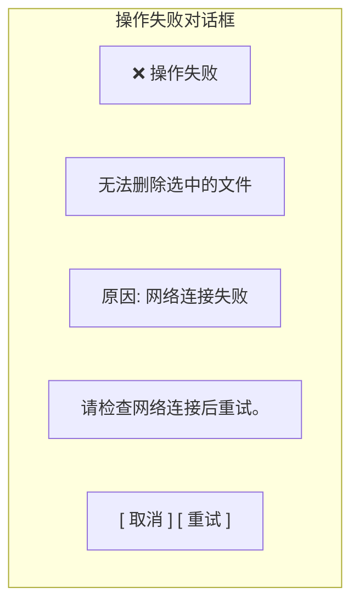

# 对话框组件设计 (v2.0)

## 概述

对话框是 Disk 客户端中用于确认操作、收集用户输入和显示进度的通用组件。参考百度网盘对话框风格，提供统一的视觉体验和流畅的交互反馈。

**视觉风格**: 圆角卡片 + 清晰层级 + 平滑动效

---

## 对话框规格

### 基础规格

| 属性 | 值 | 说明 |
|------|------|------|
| 圆角 | 16px | 大圆角，现代感 |
| 阴影 | 0 8px 32px rgba(0,0,0,0.16) | 悬浮感 |
| 遮罩 | rgba(0, 0, 0, 0.45) | 半透明遮罩 |
| 动画时长 | 200ms | 出现/消失动画 |
| 动画曲线 | cubic-bezier(0.16, 1, 0.3, 1) | 弹性缓动 |

### 尺寸规格

| 类型 | 宽度 | 最大高度 | 说明 |
|------|------|----------|------|
| 确认对话框 | 400px | 自适应 | 简单确认操作 |
| 输入对话框 | 450px | 自适应 | 需要用户输入 |
| 进度对话框 | 500px | 自适应 | 显示进度信息 |
| 创建对话框 | 520px | 600px | 复杂创建操作 |
| 全屏对话框 | 800px | 80vh | 复杂内容展示 |

---

## 确认对话框

### 基础确认对话框

```mermaid
flowchart TD
    subgraph BasicConfirm["基础确认对话框"]
        Icon1["⚠️ 确认删除"]
        Question1["确定要删除 \"年度报告.docx\" 吗？"]
        Note1["此操作将移入回收站，可在 30 天内恢复。"]
        Buttons1["[取消] [确认删除]"]
    end
end
```

### 危险操作确认

```mermaid
flowchart TD
    subgraph DangerConfirm["危险操作确认对话框"]
        Icon2["🗑️ 彻底删除"]
        Question2["确定要彻底删除选中的 3 个项目吗？"]
        Warning2["⚠️ 此操作无法撤销！"]
        FileList2["• 年度报告.docx (2.3 MB)<br/>• 项目文档 (156 MB)<br/>• 团队合影.jpg (5.6 MB)"]
        Buttons2["              [  取消  ]  [  彻底删除  ]"]
        ButtonStyle["              Secondary   Error Primary"]
    end
end
```

### 批量操作确认

```mermaid
flowchart TD
    subgraph BatchDownload["批量下载确认对话框"]
        Icon3["⬇ 批量下载"]
        Info3["将打包下载以下 5 个项目："]
        FileList3["📄 年度报告.docx<br/>📄 需求文档.docx<br/>📁 项目文档<br/>📷 团队合影.jpg<br/>📊 数据统计.xlsx"]
        Size3["预估大小: 167.5 MB"]
        Buttons3["              [  取消  ]  [  开始下载  ]"]
    end
end
```

---

## 输入对话框

### 新建文件夹

```mermaid
flowchart TD
    subgraph NewFolder["新建文件夹对话框"]
        Icon4["📁 新建文件夹"]
        Label4["文件夹名称"]
        Input4["[新建文件夹                    ]"]
        Location4["将在: /工作/文档 下创建"]
        Buttons4["              [  取消  ]  [  创建  ]"]
    end
end
```

### 重命名

```mermaid
flowchart TD
    subgraph RenameDialog["重命名对话框"]
        Icon5["✏ 重命名"]
        OriginalName["原名称: 年度报告.docx"]
        Label5["新名称"]
        Input5["年度报告_v2.docx"]
        Buttons5["              [  取消  ]  [  重命名  ]"]
    end
end
```

### 移动到/复制到

```mermaid
flowchart TD
    subgraph MoveToDialog["移动到对话框"]
        Icon6["📁 移动到..."]
        Info6["将移动 3 个项目到："]
        CurrentPath["当前位置: /工作"]
        FolderTree["📁 全部文件<br/>  📁 工作 ← 当前<br/>    📁 文档 ✓ 选中<br/>    📁 项目<br/>  📁 个人<br/>  📁 备份"]
        Selected6["选中: /工作/文档"]
        Buttons6["        [  取消  ]  [  新建文件夹  ]  [  移动  ]"]
    end
end
```

### 重命名

```mermaid
flowchart TD
    subgraph RenameDialog["重命名对话框"]
        Icon5["✏ 重命名"]
        OriginalName["原名称: 年度报告.docx"]
        Label5["新名称"]
        Input5["年度报告_v2.docx"]
        Buttons5["              [  取消  ]  [  重命名  ]"]
    end
end
```

### 移动到/复制到

```mermaid
flowchart TD
    subgraph MoveToDialog["移动到对话框"]
        Icon6["📁 移动到..."]
        Info6["将移动 3 个项目到： FolderTree["📁 全部文件<br/>  📁 工作 ← 当前<br/>    📁 文档 ✓ 选中<br/>    📁 项目<br/>  📁 个人<br/>  📁 备份"]
        Selected6["选中: /工作/文档"]
        Buttons6["        [  取消  ]  [  新建文件夹  ]  [  移动  ]"]
    end
end
```

---

## 进度对话框

### 上传/下载进度

```mermaid
flowchart TD
    subgraph UploadProgress["上传进度对话框"]
        Icon7["⬆ 上传中"]
        FileInfo7["文件: 项目文档.zip<br/>大小: 125.6 MB"]
        ProgressBar7["████████████████████░░░░░░░░░░░░░░░░░<br/>           67%"]
        Stats7["已上传: 84.2 MB<br/>速度: 2.1 MB/s<br/>剩余时间: 约 20 秒"]
        Buttons7["              [  取消上传  ]"]
    end
end
```

### 批量操作进度

```mermaid
flowchart TD
    subgraph BatchProgress["批量操作进度对话框"]
        Icon8["⏳ 正在删除..."]
        Progress8["进度: 2 / 5"]
        ProgressBar8["██████████████░░░░░░░░░░░░░░░░░░░░░░░<br/>              40%"]
        Current8["当前: 正在删除 \"项目文档\"..."]
        Completed8["已完成:<br/>✓ 年度报告.docx<br/>✓ 团队合影.jpg"]
        Buttons8["              [  取消  ]"]
    end
end
```

### 移动到/复制到

```mermaid
flowchart TD
    subgraph MoveToDialog["移动到对话框"]
        Icon6["📁 移动到..."]
        Info6["将移动 3 个项目到:"]
        CurrentPath["当前位置: /工作"]
        FolderTree["📁 全部文件<br/>  📁 工作 ← 当前<br/>    📁 文档 ✓ 选中<br/>    📁 项目<br/>  📁 个人<br/>  📁 备份"]
        Selected6["选中: /工作/文档"]
        Buttons6["        [  取消  ]  [  新建文件夹  ]  [  移动  ]"]
    end
end
```

---

## 进度对话框

### 上传/下载进度

```mermaid
flowchart TD
    subgraph UploadProgress["上传进度对话框"]
        Icon7["⬆ 上传中"]
        FileInfo7["文件: 项目文档.zip<br/>大小: 125.6 MB"]
        ProgressBar7["████████████████████░░░░░░░░░░░░░░░░░<br/>           67%"]
        Stats7["已上传: 84.2 MB<br/>速度: 2.1 MB/s<br/>剩余时间: 约 20 秒"]
        Buttons7["              [  取消上传  ]"]
    end
end
```

### 批量操作进度

```mermaid
flowchart TD
    subgraph BatchProgress["批量操作进度对话框"]
        Icon8["⏳ 正在删除..."]
        Progress8["进度: 2 / 5"]
        ProgressBar8["██████████████░░░░░░░░░░░░░░░░░░░░░░░<br/>              40%"]
        Current8["当前: 正在删除 \"项目文档\"..."]
        Completed8["已完成:<br/>✓ 年度报告.docx<br/>✓ 团队合影.jpg"]
        Buttons8["              [  取消  ]"]
    end
end
```

---

## 成功/错误提示

### 操作成功

```mermaid
flowchart TD
    subgraph SuccessDialog["操作成功对话框"]
        Icon9["✅ 操作成功"]
        Message9["已成功创建分享链接"]
        Note9["链接已复制到剪贴板"]
        Buttons9["                   [  确定  ]"]
    end
end
```

---

## 进度对话框

### 上传/下载进度

```mermaid
flowchart TD
    subgraph UploadProgress["上传进度对话框"]
        Icon7["⬆ 上传中"]
        FileInfo7["文件: 项目文档.zip<br/>大小: 125.6 MB"]
        ProgressBar7["████████████████████░░░░░░░░░░░░░░░░░<br/>           67%"]
        Stats7["已上传: 84.2 MB<br/>速度: 2.1 MB/s<br/>剩余时间: 约 20 秒"]
        Buttons7["              [  取消上传  ]"]
    end
end
```

### 批量操作进度

```mermaid
flowchart TD
    subgraph BatchProgress["批量操作进度对话框"]
        Icon8["⏳ 正在删除..."]
        Progress8["进度: 2 / 5"]
        ProgressBar8["██████████████░░░░░░░░░░░░░░░░░░░░░░░<br/>              40%"]
        Current8["当前: 正在删除 \"项目文档\"..."]
        Completed8["已完成:<br/>✓ 年度报告.docx<br/>✓ 团队合影.jpg"]
        Buttons8["              [  取消  ]"]
    end
end
```

### 批量操作进度

```mermaid
flowchart TD
    subgraph BatchProgress["批量操作进度对话框"]
        Icon8["⏳ 正在删除..."]
        Progress8["进度: 2 / 5"]
        ProgressBar8["██████████████░░░░░░░░░░░░░░░░░░░░░░░<br/>              40%"]
        Current8["当前: 正在删除 \"项目文档\"..."]
        Completed8["已完成:<br/>✓ 年度报告.docx<br/>✓ 团队合影.jpg"]
        Buttons8["              [  取消  ]"]
    end
```

---

## 成功/错误提示

### 操作成功

```mermaid
flowchart TD
    subgraph SuccessDialog["操作成功对话框"]
        Icon9["✅ 操作成功"]
        Message9["已成功创建分享链接"]
        Note9["链接已复制到剪贴板"]
        Buttons9["                   [  确定  ]"]
    end
end
```

### 操作失败

```mermaid
flowchart TD
    subgraph ErrorDialog["操作失败对话框"]
        Icon10["❌ 操作失败"]
        Message10["无法删除选中的文件"]
        Reason10["原因: 网络连接失败"]
        Suggestion10["请检查网络连接后重试。"]
        Buttons10["              [  取消  ]  [  重试  ]"]
    end
end
```

### 操作失败



---

## 创建分享对话框

```mermaid
flowchart TD
    subgraph CreateShareDialog["创建分享对话框"]
        Icon11["🔗 创建分享"]
        
        subgraph ShareContent["分享内容"]
            FileList11["📄 年度报告.docx<br/>📄 需求文档.docx<br/>📁 项目文档 (文件夹)"]
        end
        
        subgraph ExpirySettings["有效期"]
            Select11["7 天 ▼"]
        end
        
        subgraph PermissionSettings["访问权限"]
            Option1["○ 仅可查看"]
            Option2["● 可查看和下载"]
        end
        
        subgraph PasswordSettings2["访问密码 (可选)"]
            Input11["xK9m"]
            Checkbox11["☑️ 自动生成访问密码"]
        end
        
        Buttons11["              [  取消  ]  [  创建分享  ]"]
    end
end
```

---

## 分享成功对话框

```mermaid
flowchart TD
    subgraph ShareSuccessDialog["分享成功对话框"]
        Icon12["✅ 分享已创建"]
        
        subgraph ShareLinkSection["分享链接"]
            LinkLabel12["分享链接"]
            Link12["https://disk.app/s/abc123xyz"]
            CopyLink12["[📋 复制链接]"]
        end
        
        PasswordSection["访问密码: xK9m [📋 复制链接和密码]"]
        Validity12["有效期: 7 天 (至 2026-03-22)"]
        Permission12["访问权限: 可查看和下载"]
        Buttons12["[在浏览器打开]        [  完成  ]"]
    end
end
```

---

## 文件预览对话框

```mermaid
flowchart TD
    subgraph FilePreviewDialog["文件预览对话框"]
        Title13["年度报告.docx                                      [下载] [分享] [✕]"]
        
        subgraph PreviewArea["预览区域"]
            Icon13["📄 文件预览"]
            FileName13["年度报告.docx<br/>Word 文档 · 2.3 MB"]
            Note13["此文件类型暂不支持预览"]
            DownloadBtn13["[下载到本地查看]"]
        end
        
        Meta13["文件名: 年度报告.docx<br/>大小: 2.3 MB<br/>类型: Word 文档<br/>创建时间: 2026-03-15 10:23:45<br/>修改时间: 2026-03-16 14:32:12"]
    end
end
```

---

## Toast 轻提示

### 成功提示

```mermaid
flowchart LR
    subgraph ToastSuccess["成功提示"]
        Toast14["✅ 删除成功"]
    end
```

### 错误提示

```mermaid
flowchart LR
    subgraph ToastError["错误提示"]
        Toast15["❌ 网络连接失败"]
    end
```

### 加载提示

```mermaid
flowchart LR
    subgraph ToastLoading["加载提示"]
        Toast16["⏳ 正在加载..."]
    end
```

**规格**:
- 位置: 页面右上角或中央
- 时长: 3 秒后自动消失
- 动画: 滑入 + 淡出

---

## 按钮布局规范

### 标准布局

```mermaid
flowchart LR
    subgraph StandardLayout["标准按钮布局"]
        Buttons17["[取消]  [确认]"]
        Labels17["左对齐   右对齐<br/>Secondary  Primary"]
    end
```

### 危险操作布局

```mermaid
flowchart LR
    subgraph DangerLayout["危险操作按钮布局"]
        Buttons18["[取消]  [删除]"]
        Labels18["Secondary  Error"]
    end
```

### 三按钮布局

```mermaid
flowchart LR
    subgraph ThreeButtonLayout["三按钮布局"]
        Buttons19["[取消]  [次要操作]  [主要操作]"]
    end
```

---

## 图标使用规范

| 场景 | 图标 | 颜色 |
|------|------|------|
| 确认/警告 | ⚠️ | Warning |
| 删除/危险 | 🗑️ | Error |
| 成功 | ✅ | Success |
| 失败 | ❌ | Error |
| 信息 | ℹ️ | Info |
| 输入 | ✏️ | Primary |
| 分享 | 🔗 | Primary |
| 新建 | 📁 | Primary |
| 上传 | ⬆️ | Primary |
| 下载 | ⬇️ | Primary |
| 进度 | ⏳ | Primary |

---

## 动画规范

### 出现动画

```
0ms -> 50ms -> 100ms -> 150ms -> 200ms

遮罩: opacity 0 -> 0.3 -> 0.5 -> 0.45 -> 0.45
对话框: scale 0.9 -> 0.95 -> 0.98 -> 1.0 -> 1.0
对话框: opacity 0 -> 0.5 -> 0.8 -> 1.0 -> 1.0
```

### 消失动画

```
0ms -> 100ms -> 150ms -> 200ms

对话框: opacity 1.0 -> 0.5 -> 0.0 -> 0.0
对话框: scale 1.0 -> 0.95 -> 0.9 -> 0.9
遮罩: opacity 0.45 -> 0.2 -> 0.0 -> 0.0
```

---

## 键盘交互

| 按键 | 功能 |
|------|------|
| Enter/Return | 确认主操作 |
| Escape | 取消/关闭 |
| Tab | 切换焦点 |
| Shift + Tab | 反向切换焦点 |

---

## 相关文档

- [主窗口设计](main-window.md) - 整体窗口布局
- [界面设计规范](../qml/02-界面设计规范.md) - 设计系统

---

*版本: v2.0*
*最后更新: 2026-03-16*
*设计方向: 参考百度网盘现代化界面*
