# 登录页面设计 (v2.0)

## 概述

登录页面是用户进入 Disk 网盘系统的入口，支持用户名或邮箱登录。采用现代化的双区布局设计，左侧装饰区营造品牌氛围，右侧表单卡片承载核心交互。

**视觉风格**: 渐变背景 + 玻璃态卡片 + 流畅动效

---

## 整体布局

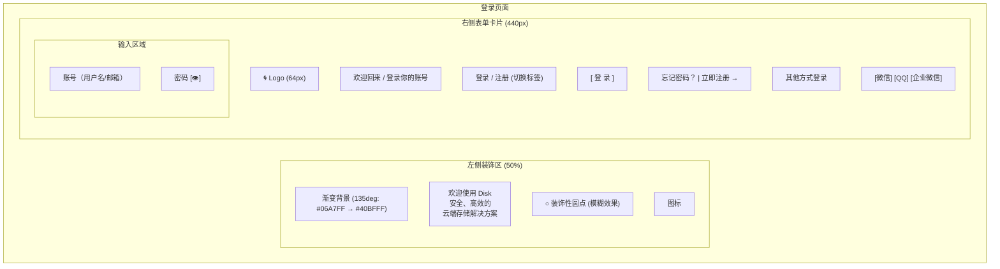

---

## 左侧装饰区

### 视觉设计

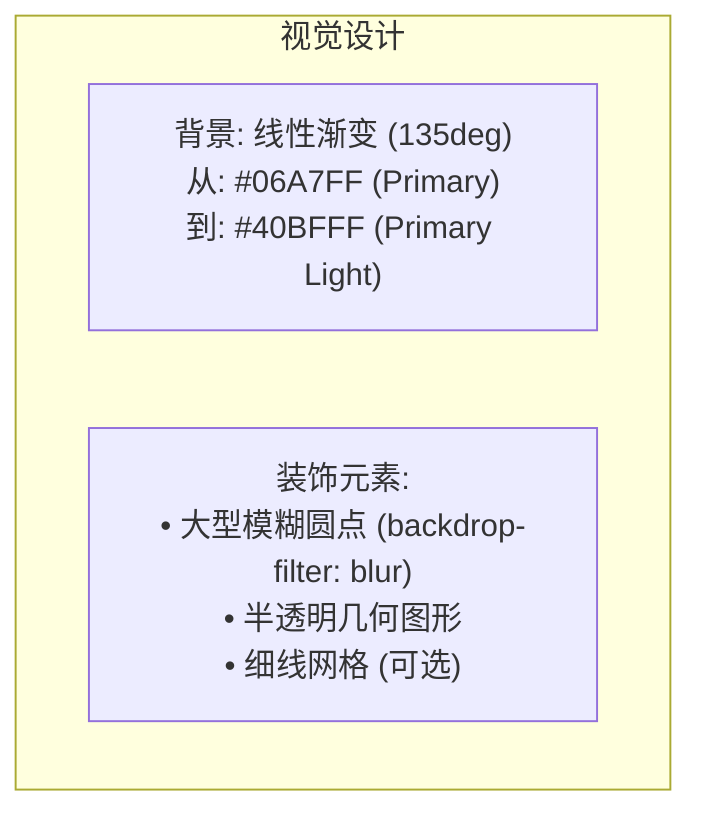

### 内容展示

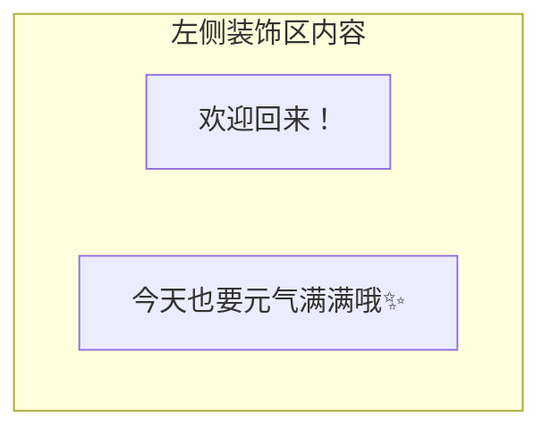

**装饰元素**:
- 大型模糊椭圆 (半透明白色圆点)
- 背景渐变: 从 `palette.highlight` 到较浅色调

---

## 右侧表单区

### Logo 区域

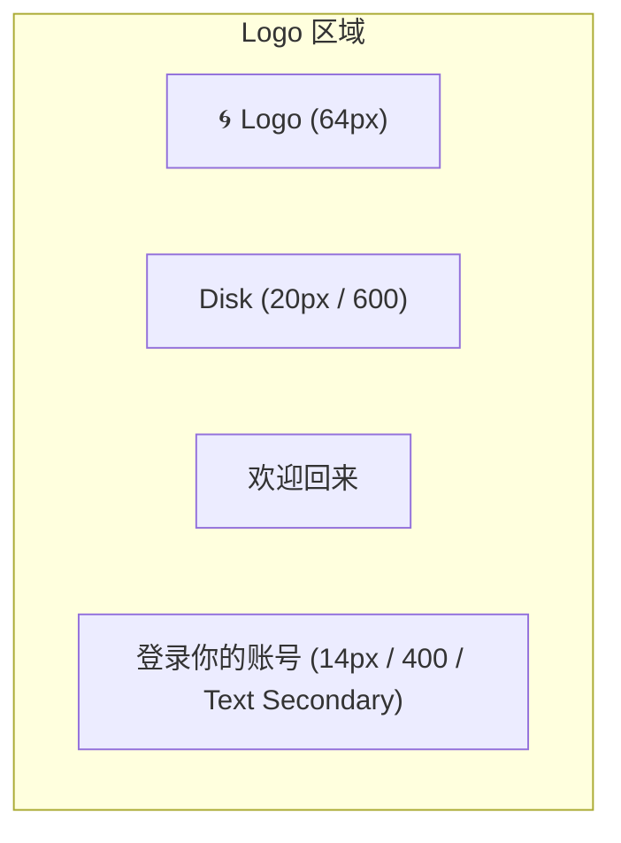

### 登录/注册切换

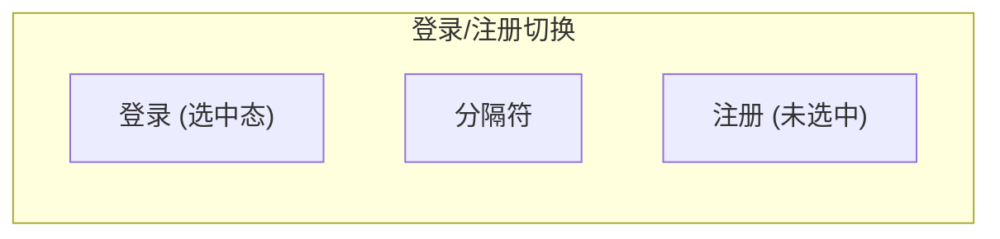

- 高度: 40px
- 选中: Primary 文字 + 下划线
- 未选中: Text Secondary
- 切换动画: 下划线滑动 200ms

### 输入框设计

#### 账号输入框

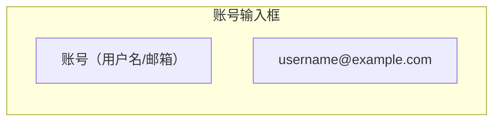

- 高度: 52px
- 圆角: 12px
- 聚焦: Primary 边框 + 浅色背景
- 未聚焦: 浅灰色边框 + 浅色背景

#### 密码输入框

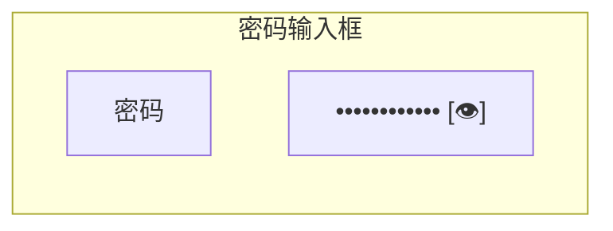

- 高度: 52px
- 圆角: 12px
- 显示/隐藏按钮: 眼睛图标，右侧 16px（切换显示/隐藏密码）

### 登录按钮

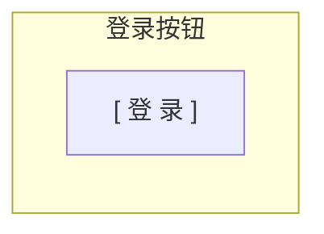

- 高度: 52px
- 圆角: 12px
- 背景: Primary (#06A7FF)
- 文字: 白色 16px / 600
- 悬停: Primary Hover + Scale 1.02
- 按下: Scale 0.98

**加载状态**:

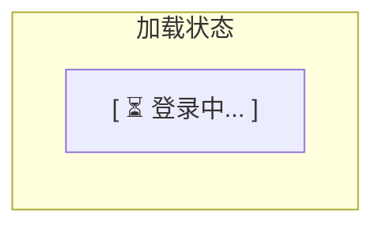

- 显示加载动画
- 按钮禁用

### 错误提示

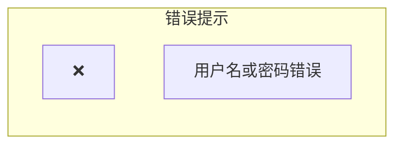

- 错误文字: 红色 (#F44336)
- 仅在出现错误时显示
- 通过 ViewModel 的 errorMessage 属性控制

---

## 表单验证与反馈

### 验证规则

| 字段 | 验证规则 | 错误提示 |
|------|----------|----------|
| 账号 | 非空 | 请输入用户名或邮箱 |
| 密码 | 非空 | 请输入密码 |

### 错误提示

- 错误文字: 红色 (#F44336)
- 12px 字体
- 自动换行
- 通过 ViewModel 的 errorMessage 属性控制显示

### 错误类型

| 错误类型 | 提示信息 |
|----------|----------|
| 用户不存在 | 用户不存在 |
| 密码错误 | 用户名或密码错误 |
| 账户锁定 | 账户已锁定，请 15 分钟后重试 |
| 网络错误 | 网络连接失败，请检查网络 |
| 服务不可用 | 服务暂时不可用，请稍后重试 |

---

## 动画效果

### 页面加载动画

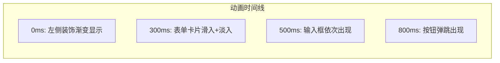

### 输入框聚焦动画

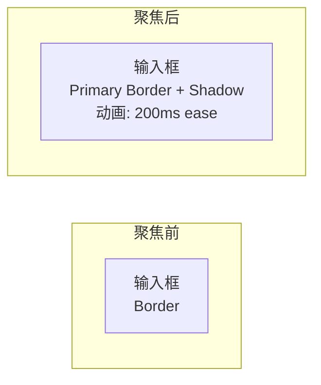

---

## 响应式适配

### 平板/小屏幕 (< 1024px)

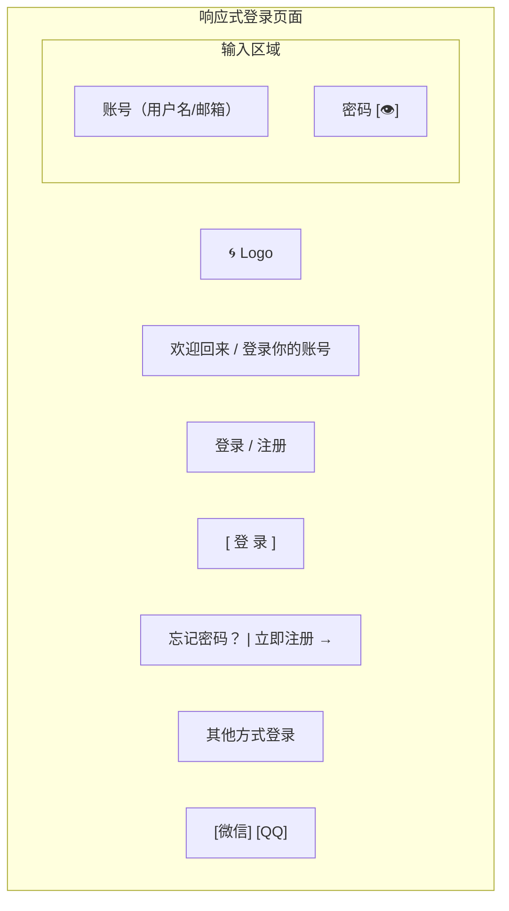

- 隐藏左侧装饰区
- 表单居中显示
- 最大宽度: 400px

---

## 快捷键

| 快捷键 | 功能 |
|--------|------|
| Tab | 切换输入框 |
| Enter | 登录 |
| Esc | 关闭错误提示 |

---

## 相关文档

- [注册页面设计](register.md) - 注册界面
- [主窗口设计](main-window.md) - 主应用窗口
- [界面设计规范](../qml/02-界面设计规范.md) - 设计系统

---

*版本: v2.0*
*最后更新: 2026-03-16*
*设计方向: 参考百度网盘现代化界面*
