# 主窗口设计 (v2.0)

## 概述

主窗口是 Disk 桌面客户端的核心界面，采用现代化的左侧导航 + 顶部工具栏 + 主内容区布局，参考百度网盘的清爽简洁风格。

**视觉风格**: 扁平化 + 微渐变 + 卡片式设计，蓝色主色调 (#06A7FF)

---

## 整体布局

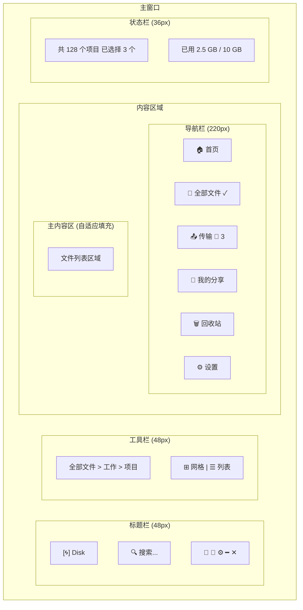

### 窗口尺寸

| 属性 | 值 | 说明 |
|------|------|------|
| 最小宽度 | 900px | 小于此宽度导航栏自动折叠 |
| 默认宽度 | 1200px | 初始窗口宽度 |
| 默认高度 | 800px | 初始窗口高度 |
| 标题栏 | 48px | 包含 Logo、搜索、用户操作 |
| 导航栏 | 220px | 可折叠至 64px |
| 工具栏 | 48px | 面包屑 + 视图切换 + 操作 |
| 状态栏 | 36px | 统计信息 + 存储空间 |

---

## 标题栏设计

### 布局结构

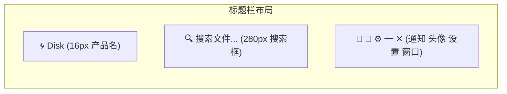

### 组件规格

| 组件 | 尺寸 | 说明 |
|------|------|------|
| Logo | 32x32px | 应用图标 |
| 产品名 | 16px / 600 | "Disk" 文字 |
| 搜索框 | 280x36px | 全局搜索，Placeholder "搜索文件、文件夹..." |
| 通知图标 | 20px | 未读消息红点提示 |
| 用户头像 | 32px | 圆形头像，点击展开菜单 |
| 设置按钮 | 20px | 快速设置入口 |
| 窗口控制 | 12px | 最小化/最大化/关闭 |

### 搜索框

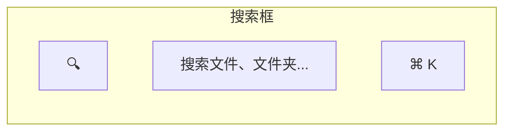

- 聚焦时展开至 360px
- 支持快捷键 ⌘/Ctrl + K 聚焦
- 搜索结果下拉浮层

---

## 导航栏设计

### 整体结构

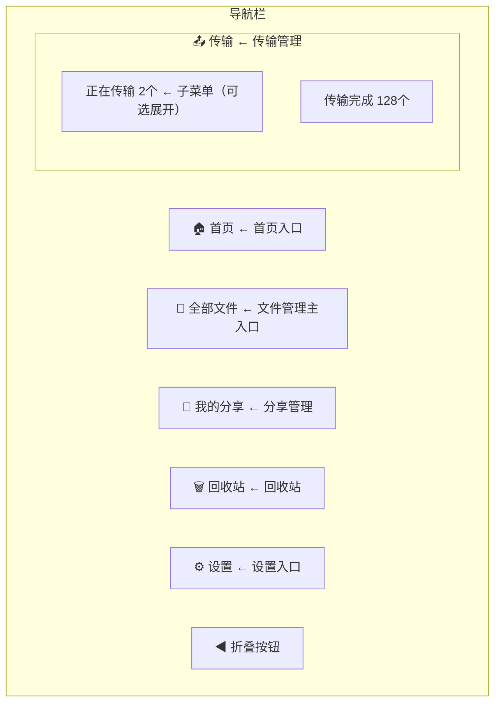

### 导航项规格

| 属性 | 值 |
|------|------|
| 高度 | 44px |
| 图标 | 20px |
| 文字 | 14px / 400 |
| 图标-文字间距 | 12px |
| 内边距 | 16px |
| 外边距 | 4px（左右）|
| 圆角 | 8px |

### 导航项状态

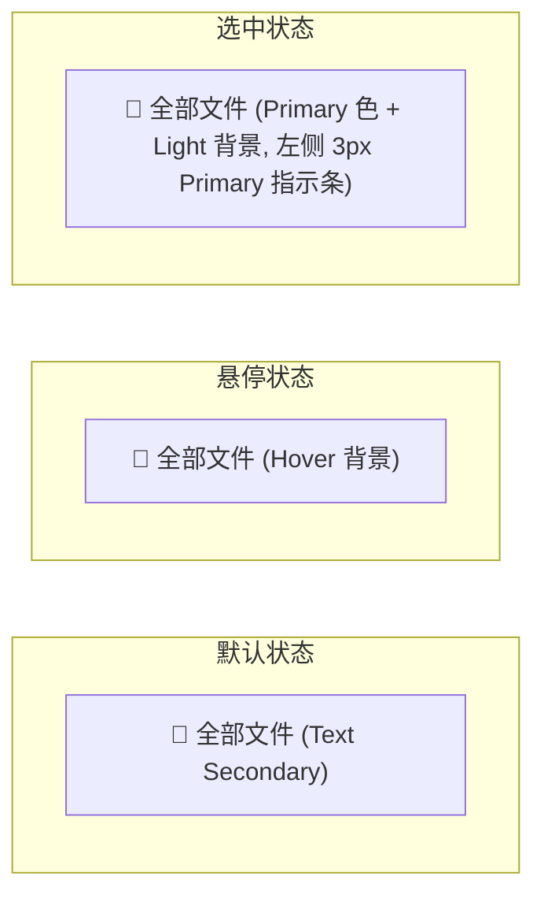

### 传输导航特殊设计

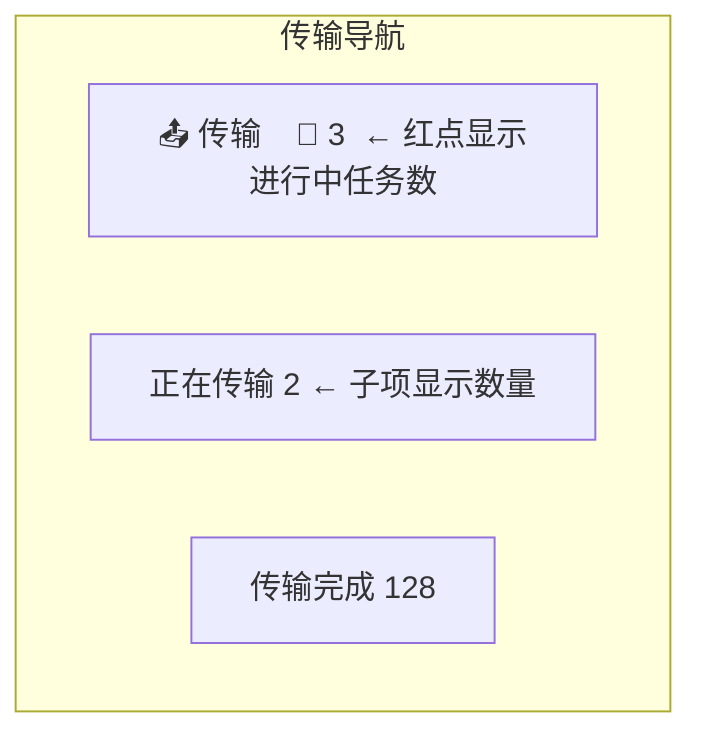

### 折叠状态

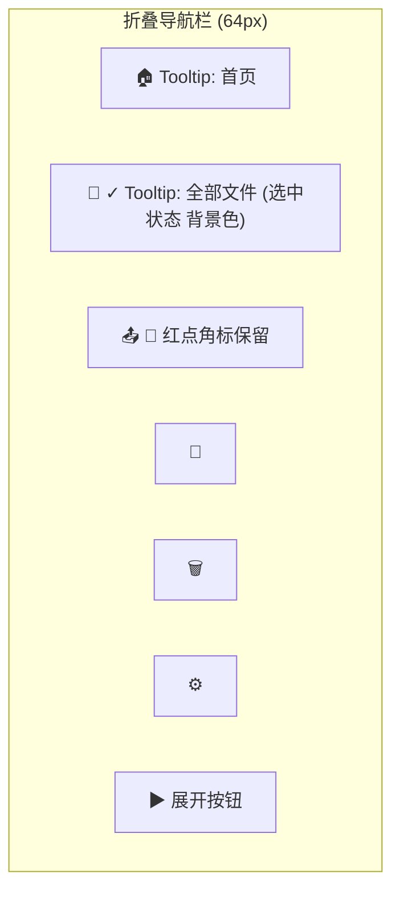

- 宽度: 64px
- 图标居中
- 悬停显示 Tooltip
- 选中项有背景色指示

---

## 工具栏设计

### 首页工具栏

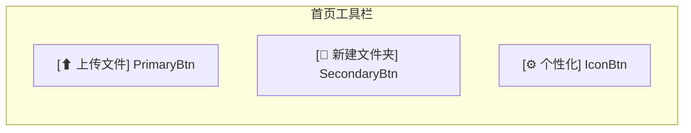

### 文件页面工具栏

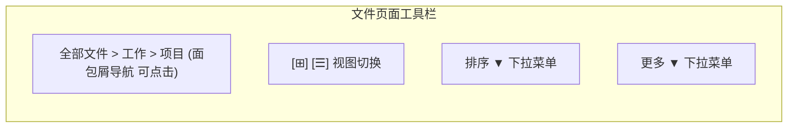

#### 面包屑导航

```
全部文件 > 工作 > 项目 > 文档 > 2026
   ↑        ↑      ↑
 可点击   可点击  当前目录（不可点击）
```

- 分隔符: ">" 或 "/"
- 可点击项: Text Secondary，悬变 Primary
- 当前项: Text Primary，不可点击

#### 视图切换

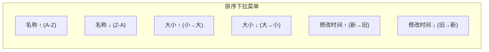

- 高度: 32px
- 圆角: Full (999px)
- 选中: Primary 背景 + 白色文字
- 未选中: 透明 + Text Secondary

#### 排序下拉

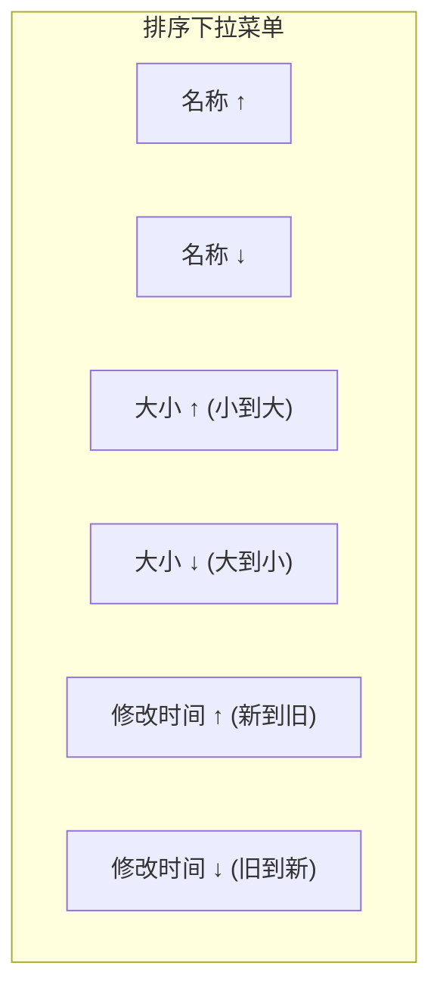

### 批量操作工具栏（选中文件时）

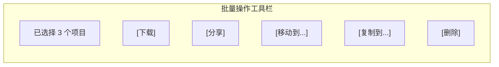

- 背景: Primary Light (#E6F6FF)
- 左侧: 选中数量
- 右侧: 批量操作按钮
- 过渡动画: 滑入 200ms

---

## 状态栏设计

### 布局结构

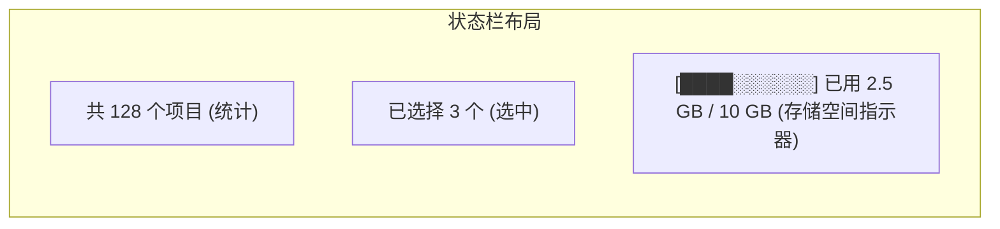

### 存储空间指示器

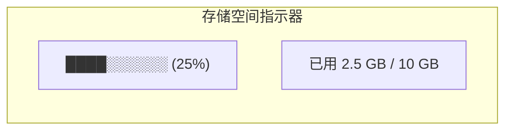
[████████████████████░░░░░░░░░░░░░░░░░░░░]  已用 2.5 GB / 10 GB (25%)
 ```

- 容器宽度: 160px
- 高度: 6px
- 圆角: 3px
- 背景: Border (#DEE0E3)
- 已用: Primary (#06A7FF) 渐变
- 警告: >= 80% 变为 Warning 色
- 危险: >= 95% 变为 Error 色

### 状态栏交互

- 点击存储空间区域 → 打开设置-存储管理
- 显示上传/下载速度（传输时）
- 显示同步状态（未来扩展）

---

## 页面切换动画

### 导航切换

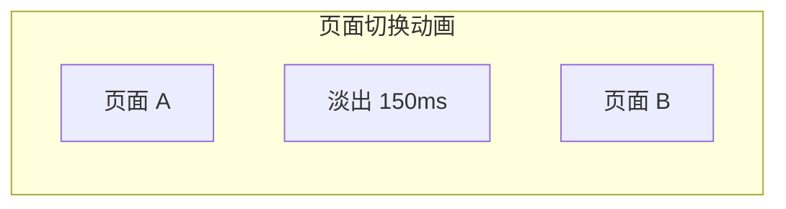

- 时长: 300ms
- 缓动: ease-in-out
- 效果: 淡入淡出 + 轻微位移

---

## 响应式适配

### Compact 模式 (< 900px)

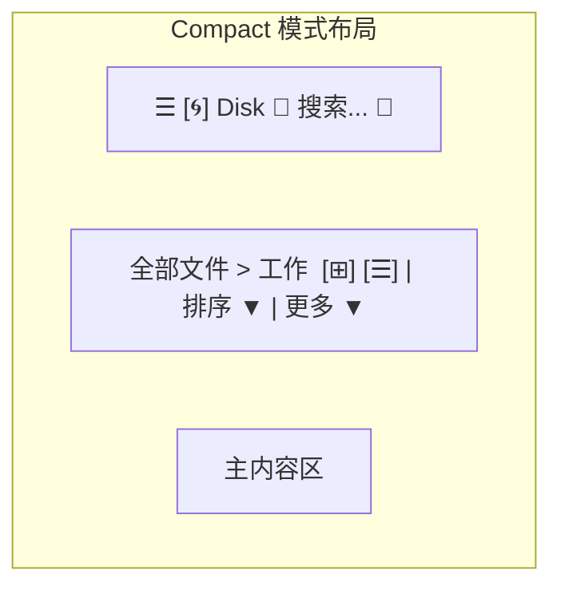

- 导航栏默认折叠
- 汉堡菜单展开全屏导航
- 工具栏简化

### Expanded 模式 (> 1400px)

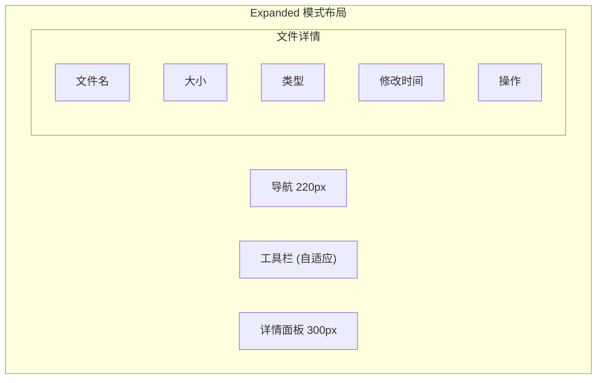

- 可选右侧详情面板
- 显示文件详细信息
- 快速预览和操作

---

## 快捷键

| 快捷键 | 功能 |
|--------|------|
| Ctrl + 1~5 | 切换到对应导航项 |
| Ctrl + Shift + S | 聚焦搜索框 |
| Ctrl + B | 切换导航栏折叠 |
| F5 | 刷新当前页面 |
| Esc | 取消选择 / 关闭弹窗 |

---

## 相关文档

- [界面设计规范](../qml/02-界面设计规范.md) - 完整设计系统
- [首页设计](home.md) - 首页详细设计
- [文件列表设计](file-list.md) - 文件管理界面
- [传输面板设计](transfer-panel.md) - 传输管理界面

---

*版本: v2.0*
*最后更新: 2026-03-16*
*设计方向: 参考百度网盘现代化界面*
