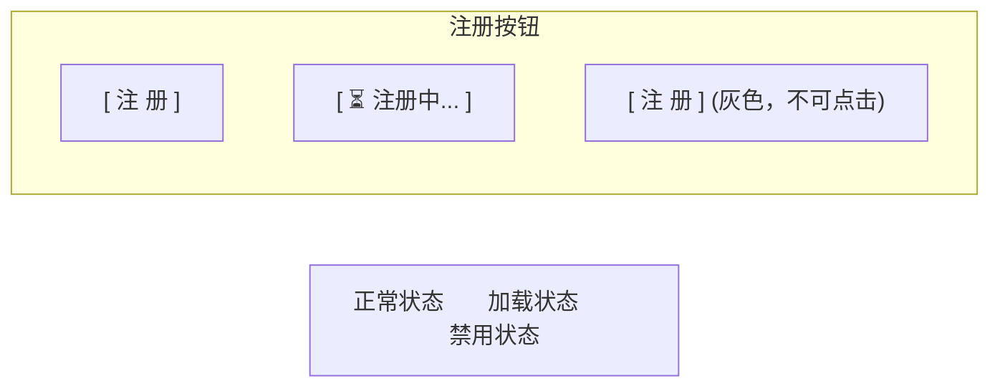
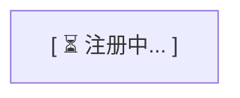
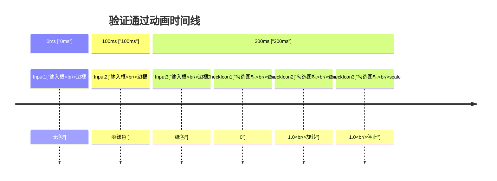
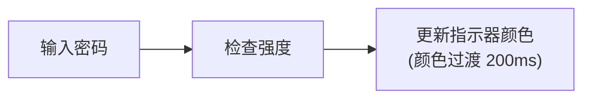

# 注册页面设计 (v2.0)

## 概述

注册页面是新用户创建 Disk 网盘账号的入口，收集用户名、邮箱和密码信息，提供即时表单验证和友好的注册体验。

**视觉风格**: 渐变背景 + 玻璃态卡片 + 步骤引导 + 实时验证

---

## 整体布局

```mermaid
flowchart LR
    subgraph RegisterPage["注册页面整体布局"]
        subgraph LeftDecoration["左侧装饰区 (50%)"]
            BG["渐变背景"]
            DecoText["加入我们吧！<br/>30秒快速注册"]
            Dots["○ 装饰性圆点 (模糊效果)"]
            Icon["   🖼 图标"]
        end
        
        subgraph RightForm["右侧表单区 (480px)"]
            LogoSection["      🌀 Logo<br/>      创建账号<br/>   免费使用 10GB 存储空间"]
            
            TabSwitch["    登录    |    注册  ✓"]
            
            EmailField["邮箱<br/>[ user@example.com ]<br/>验证通过"]
            
            UsernameField["用户名<br/>[ username ]<br/>4-32 个字符，支持字母、数字、下划线"]
            
            PasswordField["密码<br/>[ ••••••••• ] [👁]<br/>● 包含大写字母  ● 包含小写字母<br/>● 包含数字      ○ 8-64 个字符"]
            
            ConfirmPasswordField["确认密码<br/>[ ••••••••• ] [👁] [✓]<br/>密码匹配"]
            
            Agreement["☑️ 我已阅读并同意《用户协议》和《隐私政策》"]
            
            RegisterButton["[          注 册                ]"]
            
            LoginLink["已有账号？  立即登录 →"]
        end
    end
end
```

---

## 左侧装饰区

与登录页面保持一致，显示注册相关的引导文案：

```mermaid
flowchart TD
    subgraph LeftDecoArea["左侧装饰区"]
        Title["加入我们吧！"]
        Subtitle["30秒快速注册"]
        Decoration["大型模糊椭圆 (半透明白色圆点)<br/>背景渐变: 从 palette.highlight 到较暗色调"]
    end
end
```

**装饰元素**:
- 大型模糊椭圆 (半透明白色圆点)
- 背景渐变: 从 `palette.highlight` 到较暗色调

---

## 右侧表单区

### Logo 区域

```mermaid
flowchart TD
    subgraph LogoArea["Logo区域"]
        LogoBox["      🌀 Logo"]
        AppTitle["       创建账号"]
        AppSubtitle["   免费使用 10GB 存储空间"]
    end
end
```

### 登录/注册切换

```mermaid
flowchart LR
    subgraph TabSwitchArea["登录/注册切换"]
        LoginTab["    登录    "]
        RegisterTab["    注册  ✓"]
        Note["   未选中      选中态"]
    end
end
```

---

## 表单字段

### 邮箱输入

```mermaid
flowchart TD
    subgraph EmailInputSection["邮箱输入"]
        Label1["邮箱"]
        InputBox1["user@example.com"]
        ValidationIcon1["✓"]
        ErrorMsg1["❌ 请输入有效的邮箱地址"]
    end
end
```

**验证规则**:
- 格式: 标准邮箱格式
- 唯一性: 实时检查是否已被注册
- 错误显示: 通过 ViewModel 的 emailError 属性

### 用户名输入

```mermaid
flowchart TD
    subgraph UsernameInputSection["用户名输入"]
        Label2["用户名"]
        InputBox2["username"]
        Hint2["4-32 个字符，支持字母、数字、下划线"]
        ValidationIcon2["✓"]
        ErrorMsg2["❌ 用户名至少 4 个字符"]
    end
end
```

**验证规则**:
- 长度: 4-32 字符
- 格式: 字母、数字、下划线 `[a-zA-Z0-9_]+`
- 唯一性: 实时检查是否已被注册
- 错误显示: 通过 ViewModel 的 usernameError 属性

### 密码输入

```mermaid
flowchart TD
    subgraph PasswordInputSection["密码输入"]
        Label3["密码"]
        InputBox3["•••••••••••••  [👁]"]
        Hint3["● 包含大写字母  ● 包含小写字母<br/>   ● 包含数字      ○ 8-64 个字符"]
        ShowHideBtn3["[👁] 显示/隐藏密码"]
    end
end
```

**密码要求**:
| 要求 | 说明 |
|------|------|
| 长度 | 8-64 字符 |
| 大写字母 | 至少 1 个 A-Z |
| 小写字母 | 至少 1 个 a-z |
| 数字 | 至少 1 个 0-9 |
- 错误显示: 通过 ViewModel 的 passwordError 属性

### 确认密码

```mermaid
flowchart TD
    subgraph ConfirmPasswordSection["确认密码"]
        Label4["确认密码"]
        InputBox4["•••••••••••••  [👁]  [✓]"]
        MatchStatus4["密码匹配 ✓"]
    end
end
```

- 实时验证是否与密码一致
- 匹配显示绿色勾选（✓）
- 错误显示: 通过 ViewModel 的 confirmPasswordError 属性

### 用户协议

```
注册即表示同意《用户协议》和《隐私政策》
```

- 文本显示，非交互式
- 灰色文字，12px 字体
- 显示在注册按钮下方

---

## 注册按钮



**加载状态**:


**禁用状态**:
- 表单验证未通过时禁用
- 显示灰色背景

---

## 注册成功

### 成功提示

```mermaid
flowchart TD
    subgraph SuccessDialog["注册成功对话框"]
        Icon5["✅ 注册成功"]
        WelcomeMsg["欢迎加入 Disk！"]
        SuccessMsg["您的账号已创建成功，<br/>现在可以登录使用了。"]
        LoginButton["              [  立即登录  ]"]
    end
end
```

### 自动跳转

- 显示成功提示 2 秒
- 自动跳转到登录页
- 预填邮箱/用户名

---

## 错误处理

### 字段错误提示

| 字段 | 错误情况 | 提示信息 |
|------|----------|----------|
| 邮箱 | 为空 | 请输入邮箱 |
| 邮箱 | 格式错误 | 请输入有效的邮箱地址 |
| 邮箱 | 已存在 | 该邮箱已被注册 |
| 用户名 | 为空 | 请输入用户名 |
| 用户名 | 长度不足 | 用户名至少 4 个字符 |
| 用户名 | 长度超限 | 用户名最多 32 个字符 |
| 用户名 | 格式错误 | 用户名只能包含字母、数字和下划线 |
| 用户名 | 已存在 | 该用户名已被使用 |
| 密码 | 为空 | 请输入密码 |
| 密码 | 长度不足 | 密码至少 8 个字符 |
| 密码 | 缺少大写字母 | 密码需包含大写字母 |
| 密码 | 缺少小写字母 | 密码需包含小写字母 |
| 密码 | 缺少数字 | 密码需包含数字 |
| 确认密码 | 为空 | 请再次输入密码 |
| 确认密码 | 不匹配 | 两次输入的密码不一致 |

### 服务端错误

| 错误码 | 提示信息 |
|--------|----------|
| 40001 | 用户名已被注册 |
| 40002 | 邮箱已被注册 |
| 10002 | 请检查输入信息 |
| 10006 | 服务器错误，请稍后重试 |

---

## 动画效果

### 输入验证动画



### 密码强度动画



---

## 响应式适配

### 平板/小屏幕 (< 1024px)

与登录页面一致，隐藏左侧装饰区，表单居中显示。

---

## 相关文档

- [登录页面设计](login.md) - 登录界面
- [主窗口设计](main-window.md) - 主应用窗口
- [界面设计规范](../qml/02-界面设计规范.md) - 设计系统

---

*版本: v2.0*
*最后更新: 2026-03-16*
*设计方向: 参考百度网盘现代化界面*
