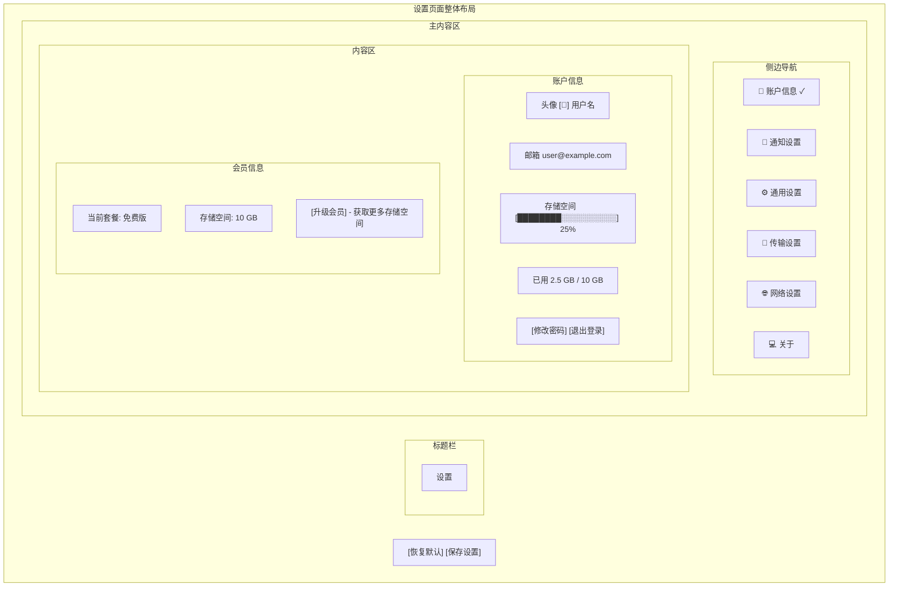
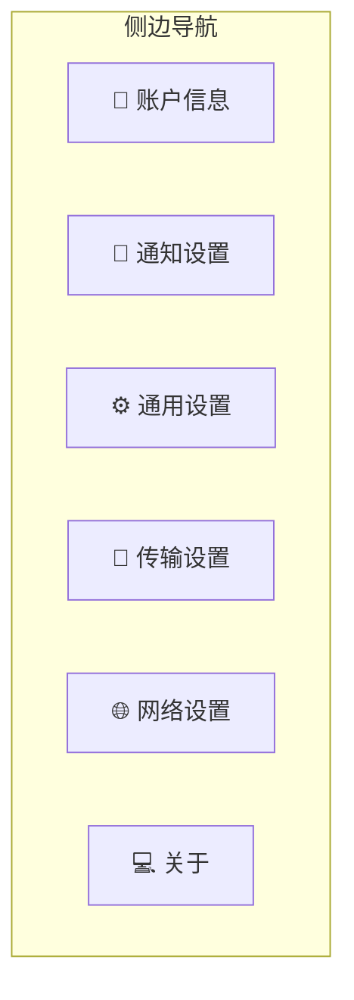
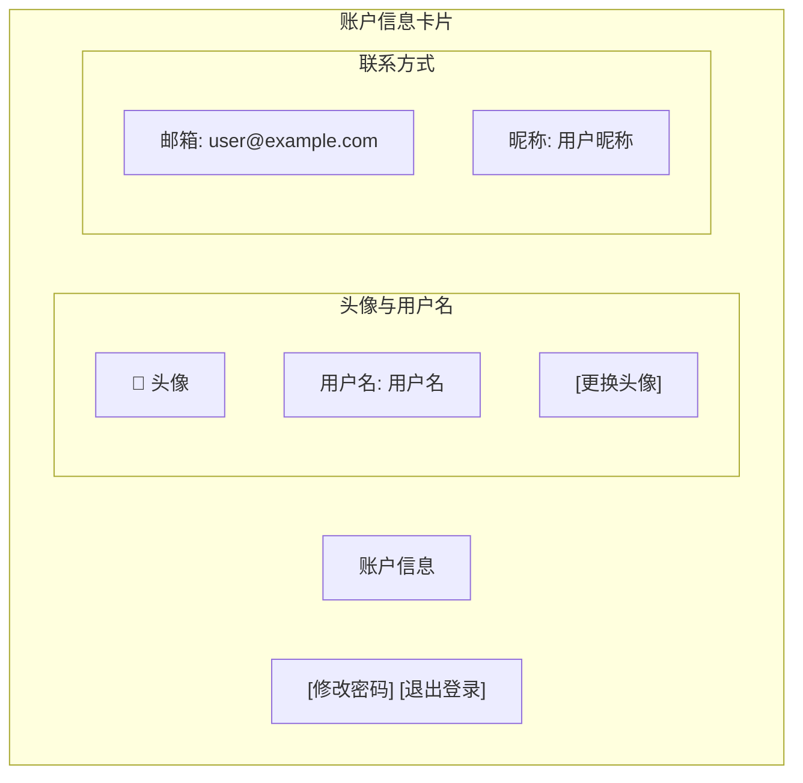
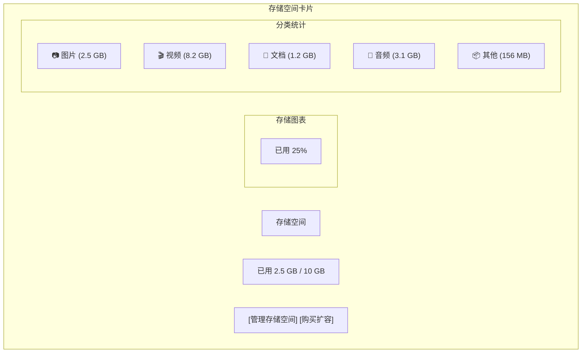
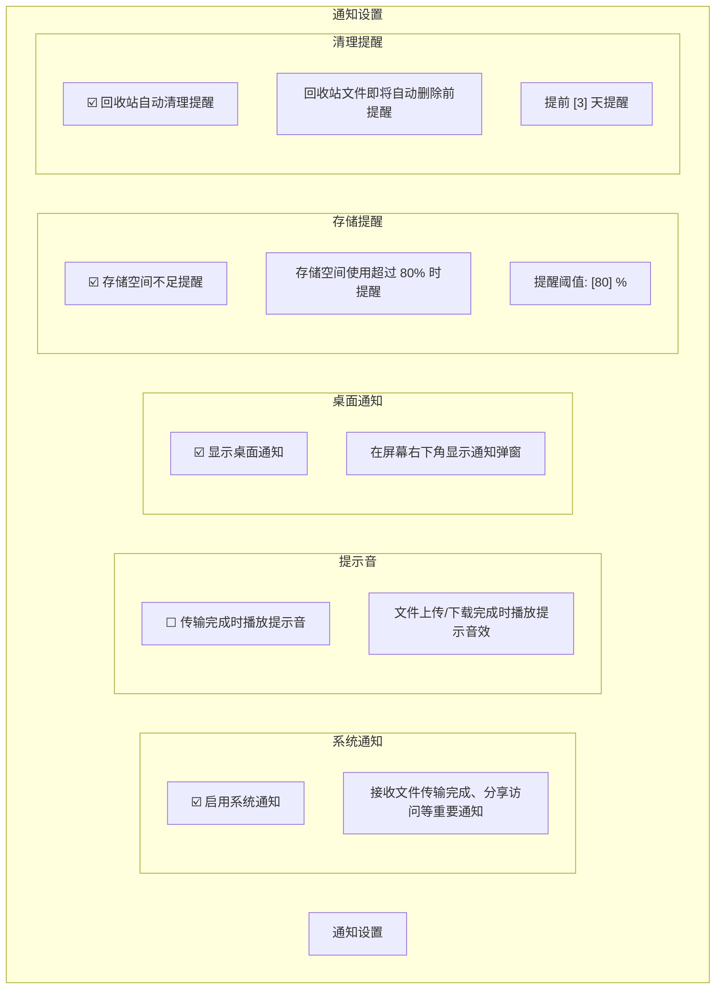
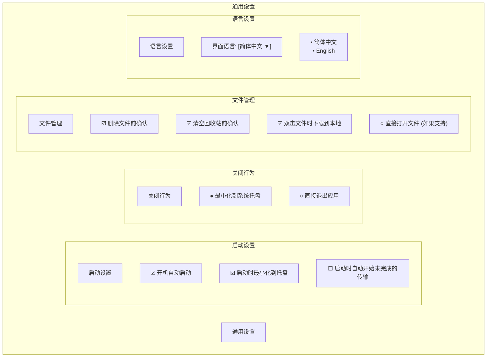
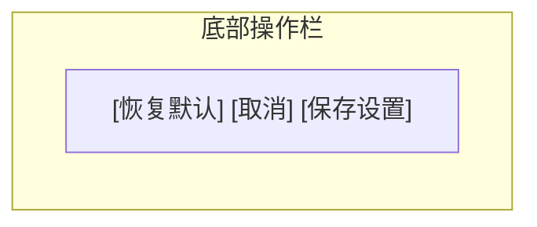
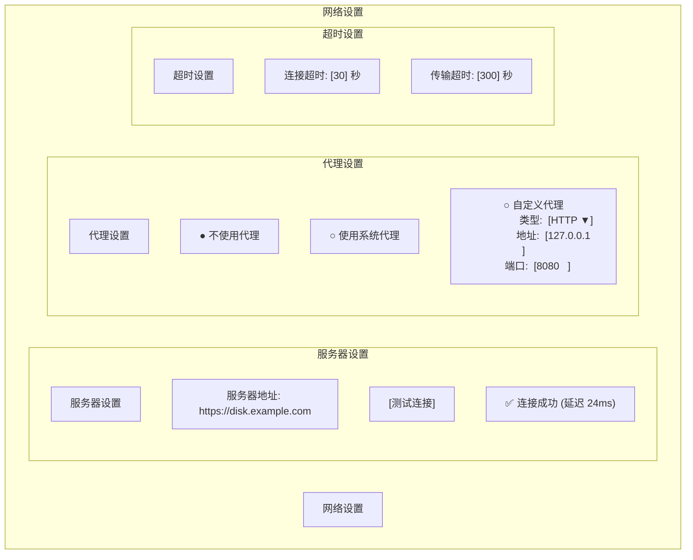
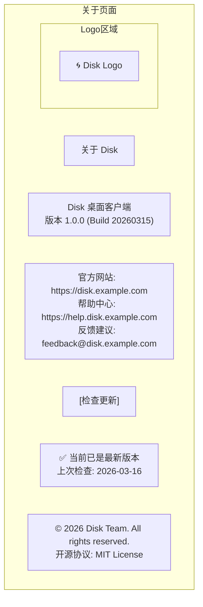
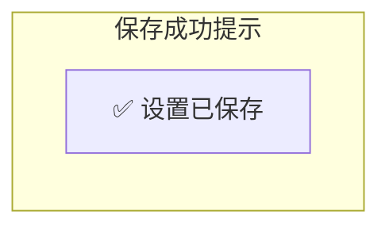

# 设置页面设计 (v2.0)

## 概述

设置页面用于管理 Disk 客户端的配置选项，采用分类卡片式布局，参考百度网盘设置界面，提供清晰的功能分组和直观的操作体验。

**视觉风格**: 分类卡片 + 简洁表单 + 开关控制

---

## 整体布局



---

## 侧边导航

### 导航项



### 导航项规格

| 属性 | 值 |
|------|------|
| 宽度 | 200px |
| 高度 | 44px |
| 图标 | 20px |
| 文字 | 14px |
| 选中 | Primary 文字 + Light 背景 + 左侧指示条 |

---

## 账户信息设置

### 账户卡片



### 存储空间卡片



---

## 通知设置



---

## 通用设置



---

## 传输设置



---

## 网络设置



---

## 关于页面



---

## 底部操作栏

```mermaid
flowchart TD
    subgraph TransferSettings["传输设置"]
        Header5["传输设置"]

        subgraph DownloadSettings["下载设置"]
            SectionTitle1["下载设置"]
            DownloadPath["默认下载位置: [浏览...]"]
            Checkbox1["☑️ 下载完成后自动打开文件夹"]
            Checkbox2["☑️ 下载完成后自动打开文件 (如果支持)"]

        subgraph UploadSettings["上传设置"]
            SectionTitle2["上传设置"]
            Toggle6["☑️ 开启秒传功能<br/>      通过文件哈希快速上传已存在的文件"]
            Toggle7["☑️ 上传完成后保留本地文件"]
        end

        subgraph ConcurrencySettings["并发设置"]
            SectionTitle3["并发设置"]
            UploadTasks["同时上传任务数:  [ 3 ▼]<br/>                   • 1<br/>                   • 3<br/>                   • 5<br/>                   • 10<br/>                ]
            DownloadTasks["同时下载任务数:  [ 3 ▼]<br/>                    • 1<br/>                    • 3<br/>                    • 5<br/>                    • 10<br/>               }
            ConcurrencyLabel["                  同时上传: 3 / 同时下载: 3"]
        end

        subgraph SpeedLimitSettings["速度限制"]
            SectionTitle4["速度限制"]
            LimitUpload["☐ 限制上传速度<br/>     [1000] KB/s"]
            LimitDownload["☐ 限制下载速度<br/>     [1000] KB/s"]
        end
    end
```

### 按钮说明

| 按钮 | 功能 |
|------|------|
| 恢复默认 | 重置当前分类设置为默认值 |
| 取消 | 放弃修改，返回上一页 |
| 保存设置 | 保存所有修改 |

---

## 设置保存反馈

### 保存成功



- 位置: 页面右上角
- 时长: 3 秒后自动消失
- 动画: 淡入淡出

---

## 相关文档

- [主窗口设计](main-window.md) - 整体窗口布局
- [界面设计规范](../qml/02-界面设计规范.md) - 设计系统

---

*版本: v2.0*
*最后更新: 2026-03-16*
*设计方向: 参考百度网盘现代化界面*
