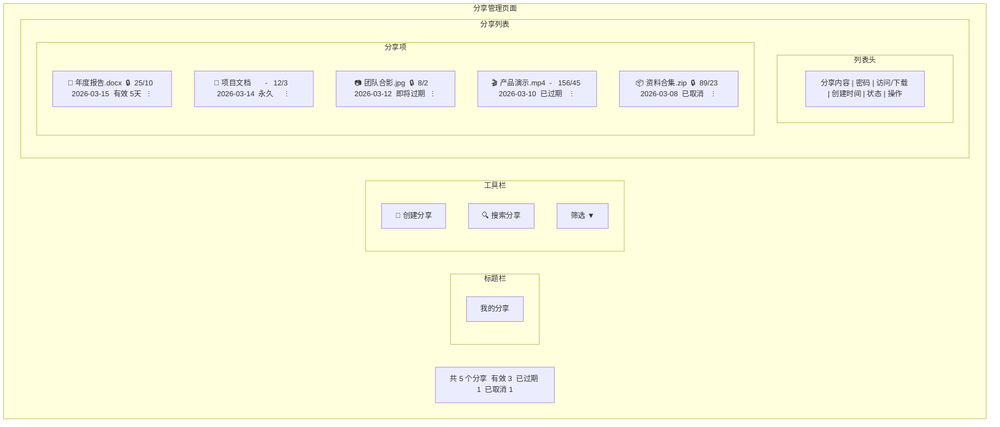
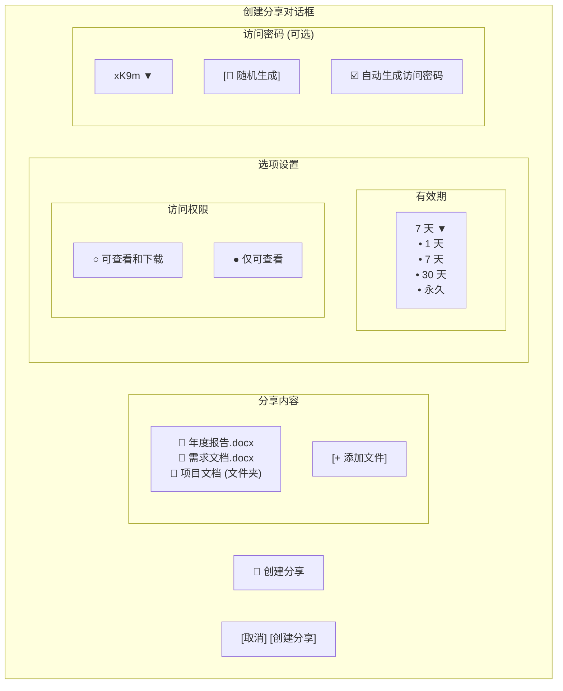
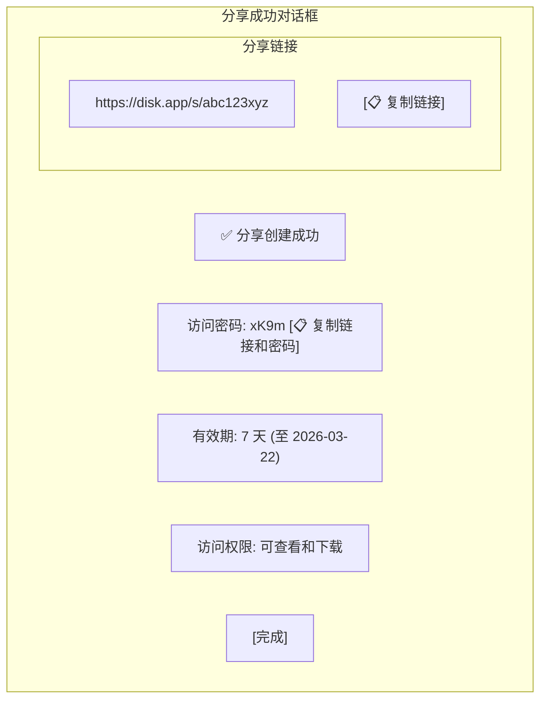
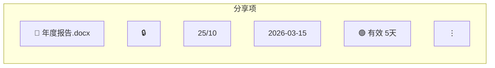
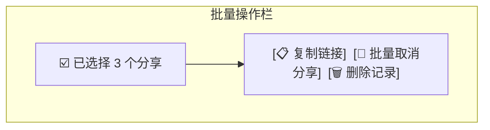
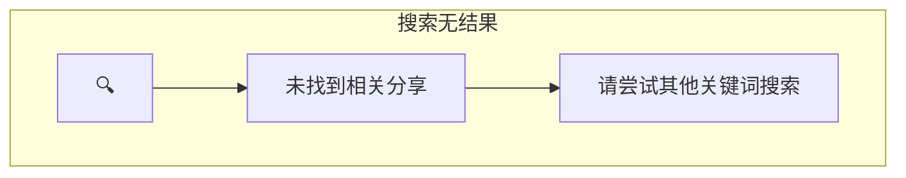

# 分享管理页面设计 (v2.0)

## 概述

分享管理页面用于创建、查看和管理文件分享链接。参考百度网盘分享界面，提供清晰的分享列表展示和便捷的分享操作。

**视觉风格**: 卡片式分享展示 + 状态区分 + 快捷操作

---

## 整体布局



---

## 创建分享

### 创建按钮

```
[🔗 创建分享]
```

- Primary 按钮
- 点击打开创建分享对话框
- 或从文件列表选择文件后点击分享

### 创建分享对话框



#### 创建选项

| 选项 | 说明 | 默认值 |
|------|------|--------|
| 分享内容 | 文件/文件夹列表 | 预填充选中的文件 |
| 有效期 | 1天/7天/30天/永久 | 7天 |
| 访问权限 | 可查看和下载/仅可查看 | 可查看和下载 |
| 访问密码 | 4-8位字符 | 随机生成 |
| 自动生成密码 | 开关 | 关闭 |

### 分享创建成功



---

## 分享列表

### 列表列定义

| 列名 | 宽度 | 对齐 | 说明 |
|------|------|------|------|
| 分享内容 | 自适应 | 左对齐 | 图标 + 文件名/文件夹名 |
| 密码 | 60px | 居中 | 🔒 有密码 / - 无密码 |
| 访问/下载 | 120px | 右对齐 | 访问次数 / 下载次数 |
| 创建时间 | 120px | 左对齐 | 创建日期 |
| 状态 | 100px | 左对齐 | 状态标签 |
| 操作 | 60px | 居中 | 更多操作 |

### 分享项设计



### 状态标签

| 状态 | 颜色 | 显示 |
|------|------|------|
| 有效 | Success | 绿色标签，显示剩余天数 |
| 即将过期 | Warning | 黄色标签（剩余 < 3 天）|
| 已过期 | Error | 红色标签 |
| 已取消 | Text Tertiary | 灰色标签 |
| 永久 | Primary | 蓝色标签 |

---

## 分享详情展开

点击分享项展开详情:

```mermaid
flowchart TD
    subgraph Expanded["展开的分享详情"]
        MainRow["📄 年度报告.docx  🔒  25/10  2026-03-15  🟢 有效 5天  ⋮"]
        Details["分享链接: https://disk.app/s/abc123xyz<br/>访问密码: xK9m<br/>创建时间: 2026-03-15 10:23:45<br/>过期时间: 2026-03-22 10:23:45<br/>访问权限: 可查看和下载"]
        QuickActions["[📋 复制链接]  [📋 复制链接和密码]  [🔗 在浏览器中打开]"]
        AccessLog["访问记录 (最近 10 条):<br/>2026-03-16 14:32:12  192.168.1.1  下载<br/>2026-03-16 10:15:33  192.168.1.2  访问<br/>..."]
    end
    
    MainRow --> Details --> QuickActions --> AccessLog
end
```

---

## 右键菜单

```mermaid
flowchart TD
    subgraph ContextMenu2["分享项右键菜单"]
        CopyLink["📋 复制链接"]
        CopyLinkPassword["📋 复制链接和密码"]
        OpenBrowser["🔗 在浏览器打开"]
        EditShare["✏ 编辑分享"]
        CancelShare["🚫 取消分享"]
    end
end
```

---

## 批量操作

### 选中分享时的操作栏



---

## 筛选与搜索

### 搜索框

```
🔍 搜索分享内容...
```

- 实时搜索文件名
- 支持模糊匹配

### 筛选下拉

```mermaid
flowchart TD
    FilterBtn["筛选 ▼"]
    
    subgraph FilterOptions["筛选选项"]
        All["全部"]
        Valid["有效"]
        Expiring["即将过期"]
        Expired["已过期"]
        Cancelled["已取消"]
        Protected["有密码保护"]
    end
    
    FilterBtn --> FilterOptions
end
```

---

## 空状态

### 无分享

```mermaid
flowchart TD
    subgraph EmptyShare["空分享状态"]
        CreateBtn3["[🔗 创建分享]"]
        Icon5["🔗"]
        Title5["暂无分享"]
        Hint5["创建分享，与他人共享文件"]
        Action5["[创建分享]"]
    end
    
    CreateBtn3 --> Icon5 --> Title5 --> Hint5 --> Action5
end
```

### 搜索无结果



---

## 确认对话框

### 取消分享确认

```mermaid
flowchart TD
    subgraph ConfirmDialog["取消分享确认对话框"]
        Icon7["⚠️ 取消分享"]
        Question["确定要取消这 3 个分享吗？"]
        Warning["取消后分享链接将立即失效，<br/>已保存的用户将无法再访问。"]
        Buttons7["[取消] [确认取消]"]
    end
end
```

---

## 统计信息

```
共 15 个分享    有效 10    即将过期 2    已过期 2    已取消 1
```

- 点击统计数字可筛选对应状态

---

## 快捷键

| 快捷键 | 功能 |
|--------|------|
| Ctrl + N | 创建分享 |
| Delete | 取消分享 |
| Ctrl + C | 复制链接 |
| Ctrl + F | 搜索分享 |

---

## 相关文档

- [主窗口设计](main-window.md) - 整体窗口布局
- [文件列表设计](file-list.md) - 文件选择界面
- [对话框设计](dialogs.md) - 确认对话框
- [界面设计规范](../qml/02-界面设计规范.md) - 设计系统

---

*版本: v2.0*
*最后更新: 2026-03-16*
*设计方向: 参考百度网盘现代化界面*
