# 传输页面设计 (v2.0)

## 概述

传输页面用于管理文件上传和下载任务，采用统一页面 + 标签切换的设计，参考百度网盘传输列表界面，提供清晰的进度展示和便捷的操作控制。

**视觉风格**: 清晰的进度指示 + 状态区分 + 批量操作支持

---

## 整体布局

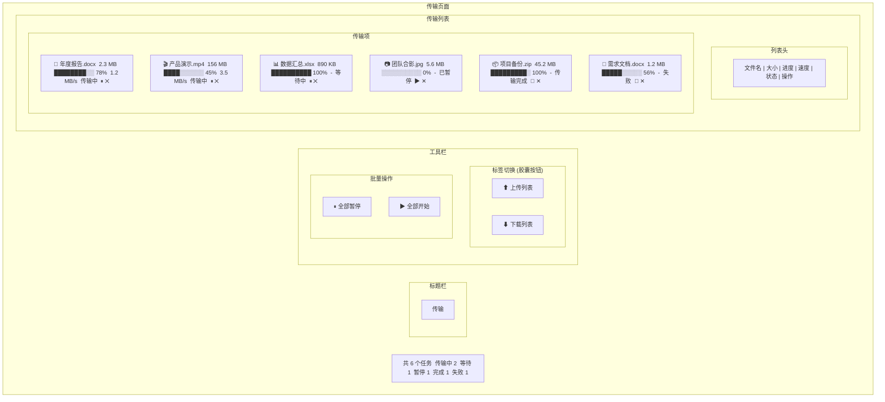

---

## 标签切换

### 标签设计

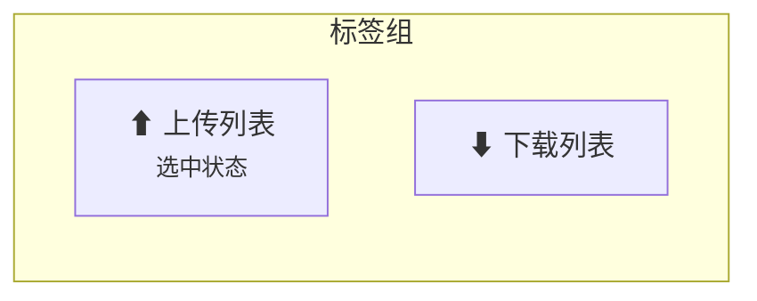

**规格**:
- 高度: 36px
- 圆角: Full (999px)
- 选中: Primary 背景 + 白色文字
- 未选中: 透明 + Text Secondary
- 角标: 显示进行中任务数

### 标签角标

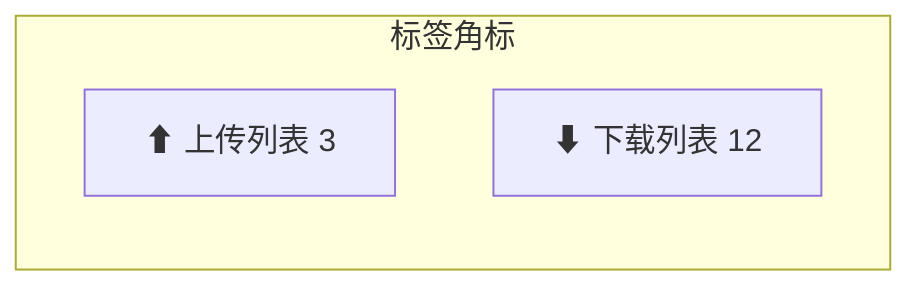

- 数字角标: 红色背景 (Error 色)
- 完成: 绿色对勾图标
- 无任务: 不显示角标

---

## 传输列表

### 列表列定义

| 列名 | 宽度 | 对齐 | 说明 |
|------|------|------|------|
| 文件名 | 自适应 | 左对齐 | 图标 + 文件名 |
| 大小 | 100px | 右对齐 | 总大小 |
| 进度 | 200px | 左对齐 | 进度条 + 百分比 |
| 速度 | 100px | 右对齐 | 当前速度 |
| 状态 | 100px | 左对齐 | 状态标签 |
| 操作 | 80px | 居中 | 操作按钮 |

### 传输项设计

#### 传输中

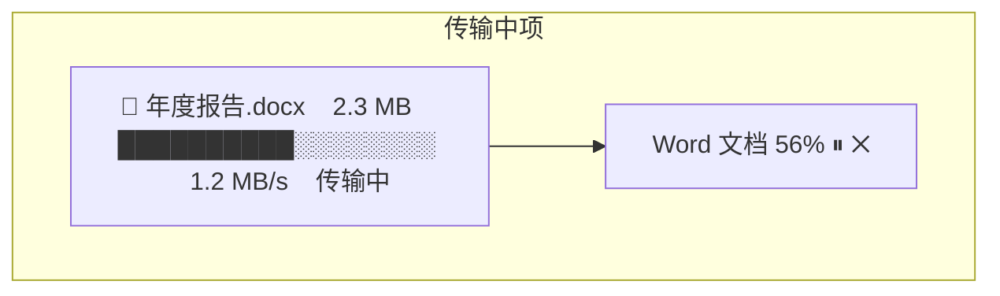

**进度条**:
- 高度: 6px
- 圆角: 3px
- 背景: Border
- 已完成: Primary 渐变 (#06A7FF → #40BFFF)
- 动画: 流光效果 (shimmer)

#### 等待中

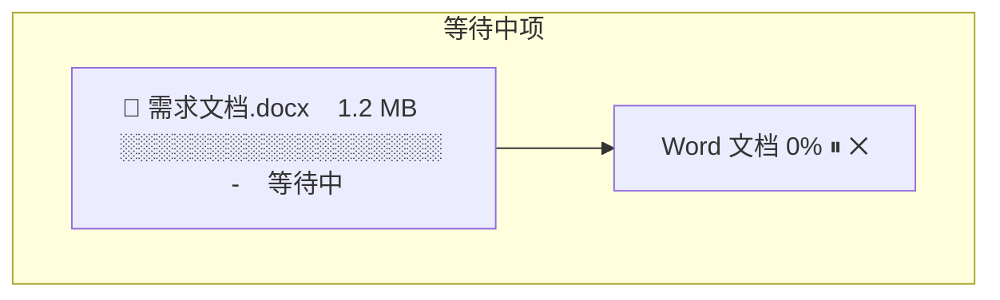

- 进度条: 空
- 速度: "-"
- 操作: 可取消

#### 已暂停

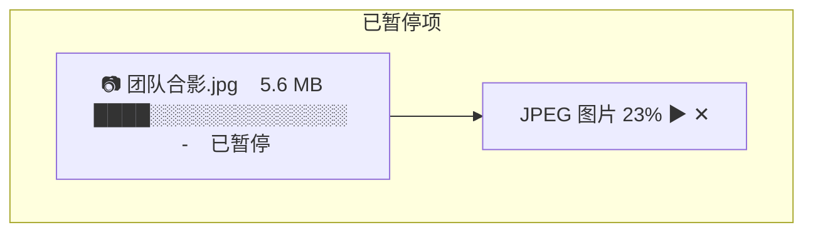

- 进度条: Warning 色 (#FAAD14)
- 操作: 继续/取消

#### 传输完成

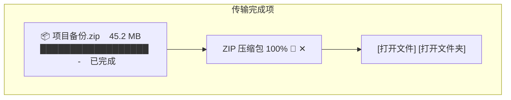

- 进度条: Success 色 (#52C41A)
- 操作: 打开文件夹/删除记录
- 展开: 显示打开按钮

#### 传输失败

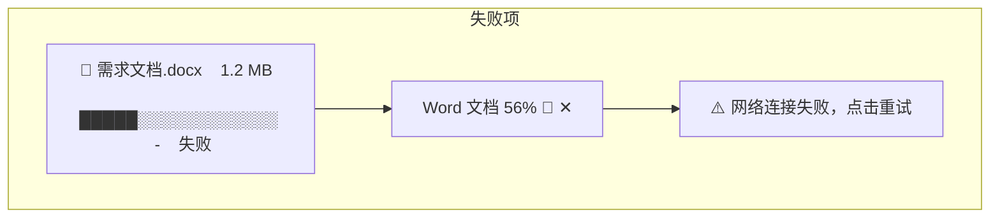

- 进度条: Error 色 (#F5222D)
- 操作: 重试/删除
- 展开: 显示错误原因

---

## 状态标签

| 状态 | 颜色 | 显示 |
|------|------|------|
| 传输中 | Primary | 蓝色标签 |
| 等待中 | Text Tertiary | 灰色标签 |
| 已暂停 | Warning | 黄色标签 |
| 已完成 | Success | 绿色标签 |
| 失败 | Error | 红色标签 |
| 校验中 | Info | 蓝色标签 |
| 合并中 | Info | 蓝色标签 |

---

## 批量操作

### 顶部批量操作栏

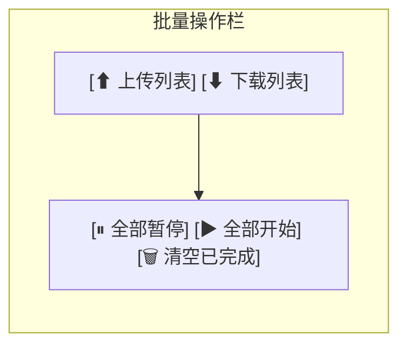

### 批量操作按钮

| 按钮 | 功能 | 状态 |
|------|------|------|
| 全部暂停 | 暂停所有进行中的任务 | 有传输中任务时可用 |
| 全部开始 | 开始所有暂停的任务 | 有暂停任务时可用 |
| 清空已完成 | 删除所有已完成记录 | 有已完成任务时可用 |

---

## 空状态

### 无传输任务

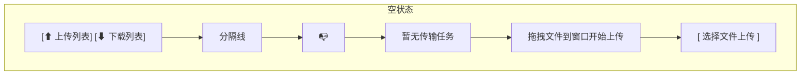

---

## 传输详情展开

点击传输项可展开详情:

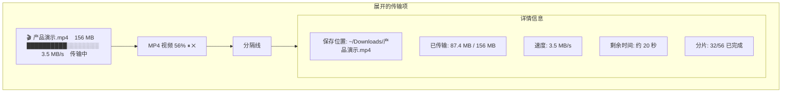

### 详情信息

| 信息 | 说明 |
|------|------|
| 保存位置 | 文件保存路径（下载）|
| 已传输 | 已传输大小 / 总大小 |
| 速度 | 当前传输速度 |
| 剩余时间 | 预计剩余时间 |
| 分片进度 | 分片上传/下载进度 |
| 错误信息 | 失败原因（失败时）|

---

## 右键菜单

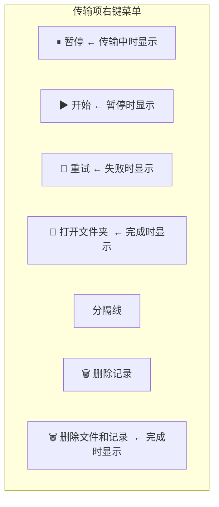

---

## 通知与反馈

### 传输完成通知

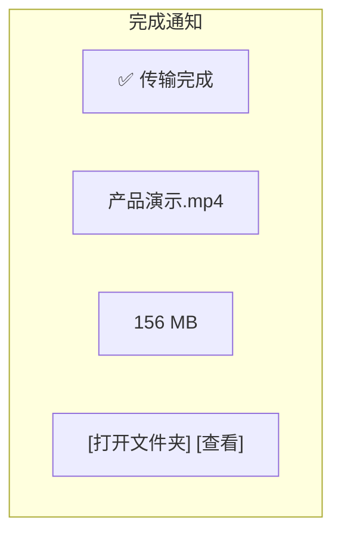

### 传输失败通知

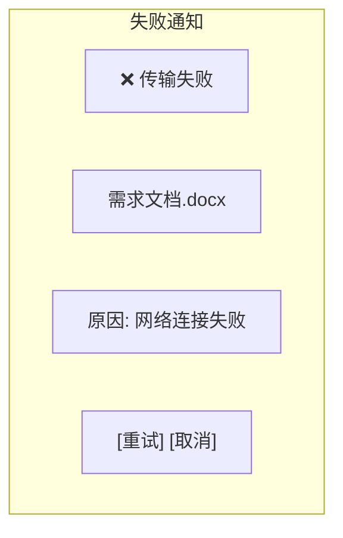

---

## 统计信息栏

```
共 12 个任务    传输中 3    等待 2    暂停 1    完成 5    失败 1
```

- 位置: 列表底部
- 样式: 小型文字，Text Secondary
- 点击状态数字: 筛选对应状态任务

---

## 快捷键

| 快捷键 | 功能 |
|--------|------|
| Delete | 删除选中任务 |
| Ctrl + A | 全选 |
| Space | 暂停/继续选中任务 |
| Ctrl + P | 全部暂停 |
| Ctrl + S | 全部开始 |
| Ctrl + Shift + C | 清空已完成 |

---

## 相关文档

- [主窗口设计](main-window.md) - 整体窗口布局
- [文件列表设计](file-list.md) - 文件管理界面
- [界面设计规范](../qml/02-界面设计规范.md) - 设计系统

---

*版本: v2.0*
*最后更新: 2026-03-16*
*设计方向: 参考百度网盘现代化界面*
