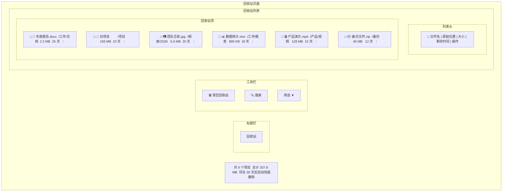
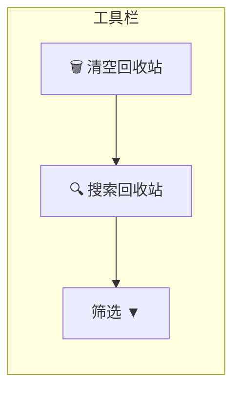
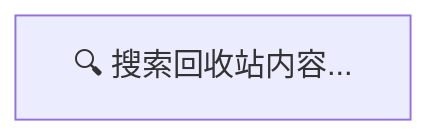
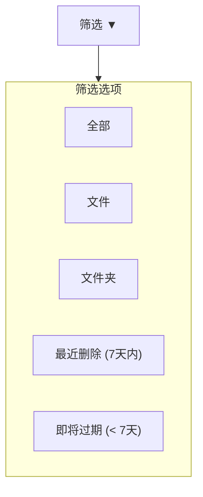
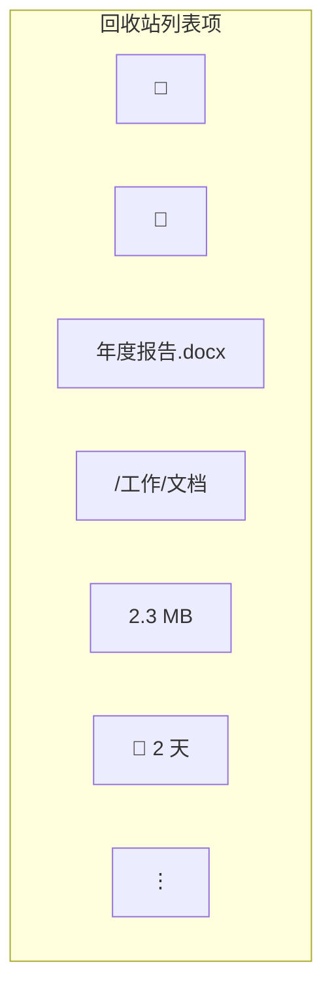
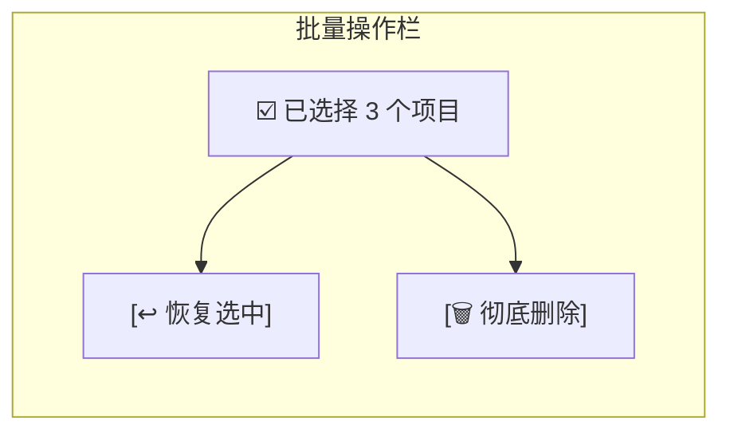
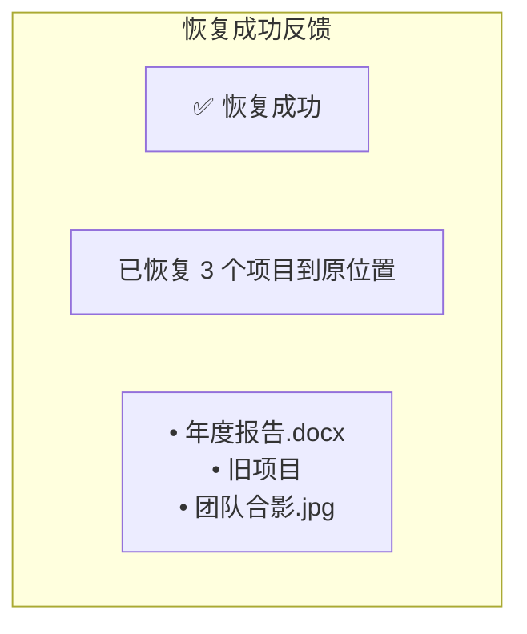
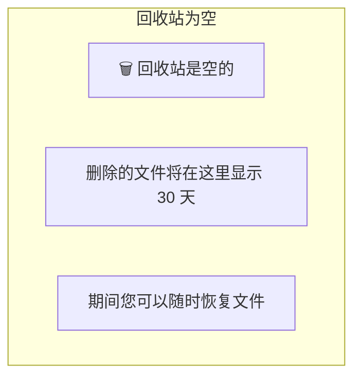
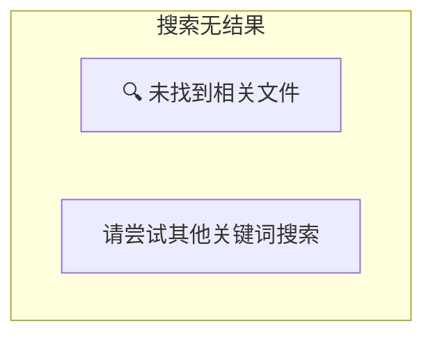
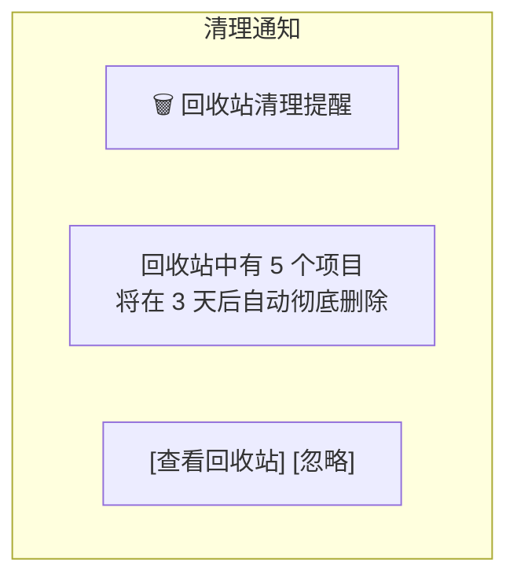

# 回收站页面设计 (v2.0)

## 概述

回收站页面用于管理已删除的文件和文件夹，支持恢复、彻底删除和清空操作。参考百度网盘回收站设计，提供清晰的文件列表和直观的操作入口。

**视觉风格**: 清晰的删除标记 + 剩余时间提示 + 批量操作支持

---

## 整体布局



---

## 工具栏

### 顶部操作栏



#### 清空按钮

- 危险样式按钮 (Error 色)
- 点击显示二次确认对话框

#### 搜索框



- 实时搜索文件名
- 支持模糊匹配

#### 筛选下拉



---

## 回收站列表

### 列表列定义

| 列名 | 宽度 | 对齐 | 说明 |
|------|------|------|------|
| 复选框 | 48px | 居中 | 全选/单选 |
| 文件名 | 自适应 | 左对齐 | 图标 + 文件名 |
| 原始位置 | 自适应 | 左对齐 | 删除前的路径 |
| 大小 | 100px | 右对齐 | 文件大小 |
| 剩余时间 | 100px | 左对齐 | 自动删除倒计时 |
| 操作 | 60px | 居中 | 更多操作 |

### 列表项设计



### 剩余时间显示

| 剩余时间 | 颜色 | 显示 |
|----------|------|------|
| > 14 天 | Text Secondary | 灰色 |
| 7-14 天 | Text Primary | 黑色 |
| 3-7 天 | Warning | 黄色 |
| < 3 天 | Error | 红色 |
| 已过期 | Error | 红色"即将删除" |

---

## 批量操作栏

当选中项目时显示:



### 批量操作按钮

| 按钮 | 功能 | 说明 |
|------|------|------|
| ↩ 恢复选中 | 恢复选中的文件 | 恢复到原始位置 |
| 🗑️ 彻底删除 | 永久删除 | 需二次确认 |

---

## 右键菜单

```mermaid
flowchart TD
    subgraph ContextMenu2["右键菜单"]
        Restore["↩ 恢复"]
        RestoreToOriginal["恢复到原位置"]
        RestoreTo["恢复到..."]
        Delete["🗑️ 彻底删除"]
    end
end
```
```

---

## 确认对话框

### 恢复确认

```mermaid
flowchart TD
    subgraph RestoreConfirm["恢复确认对话框"]
        Icon["↩ 恢复文件"]
        Question["确定要恢复选中的 3 个项目吗？"]
        LocationList["将恢复到原始位置：<br/>• 年度报告.docx → /工作/文档<br/>• 旧项目 → /项目<br/>• 团队合影.jpg → /相册/2026"]
        Warning["⚠️ 如果原位置已有同名文件，将自动重命名"]
        Buttons["[取消] [确认恢复]"]
    end
end
```

### 彻底删除确认

```mermaid
flowchart TD
    subgraph DeleteConfirm["彻底删除确认对话框"]
        Icon2["🗑️ 彻底删除"]
        Question2["确定要彻底删除选中的 3 个项目吗？"]
        Warning2["此操作无法撤销！文件将永久丢失。"]
        FileList2["• 年度报告.docx (2.3 MB)<br/>• 旧项目 (156 MB)<br/>• 团队合影.jpg (5.6 MB)"]
        SpaceInfo["共计释放空间: 163.9 MB"]
        Buttons2["[取消] [确认删除]"]
    end
end
```

### 清空回收站确认

```mermaid
flowchart TD
    subgraph ClearConfirm["清空回收站确认对话框"]
        Icon3["⚠️ 清空回收站"]
        Question3["确定要清空回收站吗？"]
        Stats["共 15 个项目，总计 337.8 MB"]
        Warning3["此操作将永久删除所有项目，无法撤销！"]
        Suggestion["建议先检查是否有重要文件需要恢复。"]
        Buttons3["                    [取消]    [确认清空]"]
    end
end
```

---

## 恢复结果反馈

### 恢复成功



### 部分恢复失败

```mermaid
flowchart TD
    subgraph PartialFailure["部分恢复失败"]
        Icon5["⚠️ 部分恢复失败"]
        Stats5["成功恢复: 2 个项目<br/>恢复失败: 1 个项目"]
        Reason5["失败原因：<br/>• 旧项目 - 原位置文件夹已被删除"]
        Action5["[查看失败详情]"]
    end
end
```

---

## 空状态

### 回收站为空



### 搜索无结果



---

## 自动清理提示

### 清理通知



---

## 统计信息栏

```
共 15 个项目    总计 337.8 MB    将在 30 天后自动彻底删除
```

- 位置: 列表底部
- 样式: 小型文字，Text Secondary

---

## 业务规则

| 规则 | 说明 |
|------|------|
| 保留期限 | 30 天后自动彻底删除 |
| 排序 | 按删除时间倒序（最新的在前）|
| 恢复位置 | 优先恢复到原始位置，不存在则恢复到根目录 |
| 重名处理 | 存在同名文件时自动重命名（如"文件名 (1).ext"）|
| 批量限制 | 一次最多恢复/删除 100 个项目 |

---

## 快捷键

| 快捷键 | 功能 |
|--------|------|
| Delete | 彻底删除选中项 |
| Ctrl + A | 全选 |
| Ctrl + Z | 恢复选中项 |
| Ctrl + Shift + Delete | 清空回收站 |

---

## 相关文档

- [主窗口设计](main-window.md) - 整体窗口布局
- [文件列表设计](file-list.md) - 文件列表设计
- [对话框设计](dialogs.md) - 确认对话框
- [界面设计规范](../qml/02-界面设计规范.md) - 设计系统

---

*版本: v2.0*
*最后更新: 2026-03-16*
*设计方向: 参考百度网盘现代化界面*
