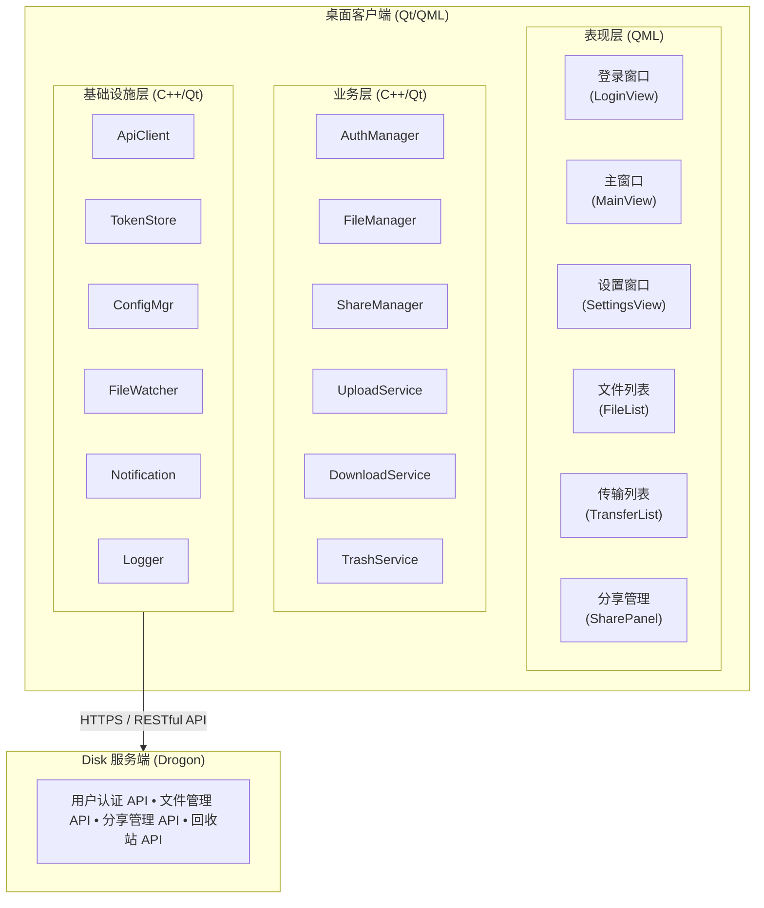
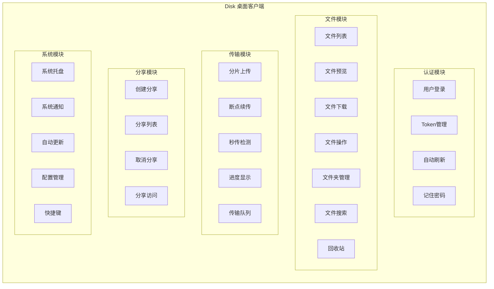
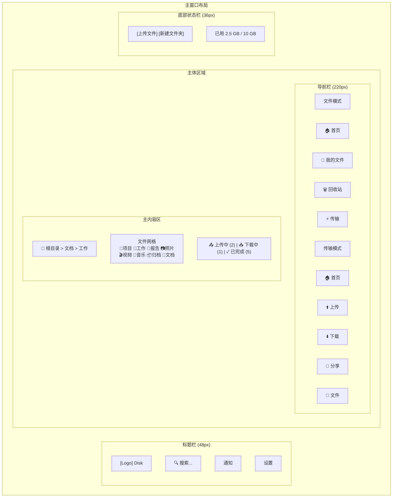

# Disk 桌面客户端 - 系统概述

## 1. 项目简介

**视觉样式：使用 Qt Quick Controls 内置 Fusion 样式，以获得跨平台一致的视觉效果并支持 `background` / `contentItem` 自定义。不在文档中引入 AppTheme/Colors 等自定义样式模块。**


### 1.1 项目背景

Disk 网盘系统已通过 Drogon 框架实现了高性能的后端服务，提供了完整的文件存储、分享和管理功能。目前已有 RESTful API，但缺乏适合普通用户的图形化桌面客户端。

本项目旨在为 Disk 网盘系统开发一个现代化、跨平台的 **Qt/QML 桌面客户端**，为用户提供直观友好的图形化文件管理体验。

### 1.2 项目目标

- **跨平台支持**：支持 Windows、macOS 和 Linux 三大平台
- **现代 UI**：采用 Qt Quick 技术，提供流畅的现代化界面
- **功能完整**：覆盖后端提供的全部功能
- **高性能**：利用 C++20 协程和 Qt 并发，保证响应速度
- **易用性**：符合桌面应用交互习惯，降低学习成本

### 1.3 适用范围

本客户端适用于：
- 需要图形化界面的普通用户
- 企业办公场景的文件管理
- 需要批量上传下载的用户
- 追求稳定性和性能的专业用户

---

## 2. 系统架构

### 2.1 总体架构

系统采用 **Qt MVVM 架构**，C++ 层负责所有业务逻辑，QML 层仅负责界面展示：

**核心原则：QML 和 JavaScript 仅处理 UI 展示，不涉及业务逻辑。** 所有 API 调用、数据处理和业务规则都在 C++ 层实现。



### 2.2 架构特点

| 特性 | 说明 |
|------|------|
| **Qt MVVM** | C++ ViewModel + QML View，属性绑定驱动 UI，业务逻辑完全在 C++ 层 |
| 异步非阻塞 | 使用 QNetworkAccessManager 和 Qt Concurrent |
| 信号槽机制 | Qt 信号槽实现组件间通信 |
| **本地存储** | QSettings 存储 Token 和配置 |

### 2.3 核心设计模式

#### 2.3.1 MVVM 架构

```cpp
// ViewModel: 暴露给 QML 的数据模型
class FileListViewModel : public QObject {
    Q_OBJECT
    Q_PROPERTY(QAbstractListModel* files READ files CONSTANT)
    Q_PROPERTY(QString currentPath READ currentPath NOTIFY currentPathChanged)
    Q_PROPERTY(bool loading READ loading NOTIFY loadingChanged)

public:
    Q_INVOKABLE void refresh();
    Q_INVOKABLE void enterFolder(quint64 folderId);
    Q_INVOKABLE void navigateUp();

signals:
    void currentPathChanged();
    void loadingChanged();
    void errorOccurred(const QString& message);
};
```

#### 2.3.2 服务层模式

```cpp
// 业务服务层
class UploadService : public QObject {
    Q_OBJECT
public:
    explicit UploadService(ApiClient* client, QObject* parent = nullptr);
    
    QFuture<UploadResult> uploadFile(const QString& filePath, quint64 folderId);
    QFuture<UploadResult> resumeUpload(const QString& uploadId);
    void cancelUpload(const QString& uploadId);

signals:
    void progressChanged(const QString& uploadId, qint64 sent, qint64 total);
    void uploadCompleted(const QString& uploadId, const FileInfo& file);
    void uploadFailed(const QString& uploadId, const QString& error);
};
```

---

## 3. 技术栈

### 3.1 核心技术

| 组件 | 技术选型 | 版本 | 说明 |
|------|----------|------|------|
| 编程语言 | C++ | C++20 | 现代特性，协程支持 |
| UI 框架 | Qt | >= 6.8 | 跨平台 GUI 框架 |
| 声明式 UI | Qt Quick / QML | >= 6.8 | 声明式 UI 语言 |
| 网络库 | QNetworkAccessManager | Qt 内置 | HTTP 请求处理 |
| JSON 处理 | QJsonDocument | Qt 内置 | JSON 序列化 |
| 构建系统 | CMake | >= 3.20 | 跨平台构建 |

### 3.2 辅助库

| 组件 | 技术选型 | 说明 |
|------|----------|------|
| 日志库 | QLoggingCategory | Qt 内置日志系统 |
| 设置存储 | QSettings | 注册表/INI 配置 |
| 文件监控 | QFileSystemWatcher | 文件变化监听 |
| 多媒体 | Qt Multimedia | 音视频预览 |
| 并发 | Qt Concurrent | 线程池和异步任务 |

### 3.3 开发工具

| 工具 | 用途 |
|------|------|
| Qt Creator | IDE |
| Qt Designer | UI 设计 |
| CMake | 构建系统 |


---

## 4. 功能模块

### 4.1 模块划分



### 4.2 模块职责

#### 4.2.1 认证模块 (Auth Module)

- **用户登录**：通过用户名/邮箱和密码进行身份验证
- **记住密码**：安全存储登录凭证，支持自动登录
- **Token 管理**：自动刷新 JWT Token，处理过期
- **登出功能**：清除本地凭证，使服务端令牌失效

#### 4.2.2 文件模块 (File Module)

- **文件列表**：网格视图和列表视图切换
- **文件预览**：支持图片、视频、PDF 等格式预览
- **文件下载**：支持多线程下载和断点续传
- **文件操作**：重命名、移动、复制、删除
- **文件夹管理**：创建、删除、目录树展示
- **文件搜索**：基于文件名的模糊搜索
- **回收站**：查看、恢复、彻底删除

#### 4.2.3 传输模块 (Transfer Module)

- **分片上传**：大文件自动分片上传（5MB 分片）
- **断点续传**：中断后可从断点继续
- **秒传检测**：基于文件哈希的快速上传
- **传输队列**：统一管理上传下载任务
- **系统托盘**：后台传输，最小化到托盘

#### 4.2.4 分享模块 (Share Module)

- **创建分享**：设置有效期和访问密码
- **分享列表**：查看已创建的分享
- **取消分享**：删除分享链接
- **分享访问**：访问他人分享的内容

#### 4.2.5 系统模块 (System Module)

- **系统托盘**：后台运行，传输进度显示
- **系统通知**：传输完成、错误通知
- **自动更新**：检测新版本，提示更新
- **配置管理**：服务器地址、下载目录等设置

---

## 5. 界面设计原则

### 5.1 设计风格

| 原则 | 说明 |
|------|------|
| **平台原生感** | 遵循各平台设计规范（Windows/macOS/Linux） |
| **简洁直观** | 信息层次清晰，操作路径简短 |
| **响应式设计** | 窗口大小自适应，支持高分屏 |

### 5.2 主界面布局

侧边栏采用**双模式导航**设计，用户可在文件模式和传输模式间切换：

- **文件模式**：首页、我的文件、回收站、传输
- **传输模式**：首页、上传、下载、分享、文件



---

## 6. 项目结构

```
ui/diskqml/
- CMakeLists.txt                  # 根 CMake 配置

src/                            # C++ 源代码
  - main.cpp                    # 程序入口

  - app/                        # 应用核心
    - Application.h/cpp         # Qt 应用封装
    - AppController.h/cpp       # 全局控制器

  - api/                        # API 客户端
    - ApiClient.h/cpp           # HTTP 客户端封装
    - AuthApi.h/cpp             # 认证 API
    - FileApi.h/cpp             # 文件 API
    - FolderApi.h/cpp           # 文件夹 API
    - ShareApi.h/cpp            # 分享 API
    - TrashApi.h/cpp            # 回收站 API

  - services/                   # 业务服务层
    - AuthService.h/cpp         # 认证服务
    - FileService.h/cpp         # 文件服务
    - UploadService.h/cpp       # 上传服务
    - DownloadService.h/cpp     # 下载服务
    - ShareService.h/cpp        # 分享服务

  - viewmodels/                 # ViewModel 层
    - LoginViewModel.h/cpp      # 登录视图模型
    - MainViewModel.h/cpp       # 主视图模型
    - FileListViewModel.h/cpp   # 文件列表视图模型
    - TransferViewModel.h/cpp   # 传输视图模型
    - SettingsViewModel.h/cpp   # 设置视图模型

  - models/                     # 数据模型
    - FileModel.h/cpp           # 文件模型
    - FolderModel.h/cpp         # 文件夹模型
    - TransferModel.h/cpp       # 传输任务模型
    - UserModel.h/cpp           # 用户模型

  - storage/                    # 本地存储
    - TokenStore.h/cpp          # Token 安全存储
    - ConfigStore.h/cpp         # 配置存储

  - utils/                      # 工具类
    - FileUtils.h/cpp           # 文件工具
    - HashCalculator.h/cpp      # 哈希计算
    - FormatUtils.h/cpp         # 格式化工具
    - Logger.h/cpp              # 日志封装

qml/                            # QML 界面
  - main.qml                    # 主 QML 文件

  - views/                      # 页面视图
    - LoginView.qml             # 登录页面
    - MainView.qml              # 主页面
    - SettingsView.qml          # 设置页面
    - ShareAccessView.qml       # 分享访问页面

  - components/                 # UI 组件
    - FileGridView.qml          # 文件网格视图
    - FileListView.qml          # 文件列表视图
    - FileIcon.qml              # 文件图标
    - Breadcrumb.qml            # 面包屑导航
    - TransferPanel.qml         # 传输面板
    - ProgressDialog.qml        # 进度对话框
    - ContextMenu.qml           # 右键菜单

  - dialogs/                    # 对话框
    - RenameDialog.qml          # 重命名对话框
    - DeleteConfirmDialog.qml   # 删除确认对话框
    - ShareDialog.qml           # 分享对话框
    - NewFolderDialog.qml       # 新建文件夹对话框
  - NewFolderDialog.qml         # 新建文件夹对话框

resources/                      # 资源文件
  - icons/                      # 图标资源
  - images/                     # 图片资源
  - translations/               # 国际化文件
    - app_zh_CN.ts              # 中文翻译
    - app_en_US.ts              # 英文翻译

deploy/                         # 部署配置
  - windows/                    # Windows 部署
  - macos/                      # macOS 部署
  - linux/                      # Linux 部署

docs/                           # 文档
  - README.md                   # 项目说明
  - BUILD.md                    # 构建指南

---

## 6.5 当前实现范围

以下内容基于 `ui/diskqml/CMakeLists.txt` 的实际构建配置，反映当前代码库的真实实现状态。

### 6.5.1 已实现模块

**C++ 源代码层 (src/)**

- **API 客户端** (7 个类):
  - ApiClient.cpp/hpp - HTTP 客户端封装
  - AuthApi.cpp/hpp - 认证 API
  - FileApi.cpp/hpp - 文件 API
  - FolderApi.cpp/hpp - 文件夹 API
  - ShareApi.cpp/hpp - 分享 API
  - TrashApi.cpp/hpp - 回收站 API
  - UserApi.cpp/hpp - 用户 API

- **服务层** (7 个类):
  - AuthService.cpp - 认证服务
  - TokenStore.cpp - Token 安全存储
  - TokenRefreshCoordinator.cpp - Token 刷新协调器
  - FileService.cpp - 文件服务
  - FolderService.cpp - 文件夹服务
  - ShareService.cpp - 分享服务
  - TrashService.cpp - 回收站服务

- **ViewModel 层** (8 个类):
  - LoginViewModel.cpp/hpp - 登录视图模型
  - RegisterViewModel.cpp/hpp - 注册视图模型
  - SessionViewModel.cpp/hpp - 会话视图模型
  - FileListViewModel.cpp/hpp - 文件列表视图模型
  - TransfersViewModel.cpp/hpp - 传输视图模型
  - ShareViewModel.cpp/hpp - 分享视图模型
  - TrashViewModel.cpp/hpp - 回收站视图模型
  - SettingsViewModel.cpp/hpp - 设置视图模型

- **数据模型层** (6 个类):
  - FileListModel.cpp/hpp - 文件列表模型
  - BreadcrumbModel.cpp/hpp - 面包屑模型
  - FolderTreeModel.cpp/hpp - 文件夹树模型
  - TransferQueueModel.cpp/hpp - 传输队列模型
  - TrashListModel.cpp/hpp - 回收站列表模型
  - ShareListModel.cpp/hpp - 分享列表模型

- **传输子系统** (4 个类):
  - TransferStore.cpp/hpp - 传输存储
  - DownloadEngine.cpp/hpp - 下载引擎
  - UploadEngine.cpp/hpp - 上传引擎
  - TransferItem.hpp - 传输项

**QML 界面层 (qml/)**

- **主入口** (2 个文件):
  - Main.qml - 主 QML 文件
  - App.qml - 应用根组件

- **视图页面** (11 个文件):
  - LoginView.qml - 登录页面
  - RegisterView.qml - 注册页面
  - HomePlaceholder.qml - 主页占位符
  - MainWindowView.qml - 主窗口视图
  - HomePage.qml - 首页
  - FilesPage.qml - 文件页面
  - TrashPage.qml - 回收站页面
  - UploadPage.qml - 上传页面
  - DownloadPage.qml - 下载页面
  - SharePage.qml - 分享页面
  - SettingsPage.qml - 设置页面

- **对话框** (4 个文件):
  - NewFolderDialog.qml - 新建文件夹对话框
  - RenameDialog.qml - 重命名对话框
  - DeleteConfirmDialog.qml - 删除确认对话框
  - FolderPickerDialog.qml - 文件夹选择器对话框

### 6.5.2 未实现模块

以下模块在本文档第 6 节中描述，但当前代码库中不存在或仅为注释占位符：

- **组件层** (components/ 目录不存在):
  - FileCard.qml
  - BreadcrumbBar.qml
  - TransferPanel.qml
  - FileGridView.qml
  - FileListView.qml
  - FileIcon.qml
  - ProgressDialog.qml
  - ContextMenu.qml

- **资源层** (resources/ 目录不存在):
  - icons/ - 图标资源
  - images/ - 图片资源
  - translations/ - 国际化文件

- **部署层** (deploy/ 目录不存在):
  - windows/ - Windows 部署
  - macos/ - macOS 部署
  - linux/ - Linux 部署

- **待实现服务**:
  - UserService.cpp/hpp - 用户服务

- **待实现传输组件**:
  - TransferManager.cpp/hpp - 传输管理器
  - UploadTask.cpp/hpp - 上传任务
  - DownloadTask.cpp/hpp - 下载任务

### 6.5.3 架构差异说明

本文档第 2 节中的架构图展示了理想化的 MVVM 架构，但当前实现存在以下差异：

1. **服务层缺失**: 文档中提到的 `UploadService` 和 `DownloadService` 在代码中不存在。传输功能由 `TransferStore` + `DownloadEngine/UploadEngine` 子系统实现。

2. **ViewModel 命名差异**: 文档中提到的 `MainViewModel` 不存在，实际使用的是 `SessionViewModel` 处理会话状态。

3. **ViewModel 单复数差异**: 文档中提到的 `TransferViewModel` (单数) 在代码中为 `TransfersViewModel` (复数)。

4. **目录结构差异**: 文档中描述的 `components/`、`resources/`、`deploy/` 目录在当前代码库中不存在。

---


## 7. 性能指标

### 7.1 目标指标

| 指标类型 | 指标项 | 目标值 |
|----------|--------|--------|
| 启动时间 | 冷启动 | < 2 秒 |
| 启动时间 | 热启动（已登录） | < 1 秒 |
| 响应时间 | UI 操作响应 | < 100ms |
| 响应时间 | 文件列表加载（100项） | < 500ms |
| 内存占用 | 空闲状态 | < 100 MB |
| 内存占用 | 大列表渲染（10000项） | < 300 MB |
| 传输速度 | 上传速度 | 达到网络带宽上限 |
| 传输速度 | 下载速度 | 达到网络带宽上限 |

### 7.2 优化策略

#### 7.2.1 渲染优化

1. **虚拟列表**：大列表使用 ListView 的虚拟化
2. **图片缓存**：缩略图使用 QQuickImageProvider 缓存
3. **延迟加载**：非关键组件延迟初始化

#### 7.2.2 内存优化

1. **按需加载**：文件列表分页加载
2. **对象池**：复用 QML 组件
3. **智能缓存**：LRU 缓存策略

#### 7.2.3 网络优化

1. **连接复用**：HTTP Keep-Alive
2. **并发控制**：合理控制并发请求数
3. **断点续传**：大文件支持断点续传

---

## 8. 版本规划

| 版本 | 功能范围 | 状态 |
|------|----------|------|
| v0.1 | 项目骨架、基础配置、登录界面 | 计划中 |
| v0.2 | 文件列表（网格/列表视图）、文件下载、文件夹导航 | 计划中 |
| v0.3 | 文件上传（基础）、文件操作（重命名/删除） | 计划中 |
| v0.4 | 分片上传、断点续传、秒传、传输队列 | 计划中 |
| v0.5 | 文件预览（图片、PDF）、分享功能 | 计划中 |
| v0.6 | 回收站功能、文件搜索 | 计划中 |
| v0.7 | 系统托盘、系统通知 | 计划中 |
| v0.8 | 自动更新、国际化支持 | 计划中 |
| v0.9 | 性能优化、Bug 修复 | 计划中 |
| v1.0 | 完整功能、全面测试、文档完善 | 计划中 |

---

## 9. 术语表

| 术语 | 英文 | 说明 |
|------|------|------|
| QML | Qt Modeling Language | Qt 声明式 UI 语言 |
| Qt Quick | Qt Quick | Qt 的声明式 UI 框架 |
| MVVM | Model-View-ViewModel | 一种 UI 架构模式 |
| Signal/Slot | Signal/Slot | Qt 的信号槽机制 |
| Property Binding | Property Binding | QML 属性绑定 |
| ListView | ListView | QML 列表视图组件 |
| GridView | GridView | QML 网格视图组件 |
| 分片上传 | Chunked Upload | 将大文件分割成小块逐个上传 |
| 断点续传 | Resume Upload | 中断后从上次位置继续上传 |
| 秒传 | Instant Upload | 通过文件哈希匹配已存在的文件 |

---

## 10. 参考资料

### 10.1 官方文档

- [Qt 6 官方文档](https://doc.qt.io/qt-6/)
- [Qt Quick 官方文档](https://doc.qt.io/qt-6/qtquick-index.html)
- [QML 语言参考](https://doc.qt.io/qt-6/qmlreference.html)

### 10.2 相关文档

- [Disk 系统概述](../../design/00-系统概述.md)
- [Disk 功能需求规格](../../design/01-功能需求规格.md)
- [Disk API 接口设计](../../design/02-API接口设计.md)
- [Disk 系统概述](../../00-系统概述.md)

---

*文档版本: v1.0*
*最后更新: 2026-02-17*
