# Disk 桌面客户端 - 界面设计规范 (v2.0)

## 1. 设计概述

### 1.1 设计目标
参考百度网盘现代化界面风格，打造简洁、高效、美观的桌面网盘客户端。

### 1.2 视觉风格
- **设计语言**: 扁平化 + 微渐变 + 毛玻璃效果
- **色彩系统**: 蓝色主色调 (#06A7FF)，清爽明亮
- **布局风格**: 左侧固定导航 + 顶部工具栏 + 主内容区
- **卡片设计**: 圆角卡片，柔和阴影，悬浮效果

### 1.3 设计原则

| 原则 | 说明 |
|------|------|
| **简洁高效** | 信息层次清晰，操作路径最短 |
| **视觉统一** | 统一的色彩、圆角、阴影规范 |
| **反馈及时** | 操作有反馈，状态可见 |
| **响应式** | 窗口大小自适应，支持高分屏 |
| **现代化** | 毛玻璃、微动效、卡片式布局 |

---

## 2. 设计系统

### 2.1 色彩规范

#### 主色调
| 名称 | 色值 | 用途 |
|------|------|------|
| Primary | `#06A7FF` | 主按钮、选中状态、高亮 |
| Primary Hover | `#0091E0` | 主按钮悬停 |
| Primary Light | `#E6F6FF` | 选中背景、轻量高亮 |

#### 功能色
| 名称 | 色值 | 用途 |
|------|------|------|
| Success | `#52C41A` | 成功状态、完成 |
| Warning | `#FAAD14` | 警告、注意 |
| Error | `#F5222D` | 错误、删除 |
| Info | `#06A7FF` | 信息提示 |

#### 中性色
| 名称 | 色值 | 用途 |
|------|------|------|
| Text Primary | `#1F2329` | 主标题、重要文字 |
| Text Secondary | `#5F6B7A` | 次要文字、描述 |
| Text Tertiary | `#8F959E` | 占位符、禁用文字 |
| Border | `#DEE0E3` | 边框、分割线 |
| Background | `#F5F6F7` | 页面背景 |
| Surface | `#FFFFFF` | 卡片背景、浮层 |
| Hover | `#F5F6F7` | 悬停背景 |

### 2.2 字体规范

| 层级 | 大小 | 字重 | 用途 |
|------|------|------|------|
| H1 | 20px | 600 | 页面标题 |
| H2 | 16px | 600 | 区块标题 |
| H3 | 14px | 600 | 小标题 |
| Body | 14px | 400 | 正文 |
| Small | 12px | 400 | 辅助文字、时间 |

### 2.3 间距系统

| 名称 | 值 | 用途 |
|------|------|------|
| xs | 4px | 紧凑间距、图标内边距 |
| sm | 8px | 按钮内边距、小间距 |
| md | 16px | 标准间距、卡片内边距 |
| lg | 24px | 大间距、区块间距 |
| xl | 32px | 页面边距、大区块 |

### 2.4 圆角规范

| 名称 | 值 | 用途 |
|------|------|------|
| Small | 4px | 按钮、标签、输入框 |
| Medium | 8px | 卡片、对话框 |
| Large | 12px | 大卡片、模态框 |
| XL | 16px | 特殊卡片、弹窗 |
| Full | 999px | 胶囊按钮、标签 |

### 2.5 阴影规范

| 名称 | 值 | 用途 |
|------|------|------|
| Shadow SM | `0 1px 2px rgba(0,0,0,0.05)` | 轻微浮起 |
| Shadow MD | `0 2px 8px rgba(0,0,0,0.08)` | 卡片、下拉菜单 |
| Shadow LG | `0 4px 16px rgba(0,0,0,0.12)` | 对话框、浮层 |
| Shadow XL | `0 8px 32px rgba(0,0,0,0.16)` | 模态框 |

---

## 3. 窗口布局设计

### 3.1 主窗口布局

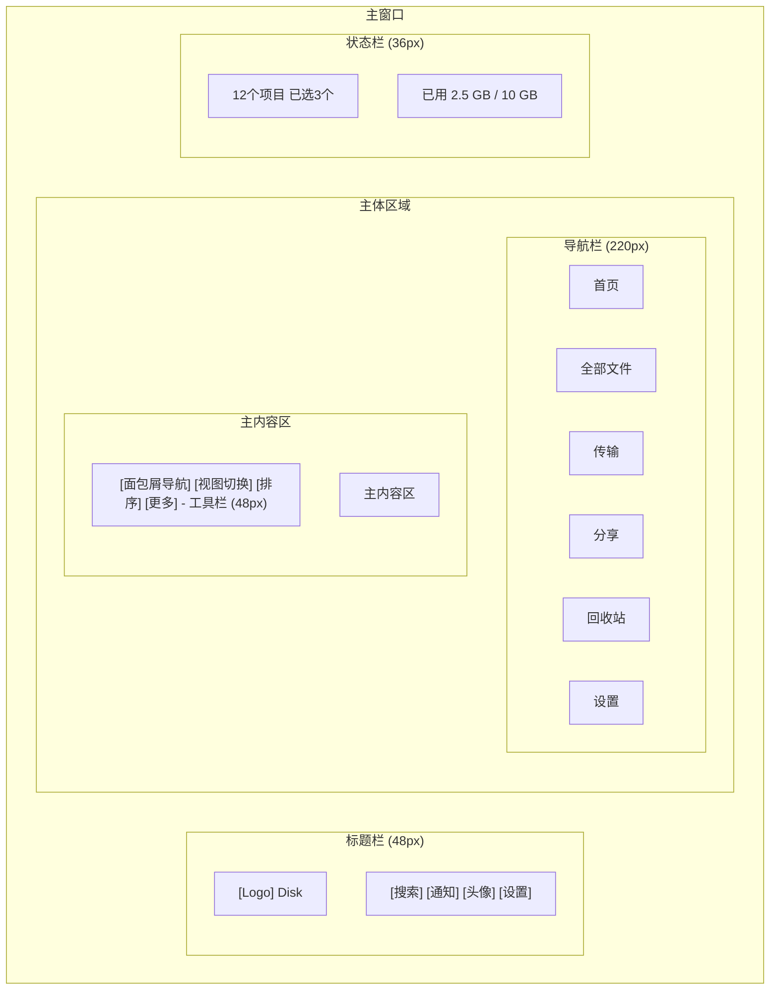

### 3.2 标题栏设计

**高度**: 48px
**背景**: Surface (#FFFFFF) + 底部边框 1px Border

**内容结构**:
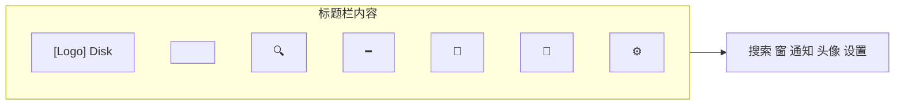

**设计要点**:
- 无边框窗口，自定义标题栏
- Logo + 产品名称在左侧
- 全局搜索框居中偏右
- 窗口控制/用户操作在右侧
- 支持拖拽移动窗口

### 3.3 导航栏设计

**宽度**: 220px（可折叠至 64px）
**背景**: Surface (#FFFFFF) + 右侧边框 1px Border

**内容结构**:
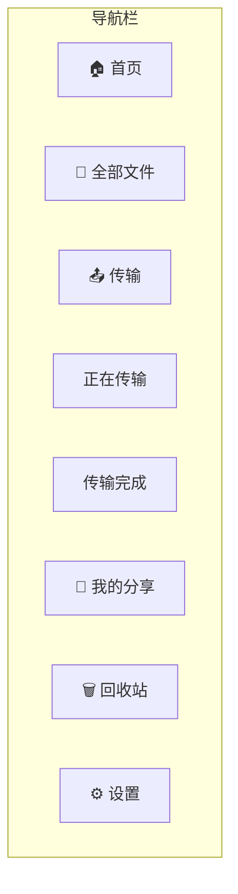

**导航项规格**:
- 高度: 44px
- 图标: 20px
- 文字: 14px Body
- 间距: 图标与文字 12px，左右内边距 16px
- 圆角: 8px（内嵌于 4px 外边距）

**状态样式**:
- 默认: Text Secondary 文字，透明背景
- 悬停: Text Primary 文字，Hover 背景
- 选中: Primary 文字，Primary Light 背景，左侧 3px Primary 色指示条

**可折叠设计**:
- 底部有折叠按钮
- 折叠后只显示图标（64px 宽）
- 悬停显示 Tooltip

### 3.4 工具栏设计

**高度**: 48px
**背景**: Transparent
**边框**: 底部 1px Border

**内容结构（文件页面）**:
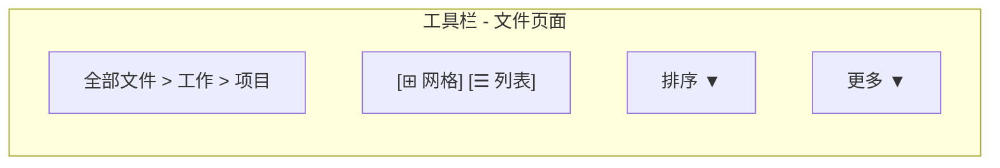

**内容结构（首页）**:
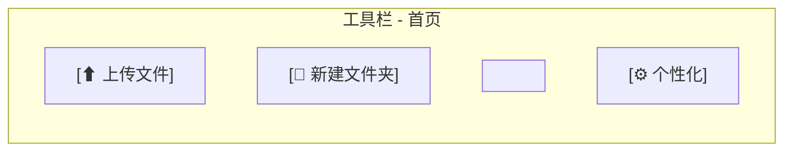

**设计要点**:
- 左侧：面包屑导航或主要操作按钮
- 右侧：视图切换、排序、更多操作
- 按钮间距: 8px

### 3.5 状态栏设计

**高度**: 36px
**背景**: Surface (#FFFFFF) + 顶部边框 1px Border

**内容**:
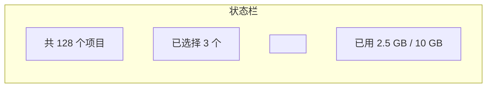

**存储空间指示器**:
- 高度: 6px
- 圆角: 3px
- 背景: Border
- 已用: Primary 渐变 (#06A7FF → #40BFFF)
- 超过 80%: Warning 色
- 超过 95%: Error 色

---

## 4. 组件设计规范

### 4.1 按钮组件

#### 主要按钮 (Primary)
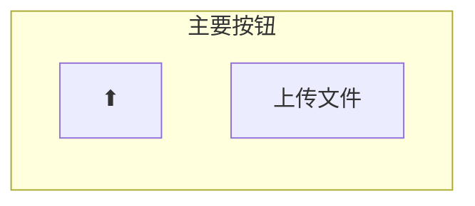

**规格**: 高度: 36px | 背景: Primary | 文字: 白色 14px | 圆角: 4px | 内边距: 0 16px

**状态**:
- 默认: Primary 背景，白色文字
- 悬停: Primary Hover 背景，Scale 1.02
- 按下: Scale 0.98
- 禁用: Background 背景，Text Tertiary 文字

#### 次要按钮 (Secondary)
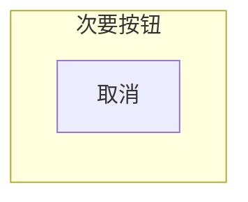

**规格**: 背景: Transparent | 边框: 1px Border | 文字: Text Primary

#### 图标按钮 (Icon Button)
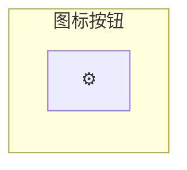

**规格**: 尺寸: 32x32px | 图标: 20px | 圆角: 4px | 悬停: Hover 背景

**规格**: 尺寸: 32x32px | 图标: 20px | 圆角: 4px | 悬停: Hover 背景

#### 胶囊按钮 (Pill)
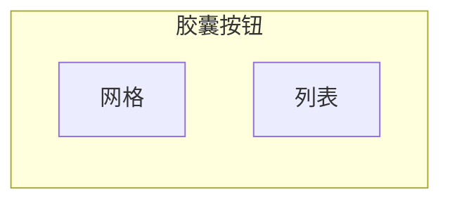

**规格**: 高度: 32px | 圆角: Full (999px) | 选中: Primary 背景

### 4.2 输入框组件

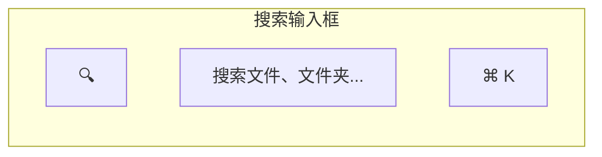

**规格**: 高度: 40px | 背景: Background | 边框: 1px transparent | 圆角: 8px

**状态**:
- 默认: Background 背景，无边框
- 聚焦: Surface 背景，Primary 边框，Shadow SM
- 占位符: Text Tertiary

### 4.3 卡片组件

#### 文件卡片（网格视图）
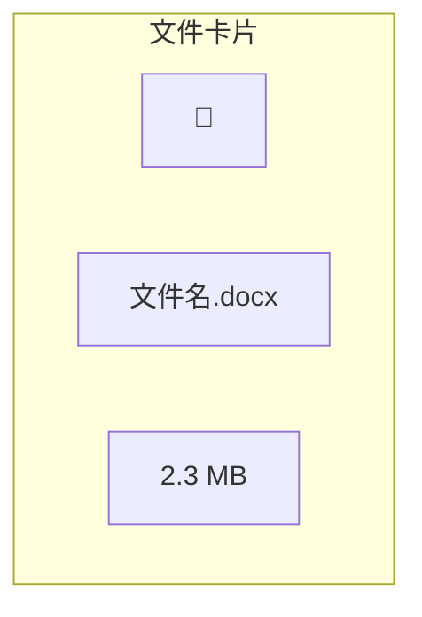

**规格**: 宽度: 120px | 高度: 140px | 图标: 64px (上方 80px 区域) | 圆角: 12px | 背景: Surface | 阴影: Shadow MD (悬停)

**状态**:
- 默认: Surface 背景，Shadow SM
- 悬停: Shadow MD，边框变为 Primary Light
- 选中: Primary Light 背景，Primary 边框

#### 统计卡片（首页）
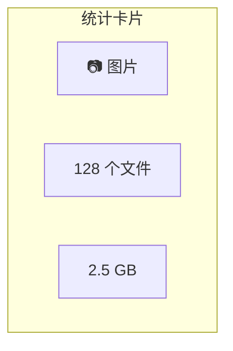

**规格**: 宽度: 自适应 (最小 200px) | 高度: 80px | 圆角: 12px | 图标背景: 分类色 (蓝/绿/橙/紫)

### 4.4 对话框组件

#### 确认对话框
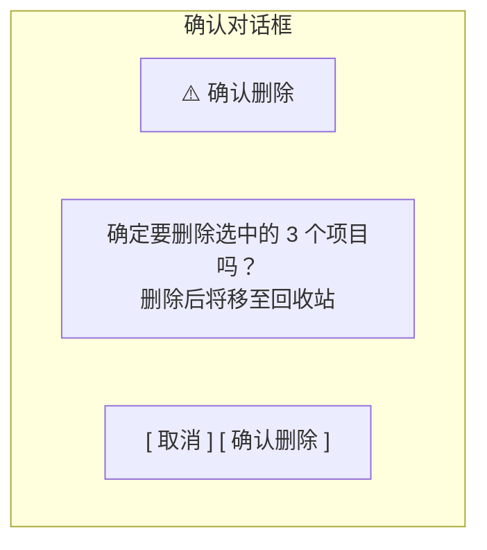

**规格**: 宽度: 400px | 圆角: 16px | 阴影: Shadow XL | 遮罩: rgba(0, 0, 0, 0.45)

#### 输入对话框
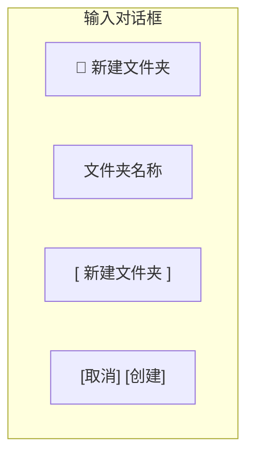

### 4.5 右键菜单组件

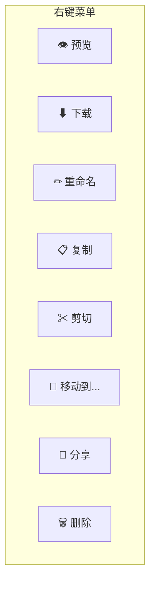

**规格**: 最小宽度: 200px | 行高: 40px | 圆角: 8px | 阴影: Shadow MD | 分割线: 1px Border

### 4.6 进度条组件

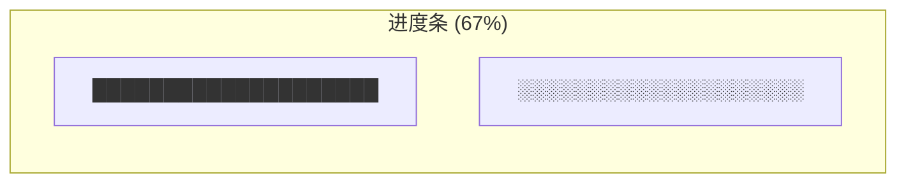

**规格**: 高度: 6px | 圆角: 3px | 已完成: Primary | 未完成: Border | 动画: 传输中显示流光效果

### 4.7 标签/徽章组件

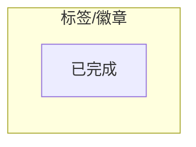

**规格**: 高度: 20px | 圆角: Full | 背景: Success Light | 文字: Success

---

## 5. 文件图标设计

### 5.1 文件夹图标

| 状态 | 图标 | 尺寸 | 说明 |
|------|------|------|------|
| 默认 | 📁 | 64px | 蓝色文件夹 |
| 打开 | 📂 | 64px | 打开的文件夹 |
| 加密 | 🔒 | 20px 角标 | 加密文件夹标记 |

### 5.2 文件类型图标

| 类型 | 颜色 | 背景色 | 扩展名 |
|------|------|--------|--------|
| 图片 | 🟦 蓝 | #E6F6FF | jpg, png, gif, bmp, webp |
| 视频 | 🟥 红 | #FFF0F0 | mp4, avi, mkv, mov, flv |
| 音频 | 🟪 紫 | #F5F0FF | mp3, wav, flac, aac |
| 文档 | 🟦 蓝 | #E6F6FF | doc, docx, txt, rtf |
| 表格 | 🟩 绿 | #F0FFF0 | xls, xlsx, csv |
| 演示 | 🟧 橙 | #FFF5E6 | ppt, pptx, key |
| PDF | 🟥 红 | #FFF0F0 | pdf |
| 代码 | 🟫 灰 | #F5F5F5 | cpp, py, js, html, css |
| 压缩包 | 🟨 黄 | #FFFBE6 | zip, rar, 7z, tar |
| 其他 | ⬜ 灰 | #F5F5F5 | 其他 |

### 5.3 文件列表列定义

**列表视图**:
| 列名 | 宽度 | 对齐 | 说明 |
|------|------|------|------|
| 名称 | 自适应 | 左对齐 | 图标 + 文件名 |
| 大小 | 100px | 右对齐 | 文件大小 |
| 类型 | 100px | 左对齐 | 文件类型 |
| 修改时间 | 150px | 左对齐 | 最后修改 |
| 创建时间 | 150px | 左对齐 | 创建时间 (可选) |

---

## 6. 动画规范

### 6.1 过渡动画

| 场景 | 时长 | 缓动函数 |
|------|------|----------|
| 按钮悬停 | 200ms | ease-out |
| 卡片悬停 | 200ms | ease-out |
| 导航切换 | 250ms | ease-in-out |
| 页面切换 | 300ms | ease-in-out |
| 对话框出现 | 200ms | cubic-bezier(0.16, 1, 0.3, 1) |
| 下拉菜单 | 150ms | ease-out |
| 侧边栏折叠 | 300ms | ease-in-out |

### 6.2 微交互

| 场景 | 动画 |
|------|------|
| 按钮点击 | Scale 0.96 → 1.0，150ms |
| 复选框勾选 | 勾选动画 + 微弹跳 |
| 文件拖入 | 虚线边框 + Primary 色高亮 |
| 上传完成 | 打勾动画 + 轻微缩放 |
| 选中文件 | 边框颜色渐变 + 背景淡入 |
| 刷新 | 图标旋转 360° |

### 6.3 加载动画

**骨架屏**:
- 背景: 线性渐变动画
-  shimmer 效果从左到右
- 周期: 1.5s

**旋转加载器**:
- 尺寸: 24px
- 颜色: Primary
- 周期: 1s
- 线宽: 2px

---

## 7. 响应式设计

### 7.1 断点定义

| 名称 | 宽度 | 说明 |
|------|------|------|
| Compact | < 900px | 导航栏折叠，简化工具栏 |
| Medium | 900-1400px | 导航栏展开，标准布局 |
| Expanded | > 1400px | 导航栏展开，可选详情面板 |

### 7.2 适配策略

#### Compact 模式 (< 900px)
- 导航栏默认折叠，点击汉堡菜单展开
- 工具栏简化，更多操作收入菜单
- 文件网格减少列数
- 状态栏隐藏部分信息

#### Medium 模式 (900-1400px)
- 导航栏展开
- 完整工具栏
- 标准网格布局 (4-6 列)

#### Expanded 模式 (> 1400px)
- 导航栏可展开
- 可选右侧详情面板 (300px)
- 更大的文件网格 (6-8 列)
- 首页显示更多最近文件

---

## 8. 文件管理交互

### 8.1 选择操作

| 操作 | 行为 |
|------|------|
| 单击 | 选中单个文件，取消其他选择 |
| Ctrl+单击 | 切换选中状态 |
| Shift+单击 | 范围选择 |
| Ctrl+A | 全选 |
| 空白处单击 | 取消选择 |

### 8.2 拖拽操作

| 场景 | 行为 |
|------|------|
| 文件拖入窗口 | 显示上传区域遮罩 |
| 拖入文件夹 | 文件夹高亮，释放移动 |
| 同目录拖拽 | 重新排序（如支持）|

### 8.3 快捷键

| 快捷键 | 功能 |
|--------|------|
| Ctrl + N | 新建文件夹 |
| Ctrl + F | 聚焦搜索框 |
| Delete | 删除选中文件 |
| Ctrl + C | 复制 |
| Ctrl + V | 粘贴 |
| Ctrl + X | 剪切 |
| F2 | 重命名 |
| Space | 预览 |
| Ctrl + 1 | 网格视图 |
| Ctrl + 2 | 列表视图 |

---

## 9. 国际化

### 9.1 支持语言

| 语言 | 代码 |
|------|------|
| 简体中文 | zh_CN |
| English | en_US |

### 9.2 文本布局

- 使用 Qt 国际化机制
- 文本长度自适应
- 支持 RTL（未来扩展）

---

## 附录: 设计资源

### 图标资源

- 使用 Fluent UI System Icons
- 格式：SVG
- 尺寸：20x20（默认）、24x24（导航）、48x48（文件图标）

### 参考设计

- 百度网盘桌面客户端
- Microsoft OneDrive
- Dropbox

---

*文档版本: v2.0*
*最后更新: 2026-03-16*
*设计方向: 参考百度网盘现代化界面*
